# 2.1.creating a scatter(산점도)

```r
#기본함수들 보다 ggplot2를 사용하는게 통일된 인터페이스 사용에 좋다
#qplot()은 기본함수와 비슷한 문법, 이 보다 세련된 ggplot()의 그래프 사용 권장
#install.packages("ggplot2")


plot(mtcars$wt,mtcars$mpg)
```

 

```r
# mtcars = 1974년 미국의 Motor Trend 자료
# mpg = miles per gallon 마일당 연비
# wt  = weight 무게
```


```r
library(ggplot2)
qplot(mtcars$wt,mtcars$mpg)
```

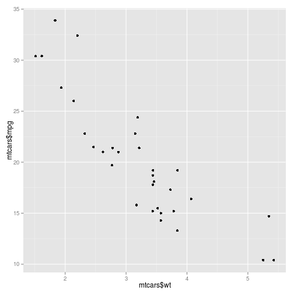 

```r
qplot(wt, mpg, data=mtcars)
```

 

```r
ggplot(mtcars, aes(x=wt, y=mpg)) + geom_point()
```

 


# 2.2.Creating a Line Graph(라인그래프)

```r
#라인 
#32 - 212화씨온도(°F) = 0 - 100 섭씨온도(°C) 
plot(pressure$temperature, pressure$pressure, type="l")
```

 

```r
plot(pressure$temperature, pressure$pressure, type="b")
```

 

```r
plot(pressure$temperature, pressure$pressure, type="c")
```

 

```r
#히스토그램
plot(pressure$temperature, pressure$pressure, type="h")
```

 

```r
plot(pressure$temperature, pressure$pressure, type="n")
```

 

```r
plot(pressure$temperature, pressure$pressure, type="o")
```

 

```r
#포인트
plot(pressure$temperature, pressure$pressure, type="p")
```

 

```r
#s
plot(pressure$temperature, pressure$pressure, type="s")
```

 

```r
plot(pressure$temperature, pressure$pressure, type="l")
points(pressure$temperature, pressure$pressure)
lines(pressure$temperature, pressure$pressure/2, col="red")
lines(pressure$temperature, pressure$pressure/3, col="blue")
points(pressure$temperature, pressure$pressure/2, col="red")
```

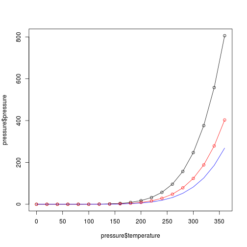 

```r
qplot(pressure$temperature, pressure$pressure, geom="line")
```

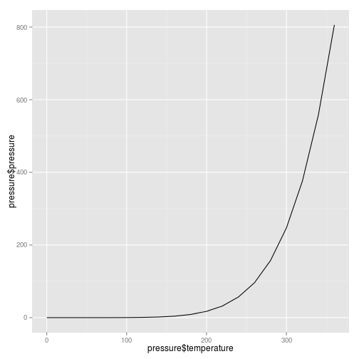 

```r
#위랑같다
qplot(temperature, pressure, data=pressure, geom="line")
```

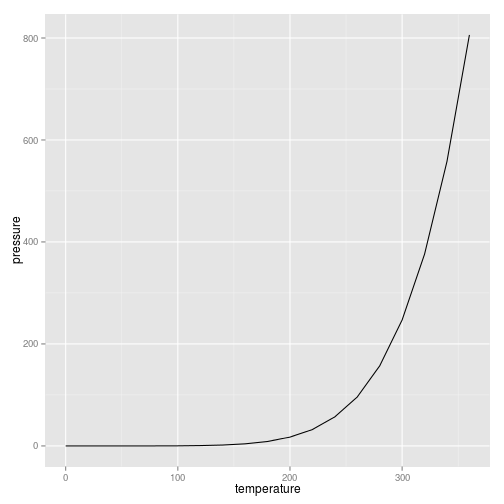 

```r
ggplot(pressure, aes(x=temperature, y=pressure))+ geom_line()
```

 

```r
#라인과 포인트 함께
qplot(temperature, pressure, data=pressure, geom=c("line","point")) 
```

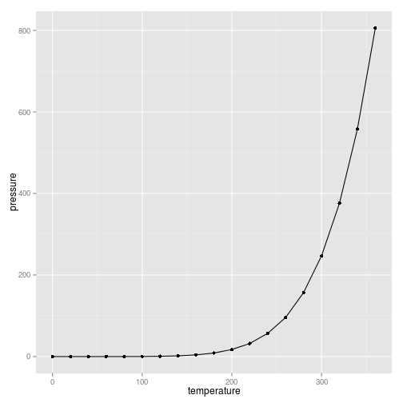 

```r
ggplot(pressure, aes(x=temperature, y=pressure))+ geom_line()+geom_point() 
```

 


#2.3.Creating a Bar Graph(막대그래프)


```r
#BOD [biochemical oxygen demand] 생화학적산소요구량

barplot(BOD$demand, names.arg=BOD$Time)
```

 

```r
table(mtcars$cyl)
```

```
## 
##  4  6  8 
## 11  7 14
```

```r
barplot(table(mtcars$cyl))
```

 

```r
qplot(BOD$Time, BOD$demand, geom="bar", stat="identity")
```

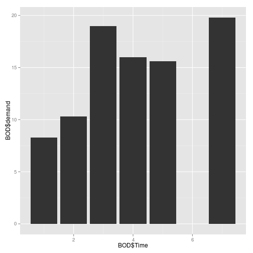 

```r
qplot(factor(BOD$Time), BOD$demand, geom="bar", stat="identity")
```

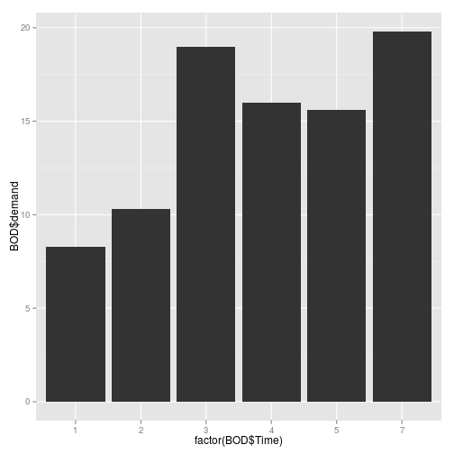 

```r
qplot(mtcars$cyl)
```

```
## stat_bin: binwidth defaulted to range/30. Use 'binwidth = x' to adjust this.
```

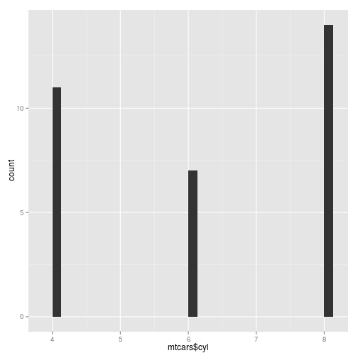 

```r
qplot(factor(mtcars$cyl))
```

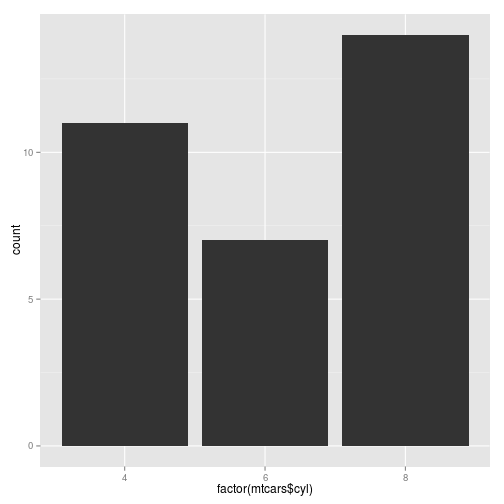 

```r
qplot(Time, demand, data=BOD, geom="bar", stat="identity")
```

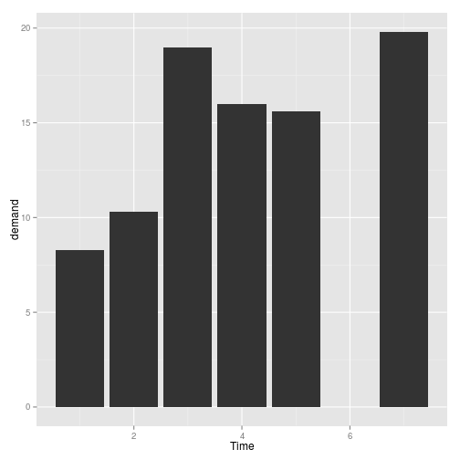 

```r
ggplot(BOD, aes(x=Time, y=demand)) + geom_bar(stat="identity")
```

 

```r
qplot(factor(cyl),data=mtcars)
```

 

```r
ggplot(mtcars, aes(x=factor(cyl))) + geom_bar()
```

 

#2.4.Creating a Histogram(히스토그램)


```r
hist(mtcars$mpg)
```

 

```r
hist(mtcars$mpg,breaks=10)
```

 

```r
qplot(mtcars$mpg)
```

```
## stat_bin: binwidth defaulted to range/30. Use 'binwidth = x' to adjust this.
```

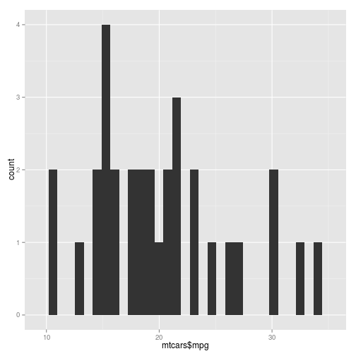 

```r
qplot(mpg, data=mtcars, binwidth=4)
```

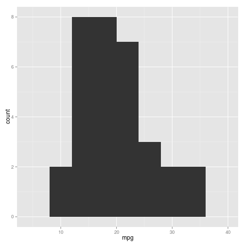 

#2.5.Creating a box plot(박스플롯)

```r
plot(ToothGrowth$supp, ToothGrowth$len)

 boxplot(len ~ supp, data= ToothGrowth)
```

 

```r
qplot(ToothGrowth$supp, ToothGrowth$len, geom="boxplot")
```

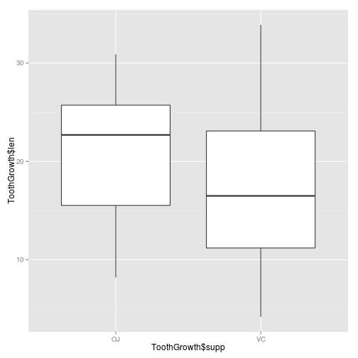 

```r
ggplot(ToothGrowth, aes(x=supp, y=len))+ geom_boxplot()
```

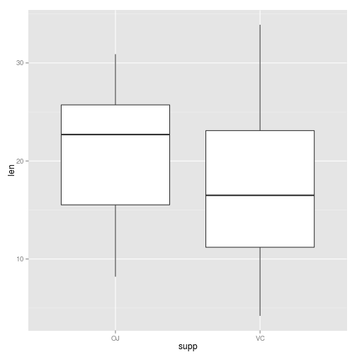 

```r
ggplot(ToothGrowth, aes(x=supp, y=len))+ geom_line()
```

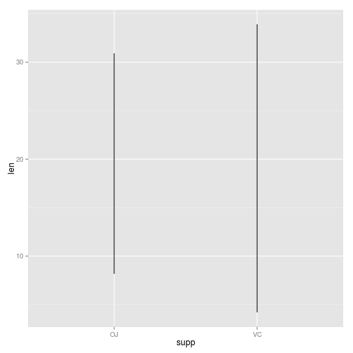 

```r
ggplot(ToothGrowth, aes(x=supp, y=len))+ geom_point()
```

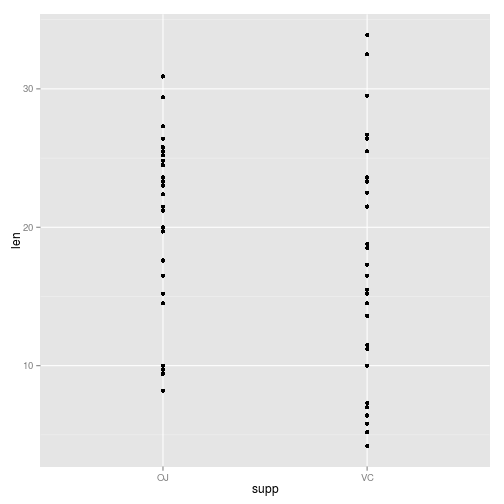 

```r
qplot(supp,len, data=ToothGrowth, geom="boxplot")
```

 

```r
ggplot(ToothGrowth, aes(x=supp, y=len))+ geom_point()
```

 

```r
ggplot(ToothGrowth, aes(x=supp, y=len))+ geom_point()+ geom_boxplot()
```

 

```r
ggplot(ToothGrowth, aes(x=supp, y=len))+ geom_boxplot()+ geom_point()
```

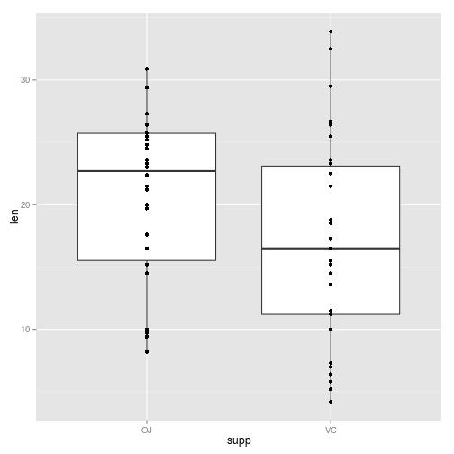 

```r
qplot(interaction(ToothGrowth$supp, ToothGrowth$dose), ToothGrowth$len, geom="boxplot")
```

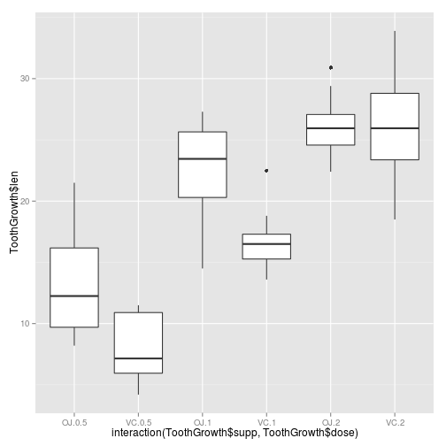 

#2.6.Plotting a function Curve(함수곡선)


```r
curve(x^3-5*x,from=-4, to=4)
```

 

```r
myfun<- function(xvar){ 1/(1+exp(-xvar+10))}
curve(myfun(x), from=0,to=20)
```

 

```r
#curve(1-myfun(x), add = TURE, col = "red")
#Error in curve(1 - myfun(x), add = TURE, col = "red") : 
#  object 'TURE' not found

curve(1-myfun(x),  col = "red")
```

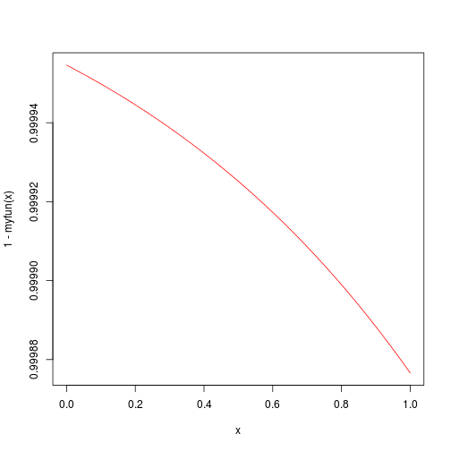 

```r
qplot(c(0,20), fun=myfun, stat="function",geom="line")
```

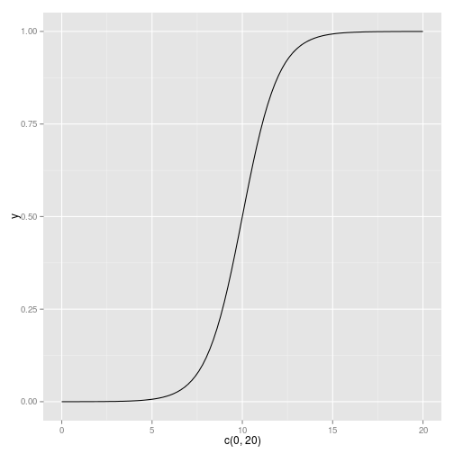 

```r
qplot(c(0,20), fun=myfun, stat="function",geom="point")
```

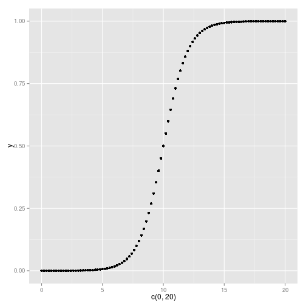 

```r
ggplot(data.frame(x=c(0,20)),aes(x=x))+ stat_function(fun=myfun, geom="line")
```

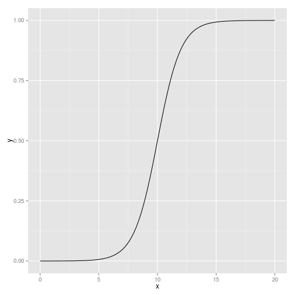 
