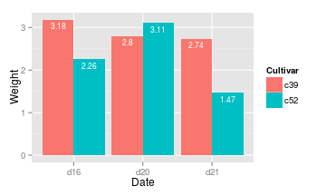

--------------------------------------------------------

**3.1 막대 그래프 그리기**


```r
library(ggplot2)
library(gcookbook)

pg_mean
```

```
##   group weight
## 1  ctrl  5.032
## 2  trt1  4.661
## 3  trt2  5.526
```

```r
ggplot(pg_mean, aes(x=group, y=weight)) + 
  geom_bar(stat="identity")
```

 

- 연속형(continuous) 변수 vs. 이산형(discrete) 변수


```r
BOD
```

```
##   Time demand
## 1    1    8.3
## 2    2   10.3
## 3    3   19.0
## 4    4   16.0
## 5    5   15.6
## 6    7   19.8
```
BOD 데이터에서 Time == 6인 항목이 없으므로, x축을 연속형 데이터로 표현하면 x축에 빈 곳이 생기는데,

```r
ggplot(BOD, aes(x=Time, y=demand)) + 
  geom_bar(stat="identity")
```

 

factor() 함수를 사용하면 이산형 변수로 변환할 수 있음.


```r
ggplot(BOD, aes(x=factor(Time), y=demand)) + 
  geom_bar(stat="identity")
```

 

**막대의 테두리 및 색상 변경**

- 막대의 색은 진회색, 테두리는 없음으로 기본으로 설정되어 있음.
- 막대색 설정: **fill**
- 막대 테두리 설정 : **colour** 혹은 **color**


```r
ggplot(BOD, aes(x=factor(Time), y=demand))+ 
  geom_bar(stat="identity", 
           fill="lightblue", 
           colour="black")
```

 

**3.2 막대를 함께 묶기**

두 번째 변수를 기준으로 막대들을 묶어서 표현.


```r
cabbage_exp
```

```
##   Cultivar Date Weight     sd  n      se
## 1      c39  d16   3.18 0.9566 10 0.30251
## 2      c39  d20   2.80 0.2789 10 0.08819
## 3      c39  d21   2.74 0.9834 10 0.31098
## 4      c52  d16   2.26 0.4452 10 0.14079
## 5      c52  d20   3.11 0.7909 10 0.25009
## 6      c52  d21   1.47 0.2111 10 0.06675
```

- cabbage_exp 안에 Cultivar와 Date라는 범주형 변수와 Weight라는 연속형 변수가 담겨 있음
- Date를 x로 두고 Cultivar로 fill 색상을 결정하면, 하나의 Date에 Cultivar별로 색상이 다른 두개의 막대가 묶여서 그려짐.
- 막대의 fill 색상으로 지정된 변수는 범주형 변수여야 함.
- 두개의 막대가 x축 방향으로 분리되어 있도록 **position="dodge"**로 설정
- dodge 설정이 없으면 누적(stacked) 막대그래프 생성
- stat="identity" 는 R Graphics Cookbook에 나와있지 않지만 설정을 안해주면 에러 뜸


```r
ggplot(cabbage_exp, aes(x=Date, y=Weight, fill=Cultivar))+
  geom_bar(position="dodge", colour="black", stat="identity") + 
  scale_fill_brewer(palette="Pastel1")
```

 

```r
# 팔레트 사용 등 color 사용 관련 부분은 ch.12
```

```
* 주의점 : 값이 없는 경우 그래프 수정
```
- 범주형 변수들의 조합 중 값이 없는 것이 있다면, 해당 막대가 없어짐과 동시에 주변 막대들이 빈 위치를 채우도록 확장됨
- 위의 cabbage_exp 데이터에서 마지막 행을 제외하고 복사해서 불러오면,


```r
ce <- cabbage_exp[1:5, ] #마지막 6행 제외하고 복사
ce
```

```
##   Cultivar Date Weight     sd  n      se
## 1      c39  d16   3.18 0.9566 10 0.30251
## 2      c39  d20   2.80 0.2789 10 0.08819
## 3      c39  d21   2.74 0.9834 10 0.31098
## 4      c52  d16   2.26 0.4452 10 0.14079
## 5      c52  d20   3.11 0.7909 10 0.25009
```

```r
ggplot(ce, aes(x=Date, y=Weight, fill=Cultivar))+
  geom_bar(position="dodge", colour="black", stat="identity") + 
  scale_fill_brewer(palette="Pastel1")
```

 

- 이를 방지하기 위해서는 해당 항목의 y값에 수동으로 NA를 입력


**3.3 빈도수 막대그래프 그리기**

- 하나의 행이 하나의 사건을 나타내는 형식으로 구성된 데이터가 있고, 사건들의 빈도를 그래프로 그리고 싶을때, y에 아무것도 주지 않고 geom_bar() 사용


```r
#diamonds

ggplot(diamonds, aes(x=cut))+geom_bar(stat="bin")
```

 

```r
# geom_bar()함수의 기본 설정은 stat="bin" 이므로 생략 가능
```
- x축에 연속 변수가 오는 경우

```r
ggplot(diamonds, aes(x=carat))+geom_bar()
```

 

```r
# 이 경우, geom_bar 대신 geom_histogram을 사용해도 됨.
```
**3.4 막대그래프에 색상 입히기**

- uspopchange 데이터 : 2000~2010년 미국 주별 인구의 % 변동
- 가장 빨리 성장하는 상위 10개 주와 해당 % 변화 그래프
- 지역별(Northeast, Wouth, North Central, West)로 막대의 색상 다르게 지정
- 상위 10개 주를 추출하여 upc라는 이름의 부분집합을 만듬

```r
uspopchange
```

```
##             State Abb        Region Change
## 1         Alabama  AL         South    7.5
## 2          Alaska  AK          West   13.3
## 3         Arizona  AZ          West   24.6
## 4        Arkansas  AR         South    9.1
## 5      California  CA          West   10.0
## 6        Colorado  CO          West   16.9
## 7     Connecticut  CT     Northeast    4.9
## 8        Delaware  DE         South   14.6
## 10        Florida  FL         South   17.6
## 11        Georgia  GA         South   18.3
## 12         Hawaii  HI          West   12.3
## 13          Idaho  ID          West   21.1
## 14       Illinois  IL North Central    3.3
## 15        Indiana  IN North Central    6.6
## 16           Iowa  IA North Central    4.1
## 17         Kansas  KS North Central    6.1
## 18       Kentucky  KY         South    7.4
## 19      Louisiana  LA         South    1.4
## 20          Maine  ME     Northeast    4.2
## 21       Maryland  MD         South    9.0
## 22  Massachusetts  MA     Northeast    3.1
## 23       Michigan  MI North Central   -0.6
## 24      Minnesota  MN North Central    7.8
## 25    Mississippi  MS         South    4.3
## 26       Missouri  MO North Central    7.0
## 27        Montana  MT          West    9.7
## 28       Nebraska  NE North Central    6.7
## 29         Nevada  NV          West   35.1
## 30  New Hampshire  NH     Northeast    6.5
## 31     New Jersey  NJ     Northeast    4.5
## 32     New Mexico  NM          West   13.2
## 33       New York  NY     Northeast    2.1
## 34 North Carolina  NC         South   18.5
## 35   North Dakota  ND North Central    4.7
## 36           Ohio  OH North Central    1.6
## 37       Oklahoma  OK         South    8.7
## 38         Oregon  OR          West   12.0
## 39   Pennsylvania  PA     Northeast    3.4
## 40   Rhode Island  RI     Northeast    0.4
## 41 South Carolina  SC         South   15.3
## 42   South Dakota  SD North Central    7.9
## 43      Tennessee  TN         South   11.5
## 44          Texas  TX         South   20.6
## 45           Utah  UT          West   23.8
## 46        Vermont  VT     Northeast    2.8
## 47       Virginia  VA         South   13.0
## 48     Washington  WA          West   14.1
## 49  West Virginia  WV         South    2.5
## 50      Wisconsin  WI North Central    6.0
## 51        Wyoming  WY          West   14.1
```

```r
upc<-subset(uspopchange, rank(Change)>40)
upc
```

```
##             State Abb Region Change
## 3         Arizona  AZ   West   24.6
## 6        Colorado  CO   West   16.9
## 10        Florida  FL  South   17.6
## 11        Georgia  GA  South   18.3
## 13          Idaho  ID   West   21.1
## 29         Nevada  NV   West   35.1
## 34 North Carolina  NC  South   18.5
## 41 South Carolina  SC  South   15.3
## 44          Texas  TX  South   20.6
## 45           Utah  UT   West   23.8
```

```r
# subset() : 데이터의 부분집합 취하기 -> 15장 7절 참조
# rank() : 오름차순(작은-> 큰)으로 순위 지정
```

- 테두리(colour) 및 막대색상(scale_fill_manual()) 변경
- reorder() : 알파벳순이 아닌 막대높이(Change) 순으로 x축 데이터 재정렬
- xlab() : x축 라벨의 텍스트 변경 -> 8장 10절
- 변수의 대입(mapping)은 aes() 안에서, 설정(setting)은 aes 외부에 있음


```r
ggplot(upc, aes(x=reorder(Abb, Change), y=Change, fill=Region))+
  geom_bar(stat="identity", colour="black")+
  scale_fill_manual(values=c("#669933","#FFCC66"))+
  xlab("State")
```

 

**3.5 음수와 양수 막대 다르게 색상 입히기**

- climate 데이터의 일부를 가져와(csub : 1900년 이후 Berkely 데이터), 값이 양수인지 음수인지를 나타내는 새로운 열 pos를 생성

```r
csub <- subset(climate, Source=="Berkeley" & Year >= 1900)
csub$pos <- csub$Anomaly10y >= 0
csub
```

```
##       Source Year Anomaly1y Anomaly5y Anomaly10y Unc10y   pos
## 101 Berkeley 1900        NA        NA     -0.171  0.108 FALSE
## 102 Berkeley 1901        NA        NA     -0.162  0.109 FALSE
## 103 Berkeley 1902        NA        NA     -0.177  0.108 FALSE
## 104 Berkeley 1903        NA        NA     -0.199  0.104 FALSE
## 105 Berkeley 1904        NA        NA     -0.223  0.105 FALSE
## 106 Berkeley 1905        NA        NA     -0.241  0.107 FALSE
## 107 Berkeley 1906        NA        NA     -0.294  0.106 FALSE
## 108 Berkeley 1907        NA        NA     -0.312  0.105 FALSE
## 109 Berkeley 1908        NA        NA     -0.328  0.103 FALSE
## 110 Berkeley 1909        NA        NA     -0.281  0.101 FALSE
## 111 Berkeley 1910        NA        NA     -0.247  0.099 FALSE
## 112 Berkeley 1911        NA        NA     -0.243  0.097 FALSE
## 113 Berkeley 1912        NA        NA     -0.257  0.100 FALSE
## 114 Berkeley 1913        NA        NA     -0.268  0.100 FALSE
## 115 Berkeley 1914        NA        NA     -0.257  0.097 FALSE
## 116 Berkeley 1915        NA        NA     -0.249  0.095 FALSE
## 117 Berkeley 1916        NA        NA     -0.214  0.096 FALSE
## 118 Berkeley 1917        NA        NA     -0.201  0.096 FALSE
## 119 Berkeley 1918        NA        NA     -0.176  0.096 FALSE
## 120 Berkeley 1919        NA        NA     -0.182  0.097 FALSE
## 121 Berkeley 1920        NA        NA     -0.193  0.097 FALSE
## 122 Berkeley 1921        NA        NA     -0.167  0.098 FALSE
## 123 Berkeley 1922        NA        NA     -0.128  0.096 FALSE
## 124 Berkeley 1923        NA        NA     -0.075  0.097 FALSE
## 125 Berkeley 1924        NA        NA     -0.064  0.098 FALSE
## 126 Berkeley 1925        NA        NA     -0.065  0.100 FALSE
## 127 Berkeley 1926        NA        NA     -0.050  0.100 FALSE
## 128 Berkeley 1927        NA        NA     -0.020  0.099 FALSE
## 129 Berkeley 1928        NA        NA     -0.018  0.099 FALSE
## 130 Berkeley 1929        NA        NA     -0.026  0.100 FALSE
## 131 Berkeley 1930        NA        NA     -0.014  0.101 FALSE
## 132 Berkeley 1931        NA        NA     -0.047  0.098 FALSE
## 133 Berkeley 1932        NA        NA     -0.035  0.096 FALSE
## 134 Berkeley 1933        NA        NA     -0.017  0.093 FALSE
## 135 Berkeley 1934        NA        NA      0.020  0.092  TRUE
## 136 Berkeley 1935        NA        NA      0.053  0.089  TRUE
## 137 Berkeley 1936        NA        NA      0.063  0.085  TRUE
## 138 Berkeley 1937        NA        NA      0.048  0.081  TRUE
## 139 Berkeley 1938        NA        NA      0.073  0.079  TRUE
## 140 Berkeley 1939        NA        NA      0.113  0.076  TRUE
## 141 Berkeley 1940        NA        NA      0.113  0.072  TRUE
## 142 Berkeley 1941        NA        NA      0.134  0.071  TRUE
## 143 Berkeley 1942        NA        NA      0.134  0.069  TRUE
## 144 Berkeley 1943        NA        NA      0.127  0.070  TRUE
## 145 Berkeley 1944        NA        NA      0.111  0.068  TRUE
## 146 Berkeley 1945        NA        NA      0.072  0.066  TRUE
## 147 Berkeley 1946        NA        NA      0.035  0.066  TRUE
## 148 Berkeley 1947        NA        NA      0.042  0.064  TRUE
## 149 Berkeley 1948        NA        NA      0.045  0.063  TRUE
## 150 Berkeley 1949        NA        NA      0.013  0.062  TRUE
## 151 Berkeley 1950        NA        NA      0.010  0.058  TRUE
## 152 Berkeley 1951        NA        NA     -0.017  0.054 FALSE
## 153 Berkeley 1952        NA        NA     -0.040  0.047 FALSE
## 154 Berkeley 1953        NA        NA     -0.040  0.043 FALSE
## 155 Berkeley 1954        NA        NA     -0.032  0.038 FALSE
## 156 Berkeley 1955        NA        NA     -0.022  0.035 FALSE
## 157 Berkeley 1956        NA        NA      0.012  0.031  TRUE
## 158 Berkeley 1957        NA        NA      0.007  0.028  TRUE
## 159 Berkeley 1958        NA        NA      0.002  0.027  TRUE
## 160 Berkeley 1959        NA        NA      0.002  0.026  TRUE
## 161 Berkeley 1960        NA        NA     -0.019  0.026 FALSE
## 162 Berkeley 1961        NA        NA     -0.001  0.021 FALSE
## 163 Berkeley 1962        NA        NA      0.017  0.018  TRUE
## 164 Berkeley 1963        NA        NA      0.004  0.016  TRUE
## 165 Berkeley 1964        NA        NA     -0.028  0.018 FALSE
## 166 Berkeley 1965        NA        NA     -0.006  0.017 FALSE
## 167 Berkeley 1966        NA        NA     -0.024  0.017 FALSE
## 168 Berkeley 1967        NA        NA     -0.041  0.019 FALSE
## 169 Berkeley 1968        NA        NA     -0.025  0.020 FALSE
## 170 Berkeley 1969        NA        NA     -0.019  0.024 FALSE
## 171 Berkeley 1970        NA        NA      0.010  0.026  TRUE
## 172 Berkeley 1971        NA        NA      0.007  0.022  TRUE
## 173 Berkeley 1972        NA        NA      0.015  0.015  TRUE
## 174 Berkeley 1973        NA        NA      0.028  0.012  TRUE
## 175 Berkeley 1974        NA        NA      0.049  0.014  TRUE
## 176 Berkeley 1975        NA        NA      0.068  0.012  TRUE
## 177 Berkeley 1976        NA        NA      0.128  0.011  TRUE
## 178 Berkeley 1977        NA        NA      0.158  0.012  TRUE
## 179 Berkeley 1978        NA        NA      0.167  0.013  TRUE
## 180 Berkeley 1979        NA        NA      0.193  0.012  TRUE
## 181 Berkeley 1980        NA        NA      0.186  0.016  TRUE
## 182 Berkeley 1981        NA        NA      0.217  0.016  TRUE
## 183 Berkeley 1982        NA        NA      0.235  0.014  TRUE
## 184 Berkeley 1983        NA        NA      0.270  0.014  TRUE
## 185 Berkeley 1984        NA        NA      0.318  0.014  TRUE
## 186 Berkeley 1985        NA        NA      0.344  0.013  TRUE
## 187 Berkeley 1986        NA        NA      0.352  0.012  TRUE
## 188 Berkeley 1987        NA        NA      0.380  0.011  TRUE
## 189 Berkeley 1988        NA        NA      0.370  0.013  TRUE
## 190 Berkeley 1989        NA        NA      0.366  0.017  TRUE
## 191 Berkeley 1990        NA        NA      0.433  0.019  TRUE
## 192 Berkeley 1991        NA        NA      0.467  0.018  TRUE
## 193 Berkeley 1992        NA        NA      0.496  0.017  TRUE
## 194 Berkeley 1993        NA        NA      0.526  0.019  TRUE
## 195 Berkeley 1994        NA        NA      0.554  0.020  TRUE
## 196 Berkeley 1995        NA        NA      0.563  0.019  TRUE
## 197 Berkeley 1996        NA        NA      0.565  0.022  TRUE
## 198 Berkeley 1997        NA        NA      0.618  0.022  TRUE
## 199 Berkeley 1998        NA        NA      0.680  0.023  TRUE
## 200 Berkeley 1999        NA        NA      0.734  0.025  TRUE
## 201 Berkeley 2000        NA        NA      0.748  0.026  TRUE
## 202 Berkeley 2001        NA        NA      0.793  0.027  TRUE
## 203 Berkeley 2002        NA        NA      0.856  0.028  TRUE
## 204 Berkeley 2003        NA        NA      0.869  0.028  TRUE
## 205 Berkeley 2004        NA        NA      0.884  0.029  TRUE
```

```r
ggplot(csub, aes(x=Year, y=Anomaly10y, fill=pos))+geom_bar(stat="identity", position="identity")
```

 

```r
# position="identity"가 없으면 값이 음수인 경우의 막대가 제대로 정의되지 않았다는 경고 메세지 뜸
# position="identity" / "dodge" / "stacked" ?
```

- 색깔을 반대로(파란색이 음수, 빨간색이 양수)
- 범례 삭제
- 테두리(colour) 및 막대 두께(size) 조정


```r
ggplot(csub, aes(x=Year, y=Anomaly10y, fill=pos))+
  geom_bar(stat="identity", position="identity", colour="black", size=0.25 )+
  scale_fill_manual(values=c("#CCEEFF","#FFDDDD"), guide=FALSE)
```

 

**3.6 막대의 너비 및 간격 조절하기**

- 막대너비(width) 설정 : 기본값 0.9(최대 1)


```r
ggplot(pg_mean, aes(x=group, y=weight))+
  geom_bar(stat="identity", width = 0.5)
```

 

```r
ggplot(pg_mean, aes(x=group, y=weight))+
  geom_bar(stat="identity")
```

 

```r
ggplot(pg_mean, aes(x=group, y=weight))+
  geom_bar(stat="identity", width = 1)
```

 

- 막대들이 묶여있는 형태일 때, 간격 없이 붙어있도록 기본설정됨
- 같은 집단에 속한 막대들 사이에 간격 주기 : width를 줄이고 position_dodge의 값을 width보다 크게 설정


```r
ggplot(cabbage_exp, aes(x=Date, y=Weight, fill=Cultivar))+
  geom_bar(stat="identity", width=0.5, position=position_dodge(0.7))
```

 

**3.7 누적 막대그래프 그리기**
- position="dodge"를 사용하지 않으면 누적막대그래프가 됨

```r
ggplot(cabbage_exp, aes(x=Date, y=Weight, fill=Cultivar))+
  geom_bar(stat="identity")
```

 

- 기본 설정으로 출력하면 범례 순서와 막대가 쌓이는 순서가 반대가 되므로, guides()를 사용하여 바꾸어야 할 범례 옵션(fill을 반대로)을 지정


```r
ggplot(cabbage_exp, aes(x=Date, y=Weight, fill=Cultivar))+
  geom_bar(stat="identity")+
  guides(fill=guide_legend(reverse=TRUE))
```

 

- 혹은 막대를 쌓는 순서를 뒤집음(order=desc())
- desc()를 사용하려면 plyr 패키지를 설치, 라이브러리 호출


```r
library(plyr)
ggplot(cabbage_exp, aes(x=Date, y=Weight, fill=Cultivar, order=desc(Cultivar)))+
  geom_bar(stat="identity")
```

 

- 막대 색과 테두리 수정


```r
ggplot(cabbage_exp, aes(x=Date, y=Weight, fill=Cultivar))+
  geom_bar(stat="identity", colour="black")+
  guides(fill=guide_legend(reverse=TRUE))+
  scale_fill_brewer(palette="Pastel1")
```

 

**3.8 비율 누적 막대 그래프 그리기**

- 누적 막대 그래프가 비율을 나타내도록 그리기(100% 기준)
- 누적 막내 내의 데이터가 100%가 되도록 크기 조절  
- "Date"로 나눈 집단별로 transform() 적용 
- plyr 패키지의 ddply() 함수 사용 : 입력된 데이터프레임인 cabbage_exp를 지정된 변수 Date를 기준으로 나눈 뒤, 나뉘어진 조각마다 transform() 적용


```r
ce <- ddply(cabbage_exp, "Date", transform, percent_weight = Weight / sum(Weight)*100)
cabbage_exp
```

```
##   Cultivar Date Weight     sd  n      se
## 1      c39  d16   3.18 0.9566 10 0.30251
## 2      c39  d20   2.80 0.2789 10 0.08819
## 3      c39  d21   2.74 0.9834 10 0.31098
## 4      c52  d16   2.26 0.4452 10 0.14079
## 5      c52  d20   3.11 0.7909 10 0.25009
## 6      c52  d21   1.47 0.2111 10 0.06675
```

```r
ce
```

```
##   Cultivar Date Weight     sd  n      se percent_weight
## 1      c39  d16   3.18 0.9566 10 0.30251          58.46
## 2      c52  d16   2.26 0.4452 10 0.14079          41.54
## 3      c39  d20   2.80 0.2789 10 0.08819          47.38
## 4      c52  d20   3.11 0.7909 10 0.25009          52.62
## 5      c39  d21   2.74 0.9834 10 0.31098          65.08
## 6      c52  d21   1.47 0.2111 10 0.06675          34.92
```

```r
ggplot(ce, aes(x=Date, y=percent_weight, fill=Cultivar))+
  geom_bar(stat="identity", colour="black")+
  guides(fill=guide_legend(reverse=TRUE))+
  scale_fill_brewer(palette="Pastel1")
```

 

**3.9 막대 그래프에 라벨 추가하기**

- 막대 라벨 추가 : geom_text()
- interaction(): "."을 가운데 넣으면서 값을 이어붙여줌. 두개의 열을 합쳐서 보여줌(15장 13절)
- vjust(vertical justification : 수직 맞춤) 설정으로 텍스트를 막대의 상단 위아래로 움직일 수 있음


```r
#라벨이 막대 위쪽 선으로부터 하단에 위치
ggplot(cabbage_exp, aes(x=interaction(Date, Cultivar), y=Weight))+
  geom_bar(stat="identity")+
  geom_text(aes(label=Weight), vjust=1.5, colour="white")
```

 

```r
#라벨이 막대 위쪽 선으로부터 상단에 위치
ggplot(cabbage_exp, aes(x=interaction(Date, Cultivar), y=Weight))+
  geom_bar(stat="identity")+
  geom_text(aes(label=Weight), vjust=-0.2)
```

 

- 라벨이 막대 위쪽 선 상단에 위치할 경우 위의 그림처럼 그래프 영역 밖으로 삐져나오거나 잘릴 수 있는데, 이를 해결하기 위해서는
- 1) y 의 한계를 조금 높임: ylim()
- 2) y의 위치를 막대의 위쪽 선보다 조금 높은 위치로 대입 (그래프의 y범위는 자동으로 조절)

```r
# 1) y 의 한계를 조금 높임
ggplot(cabbage_exp, aes(x=interaction(Date, Cultivar), y=Weight))+
  geom_bar(stat="identity")+
  geom_text(aes(label=Weight), vjust=-0.2)+
  ylim(0,max(cabbage_exp$Weight)*1.05)
```

 

```r
# 2) y의 위치를 막대의 위쪽 선보다 조금 높은 위치로 대입
ggplot(cabbage_exp, aes(x=interaction(Date, Cultivar), y=Weight))+geom_bar(stat="identity")+geom_text(aes(y=Weight+0.1, label=Weight))
```

 

```r
# 묶인 막대 그래프로 변환, 라벨텍스트 size 변경(기본은 5)
ggplot(cabbage_exp, aes(x=Date, y=Weight, fill=Cultivar))+
  geom_bar(stat="identity", position="dodge")+
  geom_text(aes(label=Weight), vjust=1.5, colour="white", position=position_dodge(0.9), size=3)
```

 

- 누적 막대그래프에 라벨을 달고 싶을 때는, 누적 합계가 맞게 계산되도록 먼저 데이터의 순서를 정렬함 : plyr 패키지의 arrange()
- cabbage_exp의 데이터를 날짜(Date)와 품종(Cultivar)을 기준으로 정렬
- ddply() 로 Date를 기준으로 데이터를 자르고, 잘린 데이터들 내 Weight값의 누적 합계를 계산하여 transform
- cumsum(): cummulative sums. 여기서는 Date를 기준으로 데이터를 잘랐기 때문에 동일 Date 내에서만 누적 합계가 적용되는 듯??


```r
# ce : Date와 cultivar를 기준으로 정렬
ce <- arrange(cabbage_exp, Date, Cultivar)
# 누적 합계 얻기
ce <- ddply(ce, "Date", transform, label_y=cumsum(Weight))
ce
```

```
##   Cultivar Date Weight     sd  n      se label_y
## 1      c39  d16   3.18 0.9566 10 0.30251    3.18
## 2      c52  d16   2.26 0.4452 10 0.14079    5.44
## 3      c39  d20   2.80 0.2789 10 0.08819    2.80
## 4      c52  d20   3.11 0.7909 10 0.25009    5.91
## 5      c39  d21   2.74 0.9834 10 0.31098    2.74
## 6      c52  d21   1.47 0.2111 10 0.06675    4.21
```

```r
ggplot(ce, aes(x=Date, y=Weight, fill=Cultivar))+
  geom_bar(stat="identity")+
  geom_text(aes(y=label_y, label=Weight), vjust=1.5, colour="white" )
```

 

- 막대의 상단이 아닌 가운데에 라벨을 넣으려면 label_y의 값을 조정
- 범례를 막대를 쌓은 순서와 동일하게 변경
- 라벨 크기 줄임
- 라벨값이 단위(kg) 붙임 : paste()
- 라벨값의 소수점이 항상 두 자리가 되도록 설정: format()

```r
# 라벨의 y값 조정
ce <- ddply(ce, "Date", transform, label_y=cumsum(Weight)-0.5*Weight)
ggplot(ce, aes(x=Date, y=Weight, fill=Cultivar))+
  geom_bar(stat="identity", colour="black")+
  geom_text(aes(y=label_y, label=paste(format(Weight, nsmall=2), "kg")), size=4)+
  guides(fill=guide_legend(reverse=TRUE))+scale_fill_brewer(palette="Pastel1")
```

 

**3.10 클리블랜드 점 그래프 그리기**

- Cleveland Dot Plot : 막대그래프보다 시각적으로 덜 어수선하고 읽기 쉬움
- geom_point() 사용

```r
# tophitters2001 데이터에서 1~25번째 데이터를 가져옴
tophit <- tophitters2001[1:25, ]
ggplot(tophit, aes(x=avg, y=name))+geom_point()
```

 

- name을 avg 순으로 정렬(문자열 벡터이기 대문에 기본 알파벳순 정렬) : 문자열 name을 요인(factor)로 만든 후 redorder(name, avg)
- 점의 크기를 키우고, 테마 시스템을 사용하여 수직 격자를 없애고, 수평선을 점선으로(테마 사용하기 -> 9장 3절)

```r
ggplot(tophit, aes(x=avg, y=reorder(factor(name), avg)))+
  geom_point(size=3)+
  theme_bw()+
  theme(panel.grid.major.x=element_blank(), 
        panel.grid.minor.x=element_blank(),
        panel.grid.major.y=element_line(colour="grey60", linetype="dashed"))
```

 


```r
# x-y축을 바꾸고, 라벨을 60도 회전
ggplot(tophit, aes(x=reorder(name, avg), y=avg))+
  geom_point(size=3)+
  theme_bw()+
  theme(axis.text.x = element_text(angle=60, hjust=1),
        panel.grid.major.y=element_blank(), 
        panel.grid.minor.y=element_blank(),
        panel.grid.major.x=element_line(colour="grey60", linetype="dashed"))
```

 

- 제 3의 요인인 lg(National/American League)를 기준으로 집단 구분
- 먼저 lg 기준으로 정렬 후 avg 기준으로 정렬...하고 싶은데,
- reorder() 함수로는 한가지 요인 기준 정렬만 가능하므로, 수동으로 정렬


```r
# lg로 먼저, 그 다음 avg로 정렬한 이름을 가져온다
nameorder <-tophit$name[order(tophit$lg, tophit$avg)]
# name을 factor로 변환 - nameorder 순으로 정렬
tophit$name <- factor(tophit$name, levels = nameorder)
```

- point의 colour에 lg를 대입
- 그래프의 선이 점까지만 가도록 설정 :geom_segment()


```r
ggplot(tophit, aes(x=avg, y=name))+
  geom_segment(aes(yend=name), xend=0, colour="grey50")+
  geom_point(size=3, aes(colour=lg))+
  scale_colour_brewer(palette="Set1", limit=c("NL","AL"))+
  theme_bw()+
  theme(panel.grid.major.y = element_blank(),  #수평 격자선 삭제
        legend.position=c(1,0.55), # 범례를 그래프 안쪽으로 이동
        legend.justification=c(1,0.5)) # 범례박스 위치 결정
```

 

- 면 분할(facet)을 사용하여 집단 구분하기

```r
ggplot(tophit, aes(x=avg, y=name))+
  geom_segment(aes(yend=name), xend=0, colour="grey50")+
  geom_point(size=3, aes(colour=lg))+
  scale_colour_brewer(palette="Set1", limits=c("NL","AL"), guide=FALSE)+
  theme_bw()+
  theme(panel.grid.major.y = element_blank())+  #수평 격자선 삭제
  facet_grid(lg ~ ., scales="free_y", space="free_y") #lg를 기준으로 면 분할
```

 
