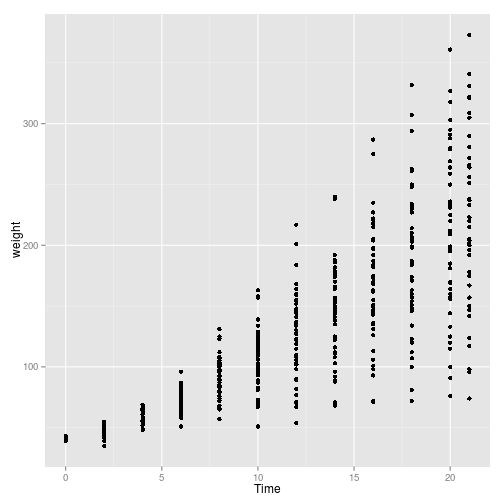

##5.1 산점도 그리기
## 산점도 : 두가지 연속 변수의 관계를 보여주기 위해서 사용 geom_point() 는 점을 그리기 위한 것


```r
library(ggplot2)
library(gcookbook)
ggplot(heightweight, aes(x=ageYear, y=heightIn)) + geom_point()
```

 


## size, shape 조절 geom_point(size or shape)
## shape defualt 16, size default = 2


##5.2 변수 기준으로 데이터 묶기


```r
ggplot(heightweight, aes(x=ageYear, y=heightIn, colour=sex, shape=sex)) + geom_point()  ## scale_shape_manual(values=c(1,2)) + sclae_color_brewer(palette="Set1") p.75
```

 


##5.4 연속변수를 색상이나 크기에 대입(세번째 연속변수 나타내고 싶을 때)


```r
ggplot(heightweight, aes(x=ageYear, y=heightIn, color=weightLb)) + geom_point()
```

 

```r
ggplot(heightweight, aes(x=ageYear, y=heightIn, color=weightLb)) + geom_point() + scale_color_gradient(low="black", high="white")
```

 

##5.5 겹치는 점 다루기, 데이터 점이 너무 많아서 겹칠때

```r
sp <- ggplot(diamonds, aes(x=carat, y=price))
sp + geom_point()
```

 

```r
sp + geom_point(alpha=.01)  ##alpha 투명도 설정
```

 

```r
sp + stat_bin2d(binds=50) + scale_fill_gradient(low="black", high="white")  ##binning(네모난 상자로데이터 묶어서)
```

 

```r
sp1 <- ggplot(ChickWeight, aes(x=Time, y=weight))
sp1 + geom_point()
```

 

```r
sp1 + geom_point(position="jitter")     ##jitter(조금씩 움직여) 표시가능
```

 


##5.6 회귀선 추가

```r
sp <-ggplot(heightweight, aes(x=ageYear, y=heightIn))
sp + geom_point() + stat_smooth(method=lm, level=0.99)    ##lm 선형모형 ##se=FALSE로 신뢰구간 끌 수도 있음
```

 


## error..
library(MASS)
b <- biopsy
b$classn[b$class=="benign"] <- 0
b$classn[b$cl1ass=="malignant"] <- 1

##biopsy 두께와 종양 종류와의 관계
ggplot(b, aes(x=V1, y=classn)) + geom_point() + stat_smooth(method=glm, family=binomial) ##로지스틱 회귀분석, 이산적 확률분포
ggplot(b, aes(x=V1, y=classn)) + geom_point(position=position_jitter) + stat_smooth(method=glm, family=binomial)
```


##산점도 내 요인을 기준으로 각 집단에 대해서 적합성 그리기

```r
sps <- ggplot(heightweight, aes(x=ageYear, y=heightIn, color=sex)) + geom_point() 
sps + geom_smooth(method=lm) #남,여에 대한 선형 모형
```

 

#5.7 이미 만들어진 모형의 적합선 추가

```r
model <- lm(heightIn ~ ageYear + I(ageYear^2), data = heightweight) #ageYear 를 heightIn의 예측변수로 두고 
model
```

```
## 
## Call:
## lm(formula = heightIn ~ ageYear + I(ageYear^2), data = heightweight)
## 
## Coefficients:
##  (Intercept)       ageYear  I(ageYear^2)  
##      -10.314         8.667        -0.248
```

```r
xmin <- min(heightweight$ageYear) #내삽법(주어진 데이터 사이의 미지의 값 구하기) ageYear 기준
xmax <- max(heightweight$ageYear)

predicted <- data.frame(ageYear=seq(xmin, xmax, length.out=100))   ##length는 빈도수, seq는 벡터 생성

predicted$heightIn <- predict(model,predicted)  #heightIn의 예측값 계산
sp <- ggplot(heightweight, aes(x=ageYear, y=heightIn)) + geom_point()
sp + geom_line(data=predicted, size =1)
```

 

#5.9 모형계수들 주석으로 추가 (모형에 대한 정보 그래프에 추가)

model <- lm(heightIn ~ ageYear, heightweight)
summary(model)


sp <-ggplot(heightweight, aes(x=ageYear, y=heightIn))
sp + geom_point() + stat_smooth(method=lm, level=0.99) 
sp + geom_point() + stat_smooth(method=lm, level=0.99) + annotate("text", label="r^2=0.42", x=16.5, y=52)

##eqn <- as.character(as.expression(substitue(italic(y) == a + b * italic(x) * "," ~~ italic(r)^2 ~ "=" ~ r2, list(a=format(coef(model)[1], digits=3), b=format(coef(model)[2], digits=3), r2 = format(summary(model)$r.squared.digits=2)))))  ##error 표현식 만들어 내는 방법
#parse(text=eqn)
#sp + annotate("text", label=eqn, parse=TRUE, x=Inf, y=-Inf, hjust=1.1, vjust=-.5)

#5.10 산점도에 여백 러그 추가

```r
ggplot(faithful, aes(x=eruptions, y=waiting)) + geom_point() + geom_rug()  #한눈에 알아볼 수 있게
```

 

#5.11 산점도 점에 라벨 붙이기, annotate() or geom_text()

```r
sp <- ggplot(subset(countries, Year==2009 & healthexp>2000), aes(x=healthexp, y=infmortality)) + geom_point() #의료비와 1000명 대비 유아 사망률 관계, 2009년
sp + annotate("text", x=4350, y=5.4, label="Canada")    
```

 

```r
sp + geom_text(aes(label=Name, size=2, vjust=0))
```

 

```r
sp + geom_text(aes(label=Code, size=2))  
```

 

```r
## vjust로 텍스트 상하조절, hjust 좌우
```

##5.12 거품 그래프(점의 영역이 수치형 값에 비례하는 그래프)

```r
cdat <- subset(countries, Year==2009 & healthexp>2000)
p <- ggplot(cdat, aes(x=healthexp, y=infmortality, size=GDP)) + geom_point()
p    #GDP를 반지름에 대입
```

```
## Warning: Removed 2 rows containing missing values (geom_point).
```

 

```r
p + scale_size_area()   #GDP를 영역에 대입, 원의 크기 확대
```

```
## Warning: Removed 2 rows containing missing values (geom_point).
```

 

##5.13 산점도 행렬 (여러 변수들의 관계를 두개씩 짝지어 시각화)

```r
#c2009 <- subset(countries, Year==2009, select=c(Name, GDP, laborrate, healthexp, infmortality))   ##error

#pairs(c2009[,2:5])   2~5열까지 사용
```
