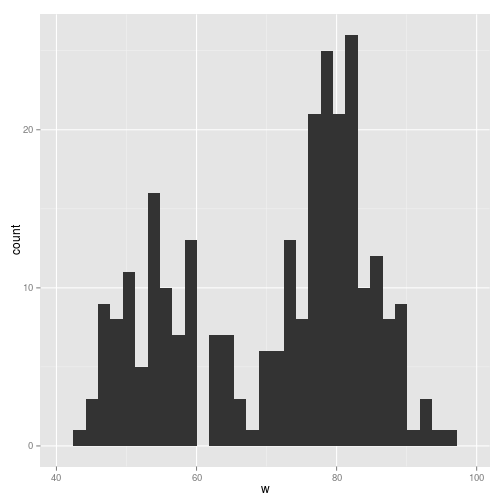
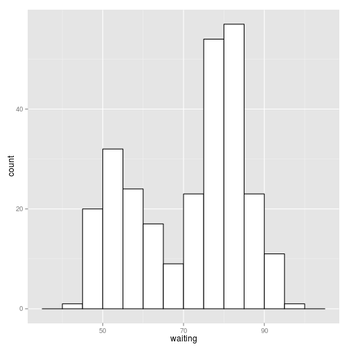
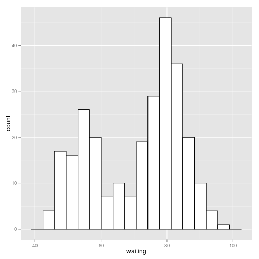
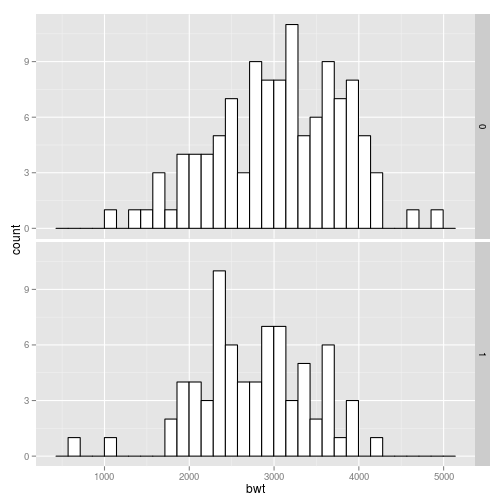

```r
library(ggplot2)
library(gcookbook)
```

# histogram을 만들고 싶다.

```r
ggplot(faithful, aes(x=waiting)) + geom_histogram()
```

```
## stat_bin: binwidth defaulted to range/30. Use 'binwidth = x' to adjust this.
```

 

```r
head(faithful)
```

```
##   eruptions waiting
## 1     3.600      79
## 2     1.800      54
## 3     3.333      74
## 4     2.283      62
## 5     4.533      85
## 6     2.883      55
```

```r
w <- faithful$waiting
ggplot(NULL, aes(x=w)) + geom_histogram()
```

```
## stat_bin: binwidth defaulted to range/30. Use 'binwidth = x' to adjust this.
```

 

# 빈의 넒이조정 연습(빈의 넓이를 5로 설정)

```r
ggplot(faithful, aes(x=waiting)) +
geom_histogram(binwidth=5, fill="white", colour="black")
```

 

# x 의 범위를 30개에서 15개의 빈으로 나눔

```r
binsize <- diff(range(faithful$waiting))/15
ggplot(faithful, aes(x=waiting)) +
geom_histogram(binwidth=binsize, fill="white", colour="black")
```

 


# 데이터에 여러 집단이 있는데 이 집단들의 히스토그램을 만들고 싶다. 

```r
library(MASS) #데이터 세트를 위해

#면을 분할하는 변수로 smoke를 사용
ggplot(birthwt, aes(x=bwt)) + geom_histogram(fill="white", colour="black") +  facet_grid(smoke ~ .)
```

```
## stat_bin: binwidth defaulted to range/30. Use 'binwidth = x' to adjust this.
## stat_bin: binwidth defaulted to range/30. Use 'binwidth = x' to adjust this.
```

 
