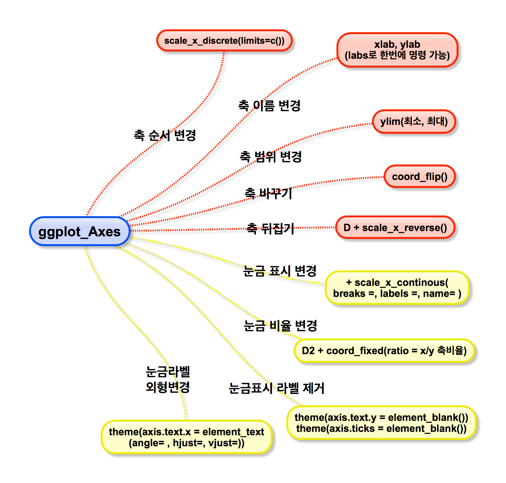

## 날짜 : 2014년 10월 17일 금요일
## 발표자 : 최창순




```{r}
library(gcookbook)
library(ggplot2)
hwp <- ggplot(heightweight, aes(x=ageYear, y=heightIn, colour = sex)) + geom_point()
hwp
```

#### 1. X,Y축 맞바꾸기
```{r}
hwp_flip <- hwp + coord_flip()
hwp_flip
```

#### 2. 연속적인 축 범위 설정
```{r}
hwp + ylim(20, max(heightweight$heightIn))
```
```{r}
hwp + scale_y_continuous(limits=c(0, max(heightweight$heightIn)))
```

#### 3. 축 뒤집기(위,아래 반전)
```{r}
hwp + scale_y_reverse()
```

#### 5. 축의 눈금 비율 설정
```{r}
hwp_fix <- hwp + coord_fixed()
hwp_fix
```
```{r}
hwp_fix + coord_fixed(ratio = 1/2)
```

#### 6. 눈금 표시 변경
```{r}
hwp + scale_y_continuous(breaks = seq(50, 80, 1))

hwp + scale_y_continuous(breaks = c(50, 56, 60, 66, 72),
                         labels = c("Tiny", "Really\nshort", "Short",
                                    "Medium", "Tallish"))

hwp + scale_y_continuous(breaks = c(50, 56, 60, 66, 72),
                         labels = c("Tiny", "Really\nshort", "Short",
                                    "Medium", "Tallish")) + theme(axis.ticks = element_blank(), axis.text.y = element_blank())
```


#### 7. 축 이름 변경
```{r}
hwp + xlab("Ages in years") + ylab("Height in inches")
```

#### 8. 눈금 라벨 외형변경
```{r}
bp <- ggplot(PlantGrowth, aes(x=group, y=weight)) + geom_boxplot() +
               scale_x_discrete(breaks = c("ctrl", "trt1", "trt2"),
                                labels = c("Control", "Treatment 1","Treatment 2"))
bp

## 90도 회전 및 텍스트 정렬
## hjust(위,아래), vjust(왼쪽, 오른쪽)
bp + theme(axis.text.x = element_text(angle=45, hjust = 0.5, vjust = 0.5))
```

#### 9. 축의 선 표시
```{r}
hwp + theme(axis.line = element_line(colour="black", size = 5, lineend="square"))
```


## 원형 그래프 그리기
```{r}
str(wind)
head(wind)
ggplot(wind, aes(x=DirCat, fill=SpeedCat)) + geom_histogram(binwidth=15, origin = -7.5) + coord_polar() + scale_x_continuous(limits=c(0,360))
```


## Economics data 응용하기
```{r}
str(economics)
head(economics)

ggplot(economics, aes(x=date, y=psavert)) + geom_line()

## 위 자료중 일부 날짜를 설정하여 따로 그래프를 그리고 싶다
## 1992년 중반~1993년 중반

econ <- subset(economics, date >= as.Date("1992-05-01") & date < as.Date("1993-06-01"))
p <- ggplot(econ, aes(x=date, y=psavert)) + geom_line()
p

## x축을 좀더 잘 설명하기 위해 눈금 표시를 바꿔보자
datebreaks <- seq(as.Date("1992-06-01"), as.Date("1993-06-01"), by="2 month")
p + scale_x_date(breaks=datebreaks) + theme(axis.text.x = element_text(angle=30, hjust =1))

## location 설정에 유의하자
library(scales)
Sys.setlocale("LC_TIME", "en_US.UTF-8") ### 미국
p + scale_x_date(breaks=datebreaks, labels = date_format("%A %Y")) + theme(axis.text.x = element_text(angle=30, hjust=1))
```


## 시계열 자료 plotting
```{r}
www <- data.frame(minute = as.numeric(time(WWWusage)),
                  users = as.numeric(WWWusage))

timeHM_formatter <- function(x){
  h <- floor(x/60)
  m <- floor(x %% 60)
  lab <- sprintf("%d:%02d",h,m)
  return(lab)
}

ggplot(www, aes(x=minute, y=users)) + geom_line()
ggplot(www, aes(x=minute, y=users)) + geom_line() + 
  scale_x_continuous(name = "time", breaks=seq(0, 100, by=10), labels=timeHM_formatter)

```

