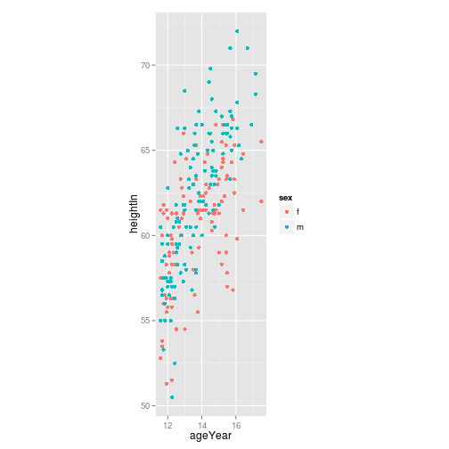
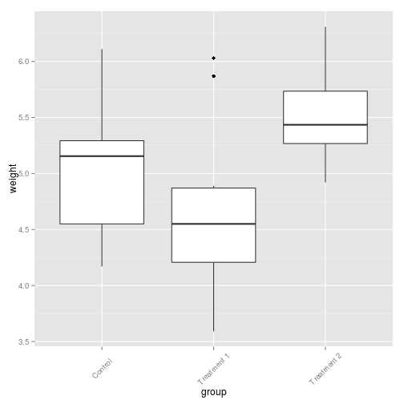

## 날짜 : 2014년 10월 17일 금요일
## 발표자 : 최창순


```r
library(gcookbook)
library(ggplot2)
hwp <- ggplot(heightweight, aes(x=ageYear, y=heightIn, colour = sex)) + geom_point()
hwp
```

 

#### 1. X,Y축 맞바꾸기

```r
hwp_flip <- hwp + coord_flip()
hwp_flip
```

 

#### 2. 연속적인 축 범위 설정

```r
hwp + ylim(20, max(heightweight$heightIn))
```

 

```r
hwp + scale_y_continuous(limits=c(0, max(heightweight$heightIn)))
```

 

#### 3. 축 뒤집기(위,아래 반전)

```r
hwp + scale_y_reverse()
```

 

#### 5. 축의 눈금 비율 설정

```r
hwp_fix <- hwp + coord_fixed()
hwp_fix
```

 

```r
hwp_fix + coord_fixed(ratio = 1/2)
```

 

#### 6. 눈금 표시 변경

```r
hwp + scale_y_continuous(breaks = seq(50, 80, 1))
```

 

```r
hwp + scale_y_continuous(breaks = c(50, 56, 60, 66, 72),
                         labels = c("Tiny", "Really\nshort", "Short",
                                    "Medium", "Tallish"))
```

 

```r
hwp + scale_y_continuous(breaks = c(50, 56, 60, 66, 72),
                         labels = c("Tiny", "Really\nshort", "Short",
                                    "Medium", "Tallish")) + theme(axis.ticks = element_blank(), axis.text.y = element_blank())
```

 


#### 7. 축 이름 변경

```r
hwp + xlab("Ages in years") + ylab("Height in inches")
```

 

#### 8. 눈금 라벨 외형변경

```r
bp <- ggplot(PlantGrowth, aes(x=group, y=weight)) + geom_boxplot() +
               scale_x_discrete(breaks = c("ctrl", "trt1", "trt2"),
                                labels = c("Control", "Treatment 1","Treatment 2"))
bp
```

 

```r
## 90도 회전 및 텍스트 정렬
## hjust(위,아래), vjust(왼쪽, 오른쪽)
bp + theme(axis.text.x = element_text(angle=45, hjust = 0.5, vjust = 0.5))
```

 

#### 9. 축의 선 표시

```r
hwp + theme(axis.line = element_line(colour="black", size = 5, lineend="square"))
```

 


## 원형 그래프 그리기

```r
str(wind)
```

```
## 'data.frame':	286 obs. of  7 variables:
##  $ TimeUTC : int  0 5 10 15 20 25 30 35 40 45 ...
##  $ Temp    : num  3.54 3.52 3.53 3.63 3.71 3.73 3.56 3.63 3.59 3.82 ...
##  $ WindAvg : num  9.52 9.1 8.73 8.97 8.51 8.43 8.12 8.47 8.27 8.76 ...
##  $ WindMax : num  10.39 9.9 9.51 9.9 9.41 ...
##  $ WindDir : int  89 92 92 94 97 95 98 101 101 101 ...
##  $ SpeedCat: Factor w/ 5 levels "<5","5-10","10-15",..: 3 2 2 2 2 2 2 2 2 2 ...
##  $ DirCat  : num  90 90 90 90 90 90 105 105 105 105 ...
```

```r
head(wind)
```

```
##   TimeUTC Temp WindAvg WindMax WindDir SpeedCat DirCat
## 3       0 3.54    9.52   10.39      89    10-15     90
## 4       5 3.52    9.10    9.90      92     5-10     90
## 5      10 3.53    8.73    9.51      92     5-10     90
## 6      15 3.63    8.97    9.90      94     5-10     90
## 7      20 3.71    8.51    9.41      97     5-10     90
## 8      25 3.73    8.43    9.02      95     5-10     90
```

```r
ggplot(wind, aes(x=DirCat, fill=SpeedCat)) + geom_histogram(binwidth=15, origin = -7.5) + coord_polar() + scale_x_continuous(limits=c(0,360))
```

 


## Economics data 응용하기

```r
str(economics)
```

```
## 'data.frame':	478 obs. of  6 variables:
##  $ date    : Date, format: "1967-06-30" "1967-07-31" ...
##  $ pce     : num  508 511 517 513 518 ...
##  $ pop     : int  198712 198911 199113 199311 199498 199657 199808 199920 200056 200208 ...
##  $ psavert : num  9.8 9.8 9 9.8 9.7 9.4 9 9.5 8.9 9.6 ...
##  $ uempmed : num  4.5 4.7 4.6 4.9 4.7 4.8 5.1 4.5 4.1 4.6 ...
##  $ unemploy: int  2944 2945 2958 3143 3066 3018 2878 3001 2877 2709 ...
```

```r
head(economics)
```

```
##         date   pce    pop psavert uempmed unemploy
## 1 1967-06-30 507.8 198712     9.8     4.5     2944
## 2 1967-07-31 510.9 198911     9.8     4.7     2945
## 3 1967-08-31 516.7 199113     9.0     4.6     2958
## 4 1967-09-30 513.3 199311     9.8     4.9     3143
## 5 1967-10-31 518.5 199498     9.7     4.7     3066
## 6 1967-11-30 526.2 199657     9.4     4.8     3018
```

```r
ggplot(economics, aes(x=date, y=psavert)) + geom_line()
```

 

```r
## 위 자료중 일부 날짜를 설정하여 따로 그래프를 그리고 싶다
## 1992년 중반~1993년 중반

econ <- subset(economics, date >= as.Date("1992-05-01") & date < as.Date("1993-06-01"))
p <- ggplot(econ, aes(x=date, y=psavert)) + geom_line()
p
```

 

```r
## x축을 좀더 잘 설명하기 위해 눈금 표시를 바꿔보자
datebreaks <- seq(as.Date("1992-06-01"), as.Date("1993-06-01"), by="2 month")
p + scale_x_date(breaks=datebreaks) + theme(axis.text.x = element_text(angle=30, hjust =1))
```

 

```r
## location 설정에 유의하자
library(scales)
Sys.setlocale("LC_TIME", "en_US.UTF-8") ### 미국
```

```
## [1] "en_US.UTF-8"
```

```r
p + scale_x_date(breaks=datebreaks, labels = date_format("%A %Y")) + theme(axis.text.x = element_text(angle=30, hjust=1))
```

 


## 시계열 자료 plotting

```r
www <- data.frame(minute = as.numeric(time(WWWusage)),
                  users = as.numeric(WWWusage))

timeHM_formatter <- function(x){
  h <- floor(x/60)
  m <- floor(x %% 60)
  lab <- sprintf("%d:%02d",h,m)
  return(lab)
}

ggplot(www, aes(x=minute, y=users)) + geom_line()
```

 

```r
ggplot(www, aes(x=minute, y=users)) + geom_line() + 
  scale_x_continuous(name = "time", breaks=seq(0, 100, by=10), labels=timeHM_formatter)
```

 

