### 날짜 : 2014년 10월 17일 금요일
### 발표자 : 최 창 순

#### 1. 그래프 제목 넣기

```r
library(ggplot2)
library(gcookbook)
p <- ggplot(heightweight, aes(x=ageYear, y=heightIn)) + geom_point()
str(heightweight)
```

```
## 'data.frame':	236 obs. of  5 variables:
##  $ sex     : Factor w/ 2 levels "f","m": 1 1 1 1 1 1 1 1 1 1 ...
##  $ ageYear : num  11.9 12.9 12.8 13.4 15.9 ...
##  $ ageMonth: int  143 155 153 161 191 171 185 142 160 140 ...
##  $ heightIn: num  56.3 62.3 63.3 59 62.5 62.5 59 56.5 62 53.8 ...
##  $ weightLb: num  85 105 108 92 112 ...
```

```r
head(heightweight)
```

```
##   sex ageYear ageMonth heightIn weightLb
## 1   f   11.92      143     56.3     85.0
## 2   f   12.92      155     62.3    105.0
## 3   f   12.75      153     63.3    108.0
## 4   f   13.42      161     59.0     92.0
## 5   f   15.92      191     62.5    112.5
## 6   f   14.25      171     62.5    112.0
```

```r
p + ggtitle("Age and Height of Schoolchildren")
```

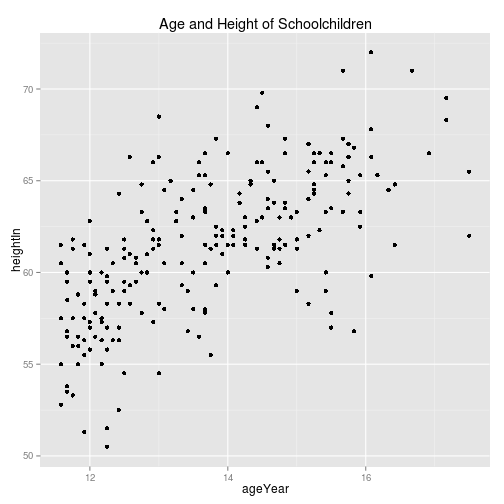 

```r
p + ggtitle("Age and Height of Schoolchildren") + theme(plot.title=element_text(vjust=-2.5))
```

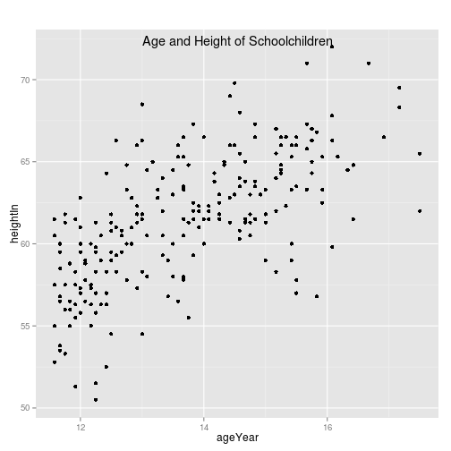 

```r
## 주석처리를 통한 공백 없애기
p + annotate("text", x=mean(range(heightweight$ageYear)), y=Inf, label = "Age and Height of Schoolchildren", vjust=1.5, size=6)
```

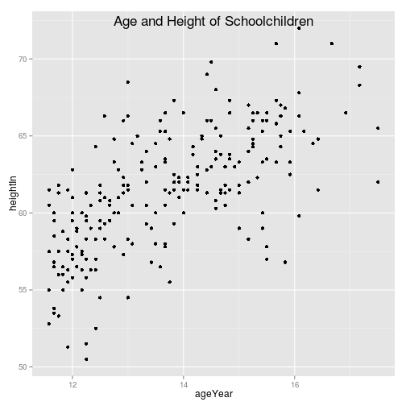 


#### 2. 그래프 안에 주석 넣기
- 1) Title

```r
p + ggtitle("Age and Height of Schoolchildren") + theme(plot.title=element_text(size=16, lineheight = .9, family ="Times", face = "bold.italic", colour="red" ,vjust=-2.5))
```

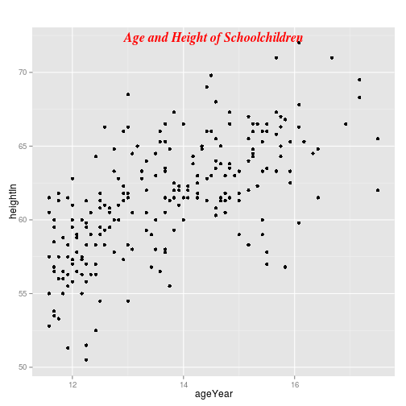 

- 2) Text

```r
p + annotate("text", x=15, y=53, label = "Some text", size=7, family = "Times", fontface = "bold.italic", colour = "red")
```

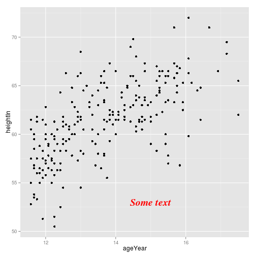 

- 3) Plot label

```r
p + geom_text(aes(label=weightLb), size = 4, family = "Times", colour = "red")
```

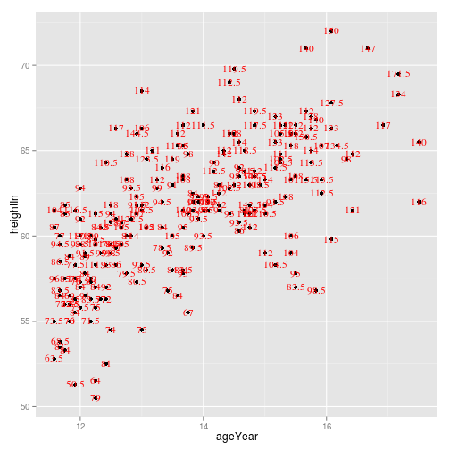 


#### 3. 테마 적용

```r
p + geom_text(aes(label=weightLb), size = 4, family = "Times", colour = "red") + theme_bw()
```

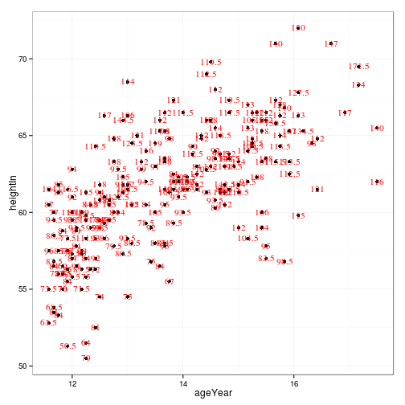 


#### 4. 테마 외형 변경

```r
p + theme(
  panel.grid.major = element_line(colour="red"),
  panel.grid.minor = element_line(colour="red", linetype="dashed", size=0.2),
  panel.background = element_rect(fill="lightblue"),
  panel.border = element_rect(colour="blue", fill= NA, size = 2)) ## fill default = "white"
```

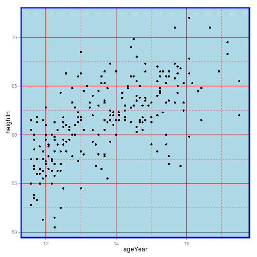 


```r
p + ggtitle("Plot title here") + theme(
  axis.title.x = element_text(colour = 'red', size = 14),
  axis.text.x =  element_text(colour='blue'),
  plot.title = element_text(colour="green", size=20, face="bold.italic"))
```

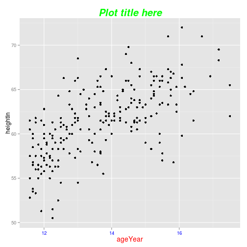 

```r
p + theme(  
  legend.background = element_rect(fill="grey85", colour= "red", size=1),
  legend.title = element_text(colour="blue", face="bold", size=14),
  legend.text = element_text(colour = "red"),
  legend.key = element_rect(colour="blue", size = 0.25))
```

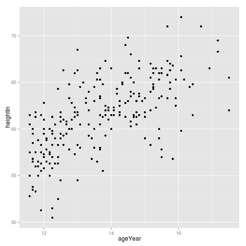 

```r
p + facet_grid(sex ~ .) + theme(
  strip.background = element_rect(fill="pink"),
  strip.text.y = element_text(size=14, angle = -90, face = "bold"))
```

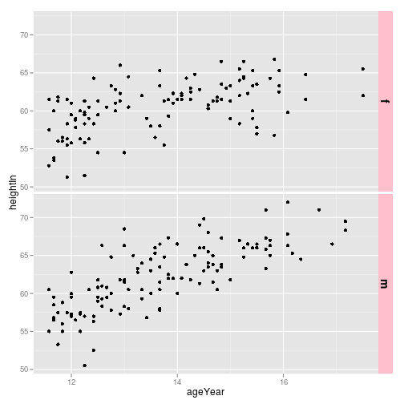 


#### 5. 격자선 숨기기

```r
p + theme(panel.grid.major = element_blank(),
          panel.grid.minor = element_blank())
```

 
