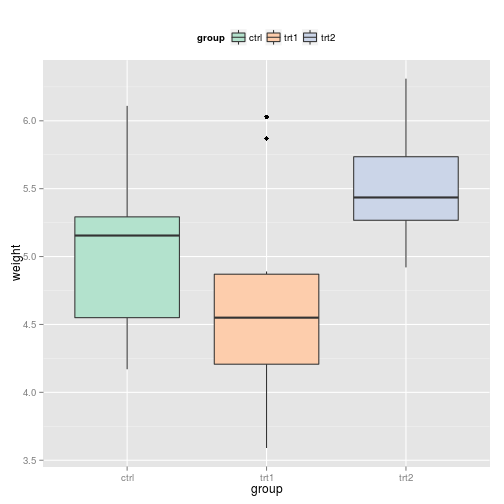
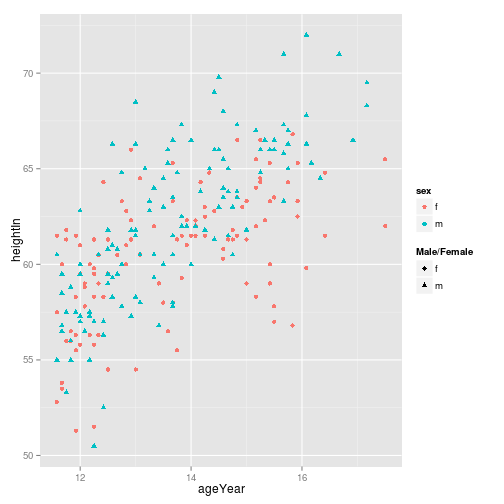

## 10.1 범례 제거하기

- 문제

그래프에서 범례를 없애고 싶다.


## 해결책 & 논의
방법 1 : guides() 사용

```r
library(ggplot2)
library(gcookbook)

head(PlantGrowth)
```

```
##   weight group
## 1   4.17  ctrl
## 2   5.58  ctrl
## 3   5.18  ctrl
## 4   6.11  ctrl
## 5   4.50  ctrl
## 6   4.61  ctrl
```

```r
p<-ggplot(PlantGrowth,aes(x=group, y=weight,fill=group)) +geom_boxplot()

p
```

 

```r
p + guides(fill=FALSE)  # 방법 1
```

 

##  
방법 2 : 척도를 guide = FALSE 로 설정.

```r
p<-ggplot(PlantGrowth,aes(x=group, y=weight,fill=group)) + geom_boxplot()

p
```

 

```r
p + scale_fill_discrete(guide=FALSE)   # 방법 2
```

 

##
방법 3 : 테마 시스템 사용

```r
p<-ggplot(PlantGrowth,aes(x=group, y=weight,fill=group)) + geom_boxplot()

p
```

 

```r
p + theme(legend.position = "none")    # 방법 3
```

 

## 10.2 범례 위치 변경하기

- 문제

그래프의 오른쪽에 위치하는 범례를 옮기고 싶다.

## 해결책 & 논의


```r
p<-ggplot(PlantGrowth,aes(x=group, y=weight,fill=group)) +geom_boxplot()

p
```

 

```r
p <- p + scale_fill_brewer(palette="Pastel2")
p + theme(legend.position="top")
```

 

```r
p + theme(legend.position=c(1,0))
```

 

```r
p + theme(legend.position = c(0,0))
```

 

```r
p + theme(legend.position = c(1,1))
```

 

```r
p + theme(legend.position = c(0.95,0.1))
```

 

- 범례에 불투명한색 테두리 추가

```r
p + theme(legend.position = c(0.95,0.1)) + 
  theme(legend.background=element_rect(fill="white",colour="black"))
```

 

- 범례 ; 배경, 테두리 제거

```r
p + theme(legend.position = c(0.95,0.1)) + 
  theme(legend.background=element_blank()) + 
  theme(legend.key=element_blank())
```

 

## 10.3 범례 항목들의 순서 바꾸기

- 문제

범례에 들어 있는 항목들의 순서를 변경하고 싶다.

## 해결책 & 논의

- 기본 그래프

```r
p<-ggplot(PlantGrowth,aes(x=group, y=weight,fill=group)) +geom_boxplot()

p
```

 

- 범례항목들의 순서를 변경

```r
p + scale_fill_discrete(limits=c("trt1", "trt2", "ctrl"))
```

 

```r
# but, x 축 항목들의 순서는 안바꼈다...```
```


- x 축 항목 바꾸어 보자!!! ( p.167 참고)

```r
p + scale_x_discrete(limits=c("trt1", "trt2", "ctrl"))
```

 

```r
# but, 범례 항목들의 순서는 안바꼈다...```
```

- 범례항목 + x 축 항목 순서를 변경

```r
p + scale_x_discrete(limits=c("trt1", "trt2", "ctrl")) + 
  scale_fill_discrete(limits=c("trt1", "trt2", "ctrl"))
```

 

## 10.4 범례안에 있는 항목들의 순서 뒤집기

- 문제

범례안에 들어 있는 항목들의 순서를 뒤집고 싶다.

## 해결책 & 논의

- 기본 그래프

```r
p<-ggplot(PlantGrowth,aes(x=group, y=weight,fill=group)) +geom_boxplot()

p
```

 

- 범례의 순서를 뒤집는다.

  방법 1

```r
p + guides(fill=guide_legend(reverse=TRUE))
```

 


  방법 2 ; 척도를 지정할때 범례를 함께 조절.

```r
p + scale_fill_hue(guide=guide_legend(reverse=TRUE))
```

 


## 10.5 범례 제목 변경하기

- 문제

범례 제목 텍스트를 변경하고 싶다

## 해결책 & 논의

- 기본 그래프

```r
p<-ggplot(PlantGrowth,aes(x=group, y=weight,fill=group)) +geom_boxplot()

p
```

 

- 범례 제목을 "Condition" 으로 설정.

  방법 1 ; labs() 사용

```r
p + labs(fill="Condition")
```

 


  방법 2 ; 척도를 지정할때 범례의 제목을 설정.

```r
p + scale_fill_discrete(name="Condition")
```

 

##

### 범례가 여러 개인 경우.

- 기본 그래프

```r
hw <- ggplot(heightweight, aes(x=ageYear, y=heightIn, colour=sex)) +
geom_point(aes(size=weightLb)) + scale_size_continuous(range=c(1,4))

hw
```

 

- 새로운 범례 제목을 넣어 그리기.

```r
hw + labs(colour="Male/Female", size="Weight\n(pounds)")
```

 


###  하나의 변수가 2가지 에스테틱에 대입된 경우

- 합친 범례가 하나만 만들어지는게 기본.

```r
hw1 <- ggplot(heightweight, aes(x=ageYear, y=heightIn, shape=sex, colour=sex)) + 
  geom_point()

hw1
```

 

- shape 만 변경한 경우.


```r
hw1 + labs(shape="Male/Female")
```

 

- shape, colour 둘 다 변경한 경우.


```r
hw1 + labs(shape="Male/Female", colour = "Male/Female")
```

 


## 10.6 범례 제목의 외형 변경하기

- 문제

범례 제목 텍스트의 모습을 변경하고 싶다

## 해결책 & 논의

- 기본 그래프

```r
p<-ggplot(PlantGrowth,aes(x=group, y=weight,fill=group)) +geom_boxplot()

p
```

 

- 방법 1 ; theme(legend.title = element_text()) 사용.

```r
p + theme(legend.title=
            element_text(face="italic", family="Times", colour="red",size=14))
```

 

- 방법 2 ; guides() 사용  ???


```r
# p + guides(fill=guide_legend(title.theme=
#               element_text(face="italic", family="Times", colour="red",size=14)))
```


## 10.7 범례 제목 제거하기

- 문제

범례 제목 제거하기


## 해결책 & 논의

- 기본 그래프

```r
p<-ggplot(PlantGrowth,aes(x=group, y=weight,fill=group)) +geom_boxplot()

p
```

 

- 방법 1 ; guides(fill=guide_legend(title=NULL)) 사용.


```r
p + guides(fill=guide_legend(title=NULL))
```

 

- 방법 2 ; 척도를 지정할 때 범례 제목을 함께 제어.


```r
p + scale_fill_hue(guide = guide_legend(title=NULL))
```

 


## 10.8 범례에 속한 라벨 변경하기

- 문제

범례에 속해 있는 텍스트 라벨들 변경하기


## 해결책 & 논의

- 기본 그래프

```r
p<-ggplot(PlantGrowth,aes(x=group, y=weight,fill=group)) +geom_boxplot()

p
```

 

- 범례 라벨 변경하기


```r
p + scale_fill_discrete(labels=c("Control", "Treatment 1", "Treatment 2"))
```

 

```r
# but, x축 라벨은 변경안됨.
```

[scale_fill_grey](http://docs.ggplot2.org/current/scale_grey.html)


```r
p + scale_fill_grey(start=0.5, end=1, 
                    labels=c("Control", "Treatment 1", "Treatment 2"))
```

 

- 항목 순서 바꿀때는, 라벨도 동일한 순서로 설정해주자.

```r
p + scale_fill_discrete(limits=c("trt1","trt2","ctrl"),
                        labels=c("Treatment 1", "Treatment 2", "Control"))
```

 


###  하나의 변수가 2가지 에스테틱에 대입된 경우

- 두 종류를 통합한 범례가 하나 생긴다.

- 기본 그래프

```r
p <- ggplot(heightweight, aes(x=ageYear, y=heightIn, shape=sex, colour=sex)) + 
  geom_point()

p
```

 

- 한 가지 척도의 라벨 수정.


```r
p + scale_shape_discrete(labels=c("Female", "Male"))
```

 

- 두 가지 척도의 라벨 모두 수정.


```r
p + scale_shape_discrete(labels=c("Female", "Male")) +
  scale_colour_discrete(labels=c("Female", "Male"))
```

 


## 10.9 범례에 속한 라벨의 외형 변경하기

- 문제

범례에 속해 있는 라벨의 외형 변경하기


## 해결책 & 논의

- 기본 그래프

```r
p<-ggplot(PlantGrowth,aes(x=group, y=weight,fill=group)) +geom_boxplot()

p
```

 


- 방법 1 : theme(legend.text=element_text()) 사용


```r
p + theme(legend.text=element_text(face="italic", family="Times", colour="red", size=14)) 
```

 


- 방법 2 : guides() 사용 ???


```r
# p + guides(fill=guide_legend(label.theme=
#                    element_text(face="italic", family="Times", colour="red", size=14)))
```


## 10.10 여러 줄의 텍스트로 라벨 만들기

- 문제

한 줄 이상의 텍스트로 된 범례 라벨 만들기.


## 해결책 & 논의

- 기본 그래프

```r
p<-ggplot(PlantGrowth,aes(x=group, y=weight,fill=group)) + geom_boxplot()

p
```

 

- '\\n' 사용.


```r
p + scale_fill_discrete(labels=c("Control","Type 1\ntreatemnt", "Type 2\ntreatment"))
```

 

- 범례 텍스트간 겹치는 것 막기위해, grid 패키지의 unit() 함수로 높이 조절.


```r
library(grid)

p + scale_fill_discrete(labels=c("Control","Type 1\ntreatemnt", "Type 2\ntreatment")) +
theme(legend.text=element_text(lineheight=0.8), legend.key.height=unit(1,"cm"))
```

 


