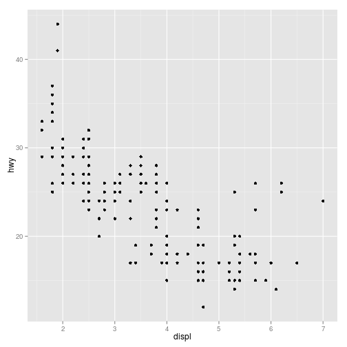
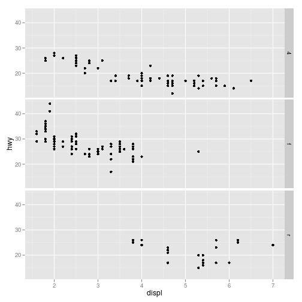
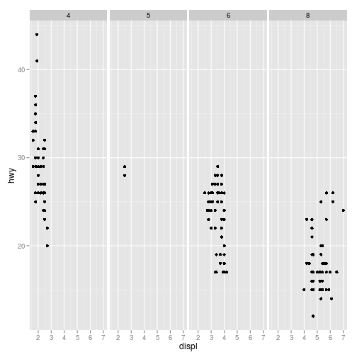
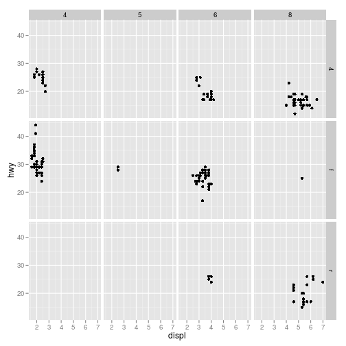
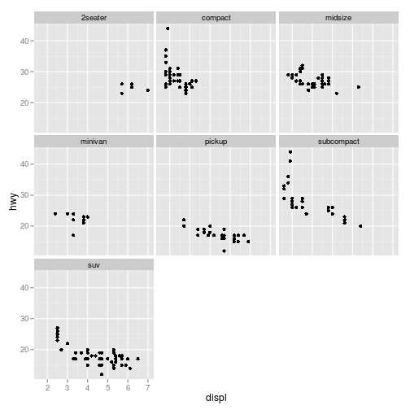
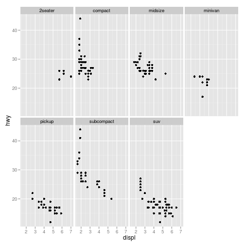
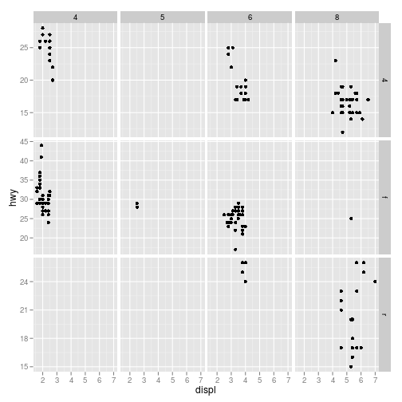
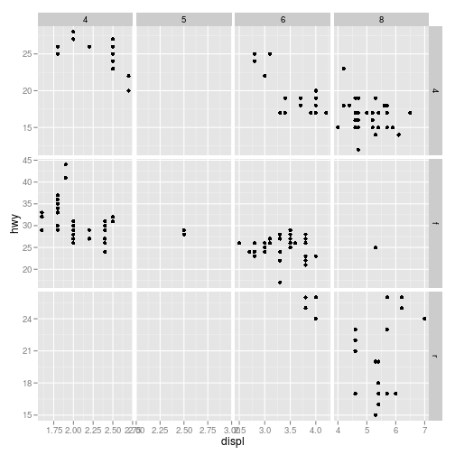
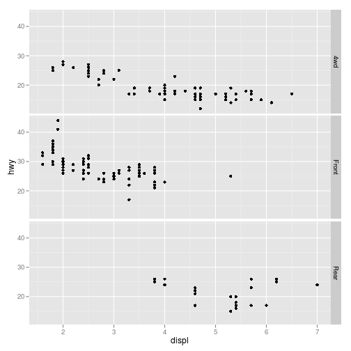
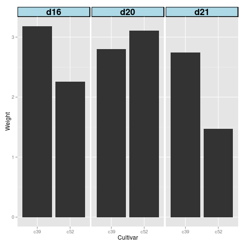

## 11.1 면이 분할된 하위 그래프로 데이터 나누기

- 문제

데이터의 부분 집합들을 하위 그래프로 분리해서 패널에 그리자.


## 해결책 & 논의

- 기본 그래프


```r
library(ggplot2)
library(gcookbook)

head(mpg)
```

```
##   manufacturer model displ year cyl      trans drv cty hwy fl   class
## 1         audi    a4   1.8 1999   4   auto(l5)   f  18  29  p compact
## 2         audi    a4   1.8 1999   4 manual(m5)   f  21  29  p compact
## 3         audi    a4   2.0 2008   4 manual(m6)   f  20  31  p compact
## 4         audi    a4   2.0 2008   4   auto(av)   f  21  30  p compact
## 5         audi    a4   2.8 1999   6   auto(l5)   f  16  26  p compact
## 6         audi    a4   2.8 1999   6 manual(m5)   f  18  26  p compact
```

```r
p <- ggplot(mpg, aes(x=displ, y=hwy)) + geom_point()

p
```

 

- 수직 정렬, drv 기준으로 면 분할


```r
# drv ==> f:전륜, r:후륜, 4:4륜
p + facet_grid(drv ~.)
```

 

- 수평 정렬, cyl 기준으로 면 분할


```r
# cyl : 실린더 갯수
p + facet_grid(.~cyl)
```

 

- drv(수직), cyl(수평)으로 동시 분할


```r
p + facet_grid(drv ~ cyl)
```

 

##

### facet_wrap()


```r
p + facet_wrap( ~ class)
```

 


```r
p + facet_wrap( ~ class, nrow=2)
```

 

```r
p + facet_wrap( ~ class, ncol=4)
```

 


## 11.2 축이 다른 분할 면 만들기

- 문제

축의 범위 또는 항목이 다른 하위 그래프를 그리자.


## 해결책 & 논의

- 기본 그래프


```r
p <- ggplot(mpg, aes(x=displ, y=hwy)) + geom_point()

p
```

 

- y축 눈금을 자유롭게


```r
p + facet_grid(drv ~ cyl, scale="free_y")
```

 

- x축, y축 눈금 모두 자유롭게


```r
p + facet_grid(drv ~ cyl, scale="free")
```

 


## 11.3 분할면 라벨의 텍스트 변경하기

- 문제

요인 수준들의 이름을 바꾼다.


## 해결책 & 논의

- 기본 그래프


```r
p <- ggplot(mpg, aes(x=displ, y=hwy)) + geom_point() + 
  facet_grid(drv ~.)

p
```

 

- 분할면 라벨 텍스트 변경하기


```r
mpg2 <- mpg  # 복사본 만들자.
levels(mpg2$drv)
```

```
## [1] "4" "f" "r"
```


```r
levels(mpg2$drv)[1] <- "4wd"
levels(mpg2$drv)[2] <- "Front"
levels(mpg2$drv)
```

```
## [1] "4wd"   "Front" "r"
```


```r
levels(mpg2$drv)[levels(mpg2$drv) == 'r'] <- "Rear"
levels(mpg2$drv)
```

```
## [1] "4wd"   "Front" "Rear"
```


```r
ggplot(mpg2,aes(x=displ, y=hwy)) + geom_point() +
facet_grid(drv ~.)
```

 

- label_both() : 각 분할면에 들어있는 변수명과 값을 함께 출력


```r
ggplot(mpg2,aes(x=displ, y=hwy)) + geom_point() +
facet_grid(drv ~., labeller = label_both)
```

 


- label_parsed() : 문자열을 받아 R의 수학적 표현식으로 취급.


```r
mpg3 <- mpg
levels(mpg3$drv)
```

```
## [1] "4" "f" "r"
```

```r
levels(mpg3$drv)[1] <- "4^{wd}"
levels(mpg3$drv)[2] <- "- Front %.% e^{pi*i}"
levels(mpg3$drv)[3] <- "4^{wd} - Front"
levels(mpg3$drv)
```

```
## [1] "4^{wd}"               "- Front %.% e^{pi*i}" "4^{wd} - Front"
```


```r
ggplot(mpg3,aes(x=displ, y=hwy)) + geom_point() +
facet_grid(drv ~., labeller = label_parsed)
```

 

## 11.4 분할면 라벨과 헤더 외형 변경하기

- 문제

분할면 라벨과 헤더 외형 변경하기


## 해결책 & 논의

* 테마 사용하라
    + strip.text ; 텍스트 외형 조절
    + strip.background ; 배경 조절


```r
ggplot(cabbage_exp,aes(x=Cultivar, y=Weight)) +
geom_bar(stat="identity") +
facet_grid(.~ Date) +
theme(strip.text = element_text(face="bold", size=rel(1.5)),
strip.background = element_rect(fill="lightblue", colour="black", size=1))
```

 

```r
# rel(1.5) ; 기본텍스트의 1.5배
# 배경 size=1 ; 분할면 테두리 두께 1mm
```
