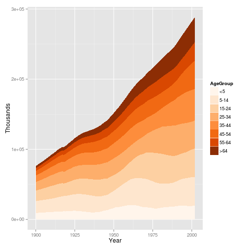
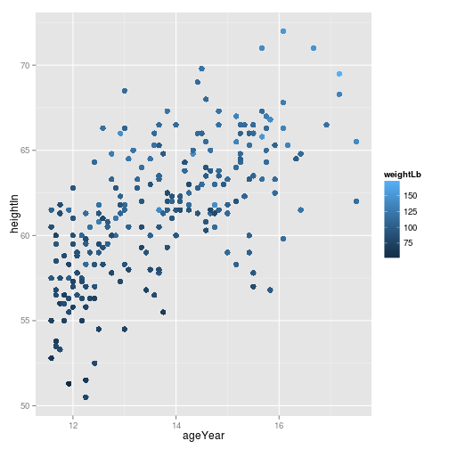

# 12. 그래프에 색상 사용하기

> 색상 사용은 다른 에스테틱보다 훨씬 복잡한 문제이다. 

> ### A. 객체와 변수에 색상 설정하기
> 12.1 객체에 색깔 설정하기  
> 12.2 변수를 색상에 대입하기  
> ### B. 이산 변수에 팔레트 사용하기
> 12.3 이산 변수에서 다른 팔레트 사용하기  
> 12.4 이산 변수에 사용자 정의 팔레트 사용하기  
> 12.5 색맹 친화적인 팔레트 사용하기  
> ### C. 연속 변수에 팔레트 사용하기
> 12.6 연속 변수에 사용자 정의 팔레트 사용하기  
> ### D. y 값에 따라 색칠하기
> 12.7 값에 따라 음영 영역 색칠하기  


필요한 패키지와 라이브러리 설치      
      

```r
#install.packages("knitr")
#install.packages("markdown")
#install.packages("ggplot2")
#install.packages("gcookbook")
#install.packages("corrplot")
#install.packages("igraph")
#install.packages("rgl")
#install.packages("vcd")
#install.packages("grid")
#install.packages("maps")
#install.packages("mapproj")
#install.packages("maptools")
library(knitr)
library(markdown)
library(ggplot2)
library(gcookbook)
library(corrplot)
library(igraph)
library(rgl)
```

```
## Warning: RGL: unable to open X11 display
## Warning: error in rgl_init
```

```r
library(vcd)
```

```
## Loading required package: grid
```

```r
library(grid)
library(maps)
library(mapproj)
library(maptools)
```

```
## Loading required package: sp
## Checking rgeos availability: FALSE
##  	Note: when rgeos is not available, polygon geometry 	computations in maptools depend on gpclib,
##  	which has a restricted licence. It is disabled by default;
##  	to enable gpclib, type gpclibPermit()
```


# A. 객체와 변수에 색상 설정하기

### 12.1 객체에 색깔 설정하기

도형을 호출할 때 colour 또는 fill  값을 설정한다.  
* colour : 선의 색상과 다각형의 테두리를 조절, 또는 점의 전체 색상을 조절.  
* fill : 다각형의 채우기 색상을 조절.  


```r
ggplot(mtcars, aes(x=wt, y=mpg)) + geom_point(colour = "red")
```

 

```r
library(MASS)
ggplot(birthwt, aes(x=bwt)) + geom_histogram(fill = "red", colour = "black")
```

```
## stat_bin: binwidth defaulted to range/30. Use 'binwidth = x' to adjust this.
```

 

### 12.2 변수를 색상에 대입하기

아래의 두 코드는 효과가 동일하지만,   
ggplot() 안에서 대입된 경우 모든 도형에 상속된다.   


```r
library(gcookbook)
ggplot(mtcars, aes(x=wt, y=mpg, colour=cyl)) + geom_point()
```

 

```r
ggplot(mtcars, aes(x=wt, y=mpg)) + geom_point(aes(colour=cyl))
```

 

아래 cabbage_exp의 Cultivar열은 요인이므로 이산 변수로 취급된다. 


```r
str(cabbage_exp)
```

```
## 'data.frame':	6 obs. of  6 variables:
##  $ Cultivar: Factor w/ 2 levels "c39","c52": 1 1 1 2 2 2
##  $ Date    : Factor w/ 3 levels "d16","d20","d21": 1 2 3 1 2 3
##  $ Weight  : num  3.18 2.8 2.74 2.26 3.11 1.47
##  $ sd      : num  0.957 0.279 0.983 0.445 0.791 ...
##  $ n       : int  10 10 10 10 10 10
##  $ se      : num  0.3025 0.0882 0.311 0.1408 0.2501 ...
```

아래 mtcars 예제의 cyl은 수치형이므로 연속 변수로 취급된다.   


```r
str(mtcars)
```

```
## 'data.frame':	32 obs. of  11 variables:
##  $ mpg : num  21 21 22.8 21.4 18.7 18.1 14.3 24.4 22.8 19.2 ...
##  $ cyl : num  6 6 4 6 8 6 8 4 4 6 ...
##  $ disp: num  160 160 108 258 360 ...
##  $ hp  : num  110 110 93 110 175 105 245 62 95 123 ...
##  $ drat: num  3.9 3.9 3.85 3.08 3.15 2.76 3.21 3.69 3.92 3.92 ...
##  $ wt  : num  2.62 2.88 2.32 3.21 3.44 ...
##  $ qsec: num  16.5 17 18.6 19.4 17 ...
##  $ vs  : num  0 0 1 1 0 1 0 1 1 1 ...
##  $ am  : num  1 1 1 0 0 0 0 0 0 0 ...
##  $ gear: num  4 4 4 3 3 3 3 4 4 4 ...
##  $ carb: num  4 4 1 1 2 1 4 2 2 4 ...
```

연속형으로 취급되는 cyl을 범주형 변수로 취급하도록 하려면     

(1) ggplot() 호출 내에서 cyl을 요인으로 변환하거나  


```r
ggplot(mtcars, aes(x=wt, y=mpg, colour=factor(cyl))) + geom_point()
```

 

(2) 데이터를 고쳐서 해당 열을 문자열 벡터 또는 요인으로 만든다.


```r
m <- mtcars
m$cyl <- factor(m$cyl)
ggplot(m, aes(x=wt, y=mpg, colour=cyl)) + geom_point()
```

 


# B. 이산 변수에 팔레트 사용하기


### 12.3 이산 변수에서 다른 팔레트 사용하기

대입한 이산 변수를 다른 색상으로 표현하려면,   
다음의 색상 척도 중 한 가지를 사용한다. 

채우기 척도 | 색상 척도 | 설명
---------- | ---------- | ----------
scale_fill_discrete() | scale_colour_discrete() | 색상환에서 등간격으로 분포하는 색깔들(hue와 동일)
scale_fill_hue() | scale_colour_hue() | 색상환에서 등간격으로 분포하는 색깔들(discrete와 동일)
scale_fill_grey() | scale_colour_grey() | 회색조 팔레트
scale_fill_brewer() | scale_colour_brewer() | ColorBrewer 팔레트
scale_fill_manual() | scale_colour_manual() | 사용자 지정 색상

기본 팔레트(hue)와 ColorBrewer 팔레트는 다음과 같이 사용한다. 

(1) 기본 팔레트(hue) 사용하기  


```r
library(gcookbook)
p <- ggplot(uspopage, aes(x=Year, y=Thousands, fill=AgeGroup)) + geom_area()
```

다음 코드는 모두 같은  기본 팔레트 효과를 낸다


```r
p
```

 

```r
p + scale_fill_discrete()
```

 

```r
p + scale_fill_hue()
```

 

```r
# ColourBrewer팔레트
p + scale_fill_brewer()
```

 

scale_fill_hue()는 [HCL(hue-chroma-lightness)](http://hclwizard.org/hcl-color-scheme/) 색 공간의 색상환으로부터 색상을 가져온다.   
기본 명도 값은 1-100 사이 값중 65이며, l값(휘도 lightness 또는 명도 lightness)으로 조절한다.


```r
#  기본 산점도
h <- ggplot(heightweight, aes(x=ageYear, y=heightIn, colour=sex)) + geom_point()
```

```r
# 기본 명도 값 = 65
h
```

 

```r
# 약간 어둡게
h + scale_colour_hue(l=45)
```

 

(2) ColorBrewer 패키지 사용하기   


```r
library(RColorBrewer)
# ColorBrewer 패키지의 모든 팔레트 보기
display.brewer.all()
```

 

```r
# 이름으로 ColorBrewer의 팔레트 선택이 가능     
# Oranges 팔레트의 선택
p + scale_fill_brewer(palette="Oranges")
```

 

```r
# 회색조 팔레트의 선택
p + scale_fill_grey()
```

 

```r
#  방향 및 회색의 범위를 변경(검은색(0)~흰색(1)의 척도 중 기본값은 0.2~0.8)
p + scale_fill_grey(start=0.7, end=0)
```

 

### 12.4 이산 변수에 사용자 정의 팔레트 사용하기

scale_colour_manual()과 함께 value()를 지정해서 수동으로 색상 지정   


```r
library(gcookbook)
# 기본 그래프
h <- ggplot(heightweight, aes(x=ageYear, y=heightIn, colour=sex)) + geom_point()
h
```

 

```r
# 색상명 사용
h + scale_colour_manual(values=c("red", "blue"))
```

 

```r
# RGB값 사용
h + scale_colour_manual(values=c("#CC6666", "#7777DD"))
```

 

values() 벡터에 들어있는 항목의 수는 이산 변수의 요인 수준들 순서와 일치한다.   
색상 이름 벡터를 써서 색상을 다른 순서로 지정할 수도 있다.   


```r
# 요인 수준들의 순서를 보는 방법
levels(heightweight$sex)
```

```
## [1] "f" "m"
```

```r
# 색상명 벡터로 색상을 다른 순서로 지정
h + scale_colour_manual(values=c(f="blue", m="red"))
```

 

R에서 "white", "black", "grey80", "red", "blue", "darkred" 등      
몇 가지 기본 색상 이름은 유용하게 사용할 수 있다.     
기본 색상 외의 색상은 [RGB 값](http://html-color-codes.com/)을 숫자로 지정해서 색을 선택하는 것이 쉽다.   


### 12.5 색맹 친화적인 팔레트 사용하기

색맹인 독자들도 구분할 수 있는 색상을 사용하려면     
scale_fill_manual()과 함께 사용자 정의된 팔레트 cb_palette를 사용한다. 
* [cb_palette](http://jfly.iam.u-tokyo.ac.jp/color/)
* [Color Oracle Program](http://colororacle.org)


```r
library(gcookbook)
#기본 그래프
p <- ggplot(uspopage, aes(x=Year, y=Thousands, fill=AgeGroup)) + geom_area()
p
```

 

```r
#회색이 포함된 팔레트 정의
cb_palette <- c("#999999", "#E69F00", "#56B4E9", "#009E73", "#F0E442", "#0072B2", "#D55E00", "#CC79A7")
# 그래프에 추가
p + scale_fill_manual(values=cb_palette)
```

 


# C. 연속 변수에 팔레트 사용하기

### 12.6 연속 변수에 사용자 정의 팔레트 사용하기

연속 변수에 사용자 정의 색상을 사용하려면 그래디언트 척도를 사용해서       
연속 변수의 색상을 이름이나 RGB값으로 지정해 사용할 수 있다. 

채우기 척도 | 색상 척도 | 설명
---------- | ---------- | ----------
scale_fill_gradient() | scale_colour_gradient() | 두 가지 색깔 그래디언트
scale_fill_gradient2() | scale_colour_gradient2() | 가운데 색깔이 있고 양끝을 향해 두 가지 색깔로 분화하는 그래디언트
scale_fil_gradientn() | scale_colour_gradientn() |  n개의 색깔로 된 그래디언트(색깔들은 등간격)


```r
library(gcookbook)
#기본 그래프
p <- ggplot(heightweight, aes(x=ageYear, y=heightIn, colour=weightLb)) + geom_point(size=3)
p
```

 

```r
#두 색깔 사이의 그래디언트
p + scale_colour_gradient(low="black", high="white")
```

 

```r
#중간점에 흰색을 준 그래디언트((muted()함수를 쓰면 좀더 채도가 낮은 RGB값을 반환))
library(scales)
p + scale_colour_gradient2(low=muted("red"), mid="white", high=muted("blue"), midpoint=110)
```

 

```r
#n개의 색깔로 된 그래디언트
p + scale_colour_gradientn(colours = c("darkred", "orange", "yellow", "white"))
```

 


# D. y 값에 따라 색칠하기

### 12.7 값에 따라 음영 영역 색칠하기

y값이 따라 음영 영역의 색깔을 설정하려면,    
y값들을 범주화하는 열을 추가한 다음 해당 열을  fill에 대입한다.


```r
library(gcookbook)
# 값들을 양수 또는 음수로 범주화
cb <- subset(climate, Source=="Berkeley")
cb$valence[cb$Anomaly10y >= 0] <- "pos"
cb$valence[cb$Anomaly10y < 0]  <- "neg"
```

```r
# cb값 확인해보기
head(cb, 10)
```

```
##      Source Year Anomaly1y Anomaly5y Anomaly10y Unc10y valence
## 1  Berkeley 1800        NA        NA     -0.435  0.505     neg
## 2  Berkeley 1801        NA        NA     -0.453  0.493     neg
## 3  Berkeley 1802        NA        NA     -0.460  0.486     neg
## 4  Berkeley 1803        NA        NA     -0.493  0.489     neg
## 5  Berkeley 1804        NA        NA     -0.536  0.483     neg
## 6  Berkeley 1805        NA        NA     -0.541  0.475     neg
## 7  Berkeley 1806        NA        NA     -0.590  0.468     neg
## 8  Berkeley 1807        NA        NA     -0.695  0.461     neg
## 9  Berkeley 1808        NA        NA     -0.763  0.453     neg
## 10 Berkeley 1809        NA        NA     -0.818  0.451     neg
```

```r
tail(cb, 10)  
```

```
##       Source Year Anomaly1y Anomaly5y Anomaly10y Unc10y valence
## 196 Berkeley 1995        NA        NA      0.563  0.019     pos
## 197 Berkeley 1996        NA        NA      0.565  0.022     pos
## 198 Berkeley 1997        NA        NA      0.618  0.022     pos
## 199 Berkeley 1998        NA        NA      0.680  0.023     pos
## 200 Berkeley 1999        NA        NA      0.734  0.025     pos
## 201 Berkeley 2000        NA        NA      0.748  0.026     pos
## 202 Berkeley 2001        NA        NA      0.793  0.027     pos
## 203 Berkeley 2002        NA        NA      0.856  0.028     pos
## 204 Berkeley 2003        NA        NA      0.869  0.028     pos
## 205 Berkeley 2004        NA        NA      0.884  0.029     pos
```

```r
# valence를 채우기 색상에 대입해 그래프 작성
ggplot(cb, aes(x=Year, y=Anomaly10y)) +
    geom_area(aes(fill=valence)) +
    geom_line() +
    geom_hline(yintercept=0)
```

 

기준선 근처에 비어져 나온 음영 영역을 정리     
(음영영역이 데이터 점들을 경계로 하나씩 다각형을 만드는데 점들이 0이 아니기 때문))      
apporx()를 써서 데이터를 내삽하여 점을 1,000개로 만들어주는 방법으로 해결      


```r
# x와 y벡터로 된 리스트를 반환하는 approx() 
interp <- approx(cb$Year, cb$Anomaly10y, n=1000)
# 데이터프레임이 집어넣고 valence를 재계산
cbi <- data.frame(Year=interp$x, Anomaly10y=interp$y)
cbi$valence[cbi$Anomaly10y >= 0] <- "pos"
cbi$valence[cbi$Anomaly10y < 0]  <- "neg"
# 내삽한 데이터를 그래프로 그림(음영 영역을 투명화 및 색상, 범례, 여백 수정))
ggplot(cbi, aes(x=Year, y=Anomaly10y)) +
    geom_area(aes(fill=valence), alpha = .4) +
    geom_line() +
    geom_hline(yintercept=0) +
    scale_fill_manual(values=c("#CCEEFF", "#FFDDDD"), guide=FALSE) +
    scale_x_continuous(expand=c(0, 0))
```

 


--------------- the END -----------------      
