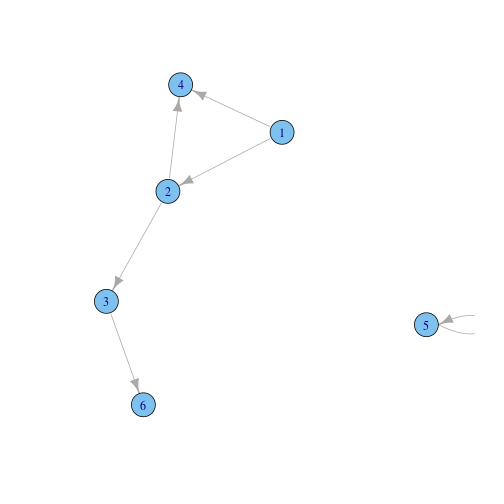
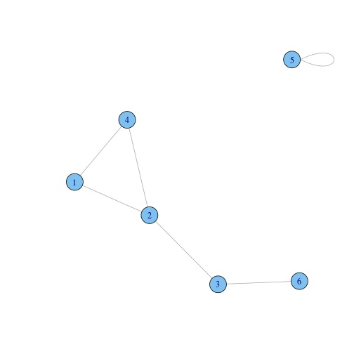
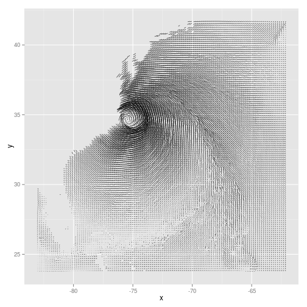

# 13. 다양한 그래프
  
이번 장에서는 특정 범주에 속하지 않는 여러 가지 시각화 자료를 만든다.  
    
> ### A. 상관 계수 행렬(correlation matrix)    
> 13.1 상관 계수 행렬 만들기    
> ### B. 함수의 그래프    
> 13.2 함수를 그래프로 그리기    
> 13.3 함수 곡선 아래의 영역 일부분에 음영 넣기    
> ### C. 네트워크 그래프(network graph)    
> 13.4 네트워크 그래프 그리기    
> 13.5 네트워크 그래프에 텍스트 라벨 넣기    
> ### D. 히트맵(heatmap)    
> 13.6 히트맵 생성하기    
> ### E. 삼차원 산점도(3D scatterplot)    
> 13.7 삼차원 산점도 생성하기    
> 13.8 삼차원 그래프에 예측면 추가하기    
> 13.9 삼차원 그래프 저장하기    
> 13.10 삼차원 그래프에 애니메이션 넣기    
> ### F. 덴드로그램(dendrogram)    
> 13.11 덴드로그램 생성하기    
> ### G. 벡터장(vector field)    
> 13.12 벡터장 그리기    
> ### H. 통계치의 그래프    
> 13.13 Q-Q 그래프 그리기    
> 13.14 경험적 누적 분포 함수 그래프 그리기    
> 13.15 모자이크 그래프 그리기    
> 13.16 파이 차트 만들기    
> ### I. 지도(map)    
> 13.17 지도 그리기    
> 13.18 단계 구분도(Choropleth Map) 만들기    
> 13.19 배경이 깨끗한 지도 만들기    
> 13.20 Shapefile로부터 지도 만들기    


필요한 패키지와 라이브러리 설치      
      

```r
#install.packages("knitr")
#install.packages("markdown")
#install.packages("ggplot2")
#install.packages("gcookbook")
#install.packages("corrplot")
#install.packages("igraph")
#install.packages("rgl")
#install.packages("vcd")
#install.packages("grid")
#install.packages("maps")
#install.packages("mapproj")
#install.packages("maptools")
library(knitr)
library(markdown)
library(ggplot2)
library(gcookbook)
library(corrplot)
library(igraph)
library(rgl)
```

```
## Warning: RGL: unable to open X11 display
## Warning: error in rgl_init
```

```r
library(vcd)
```

```
## Loading required package: grid
```

```r
library(grid)
library(maps)
library(mapproj)
library(maptools)
```

```
## Loading required package: sp
## Checking rgeos availability: FALSE
##  	Note: when rgeos is not available, polygon geometry 	computations in maptools depend on gpclib,
##  	which has a restricted licence. It is disabled by default;
##  	to enable gpclib, type gpclibPermit()
```


# A. 상관 계수 행렬(correlation matrix)

### 13.1 상관 계수 행렬 만들기

상관 계수 행렬(correlation matrix)를 만들려면    
cor를 사용해 숫자로 된 상관 계수 행렬을 생성한 다음    
열(column)을 두 개씩 묶은 각 쌍들에 대해 상관 계수를 생성해준다.     


```r
# mtcars데이터 보기
mtcars
```

```
##                      mpg cyl  disp  hp drat    wt  qsec vs am gear carb
## Mazda RX4           21.0   6 160.0 110 3.90 2.620 16.46  0  1    4    4
## Mazda RX4 Wag       21.0   6 160.0 110 3.90 2.875 17.02  0  1    4    4
## Datsun 710          22.8   4 108.0  93 3.85 2.320 18.61  1  1    4    1
## Hornet 4 Drive      21.4   6 258.0 110 3.08 3.215 19.44  1  0    3    1
## Hornet Sportabout   18.7   8 360.0 175 3.15 3.440 17.02  0  0    3    2
## Valiant             18.1   6 225.0 105 2.76 3.460 20.22  1  0    3    1
## Duster 360          14.3   8 360.0 245 3.21 3.570 15.84  0  0    3    4
## Merc 240D           24.4   4 146.7  62 3.69 3.190 20.00  1  0    4    2
## Merc 230            22.8   4 140.8  95 3.92 3.150 22.90  1  0    4    2
## Merc 280            19.2   6 167.6 123 3.92 3.440 18.30  1  0    4    4
## Merc 280C           17.8   6 167.6 123 3.92 3.440 18.90  1  0    4    4
## Merc 450SE          16.4   8 275.8 180 3.07 4.070 17.40  0  0    3    3
## Merc 450SL          17.3   8 275.8 180 3.07 3.730 17.60  0  0    3    3
## Merc 450SLC         15.2   8 275.8 180 3.07 3.780 18.00  0  0    3    3
## Cadillac Fleetwood  10.4   8 472.0 205 2.93 5.250 17.98  0  0    3    4
## Lincoln Continental 10.4   8 460.0 215 3.00 5.424 17.82  0  0    3    4
## Chrysler Imperial   14.7   8 440.0 230 3.23 5.345 17.42  0  0    3    4
## Fiat 128            32.4   4  78.7  66 4.08 2.200 19.47  1  1    4    1
## Honda Civic         30.4   4  75.7  52 4.93 1.615 18.52  1  1    4    2
## Toyota Corolla      33.9   4  71.1  65 4.22 1.835 19.90  1  1    4    1
## Toyota Corona       21.5   4 120.1  97 3.70 2.465 20.01  1  0    3    1
## Dodge Challenger    15.5   8 318.0 150 2.76 3.520 16.87  0  0    3    2
## AMC Javelin         15.2   8 304.0 150 3.15 3.435 17.30  0  0    3    2
## Camaro Z28          13.3   8 350.0 245 3.73 3.840 15.41  0  0    3    4
## Pontiac Firebird    19.2   8 400.0 175 3.08 3.845 17.05  0  0    3    2
## Fiat X1-9           27.3   4  79.0  66 4.08 1.935 18.90  1  1    4    1
## Porsche 914-2       26.0   4 120.3  91 4.43 2.140 16.70  0  1    5    2
## Lotus Europa        30.4   4  95.1 113 3.77 1.513 16.90  1  1    5    2
## Ford Pantera L      15.8   8 351.0 264 4.22 3.170 14.50  0  1    5    4
## Ferrari Dino        19.7   6 145.0 175 3.62 2.770 15.50  0  1    5    6
## Maserati Bora       15.0   8 301.0 335 3.54 3.570 14.60  0  1    5    8
## Volvo 142E          21.4   4 121.0 109 4.11 2.780 18.60  1  1    4    2
```

```r
# cor를 사용해 열(column)을 두 개씩 묶은 각 쌍들의 상관 계수 행렬을 생성
mcor <- cor(mtcars)
mcor
```

```
##          mpg     cyl    disp      hp     drat      wt    qsec      vs
## mpg   1.0000 -0.8522 -0.8476 -0.7762  0.68117 -0.8677  0.4187  0.6640
## cyl  -0.8522  1.0000  0.9020  0.8324 -0.69994  0.7825 -0.5912 -0.8108
## disp -0.8476  0.9020  1.0000  0.7909 -0.71021  0.8880 -0.4337 -0.7104
## hp   -0.7762  0.8324  0.7909  1.0000 -0.44876  0.6587 -0.7082 -0.7231
## drat  0.6812 -0.6999 -0.7102 -0.4488  1.00000 -0.7124  0.0912  0.4403
## wt   -0.8677  0.7825  0.8880  0.6587 -0.71244  1.0000 -0.1747 -0.5549
## qsec  0.4187 -0.5912 -0.4337 -0.7082  0.09120 -0.1747  1.0000  0.7445
## vs    0.6640 -0.8108 -0.7104 -0.7231  0.44028 -0.5549  0.7445  1.0000
## am    0.5998 -0.5226 -0.5912 -0.2432  0.71271 -0.6925 -0.2299  0.1683
## gear  0.4803 -0.4927 -0.5556 -0.1257  0.69961 -0.5833 -0.2127  0.2060
## carb -0.5509  0.5270  0.3950  0.7498 -0.09079  0.4276 -0.6562 -0.5696
##            am    gear     carb
## mpg   0.59983  0.4803 -0.55093
## cyl  -0.52261 -0.4927  0.52699
## disp -0.59123 -0.5556  0.39498
## hp   -0.24320 -0.1257  0.74981
## drat  0.71271  0.6996 -0.09079
## wt   -0.69250 -0.5833  0.42761
## qsec -0.22986 -0.2127 -0.65625
## vs    0.16835  0.2060 -0.56961
## am    1.00000  0.7941  0.05753
## gear  0.79406  1.0000  0.27407
## carb  0.05753  0.2741  1.00000
```

```r
# mcor를 출력하고 2자리로 반올림
round(mcor, digits=2)
```

```
##        mpg   cyl  disp    hp  drat    wt  qsec    vs    am  gear  carb
## mpg   1.00 -0.85 -0.85 -0.78  0.68 -0.87  0.42  0.66  0.60  0.48 -0.55
## cyl  -0.85  1.00  0.90  0.83 -0.70  0.78 -0.59 -0.81 -0.52 -0.49  0.53
## disp -0.85  0.90  1.00  0.79 -0.71  0.89 -0.43 -0.71 -0.59 -0.56  0.39
## hp   -0.78  0.83  0.79  1.00 -0.45  0.66 -0.71 -0.72 -0.24 -0.13  0.75
## drat  0.68 -0.70 -0.71 -0.45  1.00 -0.71  0.09  0.44  0.71  0.70 -0.09
## wt   -0.87  0.78  0.89  0.66 -0.71  1.00 -0.17 -0.55 -0.69 -0.58  0.43
## qsec  0.42 -0.59 -0.43 -0.71  0.09 -0.17  1.00  0.74 -0.23 -0.21 -0.66
## vs    0.66 -0.81 -0.71 -0.72  0.44 -0.55  0.74  1.00  0.17  0.21 -0.57
## am    0.60 -0.52 -0.59 -0.24  0.71 -0.69 -0.23  0.17  1.00  0.79  0.06
## gear  0.48 -0.49 -0.56 -0.13  0.70 -0.58 -0.21  0.21  0.79  1.00  0.27
## carb -0.55  0.53  0.39  0.75 -0.09  0.43 -0.66 -0.57  0.06  0.27  1.00
```


```r
# 상관 행렬을 그리는데 필요한 패키지를 설치
#install.packages("corrplot")
library(corrplot)

# 상관 행렬 그리기(기본형)
corrplot(mcor)
```

 


```r
# corrplot() 함수의 응용

# 사각형에 라벨을 회전
corrplot(mcor, method="shade", shade.col=NA, tl.col="black", tl.srt=45)
```

 

```r
# 사각형에 상관 계수를 표시하는 라벨을 넣기 위해 옅은 색의 팔레트를 생성
col <- colorRampPalette(c("#BB4444", "#EE9988", "#FFFFFF", "#77AADD", "#4477AA"))

# 상관관계가 큰 항목들이 함께 모이도록 order=AOE(angular order of eigenvectors) 사용
corrplot(mcor, method="shade", shade.col=NA, tl.col="black", tl.srt=45,
         col=col(200), addCoef.col="black", addcolorlabel="no", order="AOE")
```

```
## Warning: "addcolorlabel" is not a graphical parameter
## Warning: "addcolorlabel" is not a graphical parameter
## Warning: "addcolorlabel" is not a graphical parameter
```

 

* corrplot() 함수의 몇 가지 유용한 옵션들    

옵션 | 설명
---------- | ----------
type="lower","upper" | 위쪽 또는 아래쪽 삼각형만 사용
diag=FALSE | 대각선에는 값을 보여주지 않음
addshade="all" | 상관관계의 방향을 보여주는 선을 추가
shade.col=NA | 상관관계 방향선을 숨김
method="shade" | 색을 입힌 사각형을 사용
method="elipse" | 타원을 사용
addCoef.col="color" | 색깔이 있는 상관계수를 삽입
tl.srt="number" | 위쪽 라벨의 회전 각도를 지정
tl.col="color" | 라벨 색깔을 지정
order="AOE","FPC","hclust" | 고유벡터의 각도 순(angular order of eigenvectors), 제 1 주성분(first principle component) 또는 계층적 군집 분석(hierarchical clustering)을 사용해 라벨을 정렬   
    

# B. 함수의 그래프

### 13.2 함수를 그래프로 그리기

어떤 함수를 그래프로 그릴 때 stat_function()을 사용
예제로 정규 분포의 밀도를 반환해 주는  dnorm() 함수


```r
# ggplot()에 가짜로 데이터 프레임을 하나 전달하여  
# x범위를 제대로 인식하도록 하기 위해 
# 데이터 프레임을 범위를 설정하는 데에만 사용
p <- ggplot(data.frame(x=c(-3,3)), aes(x=x))

# 정규 분포 밀도 함수
p + stat_function(fun = dnorm)
```

 

```r
# 자유도가 2인  t분포 함수(추가적인 인자들은 리스트에 넣어 args로 함수에 전달)
p + stat_function(fun=dt, args=list(df=2))
```

 

```r
# 사용자 정의 함수(예제 : 시그모이드 함수sigmoid function)
myfun <- function(xvar) {
    1/(1 + exp(-xvar + 10))
}
ggplot(data.frame(x=c(0, 20)), aes(x=x)) + stat_function(fun=myfun)
```

 

```r
# 기본 설정은  x범위상의 101개 점에서 계산되므로 곡선을 부드럽게 하려면  n값을 크게 함.
ggplot(data.frame(x=c(0, 20)), aes(x=x)) + stat_function(fun=myfun, n=200)  
```

 


### 13.3 함수 곡선 아래의 영역 일부분에 음영 넣기

함수 곡선 아래의 영역 일부에 음영을 넣으려면,      
함수 주위로 새로운 래퍼 함수를 정의하고 범위 밖의 값들을  NA()로 대체.


```r
# 0 < x < 2에 대해 dnorm(x)을 반환하고, 다른 모든 x에 대해 NA를 반환
dnorm_limit <- function(x) {
    y <- dnorm(x)
    y[x < 0  |  x > 2] <- NA
    return(y)
}

# 가짜 데이터를 ggplot()에 넣음(이 함수에 전달되는 것은 개별 값이 아닌 벡터)
p <- ggplot(data.frame(x=c(-3, 3)), aes(x=x))
p + stat_function(fun=dnorm_limit, geom="area", fill="blue", alpha=0.2) +
    stat_function(fun=dnorm)
```

 

R에는 일급 함수(first-class function)이 있어 클로저(closure) 반환 함수를 만들게 해줌.    
즉, 또 다른 함수를 프로그래밍하는 함수를 프로그래밍할 수 있다는 뜻.     
예를 들어 아래의서 limitRange()와 같은 함수를 만들어두면     
어떤 함수든 해당 함수의 한정된 범위 버전을 만들기 위해 사용할 수 있으므로 재사용이 간단해짐.    


```r
# 함수, 최솟값, 최댓값을 전달하는 함수(범위 밖의 값들은 NA 로 반환)
limitRange <- function(fun, min, max) {
    function(x) {
        y <- fun(x)
        y[x < min  |  x > max] <- NA
        return(y)
    }
}
```

```r
# 이 함수를 호출해서 다른 함수를 행성(앞서 사용한  dnorm_limit()와 실질적으로 동일)
dlimit <- limitRange(dnorm, 0, 2)

# 새 함수를 시험해보면 -2부터 4의 값을 입력하면 0부터 2의 입력에 대한 값만 반환
dlimit(-2:4)
```

```
## [1]      NA      NA 0.39894 0.24197 0.05399      NA      NA
```

```r
# limitRange() 함수를 사용해 stat_function() 에 전달할 함수를 생성
p + stat_function(fun = dnorm) +
    stat_function(fun = limitRange(dnorm, 0, 2),
                  geom="area", fill="blue", alpha=0.2)
```

 


# C. 네트워크 그래프(network graph)

### 13.4 네트워크 그래프 그리기
     
네트워크 그래프를 그리려면 igraph 패키지를 사용하여    
항목 쌍들을 담고 있는 벡터를 graph()에 전달한 다음 결과 객체를 그래프로 그림   
* 주의 : 상황에 따라 달라지는 값들을 고정된 값으로 매번 코딩하면 유연성이 떨어짐     
      

```r
# igraph 패키지를 설치
#install.packages("igraph")
library(igraph)

# 방향이 있는(directed) 그래프를 만들 때 연결선(edge)를 지정
gd <- graph(c(1,2, 2,3, 2,4, 1,4, 5,5, 3,6))
plot(gd)
```

 

```r
# 방향이 없는(undirected graph) 그래프
gu <- graph(c(1,2, 2,3, 2,4, 1,4, 5,5, 3,6), directed=FALSE)
plot(gu)
```

 

```r
# 라벨을 제거
plot(gu, vertex.label=NA)
```

 

```r
# 각 그래프 객체의 구조 확인
str(gd)
```

```
## IGRAPH D--- 6 6 -- 
## + edges:
## [1] 1->2 2->3 2->4 1->4 5->5 3->6
```

```r
str(gu)
```

```
## IGRAPH U--- 6 6 -- 
## + edges:
## [1] 1--2 2--3 2--4 1--4 5--5 3--6
```

네트워크 그래프에서 노드(node)의 위치는 데이터에서 지정하는 것이 아니고 랜덤하게 분포.     
똑같은 출력을 반복하려면 그래프를 만들기 전에 랜덤 시드를 설정해야함. 


```r
# 시드 설정 
set.seed(229)
plot(gu)
```

 

```r
set.seed(100)
plot(gu)
```

 

데이터 프레임으로부터 그래프를 생성하는 것도 가능.      
데이터 프레임의 맨 앞 두 열이 사용되고, 각 행은 두 노드 사이의 연결을 의미. 


```r
library(gcookbook)
head(madmen2, 10)
```

```
##                       Name1         Name2
## 1               Abe Drexler   Peggy Olson
## 2                   Allison    Don Draper
## 3               Arthur Case  Betty Draper
## 4      Bellhop in Baltimore    Sal Romano
## 5          Bethany Van Nuys    Don Draper
## 6              Betty Draper    Don Draper
## 7              Betty Draper Henry Francis
## 8              Betty Draper    Random guy
## 9            Bobbie Barrett    Don Draper
## 10 Brooklyn College Student   Peggy Olson
```

```r
# 데이터 프레임으로부터 방향이 있는 그래프 생성(Fruchterman-Reingold 알고리즘 사용)
g <- graph.data.frame(madmen2, directed=TRUE)
par(mar=c(0,0,0,0))   # 불필요한 여백을 제거
plot(g, layout=layout.fruchterman.reingold, vertex.size=8, edge.arrow.size=0.5,
     vertex.label=NA)   
```

 

```r
# 데이터 프레임으로부터 방향이 없는 원형 그래프 생성
g <- graph.data.frame(madmen, directed=FALSE)
par(mar=c(0,0,0,0))  # 불필요한 여백을 제거
plot(g, layout=layout.circle, vertex.size=8, vertex.label=NA)
```

 

* igraph의 대안은  Rgraphviz로, 그래프 시각화 관련 오픈소스 라이브러리인       
  Graphviz의 프론트 엔드 버전이며 설치가 약간 까다롭다(Bioconductor저장소에서 구함)     
     

### 13.5 네트워크 그래프에 텍스트 라벨 넣기

네트워크 그래프에서 텍스트 라벨을 사용하려면      
vertex.label에 이름으로 이루어진 벡터를 전달.       


```r
library(igraph)
library(gcookbook)
# madmen을 복사한 뒤 한 행 걸러 선택
m <- madmen[1:nrow(madmen) %% 2 == 1, ]
g <- graph.data.frame(m, directed=FALSE)

# 각 노드의 이름을 출력
V(g)$name
```

```
##  [1] "Betty Draper"      "Don Draper"        "Harry Crane"      
##  [4] "Joan Holloway"     "Lane Pryce"        "Peggy Olson"      
##  [7] "Pete Campbell"     "Roger Sterling"    "Sal Romano"       
## [10] "Henry Francis"     "Allison"           "Candace"          
## [13] "Faye Miller"       "Megan Calvet"      "Rachel Menken"    
## [16] "Suzanne Farrell"   "Hildy"             "Franklin"         
## [19] "Rebecca Pryce"     "Abe Drexler"       "Duck Phillips"    
## [22] "Playtex bra model" "Ida Blankenship"   "Mirabelle Ames"   
## [25] "Vicky"             "Kitty Romano"
```

```r
plot(g, layout=layout.fruchterman.reingold,
     vertex.size        = 4,          # 노드 크기를 작게
     vertex.label       = V(g)$name,  # 라벨을 설정
     vertex.label.cex   = 0.8,        # 폰트 크기를 약간 작게
     vertex.label.dist  = 0.4,        # 라벨 위치 옮김
     vertex.label.color = "black")
```

 
    
값들을  plot() 에 인자로 전달하는 대신, plot() 객체를 수정해도 동일한 결과. 
이를 위해 V()$xxx <- 를 사용. 
    

```r
# 다음 코드는 앞의 코드와 같은 그래프를 출력
V(g)$size        <- 4
V(g)$label       <- V(g)$name
V(g)$label.cex   <- 0.8
V(g)$label.dist  <- 0.4
V(g)$label.color <- "black"

# 그래프 전체의 속성을 설정
g$layout <- layout.fruchterman.reingold

plot(g)
```

 

마찬가지로 E() 함수를 쓰거나  edge.xxx 인자에 값을 전달하는 방법으로     
연결선의 속성도 설정할 수 있음. 


```r
# 연결선 보기
E(g)
```

```
## Edge sequence:
##                                            
## [1]  Henry Francis     -- Betty Draper     
## [2]  Allison           -- Don Draper       
## [3]  Don Draper        -- Betty Draper     
## [4]  Candace           -- Don Draper       
## [5]  Faye Miller       -- Don Draper       
## [6]  Megan Calvet      -- Don Draper       
## [7]  Rachel Menken     -- Don Draper       
## [8]  Suzanne Farrell   -- Don Draper       
## [9]  Hildy             -- Harry Crane      
## [10] Franklin          -- Joan Holloway    
## [11] Roger Sterling    -- Joan Holloway    
## [12] Rebecca Pryce     -- Lane Pryce       
## [13] Abe Drexler       -- Peggy Olson      
## [14] Duck Phillips     -- Peggy Olson      
## [15] Pete Campbell     -- Peggy Olson      
## [16] Playtex bra model -- Pete Campbell    
## [17] Ida Blankenship   -- Roger Sterling   
## [18] Mirabelle Ames    -- Roger Sterling   
## [19] Vicky             -- Roger Sterling   
## [20] Kitty Romano      -- Sal Romano
```

```r
# 몇몇 라벨을  "M"으로 설정
E(g)[c(2,11,19)]$label <- "M"
plot(g)
```

 

```r
# 모든 연결선을 회색으로 설정한 뒤 몇 개만 빨간색으로 변경
E(g)$color             <- "grey70"
E(g)[c(2,11,19)]$color <- "red"
plot(g)
```

 
   
   
# D. 히트맵(heatmap)

### 13.6 히트맵 생성하기

히트맵을 만들려면 geom_tile() 또는 geom_raster()를 사용하고 fill 에 연속변수를 대입.     


```r
# 시계열 객체인 president 데이터 세트 사용
presidents
```

```
##      Qtr1 Qtr2 Qtr3 Qtr4
## 1945   NA   87   82   75
## 1946   63   50   43   32
## 1947   35   60   54   55
## 1948   36   39   NA   NA
## 1949   69   57   57   51
## 1950   45   37   46   39
## 1951   36   24   32   23
## 1952   25   32   NA   32
## 1953   59   74   75   60
## 1954   71   61   71   57
## 1955   71   68   79   73
## 1956   76   71   67   75
## 1957   79   62   63   57
## 1958   60   49   48   52
## 1959   57   62   61   66
## 1960   71   62   61   57
## 1961   72   83   71   78
## 1962   79   71   62   74
## 1963   76   64   62   57
## 1964   80   73   69   69
## 1965   71   64   69   62
## 1966   63   46   56   44
## 1967   44   52   38   46
## 1968   36   49   35   44
## 1969   59   65   65   56
## 1970   66   53   61   52
## 1971   51   48   54   49
## 1972   49   61   NA   NA
## 1973   68   44   40   27
## 1974   28   25   24   24
```

```r
str(presidents)
```

```
##  Time-Series [1:120] from 1945 to 1975: NA 87 82 75 63 50 43 32 35 60 ...
```

```r
# ggplot()이 쓸 수 있는 형식으로 변환하기 위해 열에 수치형 값이 있는 데이터 프레임으로 바꿈
pres_rating <- data.frame(
    rating  = as.numeric(presidents),
    year    = as.numeric(floor(time(presidents))),
    quarter = as.numeric(cycle(presidents))
)

head(pres_rating, 10)
```

```
##    rating year quarter
## 1      NA 1945       1
## 2      87 1945       2
## 3      82 1945       3
## 4      75 1945       4
## 5      63 1946       1
## 6      50 1946       2
## 7      43 1946       3
## 8      32 1946       4
## 9      35 1947       1
## 10     60 1947       2
```

geom_tile()이나 geom_raster()로 히트맵 생성


```r
# 기본 그래프
p <- ggplot(pres_rating, aes(x=year, y=quarter, fill=rating))

# geom_tile() 사용
p + geom_tile()
```

 

```r
# geom_raster() 사용(보기엔 똑같지만 조금 효율적)
p + geom_raster()
```

 

정보를 더 잘 전달하기 위해 히트맵의 외형을 변경


```r
# y축을 뒤집어 시간이 위에서 아래로 흐르도록 방향을 바꾸고
# x축을 따라 4년마다 눈금 표시를 집어넣어 대통령 임기와 일치시킴. 
# 중간색/양끝색을 지정할 수 있는 scale_fill_gradient2()를 사용해 색상 척도 변경. 
p + geom_tile() +
    scale_x_continuous(breaks = seq(1940, 1976, by = 4)) +
    scale_y_reverse() +
    scale_fill_gradient2(midpoint=50, mid="grey70", limits=c(0,100))
```

 


# E. 삼차원 산점도(3D scatterplot)

### 13.7 삼차원 산점도 생성하기

삼차원 산점도를 만들기 만들기 위해서 plot3D()와 같은 3D 그래픽스를 위한       
OpenGL  그래픽스 라이브러리 인터페이스를 제공하는 rgl패키지를 사용.


```r
# 패키지 설치
#install.packages("rgl")
library(rgl)
```
    
         

```r
### 3D 산점도 생성
### (기본은 사각형 점이므로 type="s"로 구형으로, size=0.75로 바꾸고, lit-FALSE로 조명 끔)
### 마우스로 이미지를 회전하거나, 휠로 줌인/줌아웃을 할 수 있음
plot3d(mtcars$wt, mtcars$disp, mtcars$mpg, type="s", size=0.75, lit=FALSE)
```

```
## Error: rgl.open failed
```

3D 산점도의 데이터를 더 이해하기 쉽게 도와주는 방법들


```r
### 두 벡터의 원소들을 사이사이에 끼워 넣기 위한 함수
interleave <- function(v1, v2)  as.vector(rbind(v1,v2))

### 점을 그래프로 그린다 
plot3d(mtcars$wt, mtcars$disp, mtcars$mpg,
       xlab="Weight", ylab="Displacement", zlab="MPG",
       size=.75, type="s", lit=FALSE)
```

```
## Error: rgl.open failed
```

```r
### 선분을 추가한다 
segments3d(interleave(mtcars$wt,   mtcars$wt),
           interleave(mtcars$disp, mtcars$disp),
           interleave(mtcars$mpg,  min(mtcars$mpg)),
           alpha=0.4, col="blue")
```

```
## Error: rgl.open failed
```

```r
### 축의 눈금 표시와 라벨 없이 그래프를 그린다 
plot3d(mtcars$wt, mtcars$disp, mtcars$mpg,
       xlab = "", ylab = "", zlab = "",
       axes = FALSE,
       size=.75, type="s", lit=FALSE)
```

```
## Error: rgl.open failed
```

```r
segments3d(interleave(mtcars$wt,   mtcars$wt),
           interleave(mtcars$disp, mtcars$disp),
           interleave(mtcars$mpg,  min(mtcars$mpg)),
           alpha = 0.4, col = "blue")
```

```
## Error: rgl.open failed
```

```r
### 박스를 그린다 
rgl.bbox(color="grey50",          # grey50 색 표면과 검은색 텍스트
         emission="grey50",       # 발광 색상은 grey50
         xlen=0, ylen=0, zlen=0)  # 눈금 표시를 넣지 않음
```

```
## Error: rgl_bbox
```

```r
### 앞으로 만들 모든 객체의 기본 색깔을 검은색으로 지정
rgl.material(color="black")

### 특정 면에만 축을 삽입. "x--", "x-+", "x+-", and "x++". 등의 값을 쓸 수 있다 
axes3d(edges=c("x--", "y+-", "z--"),
       ntick=6,                       # 각 면에 6개의 눈금 표시를 넣게 시도한다 
       cex=.75)                       # 폰트 크기를 줄인다 
```

```
## Error: rgl.open failed
```

```r
### 축 라벨을 넣는다. 'line'은 라벨이 축에서 얼마나 멀리 떨어지는지를 지정한다  
mtext3d("Weight",       edge="x--", line=2)
```

```
## Error: rgl.open failed
```

```r
mtext3d("Displacement", edge="y+-", line=3)
```

```
## Error: rgl.open failed
```

```r
mtext3d("MPG",          edge="z--", line=3)
```

```
## Error: rgl.open failed
```


### 13.8 삼차원 그래프에 예측면 추가하기

삼차원 산점도에 예측한 값들로 이루어진 표면을 추가하기 


```r
### 모형이 주어지면 xvar와 yvar를 가지고 zvar를 예측
### x와 y 변수 범위와 16X16 격자를 기본 값으로 한다
predictgrid <- function(model, xvar, yvar, zvar, res = 16, type = NULL) {
  # 예측 변수의 범위를 찾는다. lm과 glm, 그리고 몇 가지 다른 객체에 작동하지만
  # 다른 객체에 대해서는 코드의 변경이 필요할 수 있다
  xrange <- range(model$model[[xvar]])
  yrange <- range(model$model[[yvar]])

  newdata <- expand.grid(x = seq(xrange[1], xrange[2], length.out = res),
                         y = seq(yrange[1], yrange[2], length.out = res))
  names(newdata) <- c(xvar, yvar)
  newdata[[zvar]] <- predict(model, newdata = newdata, type = type)
  newdata
}


### x, y, z 변수들이 길게 든 데이터 프레임을
### x와 y를 행/열 값으로 하는 리스트 하나로 변환, z를 행렬로 변환한다 
df2mat <- function(p, xvar = NULL, yvar = NULL, zvar = NULL) {
  if (is.null(xvar)) xvar <- names(p)[1]
  if (is.null(yvar)) yvar <- names(p)[2]
  if (is.null(zvar)) zvar <- names(p)[3]

  x <- unique(p[[xvar]])
  y <- unique(p[[yvar]])
  z <- matrix(p[[zvar]], nrow = length(y), ncol = length(x))

  m <- list(x, y, z)
  names(m) <- c(xvar, yvar, zvar)
  m
}

### 두 벡터의 원소들을 사이사이에 끼워 넣기 위한 함수
interleave <- function(v1, v2)  as.vector(rbind(v1,v2))
```

이러한 유틸리티 함수들을 정의한 다음, surface3d() 함수를 사용해서     
데이터로부터 선형 모형을 만들고 이것을 데이터와 함께 그물망(mesh) 형태로 그래프에 넣을 수 있다    
     

```r
library(rgl)

### 데이터 세트의 복사본을 만든다 
m <- mtcars

### 선형 모형을 생성한다 
mod <- lm(mpg ~ wt + disp + wt:disp, data = m)

### wt와 disp로부터 mpg 값을 예측한다 
m$pred_mpg <- predict(mod)

### wt와 disp 격자로부터 예측된 mpg를 구한다 
mpgrid_df <- predictgrid(mod, "wt", "disp", "mpg")
mpgrid_list <- df2mat(mpgrid_df)

### 데이터 점들을 가지고 그래프를 그린다 
plot3d(m$wt, m$disp, m$mpg, type="s", size=0.5, lit=FALSE)
```

```
## Error: rgl.open failed
```

```r
### 상응하는 예측 점들을 넣는다(더 작은 크기로)
spheres3d(m$wt, m$disp, m$pred_mpg, alpha=0.4, type="s", size=0.5, lit=FALSE)
```

```
## Error: rgl.open failed
```

```r
### 오차를 보여주는 선분을 추가한다 
segments3d(interleave(m$wt,   m$wt),
           interleave(m$disp, m$disp),
           interleave(m$mpg,  m$pred_mpg),
           alpha=0.4, col="red")
```

```
## Error: rgl.open failed
```

```r
### 예측 값으로 만든 메시를 추가한다 
surface3d(mpgrid_list$wt, mpgrid_list$disp, mpgrid_list$mpg,
          alpha=0.4, front="lines", back="lines")
```

```
## Error: rgl.open failed
```

그래프 외형에 변화를 줄 수 있다. 


```r
plot3d(mtcars$wt, mtcars$disp, mtcars$mpg,
       xlab = "", ylab = "", zlab = "",
       axes = FALSE,
       size=.5, type="s", lit=FALSE)
```

```
## Error: rgl.open failed
```

```r
### 상응하는 예측점들을 넣는다(더 작은 크기로)
spheres3d(m$wt, m$disp, m$pred_mpg, alpha=0.4, type="s", size=0.5, lit=FALSE)
```

```
## Error: rgl.open failed
```

```r
### 오차를 보여주는 선분을 추가한다 
segments3d(interleave(m$wt,   m$wt),
           interleave(m$disp, m$disp),
           interleave(m$mpg,  m$pred_mpg),
           alpha=0.4, col="red")
```

```
## Error: rgl.open failed
```

```r
### 예측 값으로 만든 메시를 추가한다 
surface3d(mpgrid_list$wt, mpgrid_list$disp, mpgrid_list$mpg,
          alpha=0.4, front="lines", back="lines")
```

```
## Error: rgl.open failed
```

```r
### 박스를 그린다 
rgl.bbox(color="grey50",          # grey60 surface and black text
         emission="grey50",       # emission color is grey50
         xlen=0, ylen=0, zlen=0)  # Don't add tick marks
```

```
## Error: rgl_bbox
```

```r
### 앞으로 만들 모든 객체의 기본 색깔을 검은색으로 지정
rgl.material(color="black")

### 특정 면에만 축을 삽입.  "x--", "x-+", "x+-", and "x++". 등의 값을 쓸 수 있다 
axes3d(edges=c("x--", "y+-", "z--"),
       ntick=6,                       # 각 면에 6개의 눈금 표시를 넣게 시도한다 
       cex=.75)                       # 폰트 크기를 줄인다 
```

```
## Error: rgl.open failed
```

```r
### 축 라벨을 넣는다. 'line'은 라벨이 축에서 얼마나 멀리 떨어지는지를 지정한다 
mtext3d("Weight",       edge="x--", line=2)
```

```
## Error: rgl.open failed
```

```r
mtext3d("Displacement", edge="y+-", line=3)
```

```
## Error: rgl.open failed
```

```r
mtext3d("MPG",          edge="z--", line=3)
```

```
## Error: rgl.open failed
```


### 13.9 삼차원 그래프 저장하기

rgl 패키지로 생성한 삼차원 그래프를 저장한다 


```r
### rgl 로 만든 비트맵 그래프 이미지를 저장하기 위해  rgl.snapshot()을 사용한다 
library(rgl)
plot3d(mtcars$wt, mtcars$disp, mtcars$mpg, type="s", size=0.75, lit=FALSE)
```

```
## Error: rgl.open failed
```

```r
rgl.snapshot('3dplot.png', fmt='png')
```

```
## Error: failed
```

```r
### rgl.postscript()를 사용해서 postscript 또는 PDF 파일로 저장해도 된다
rgl.postscript('figs/miscgraph/3dplot.pdf', fmt='pdf')
```

```
## Warning: postscript conversion failed
```

```r
rgl.postscript('figs/miscgraph/3dplot.ps', fmt='ps')
```

```
## Warning: postscript conversion failed
```

출력을 반복 가능하게 만들기 위해 현재 시점을 저장한 뒤 추후 복원할 수도 있다


```r
### 현재 시점을 저장
view <- par3d("userMatrix")
```

```
## Error: rgl.open failed
```

```r
### 저장된 시점을 복원
par3d(userMatrix = view)
```

```
## Error: object 'view' not found
```

```r
### 스크립트에 view를 저장하려면  dput()을 사용한 다음 출력된 결과를 스크립트에 복사해서 붙어넣는
dput(view)
```

```
## Error: object 'view' not found
```

```r
structure(c(0.907931625843048, 0.267511069774628, -0.322642296552658,
0, -0.410978674888611, 0.417272746562958, -0.810543060302734,
0, -0.0821993798017502, 0.868516683578491, 0.488796472549438,
0, 0, 0, 0, 1), .Dim = c(4L, 4L))
```

```
##         [,1]    [,2]    [,3] [,4]
## [1,]  0.9079 -0.4110 -0.0822    0
## [2,]  0.2675  0.4173  0.8685    0
## [3,] -0.3226 -0.8105  0.4888    0
## [4,]  0.0000  0.0000  0.0000    1
```

```r
### userMatrix의 텍스트 표현을 얻었으면, 다음 코드를 스크립트에 추가한다 
view <- structure(c(0.907931625843048, 0.267511069774628, -0.322642296552658,
0, -0.410978674888611, 0.417272746562958, -0.810543060302734,
0, -0.0821993798017502, 0.868516683578491, 0.488796472549438,
0, 0, 0, 0, 1), .Dim = c(4L, 4L))

par3d(userMatrix = view)
```

```
## Error: rgl.open failed
```


### 13.10 삼차원 그래프에 애니메이션 넣기

삼차원 그래프의 시점을 회전시키는 애니메이션을 넣으려면 spin3d()와 함께 play3d()를 사용한다 


```r
library(rgl)
plot3d(mtcars$wt, mtcars$disp, mtcars$mpg, type="s", size=0.75, lit=FALSE)
```

```
## Error: rgl.open failed
```

```r
play3d(spin3d())
```

```
## Error: rgl.open failed
```

기본 설정으로, R에 커맨드를 입력하기 전까지 그래프는 z(수직)를 기준으로 회전한다.     
회전 축과 회전 속도, 지속 시간은 조절할 수 있다 


```r
### 4rpm으로 20초 동안 x축 회전
play3d(spin3d(axis=c(1,0,0), rpm=4), duration=20)
```

```
## Error: rgl.open failed
```

동영상을 저장하려면 movie3d() 함수를 사용한다. 
이 함수는 프레임마다 .png 파일들을 연속으로 생성하며 ImageMagick이라는 이미지 유틸리티의       
convert 프로그램을 사용해서 이 파일들을 하나의 .gif 파일로 합쳐 준다. 


```r
### 4rpm으로 15초 동안 z 축 회전 
movie3d(spin3d(axis=c(0,0,1), rpm=4), duration=15, fps=50)
```

```
## Error: rgl.open failed
```

출력된 파일은 임시 디렉터리에 저장되며, 이름은 R콘솔에 출력된다. 
    
    
# F. 덴드로그램(dendrogram)

### 13.11 덴드로그램 생성하기

항목들이 어떻게 군집(cluster)으로 나뉘어 있는지 보여주기 위해 덴드로그램을 만들려면,     
hclust()를 사용한 다음 이 결과물을 가지고 그래프를 그리는데 데이터 처리에 시간이 걸릴 수 있다 


```r
library(gcookbook) 

# 2009년의 데이터를 가져온다. 
c2 <- subset(countries, Year==2009)

# 결측치가 들어간 행들을 누락시킨다. 
c2 <- c2[complete.cases(c2), ]

# 랜덤으로 25개의 국가를 고른다.(추후 반복 가능하도록 랜덤 시드를 설정한다)
set.seed(201)
c2 <- c2[sample(1:nrow(c2), 25), ]

c2
```

```
##                   Name Code Year     GDP laborrate healthexp infmortality
## 6731          Mongolia  MNG 2009  1690.4      72.9     74.20         27.8
## 1733            Canada  CAN 2009 39599.0      67.8   4379.76          5.2
## 4028         Guatemala  GTM 2009  2685.0      66.9    186.12         25.9
## 611            Austria  AUT 2009 45555.4      60.4   5037.31          3.6
## 10964           Zambia  ZMB 2009  1006.4      69.2     47.06         71.5
## 1478          Bulgaria  BGR 2009  6403.1      54.5    474.85         11.1
## 662         Azerbaijan  AZE 2009  4808.2      63.0    284.73         41.1
## 3824            Greece  GRC 2009 28936.5      53.7   3040.73          3.5
## 1070             Benin  BEN 2009   771.7      72.7     31.93         74.7
## 2957  Egypt, Arab Rep.  EGY 2009  2370.7      48.8    113.30         20.0
## 4844             Italy  ITA 2009 35073.3      49.1   3327.63          3.2
## 7037             Nepal  NPL 2009   438.2      71.5     25.34         43.3
## 6119          Malaysia  MYS 2009  6908.7      62.0    336.44          5.6
## 4793            Israel  ISR 2009 26102.4      57.1   1966.47          3.7
## 5252       Korea, Rep.  KOR 2009 17110.0      60.9   1107.95          4.3
## 5099             Kenya  KEN 2009   744.4      82.2     33.25         56.3
## 152            Algeria  DZA 2009  4022.2      58.5    267.95         32.0
## 2447           Croatia  HRV 2009 14322.6      53.0   1120.37          4.9
## 5609           Lesotho  LSO 2009   800.4      74.0     70.05         67.0
## 4691           Ireland  IRL 2009 49737.9      63.6   4951.84          3.4
## 7343           Nigeria  NGA 2009  1091.1      56.2     69.30         90.4
## 5660           Liberia  LBR 2009   229.3      71.1     29.36         77.6
## 5558           Lebanon  LBN 2009  8321.4      46.1    663.27         19.4
## 5966    Macedonia, FYR  MKD 2009  4510.2      54.0    313.69         10.6
## 10148     Turkmenistan  TKM 2009  3710.5      68.0     77.07         48.0
```

```r
# 행 이름을 설정하고, 군집화에 사용되지 않는 Name, Code, Year 열을 제외시킨다. 
rownames(c2) <- c2$Name
c2 <- c2[,4:7]
c2
```

```
##                      GDP laborrate healthexp infmortality
## Mongolia          1690.4      72.9     74.20         27.8
## Canada           39599.0      67.8   4379.76          5.2
## Guatemala         2685.0      66.9    186.12         25.9
## Austria          45555.4      60.4   5037.31          3.6
## Zambia            1006.4      69.2     47.06         71.5
## Bulgaria          6403.1      54.5    474.85         11.1
## Azerbaijan        4808.2      63.0    284.73         41.1
## Greece           28936.5      53.7   3040.73          3.5
## Benin              771.7      72.7     31.93         74.7
## Egypt, Arab Rep.  2370.7      48.8    113.30         20.0
## Italy            35073.3      49.1   3327.63          3.2
## Nepal              438.2      71.5     25.34         43.3
## Malaysia          6908.7      62.0    336.44          5.6
## Israel           26102.4      57.1   1966.47          3.7
## Korea, Rep.      17110.0      60.9   1107.95          4.3
## Kenya              744.4      82.2     33.25         56.3
## Algeria           4022.2      58.5    267.95         32.0
## Croatia          14322.6      53.0   1120.37          4.9
## Lesotho            800.4      74.0     70.05         67.0
## Ireland          49737.9      63.6   4951.84          3.4
## Nigeria           1091.1      56.2     69.30         90.4
## Liberia            229.3      71.1     29.36         77.6
## Lebanon           8321.4      46.1    663.27         19.4
## Macedonia, FYR    4510.2      54.0    313.69         10.6
## Turkmenistan      3710.5      68.0     77.07         48.0
```

```r
# infmortality의 효과는 GDP에 비해 무시할 만큼 작으므로, 데이터를 비교가능하게 확대/축소한다. 
# scale() 함수는 기본적으로 각 열을 자신의 표준 편차에 비례하게 맞춤으로써 정규화한다.  
c3 <- scale(c2)
c3
```

```
##                      GDP laborrate  healthexp infmortality
## Mongolia         -0.6783   1.15029 -0.6341394     -0.08335
## Canada            1.7505   0.59747  1.9736220     -0.88015
## Guatemala        -0.6146   0.49992 -0.5663495     -0.15033
## Austria           2.1321  -0.20465  2.3718821     -0.93656
## Zambia           -0.7222   0.74923 -0.6505785      1.45737
## Bulgaria         -0.3764  -0.84418 -0.3914778     -0.67213
## Azerbaijan       -0.4786   0.07718 -0.5066289      0.38557
## Greece            1.0673  -0.93090  1.1626100     -0.94009
## Benin            -0.7372   1.12861 -0.6597408      1.57019
## Egypt, Arab Rep. -0.6348  -1.46203 -0.6104582     -0.35835
## Italy             1.4605  -1.42951  1.3363751     -0.95066
## Nepal            -0.7586   0.99853 -0.6637287      0.46313
## Malaysia         -0.3440  -0.03122 -0.4753076     -0.86605
## Israel            0.8857  -0.56235  0.5119590     -0.93303
## Korea, Rep.       0.3096  -0.15045 -0.0080252     -0.91188
## Kenya            -0.7390   2.15836 -0.6589411      0.92147
## Algeria          -0.5289  -0.41060 -0.5167913      0.06473
## Croatia           0.1310  -1.00677 -0.0005011     -0.89073
## Lesotho          -0.7354   1.26952 -0.6366519      1.29872
## Ireland           2.4001   0.14221  2.3201175     -0.94361
## Nigeria          -0.7167  -0.65991 -0.6371077      2.12372
## Liberia          -0.7720   0.95518 -0.6612990      1.67244
## Lebanon          -0.2535  -1.75470 -0.2773526     -0.37950
## Macedonia, FYR   -0.4977  -0.89838 -0.4890859     -0.68976
## Turkmenistan     -0.5489   0.61915 -0.6324003      0.62884
## attr(,"scaled:center")
##          GDP    laborrate    healthexp infmortality 
##     12277.96        62.29      1121.20        30.16 
## attr(,"scaled:scale")
##          GDP    laborrate    healthexp infmortality 
##    15607.853        9.226     1651.057       28.363
```

```r
# hclust() 함수는 여러 가지 군집 분석 방식을 제공한다. 
# 기본은 'complete'이고, 그외 'ward', 'single', 'average', 'mcquitty', 'centroid' 등이 있다. 
hc <- hclust(dist(c3))

# 덴드로그램을 만든다. 
plot(hc)
```

 

```r
# 텍스트를 정렬한다 
plot(hc, hang = -1)
```

 


# G. 벡터장(vector field)

### 13.12 벡터장 그리기

벡터장(vector field)를 만들려면 geom_segment() 를 사용한다. 


```r
library(gcookbook)
head(isabel, 10)
```

```
##      x     y     z vx vy vz  t speed
## 1  -83 41.70 0.035 NA NA NA NA    NA
## 2  -83 41.56 0.035 NA NA NA NA    NA
## 3  -83 41.41 0.035 NA NA NA NA    NA
## 4  -83 41.27 0.035 NA NA NA NA    NA
## 5  -83 41.12 0.035 NA NA NA NA    NA
## 6  -83 40.98 0.035 NA NA NA NA    NA
## 7  -83 40.83 0.035 NA NA NA NA    NA
## 8  -83 40.69 0.035 NA NA NA NA    NA
## 9  -83 40.55 0.035 NA NA NA NA    NA
## 10 -83 40.40 0.035 NA NA NA NA    NA
```

```r
tail(isabel, 10)
```

```
##             x     y     z     vx     vy        vz      t speed
## 156241 -62.13 25.11 18.04 -12.92 -5.635 -0.085394 -67.22 14.10
## 156242 -62.13 24.96 18.04 -12.82 -5.611 -0.098288 -67.15 14.00
## 156243 -62.13 24.82 18.04 -12.69 -5.539 -0.090923 -67.08 13.84
## 156244 -62.13 24.67 18.04 -12.46 -5.471 -0.056029 -67.02 13.61
## 156245 -62.13 24.53 18.04 -12.14 -5.420 -0.022862 -67.00 13.30
## 156246 -62.13 24.39 18.04 -11.76 -5.391 -0.006700 -67.01 12.94
## 156247 -62.13 24.24 18.04 -11.52 -5.386 -0.006834 -67.01 12.72
## 156248 -62.13 24.10 18.04 -11.40 -5.315  0.009657 -67.00 12.58
## 156249 -62.13 23.95 18.04 -11.38 -5.275  0.040922 -67.00 12.54
## 156250 -62.13 23.81 18.04 -12.17 -5.436  0.030216 -66.98 13.33
```

```r
# x : 경도, y : 위도, z : 높이(단위 km)
# vx, vy, vz : 각 방향들의 풍속 성분(component)(단위 m/s)
    
# x와 y 값을 각 선분의 시작점으로 준 다음, vx 와 vy 값의 일부를 더해 각 선분의 끝점을 얻는다. 
islice <- subset(isabel, z == min(z))

ggplot(islice, aes(x=x, y=y)) +
       geom_segment(aes(xend = x + vx/50, yend = y + vy/50),
                    size = 0.25)   # 선분을 0.25mm 두께로 만든다. 
```

```
## Warning: Removed 3745 rows containing missing values (geom_segment).
```

 

데이터가 너무 고해상도라서 읽기 힘들고,    
선분에 화살표 머리가 없어 흐름의 방향을 보여주지 못한다는 문제를 해결한다. 

(1) every_n()이라는 함수를 정의해 매 n개의 값들 중 하나만 유지하고 나머지는 제외시킨다. 


```r
# 전체 z중 z가 최솟값인 데이터만 추린다. 
islice <- subset(isabel, z == min(z))

# 벡터  x 에서 'by' 값만큼의 개수 중 하나씩만을 유지한다. 
every_n <- function(x, by = 2) {
    x <- sort(x)
    x[seq(1, length(x), by = by)]
}

# x와 y에서 매 4 값마다 1개만 유지한다. 
keepx <- every_n(unique(isabel$x), by=4)
keepy <- every_n(unique(isabel$y), by=4)

# x 값이 keepx에 들어 있고, y 값이 keepy에 들어 있는 행들만 유지한다. 
islicesub <- subset(islice, x %in% keepx  &  y %in% keepy)
```

(2) 화살표 머리를 추가하여 그래프를 그린다. 


```r
# arrow() 항수를 위해  grid를 로딩한다. 
#install.packages("grid")
library(grid)

# 데이터 부분 집합을 가지고 0.1cm 길이의 화살표를 넣은 그래프를 만든다. 
ggplot(islicesub, aes(x=x, y=y)) +
    geom_segment(aes(xend = x+vx/50, yend = y+vy/50),
                 arrow = arrow(length = unit(0.1, "cm")), size = 0.25)
```

```
## Warning: Removed 248 rows containing missing values (geom_segment).
```

 

데이터 해석을 왜곡시키는 효과를 완화하도록 다른 속성들에도 속도를 대입한다. 
여기서는 speed를  alpha에 대입해본다. 


```r
# 현재 'speed' 열에 z 성분이 포함되어 있으므로, 수평 속도인  speedxy를 계산한다. 
islicesub$speedxy <- sqrt(islicesub$vx^2 + islicesub$vy^2)

# speed를 alpha에 대입한다. 
ggplot(islicesub, aes(x=x, y=y)) +
    geom_segment(aes(xend = x+vx/50, yend = y+vy/50, alpha = speed),
                 arrow = arrow(length = unit(0.1,"cm")), size = 0.6)
```

```
## Warning: Removed 248 rows containing missing values (geom_segment).
```

 

미국 지도를 추가하고, 관심 있는 지역으로 줌인해 보자. 


```r
# 미국 지도 데이터를 가져온다.
usa <- map_data("usa") 
# 에러: 함수 "map_data"를 찾을 수 없습니다

# speed를 colour에 대입하고, "grey80"부터 "darkred"까지로 색상을 설정한다. 
ggplot(islicesub, aes(x=x, y=y)) +
    geom_segment(aes(xend = x+vx/50, yend = y+vy/50, colour = speed),
                 arrow = arrow(length = unit(0.1,"cm")), size = 0.6) +
    scale_colour_continuous(low="grey80", high="darkred") +
    geom_path(aes(x=long, y=lat, group=group), data=usa) +
    coord_cartesian(xlim = range(islicesub$x), ylim = range(islicesub$y))
```

```
## Warning: Removed 248 rows containing missing values (geom_segment).
```

 

```r
# x와 y에서 5개의 값마다 하나씩만 유지하고, z에서는 2개의 값마다 하나씩만 유지한다. 
keepx <- every_n(unique(isabel$x), by=5)
keepy <- every_n(unique(isabel$y), by=5)
keepz <- every_n(unique(isabel$z), by=2)

isub <- subset(isabel, x %in% keepx  &  y %in% keepy  &  z %in% keepz)

ggplot(isub, aes(x=x, y=y)) +
    geom_segment(aes(xend = x+vx/50, yend = y+vy/50, colour = speed),
                 arrow = arrow(length = unit(0.1,"cm")), size = 0.5) +
    scale_colour_continuous(low="grey80", high="darkred") +
    facet_wrap( ~ z)  
```

```
## Warning: Removed 151 rows containing missing values (geom_segment).
```

 


# H. 통계치의 그래프

### 13.13 Q-Q 그래프 그리기

분위수-분위수(Q-Q) 그래프를 그려서 경험적 분포와 이론적 분포를 비교하기 위해
qqnorm()을 사용해 정규 분포와 비교한다. 


```r
library(gcookbook)

# height의 QQ 그래프
qqnorm(heightweight$heightIn)
qqline(heightweight$heightIn)
```

 

```r
# age의 QQ 그래프
qqnorm(heightweight$ageYear)
qqline(heightweight$ageYear)
```

 

heightln에 들어있는 점들은 그려진 선과 가까운데,       
이는 해당 점들의 분포가 정규분포와 유사하다는 뜻이다.       
ageYear의 점들은 선에서부터 먼데, 특히 왼쪽이 멀리 떨어져 있음을 볼 때        
분포가 비대칭이라는 사실을 알 수 있다.       
데이터의 분포를 보기 위해 Q-Q plot이나 히스토그램 등을 활용한다.     
    
     
     
### 13.14 경험적 누적 분포 함수 그래프 그리기

데이터 세트의 경험적 누적 분포 함수   
(ECDF: empirical cumulative distribution function)을 그린다.    


```r
library(gcookbook)

# hegithIn의 edcf
ggplot(heightweight, aes(x=heightIn)) + stat_ecdf()
```

 

```r
# ageYear의 ecdf
ggplot(heightweight, aes(x=ageYear)) + stat_ecdf()
```

 

ECDF는 주어진 x 값과 같거나 그보다 작은 값인 관측의 비율이 얼마나 되는지를 보여준다.      
'경험적(empirical)'이라는 측면 때문에, 하나 이상의 관측이 존재하는 x 값마다     
선이 한 계단 올라가는 모양이다. 


### 13.15 모자이크 그래프 그리기

분할표(contingencey table)를 시각화하는 모자이크 그래프를 만든다. 


```r
# 데이터 살펴보기 
UCBAdmissions
```

```
## , , Dept = A
## 
##           Gender
## Admit      Male Female
##   Admitted  512     89
##   Rejected  313     19
## 
## , , Dept = B
## 
##           Gender
## Admit      Male Female
##   Admitted  353     17
##   Rejected  207      8
## 
## , , Dept = C
## 
##           Gender
## Admit      Male Female
##   Admitted  120    202
##   Rejected  205    391
## 
## , , Dept = D
## 
##           Gender
## Admit      Male Female
##   Admitted  138    131
##   Rejected  279    244
## 
## , , Dept = E
## 
##           Gender
## Admit      Male Female
##   Admitted   53     94
##   Rejected  138    299
## 
## , , Dept = F
## 
##           Gender
## Admit      Male Female
##   Admitted   22     24
##   Rejected  351    317
```

```r
# 평면적인(flat) 분할표를 출력
ftable(UCBAdmissions)
```

```
##                 Dept   A   B   C   D   E   F
## Admit    Gender                             
## Admitted Male        512 353 120 138  53  22
##          Female       89  17 202 131  94  24
## Rejected Male        313 207 205 279 138 351
##          Female       19   8 391 244 299 317
```

```r
dimnames(UCBAdmissions)
```

```
## $Admit
## [1] "Admitted" "Rejected"
## 
## $Gender
## [1] "Male"   "Female"
## 
## $Dept
## [1] "A" "B" "C" "D" "E" "F"
```

```r
# 패키지 설치
#install.packages("vcd")
library(vcd)

# Admit으로 나눈 뒤 Gender, 그 다음 Dept를 기준으로 나눈다.
# (변수를 입력한 순서대로 데이터가 나뉜다)
mosaic( ~ Admit + Gender + Dept, data=UCBAdmissions)
```

 

데이터를 나누는 순서를 변경하여 흥미로운 정보가 더 보일지 알아본다. 


```r
# 변수를 학과, 성별로 먼저 분할한 다음, 허가/거절 셀을 나눈다. 
mosaic( ~ Dept + Gender + Admit, data=UCBAdmissions,
    highlighting="Admit", highlighting_fill=c("lightblue", "pink"),
    direction=c("v","h","v"))
```

 

다른 분할 방향을 써도 무방하다. 


```r
# 나누는 방향을 다르게 결정 
mosaic( ~ Dept + Gender + Admit, data=UCBAdmissions,
    highlighting="Admit", highlighting_fill=c("lightblue", "pink"),
    direction=c("v", "v", "h"))
```

 

```r
# 이 순서로 나누면 남성과 여성 비교가 힘들다 
mosaic( ~ Dept + Gender + Admit, data=UCBAdmissions,
    highlighting="Admit", highlighting_fill=c("lightblue", "pink"),
    direction=c("v", "h", "h"))
```

 

이 예제는 집단을 결합했을 때 하위 집단들 내에서 변수들의 관계와는 차이가 있을 수 있다는     
심슨의 역설(Simpson's paradox)을 보여준다.     
데이터를 분할하는 순서와 분할 방향을 바꾸면 데이터의 다른 측면을 찾아낼 수 있다. 


### 13.16 파이 차트 만들기

파이 차트를 만들려면 pie() 함수를 사용한다. 


```r
library(MASS)

# 변수 fold의 수준별 사건 개수를 표로 얻어낸다. 
fold <- table(survey$Fold)
fold
```

```
## 
##  L on R Neither  R on L 
##      99      18     120
```

```r
# 파이 차트를 만든다 
pie(fold)

# table객체 대신 이름이 있는 벡터 혹은 값 벡터와 라벨 벡터를 함께 전달해도 된다. 
pie(c(99, 18, 120), labels=c("L on R", "Neither", "R on L"))    
```

 

파이 차트는 빈번하게 남용되며, 파이 차트보다는 막대 그래프(또는 누적 막대 그래프)가     
더 효과적으로 정보를 전달하지는 않을지 고민해보아야 한다.    


# I. 지도(map)

### 13.17 지도 그리기

지도를 만들려면 maps 패키지에서 지도 데이터를 불러온 다음 
geom_polygon()을 사용하거나(채우기 색상이 있음),    
geom_path()를 사용한다(채우기 색상이 없음).
기본 좌표는 데카르트 좌표 평면이지만 coor_map()을 사용해 투영 방식을 지정할 수 있다. 


```r
# maps 패키지 설치
#install.packages("maps")
library(maps)

# 미국 지도 데이터를 가져온다 
states_map <- map_data("state")

ggplot(states_map, aes(x=long, y=lat, group=group)) +
    geom_polygon(fill="white", colour="black")
```

 

```r
# geom_path(채우기 없음)과 메르카토르(mercator) 투영
ggplot(states_map, aes(x=long, y=lat, group=group)) +
    geom_path() + coord_map("mercator")
```

 

map_data() 함수는 다음 열들이 있는 데이터 프레임을 반환한다. 

옵션 | 설명
---------- | ----------
long | 경도
lat | 위도 
group | 각 다각형별 집단 분류 변수
order | 집단 내에서 각각의 점을 연결하는 순서
region | 지역명, 대체로 국가 이름
subregion | 하위 지역명. 지역 내의 하위 지역들이며, 지역에는 여러 하위 지역 집단이 있을 수 있다. 
       


```r
# 세계 지도 데이터를 가져온다.
world_map <- map_data("world")
# 에러: maps package required for this functionality. Please install and try again.
head(world_map, 10)
```

```
##      long   lat group order region subregion
## 1  -133.4 58.42     1     1 Canada      <NA>
## 2  -132.3 57.16     1     2 Canada      <NA>
## 3  -132.0 56.99     1     3 Canada      <NA>
## 4  -131.9 56.74     1     4 Canada      <NA>
## 5  -130.2 56.10     1     5 Canada      <NA>
## 6  -130.0 55.91     1     6 Canada      <NA>
## 7  -130.0 55.92     1     7 Canada      <NA>
## 8  -130.0 55.86     1     8 Canada      <NA>
## 9  -130.0 55.43     1     9 Canada      <NA>
## 10 -130.1 55.05     1    10 Canada      <NA>
```

```r
# world 지도에서 독립적인 지도가 존재하지 않는 지역의 지도를 그리고 싶다면, 
# 다음과 같이 먼저 지역 이름을 찾아본다. 
sortmap <- sort(unique(world_map$region))
head(sortmap, 40)
```

```
##  [1] "Afghanistan"     "Albania"         "Algeria"        
##  [4] "American Samoa"  "Andaman Islands" "Andorra"        
##  [7] "Angola"          "Anguilla"        "Antarctica"     
## [10] "Antigua"         "Aral Sea"        "Argentina"      
## [13] "Aruba"           "Australia"       "Austria"        
## [16] "Azores"          "Bahamas"         "Bahrain"        
## [19] "Bangladesh"      "Barbados"        "Barbuda"        
## [22] "Belgium"         "Belize"          "Benin"          
## [25] "Bhutan"          "Black Sea"       "Bolivia"        
## [28] "Bonaire"         "Botswana"        "Brazil"         
## [31] "Brunei"          "Bulgaria"        "Burkina Faso"   
## [34] "Burundi"         "California"      "Cambodia"       
## [37] "Cameroon"        "Canada"          "Canary Islands" 
## [40] "Cape Verde"
```

```r
# 특정한 지도에서 구체적인 지역 데이터를 가져오는 것도 가능하다. 
east_asia <- map_data("world", region=c("Japan", "China", "North Korea",
                                        "South Korea"))
# 지역을 채우기 색상에 대입 
ggplot(east_asia, aes(x=long, y=lat, group=group, fill=region)) +
    geom_polygon(colour="black") +
    scale_fill_brewer(palette="Set2")
```

 

만약 nz(New Zealand)처럼 해당 지역에 대한 독립적인 지도가 존재한다면      
world 지도에서 뽑아내는 것보다 훨씬 고해상도일 것이다. 


```r
# world 지도에서 뉴질랜드를 가져옴
nz1 <- map_data("world", region="New Zealand")
nz1 <- subset(nz1, long > 0 & lat > -48)        # Trim off islands
ggplot(nz1, aes(x=long, y=lat, group=group)) + geom_path()
```

 

```r
# nz 지도에서 뉴질랜드 데이터를 가져옴 
nz2 <- map_data("nz")
ggplot(nz2, aes(x=long, y=lat, group=group)) + geom_path()   
```

 


### 13.18 단계 구분도(Choropleth Map) 만들기

변수 값에 따라 지역의 색깔이 다른 지도를 만들기 위해     
값 데이터를 지도 데이터와 병합한 뒤 변수를 fill에 대입한다. 


```r
# USArrests 데이터 세트를 올바른 형식으로 변형한다. 
crimes <- data.frame(state = tolower(rownames(USArrests)), USArrests)
head(crimes, 10)
```

```
##                   state Murder Assault UrbanPop Rape
## Alabama         alabama   13.2     236       58 21.2
## Alaska           alaska   10.0     263       48 44.5
## Arizona         arizona    8.1     294       80 31.0
## Arkansas       arkansas    8.8     190       50 19.5
## California   california    9.0     276       91 40.6
## Colorado       colorado    7.9     204       78 38.7
## Connecticut connecticut    3.3     110       77 11.1
## Delaware       delaware    5.9     238       72 15.8
## Florida         florida   15.4     335       80 31.9
## Georgia         georgia   17.4     211       60 25.8
```

```r
library(maps)
states_map <- map_data("state")

# 데이터 세트를 병합한다. 
crime_map <- merge(states_map, crimes, by.x="region", by.y="state")

# 병합한 뒤에 순서가 변경되어 다각형이 틀린 순서로 그려지므로 데이터를 정렬한다. 
head(crime_map)
```

```
##    region   long   lat group order subregion Murder Assault UrbanPop Rape
## 1 alabama -87.46 30.39     1     1      <NA>   13.2     236       58 21.2
## 2 alabama -87.48 30.37     1     2      <NA>   13.2     236       58 21.2
## 3 alabama -87.95 30.25     1    13      <NA>   13.2     236       58 21.2
## 4 alabama -88.01 30.24     1    14      <NA>   13.2     236       58 21.2
## 5 alabama -88.02 30.25     1    15      <NA>   13.2     236       58 21.2
## 6 alabama -87.53 30.37     1     3      <NA>   13.2     236       58 21.2
```

```r
# arrange()함수를 위해 plyr 라이브러리를 불러온다. 
library(plyr)
# group으로 먼저, 그 다음 order로 정렬한다. 
crime_map <- arrange(crime_map, group, order)
head(crime_map)
```

```
##    region   long   lat group order subregion Murder Assault UrbanPop Rape
## 1 alabama -87.46 30.39     1     1      <NA>   13.2     236       58 21.2
## 2 alabama -87.48 30.37     1     2      <NA>   13.2     236       58 21.2
## 3 alabama -87.53 30.37     1     3      <NA>   13.2     236       58 21.2
## 4 alabama -87.53 30.33     1     4      <NA>   13.2     236       58 21.2
## 5 alabama -87.57 30.33     1     5      <NA>   13.2     236       58 21.2
## 6 alabama -87.59 30.33     1     6      <NA>   13.2     236       58 21.2
```

```r
# 데이터 형식을 맞춘 다음, 데이터 값이 있는 열 중 하나를 fill에 대입해 그래프를 그린다. 
ggplot(crime_map, aes(x=long, y=lat, group=group, fill=Assault)) +
    geom_polygon(colour="black") +
    coord_map("polyconic")
```

 

```r
# mapproj 패키지 설치
#install.packages("mapproj")
library(mapproj)

# 중간값으로부터 값들이 얼마나 벗어나는지를 보고싶다면 scale_fill_gradient2()를 사용한다. 
ggplot(crimes, aes(map_id = state, fill=Assault)) +
    geom_map(map = states_map, colour="black") +
    scale_fill_gradient2(low="#559999", mid="grey90", high="#BB650B",
                         midpoint=median(crimes$Assault)) +
    expand_limits(x = states_map$long, y = states_map$lat) +
    coord_map("polyconic")
```

 

앞의 예제는 fill에 연속 변수를 대입했지만 이산 변수도 사용할 수 있다.     
값들을 이산화시키면 데이터를 해석하기 쉬워지는 경우도 있다.      
예를 들어 값들을 사분위수로 범주화하여 사분위수들을 보여줄 수 있다.     


```r
# 사분위수 경계를 알아낸다. 
qa <- quantile(crimes$Assault, c(0, 0.2, 0.4, 0.6, 0.8, 1.0))
qa
```

```
##    0%   20%   40%   60%   80%  100% 
##  45.0  98.8 135.0 188.8 254.2 337.0
```

```r
# 사분위수로 분류한 카테고리를 넣은 열을 추가한다. 
crimes$Assault_q <- cut(crimes$Assault, qa,
                      labels=c("0-20%", "20-40%", "40-60%", "60-80%", "80-100%"),
                      include.lowest=TRUE)
head(crimes, 10)
```

```
##                   state Murder Assault UrbanPop Rape Assault_q
## Alabama         alabama   13.2     236       58 21.2    60-80%
## Alaska           alaska   10.0     263       48 44.5   80-100%
## Arizona         arizona    8.1     294       80 31.0   80-100%
## Arkansas       arkansas    8.8     190       50 19.5    60-80%
## California   california    9.0     276       91 40.6   80-100%
## Colorado       colorado    7.9     204       78 38.7    60-80%
## Connecticut connecticut    3.3     110       77 11.1    20-40%
## Delaware       delaware    5.9     238       72 15.8    60-80%
## Florida         florida   15.4     335       80 31.9   80-100%
## Georgia         georgia   17.4     211       60 25.8    60-80%
```

```r
# 값이 5개 있는 이산 색상 팔레트를 생성한다. 
pal <- colorRampPalette(c("#559999", "grey80", "#BB650B"))(5)
pal
```

```
## [1] "#559999" "#90B2B2" "#CCCCCC" "#C3986B" "#BB650B"
```

```r
ggplot(crimes, aes(map_id = state, fill=Assault_q)) +
    geom_map(map = states_map, colour="black") +
    scale_fill_manual(values=pal) +
    expand_limits(x = states_map$long, y = states_map$lat) +
    coord_map("polyconic") +
    labs(fill="Assault Rate\nPercentile")
```

 

지도 데이터를 값 데이터와 병합하지 않고도 단계 구분도를 만드는 방법은 geom_map()이다. 
이 방법을 사용하려면 지도 데이터 프레임이 lat, long, region이라는 열이 꼭 포함되어야 한다. 
그리고 값 데이터 프레임에는 지도 데이터 프레임의  region 열과 일치하는 열이 있어야 하고, 
해당 열을 map_id 에스테틱에 대입해 줘야 한다. 
geom_map()은 자동으로 x와 y의 한계를 설정하지 못하므로,       
expand_limit()을 사용하거나 ylim()과 xlim()을 사용하여 한계 근처의 x와 y 값들을 포함시킨다. 


```r
# 범죄(crimes) 데이터의 'state' 열을 states_map 데이터의 'region' 열과 일치시킨다. 
ggplot(crimes, aes(map_id = state, fill=Assault)) +
    geom_map(map = states_map) +
    expand_limits(x = states_map$long, y = states_map$lat) +
    coord_map("polyconic")
```

 


### 13.19 배경이 깨끗한 지도 만들기

지도에서 배경 요소들을 제거한다. 


```r
# 많은 배경 요소들을 제거한 테마를 생성한다. 
theme_clean <- function(base_size = 12) {
require(grid) # unit() 함수를 위해 필요
  theme_grey(base_size) %+replace%
  theme(
    axis.title        = element_blank(),
    axis.text         = element_blank(),
    panel.background  = element_blank(),
    panel.grid        = element_blank(),
    axis.ticks.length = unit(0, "cm"),
    axis.ticks.margin = unit(0, "cm"),
    panel.margin      = unit(0, "lines"),
    plot.margin       = unit(c(0, 0, 0, 0), "lines"),
    complete = TRUE
  )
}
    
# 지도에 테마를 추가한다. 
ggplot(crimes, aes(map_id = state, fill=Assault_q)) +
    geom_map(map = states_map, colour="black") +
    scale_fill_manual(values=pal) +
    expand_limits(x = states_map$long, y = states_map$lat) +
    coord_map("polyconic") +
    labs(fill="Assault Rate\nPercentile") +
    theme_clean()
```

 

일부 지도에서는 위도와 경도 같은 맥락 정보를 표기해주는 것이 중요할 때도 있지만, 
때로는 오히려 전달하고자 하는 정보를 방해할 때도 있으므로 적절히 적용해야 한다. 


### 13.20 Shapefile로부터 지도 만들기

Esri shapefile을 가지고 지리적 지도를 만들기 위해   
maptools 패키지의 readShapePoly()를 사용해 shapefile을 로딩한 다음    
fortify()를 써서 데이터 프레임으로 변환하고 그래프로 그린다.     
     
* shapefile들은 [www.gadm.org](http://www.gadm.org)에서 다운로드할 수 있다.    
* 사이트에 들어가보면 다운로드가 안되고, shapefile이 없으면 아래 코드는 실행되지 않음. 


```r
#install.packages("maptools")
library(maptools)

### shapefile을 로딩한 다음 데이터 프레임으로 변환 
taiwan_shp <- readShapePoly("TWN_adm/TWN_adm2.shp")
taiwan_map <- fortify(taiwan_shp)
```

```
## Regions defined for each Polygons
```

```r
ggplot(taiwan_map, aes(x = long, y = lat, group=group)) + geom_path()
```

 

```r
### readShapePoly() 함수는 shapefile을 읽은 다음 SpatialPolygonsDataFrame 객체를 반환한다. 
taiwan_shp <- readShapePoly("TWN_adm/TWN_adm2.shp")

### 객체의 구조를 본다. 
str(taiwan_shp)
```

```
## Formal class 'SpatialPolygonsDataFrame' [package "sp"] with 5 slots
##   ..@ data       :'data.frame':	22 obs. of  11 variables:
##   .. ..$ ID_0     : int [1:22] 223 223 223 223 223 223 223 223 223 223 ...
##   .. ..$ ISO      : Factor w/ 1 level "TWN": 1 1 1 1 1 1 1 1 1 1 ...
##   .. ..$ NAME_0   : Factor w/ 1 level "Taiwan": 1 1 1 1 1 1 1 1 1 1 ...
##   .. ..$ ID_1     : int [1:22] 1 2 3 4 4 4 4 4 4 4 ...
##   .. ..$ NAME_1   : Factor w/ 4 levels "Kaohsiung","Pratas Islands",..: 1 2 3 4 4 4 4 4 4 4 ...
##   .. ..$ ID_2     : int [1:22] 1 2 3 4 5 6 7 8 9 10 ...
##   .. ..$ NAME_2   : Factor w/ 21 levels "Changhwa","Chiayi",..: 7 NA 18 1 2 3 4 5 6 8 ...
##   .. ..$ NL_NAME_2: Factor w/ 0 levels: NA NA NA NA NA NA NA NA NA NA ...
##   .. ..$ VARNAME_2: Factor w/ 16 levels "Gaoxiong","Gaoxiong Shi",..: 2 NA 8 16 4 13 3 14 1 5 ...
##   .. ..$ TYPE_2   : Factor w/ 3 levels "Chuan-shih","District|Hsien",..: 1 NA 1 2 2 2 2 2 2 3 ...
##   .. ..$ ENGTYPE_2: Factor w/ 3 levels "County","Municipality",..: 3 NA 3 1 1 1 1 1 1 2 ...
##   .. ..- attr(*, "data_types")= chr [1:11] "N" "C" "C" "N" ...
##   ..@ polygons   :List of 22
##   .. ..$ :Formal class 'Polygons' [package "sp"] with 5 slots
##   .. .. .. ..@ Polygons :List of 2
##   .. .. .. .. ..$ :Formal class 'Polygon' [package "sp"] with 5 slots
##   .. .. .. .. .. .. ..@ labpt  : num [1:2] 120.3 22.7
##   .. .. .. .. .. .. ..@ area   : num 0.00602
##   .. .. .. .. .. .. ..@ hole   : logi FALSE
##   .. .. .. .. .. .. ..@ ringDir: int 1
##   .. .. .. .. .. .. ..@ coords : num [1:827, 1:2] 120 120 120 120 120 ...
##   .. .. .. .. ..$ :Formal class 'Polygon' [package "sp"] with 5 slots
##   .. .. .. .. .. .. ..@ labpt  : num [1:2] 120.2 22.8
##   .. .. .. .. .. .. ..@ area   : num 1.8e-08
##   .. .. .. .. .. .. ..@ hole   : logi FALSE
##   .. .. .. .. .. .. ..@ ringDir: int 1
##   .. .. .. .. .. .. ..@ coords : num [1:4, 1:2] 120.2 120.2 120.2 120.2 22.8 ...
##   .. .. .. ..@ plotOrder: int [1:2] 1 2
##   .. .. .. ..@ labpt    : num [1:2] 120.3 22.7
##   .. .. .. ..@ ID       : chr "0"
##   .. .. .. ..@ area     : num 0.00602
##   .. ..$ :Formal class 'Polygons' [package "sp"] with 5 slots
##   .. .. .. ..@ Polygons :List of 1
##   .. .. .. .. ..$ :Formal class 'Polygon' [package "sp"] with 5 slots
##   .. .. .. .. .. .. ..@ labpt  : num [1:2] 116.7 20.7
##   .. .. .. .. .. .. ..@ area   : num 0.000123
##   .. .. .. .. .. .. ..@ hole   : logi FALSE
##   .. .. .. .. .. .. ..@ ringDir: int 1
##   .. .. .. .. .. .. ..@ coords : num [1:189, 1:2] 117 117 117 117 117 ...
##   .. .. .. ..@ plotOrder: int 1
##   .. .. .. ..@ labpt    : num [1:2] 116.7 20.7
##   .. .. .. ..@ ID       : chr "1"
##   .. .. .. ..@ area     : num 0.000123
##   .. ..$ :Formal class 'Polygons' [package "sp"] with 5 slots
##   .. .. .. ..@ Polygons :List of 1
##   .. .. .. .. ..$ :Formal class 'Polygon' [package "sp"] with 5 slots
##   .. .. .. .. .. .. ..@ labpt  : num [1:2] 122 25
##   .. .. .. .. .. .. ..@ area   : num 0.0238
##   .. .. .. .. .. .. ..@ hole   : logi FALSE
##   .. .. .. .. .. .. ..@ ringDir: int 1
##   .. .. .. .. .. .. ..@ coords : num [1:14, 1:2] 122 122 122 122 122 ...
##   .. .. .. ..@ plotOrder: int 1
##   .. .. .. ..@ labpt    : num [1:2] 122 25
##   .. .. .. ..@ ID       : chr "2"
##   .. .. .. ..@ area     : num 0.0238
##   .. ..$ :Formal class 'Polygons' [package "sp"] with 5 slots
##   .. .. .. ..@ Polygons :List of 4
##   .. .. .. .. ..$ :Formal class 'Polygon' [package "sp"] with 5 slots
##   .. .. .. .. .. .. ..@ labpt  : num [1:2] 120.4 24.1
##   .. .. .. .. .. .. ..@ area   : num 0.00115
##   .. .. .. .. .. .. ..@ hole   : logi FALSE
##   .. .. .. .. .. .. ..@ ringDir: int 1
##   .. .. .. .. .. .. ..@ coords : num [1:262, 1:2] 120 120 120 120 120 ...
##   .. .. .. .. ..$ :Formal class 'Polygon' [package "sp"] with 5 slots
##   .. .. .. .. .. .. ..@ labpt  : num [1:2] 120.5 23.9
##   .. .. .. .. .. .. ..@ area   : num 0.104
##   .. .. .. .. .. .. ..@ hole   : logi FALSE
##   .. .. .. .. .. .. ..@ ringDir: int 1
##   .. .. .. .. .. .. ..@ coords : num [1:3022, 1:2] 120 121 121 121 121 ...
##   .. .. .. .. ..$ :Formal class 'Polygon' [package "sp"] with 5 slots
##   .. .. .. .. .. .. ..@ labpt  : num [1:2] 120.5 24.2
##   .. .. .. .. .. .. ..@ area   : num 3.85e-08
##   .. .. .. .. .. .. ..@ hole   : logi FALSE
##   .. .. .. .. .. .. ..@ ringDir: int 1
##   .. .. .. .. .. .. ..@ coords : num [1:4, 1:2] 120.5 120.5 120.5 120.5 24.2 ...
##   .. .. .. .. ..$ :Formal class 'Polygon' [package "sp"] with 5 slots
##   .. .. .. .. .. .. ..@ labpt  : num [1:2] 120.5 24.2
##   .. .. .. .. .. .. ..@ area   : num 3.98e-08
##   .. .. .. .. .. .. ..@ hole   : logi FALSE
##   .. .. .. .. .. .. ..@ ringDir: int 1
##   .. .. .. .. .. .. ..@ coords : num [1:4, 1:2] 120.5 120.5 120.5 120.5 24.2 ...
##   .. .. .. ..@ plotOrder: int [1:4] 2 1 4 3
##   .. .. .. ..@ labpt    : num [1:2] 120.5 23.9
##   .. .. .. ..@ ID       : chr "3"
##   .. .. .. ..@ area     : num 0.106
##   .. ..$ :Formal class 'Polygons' [package "sp"] with 5 slots
##   .. .. .. ..@ Polygons :List of 5
##   .. .. .. .. ..$ :Formal class 'Polygon' [package "sp"] with 5 slots
##   .. .. .. .. .. .. ..@ labpt  : num [1:2] 120.2 23.3
##   .. .. .. .. .. .. ..@ area   : num 2.72e-08
##   .. .. .. .. .. .. ..@ hole   : logi FALSE
##   .. .. .. .. .. .. ..@ ringDir: int 1
##   .. .. .. .. .. .. ..@ coords : num [1:4, 1:2] 120.2 120.2 120.2 120.2 23.3 ...
##   .. .. .. .. ..$ :Formal class 'Polygon' [package "sp"] with 5 slots
##   .. .. .. .. .. .. ..@ labpt  : num [1:2] 120.1 23.3
##   .. .. .. .. .. .. ..@ area   : num 7.17e-05
##   .. .. .. .. .. .. ..@ hole   : logi FALSE
##   .. .. .. .. .. .. ..@ ringDir: int 1
##   .. .. .. .. .. .. ..@ coords : num [1:87, 1:2] 120 120 120 120 120 ...
##   .. .. .. .. ..$ :Formal class 'Polygon' [package "sp"] with 5 slots
##   .. .. .. .. .. .. ..@ labpt  : num [1:2] 120.2 23.4
##   .. .. .. .. .. .. ..@ area   : num 2.82e-05
##   .. .. .. .. .. .. ..@ hole   : logi FALSE
##   .. .. .. .. .. .. ..@ ringDir: int 1
##   .. .. .. .. .. .. ..@ coords : num [1:73, 1:2] 120 120 120 120 120 ...
##   .. .. .. .. ..$ :Formal class 'Polygon' [package "sp"] with 5 slots
##   .. .. .. .. .. .. ..@ labpt  : num [1:2] 120.2 23.4
##   .. .. .. .. .. .. ..@ area   : num 1.26e-05
##   .. .. .. .. .. .. ..@ hole   : logi FALSE
##   .. .. .. .. .. .. ..@ ringDir: int 1
##   .. .. .. .. .. .. ..@ coords : num [1:37, 1:2] 120 120 120 120 120 ...
##   .. .. .. .. ..$ :Formal class 'Polygon' [package "sp"] with 5 slots
##   .. .. .. .. .. .. ..@ labpt  : num [1:2] 120.5 23.4
##   .. .. .. .. .. .. ..@ area   : num 0.152
##   .. .. .. .. .. .. ..@ hole   : logi FALSE
##   .. .. .. .. .. .. ..@ ringDir: int 1
##   .. .. .. .. .. .. ..@ coords : num [1:2246, 1:2] 120 121 121 121 121 ...
##   .. .. .. ..@ plotOrder: int [1:5] 5 2 3 4 1
##   .. .. .. ..@ labpt    : num [1:2] 120.5 23.4
##   .. .. .. ..@ ID       : chr "4"
##   .. .. .. ..@ area     : num 0.152
##   .. ..$ :Formal class 'Polygons' [package "sp"] with 5 slots
##   .. .. .. ..@ Polygons :List of 2
##   .. .. .. .. ..$ :Formal class 'Polygon' [package "sp"] with 5 slots
##   .. .. .. .. .. .. ..@ labpt  : num [1:2] 120.9 24.8
##   .. .. .. .. .. .. ..@ area   : num 2.63e-06
##   .. .. .. .. .. .. ..@ hole   : logi FALSE
##   .. .. .. .. .. .. ..@ ringDir: int 1
##   .. .. .. .. .. .. ..@ coords : num [1:19, 1:2] 121 121 121 121 121 ...
##   .. .. .. .. ..$ :Formal class 'Polygon' [package "sp"] with 5 slots
##   .. .. .. .. .. .. ..@ labpt  : num [1:2] 121.1 24.6
##   .. .. .. .. .. .. ..@ area   : num 0.156
##   .. .. .. .. .. .. ..@ hole   : logi FALSE
##   .. .. .. .. .. .. ..@ ringDir: int 1
##   .. .. .. .. .. .. ..@ coords : num [1:1382, 1:2] 121 121 121 121 121 ...
##   .. .. .. ..@ plotOrder: int [1:2] 2 1
##   .. .. .. ..@ labpt    : num [1:2] 121.1 24.6
##   .. .. .. ..@ ID       : chr "5"
##   .. .. .. ..@ area     : num 0.156
##   .. ..$ :Formal class 'Polygons' [package "sp"] with 5 slots
##   .. .. .. ..@ Polygons :List of 3
##   .. .. .. .. ..$ :Formal class 'Polygon' [package "sp"] with 5 slots
##   .. .. .. .. .. .. ..@ labpt  : num [1:2] 121.5 23.5
##   .. .. .. .. .. .. ..@ area   : num 1.11e-05
##   .. .. .. .. .. .. ..@ hole   : logi FALSE
##   .. .. .. .. .. .. ..@ ringDir: int 1
##   .. .. .. .. .. .. ..@ coords : num [1:33, 1:2] 122 122 122 122 122 ...
##   .. .. .. .. ..$ :Formal class 'Polygon' [package "sp"] with 5 slots
##   .. .. .. .. .. .. ..@ labpt  : num [1:2] 122 24
##   .. .. .. .. .. .. ..@ area   : num 1.85e-05
##   .. .. .. .. .. .. ..@ hole   : logi FALSE
##   .. .. .. .. .. .. ..@ ringDir: int 1
##   .. .. .. .. .. .. ..@ coords : num [1:93, 1:2] 122 122 122 122 122 ...
##   .. .. .. .. ..$ :Formal class 'Polygon' [package "sp"] with 5 slots
##   .. .. .. .. .. .. ..@ labpt  : num [1:2] 121.4 23.8
##   .. .. .. .. .. .. ..@ area   : num 0.416
##   .. .. .. .. .. .. ..@ hole   : logi FALSE
##   .. .. .. .. .. .. ..@ ringDir: int 1
##   .. .. .. .. .. .. ..@ coords : num [1:3135, 1:2] 122 122 122 122 122 ...
##   .. .. .. ..@ plotOrder: int [1:3] 3 2 1
##   .. .. .. ..@ labpt    : num [1:2] 121.4 23.8
##   .. .. .. ..@ ID       : chr "6"
##   .. .. .. ..@ area     : num 0.416
##   .. ..$ :Formal class 'Polygons' [package "sp"] with 5 slots
##   .. .. .. ..@ Polygons :List of 2
##   .. .. .. .. ..$ :Formal class 'Polygon' [package "sp"] with 5 slots
##   .. .. .. .. .. .. ..@ labpt  : num [1:2] 122 24.8
##   .. .. .. .. .. .. ..@ area   : num 0.000256
##   .. .. .. .. .. .. ..@ hole   : logi FALSE
##   .. .. .. .. .. .. ..@ ringDir: int 1
##   .. .. .. .. .. .. ..@ coords : num [1:245, 1:2] 122 122 122 122 122 ...
##   .. .. .. .. ..$ :Formal class 'Polygon' [package "sp"] with 5 slots
##   .. .. .. .. .. .. ..@ labpt  : num [1:2] 121.6 24.6
##   .. .. .. .. .. .. ..@ area   : num 0.229
##   .. .. .. .. .. .. ..@ hole   : logi FALSE
##   .. .. .. .. .. .. ..@ ringDir: int 1
##   .. .. .. .. .. .. ..@ coords : num [1:2200, 1:2] 122 122 122 122 122 ...
##   .. .. .. ..@ plotOrder: int [1:2] 2 1
##   .. .. .. ..@ labpt    : num [1:2] 121.6 24.6
##   .. .. .. ..@ ID       : chr "7"
##   .. .. .. ..@ area     : num 0.23
##   .. ..$ :Formal class 'Polygons' [package "sp"] with 5 slots
##   .. .. .. ..@ Polygons :List of 2
##   .. .. .. .. ..$ :Formal class 'Polygon' [package "sp"] with 5 slots
##   .. .. .. .. .. .. ..@ labpt  : num [1:2] 120.3 22.6
##   .. .. .. .. .. .. ..@ area   : num 0.000416
##   .. .. .. .. .. .. ..@ hole   : logi FALSE
##   .. .. .. .. .. .. ..@ ringDir: int 1
##   .. .. .. .. .. .. ..@ coords : num [1:688, 1:2] 120 120 120 120 120 ...
##   .. .. .. .. ..$ :Formal class 'Polygon' [package "sp"] with 5 slots
##   .. .. .. .. .. .. ..@ labpt  : num [1:2] 121 23
##   .. .. .. .. .. .. ..@ area   : num 0.265
##   .. .. .. .. .. .. ..@ hole   : logi FALSE
##   .. .. .. .. .. .. ..@ ringDir: int 1
##   .. .. .. .. .. .. ..@ coords : num [1:2202, 1:2] 121 121 121 121 121 ...
##   .. .. .. ..@ plotOrder: int [1:2] 2 1
##   .. .. .. ..@ labpt    : num [1:2] 121 23
##   .. .. .. ..@ ID       : chr "8"
##   .. .. .. ..@ area     : num 0.266
##   .. ..$ :Formal class 'Polygons' [package "sp"] with 5 slots
##   .. .. .. ..@ Polygons :List of 2
##   .. .. .. .. ..$ :Formal class 'Polygon' [package "sp"] with 5 slots
##   .. .. .. .. .. .. ..@ labpt  : num [1:2] 121.7 25.1
##   .. .. .. .. .. .. ..@ area   : num 0.00704
##   .. .. .. .. .. .. ..@ hole   : logi FALSE
##   .. .. .. .. .. .. ..@ ringDir: int 1
##   .. .. .. .. .. .. ..@ coords : num [1:773, 1:2] 122 122 122 122 122 ...
##   .. .. .. .. ..$ :Formal class 'Polygon' [package "sp"] with 5 slots
##   .. .. .. .. .. .. ..@ labpt  : num [1:2] 121.8 25.2
##   .. .. .. .. .. .. ..@ area   : num 2.08e-05
##   .. .. .. .. .. .. ..@ hole   : logi FALSE
##   .. .. .. .. .. .. ..@ ringDir: int 1
##   .. .. .. .. .. .. ..@ coords : num [1:63, 1:2] 122 122 122 122 122 ...
##   .. .. .. ..@ plotOrder: int [1:2] 1 2
##   .. .. .. ..@ labpt    : num [1:2] 121.7 25.1
##   .. .. .. ..@ ID       : chr "9"
##   .. .. .. ..@ area     : num 0.00706
##   .. ..$ :Formal class 'Polygons' [package "sp"] with 5 slots
##   .. .. .. ..@ Polygons :List of 1
##   .. .. .. .. ..$ :Formal class 'Polygon' [package "sp"] with 5 slots
##   .. .. .. .. .. .. ..@ labpt  : num [1:2] 120.9 24.5
##   .. .. .. .. .. .. ..@ area   : num 0.133
##   .. .. .. .. .. .. ..@ hole   : logi FALSE
##   .. .. .. .. .. .. ..@ ringDir: int 1
##   .. .. .. .. .. .. ..@ coords : num [1:1372, 1:2] 121 121 121 121 121 ...
##   .. .. .. ..@ plotOrder: int 1
##   .. .. .. ..@ labpt    : num [1:2] 120.9 24.5
##   .. .. .. ..@ ID       : chr "10"
##   .. .. .. ..@ area     : num 0.133
##   .. ..$ :Formal class 'Polygons' [package "sp"] with 5 slots
##   .. .. .. ..@ Polygons :List of 1
##   .. .. .. .. ..$ :Formal class 'Polygon' [package "sp"] with 5 slots
##   .. .. .. .. .. .. ..@ labpt  : num [1:2] 120.9 23.8
##   .. .. .. .. .. .. ..@ area   : num 0.306
##   .. .. .. .. .. .. ..@ hole   : logi FALSE
##   .. .. .. .. .. .. ..@ ringDir: int 1
##   .. .. .. .. .. .. ..@ coords : num [1:30, 1:2] 121 121 121 121 121 ...
##   .. .. .. ..@ plotOrder: int 1
##   .. .. .. ..@ labpt    : num [1:2] 120.9 23.8
##   .. .. .. ..@ ID       : chr "11"
##   .. .. .. ..@ area     : num 0.306
##   .. ..$ :Formal class 'Polygons' [package "sp"] with 5 slots
##   .. .. .. ..@ Polygons :List of 61
##   .. .. .. .. ..$ :Formal class 'Polygon' [package "sp"] with 5 slots
##   .. .. .. .. .. .. ..@ labpt  : num [1:2] 119.4 23.2
##   .. .. .. .. .. .. ..@ area   : num 0.000699
##   .. .. .. .. .. .. ..@ hole   : logi FALSE
##   .. .. .. .. .. .. ..@ ringDir: int 1
##   .. .. .. .. .. .. ..@ coords : num [1:509, 1:2] 119 119 119 119 119 ...
##   .. .. .. .. ..$ :Formal class 'Polygon' [package "sp"] with 5 slots
##   .. .. .. .. .. .. ..@ labpt  : num [1:2] 119.6 23.2
##   .. .. .. .. .. .. ..@ area   : num 0.000102
##   .. .. .. .. .. .. ..@ hole   : logi FALSE
##   .. .. .. .. .. .. ..@ ringDir: int 1
##   .. .. .. .. .. .. ..@ coords : num [1:158, 1:2] 120 120 120 120 120 ...
##   .. .. .. .. ..$ :Formal class 'Polygon' [package "sp"] with 5 slots
##   .. .. .. .. .. .. ..@ labpt  : num [1:2] 119.7 23.3
##   .. .. .. .. .. .. ..@ area   : num 0.00018
##   .. .. .. .. .. .. ..@ hole   : logi FALSE
##   .. .. .. .. .. .. ..@ ringDir: int 1
##   .. .. .. .. .. .. ..@ coords : num [1:236, 1:2] 120 120 120 120 120 ...
##   .. .. .. .. ..$ :Formal class 'Polygon' [package "sp"] with 5 slots
##   .. .. .. .. .. .. ..@ labpt  : num [1:2] 119.7 23.3
##   .. .. .. .. .. .. ..@ area   : num 2.14e-05
##   .. .. .. .. .. .. ..@ hole   : logi FALSE
##   .. .. .. .. .. .. ..@ ringDir: int 1
##   .. .. .. .. .. .. ..@ coords : num [1:61, 1:2] 120 120 120 120 120 ...
##   .. .. .. .. ..$ :Formal class 'Polygon' [package "sp"] with 5 slots
##   .. .. .. .. .. .. ..@ labpt  : num [1:2] 119.5 23.3
##   .. .. .. .. .. .. ..@ area   : num 7.56e-05
##   .. .. .. .. .. .. ..@ hole   : logi FALSE
##   .. .. .. .. .. .. ..@ ringDir: int 1
##   .. .. .. .. .. .. ..@ coords : num [1:162, 1:2] 120 120 120 120 120 ...
##   .. .. .. .. ..$ :Formal class 'Polygon' [package "sp"] with 5 slots
##   .. .. .. .. .. .. ..@ labpt  : num [1:2] 119.5 23.3
##   .. .. .. .. .. .. ..@ area   : num 4.93e-05
##   .. .. .. .. .. .. ..@ hole   : logi FALSE
##   .. .. .. .. .. .. ..@ ringDir: int 1
##   .. .. .. .. .. .. ..@ coords : num [1:89, 1:2] 120 120 120 120 120 ...
##   .. .. .. .. ..$ :Formal class 'Polygon' [package "sp"] with 5 slots
##   .. .. .. .. .. .. ..@ labpt  : num [1:2] 119.5 23.3
##   .. .. .. .. .. .. ..@ area   : num 6.93e-06
##   .. .. .. .. .. .. ..@ hole   : logi FALSE
##   .. .. .. .. .. .. ..@ ringDir: int 1
##   .. .. .. .. .. .. ..@ coords : num [1:25, 1:2] 120 120 120 120 120 ...
##   .. .. .. .. ..$ :Formal class 'Polygon' [package "sp"] with 5 slots
##   .. .. .. .. .. .. ..@ labpt  : num [1:2] 119.5 23.3
##   .. .. .. .. .. .. ..@ area   : num 1.2e-05
##   .. .. .. .. .. .. ..@ hole   : logi FALSE
##   .. .. .. .. .. .. ..@ ringDir: int 1
##   .. .. .. .. .. .. ..@ coords : num [1:60, 1:2] 120 120 120 120 120 ...
##   .. .. .. .. ..$ :Formal class 'Polygon' [package "sp"] with 5 slots
##   .. .. .. .. .. .. ..@ labpt  : num [1:2] 119.3 23.3
##   .. .. .. .. .. .. ..@ area   : num 2.03e-05
##   .. .. .. .. .. .. ..@ hole   : logi FALSE
##   .. .. .. .. .. .. ..@ ringDir: int 1
##   .. .. .. .. .. .. ..@ coords : num [1:70, 1:2] 119 119 119 119 119 ...
##   .. .. .. .. ..$ :Formal class 'Polygon' [package "sp"] with 5 slots
##   .. .. .. .. .. .. ..@ labpt  : num [1:2] 119.3 23.3
##   .. .. .. .. .. .. ..@ area   : num 2.03e-05
##   .. .. .. .. .. .. ..@ hole   : logi FALSE
##   .. .. .. .. .. .. ..@ ringDir: int 1
##   .. .. .. .. .. .. ..@ coords : num [1:85, 1:2] 119 119 119 119 119 ...
##   .. .. .. .. ..$ :Formal class 'Polygon' [package "sp"] with 5 slots
##   .. .. .. .. .. .. ..@ labpt  : num [1:2] 119.5 23.3
##   .. .. .. .. .. .. ..@ area   : num 5.72e-06
##   .. .. .. .. .. .. ..@ hole   : logi FALSE
##   .. .. .. .. .. .. ..@ ringDir: int 1
##   .. .. .. .. .. .. ..@ coords : num [1:32, 1:2] 120 120 120 120 120 ...
##   .. .. .. .. ..$ :Formal class 'Polygon' [package "sp"] with 5 slots
##   .. .. .. .. .. .. ..@ labpt  : num [1:2] 119.5 23.4
##   .. .. .. .. .. .. ..@ area   : num 1e-05
##   .. .. .. .. .. .. ..@ hole   : logi FALSE
##   .. .. .. .. .. .. ..@ ringDir: int 1
##   .. .. .. .. .. .. ..@ coords : num [1:34, 1:2] 120 120 120 120 120 ...
##   .. .. .. .. ..$ :Formal class 'Polygon' [package "sp"] with 5 slots
##   .. .. .. .. .. .. ..@ labpt  : num [1:2] 119.5 23.4
##   .. .. .. .. .. .. ..@ area   : num 8.47e-06
##   .. .. .. .. .. .. ..@ hole   : logi FALSE
##   .. .. .. .. .. .. ..@ ringDir: int 1
##   .. .. .. .. .. .. ..@ coords : num [1:41, 1:2] 120 120 120 120 120 ...
##   .. .. .. .. ..$ :Formal class 'Polygon' [package "sp"] with 5 slots
##   .. .. .. .. .. .. ..@ labpt  : num [1:2] 119.5 23.4
##   .. .. .. .. .. .. ..@ area   : num 0.000205
##   .. .. .. .. .. .. ..@ hole   : logi FALSE
##   .. .. .. .. .. .. ..@ ringDir: int 1
##   .. .. .. .. .. .. ..@ coords : num [1:333, 1:2] 120 120 120 120 120 ...
##   .. .. .. .. ..$ :Formal class 'Polygon' [package "sp"] with 5 slots
##   .. .. .. .. .. .. ..@ labpt  : num [1:2] 119.5 23.4
##   .. .. .. .. .. .. ..@ area   : num 7.87e-06
##   .. .. .. .. .. .. ..@ hole   : logi FALSE
##   .. .. .. .. .. .. ..@ ringDir: int 1
##   .. .. .. .. .. .. ..@ coords : num [1:45, 1:2] 120 120 120 120 120 ...
##   .. .. .. .. ..$ :Formal class 'Polygon' [package "sp"] with 5 slots
##   .. .. .. .. .. .. ..@ labpt  : num [1:2] 119.5 23.4
##   .. .. .. .. .. .. ..@ area   : num 1.34e-05
##   .. .. .. .. .. .. ..@ hole   : logi FALSE
##   .. .. .. .. .. .. ..@ ringDir: int 1
##   .. .. .. .. .. .. ..@ coords : num [1:41, 1:2] 120 120 120 120 120 ...
##   .. .. .. .. ..$ :Formal class 'Polygon' [package "sp"] with 5 slots
##   .. .. .. .. .. .. ..@ labpt  : num [1:2] 119.5 23.4
##   .. .. .. .. .. .. ..@ area   : num 0.000761
##   .. .. .. .. .. .. ..@ hole   : logi FALSE
##   .. .. .. .. .. .. ..@ ringDir: int 1
##   .. .. .. .. .. .. ..@ coords : num [1:655, 1:2] 119 119 119 119 119 ...
##   .. .. .. .. ..$ :Formal class 'Polygon' [package "sp"] with 5 slots
##   .. .. .. .. .. .. ..@ labpt  : num [1:2] 119.3 23.4
##   .. .. .. .. .. .. ..@ area   : num 0.00017
##   .. .. .. .. .. .. ..@ hole   : logi FALSE
##   .. .. .. .. .. .. ..@ ringDir: int 1
##   .. .. .. .. .. .. ..@ coords : num [1:199, 1:2] 119 119 119 119 119 ...
##   .. .. .. .. ..$ :Formal class 'Polygon' [package "sp"] with 5 slots
##   .. .. .. .. .. .. ..@ labpt  : num [1:2] 119.5 23.5
##   .. .. .. .. .. .. ..@ area   : num 0.000234
##   .. .. .. .. .. .. ..@ hole   : logi FALSE
##   .. .. .. .. .. .. ..@ ringDir: int 1
##   .. .. .. .. .. .. ..@ coords : num [1:314, 1:2] 120 120 120 120 120 ...
##   .. .. .. .. ..$ :Formal class 'Polygon' [package "sp"] with 5 slots
##   .. .. .. .. .. .. ..@ labpt  : num [1:2] 119.5 23.5
##   .. .. .. .. .. .. ..@ area   : num 4.53e-05
##   .. .. .. .. .. .. ..@ hole   : logi FALSE
##   .. .. .. .. .. .. ..@ ringDir: int 1
##   .. .. .. .. .. .. ..@ coords : num [1:106, 1:2] 120 120 120 120 120 ...
##   .. .. .. .. ..$ :Formal class 'Polygon' [package "sp"] with 5 slots
##   .. .. .. .. .. .. ..@ labpt  : num [1:2] 119.7 23.5
##   .. .. .. .. .. .. ..@ area   : num 5.55e-06
##   .. .. .. .. .. .. ..@ hole   : logi FALSE
##   .. .. .. .. .. .. ..@ ringDir: int 1
##   .. .. .. .. .. .. ..@ coords : num [1:28, 1:2] 120 120 120 120 120 ...
##   .. .. .. .. ..$ :Formal class 'Polygon' [package "sp"] with 5 slots
##   .. .. .. .. .. .. ..@ labpt  : num [1:2] 119.6 23.5
##   .. .. .. .. .. .. ..@ area   : num 3.5e-06
##   .. .. .. .. .. .. ..@ hole   : logi FALSE
##   .. .. .. .. .. .. ..@ ringDir: int 1
##   .. .. .. .. .. .. ..@ coords : num [1:22, 1:2] 120 120 120 120 120 ...
##   .. .. .. .. ..$ :Formal class 'Polygon' [package "sp"] with 5 slots
##   .. .. .. .. .. .. ..@ labpt  : num [1:2] 119.5 23.5
##   .. .. .. .. .. .. ..@ area   : num 1.19e-05
##   .. .. .. .. .. .. ..@ hole   : logi FALSE
##   .. .. .. .. .. .. ..@ ringDir: int 1
##   .. .. .. .. .. .. ..@ coords : num [1:50, 1:2] 120 120 120 120 120 ...
##   .. .. .. .. ..$ :Formal class 'Polygon' [package "sp"] with 5 slots
##   .. .. .. .. .. .. ..@ labpt  : num [1:2] 119.5 23.6
##   .. .. .. .. .. .. ..@ area   : num 9.04e-06
##   .. .. .. .. .. .. ..@ hole   : logi FALSE
##   .. .. .. .. .. .. ..@ ringDir: int 1
##   .. .. .. .. .. .. ..@ coords : num [1:35, 1:2] 120 120 120 120 120 ...
##   .. .. .. .. ..$ :Formal class 'Polygon' [package "sp"] with 5 slots
##   .. .. .. .. .. .. ..@ labpt  : num [1:2] 119.7 23.6
##   .. .. .. .. .. .. ..@ area   : num 4.92e-06
##   .. .. .. .. .. .. ..@ hole   : logi FALSE
##   .. .. .. .. .. .. ..@ ringDir: int 1
##   .. .. .. .. .. .. ..@ coords : num [1:30, 1:2] 120 120 120 120 120 ...
##   .. .. .. .. ..$ :Formal class 'Polygon' [package "sp"] with 5 slots
##   .. .. .. .. .. .. ..@ labpt  : num [1:2] 119.7 23.6
##   .. .. .. .. .. .. ..@ area   : num 3.12e-06
##   .. .. .. .. .. .. ..@ hole   : logi FALSE
##   .. .. .. .. .. .. ..@ ringDir: int 1
##   .. .. .. .. .. .. ..@ coords : num [1:37, 1:2] 120 120 120 120 120 ...
##   .. .. .. .. ..$ :Formal class 'Polygon' [package "sp"] with 5 slots
##   .. .. .. .. .. .. ..@ labpt  : num [1:2] 119.6 23.6
##   .. .. .. .. .. .. ..@ area   : num 5.11e-06
##   .. .. .. .. .. .. ..@ hole   : logi FALSE
##   .. .. .. .. .. .. ..@ ringDir: int 1
##   .. .. .. .. .. .. ..@ coords : num [1:31, 1:2] 120 120 120 120 120 ...
##   .. .. .. .. ..$ :Formal class 'Polygon' [package "sp"] with 5 slots
##   .. .. .. .. .. .. ..@ labpt  : num [1:2] 119.7 23.6
##   .. .. .. .. .. .. ..@ area   : num 1.15e-05
##   .. .. .. .. .. .. ..@ hole   : logi FALSE
##   .. .. .. .. .. .. ..@ ringDir: int 1
##   .. .. .. .. .. .. ..@ coords : num [1:54, 1:2] 120 120 120 120 120 ...
##   .. .. .. .. ..$ :Formal class 'Polygon' [package "sp"] with 5 slots
##   .. .. .. .. .. .. ..@ labpt  : num [1:2] 119.6 23.6
##   .. .. .. .. .. .. ..@ area   : num 3.92e-06
##   .. .. .. .. .. .. ..@ hole   : logi FALSE
##   .. .. .. .. .. .. ..@ ringDir: int 1
##   .. .. .. .. .. .. ..@ coords : num [1:23, 1:2] 120 120 120 120 120 ...
##   .. .. .. .. ..$ :Formal class 'Polygon' [package "sp"] with 5 slots
##   .. .. .. .. .. .. ..@ labpt  : num [1:2] 119.6 23.6
##   .. .. .. .. .. .. ..@ area   : num 0.00654
##   .. .. .. .. .. .. ..@ hole   : logi FALSE
##   .. .. .. .. .. .. ..@ ringDir: int 1
##   .. .. .. .. .. .. ..@ coords : num [1:3794, 1:2] 120 120 120 120 120 ...
##   .. .. .. .. ..$ :Formal class 'Polygon' [package "sp"] with 5 slots
##   .. .. .. .. .. .. ..@ labpt  : num [1:2] 119.7 23.6
##   .. .. .. .. .. .. ..@ area   : num 1.19e-05
##   .. .. .. .. .. .. ..@ hole   : logi FALSE
##   .. .. .. .. .. .. ..@ ringDir: int 1
##   .. .. .. .. .. .. ..@ coords : num [1:47, 1:2] 120 120 120 120 120 ...
##   .. .. .. .. ..$ :Formal class 'Polygon' [package "sp"] with 5 slots
##   .. .. .. .. .. .. ..@ labpt  : num [1:2] 119.6 23.6
##   .. .. .. .. .. .. ..@ area   : num 2.57e-05
##   .. .. .. .. .. .. ..@ hole   : logi FALSE
##   .. .. .. .. .. .. ..@ ringDir: int 1
##   .. .. .. .. .. .. ..@ coords : num [1:80, 1:2] 120 120 120 120 120 ...
##   .. .. .. .. ..$ :Formal class 'Polygon' [package "sp"] with 5 slots
##   .. .. .. .. .. .. ..@ labpt  : num [1:2] 119.6 23.6
##   .. .. .. .. .. .. ..@ area   : num 0.000179
##   .. .. .. .. .. .. ..@ hole   : logi FALSE
##   .. .. .. .. .. .. ..@ ringDir: int 1
##   .. .. .. .. .. .. ..@ coords : num [1:197, 1:2] 120 120 120 120 120 ...
##   .. .. .. .. ..$ :Formal class 'Polygon' [package "sp"] with 5 slots
##   .. .. .. .. .. .. ..@ labpt  : num [1:2] 119.6 23.6
##   .. .. .. .. .. .. ..@ area   : num 9.27e-06
##   .. .. .. .. .. .. ..@ hole   : logi FALSE
##   .. .. .. .. .. .. ..@ ringDir: int 1
##   .. .. .. .. .. .. ..@ coords : num [1:63, 1:2] 120 120 120 120 120 ...
##   .. .. .. .. ..$ :Formal class 'Polygon' [package "sp"] with 5 slots
##   .. .. .. .. .. .. ..@ labpt  : num [1:2] 119.7 23.6
##   .. .. .. .. .. .. ..@ area   : num 9.21e-06
##   .. .. .. .. .. .. ..@ hole   : logi FALSE
##   .. .. .. .. .. .. ..@ ringDir: int 1
##   .. .. .. .. .. .. ..@ coords : num [1:45, 1:2] 120 120 120 120 120 ...
##   .. .. .. .. ..$ :Formal class 'Polygon' [package "sp"] with 5 slots
##   .. .. .. .. .. .. ..@ labpt  : num [1:2] 119.5 23.6
##   .. .. .. .. .. .. ..@ area   : num 4.98e-06
##   .. .. .. .. .. .. ..@ hole   : logi FALSE
##   .. .. .. .. .. .. ..@ ringDir: int 1
##   .. .. .. .. .. .. ..@ coords : num [1:36, 1:2] 120 120 120 120 120 ...
##   .. .. .. .. ..$ :Formal class 'Polygon' [package "sp"] with 5 slots
##   .. .. .. .. .. .. ..@ labpt  : num [1:2] 119.6 23.6
##   .. .. .. .. .. .. ..@ area   : num 4.42e-05
##   .. .. .. .. .. .. ..@ hole   : logi FALSE
##   .. .. .. .. .. .. ..@ ringDir: int 1
##   .. .. .. .. .. .. ..@ coords : num [1:124, 1:2] 120 120 120 120 120 ...
##   .. .. .. .. ..$ :Formal class 'Polygon' [package "sp"] with 5 slots
##   .. .. .. .. .. .. ..@ labpt  : num [1:2] 119.6 23.7
##   .. .. .. .. .. .. ..@ area   : num 1.46e-05
##   .. .. .. .. .. .. ..@ hole   : logi FALSE
##   .. .. .. .. .. .. ..@ ringDir: int 1
##   .. .. .. .. .. .. ..@ coords : num [1:90, 1:2] 120 120 120 120 120 ...
##   .. .. .. .. ..$ :Formal class 'Polygon' [package "sp"] with 5 slots
##   .. .. .. .. .. .. ..@ labpt  : num [1:2] 119.7 23.7
##   .. .. .. .. .. .. ..@ area   : num 4.78e-05
##   .. .. .. .. .. .. ..@ hole   : logi FALSE
##   .. .. .. .. .. .. ..@ ringDir: int 1
##   .. .. .. .. .. .. ..@ coords : num [1:119, 1:2] 120 120 120 120 120 ...
##   .. .. .. .. ..$ :Formal class 'Polygon' [package "sp"] with 5 slots
##   .. .. .. .. .. .. ..@ labpt  : num [1:2] 119.7 23.7
##   .. .. .. .. .. .. ..@ area   : num 7.99e-06
##   .. .. .. .. .. .. ..@ hole   : logi FALSE
##   .. .. .. .. .. .. ..@ ringDir: int 1
##   .. .. .. .. .. .. ..@ coords : num [1:39, 1:2] 120 120 120 120 120 ...
##   .. .. .. .. ..$ :Formal class 'Polygon' [package "sp"] with 5 slots
##   .. .. .. .. .. .. ..@ labpt  : num [1:2] 119.6 23.7
##   .. .. .. .. .. .. ..@ area   : num 4.1e-06
##   .. .. .. .. .. .. ..@ hole   : logi FALSE
##   .. .. .. .. .. .. ..@ ringDir: int 1
##   .. .. .. .. .. .. ..@ coords : num [1:21, 1:2] 120 120 120 120 120 ...
##   .. .. .. .. ..$ :Formal class 'Polygon' [package "sp"] with 5 slots
##   .. .. .. .. .. .. ..@ labpt  : num [1:2] 119.7 23.7
##   .. .. .. .. .. .. ..@ area   : num 7.19e-06
##   .. .. .. .. .. .. ..@ hole   : logi FALSE
##   .. .. .. .. .. .. ..@ ringDir: int 1
##   .. .. .. .. .. .. ..@ coords : num [1:46, 1:2] 120 120 120 120 120 ...
##   .. .. .. .. ..$ :Formal class 'Polygon' [package "sp"] with 5 slots
##   .. .. .. .. .. .. ..@ labpt  : num [1:2] 119.5 23.6
##   .. .. .. .. .. .. ..@ area   : num 0.0035
##   .. .. .. .. .. .. ..@ hole   : logi FALSE
##   .. .. .. .. .. .. ..@ ringDir: int 1
##   .. .. .. .. .. .. ..@ coords : num [1:3107, 1:2] 120 120 120 120 120 ...
##   .. .. .. .. ..$ :Formal class 'Polygon' [package "sp"] with 5 slots
##   .. .. .. .. .. .. ..@ labpt  : num [1:2] 119.7 23.7
##   .. .. .. .. .. .. ..@ area   : num 2.03e-05
##   .. .. .. .. .. .. ..@ hole   : logi FALSE
##   .. .. .. .. .. .. ..@ ringDir: int 1
##   .. .. .. .. .. .. ..@ coords : num [1:84, 1:2] 120 120 120 120 120 ...
##   .. .. .. .. ..$ :Formal class 'Polygon' [package "sp"] with 5 slots
##   .. .. .. .. .. .. ..@ labpt  : num [1:2] 119.7 23.7
##   .. .. .. .. .. .. ..@ area   : num 1.79e-05
##   .. .. .. .. .. .. ..@ hole   : logi FALSE
##   .. .. .. .. .. .. ..@ ringDir: int 1
##   .. .. .. .. .. .. ..@ coords : num [1:63, 1:2] 120 120 120 120 120 ...
##   .. .. .. .. ..$ :Formal class 'Polygon' [package "sp"] with 5 slots
##   .. .. .. .. .. .. ..@ labpt  : num [1:2] 119.7 23.7
##   .. .. .. .. .. .. ..@ area   : num 3.32e-06
##   .. .. .. .. .. .. ..@ hole   : logi FALSE
##   .. .. .. .. .. .. ..@ ringDir: int 1
##   .. .. .. .. .. .. ..@ coords : num [1:20, 1:2] 120 120 120 120 120 ...
##   .. .. .. .. ..$ :Formal class 'Polygon' [package "sp"] with 5 slots
##   .. .. .. .. .. .. ..@ labpt  : num [1:2] 119.7 23.7
##   .. .. .. .. .. .. ..@ area   : num 9.97e-06
##   .. .. .. .. .. .. ..@ hole   : logi FALSE
##   .. .. .. .. .. .. ..@ ringDir: int 1
##   .. .. .. .. .. .. ..@ coords : num [1:49, 1:2] 120 120 120 120 120 ...
##   .. .. .. .. ..$ :Formal class 'Polygon' [package "sp"] with 5 slots
##   .. .. .. .. .. .. ..@ labpt  : num [1:2] 119.6 23.7
##   .. .. .. .. .. .. ..@ area   : num 4.93e-06
##   .. .. .. .. .. .. ..@ hole   : logi FALSE
##   .. .. .. .. .. .. ..@ ringDir: int 1
##   .. .. .. .. .. .. ..@ coords : num [1:26, 1:2] 120 120 120 120 120 ...
##   .. .. .. .. ..$ :Formal class 'Polygon' [package "sp"] with 5 slots
##   .. .. .. .. .. .. ..@ labpt  : num [1:2] 119.6 23.7
##   .. .. .. .. .. .. ..@ area   : num 6.28e-06
##   .. .. .. .. .. .. ..@ hole   : logi FALSE
##   .. .. .. .. .. .. ..@ ringDir: int 1
##   .. .. .. .. .. .. ..@ coords : num [1:34, 1:2] 120 120 120 120 120 ...
##   .. .. .. .. ..$ :Formal class 'Polygon' [package "sp"] with 5 slots
##   .. .. .. .. .. .. ..@ labpt  : num [1:2] 119.6 23.7
##   .. .. .. .. .. .. ..@ area   : num 1.85e-05
##   .. .. .. .. .. .. ..@ hole   : logi FALSE
##   .. .. .. .. .. .. ..@ ringDir: int 1
##   .. .. .. .. .. .. ..@ coords : num [1:79, 1:2] 120 120 120 120 120 ...
##   .. .. .. .. ..$ :Formal class 'Polygon' [package "sp"] with 5 slots
##   .. .. .. .. .. .. ..@ labpt  : num [1:2] 119.6 23.7
##   .. .. .. .. .. .. ..@ area   : num 5.04e-06
##   .. .. .. .. .. .. ..@ hole   : logi FALSE
##   .. .. .. .. .. .. ..@ ringDir: int 1
##   .. .. .. .. .. .. ..@ coords : num [1:42, 1:2] 120 120 120 120 120 ...
##   .. .. .. .. ..$ :Formal class 'Polygon' [package "sp"] with 5 slots
##   .. .. .. .. .. .. ..@ labpt  : num [1:2] 119.6 23.7
##   .. .. .. .. .. .. ..@ area   : num 5.19e-06
##   .. .. .. .. .. .. ..@ hole   : logi FALSE
##   .. .. .. .. .. .. ..@ ringDir: int 1
##   .. .. .. .. .. .. ..@ coords : num [1:36, 1:2] 120 120 120 120 120 ...
##   .. .. .. .. ..$ :Formal class 'Polygon' [package "sp"] with 5 slots
##   .. .. .. .. .. .. ..@ labpt  : num [1:2] 119.6 23.7
##   .. .. .. .. .. .. ..@ area   : num 1.62e-05
##   .. .. .. .. .. .. ..@ hole   : logi FALSE
##   .. .. .. .. .. .. ..@ ringDir: int 1
##   .. .. .. .. .. .. ..@ coords : num [1:67, 1:2] 120 120 120 120 120 ...
##   .. .. .. .. ..$ :Formal class 'Polygon' [package "sp"] with 5 slots
##   .. .. .. .. .. .. ..@ labpt  : num [1:2] 119.6 23.7
##   .. .. .. .. .. .. ..@ area   : num 4.92e-06
##   .. .. .. .. .. .. ..@ hole   : logi FALSE
##   .. .. .. .. .. .. ..@ ringDir: int 1
##   .. .. .. .. .. .. ..@ coords : num [1:41, 1:2] 120 120 120 120 120 ...
##   .. .. .. .. ..$ :Formal class 'Polygon' [package "sp"] with 5 slots
##   .. .. .. .. .. .. ..@ labpt  : num [1:2] 119.6 23.7
##   .. .. .. .. .. .. ..@ area   : num 5e-05
##   .. .. .. .. .. .. ..@ hole   : logi FALSE
##   .. .. .. .. .. .. ..@ ringDir: int 1
##   .. .. .. .. .. .. ..@ coords : num [1:165, 1:2] 120 120 120 120 120 ...
##   .. .. .. .. ..$ :Formal class 'Polygon' [package "sp"] with 5 slots
##   .. .. .. .. .. .. ..@ labpt  : num [1:2] 119.6 23.7
##   .. .. .. .. .. .. ..@ area   : num 3.9e-06
##   .. .. .. .. .. .. ..@ hole   : logi FALSE
##   .. .. .. .. .. .. ..@ ringDir: int 1
##   .. .. .. .. .. .. ..@ coords : num [1:28, 1:2] 120 120 120 120 120 ...
##   .. .. .. .. ..$ :Formal class 'Polygon' [package "sp"] with 5 slots
##   .. .. .. .. .. .. ..@ labpt  : num [1:2] 119.6 23.8
##   .. .. .. .. .. .. ..@ area   : num 6.14e-06
##   .. .. .. .. .. .. ..@ hole   : logi FALSE
##   .. .. .. .. .. .. ..@ ringDir: int 1
##   .. .. .. .. .. .. ..@ coords : num [1:45, 1:2] 120 120 120 120 120 ...
##   .. .. .. .. ..$ :Formal class 'Polygon' [package "sp"] with 5 slots
##   .. .. .. .. .. .. ..@ labpt  : num [1:2] 119.6 23.8
##   .. .. .. .. .. .. ..@ area   : num 4.56e-06
##   .. .. .. .. .. .. ..@ hole   : logi FALSE
##   .. .. .. .. .. .. ..@ ringDir: int 1
##   .. .. .. .. .. .. ..@ coords : num [1:28, 1:2] 120 120 120 120 120 ...
##   .. .. .. .. ..$ :Formal class 'Polygon' [package "sp"] with 5 slots
##   .. .. .. .. .. .. ..@ labpt  : num [1:2] 119.6 23.7
##   .. .. .. .. .. .. ..@ area   : num 0.000358
##   .. .. .. .. .. .. ..@ hole   : logi FALSE
##   .. .. .. .. .. .. ..@ ringDir: int 1
##   .. .. .. .. .. .. ..@ coords : num [1:414, 1:2] 120 120 120 120 120 ...
##   .. .. .. .. ..$ :Formal class 'Polygon' [package "sp"] with 5 slots
##   .. .. .. .. .. .. ..@ labpt  : num [1:2] 119.6 23.8
##   .. .. .. .. .. .. ..@ area   : num 2.22e-05
##   .. .. .. .. .. .. ..@ hole   : logi FALSE
##   .. .. .. .. .. .. ..@ ringDir: int 1
##   .. .. .. .. .. .. ..@ coords : num [1:87, 1:2] 120 120 120 120 120 ...
##   .. .. .. .. ..$ :Formal class 'Polygon' [package "sp"] with 5 slots
##   .. .. .. .. .. .. ..@ labpt  : num [1:2] 119.6 23.8
##   .. .. .. .. .. .. ..@ area   : num 7.83e-06
##   .. .. .. .. .. .. ..@ hole   : logi FALSE
##   .. .. .. .. .. .. ..@ ringDir: int 1
##   .. .. .. .. .. .. ..@ coords : num [1:36, 1:2] 120 120 120 120 120 ...
##   .. .. .. ..@ plotOrder: int [1:61] 30 43 17 1 59 19 14 3 33 18 ...
##   .. .. .. ..@ labpt    : num [1:2] 119.6 23.6
##   .. .. .. ..@ ID       : chr "12"
##   .. .. .. ..@ area     : num 0.0137
##   .. ..$ :Formal class 'Polygons' [package "sp"] with 5 slots
##   .. .. .. ..@ Polygons :List of 2
##   .. .. .. .. ..$ :Formal class 'Polygon' [package "sp"] with 5 slots
##   .. .. .. .. .. .. ..@ labpt  : num [1:2] 120.4 22.3
##   .. .. .. .. .. .. ..@ area   : num 0.000637
##   .. .. .. .. .. .. ..@ hole   : logi FALSE
##   .. .. .. .. .. .. ..@ ringDir: int 1
##   .. .. .. .. .. .. ..@ coords : num [1:350, 1:2] 120 120 120 120 120 ...
##   .. .. .. .. ..$ :Formal class 'Polygon' [package "sp"] with 5 slots
##   .. .. .. .. .. .. ..@ labpt  : num [1:2] 120.7 22.5
##   .. .. .. .. .. .. ..@ area   : num 0.259
##   .. .. .. .. .. .. ..@ hole   : logi FALSE
##   .. .. .. .. .. .. ..@ ringDir: int 1
##   .. .. .. .. .. .. ..@ coords : num [1:4621, 1:2] 121 121 121 121 121 ...
##   .. .. .. ..@ plotOrder: int [1:2] 2 1
##   .. .. .. ..@ labpt    : num [1:2] 120.7 22.5
##   .. .. .. ..@ ID       : chr "13"
##   .. .. .. ..@ area     : num 0.26
##   .. ..$ :Formal class 'Polygons' [package "sp"] with 5 slots
##   .. .. .. ..@ Polygons :List of 1
##   .. .. .. .. ..$ :Formal class 'Polygon' [package "sp"] with 5 slots
##   .. .. .. .. .. .. ..@ labpt  : num [1:2] 120.7 24.2
##   .. .. .. .. .. .. ..@ area   : num 0.0149
##   .. .. .. .. .. .. ..@ hole   : logi FALSE
##   .. .. .. .. .. .. ..@ ringDir: int 1
##   .. .. .. .. .. .. ..@ coords : num [1:12, 1:2] 121 121 121 121 121 ...
##   .. .. .. ..@ plotOrder: int 1
##   .. .. .. ..@ labpt    : num [1:2] 120.7 24.2
##   .. .. .. ..@ ID       : chr "14"
##   .. .. .. ..@ area     : num 0.0149
##   .. ..$ :Formal class 'Polygons' [package "sp"] with 5 slots
##   .. .. .. ..@ Polygons :List of 2
##   .. .. .. .. ..$ :Formal class 'Polygon' [package "sp"] with 5 slots
##   .. .. .. .. .. .. ..@ labpt  : num [1:2] 120.9 24.2
##   .. .. .. .. .. .. ..@ area   : num 0.235
##   .. .. .. .. .. .. ..@ hole   : logi FALSE
##   .. .. .. .. .. .. ..@ ringDir: int 1
##   .. .. .. .. .. .. ..@ coords : num [1:2138, 1:2] 121 121 121 121 121 ...
##   .. .. .. .. ..$ :Formal class 'Polygon' [package "sp"] with 5 slots
##   .. .. .. .. .. .. ..@ labpt  : num [1:2] 120.7 24.2
##   .. .. .. .. .. .. ..@ area   : num 0.0149
##   .. .. .. .. .. .. ..@ hole   : logi TRUE
##   .. .. .. .. .. .. ..@ ringDir: int -1
##   .. .. .. .. .. .. ..@ coords : num [1:12, 1:2] 121 121 121 121 121 ...
##   .. .. .. ..@ plotOrder: int [1:2] 1 2
##   .. .. .. ..@ labpt    : num [1:2] 120.9 24.2
##   .. .. .. ..@ ID       : chr "15"
##   .. .. .. ..@ area     : num 0.235
##   .. ..$ :Formal class 'Polygons' [package "sp"] with 5 slots
##   .. .. .. ..@ Polygons :List of 1
##   .. .. .. .. ..$ :Formal class 'Polygon' [package "sp"] with 5 slots
##   .. .. .. .. .. .. ..@ labpt  : num [1:2] 120 23
##   .. .. .. .. .. .. ..@ area   : num 0.013
##   .. .. .. .. .. .. ..@ hole   : logi FALSE
##   .. .. .. .. .. .. ..@ ringDir: int 1
##   .. .. .. .. .. .. ..@ coords : num [1:1333, 1:2] 120 120 120 120 120 ...
##   .. .. .. ..@ plotOrder: int 1
##   .. .. .. ..@ labpt    : num [1:2] 120 23
##   .. .. .. ..@ ID       : chr "16"
##   .. .. .. ..@ area     : num 0.013
##   .. ..$ :Formal class 'Polygons' [package "sp"] with 5 slots
##   .. .. .. ..@ Polygons :List of 2
##   .. .. .. .. ..$ :Formal class 'Polygon' [package "sp"] with 5 slots
##   .. .. .. .. .. .. ..@ labpt  : num [1:2] 120.2 23.3
##   .. .. .. .. .. .. ..@ area   : num 1.86e-08
##   .. .. .. .. .. .. ..@ hole   : logi FALSE
##   .. .. .. .. .. .. ..@ ringDir: int 1
##   .. .. .. .. .. .. ..@ coords : num [1:4, 1:2] 120.2 120.2 120.2 120.2 23.3 ...
##   .. .. .. .. ..$ :Formal class 'Polygon' [package "sp"] with 5 slots
##   .. .. .. .. .. .. ..@ labpt  : num [1:2] 120.3 23.2
##   .. .. .. .. .. .. ..@ area   : num 0.136
##   .. .. .. .. .. .. ..@ hole   : logi FALSE
##   .. .. .. .. .. .. ..@ ringDir: int 1
##   .. .. .. .. .. .. ..@ coords : num [1:1703, 1:2] 120 120 120 120 120 ...
##   .. .. .. ..@ plotOrder: int [1:2] 2 1
##   .. .. .. ..@ labpt    : num [1:2] 120.3 23.2
##   .. .. .. ..@ ID       : chr "17"
##   .. .. .. ..@ area     : num 0.136
##   .. ..$ :Formal class 'Polygons' [package "sp"] with 5 slots
##   .. .. .. ..@ Polygons :List of 4
##   .. .. .. .. ..$ :Formal class 'Polygon' [package "sp"] with 5 slots
##   .. .. .. .. .. .. ..@ labpt  : num [1:2] 122 25
##   .. .. .. .. .. .. ..@ area   : num 0.228
##   .. .. .. .. .. .. ..@ hole   : logi FALSE
##   .. .. .. .. .. .. ..@ ringDir: int 1
##   .. .. .. .. .. .. ..@ coords : num [1:4309, 1:2] 122 122 122 122 122 ...
##   .. .. .. .. ..$ :Formal class 'Polygon' [package "sp"] with 5 slots
##   .. .. .. .. .. .. ..@ labpt  : num [1:2] 122 25
##   .. .. .. .. .. .. ..@ area   : num 0.0238
##   .. .. .. .. .. .. ..@ hole   : logi TRUE
##   .. .. .. .. .. .. ..@ ringDir: int -1
##   .. .. .. .. .. .. ..@ coords : num [1:14, 1:2] 122 121 121 121 121 ...
##   .. .. .. .. ..$ :Formal class 'Polygon' [package "sp"] with 5 slots
##   .. .. .. .. .. .. ..@ labpt  : num [1:2] 122.1 25.5
##   .. .. .. .. .. .. ..@ area   : num 2.63e-05
##   .. .. .. .. .. .. ..@ hole   : logi FALSE
##   .. .. .. .. .. .. ..@ ringDir: int 1
##   .. .. .. .. .. .. ..@ coords : num [1:49, 1:2] 122 122 122 122 122 ...
##   .. .. .. .. ..$ :Formal class 'Polygon' [package "sp"] with 5 slots
##   .. .. .. .. .. .. ..@ labpt  : num [1:2] 122.1 25.6
##   .. .. .. .. .. .. ..@ area   : num 0.000121
##   .. .. .. .. .. .. ..@ hole   : logi FALSE
##   .. .. .. .. .. .. ..@ ringDir: int 1
##   .. .. .. .. .. .. ..@ coords : num [1:101, 1:2] 122 122 122 122 122 ...
##   .. .. .. ..@ plotOrder: int [1:4] 1 2 4 3
##   .. .. .. ..@ labpt    : num [1:2] 122 25
##   .. .. .. ..@ ID       : chr "18"
##   .. .. .. ..@ area     : num 0.228
##   .. ..$ :Formal class 'Polygons' [package "sp"] with 5 slots
##   .. .. .. ..@ Polygons :List of 7
##   .. .. .. .. ..$ :Formal class 'Polygon' [package "sp"] with 5 slots
##   .. .. .. .. .. .. ..@ labpt  : num [1:2] 121.6 21.9
##   .. .. .. .. .. .. ..@ area   : num 0.000103
##   .. .. .. .. .. .. ..@ hole   : logi FALSE
##   .. .. .. .. .. .. ..@ ringDir: int 1
##   .. .. .. .. .. .. ..@ coords : num [1:107, 1:2] 122 122 122 122 122 ...
##   .. .. .. .. ..$ :Formal class 'Polygon' [package "sp"] with 5 slots
##   .. .. .. .. .. .. ..@ labpt  : num [1:2] 121.6 22.1
##   .. .. .. .. .. .. ..@ area   : num 1.23e-05
##   .. .. .. .. .. .. ..@ hole   : logi FALSE
##   .. .. .. .. .. .. ..@ ringDir: int 1
##   .. .. .. .. .. .. ..@ coords : num [1:45, 1:2] 122 122 122 122 122 ...
##   .. .. .. .. ..$ :Formal class 'Polygon' [package "sp"] with 5 slots
##   .. .. .. .. .. .. ..@ labpt  : num [1:2] 122 22
##   .. .. .. .. .. .. ..@ area   : num 0.00419
##   .. .. .. .. .. .. ..@ hole   : logi FALSE
##   .. .. .. .. .. .. ..@ ringDir: int 1
##   .. .. .. .. .. .. ..@ coords : num [1:1013, 1:2] 122 122 122 122 122 ...
##   .. .. .. .. ..$ :Formal class 'Polygon' [package "sp"] with 5 slots
##   .. .. .. .. .. .. ..@ labpt  : num [1:2] 121.5 22.7
##   .. .. .. .. .. .. ..@ area   : num 0.00148
##   .. .. .. .. .. .. ..@ hole   : logi FALSE
##   .. .. .. .. .. .. ..@ ringDir: int 1
##   .. .. .. .. .. .. ..@ coords : num [1:537, 1:2] 121 121 121 121 121 ...
##   .. .. .. .. ..$ :Formal class 'Polygon' [package "sp"] with 5 slots
##   .. .. .. .. .. .. ..@ labpt  : num [1:2] 121.5 22.7
##   .. .. .. .. .. .. ..@ area   : num 8.94e-06
##   .. .. .. .. .. .. ..@ hole   : logi FALSE
##   .. .. .. .. .. .. ..@ ringDir: int 1
##   .. .. .. .. .. .. ..@ coords : num [1:31, 1:2] 122 122 122 122 122 ...
##   .. .. .. .. ..$ :Formal class 'Polygon' [package "sp"] with 5 slots
##   .. .. .. .. .. .. ..@ labpt  : num [1:2] 121.4 23.1
##   .. .. .. .. .. .. ..@ area   : num 3.68e-05
##   .. .. .. .. .. .. ..@ hole   : logi FALSE
##   .. .. .. .. .. .. ..@ ringDir: int 1
##   .. .. .. .. .. .. ..@ coords : num [1:81, 1:2] 121 121 121 121 121 ...
##   .. .. .. .. ..$ :Formal class 'Polygon' [package "sp"] with 5 slots
##   .. .. .. .. .. .. ..@ labpt  : num [1:2] 121 22.9
##   .. .. .. .. .. .. ..@ area   : num 0.343
##   .. .. .. .. .. .. ..@ hole   : logi FALSE
##   .. .. .. .. .. .. ..@ ringDir: int 1
##   .. .. .. .. .. .. ..@ coords : num [1:4188, 1:2] 121 121 121 121 121 ...
##   .. .. .. ..@ plotOrder: int [1:7] 7 3 4 1 6 2 5
##   .. .. .. ..@ labpt    : num [1:2] 121 22.9
##   .. .. .. ..@ ID       : chr "19"
##   .. .. .. ..@ area     : num 0.349
##   .. ..$ :Formal class 'Polygons' [package "sp"] with 5 slots
##   .. .. .. ..@ Polygons :List of 1
##   .. .. .. .. ..$ :Formal class 'Polygon' [package "sp"] with 5 slots
##   .. .. .. .. .. .. ..@ labpt  : num [1:2] 121.2 24.9
##   .. .. .. .. .. .. ..@ area   : num 0.096
##   .. .. .. .. .. .. ..@ hole   : logi FALSE
##   .. .. .. .. .. .. ..@ ringDir: int 1
##   .. .. .. .. .. .. ..@ coords : num [1:1108, 1:2] 121 121 121 121 121 ...
##   .. .. .. ..@ plotOrder: int 1
##   .. .. .. ..@ labpt    : num [1:2] 121.2 24.9
##   .. .. .. ..@ ID       : chr "20"
##   .. .. .. ..@ area     : num 0.096
##   .. ..$ :Formal class 'Polygons' [package "sp"] with 5 slots
##   .. .. .. ..@ Polygons :List of 3
##   .. .. .. .. ..$ :Formal class 'Polygon' [package "sp"] with 5 slots
##   .. .. .. .. .. .. ..@ labpt  : num [1:2] 120.1 23.6
##   .. .. .. .. .. .. ..@ area   : num 3.24e-06
##   .. .. .. .. .. .. ..@ hole   : logi FALSE
##   .. .. .. .. .. .. ..@ ringDir: int 1
##   .. .. .. .. .. .. ..@ coords : num [1:23, 1:2] 120 120 120 120 120 ...
##   .. .. .. .. ..$ :Formal class 'Polygon' [package "sp"] with 5 slots
##   .. .. .. .. .. .. ..@ labpt  : num [1:2] 120.2 23.7
##   .. .. .. .. .. .. ..@ area   : num 1.54e-05
##   .. .. .. .. .. .. ..@ hole   : logi FALSE
##   .. .. .. .. .. .. ..@ ringDir: int 1
##   .. .. .. .. .. .. ..@ coords : num [1:53, 1:2] 120 120 120 120 120 ...
##   .. .. .. .. ..$ :Formal class 'Polygon' [package "sp"] with 5 slots
##   .. .. .. .. .. .. ..@ labpt  : num [1:2] 120.4 23.7
##   .. .. .. .. .. .. ..@ area   : num 0.101
##   .. .. .. .. .. .. ..@ hole   : logi FALSE
##   .. .. .. .. .. .. ..@ ringDir: int 1
##   .. .. .. .. .. .. ..@ coords : num [1:1162, 1:2] 120 120 120 120 121 ...
##   .. .. .. ..@ plotOrder: int [1:3] 3 2 1
##   .. .. .. ..@ labpt    : num [1:2] 120.4 23.7
##   .. .. .. ..@ ID       : chr "21"
##   .. .. .. ..@ area     : num 0.101
##   ..@ plotOrder  : int [1:22] 7 20 12 9 14 16 8 19 6 5 ...
##   ..@ bbox       : num [1:2, 1:2] 116.7 20.7 122.1 25.6
##   .. ..- attr(*, "dimnames")=List of 2
##   .. .. ..$ : chr [1:2] "x" "y"
##   .. .. ..$ : chr [1:2] "min" "max"
##   ..@ proj4string:Formal class 'CRS' [package "sp"] with 1 slots
##   .. .. ..@ projargs: chr NA
```

```r
### 일반적인 데이터 프레임으로 변환하면 다음과 같다. 
taiwan_map <- fortify(taiwan_shp)
```

```
## Regions defined for each Polygons
```

```r
taiwan_map
```

```
##        long   lat order  hole piece group id
## 1     120.2 22.75     1 FALSE     1   0.1  0
## 2     120.3 22.74     2 FALSE     1   0.1  0
## 3     120.3 22.71     3 FALSE     1   0.1  0
## 4     120.3 22.65     4 FALSE     1   0.1  0
## 5     120.3 22.61     5 FALSE     1   0.1  0
## 6     120.3 22.60     6 FALSE     1   0.1  0
## 7     120.3 22.60     7 FALSE     1   0.1  0
## 8     120.3 22.60     8 FALSE     1   0.1  0
## 9     120.3 22.60     9 FALSE     1   0.1  0
## 10    120.3 22.60    10 FALSE     1   0.1  0
## 11    120.3 22.60    11 FALSE     1   0.1  0
## 12    120.3 22.60    12 FALSE     1   0.1  0
## 13    120.3 22.60    13 FALSE     1   0.1  0
## 14    120.3 22.60    14 FALSE     1   0.1  0
## 15    120.3 22.60    15 FALSE     1   0.1  0
## 16    120.3 22.61    16 FALSE     1   0.1  0
## 17    120.3 22.61    17 FALSE     1   0.1  0
## 18    120.3 22.61    18 FALSE     1   0.1  0
## 19    120.3 22.61    19 FALSE     1   0.1  0
## 20    120.3 22.61    20 FALSE     1   0.1  0
## 21    120.3 22.61    21 FALSE     1   0.1  0
## 22    120.3 22.61    22 FALSE     1   0.1  0
## 23    120.3 22.61    23 FALSE     1   0.1  0
## 24    120.3 22.61    24 FALSE     1   0.1  0
## 25    120.3 22.61    25 FALSE     1   0.1  0
## 26    120.3 22.61    26 FALSE     1   0.1  0
## 27    120.3 22.61    27 FALSE     1   0.1  0
## 28    120.3 22.61    28 FALSE     1   0.1  0
## 29    120.3 22.61    29 FALSE     1   0.1  0
## 30    120.3 22.61    30 FALSE     1   0.1  0
## 31    120.3 22.61    31 FALSE     1   0.1  0
## 32    120.3 22.61    32 FALSE     1   0.1  0
## 33    120.3 22.61    33 FALSE     1   0.1  0
## 34    120.3 22.61    34 FALSE     1   0.1  0
## 35    120.3 22.61    35 FALSE     1   0.1  0
## 36    120.3 22.61    36 FALSE     1   0.1  0
## 37    120.3 22.61    37 FALSE     1   0.1  0
## 38    120.3 22.61    38 FALSE     1   0.1  0
## 39    120.3 22.61    39 FALSE     1   0.1  0
## 40    120.3 22.61    40 FALSE     1   0.1  0
## 41    120.3 22.61    41 FALSE     1   0.1  0
## 42    120.3 22.61    42 FALSE     1   0.1  0
## 43    120.3 22.61    43 FALSE     1   0.1  0
## 44    120.3 22.61    44 FALSE     1   0.1  0
## 45    120.3 22.61    45 FALSE     1   0.1  0
## 46    120.3 22.61    46 FALSE     1   0.1  0
## 47    120.3 22.61    47 FALSE     1   0.1  0
## 48    120.3 22.61    48 FALSE     1   0.1  0
## 49    120.3 22.61    49 FALSE     1   0.1  0
## 50    120.3 22.61    50 FALSE     1   0.1  0
## 51    120.3 22.61    51 FALSE     1   0.1  0
## 52    120.3 22.61    52 FALSE     1   0.1  0
## 53    120.3 22.61    53 FALSE     1   0.1  0
## 54    120.3 22.61    54 FALSE     1   0.1  0
## 55    120.3 22.61    55 FALSE     1   0.1  0
## 56    120.3 22.61    56 FALSE     1   0.1  0
## 57    120.3 22.61    57 FALSE     1   0.1  0
## 58    120.3 22.61    58 FALSE     1   0.1  0
## 59    120.3 22.61    59 FALSE     1   0.1  0
## 60    120.3 22.61    60 FALSE     1   0.1  0
## 61    120.3 22.61    61 FALSE     1   0.1  0
## 62    120.3 22.62    62 FALSE     1   0.1  0
## 63    120.3 22.62    63 FALSE     1   0.1  0
## 64    120.3 22.62    64 FALSE     1   0.1  0
## 65    120.3 22.62    65 FALSE     1   0.1  0
## 66    120.3 22.62    66 FALSE     1   0.1  0
## 67    120.3 22.62    67 FALSE     1   0.1  0
## 68    120.3 22.62    68 FALSE     1   0.1  0
## 69    120.3 22.62    69 FALSE     1   0.1  0
## 70    120.3 22.62    70 FALSE     1   0.1  0
## 71    120.3 22.62    71 FALSE     1   0.1  0
## 72    120.3 22.62    72 FALSE     1   0.1  0
## 73    120.3 22.62    73 FALSE     1   0.1  0
## 74    120.3 22.62    74 FALSE     1   0.1  0
## 75    120.3 22.62    75 FALSE     1   0.1  0
## 76    120.3 22.62    76 FALSE     1   0.1  0
## 77    120.3 22.62    77 FALSE     1   0.1  0
## 78    120.3 22.62    78 FALSE     1   0.1  0
## 79    120.3 22.62    79 FALSE     1   0.1  0
## 80    120.3 22.62    80 FALSE     1   0.1  0
## 81    120.3 22.62    81 FALSE     1   0.1  0
## 82    120.3 22.62    82 FALSE     1   0.1  0
## 83    120.3 22.62    83 FALSE     1   0.1  0
## 84    120.3 22.62    84 FALSE     1   0.1  0
## 85    120.3 22.62    85 FALSE     1   0.1  0
## 86    120.3 22.61    86 FALSE     1   0.1  0
## 87    120.3 22.61    87 FALSE     1   0.1  0
## 88    120.3 22.61    88 FALSE     1   0.1  0
## 89    120.3 22.61    89 FALSE     1   0.1  0
## 90    120.3 22.61    90 FALSE     1   0.1  0
## 91    120.3 22.61    91 FALSE     1   0.1  0
## 92    120.3 22.61    92 FALSE     1   0.1  0
## 93    120.3 22.61    93 FALSE     1   0.1  0
## 94    120.3 22.61    94 FALSE     1   0.1  0
## 95    120.3 22.61    95 FALSE     1   0.1  0
## 96    120.3 22.61    96 FALSE     1   0.1  0
## 97    120.3 22.61    97 FALSE     1   0.1  0
## 98    120.3 22.61    98 FALSE     1   0.1  0
## 99    120.3 22.61    99 FALSE     1   0.1  0
## 100   120.3 22.62   100 FALSE     1   0.1  0
## 101   120.3 22.62   101 FALSE     1   0.1  0
## 102   120.3 22.62   102 FALSE     1   0.1  0
## 103   120.3 22.62   103 FALSE     1   0.1  0
## 104   120.3 22.62   104 FALSE     1   0.1  0
## 105   120.3 22.62   105 FALSE     1   0.1  0
## 106   120.3 22.62   106 FALSE     1   0.1  0
## 107   120.3 22.62   107 FALSE     1   0.1  0
## 108   120.3 22.62   108 FALSE     1   0.1  0
## 109   120.3 22.62   109 FALSE     1   0.1  0
## 110   120.3 22.62   110 FALSE     1   0.1  0
## 111   120.3 22.62   111 FALSE     1   0.1  0
## 112   120.3 22.62   112 FALSE     1   0.1  0
## 113   120.3 22.62   113 FALSE     1   0.1  0
## 114   120.3 22.62   114 FALSE     1   0.1  0
## 115   120.3 22.62   115 FALSE     1   0.1  0
## 116   120.3 22.62   116 FALSE     1   0.1  0
## 117   120.3 22.62   117 FALSE     1   0.1  0
## 118   120.3 22.62   118 FALSE     1   0.1  0
## 119   120.3 22.62   119 FALSE     1   0.1  0
## 120   120.3 22.62   120 FALSE     1   0.1  0
## 121   120.3 22.62   121 FALSE     1   0.1  0
## 122   120.3 22.62   122 FALSE     1   0.1  0
## 123   120.3 22.62   123 FALSE     1   0.1  0
## 124   120.3 22.62   124 FALSE     1   0.1  0
## 125   120.3 22.62   125 FALSE     1   0.1  0
## 126   120.3 22.62   126 FALSE     1   0.1  0
## 127   120.3 22.62   127 FALSE     1   0.1  0
## 128   120.3 22.62   128 FALSE     1   0.1  0
## 129   120.3 22.62   129 FALSE     1   0.1  0
## 130   120.3 22.62   130 FALSE     1   0.1  0
## 131   120.3 22.62   131 FALSE     1   0.1  0
## 132   120.3 22.62   132 FALSE     1   0.1  0
## 133   120.3 22.62   133 FALSE     1   0.1  0
## 134   120.3 22.62   134 FALSE     1   0.1  0
## 135   120.3 22.62   135 FALSE     1   0.1  0
## 136   120.3 22.62   136 FALSE     1   0.1  0
## 137   120.3 22.62   137 FALSE     1   0.1  0
## 138   120.3 22.62   138 FALSE     1   0.1  0
## 139   120.3 22.62   139 FALSE     1   0.1  0
## 140   120.3 22.62   140 FALSE     1   0.1  0
## 141   120.3 22.62   141 FALSE     1   0.1  0
## 142   120.3 22.62   142 FALSE     1   0.1  0
## 143   120.3 22.62   143 FALSE     1   0.1  0
## 144   120.3 22.62   144 FALSE     1   0.1  0
## 145   120.3 22.62   145 FALSE     1   0.1  0
## 146   120.3 22.62   146 FALSE     1   0.1  0
## 147   120.3 22.62   147 FALSE     1   0.1  0
## 148   120.3 22.62   148 FALSE     1   0.1  0
## 149   120.3 22.62   149 FALSE     1   0.1  0
## 150   120.3 22.62   150 FALSE     1   0.1  0
## 151   120.3 22.62   151 FALSE     1   0.1  0
## 152   120.3 22.62   152 FALSE     1   0.1  0
## 153   120.3 22.62   153 FALSE     1   0.1  0
## 154   120.3 22.62   154 FALSE     1   0.1  0
## 155   120.3 22.62   155 FALSE     1   0.1  0
## 156   120.3 22.62   156 FALSE     1   0.1  0
## 157   120.3 22.62   157 FALSE     1   0.1  0
## 158   120.3 22.62   158 FALSE     1   0.1  0
## 159   120.3 22.62   159 FALSE     1   0.1  0
## 160   120.3 22.62   160 FALSE     1   0.1  0
## 161   120.3 22.62   161 FALSE     1   0.1  0
## 162   120.3 22.62   162 FALSE     1   0.1  0
## 163   120.3 22.62   163 FALSE     1   0.1  0
## 164   120.3 22.62   164 FALSE     1   0.1  0
## 165   120.3 22.62   165 FALSE     1   0.1  0
## 166   120.3 22.62   166 FALSE     1   0.1  0
## 167   120.3 22.62   167 FALSE     1   0.1  0
## 168   120.3 22.62   168 FALSE     1   0.1  0
## 169   120.3 22.62   169 FALSE     1   0.1  0
## 170   120.3 22.62   170 FALSE     1   0.1  0
## 171   120.3 22.62   171 FALSE     1   0.1  0
## 172   120.3 22.62   172 FALSE     1   0.1  0
## 173   120.3 22.62   173 FALSE     1   0.1  0
## 174   120.3 22.62   174 FALSE     1   0.1  0
## 175   120.3 22.62   175 FALSE     1   0.1  0
## 176   120.3 22.62   176 FALSE     1   0.1  0
## 177   120.3 22.62   177 FALSE     1   0.1  0
## 178   120.3 22.62   178 FALSE     1   0.1  0
## 179   120.3 22.62   179 FALSE     1   0.1  0
## 180   120.3 22.62   180 FALSE     1   0.1  0
## 181   120.3 22.62   181 FALSE     1   0.1  0
## 182   120.3 22.62   182 FALSE     1   0.1  0
## 183   120.3 22.62   183 FALSE     1   0.1  0
## 184   120.3 22.62   184 FALSE     1   0.1  0
## 185   120.3 22.62   185 FALSE     1   0.1  0
## 186   120.3 22.63   186 FALSE     1   0.1  0
## 187   120.3 22.63   187 FALSE     1   0.1  0
## 188   120.3 22.63   188 FALSE     1   0.1  0
## 189   120.3 22.63   189 FALSE     1   0.1  0
## 190   120.3 22.63   190 FALSE     1   0.1  0
## 191   120.3 22.63   191 FALSE     1   0.1  0
## 192   120.3 22.63   192 FALSE     1   0.1  0
## 193   120.3 22.63   193 FALSE     1   0.1  0
## 194   120.3 22.63   194 FALSE     1   0.1  0
## 195   120.3 22.63   195 FALSE     1   0.1  0
## 196   120.3 22.63   196 FALSE     1   0.1  0
## 197   120.3 22.63   197 FALSE     1   0.1  0
## 198   120.3 22.63   198 FALSE     1   0.1  0
## 199   120.3 22.63   199 FALSE     1   0.1  0
## 200   120.3 22.63   200 FALSE     1   0.1  0
## 201   120.3 22.63   201 FALSE     1   0.1  0
## 202   120.3 22.63   202 FALSE     1   0.1  0
## 203   120.3 22.63   203 FALSE     1   0.1  0
## 204   120.3 22.63   204 FALSE     1   0.1  0
## 205   120.3 22.63   205 FALSE     1   0.1  0
## 206   120.3 22.63   206 FALSE     1   0.1  0
## 207   120.3 22.63   207 FALSE     1   0.1  0
## 208   120.3 22.63   208 FALSE     1   0.1  0
## 209   120.3 22.63   209 FALSE     1   0.1  0
## 210   120.3 22.63   210 FALSE     1   0.1  0
## 211   120.3 22.63   211 FALSE     1   0.1  0
## 212   120.3 22.63   212 FALSE     1   0.1  0
## 213   120.3 22.63   213 FALSE     1   0.1  0
## 214   120.3 22.63   214 FALSE     1   0.1  0
## 215   120.3 22.63   215 FALSE     1   0.1  0
## 216   120.3 22.63   216 FALSE     1   0.1  0
## 217   120.3 22.63   217 FALSE     1   0.1  0
## 218   120.3 22.63   218 FALSE     1   0.1  0
## 219   120.3 22.63   219 FALSE     1   0.1  0
## 220   120.3 22.63   220 FALSE     1   0.1  0
## 221   120.3 22.63   221 FALSE     1   0.1  0
## 222   120.3 22.63   222 FALSE     1   0.1  0
## 223   120.3 22.63   223 FALSE     1   0.1  0
## 224   120.3 22.63   224 FALSE     1   0.1  0
## 225   120.3 22.63   225 FALSE     1   0.1  0
## 226   120.3 22.64   226 FALSE     1   0.1  0
## 227   120.3 22.64   227 FALSE     1   0.1  0
## 228   120.3 22.64   228 FALSE     1   0.1  0
## 229   120.3 22.64   229 FALSE     1   0.1  0
## 230   120.3 22.64   230 FALSE     1   0.1  0
## 231   120.3 22.64   231 FALSE     1   0.1  0
## 232   120.3 22.64   232 FALSE     1   0.1  0
## 233   120.3 22.64   233 FALSE     1   0.1  0
## 234   120.3 22.64   234 FALSE     1   0.1  0
## 235   120.3 22.64   235 FALSE     1   0.1  0
## 236   120.3 22.64   236 FALSE     1   0.1  0
## 237   120.3 22.64   237 FALSE     1   0.1  0
## 238   120.3 22.64   238 FALSE     1   0.1  0
## 239   120.3 22.64   239 FALSE     1   0.1  0
## 240   120.3 22.64   240 FALSE     1   0.1  0
## 241   120.3 22.64   241 FALSE     1   0.1  0
## 242   120.3 22.64   242 FALSE     1   0.1  0
## 243   120.3 22.64   243 FALSE     1   0.1  0
## 244   120.3 22.64   244 FALSE     1   0.1  0
## 245   120.3 22.64   245 FALSE     1   0.1  0
## 246   120.3 22.64   246 FALSE     1   0.1  0
## 247   120.3 22.64   247 FALSE     1   0.1  0
## 248   120.3 22.64   248 FALSE     1   0.1  0
## 249   120.3 22.64   249 FALSE     1   0.1  0
## 250   120.3 22.64   250 FALSE     1   0.1  0
## 251   120.3 22.64   251 FALSE     1   0.1  0
## 252   120.3 22.64   252 FALSE     1   0.1  0
## 253   120.3 22.64   253 FALSE     1   0.1  0
## 254   120.3 22.64   254 FALSE     1   0.1  0
## 255   120.3 22.64   255 FALSE     1   0.1  0
## 256   120.3 22.64   256 FALSE     1   0.1  0
## 257   120.3 22.64   257 FALSE     1   0.1  0
## 258   120.3 22.65   258 FALSE     1   0.1  0
## 259   120.3 22.65   259 FALSE     1   0.1  0
## 260   120.3 22.65   260 FALSE     1   0.1  0
## 261   120.3 22.65   261 FALSE     1   0.1  0
## 262   120.3 22.65   262 FALSE     1   0.1  0
## 263   120.3 22.65   263 FALSE     1   0.1  0
## 264   120.3 22.65   264 FALSE     1   0.1  0
## 265   120.3 22.65   265 FALSE     1   0.1  0
## 266   120.3 22.65   266 FALSE     1   0.1  0
## 267   120.3 22.65   267 FALSE     1   0.1  0
## 268   120.3 22.65   268 FALSE     1   0.1  0
## 269   120.2 22.65   269 FALSE     1   0.1  0
## 270   120.2 22.65   270 FALSE     1   0.1  0
## 271   120.2 22.65   271 FALSE     1   0.1  0
## 272   120.2 22.65   272 FALSE     1   0.1  0
## 273   120.2 22.65   273 FALSE     1   0.1  0
## 274   120.2 22.65   274 FALSE     1   0.1  0
## 275   120.3 22.65   275 FALSE     1   0.1  0
## 276   120.3 22.65   276 FALSE     1   0.1  0
## 277   120.3 22.65   277 FALSE     1   0.1  0
## 278   120.3 22.66   278 FALSE     1   0.1  0
## 279   120.3 22.66   279 FALSE     1   0.1  0
## 280   120.3 22.66   280 FALSE     1   0.1  0
## 281   120.2 22.66   281 FALSE     1   0.1  0
## 282   120.2 22.66   282 FALSE     1   0.1  0
## 283   120.3 22.66   283 FALSE     1   0.1  0
## 284   120.3 22.66   284 FALSE     1   0.1  0
## 285   120.3 22.66   285 FALSE     1   0.1  0
## 286   120.3 22.66   286 FALSE     1   0.1  0
## 287   120.3 22.66   287 FALSE     1   0.1  0
## 288   120.3 22.66   288 FALSE     1   0.1  0
## 289   120.3 22.66   289 FALSE     1   0.1  0
## 290   120.3 22.66   290 FALSE     1   0.1  0
## 291   120.3 22.66   291 FALSE     1   0.1  0
## 292   120.3 22.66   292 FALSE     1   0.1  0
## 293   120.3 22.66   293 FALSE     1   0.1  0
## 294   120.3 22.66   294 FALSE     1   0.1  0
## 295   120.3 22.66   295 FALSE     1   0.1  0
## 296   120.3 22.66   296 FALSE     1   0.1  0
## 297   120.3 22.66   297 FALSE     1   0.1  0
## 298   120.3 22.66   298 FALSE     1   0.1  0
## 299   120.3 22.66   299 FALSE     1   0.1  0
## 300   120.3 22.66   300 FALSE     1   0.1  0
## 301   120.3 22.66   301 FALSE     1   0.1  0
## 302   120.3 22.66   302 FALSE     1   0.1  0
## 303   120.3 22.66   303 FALSE     1   0.1  0
## 304   120.3 22.66   304 FALSE     1   0.1  0
## 305   120.3 22.66   305 FALSE     1   0.1  0
## 306   120.3 22.67   306 FALSE     1   0.1  0
## 307   120.3 22.67   307 FALSE     1   0.1  0
## 308   120.3 22.67   308 FALSE     1   0.1  0
## 309   120.3 22.67   309 FALSE     1   0.1  0
## 310   120.3 22.67   310 FALSE     1   0.1  0
## 311   120.3 22.67   311 FALSE     1   0.1  0
## 312   120.3 22.67   312 FALSE     1   0.1  0
## 313   120.3 22.67   313 FALSE     1   0.1  0
## 314   120.3 22.67   314 FALSE     1   0.1  0
## 315   120.3 22.67   315 FALSE     1   0.1  0
## 316   120.3 22.67   316 FALSE     1   0.1  0
## 317   120.3 22.67   317 FALSE     1   0.1  0
## 318   120.3 22.67   318 FALSE     1   0.1  0
## 319   120.3 22.67   319 FALSE     1   0.1  0
## 320   120.3 22.67   320 FALSE     1   0.1  0
## 321   120.3 22.67   321 FALSE     1   0.1  0
## 322   120.3 22.67   322 FALSE     1   0.1  0
## 323   120.3 22.67   323 FALSE     1   0.1  0
## 324   120.3 22.67   324 FALSE     1   0.1  0
## 325   120.3 22.67   325 FALSE     1   0.1  0
## 326   120.3 22.67   326 FALSE     1   0.1  0
## 327   120.3 22.67   327 FALSE     1   0.1  0
## 328   120.3 22.67   328 FALSE     1   0.1  0
## 329   120.3 22.67   329 FALSE     1   0.1  0
## 330   120.3 22.67   330 FALSE     1   0.1  0
## 331   120.3 22.67   331 FALSE     1   0.1  0
## 332   120.3 22.67   332 FALSE     1   0.1  0
## 333   120.3 22.67   333 FALSE     1   0.1  0
## 334   120.3 22.67   334 FALSE     1   0.1  0
## 335   120.3 22.67   335 FALSE     1   0.1  0
## 336   120.3 22.67   336 FALSE     1   0.1  0
## 337   120.3 22.67   337 FALSE     1   0.1  0
## 338   120.3 22.67   338 FALSE     1   0.1  0
## 339   120.3 22.67   339 FALSE     1   0.1  0
## 340   120.3 22.67   340 FALSE     1   0.1  0
## 341   120.3 22.67   341 FALSE     1   0.1  0
## 342   120.3 22.67   342 FALSE     1   0.1  0
## 343   120.3 22.67   343 FALSE     1   0.1  0
## 344   120.3 22.67   344 FALSE     1   0.1  0
## 345   120.3 22.67   345 FALSE     1   0.1  0
## 346   120.3 22.67   346 FALSE     1   0.1  0
## 347   120.3 22.67   347 FALSE     1   0.1  0
## 348   120.3 22.67   348 FALSE     1   0.1  0
## 349   120.3 22.67   349 FALSE     1   0.1  0
## 350   120.3 22.67   350 FALSE     1   0.1  0
## 351   120.3 22.67   351 FALSE     1   0.1  0
## 352   120.3 22.67   352 FALSE     1   0.1  0
## 353   120.3 22.67   353 FALSE     1   0.1  0
## 354   120.3 22.67   354 FALSE     1   0.1  0
## 355   120.3 22.67   355 FALSE     1   0.1  0
## 356   120.3 22.67   356 FALSE     1   0.1  0
## 357   120.3 22.67   357 FALSE     1   0.1  0
## 358   120.3 22.67   358 FALSE     1   0.1  0
## 359   120.3 22.67   359 FALSE     1   0.1  0
## 360   120.3 22.67   360 FALSE     1   0.1  0
## 361   120.3 22.67   361 FALSE     1   0.1  0
## 362   120.3 22.67   362 FALSE     1   0.1  0
## 363   120.3 22.67   363 FALSE     1   0.1  0
## 364   120.3 22.67   364 FALSE     1   0.1  0
## 365   120.3 22.67   365 FALSE     1   0.1  0
## 366   120.3 22.68   366 FALSE     1   0.1  0
## 367   120.3 22.68   367 FALSE     1   0.1  0
## 368   120.3 22.68   368 FALSE     1   0.1  0
## 369   120.3 22.68   369 FALSE     1   0.1  0
## 370   120.3 22.68   370 FALSE     1   0.1  0
## 371   120.3 22.68   371 FALSE     1   0.1  0
## 372   120.3 22.68   372 FALSE     1   0.1  0
## 373   120.3 22.68   373 FALSE     1   0.1  0
## 374   120.3 22.68   374 FALSE     1   0.1  0
## 375   120.3 22.68   375 FALSE     1   0.1  0
## 376   120.3 22.68   376 FALSE     1   0.1  0
## 377   120.3 22.68   377 FALSE     1   0.1  0
## 378   120.3 22.68   378 FALSE     1   0.1  0
## 379   120.3 22.68   379 FALSE     1   0.1  0
## 380   120.3 22.68   380 FALSE     1   0.1  0
## 381   120.3 22.68   381 FALSE     1   0.1  0
## 382   120.3 22.68   382 FALSE     1   0.1  0
## 383   120.3 22.68   383 FALSE     1   0.1  0
## 384   120.3 22.68   384 FALSE     1   0.1  0
## 385   120.3 22.68   385 FALSE     1   0.1  0
## 386   120.3 22.68   386 FALSE     1   0.1  0
## 387   120.3 22.68   387 FALSE     1   0.1  0
## 388   120.3 22.69   388 FALSE     1   0.1  0
## 389   120.3 22.69   389 FALSE     1   0.1  0
## 390   120.3 22.69   390 FALSE     1   0.1  0
## 391   120.3 22.69   391 FALSE     1   0.1  0
## 392   120.3 22.69   392 FALSE     1   0.1  0
## 393   120.3 22.69   393 FALSE     1   0.1  0
## 394   120.3 22.69   394 FALSE     1   0.1  0
## 395   120.3 22.69   395 FALSE     1   0.1  0
## 396   120.3 22.69   396 FALSE     1   0.1  0
## 397   120.3 22.69   397 FALSE     1   0.1  0
## 398   120.3 22.69   398 FALSE     1   0.1  0
## 399   120.3 22.69   399 FALSE     1   0.1  0
## 400   120.3 22.69   400 FALSE     1   0.1  0
## 401   120.3 22.69   401 FALSE     1   0.1  0
## 402   120.3 22.69   402 FALSE     1   0.1  0
## 403   120.3 22.69   403 FALSE     1   0.1  0
## 404   120.3 22.69   404 FALSE     1   0.1  0
## 405   120.3 22.69   405 FALSE     1   0.1  0
## 406   120.3 22.69   406 FALSE     1   0.1  0
## 407   120.3 22.69   407 FALSE     1   0.1  0
## 408   120.3 22.69   408 FALSE     1   0.1  0
## 409   120.3 22.69   409 FALSE     1   0.1  0
## 410   120.3 22.69   410 FALSE     1   0.1  0
## 411   120.3 22.69   411 FALSE     1   0.1  0
## 412   120.3 22.69   412 FALSE     1   0.1  0
## 413   120.3 22.69   413 FALSE     1   0.1  0
## 414   120.3 22.68   414 FALSE     1   0.1  0
## 415   120.3 22.68   415 FALSE     1   0.1  0
## 416   120.3 22.68   416 FALSE     1   0.1  0
## 417   120.3 22.68   417 FALSE     1   0.1  0
## 418   120.3 22.68   418 FALSE     1   0.1  0
## 419   120.3 22.68   419 FALSE     1   0.1  0
## 420   120.3 22.68   420 FALSE     1   0.1  0
## 421   120.3 22.68   421 FALSE     1   0.1  0
## 422   120.3 22.68   422 FALSE     1   0.1  0
## 423   120.3 22.68   423 FALSE     1   0.1  0
## 424   120.3 22.68   424 FALSE     1   0.1  0
## 425   120.3 22.68   425 FALSE     1   0.1  0
## 426   120.3 22.68   426 FALSE     1   0.1  0
## 427   120.3 22.68   427 FALSE     1   0.1  0
## 428   120.3 22.68   428 FALSE     1   0.1  0
## 429   120.3 22.68   429 FALSE     1   0.1  0
## 430   120.3 22.68   430 FALSE     1   0.1  0
## 431   120.3 22.68   431 FALSE     1   0.1  0
## 432   120.3 22.68   432 FALSE     1   0.1  0
## 433   120.3 22.68   433 FALSE     1   0.1  0
## 434   120.3 22.68   434 FALSE     1   0.1  0
## 435   120.3 22.68   435 FALSE     1   0.1  0
## 436   120.3 22.68   436 FALSE     1   0.1  0
## 437   120.3 22.68   437 FALSE     1   0.1  0
## 438   120.3 22.68   438 FALSE     1   0.1  0
## 439   120.3 22.68   439 FALSE     1   0.1  0
## 440   120.3 22.68   440 FALSE     1   0.1  0
## 441   120.3 22.68   441 FALSE     1   0.1  0
## 442   120.3 22.68   442 FALSE     1   0.1  0
## 443   120.3 22.68   443 FALSE     1   0.1  0
## 444   120.3 22.69   444 FALSE     1   0.1  0
## 445   120.3 22.69   445 FALSE     1   0.1  0
## 446   120.3 22.69   446 FALSE     1   0.1  0
## 447   120.3 22.69   447 FALSE     1   0.1  0
## 448   120.3 22.69   448 FALSE     1   0.1  0
## 449   120.3 22.69   449 FALSE     1   0.1  0
## 450   120.3 22.69   450 FALSE     1   0.1  0
## 451   120.3 22.69   451 FALSE     1   0.1  0
## 452   120.3 22.69   452 FALSE     1   0.1  0
## 453   120.3 22.69   453 FALSE     1   0.1  0
## 454   120.3 22.69   454 FALSE     1   0.1  0
## 455   120.3 22.69   455 FALSE     1   0.1  0
## 456   120.3 22.69   456 FALSE     1   0.1  0
## 457   120.3 22.69   457 FALSE     1   0.1  0
## 458   120.3 22.69   458 FALSE     1   0.1  0
## 459   120.3 22.69   459 FALSE     1   0.1  0
## 460   120.3 22.69   460 FALSE     1   0.1  0
## 461   120.3 22.69   461 FALSE     1   0.1  0
## 462   120.3 22.69   462 FALSE     1   0.1  0
## 463   120.3 22.69   463 FALSE     1   0.1  0
## 464   120.3 22.69   464 FALSE     1   0.1  0
## 465   120.3 22.69   465 FALSE     1   0.1  0
## 466   120.3 22.69   466 FALSE     1   0.1  0
## 467   120.3 22.69   467 FALSE     1   0.1  0
## 468   120.3 22.70   468 FALSE     1   0.1  0
## 469   120.3 22.70   469 FALSE     1   0.1  0
## 470   120.3 22.70   470 FALSE     1   0.1  0
## 471   120.3 22.70   471 FALSE     1   0.1  0
## 472   120.3 22.70   472 FALSE     1   0.1  0
## 473   120.3 22.70   473 FALSE     1   0.1  0
## 474   120.3 22.70   474 FALSE     1   0.1  0
## 475   120.3 22.70   475 FALSE     1   0.1  0
## 476   120.3 22.70   476 FALSE     1   0.1  0
## 477   120.3 22.70   477 FALSE     1   0.1  0
## 478   120.3 22.70   478 FALSE     1   0.1  0
## 479   120.3 22.70   479 FALSE     1   0.1  0
## 480   120.3 22.70   480 FALSE     1   0.1  0
## 481   120.3 22.70   481 FALSE     1   0.1  0
## 482   120.3 22.70   482 FALSE     1   0.1  0
## 483   120.3 22.70   483 FALSE     1   0.1  0
## 484   120.3 22.70   484 FALSE     1   0.1  0
## 485   120.3 22.70   485 FALSE     1   0.1  0
## 486   120.3 22.70   486 FALSE     1   0.1  0
## 487   120.3 22.70   487 FALSE     1   0.1  0
## 488   120.3 22.70   488 FALSE     1   0.1  0
## 489   120.3 22.70   489 FALSE     1   0.1  0
## 490   120.3 22.70   490 FALSE     1   0.1  0
## 491   120.3 22.70   491 FALSE     1   0.1  0
## 492   120.3 22.70   492 FALSE     1   0.1  0
## 493   120.3 22.70   493 FALSE     1   0.1  0
## 494   120.3 22.70   494 FALSE     1   0.1  0
## 495   120.3 22.70   495 FALSE     1   0.1  0
## 496   120.3 22.70   496 FALSE     1   0.1  0
## 497   120.3 22.70   497 FALSE     1   0.1  0
## 498   120.3 22.70   498 FALSE     1   0.1  0
## 499   120.3 22.70   499 FALSE     1   0.1  0
## 500   120.3 22.70   500 FALSE     1   0.1  0
## 501   120.3 22.70   501 FALSE     1   0.1  0
## 502   120.3 22.70   502 FALSE     1   0.1  0
## 503   120.3 22.70   503 FALSE     1   0.1  0
## 504   120.3 22.70   504 FALSE     1   0.1  0
## 505   120.3 22.70   505 FALSE     1   0.1  0
## 506   120.3 22.71   506 FALSE     1   0.1  0
## 507   120.3 22.71   507 FALSE     1   0.1  0
## 508   120.3 22.71   508 FALSE     1   0.1  0
## 509   120.3 22.71   509 FALSE     1   0.1  0
## 510   120.3 22.71   510 FALSE     1   0.1  0
## 511   120.3 22.71   511 FALSE     1   0.1  0
## 512   120.3 22.71   512 FALSE     1   0.1  0
## 513   120.3 22.71   513 FALSE     1   0.1  0
## 514   120.3 22.71   514 FALSE     1   0.1  0
## 515   120.3 22.71   515 FALSE     1   0.1  0
## 516   120.3 22.71   516 FALSE     1   0.1  0
## 517   120.3 22.71   517 FALSE     1   0.1  0
## 518   120.3 22.71   518 FALSE     1   0.1  0
## 519   120.3 22.71   519 FALSE     1   0.1  0
## 520   120.3 22.71   520 FALSE     1   0.1  0
## 521   120.3 22.71   521 FALSE     1   0.1  0
## 522   120.3 22.71   522 FALSE     1   0.1  0
## 523   120.3 22.71   523 FALSE     1   0.1  0
## 524   120.3 22.71   524 FALSE     1   0.1  0
## 525   120.3 22.71   525 FALSE     1   0.1  0
## 526   120.3 22.71   526 FALSE     1   0.1  0
## 527   120.3 22.71   527 FALSE     1   0.1  0
## 528   120.3 22.71   528 FALSE     1   0.1  0
## 529   120.3 22.71   529 FALSE     1   0.1  0
## 530   120.3 22.71   530 FALSE     1   0.1  0
## 531   120.3 22.71   531 FALSE     1   0.1  0
## 532   120.3 22.71   532 FALSE     1   0.1  0
## 533   120.3 22.71   533 FALSE     1   0.1  0
## 534   120.3 22.71   534 FALSE     1   0.1  0
## 535   120.3 22.71   535 FALSE     1   0.1  0
## 536   120.3 22.71   536 FALSE     1   0.1  0
## 537   120.3 22.71   537 FALSE     1   0.1  0
## 538   120.3 22.71   538 FALSE     1   0.1  0
## 539   120.3 22.71   539 FALSE     1   0.1  0
## 540   120.3 22.71   540 FALSE     1   0.1  0
## 541   120.3 22.71   541 FALSE     1   0.1  0
## 542   120.3 22.71   542 FALSE     1   0.1  0
## 543   120.3 22.71   543 FALSE     1   0.1  0
## 544   120.3 22.71   544 FALSE     1   0.1  0
## 545   120.3 22.71   545 FALSE     1   0.1  0
## 546   120.3 22.71   546 FALSE     1   0.1  0
## 547   120.3 22.71   547 FALSE     1   0.1  0
## 548   120.3 22.71   548 FALSE     1   0.1  0
## 549   120.3 22.71   549 FALSE     1   0.1  0
## 550   120.3 22.71   550 FALSE     1   0.1  0
## 551   120.3 22.71   551 FALSE     1   0.1  0
## 552   120.3 22.71   552 FALSE     1   0.1  0
## 553   120.3 22.71   553 FALSE     1   0.1  0
## 554   120.3 22.71   554 FALSE     1   0.1  0
## 555   120.3 22.71   555 FALSE     1   0.1  0
## 556   120.3 22.71   556 FALSE     1   0.1  0
## 557   120.3 22.71   557 FALSE     1   0.1  0
## 558   120.3 22.71   558 FALSE     1   0.1  0
## 559   120.3 22.71   559 FALSE     1   0.1  0
## 560   120.3 22.70   560 FALSE     1   0.1  0
## 561   120.3 22.70   561 FALSE     1   0.1  0
## 562   120.3 22.70   562 FALSE     1   0.1  0
## 563   120.3 22.70   563 FALSE     1   0.1  0
## 564   120.3 22.70   564 FALSE     1   0.1  0
## 565   120.3 22.70   565 FALSE     1   0.1  0
## 566   120.3 22.70   566 FALSE     1   0.1  0
## 567   120.3 22.70   567 FALSE     1   0.1  0
## 568   120.3 22.70   568 FALSE     1   0.1  0
## 569   120.3 22.70   569 FALSE     1   0.1  0
## 570   120.3 22.70   570 FALSE     1   0.1  0
## 571   120.3 22.70   571 FALSE     1   0.1  0
## 572   120.3 22.70   572 FALSE     1   0.1  0
## 573   120.3 22.70   573 FALSE     1   0.1  0
## 574   120.3 22.70   574 FALSE     1   0.1  0
## 575   120.3 22.70   575 FALSE     1   0.1  0
## 576   120.3 22.70   576 FALSE     1   0.1  0
## 577   120.3 22.70   577 FALSE     1   0.1  0
## 578   120.3 22.70   578 FALSE     1   0.1  0
## 579   120.3 22.70   579 FALSE     1   0.1  0
## 580   120.3 22.70   580 FALSE     1   0.1  0
## 581   120.3 22.70   581 FALSE     1   0.1  0
## 582   120.3 22.70   582 FALSE     1   0.1  0
## 583   120.3 22.70   583 FALSE     1   0.1  0
## 584   120.3 22.70   584 FALSE     1   0.1  0
## 585   120.3 22.70   585 FALSE     1   0.1  0
## 586   120.3 22.70   586 FALSE     1   0.1  0
## 587   120.3 22.70   587 FALSE     1   0.1  0
## 588   120.3 22.70   588 FALSE     1   0.1  0
## 589   120.3 22.70   589 FALSE     1   0.1  0
## 590   120.3 22.70   590 FALSE     1   0.1  0
## 591   120.3 22.70   591 FALSE     1   0.1  0
## 592   120.3 22.70   592 FALSE     1   0.1  0
## 593   120.3 22.70   593 FALSE     1   0.1  0
## 594   120.3 22.70   594 FALSE     1   0.1  0
## 595   120.3 22.70   595 FALSE     1   0.1  0
## 596   120.3 22.70   596 FALSE     1   0.1  0
## 597   120.3 22.70   597 FALSE     1   0.1  0
## 598   120.3 22.70   598 FALSE     1   0.1  0
## 599   120.3 22.70   599 FALSE     1   0.1  0
## 600   120.3 22.70   600 FALSE     1   0.1  0
## 601   120.3 22.70   601 FALSE     1   0.1  0
## 602   120.3 22.70   602 FALSE     1   0.1  0
## 603   120.3 22.70   603 FALSE     1   0.1  0
## 604   120.3 22.70   604 FALSE     1   0.1  0
## 605   120.3 22.70   605 FALSE     1   0.1  0
## 606   120.3 22.70   606 FALSE     1   0.1  0
## 607   120.3 22.70   607 FALSE     1   0.1  0
## 608   120.3 22.70   608 FALSE     1   0.1  0
## 609   120.3 22.70   609 FALSE     1   0.1  0
## 610   120.3 22.70   610 FALSE     1   0.1  0
## 611   120.3 22.70   611 FALSE     1   0.1  0
## 612   120.3 22.70   612 FALSE     1   0.1  0
## 613   120.3 22.70   613 FALSE     1   0.1  0
## 614   120.3 22.70   614 FALSE     1   0.1  0
## 615   120.3 22.70   615 FALSE     1   0.1  0
## 616   120.3 22.70   616 FALSE     1   0.1  0
## 617   120.3 22.70   617 FALSE     1   0.1  0
## 618   120.3 22.70   618 FALSE     1   0.1  0
## 619   120.3 22.70   619 FALSE     1   0.1  0
## 620   120.3 22.70   620 FALSE     1   0.1  0
## 621   120.3 22.70   621 FALSE     1   0.1  0
## 622   120.3 22.70   622 FALSE     1   0.1  0
## 623   120.3 22.70   623 FALSE     1   0.1  0
## 624   120.3 22.70   624 FALSE     1   0.1  0
## 625   120.3 22.71   625 FALSE     1   0.1  0
## 626   120.3 22.71   626 FALSE     1   0.1  0
## 627   120.3 22.71   627 FALSE     1   0.1  0
## 628   120.3 22.71   628 FALSE     1   0.1  0
## 629   120.3 22.71   629 FALSE     1   0.1  0
## 630   120.3 22.71   630 FALSE     1   0.1  0
## 631   120.3 22.71   631 FALSE     1   0.1  0
## 632   120.3 22.71   632 FALSE     1   0.1  0
## 633   120.3 22.71   633 FALSE     1   0.1  0
## 634   120.3 22.71   634 FALSE     1   0.1  0
## 635   120.3 22.71   635 FALSE     1   0.1  0
## 636   120.3 22.71   636 FALSE     1   0.1  0
## 637   120.3 22.71   637 FALSE     1   0.1  0
## 638   120.3 22.71   638 FALSE     1   0.1  0
## 639   120.3 22.71   639 FALSE     1   0.1  0
## 640   120.3 22.71   640 FALSE     1   0.1  0
## 641   120.3 22.71   641 FALSE     1   0.1  0
## 642   120.3 22.71   642 FALSE     1   0.1  0
## 643   120.3 22.71   643 FALSE     1   0.1  0
## 644   120.3 22.71   644 FALSE     1   0.1  0
## 645   120.3 22.71   645 FALSE     1   0.1  0
## 646   120.3 22.71   646 FALSE     1   0.1  0
## 647   120.3 22.71   647 FALSE     1   0.1  0
## 648   120.3 22.71   648 FALSE     1   0.1  0
## 649   120.3 22.71   649 FALSE     1   0.1  0
## 650   120.3 22.71   650 FALSE     1   0.1  0
## 651   120.3 22.71   651 FALSE     1   0.1  0
## 652   120.3 22.71   652 FALSE     1   0.1  0
## 653   120.3 22.71   653 FALSE     1   0.1  0
## 654   120.3 22.71   654 FALSE     1   0.1  0
## 655   120.3 22.71   655 FALSE     1   0.1  0
## 656   120.3 22.71   656 FALSE     1   0.1  0
## 657   120.3 22.71   657 FALSE     1   0.1  0
## 658   120.3 22.71   658 FALSE     1   0.1  0
## 659   120.3 22.71   659 FALSE     1   0.1  0
## 660   120.3 22.71   660 FALSE     1   0.1  0
## 661   120.3 22.71   661 FALSE     1   0.1  0
## 662   120.3 22.71   662 FALSE     1   0.1  0
## 663   120.3 22.72   663 FALSE     1   0.1  0
## 664   120.3 22.72   664 FALSE     1   0.1  0
## 665   120.3 22.72   665 FALSE     1   0.1  0
## 666   120.3 22.72   666 FALSE     1   0.1  0
## 667   120.3 22.72   667 FALSE     1   0.1  0
## 668   120.3 22.72   668 FALSE     1   0.1  0
## 669   120.3 22.72   669 FALSE     1   0.1  0
## 670   120.3 22.72   670 FALSE     1   0.1  0
## 671   120.3 22.72   671 FALSE     1   0.1  0
## 672   120.3 22.72   672 FALSE     1   0.1  0
## 673   120.3 22.72   673 FALSE     1   0.1  0
## 674   120.3 22.72   674 FALSE     1   0.1  0
## 675   120.3 22.72   675 FALSE     1   0.1  0
## 676   120.3 22.72   676 FALSE     1   0.1  0
## 677   120.3 22.72   677 FALSE     1   0.1  0
## 678   120.3 22.72   678 FALSE     1   0.1  0
## 679   120.3 22.72   679 FALSE     1   0.1  0
## 680   120.3 22.72   680 FALSE     1   0.1  0
## 681   120.3 22.72   681 FALSE     1   0.1  0
## 682   120.3 22.72   682 FALSE     1   0.1  0
## 683   120.3 22.72   683 FALSE     1   0.1  0
## 684   120.3 22.72   684 FALSE     1   0.1  0
## 685   120.3 22.72   685 FALSE     1   0.1  0
## 686   120.3 22.72   686 FALSE     1   0.1  0
## 687   120.3 22.72   687 FALSE     1   0.1  0
## 688   120.3 22.72   688 FALSE     1   0.1  0
## 689   120.3 22.72   689 FALSE     1   0.1  0
## 690   120.3 22.72   690 FALSE     1   0.1  0
## 691   120.3 22.72   691 FALSE     1   0.1  0
## 692   120.3 22.72   692 FALSE     1   0.1  0
## 693   120.3 22.72   693 FALSE     1   0.1  0
## 694   120.3 22.72   694 FALSE     1   0.1  0
## 695   120.3 22.72   695 FALSE     1   0.1  0
## 696   120.3 22.72   696 FALSE     1   0.1  0
## 697   120.3 22.72   697 FALSE     1   0.1  0
## 698   120.3 22.72   698 FALSE     1   0.1  0
## 699   120.3 22.72   699 FALSE     1   0.1  0
## 700   120.3 22.72   700 FALSE     1   0.1  0
## 701   120.3 22.72   701 FALSE     1   0.1  0
## 702   120.3 22.72   702 FALSE     1   0.1  0
## 703   120.3 22.72   703 FALSE     1   0.1  0
## 704   120.3 22.72   704 FALSE     1   0.1  0
## 705   120.3 22.72   705 FALSE     1   0.1  0
## 706   120.3 22.72   706 FALSE     1   0.1  0
## 707   120.3 22.73   707 FALSE     1   0.1  0
## 708   120.3 22.73   708 FALSE     1   0.1  0
## 709   120.3 22.73   709 FALSE     1   0.1  0
## 710   120.3 22.73   710 FALSE     1   0.1  0
## 711   120.3 22.73   711 FALSE     1   0.1  0
## 712   120.3 22.73   712 FALSE     1   0.1  0
## 713   120.3 22.73   713 FALSE     1   0.1  0
## 714   120.3 22.73   714 FALSE     1   0.1  0
## 715   120.3 22.73   715 FALSE     1   0.1  0
## 716   120.3 22.73   716 FALSE     1   0.1  0
## 717   120.3 22.73   717 FALSE     1   0.1  0
## 718   120.3 22.73   718 FALSE     1   0.1  0
## 719   120.3 22.73   719 FALSE     1   0.1  0
## 720   120.3 22.73   720 FALSE     1   0.1  0
## 721   120.3 22.73   721 FALSE     1   0.1  0
## 722   120.3 22.73   722 FALSE     1   0.1  0
## 723   120.3 22.73   723 FALSE     1   0.1  0
## 724   120.3 22.73   724 FALSE     1   0.1  0
## 725   120.3 22.72   725 FALSE     1   0.1  0
## 726   120.3 22.72   726 FALSE     1   0.1  0
## 727   120.3 22.72   727 FALSE     1   0.1  0
## 728   120.3 22.72   728 FALSE     1   0.1  0
## 729   120.3 22.72   729 FALSE     1   0.1  0
## 730   120.3 22.72   730 FALSE     1   0.1  0
## 731   120.3 22.73   731 FALSE     1   0.1  0
## 732   120.3 22.73   732 FALSE     1   0.1  0
## 733   120.3 22.73   733 FALSE     1   0.1  0
## 734   120.3 22.73   734 FALSE     1   0.1  0
## 735   120.3 22.73   735 FALSE     1   0.1  0
## 736   120.3 22.73   736 FALSE     1   0.1  0
## 737   120.3 22.73   737 FALSE     1   0.1  0
## 738   120.3 22.73   738 FALSE     1   0.1  0
## 739   120.3 22.73   739 FALSE     1   0.1  0
## 740   120.3 22.73   740 FALSE     1   0.1  0
## 741   120.3 22.73   741 FALSE     1   0.1  0
## 742   120.2 22.73   742 FALSE     1   0.1  0
## 743   120.2 22.73   743 FALSE     1   0.1  0
## 744   120.2 22.73   744 FALSE     1   0.1  0
## 745   120.2 22.73   745 FALSE     1   0.1  0
## 746   120.2 22.73   746 FALSE     1   0.1  0
## 747   120.2 22.73   747 FALSE     1   0.1  0
## 748   120.2 22.73   748 FALSE     1   0.1  0
## 749   120.2 22.73   749 FALSE     1   0.1  0
## 750   120.2 22.73   750 FALSE     1   0.1  0
## 751   120.2 22.73   751 FALSE     1   0.1  0
## 752   120.2 22.73   752 FALSE     1   0.1  0
## 753   120.2 22.73   753 FALSE     1   0.1  0
## 754   120.2 22.73   754 FALSE     1   0.1  0
## 755   120.2 22.73   755 FALSE     1   0.1  0
## 756   120.2 22.73   756 FALSE     1   0.1  0
## 757   120.2 22.73   757 FALSE     1   0.1  0
## 758   120.2 22.73   758 FALSE     1   0.1  0
## 759   120.2 22.73   759 FALSE     1   0.1  0
## 760   120.2 22.73   760 FALSE     1   0.1  0
## 761   120.2 22.73   761 FALSE     1   0.1  0
## 762   120.2 22.73   762 FALSE     1   0.1  0
## 763   120.2 22.73   763 FALSE     1   0.1  0
## 764   120.2 22.73   764 FALSE     1   0.1  0
## 765   120.2 22.73   765 FALSE     1   0.1  0
## 766   120.2 22.73   766 FALSE     1   0.1  0
## 767   120.2 22.74   767 FALSE     1   0.1  0
## 768   120.2 22.74   768 FALSE     1   0.1  0
## 769   120.2 22.74   769 FALSE     1   0.1  0
## 770   120.2 22.74   770 FALSE     1   0.1  0
## 771   120.2 22.74   771 FALSE     1   0.1  0
## 772   120.2 22.74   772 FALSE     1   0.1  0
## 773   120.2 22.74   773 FALSE     1   0.1  0
## 774   120.2 22.74   774 FALSE     1   0.1  0
## 775   120.2 22.74   775 FALSE     1   0.1  0
## 776   120.2 22.74   776 FALSE     1   0.1  0
## 777   120.2 22.74   777 FALSE     1   0.1  0
## 778   120.2 22.74   778 FALSE     1   0.1  0
## 779   120.2 22.74   779 FALSE     1   0.1  0
## 780   120.2 22.74   780 FALSE     1   0.1  0
## 781   120.2 22.74   781 FALSE     1   0.1  0
## 782   120.2 22.74   782 FALSE     1   0.1  0
## 783   120.2 22.74   783 FALSE     1   0.1  0
## 784   120.2 22.74   784 FALSE     1   0.1  0
## 785   120.2 22.74   785 FALSE     1   0.1  0
## 786   120.2 22.74   786 FALSE     1   0.1  0
## 787   120.2 22.74   787 FALSE     1   0.1  0
## 788   120.2 22.74   788 FALSE     1   0.1  0
## 789   120.2 22.74   789 FALSE     1   0.1  0
## 790   120.2 22.74   790 FALSE     1   0.1  0
## 791   120.2 22.74   791 FALSE     1   0.1  0
## 792   120.2 22.74   792 FALSE     1   0.1  0
## 793   120.2 22.74   793 FALSE     1   0.1  0
## 794   120.2 22.74   794 FALSE     1   0.1  0
## 795   120.2 22.74   795 FALSE     1   0.1  0
## 796   120.2 22.74   796 FALSE     1   0.1  0
## 797   120.2 22.74   797 FALSE     1   0.1  0
## 798   120.2 22.74   798 FALSE     1   0.1  0
## 799   120.2 22.74   799 FALSE     1   0.1  0
## 800   120.2 22.74   800 FALSE     1   0.1  0
## 801   120.2 22.74   801 FALSE     1   0.1  0
## 802   120.2 22.74   802 FALSE     1   0.1  0
## 803   120.2 22.75   803 FALSE     1   0.1  0
## 804   120.2 22.75   804 FALSE     1   0.1  0
## 805   120.2 22.75   805 FALSE     1   0.1  0
## 806   120.2 22.75   806 FALSE     1   0.1  0
## 807   120.2 22.75   807 FALSE     1   0.1  0
## 808   120.2 22.75   808 FALSE     1   0.1  0
## 809   120.2 22.75   809 FALSE     1   0.1  0
## 810   120.2 22.75   810 FALSE     1   0.1  0
## 811   120.2 22.75   811 FALSE     1   0.1  0
## 812   120.2 22.75   812 FALSE     1   0.1  0
## 813   120.2 22.75   813 FALSE     1   0.1  0
## 814   120.2 22.75   814 FALSE     1   0.1  0
## 815   120.2 22.75   815 FALSE     1   0.1  0
## 816   120.2 22.75   816 FALSE     1   0.1  0
## 817   120.2 22.75   817 FALSE     1   0.1  0
## 818   120.2 22.75   818 FALSE     1   0.1  0
## 819   120.2 22.75   819 FALSE     1   0.1  0
## 820   120.2 22.75   820 FALSE     1   0.1  0
## 821   120.2 22.75   821 FALSE     1   0.1  0
## 822   120.2 22.75   822 FALSE     1   0.1  0
## 823   120.2 22.75   823 FALSE     1   0.1  0
## 824   120.2 22.75   824 FALSE     1   0.1  0
## 825   120.2 22.75   825 FALSE     1   0.1  0
## 826   120.2 22.75   826 FALSE     1   0.1  0
## 827   120.2 22.75   827 FALSE     1   0.1  0
## 828   120.2 22.75   828 FALSE     2   0.2  0
## 829   120.2 22.75   829 FALSE     2   0.2  0
## 830   120.2 22.75   830 FALSE     2   0.2  0
## 831   120.2 22.75   831 FALSE     2   0.2  0
## 832   116.7 20.71     1 FALSE     1   1.1  1
## 833   116.7 20.71     2 FALSE     1   1.1  1
## 834   116.7 20.71     3 FALSE     1   1.1  1
## 835   116.7 20.71     4 FALSE     1   1.1  1
## 836   116.7 20.71     5 FALSE     1   1.1  1
## 837   116.7 20.71     6 FALSE     1   1.1  1
## 838   116.7 20.71     7 FALSE     1   1.1  1
## 839   116.7 20.71     8 FALSE     1   1.1  1
## 840   116.7 20.71     9 FALSE     1   1.1  1
## 841   116.7 20.71    10 FALSE     1   1.1  1
## 842   116.7 20.71    11 FALSE     1   1.1  1
## 843   116.7 20.71    12 FALSE     1   1.1  1
## 844   116.7 20.71    13 FALSE     1   1.1  1
## 845   116.7 20.71    14 FALSE     1   1.1  1
## 846   116.7 20.71    15 FALSE     1   1.1  1
## 847   116.7 20.71    16 FALSE     1   1.1  1
## 848   116.7 20.71    17 FALSE     1   1.1  1
## 849   116.7 20.71    18 FALSE     1   1.1  1
## 850   116.7 20.71    19 FALSE     1   1.1  1
## 851   116.7 20.71    20 FALSE     1   1.1  1
## 852   116.7 20.71    21 FALSE     1   1.1  1
## 853   116.7 20.71    22 FALSE     1   1.1  1
## 854   116.7 20.71    23 FALSE     1   1.1  1
## 855   116.7 20.71    24 FALSE     1   1.1  1
## 856   116.7 20.71    25 FALSE     1   1.1  1
## 857   116.7 20.71    26 FALSE     1   1.1  1
## 858   116.7 20.71    27 FALSE     1   1.1  1
## 859   116.7 20.70    28 FALSE     1   1.1  1
## 860   116.7 20.70    29 FALSE     1   1.1  1
## 861   116.7 20.70    30 FALSE     1   1.1  1
## 862   116.7 20.70    31 FALSE     1   1.1  1
## 863   116.7 20.70    32 FALSE     1   1.1  1
## 864   116.7 20.70    33 FALSE     1   1.1  1
## 865   116.7 20.70    34 FALSE     1   1.1  1
## 866   116.7 20.70    35 FALSE     1   1.1  1
## 867   116.7 20.70    36 FALSE     1   1.1  1
## 868   116.7 20.70    37 FALSE     1   1.1  1
## 869   116.7 20.70    38 FALSE     1   1.1  1
## 870   116.7 20.70    39 FALSE     1   1.1  1
## 871   116.7 20.70    40 FALSE     1   1.1  1
## 872   116.7 20.70    41 FALSE     1   1.1  1
## 873   116.7 20.70    42 FALSE     1   1.1  1
## 874   116.7 20.70    43 FALSE     1   1.1  1
## 875   116.7 20.70    44 FALSE     1   1.1  1
## 876   116.7 20.70    45 FALSE     1   1.1  1
## 877   116.7 20.70    46 FALSE     1   1.1  1
## 878   116.7 20.70    47 FALSE     1   1.1  1
## 879   116.7 20.70    48 FALSE     1   1.1  1
## 880   116.7 20.70    49 FALSE     1   1.1  1
## 881   116.7 20.70    50 FALSE     1   1.1  1
## 882   116.7 20.70    51 FALSE     1   1.1  1
## 883   116.7 20.70    52 FALSE     1   1.1  1
## 884   116.7 20.70    53 FALSE     1   1.1  1
## 885   116.7 20.70    54 FALSE     1   1.1  1
## 886   116.7 20.70    55 FALSE     1   1.1  1
## 887   116.7 20.70    56 FALSE     1   1.1  1
## 888   116.7 20.70    57 FALSE     1   1.1  1
## 889   116.7 20.70    58 FALSE     1   1.1  1
## 890   116.7 20.70    59 FALSE     1   1.1  1
## 891   116.7 20.70    60 FALSE     1   1.1  1
## 892   116.7 20.70    61 FALSE     1   1.1  1
## 893   116.7 20.70    62 FALSE     1   1.1  1
## 894   116.7 20.70    63 FALSE     1   1.1  1
## 895   116.7 20.70    64 FALSE     1   1.1  1
## 896   116.7 20.70    65 FALSE     1   1.1  1
## 897   116.7 20.70    66 FALSE     1   1.1  1
## 898   116.7 20.70    67 FALSE     1   1.1  1
## 899   116.7 20.70    68 FALSE     1   1.1  1
## 900   116.7 20.70    69 FALSE     1   1.1  1
## 901   116.7 20.70    70 FALSE     1   1.1  1
## 902   116.7 20.70    71 FALSE     1   1.1  1
## 903   116.7 20.70    72 FALSE     1   1.1  1
## 904   116.7 20.70    73 FALSE     1   1.1  1
## 905   116.7 20.70    74 FALSE     1   1.1  1
## 906   116.7 20.70    75 FALSE     1   1.1  1
## 907   116.7 20.70    76 FALSE     1   1.1  1
## 908   116.7 20.70    77 FALSE     1   1.1  1
## 909   116.7 20.70    78 FALSE     1   1.1  1
## 910   116.7 20.70    79 FALSE     1   1.1  1
## 911   116.7 20.70    80 FALSE     1   1.1  1
## 912   116.7 20.70    81 FALSE     1   1.1  1
## 913   116.7 20.70    82 FALSE     1   1.1  1
## 914   116.7 20.70    83 FALSE     1   1.1  1
## 915   116.7 20.70    84 FALSE     1   1.1  1
## 916   116.7 20.70    85 FALSE     1   1.1  1
## 917   116.7 20.70    86 FALSE     1   1.1  1
## 918   116.7 20.70    87 FALSE     1   1.1  1
## 919   116.7 20.70    88 FALSE     1   1.1  1
## 920   116.7 20.70    89 FALSE     1   1.1  1
## 921   116.7 20.70    90 FALSE     1   1.1  1
## 922   116.7 20.70    91 FALSE     1   1.1  1
## 923   116.7 20.70    92 FALSE     1   1.1  1
## 924   116.7 20.70    93 FALSE     1   1.1  1
## 925   116.7 20.70    94 FALSE     1   1.1  1
## 926   116.7 20.70    95 FALSE     1   1.1  1
## 927   116.7 20.70    96 FALSE     1   1.1  1
## 928   116.7 20.71    97 FALSE     1   1.1  1
## 929   116.7 20.70    98 FALSE     1   1.1  1
## 930   116.7 20.70    99 FALSE     1   1.1  1
## 931   116.7 20.70   100 FALSE     1   1.1  1
## 932   116.7 20.70   101 FALSE     1   1.1  1
## 933   116.7 20.70   102 FALSE     1   1.1  1
## 934   116.7 20.70   103 FALSE     1   1.1  1
## 935   116.7 20.70   104 FALSE     1   1.1  1
## 936   116.7 20.70   105 FALSE     1   1.1  1
## 937   116.7 20.70   106 FALSE     1   1.1  1
## 938   116.7 20.70   107 FALSE     1   1.1  1
## 939   116.7 20.70   108 FALSE     1   1.1  1
## 940   116.7 20.70   109 FALSE     1   1.1  1
## 941   116.7 20.70   110 FALSE     1   1.1  1
## 942   116.7 20.70   111 FALSE     1   1.1  1
## 943   116.7 20.70   112 FALSE     1   1.1  1
## 944   116.7 20.70   113 FALSE     1   1.1  1
## 945   116.7 20.70   114 FALSE     1   1.1  1
## 946   116.7 20.70   115 FALSE     1   1.1  1
## 947   116.7 20.70   116 FALSE     1   1.1  1
## 948   116.7 20.70   117 FALSE     1   1.1  1
## 949   116.7 20.70   118 FALSE     1   1.1  1
## 950   116.7 20.70   119 FALSE     1   1.1  1
## 951   116.7 20.70   120 FALSE     1   1.1  1
## 952   116.7 20.70   121 FALSE     1   1.1  1
## 953   116.7 20.70   122 FALSE     1   1.1  1
## 954   116.7 20.70   123 FALSE     1   1.1  1
## 955   116.7 20.70   124 FALSE     1   1.1  1
## 956   116.7 20.70   125 FALSE     1   1.1  1
## 957   116.7 20.70   126 FALSE     1   1.1  1
## 958   116.7 20.70   127 FALSE     1   1.1  1
## 959   116.7 20.70   128 FALSE     1   1.1  1
## 960   116.7 20.70   129 FALSE     1   1.1  1
## 961   116.7 20.70   130 FALSE     1   1.1  1
## 962   116.7 20.70   131 FALSE     1   1.1  1
## 963   116.7 20.70   132 FALSE     1   1.1  1
## 964   116.7 20.70   133 FALSE     1   1.1  1
## 965   116.7 20.70   134 FALSE     1   1.1  1
## 966   116.7 20.70   135 FALSE     1   1.1  1
## 967   116.7 20.70   136 FALSE     1   1.1  1
## 968   116.7 20.70   137 FALSE     1   1.1  1
## 969   116.7 20.70   138 FALSE     1   1.1  1
## 970   116.7 20.70   139 FALSE     1   1.1  1
## 971   116.7 20.70   140 FALSE     1   1.1  1
## 972   116.7 20.70   141 FALSE     1   1.1  1
## 973   116.7 20.70   142 FALSE     1   1.1  1
## 974   116.7 20.70   143 FALSE     1   1.1  1
## 975   116.7 20.71   144 FALSE     1   1.1  1
## 976   116.7 20.71   145 FALSE     1   1.1  1
## 977   116.7 20.70   146 FALSE     1   1.1  1
## 978   116.7 20.70   147 FALSE     1   1.1  1
## 979   116.7 20.71   148 FALSE     1   1.1  1
## 980   116.7 20.71   149 FALSE     1   1.1  1
## 981   116.7 20.71   150 FALSE     1   1.1  1
## 982   116.7 20.71   151 FALSE     1   1.1  1
## 983   116.7 20.71   152 FALSE     1   1.1  1
## 984   116.7 20.71   153 FALSE     1   1.1  1
## 985   116.7 20.71   154 FALSE     1   1.1  1
## 986   116.7 20.71   155 FALSE     1   1.1  1
## 987   116.7 20.71   156 FALSE     1   1.1  1
## 988   116.7 20.71   157 FALSE     1   1.1  1
## 989   116.7 20.71   158 FALSE     1   1.1  1
## 990   116.7 20.71   159 FALSE     1   1.1  1
## 991   116.7 20.71   160 FALSE     1   1.1  1
## 992   116.7 20.71   161 FALSE     1   1.1  1
## 993   116.7 20.71   162 FALSE     1   1.1  1
## 994   116.7 20.71   163 FALSE     1   1.1  1
## 995   116.7 20.71   164 FALSE     1   1.1  1
## 996   116.7 20.71   165 FALSE     1   1.1  1
## 997   116.7 20.71   166 FALSE     1   1.1  1
## 998   116.7 20.71   167 FALSE     1   1.1  1
## 999   116.7 20.71   168 FALSE     1   1.1  1
## 1000  116.7 20.71   169 FALSE     1   1.1  1
## 1001  116.7 20.71   170 FALSE     1   1.1  1
## 1002  116.7 20.71   171 FALSE     1   1.1  1
## 1003  116.7 20.71   172 FALSE     1   1.1  1
## 1004  116.7 20.71   173 FALSE     1   1.1  1
## 1005  116.7 20.71   174 FALSE     1   1.1  1
## 1006  116.7 20.71   175 FALSE     1   1.1  1
## 1007  116.7 20.71   176 FALSE     1   1.1  1
## 1008  116.7 20.71   177 FALSE     1   1.1  1
## 1009  116.7 20.71   178 FALSE     1   1.1  1
## 1010  116.7 20.71   179 FALSE     1   1.1  1
## 1011  116.7 20.71   180 FALSE     1   1.1  1
## 1012  116.7 20.71   181 FALSE     1   1.1  1
## 1013  116.7 20.71   182 FALSE     1   1.1  1
## 1014  116.7 20.71   183 FALSE     1   1.1  1
## 1015  116.7 20.71   184 FALSE     1   1.1  1
## 1016  116.7 20.71   185 FALSE     1   1.1  1
## 1017  116.7 20.71   186 FALSE     1   1.1  1
## 1018  116.7 20.71   187 FALSE     1   1.1  1
## 1019  116.7 20.71   188 FALSE     1   1.1  1
## 1020  116.7 20.71   189 FALSE     1   1.1  1
## 1021  121.5 25.13     1 FALSE     1   2.1  2
## 1022  121.6 25.12     2 FALSE     1   2.1  2
## 1023  121.6 25.07     3 FALSE     1   2.1  2
## 1024  121.6 25.03     4 FALSE     1   2.1  2
## 1025  121.6 24.99     5 FALSE     1   2.1  2
## 1026  121.5 24.95     6 FALSE     1   2.1  2
## 1027  121.5 24.93     7 FALSE     1   2.1  2
## 1028  121.4 24.94     8 FALSE     1   2.1  2
## 1029  121.4 24.99     9 FALSE     1   2.1  2
## 1030  121.4 25.03    10 FALSE     1   2.1  2
## 1031  121.5 25.07    11 FALSE     1   2.1  2
## 1032  121.5 25.08    12 FALSE     1   2.1  2
## 1033  121.5 25.11    13 FALSE     1   2.1  2
## 1034  121.5 25.13    14 FALSE     1   2.1  2
## 1035  120.5 24.16     1 FALSE     1   3.1  3
## 1036  120.5 24.11     2 FALSE     1   3.1  3
## 1037  120.5 24.09     3 FALSE     1   3.1  3
## 1038  120.6 24.08     4 FALSE     1   3.1  3
## 1039  120.7 24.06     5 FALSE     1   3.1  3
## 1040  120.7 24.01     6 FALSE     1   3.1  3
## 1041  120.7 24.00     7 FALSE     1   3.1  3
## 1042  120.6 23.94     8 FALSE     1   3.1  3
## 1043  120.6 23.88     9 FALSE     1   3.1  3
## 1044  120.6 23.78    10 FALSE     1   3.1  3
## 1045  120.6 23.77    11 FALSE     1   3.1  3
## 1046  120.5 23.78    12 FALSE     1   3.1  3
## 1047  120.4 23.77    13 FALSE     1   3.1  3
## 1048  120.4 23.78    14 FALSE     1   3.1  3
## 1049  120.2 23.79    15 FALSE     1   3.1  3
## 1050  120.2 23.79    16 FALSE     1   3.1  3
## 1051  120.2 23.79    17 FALSE     1   3.1  3
## 1052  120.2 23.79    18 FALSE     1   3.1  3
## 1053  120.2 23.79    19 FALSE     1   3.1  3
## 1054  120.2 23.79    20 FALSE     1   3.1  3
## 1055  120.2 23.79    21 FALSE     1   3.1  3
## 1056  120.2 23.79    22 FALSE     1   3.1  3
## 1057  120.2 23.79    23 FALSE     1   3.1  3
## 1058  120.2 23.79    24 FALSE     1   3.1  3
## 1059  120.2 23.79    25 FALSE     1   3.1  3
## 1060  120.2 23.79    26 FALSE     1   3.1  3
## 1061  120.2 23.79    27 FALSE     1   3.1  3
## 1062  120.2 23.79    28 FALSE     1   3.1  3
## 1063  120.2 23.79    29 FALSE     1   3.1  3
## 1064  120.2 23.79    30 FALSE     1   3.1  3
## 1065  120.2 23.79    31 FALSE     1   3.1  3
## 1066  120.2 23.79    32 FALSE     1   3.1  3
## 1067  120.2 23.79    33 FALSE     1   3.1  3
## 1068  120.2 23.79    34 FALSE     1   3.1  3
## 1069  120.2 23.79    35 FALSE     1   3.1  3
## 1070  120.2 23.79    36 FALSE     1   3.1  3
## 1071  120.2 23.79    37 FALSE     1   3.1  3
## 1072  120.2 23.79    38 FALSE     1   3.1  3
## 1073  120.2 23.79    39 FALSE     1   3.1  3
## 1074  120.2 23.79    40 FALSE     1   3.1  3
## 1075  120.2 23.79    41 FALSE     1   3.1  3
## 1076  120.2 23.79    42 FALSE     1   3.1  3
## 1077  120.2 23.79    43 FALSE     1   3.1  3
## 1078  120.2 23.79    44 FALSE     1   3.1  3
## 1079  120.2 23.79    45 FALSE     1   3.1  3
## 1080  120.2 23.79    46 FALSE     1   3.1  3
## 1081  120.2 23.79    47 FALSE     1   3.1  3
## 1082  120.2 23.79    48 FALSE     1   3.1  3
## 1083  120.2 23.79    49 FALSE     1   3.1  3
## 1084  120.2 23.79    50 FALSE     1   3.1  3
## 1085  120.2 23.79    51 FALSE     1   3.1  3
## 1086  120.2 23.79    52 FALSE     1   3.1  3
## 1087  120.2 23.79    53 FALSE     1   3.1  3
## 1088  120.2 23.79    54 FALSE     1   3.1  3
## 1089  120.2 23.79    55 FALSE     1   3.1  3
## 1090  120.2 23.79    56 FALSE     1   3.1  3
## 1091  120.2 23.79    57 FALSE     1   3.1  3
## 1092  120.2 23.79    58 FALSE     1   3.1  3
## 1093  120.2 23.79    59 FALSE     1   3.1  3
## 1094  120.2 23.79    60 FALSE     1   3.1  3
## 1095  120.2 23.79    61 FALSE     1   3.1  3
## 1096  120.2 23.79    62 FALSE     1   3.1  3
## 1097  120.2 23.79    63 FALSE     1   3.1  3
## 1098  120.2 23.79    64 FALSE     1   3.1  3
## 1099  120.2 23.79    65 FALSE     1   3.1  3
## 1100  120.2 23.79    66 FALSE     1   3.1  3
## 1101  120.2 23.79    67 FALSE     1   3.1  3
## 1102  120.2 23.79    68 FALSE     1   3.1  3
## 1103  120.2 23.79    69 FALSE     1   3.1  3
## 1104  120.2 23.79    70 FALSE     1   3.1  3
## 1105  120.2 23.79    71 FALSE     1   3.1  3
## 1106  120.2 23.79    72 FALSE     1   3.1  3
## 1107  120.2 23.79    73 FALSE     1   3.1  3
## 1108  120.2 23.79    74 FALSE     1   3.1  3
## 1109  120.2 23.79    75 FALSE     1   3.1  3
## 1110  120.2 23.79    76 FALSE     1   3.1  3
## 1111  120.2 23.79    77 FALSE     1   3.1  3
## 1112  120.2 23.79    78 FALSE     1   3.1  3
## 1113  120.2 23.79    79 FALSE     1   3.1  3
## 1114  120.2 23.79    80 FALSE     1   3.1  3
## 1115  120.2 23.79    81 FALSE     1   3.1  3
## 1116  120.2 23.79    82 FALSE     1   3.1  3
## 1117  120.2 23.79    83 FALSE     1   3.1  3
## 1118  120.2 23.79    84 FALSE     1   3.1  3
## 1119  120.2 23.79    85 FALSE     1   3.1  3
## 1120  120.2 23.79    86 FALSE     1   3.1  3
## 1121  120.2 23.79    87 FALSE     1   3.1  3
## 1122  120.2 23.79    88 FALSE     1   3.1  3
## 1123  120.2 23.79    89 FALSE     1   3.1  3
## 1124  120.2 23.79    90 FALSE     1   3.1  3
## 1125  120.2 23.79    91 FALSE     1   3.1  3
## 1126  120.2 23.79    92 FALSE     1   3.1  3
## 1127  120.2 23.79    93 FALSE     1   3.1  3
## 1128  120.2 23.79    94 FALSE     1   3.1  3
## 1129  120.2 23.80    95 FALSE     1   3.1  3
## 1130  120.2 23.80    96 FALSE     1   3.1  3
## 1131  120.2 23.80    97 FALSE     1   3.1  3
## 1132  120.2 23.80    98 FALSE     1   3.1  3
## 1133  120.2 23.80    99 FALSE     1   3.1  3
## 1134  120.2 23.80   100 FALSE     1   3.1  3
## 1135  120.2 23.80   101 FALSE     1   3.1  3
## 1136  120.2 23.80   102 FALSE     1   3.1  3
## 1137  120.2 23.80   103 FALSE     1   3.1  3
## 1138  120.2 23.80   104 FALSE     1   3.1  3
## 1139  120.2 23.80   105 FALSE     1   3.1  3
## 1140  120.2 23.80   106 FALSE     1   3.1  3
## 1141  120.2 23.80   107 FALSE     1   3.1  3
## 1142  120.2 23.80   108 FALSE     1   3.1  3
## 1143  120.2 23.80   109 FALSE     1   3.1  3
## 1144  120.2 23.80   110 FALSE     1   3.1  3
## 1145  120.2 23.80   111 FALSE     1   3.1  3
## 1146  120.2 23.80   112 FALSE     1   3.1  3
## 1147  120.2 23.80   113 FALSE     1   3.1  3
## 1148  120.2 23.80   114 FALSE     1   3.1  3
## 1149  120.2 23.80   115 FALSE     1   3.1  3
## 1150  120.2 23.80   116 FALSE     1   3.1  3
## 1151  120.2 23.80   117 FALSE     1   3.1  3
## 1152  120.2 23.80   118 FALSE     1   3.1  3
## 1153  120.2 23.80   119 FALSE     1   3.1  3
## 1154  120.2 23.80   120 FALSE     1   3.1  3
## 1155  120.2 23.80   121 FALSE     1   3.1  3
## 1156  120.2 23.80   122 FALSE     1   3.1  3
## 1157  120.2 23.80   123 FALSE     1   3.1  3
## 1158  120.2 23.80   124 FALSE     1   3.1  3
## 1159  120.2 23.80   125 FALSE     1   3.1  3
## 1160  120.2 23.80   126 FALSE     1   3.1  3
## 1161  120.2 23.80   127 FALSE     1   3.1  3
## 1162  120.2 23.80   128 FALSE     1   3.1  3
## 1163  120.2 23.80   129 FALSE     1   3.1  3
## 1164  120.2 23.80   130 FALSE     1   3.1  3
## 1165  120.2 23.80   131 FALSE     1   3.1  3
## 1166  120.2 23.80   132 FALSE     1   3.1  3
## 1167  120.2 23.80   133 FALSE     1   3.1  3
## 1168  120.2 23.80   134 FALSE     1   3.1  3
## 1169  120.2 23.80   135 FALSE     1   3.1  3
## 1170  120.2 23.80   136 FALSE     1   3.1  3
## 1171  120.2 23.80   137 FALSE     1   3.1  3
## 1172  120.2 23.80   138 FALSE     1   3.1  3
## 1173  120.2 23.80   139 FALSE     1   3.1  3
## 1174  120.2 23.80   140 FALSE     1   3.1  3
## 1175  120.2 23.80   141 FALSE     1   3.1  3
## 1176  120.2 23.80   142 FALSE     1   3.1  3
## 1177  120.2 23.80   143 FALSE     1   3.1  3
## 1178  120.2 23.80   144 FALSE     1   3.1  3
## 1179  120.2 23.80   145 FALSE     1   3.1  3
## 1180  120.2 23.80   146 FALSE     1   3.1  3
## 1181  120.2 23.80   147 FALSE     1   3.1  3
## 1182  120.2 23.80   148 FALSE     1   3.1  3
## 1183  120.2 23.80   149 FALSE     1   3.1  3
## 1184  120.2 23.80   150 FALSE     1   3.1  3
## 1185  120.2 23.80   151 FALSE     1   3.1  3
## 1186  120.2 23.80   152 FALSE     1   3.1  3
## 1187  120.2 23.80   153 FALSE     1   3.1  3
## 1188  120.2 23.80   154 FALSE     1   3.1  3
## 1189  120.2 23.80   155 FALSE     1   3.1  3
## 1190  120.2 23.80   156 FALSE     1   3.1  3
## 1191  120.2 23.80   157 FALSE     1   3.1  3
## 1192  120.2 23.80   158 FALSE     1   3.1  3
## 1193  120.2 23.80   159 FALSE     1   3.1  3
## 1194  120.2 23.80   160 FALSE     1   3.1  3
## 1195  120.2 23.80   161 FALSE     1   3.1  3
## 1196  120.2 23.80   162 FALSE     1   3.1  3
## 1197  120.2 23.80   163 FALSE     1   3.1  3
## 1198  120.2 23.80   164 FALSE     1   3.1  3
## 1199  120.2 23.80   165 FALSE     1   3.1  3
## 1200  120.2 23.80   166 FALSE     1   3.1  3
## 1201  120.2 23.80   167 FALSE     1   3.1  3
## 1202  120.2 23.80   168 FALSE     1   3.1  3
## 1203  120.2 23.80   169 FALSE     1   3.1  3
## 1204  120.2 23.80   170 FALSE     1   3.1  3
## 1205  120.2 23.80   171 FALSE     1   3.1  3
## 1206  120.2 23.80   172 FALSE     1   3.1  3
## 1207  120.2 23.80   173 FALSE     1   3.1  3
## 1208  120.2 23.80   174 FALSE     1   3.1  3
## 1209  120.2 23.80   175 FALSE     1   3.1  3
## 1210  120.2 23.80   176 FALSE     1   3.1  3
## 1211  120.2 23.80   177 FALSE     1   3.1  3
## 1212  120.2 23.80   178 FALSE     1   3.1  3
## 1213  120.2 23.80   179 FALSE     1   3.1  3
## 1214  120.2 23.80   180 FALSE     1   3.1  3
## 1215  120.2 23.80   181 FALSE     1   3.1  3
## 1216  120.2 23.80   182 FALSE     1   3.1  3
## 1217  120.2 23.80   183 FALSE     1   3.1  3
## 1218  120.2 23.80   184 FALSE     1   3.1  3
## 1219  120.2 23.80   185 FALSE     1   3.1  3
## 1220  120.2 23.80   186 FALSE     1   3.1  3
## 1221  120.2 23.80   187 FALSE     1   3.1  3
## 1222  120.2 23.80   188 FALSE     1   3.1  3
## 1223  120.2 23.80   189 FALSE     1   3.1  3
## 1224  120.2 23.80   190 FALSE     1   3.1  3
## 1225  120.2 23.79   191 FALSE     1   3.1  3
## 1226  120.2 23.79   192 FALSE     1   3.1  3
## 1227  120.2 23.79   193 FALSE     1   3.1  3
## 1228  120.2 23.79   194 FALSE     1   3.1  3
## 1229  120.2 23.79   195 FALSE     1   3.1  3
## 1230  120.2 23.79   196 FALSE     1   3.1  3
## 1231  120.2 23.79   197 FALSE     1   3.1  3
## 1232  120.2 23.79   198 FALSE     1   3.1  3
## 1233  120.2 23.79   199 FALSE     1   3.1  3
## 1234  120.2 23.79   200 FALSE     1   3.1  3
## 1235  120.2 23.79   201 FALSE     1   3.1  3
## 1236  120.2 23.79   202 FALSE     1   3.1  3
## 1237  120.2 23.79   203 FALSE     1   3.1  3
## 1238  120.2 23.79   204 FALSE     1   3.1  3
## 1239  120.2 23.79   205 FALSE     1   3.1  3
## 1240  120.2 23.79   206 FALSE     1   3.1  3
## 1241  120.2 23.79   207 FALSE     1   3.1  3
## 1242  120.2 23.79   208 FALSE     1   3.1  3
## 1243  120.2 23.79   209 FALSE     1   3.1  3
## 1244  120.2 23.79   210 FALSE     1   3.1  3
## 1245  120.2 23.80   211 FALSE     1   3.1  3
## 1246  120.2 23.80   212 FALSE     1   3.1  3
## 1247  120.2 23.79   213 FALSE     1   3.1  3
## 1248  120.2 23.79   214 FALSE     1   3.1  3
## 1249  120.2 23.79   215 FALSE     1   3.1  3
## 1250  120.2 23.79   216 FALSE     1   3.1  3
## 1251  120.2 23.79   217 FALSE     1   3.1  3
## 1252  120.2 23.79   218 FALSE     1   3.1  3
## 1253  120.2 23.79   219 FALSE     1   3.1  3
## 1254  120.2 23.79   220 FALSE     1   3.1  3
## 1255  120.2 23.79   221 FALSE     1   3.1  3
## 1256  120.2 23.79   222 FALSE     1   3.1  3
## 1257  120.2 23.79   223 FALSE     1   3.1  3
## 1258  120.2 23.79   224 FALSE     1   3.1  3
## 1259  120.2 23.79   225 FALSE     1   3.1  3
## 1260  120.2 23.79   226 FALSE     1   3.1  3
## 1261  120.2 23.79   227 FALSE     1   3.1  3
## 1262  120.2 23.79   228 FALSE     1   3.1  3
## 1263  120.2 23.79   229 FALSE     1   3.1  3
## 1264  120.2 23.79   230 FALSE     1   3.1  3
## 1265  120.2 23.79   231 FALSE     1   3.1  3
## 1266  120.2 23.79   232 FALSE     1   3.1  3
## 1267  120.2 23.79   233 FALSE     1   3.1  3
## 1268  120.2 23.79   234 FALSE     1   3.1  3
## 1269  120.2 23.79   235 FALSE     1   3.1  3
## 1270  120.2 23.79   236 FALSE     1   3.1  3
## 1271  120.2 23.79   237 FALSE     1   3.1  3
## 1272  120.2 23.79   238 FALSE     1   3.1  3
## 1273  120.2 23.79   239 FALSE     1   3.1  3
## 1274  120.2 23.79   240 FALSE     1   3.1  3
## 1275  120.2 23.79   241 FALSE     1   3.1  3
## 1276  120.2 23.79   242 FALSE     1   3.1  3
## 1277  120.2 23.79   243 FALSE     1   3.1  3
## 1278  120.2 23.79   244 FALSE     1   3.1  3
## 1279  120.2 23.79   245 FALSE     1   3.1  3
## 1280  120.2 23.79   246 FALSE     1   3.1  3
## 1281  120.2 23.79   247 FALSE     1   3.1  3
## 1282  120.2 23.79   248 FALSE     1   3.1  3
## 1283  120.2 23.79   249 FALSE     1   3.1  3
## 1284  120.2 23.79   250 FALSE     1   3.1  3
## 1285  120.2 23.79   251 FALSE     1   3.1  3
## 1286  120.2 23.79   252 FALSE     1   3.1  3
## 1287  120.2 23.79   253 FALSE     1   3.1  3
## 1288  120.2 23.79   254 FALSE     1   3.1  3
## 1289  120.2 23.79   255 FALSE     1   3.1  3
## 1290  120.2 23.79   256 FALSE     1   3.1  3
## 1291  120.2 23.79   257 FALSE     1   3.1  3
## 1292  120.2 23.79   258 FALSE     1   3.1  3
## 1293  120.2 23.79   259 FALSE     1   3.1  3
## 1294  120.2 23.79   260 FALSE     1   3.1  3
## 1295  120.2 23.79   261 FALSE     1   3.1  3
## 1296  120.2 23.79   262 FALSE     1   3.1  3
## 1297  120.2 23.79   263 FALSE     1   3.1  3
## 1298  120.2 23.79   264 FALSE     1   3.1  3
## 1299  120.2 23.79   265 FALSE     1   3.1  3
## 1300  120.2 23.79   266 FALSE     1   3.1  3
## 1301  120.2 23.79   267 FALSE     1   3.1  3
## 1302  120.2 23.79   268 FALSE     1   3.1  3
## 1303  120.2 23.79   269 FALSE     1   3.1  3
## 1304  120.2 23.79   270 FALSE     1   3.1  3
## 1305  120.2 23.79   271 FALSE     1   3.1  3
## 1306  120.2 23.79   272 FALSE     1   3.1  3
## 1307  120.2 23.79   273 FALSE     1   3.1  3
## 1308  120.2 23.79   274 FALSE     1   3.1  3
## 1309  120.2 23.79   275 FALSE     1   3.1  3
## 1310  120.2 23.79   276 FALSE     1   3.1  3
## 1311  120.2 23.79   277 FALSE     1   3.1  3
## 1312  120.2 23.79   278 FALSE     1   3.1  3
## 1313  120.2 23.79   279 FALSE     1   3.1  3
## 1314  120.2 23.79   280 FALSE     1   3.1  3
## 1315  120.2 23.79   281 FALSE     1   3.1  3
## 1316  120.2 23.79   282 FALSE     1   3.1  3
## 1317  120.2 23.79   283 FALSE     1   3.1  3
## 1318  120.2 23.79   284 FALSE     1   3.1  3
## 1319  120.2 23.79   285 FALSE     1   3.1  3
## 1320  120.2 23.79   286 FALSE     1   3.1  3
## 1321  120.2 23.79   287 FALSE     1   3.1  3
## 1322  120.2 23.79   288 FALSE     1   3.1  3
## 1323  120.2 23.79   289 FALSE     1   3.1  3
## 1324  120.2 23.79   290 FALSE     1   3.1  3
## 1325  120.2 23.79   291 FALSE     1   3.1  3
## 1326  120.2 23.79   292 FALSE     1   3.1  3
## 1327  120.2 23.79   293 FALSE     1   3.1  3
## 1328  120.2 23.79   294 FALSE     1   3.1  3
## 1329  120.2 23.79   295 FALSE     1   3.1  3
## 1330  120.2 23.79   296 FALSE     1   3.1  3
## 1331  120.2 23.79   297 FALSE     1   3.1  3
## 1332  120.2 23.79   298 FALSE     1   3.1  3
## 1333  120.2 23.80   299 FALSE     1   3.1  3
## 1334  120.2 23.80   300 FALSE     1   3.1  3
## 1335  120.2 23.80   301 FALSE     1   3.1  3
## 1336  120.2 23.80   302 FALSE     1   3.1  3
## 1337  120.2 23.80   303 FALSE     1   3.1  3
## 1338  120.2 23.80   304 FALSE     1   3.1  3
## 1339  120.2 23.80   305 FALSE     1   3.1  3
## 1340  120.2 23.80   306 FALSE     1   3.1  3
## 1341  120.2 23.80   307 FALSE     1   3.1  3
## 1342  120.2 23.80   308 FALSE     1   3.1  3
## 1343  120.2 23.80   309 FALSE     1   3.1  3
## 1344  120.2 23.80   310 FALSE     1   3.1  3
## 1345  120.2 23.80   311 FALSE     1   3.1  3
## 1346  120.2 23.80   312 FALSE     1   3.1  3
## 1347  120.2 23.80   313 FALSE     1   3.1  3
## 1348  120.2 23.80   314 FALSE     1   3.1  3
## 1349  120.2 23.80   315 FALSE     1   3.1  3
## 1350  120.2 23.80   316 FALSE     1   3.1  3
## 1351  120.2 23.80   317 FALSE     1   3.1  3
## 1352  120.2 23.80   318 FALSE     1   3.1  3
## 1353  120.2 23.80   319 FALSE     1   3.1  3
## 1354  120.2 23.80   320 FALSE     1   3.1  3
## 1355  120.2 23.80   321 FALSE     1   3.1  3
## 1356  120.2 23.80   322 FALSE     1   3.1  3
## 1357  120.2 23.80   323 FALSE     1   3.1  3
## 1358  120.2 23.80   324 FALSE     1   3.1  3
## 1359  120.2 23.80   325 FALSE     1   3.1  3
## 1360  120.2 23.80   326 FALSE     1   3.1  3
## 1361  120.2 23.80   327 FALSE     1   3.1  3
## 1362  120.2 23.80   328 FALSE     1   3.1  3
## 1363  120.2 23.80   329 FALSE     1   3.1  3
## 1364  120.2 23.80   330 FALSE     1   3.1  3
## 1365  120.2 23.80   331 FALSE     1   3.1  3
## 1366  120.2 23.80   332 FALSE     1   3.1  3
## 1367  120.2 23.80   333 FALSE     1   3.1  3
## 1368  120.2 23.80   334 FALSE     1   3.1  3
## 1369  120.2 23.80   335 FALSE     1   3.1  3
## 1370  120.2 23.80   336 FALSE     1   3.1  3
## 1371  120.2 23.80   337 FALSE     1   3.1  3
## 1372  120.2 23.80   338 FALSE     1   3.1  3
## 1373  120.2 23.80   339 FALSE     1   3.1  3
## 1374  120.2 23.80   340 FALSE     1   3.1  3
## 1375  120.2 23.80   341 FALSE     1   3.1  3
## 1376  120.2 23.80   342 FALSE     1   3.1  3
## 1377  120.2 23.80   343 FALSE     1   3.1  3
## 1378  120.2 23.80   344 FALSE     1   3.1  3
## 1379  120.2 23.80   345 FALSE     1   3.1  3
## 1380  120.2 23.80   346 FALSE     1   3.1  3
## 1381  120.2 23.80   347 FALSE     1   3.1  3
## 1382  120.2 23.80   348 FALSE     1   3.1  3
## 1383  120.2 23.80   349 FALSE     1   3.1  3
## 1384  120.2 23.80   350 FALSE     1   3.1  3
## 1385  120.2 23.80   351 FALSE     1   3.1  3
## 1386  120.2 23.80   352 FALSE     1   3.1  3
## 1387  120.2 23.80   353 FALSE     1   3.1  3
## 1388  120.2 23.80   354 FALSE     1   3.1  3
## 1389  120.2 23.80   355 FALSE     1   3.1  3
## 1390  120.2 23.80   356 FALSE     1   3.1  3
## 1391  120.2 23.80   357 FALSE     1   3.1  3
## 1392  120.2 23.80   358 FALSE     1   3.1  3
## 1393  120.2 23.80   359 FALSE     1   3.1  3
## 1394  120.2 23.80   360 FALSE     1   3.1  3
## 1395  120.2 23.80   361 FALSE     1   3.1  3
## 1396  120.2 23.80   362 FALSE     1   3.1  3
## 1397  120.2 23.80   363 FALSE     1   3.1  3
## 1398  120.2 23.80   364 FALSE     1   3.1  3
## 1399  120.2 23.81   365 FALSE     1   3.1  3
## 1400  120.2 23.81   366 FALSE     1   3.1  3
## 1401  120.2 23.80   367 FALSE     1   3.1  3
## 1402  120.2 23.80   368 FALSE     1   3.1  3
## 1403  120.2 23.81   369 FALSE     1   3.1  3
## 1404  120.2 23.81   370 FALSE     1   3.1  3
## 1405  120.2 23.81   371 FALSE     1   3.1  3
## 1406  120.2 23.81   372 FALSE     1   3.1  3
## 1407  120.2 23.81   373 FALSE     1   3.1  3
## 1408  120.2 23.81   374 FALSE     1   3.1  3
## 1409  120.2 23.81   375 FALSE     1   3.1  3
## 1410  120.2 23.81   376 FALSE     1   3.1  3
## 1411  120.2 23.81   377 FALSE     1   3.1  3
## 1412  120.2 23.81   378 FALSE     1   3.1  3
## 1413  120.2 23.81   379 FALSE     1   3.1  3
## 1414  120.2 23.81   380 FALSE     1   3.1  3
## 1415  120.2 23.81   381 FALSE     1   3.1  3
## 1416  120.2 23.81   382 FALSE     1   3.1  3
## 1417  120.2 23.81   383 FALSE     1   3.1  3
## 1418  120.2 23.81   384 FALSE     1   3.1  3
## 1419  120.2 23.81   385 FALSE     1   3.1  3
## 1420  120.2 23.81   386 FALSE     1   3.1  3
## 1421  120.2 23.81   387 FALSE     1   3.1  3
## 1422  120.2 23.81   388 FALSE     1   3.1  3
## 1423  120.2 23.80   389 FALSE     1   3.1  3
## 1424  120.2 23.80   390 FALSE     1   3.1  3
## 1425  120.2 23.80   391 FALSE     1   3.1  3
## 1426  120.2 23.80   392 FALSE     1   3.1  3
## 1427  120.2 23.80   393 FALSE     1   3.1  3
## 1428  120.2 23.80   394 FALSE     1   3.1  3
## 1429  120.2 23.81   395 FALSE     1   3.1  3
## 1430  120.2 23.81   396 FALSE     1   3.1  3
## 1431  120.2 23.81   397 FALSE     1   3.1  3
## 1432  120.2 23.81   398 FALSE     1   3.1  3
## 1433  120.2 23.81   399 FALSE     1   3.1  3
## 1434  120.2 23.81   400 FALSE     1   3.1  3
## 1435  120.2 23.81   401 FALSE     1   3.1  3
## 1436  120.2 23.81   402 FALSE     1   3.1  3
## 1437  120.2 23.81   403 FALSE     1   3.1  3
## 1438  120.2 23.81   404 FALSE     1   3.1  3
## 1439  120.2 23.81   405 FALSE     1   3.1  3
## 1440  120.2 23.81   406 FALSE     1   3.1  3
## 1441  120.2 23.81   407 FALSE     1   3.1  3
## 1442  120.2 23.81   408 FALSE     1   3.1  3
## 1443  120.2 23.81   409 FALSE     1   3.1  3
## 1444  120.2 23.81   410 FALSE     1   3.1  3
## 1445  120.2 23.81   411 FALSE     1   3.1  3
## 1446  120.2 23.81   412 FALSE     1   3.1  3
## 1447  120.2 23.81   413 FALSE     1   3.1  3
## 1448  120.2 23.81   414 FALSE     1   3.1  3
## 1449  120.2 23.81   415 FALSE     1   3.1  3
## 1450  120.2 23.81   416 FALSE     1   3.1  3
## 1451  120.2 23.81   417 FALSE     1   3.1  3
## 1452  120.2 23.81   418 FALSE     1   3.1  3
## 1453  120.2 23.81   419 FALSE     1   3.1  3
## 1454  120.2 23.81   420 FALSE     1   3.1  3
## 1455  120.2 23.81   421 FALSE     1   3.1  3
## 1456  120.2 23.81   422 FALSE     1   3.1  3
## 1457  120.2 23.81   423 FALSE     1   3.1  3
## 1458  120.2 23.81   424 FALSE     1   3.1  3
## 1459  120.2 23.81   425 FALSE     1   3.1  3
## 1460  120.2 23.81   426 FALSE     1   3.1  3
## 1461  120.2 23.81   427 FALSE     1   3.1  3
## 1462  120.2 23.81   428 FALSE     1   3.1  3
## 1463  120.2 23.81   429 FALSE     1   3.1  3
## 1464  120.2 23.81   430 FALSE     1   3.1  3
## 1465  120.2 23.81   431 FALSE     1   3.1  3
## 1466  120.2 23.81   432 FALSE     1   3.1  3
## 1467  120.2 23.81   433 FALSE     1   3.1  3
## 1468  120.2 23.81   434 FALSE     1   3.1  3
## 1469  120.2 23.81   435 FALSE     1   3.1  3
## 1470  120.2 23.81   436 FALSE     1   3.1  3
## 1471  120.2 23.81   437 FALSE     1   3.1  3
## 1472  120.2 23.81   438 FALSE     1   3.1  3
## 1473  120.2 23.81   439 FALSE     1   3.1  3
## 1474  120.2 23.81   440 FALSE     1   3.1  3
## 1475  120.2 23.81   441 FALSE     1   3.1  3
## 1476  120.2 23.81   442 FALSE     1   3.1  3
## 1477  120.2 23.81   443 FALSE     1   3.1  3
## 1478  120.2 23.81   444 FALSE     1   3.1  3
## 1479  120.2 23.81   445 FALSE     1   3.1  3
## 1480  120.2 23.81   446 FALSE     1   3.1  3
## 1481  120.2 23.81   447 FALSE     1   3.1  3
## 1482  120.2 23.81   448 FALSE     1   3.1  3
## 1483  120.2 23.81   449 FALSE     1   3.1  3
## 1484  120.2 23.81   450 FALSE     1   3.1  3
## 1485  120.2 23.81   451 FALSE     1   3.1  3
## 1486  120.2 23.81   452 FALSE     1   3.1  3
## 1487  120.2 23.81   453 FALSE     1   3.1  3
## 1488  120.2 23.81   454 FALSE     1   3.1  3
## 1489  120.2 23.81   455 FALSE     1   3.1  3
## 1490  120.2 23.81   456 FALSE     1   3.1  3
## 1491  120.2 23.81   457 FALSE     1   3.1  3
## 1492  120.2 23.81   458 FALSE     1   3.1  3
## 1493  120.2 23.81   459 FALSE     1   3.1  3
## 1494  120.2 23.81   460 FALSE     1   3.1  3
## 1495  120.2 23.81   461 FALSE     1   3.1  3
## 1496  120.2 23.81   462 FALSE     1   3.1  3
## 1497  120.2 23.81   463 FALSE     1   3.1  3
## 1498  120.2 23.81   464 FALSE     1   3.1  3
## 1499  120.2 23.82   465 FALSE     1   3.1  3
## 1500  120.2 23.82   466 FALSE     1   3.1  3
## 1501  120.2 23.82   467 FALSE     1   3.1  3
## 1502  120.2 23.82   468 FALSE     1   3.1  3
## 1503  120.2 23.82   469 FALSE     1   3.1  3
## 1504  120.2 23.82   470 FALSE     1   3.1  3
## 1505  120.2 23.82   471 FALSE     1   3.1  3
## 1506  120.2 23.82   472 FALSE     1   3.1  3
## 1507  120.2 23.82   473 FALSE     1   3.1  3
## 1508  120.2 23.82   474 FALSE     1   3.1  3
## 1509  120.2 23.82   475 FALSE     1   3.1  3
## 1510  120.2 23.82   476 FALSE     1   3.1  3
## 1511  120.2 23.82   477 FALSE     1   3.1  3
## 1512  120.2 23.82   478 FALSE     1   3.1  3
## 1513  120.2 23.82   479 FALSE     1   3.1  3
## 1514  120.2 23.82   480 FALSE     1   3.1  3
## 1515  120.2 23.82   481 FALSE     1   3.1  3
## 1516  120.2 23.82   482 FALSE     1   3.1  3
## 1517  120.2 23.82   483 FALSE     1   3.1  3
## 1518  120.2 23.82   484 FALSE     1   3.1  3
## 1519  120.2 23.82   485 FALSE     1   3.1  3
## 1520  120.2 23.82   486 FALSE     1   3.1  3
## 1521  120.2 23.82   487 FALSE     1   3.1  3
## 1522  120.2 23.82   488 FALSE     1   3.1  3
## 1523  120.2 23.82   489 FALSE     1   3.1  3
## 1524  120.2 23.82   490 FALSE     1   3.1  3
## 1525  120.2 23.82   491 FALSE     1   3.1  3
## 1526  120.2 23.82   492 FALSE     1   3.1  3
## 1527  120.2 23.82   493 FALSE     1   3.1  3
## 1528  120.2 23.82   494 FALSE     1   3.1  3
## 1529  120.2 23.82   495 FALSE     1   3.1  3
## 1530  120.2 23.82   496 FALSE     1   3.1  3
## 1531  120.2 23.82   497 FALSE     1   3.1  3
## 1532  120.2 23.82   498 FALSE     1   3.1  3
## 1533  120.2 23.82   499 FALSE     1   3.1  3
## 1534  120.2 23.82   500 FALSE     1   3.1  3
## 1535  120.2 23.82   501 FALSE     1   3.1  3
## 1536  120.2 23.82   502 FALSE     1   3.1  3
## 1537  120.2 23.82   503 FALSE     1   3.1  3
## 1538  120.2 23.82   504 FALSE     1   3.1  3
## 1539  120.2 23.82   505 FALSE     1   3.1  3
## 1540  120.2 23.82   506 FALSE     1   3.1  3
## 1541  120.2 23.82   507 FALSE     1   3.1  3
## 1542  120.2 23.82   508 FALSE     1   3.1  3
## 1543  120.2 23.82   509 FALSE     1   3.1  3
## 1544  120.2 23.82   510 FALSE     1   3.1  3
## 1545  120.2 23.82   511 FALSE     1   3.1  3
## 1546  120.2 23.82   512 FALSE     1   3.1  3
## 1547  120.2 23.82   513 FALSE     1   3.1  3
## 1548  120.2 23.82   514 FALSE     1   3.1  3
## 1549  120.2 23.82   515 FALSE     1   3.1  3
## 1550  120.2 23.82   516 FALSE     1   3.1  3
## 1551  120.2 23.82   517 FALSE     1   3.1  3
## 1552  120.2 23.82   518 FALSE     1   3.1  3
## 1553  120.2 23.82   519 FALSE     1   3.1  3
## 1554  120.2 23.82   520 FALSE     1   3.1  3
## 1555  120.2 23.82   521 FALSE     1   3.1  3
## 1556  120.2 23.82   522 FALSE     1   3.1  3
## 1557  120.2 23.82   523 FALSE     1   3.1  3
## 1558  120.2 23.82   524 FALSE     1   3.1  3
## 1559  120.2 23.82   525 FALSE     1   3.1  3
## 1560  120.2 23.82   526 FALSE     1   3.1  3
## 1561  120.2 23.82   527 FALSE     1   3.1  3
## 1562  120.2 23.82   528 FALSE     1   3.1  3
## 1563  120.2 23.82   529 FALSE     1   3.1  3
## 1564  120.2 23.82   530 FALSE     1   3.1  3
## 1565  120.2 23.82   531 FALSE     1   3.1  3
## 1566  120.2 23.82   532 FALSE     1   3.1  3
## 1567  120.2 23.82   533 FALSE     1   3.1  3
## 1568  120.2 23.82   534 FALSE     1   3.1  3
## 1569  120.2 23.82   535 FALSE     1   3.1  3
## 1570  120.2 23.82   536 FALSE     1   3.1  3
## 1571  120.2 23.82   537 FALSE     1   3.1  3
## 1572  120.2 23.82   538 FALSE     1   3.1  3
## 1573  120.2 23.82   539 FALSE     1   3.1  3
## 1574  120.2 23.82   540 FALSE     1   3.1  3
## 1575  120.2 23.82   541 FALSE     1   3.1  3
## 1576  120.2 23.82   542 FALSE     1   3.1  3
## 1577  120.2 23.82   543 FALSE     1   3.1  3
## 1578  120.2 23.82   544 FALSE     1   3.1  3
## 1579  120.2 23.82   545 FALSE     1   3.1  3
## 1580  120.2 23.82   546 FALSE     1   3.1  3
## 1581  120.2 23.82   547 FALSE     1   3.1  3
## 1582  120.2 23.82   548 FALSE     1   3.1  3
## 1583  120.2 23.82   549 FALSE     1   3.1  3
## 1584  120.2 23.82   550 FALSE     1   3.1  3
## 1585  120.2 23.82   551 FALSE     1   3.1  3
## 1586  120.2 23.82   552 FALSE     1   3.1  3
## 1587  120.2 23.82   553 FALSE     1   3.1  3
## 1588  120.2 23.82   554 FALSE     1   3.1  3
## 1589  120.2 23.82   555 FALSE     1   3.1  3
## 1590  120.2 23.82   556 FALSE     1   3.1  3
## 1591  120.2 23.82   557 FALSE     1   3.1  3
## 1592  120.2 23.82   558 FALSE     1   3.1  3
## 1593  120.2 23.82   559 FALSE     1   3.1  3
## 1594  120.2 23.82   560 FALSE     1   3.1  3
## 1595  120.2 23.82   561 FALSE     1   3.1  3
## 1596  120.2 23.82   562 FALSE     1   3.1  3
## 1597  120.2 23.82   563 FALSE     1   3.1  3
## 1598  120.2 23.82   564 FALSE     1   3.1  3
## 1599  120.2 23.82   565 FALSE     1   3.1  3
## 1600  120.2 23.82   566 FALSE     1   3.1  3
## 1601  120.2 23.82   567 FALSE     1   3.1  3
## 1602  120.2 23.82   568 FALSE     1   3.1  3
## 1603  120.2 23.82   569 FALSE     1   3.1  3
## 1604  120.2 23.82   570 FALSE     1   3.1  3
## 1605  120.2 23.82   571 FALSE     1   3.1  3
## 1606  120.2 23.82   572 FALSE     1   3.1  3
## 1607  120.2 23.81   573 FALSE     1   3.1  3
## 1608  120.2 23.81   574 FALSE     1   3.1  3
## 1609  120.2 23.81   575 FALSE     1   3.1  3
## 1610  120.2 23.81   576 FALSE     1   3.1  3
## 1611  120.2 23.81   577 FALSE     1   3.1  3
## 1612  120.2 23.81   578 FALSE     1   3.1  3
## 1613  120.2 23.81   579 FALSE     1   3.1  3
## 1614  120.2 23.81   580 FALSE     1   3.1  3
## 1615  120.2 23.81   581 FALSE     1   3.1  3
## 1616  120.2 23.81   582 FALSE     1   3.1  3
## 1617  120.2 23.81   583 FALSE     1   3.1  3
## 1618  120.2 23.81   584 FALSE     1   3.1  3
## 1619  120.2 23.81   585 FALSE     1   3.1  3
## 1620  120.2 23.81   586 FALSE     1   3.1  3
## 1621  120.2 23.81   587 FALSE     1   3.1  3
## 1622  120.2 23.81   588 FALSE     1   3.1  3
## 1623  120.2 23.81   589 FALSE     1   3.1  3
## 1624  120.2 23.81   590 FALSE     1   3.1  3
## 1625  120.2 23.81   591 FALSE     1   3.1  3
## 1626  120.2 23.81   592 FALSE     1   3.1  3
## 1627  120.2 23.81   593 FALSE     1   3.1  3
## 1628  120.2 23.81   594 FALSE     1   3.1  3
## 1629  120.2 23.81   595 FALSE     1   3.1  3
## 1630  120.2 23.81   596 FALSE     1   3.1  3
## 1631  120.2 23.81   597 FALSE     1   3.1  3
## 1632  120.2 23.81   598 FALSE     1   3.1  3
## 1633  120.2 23.81   599 FALSE     1   3.1  3
## 1634  120.2 23.81   600 FALSE     1   3.1  3
## 1635  120.2 23.81   601 FALSE     1   3.1  3
## 1636  120.2 23.81   602 FALSE     1   3.1  3
## 1637  120.2 23.81   603 FALSE     1   3.1  3
## 1638  120.2 23.81   604 FALSE     1   3.1  3
## 1639  120.2 23.81   605 FALSE     1   3.1  3
## 1640  120.2 23.81   606 FALSE     1   3.1  3
## 1641  120.2 23.81   607 FALSE     1   3.1  3
## 1642  120.2 23.81   608 FALSE     1   3.1  3
## 1643  120.2 23.82   609 FALSE     1   3.1  3
## 1644  120.2 23.82   610 FALSE     1   3.1  3
## 1645  120.2 23.82   611 FALSE     1   3.1  3
## 1646  120.2 23.82   612 FALSE     1   3.1  3
## 1647  120.2 23.82   613 FALSE     1   3.1  3
## 1648  120.2 23.82   614 FALSE     1   3.1  3
## 1649  120.2 23.82   615 FALSE     1   3.1  3
## 1650  120.2 23.82   616 FALSE     1   3.1  3
## 1651  120.2 23.82   617 FALSE     1   3.1  3
## 1652  120.2 23.82   618 FALSE     1   3.1  3
## 1653  120.2 23.82   619 FALSE     1   3.1  3
## 1654  120.2 23.82   620 FALSE     1   3.1  3
## 1655  120.2 23.82   621 FALSE     1   3.1  3
## 1656  120.2 23.82   622 FALSE     1   3.1  3
## 1657  120.2 23.82   623 FALSE     1   3.1  3
## 1658  120.2 23.82   624 FALSE     1   3.1  3
## 1659  120.2 23.82   625 FALSE     1   3.1  3
## 1660  120.2 23.82   626 FALSE     1   3.1  3
## 1661  120.2 23.82   627 FALSE     1   3.1  3
## 1662  120.2 23.82   628 FALSE     1   3.1  3
## 1663  120.2 23.82   629 FALSE     1   3.1  3
## 1664  120.2 23.82   630 FALSE     1   3.1  3
## 1665  120.2 23.82   631 FALSE     1   3.1  3
## 1666  120.2 23.82   632 FALSE     1   3.1  3
## 1667  120.2 23.82   633 FALSE     1   3.1  3
## 1668  120.2 23.82   634 FALSE     1   3.1  3
## 1669  120.2 23.82   635 FALSE     1   3.1  3
## 1670  120.2 23.82   636 FALSE     1   3.1  3
## 1671  120.2 23.82   637 FALSE     1   3.1  3
## 1672  120.2 23.82   638 FALSE     1   3.1  3
## 1673  120.2 23.82   639 FALSE     1   3.1  3
## 1674  120.2 23.82   640 FALSE     1   3.1  3
## 1675  120.2 23.82   641 FALSE     1   3.1  3
## 1676  120.2 23.82   642 FALSE     1   3.1  3
## 1677  120.2 23.82   643 FALSE     1   3.1  3
## 1678  120.2 23.82   644 FALSE     1   3.1  3
## 1679  120.2 23.82   645 FALSE     1   3.1  3
## 1680  120.2 23.82   646 FALSE     1   3.1  3
## 1681  120.2 23.82   647 FALSE     1   3.1  3
## 1682  120.2 23.82   648 FALSE     1   3.1  3
## 1683  120.2 23.82   649 FALSE     1   3.1  3
## 1684  120.2 23.82   650 FALSE     1   3.1  3
## 1685  120.2 23.82   651 FALSE     1   3.1  3
## 1686  120.2 23.82   652 FALSE     1   3.1  3
## 1687  120.2 23.82   653 FALSE     1   3.1  3
## 1688  120.2 23.82   654 FALSE     1   3.1  3
## 1689  120.2 23.82   655 FALSE     1   3.1  3
## 1690  120.2 23.82   656 FALSE     1   3.1  3
## 1691  120.2 23.82   657 FALSE     1   3.1  3
## 1692  120.2 23.82   658 FALSE     1   3.1  3
## 1693  120.2 23.82   659 FALSE     1   3.1  3
## 1694  120.2 23.82   660 FALSE     1   3.1  3
## 1695  120.2 23.82   661 FALSE     1   3.1  3
## 1696  120.2 23.82   662 FALSE     1   3.1  3
## 1697  120.2 23.82   663 FALSE     1   3.1  3
## 1698  120.2 23.82   664 FALSE     1   3.1  3
## 1699  120.2 23.82   665 FALSE     1   3.1  3
## 1700  120.2 23.82   666 FALSE     1   3.1  3
## 1701  120.2 23.82   667 FALSE     1   3.1  3
## 1702  120.2 23.82   668 FALSE     1   3.1  3
## 1703  120.2 23.82   669 FALSE     1   3.1  3
## 1704  120.2 23.82   670 FALSE     1   3.1  3
## 1705  120.2 23.82   671 FALSE     1   3.1  3
## 1706  120.2 23.82   672 FALSE     1   3.1  3
## 1707  120.2 23.82   673 FALSE     1   3.1  3
## 1708  120.2 23.82   674 FALSE     1   3.1  3
## 1709  120.2 23.82   675 FALSE     1   3.1  3
## 1710  120.2 23.82   676 FALSE     1   3.1  3
## 1711  120.2 23.82   677 FALSE     1   3.1  3
## 1712  120.2 23.82   678 FALSE     1   3.1  3
## 1713  120.2 23.82   679 FALSE     1   3.1  3
## 1714  120.2 23.82   680 FALSE     1   3.1  3
## 1715  120.2 23.82   681 FALSE     1   3.1  3
## 1716  120.2 23.82   682 FALSE     1   3.1  3
## 1717  120.2 23.82   683 FALSE     1   3.1  3
## 1718  120.2 23.82   684 FALSE     1   3.1  3
## 1719  120.2 23.82   685 FALSE     1   3.1  3
## 1720  120.2 23.82   686 FALSE     1   3.1  3
## 1721  120.2 23.82   687 FALSE     1   3.1  3
## 1722  120.2 23.82   688 FALSE     1   3.1  3
## 1723  120.2 23.82   689 FALSE     1   3.1  3
## 1724  120.2 23.82   690 FALSE     1   3.1  3
## 1725  120.2 23.82   691 FALSE     1   3.1  3
## 1726  120.2 23.82   692 FALSE     1   3.1  3
## 1727  120.2 23.82   693 FALSE     1   3.1  3
## 1728  120.2 23.82   694 FALSE     1   3.1  3
## 1729  120.2 23.82   695 FALSE     1   3.1  3
## 1730  120.2 23.82   696 FALSE     1   3.1  3
## 1731  120.2 23.82   697 FALSE     1   3.1  3
## 1732  120.2 23.82   698 FALSE     1   3.1  3
## 1733  120.2 23.82   699 FALSE     1   3.1  3
## 1734  120.2 23.82   700 FALSE     1   3.1  3
## 1735  120.2 23.82   701 FALSE     1   3.1  3
## 1736  120.2 23.82   702 FALSE     1   3.1  3
## 1737  120.2 23.82   703 FALSE     1   3.1  3
## 1738  120.3 23.82   704 FALSE     1   3.1  3
## 1739  120.3 23.82   705 FALSE     1   3.1  3
## 1740  120.3 23.82   706 FALSE     1   3.1  3
## 1741  120.3 23.82   707 FALSE     1   3.1  3
## 1742  120.3 23.82   708 FALSE     1   3.1  3
## 1743  120.3 23.82   709 FALSE     1   3.1  3
## 1744  120.3 23.82   710 FALSE     1   3.1  3
## 1745  120.3 23.82   711 FALSE     1   3.1  3
## 1746  120.3 23.82   712 FALSE     1   3.1  3
## 1747  120.3 23.82   713 FALSE     1   3.1  3
## 1748  120.3 23.82   714 FALSE     1   3.1  3
## 1749  120.3 23.83   715 FALSE     1   3.1  3
## 1750  120.3 23.83   716 FALSE     1   3.1  3
## 1751  120.3 23.83   717 FALSE     1   3.1  3
## 1752  120.3 23.83   718 FALSE     1   3.1  3
## 1753  120.3 23.83   719 FALSE     1   3.1  3
## 1754  120.3 23.83   720 FALSE     1   3.1  3
## 1755  120.3 23.83   721 FALSE     1   3.1  3
## 1756  120.3 23.83   722 FALSE     1   3.1  3
## 1757  120.3 23.83   723 FALSE     1   3.1  3
## 1758  120.3 23.83   724 FALSE     1   3.1  3
## 1759  120.3 23.83   725 FALSE     1   3.1  3
## 1760  120.3 23.83   726 FALSE     1   3.1  3
## 1761  120.3 23.83   727 FALSE     1   3.1  3
## 1762  120.3 23.83   728 FALSE     1   3.1  3
## 1763  120.3 23.83   729 FALSE     1   3.1  3
## 1764  120.3 23.83   730 FALSE     1   3.1  3
## 1765  120.3 23.83   731 FALSE     1   3.1  3
## 1766  120.3 23.83   732 FALSE     1   3.1  3
## 1767  120.3 23.83   733 FALSE     1   3.1  3
## 1768  120.3 23.83   734 FALSE     1   3.1  3
## 1769  120.3 23.83   735 FALSE     1   3.1  3
## 1770  120.3 23.83   736 FALSE     1   3.1  3
## 1771  120.3 23.83   737 FALSE     1   3.1  3
## 1772  120.3 23.83   738 FALSE     1   3.1  3
## 1773  120.3 23.83   739 FALSE     1   3.1  3
## 1774  120.3 23.83   740 FALSE     1   3.1  3
## 1775  120.3 23.83   741 FALSE     1   3.1  3
## 1776  120.3 23.83   742 FALSE     1   3.1  3
## 1777  120.3 23.83   743 FALSE     1   3.1  3
## 1778  120.3 23.83   744 FALSE     1   3.1  3
## 1779  120.3 23.83   745 FALSE     1   3.1  3
## 1780  120.3 23.83   746 FALSE     1   3.1  3
## 1781  120.3 23.83   747 FALSE     1   3.1  3
## 1782  120.3 23.83   748 FALSE     1   3.1  3
## 1783  120.3 23.83   749 FALSE     1   3.1  3
## 1784  120.3 23.83   750 FALSE     1   3.1  3
## 1785  120.3 23.83   751 FALSE     1   3.1  3
## 1786  120.3 23.83   752 FALSE     1   3.1  3
## 1787  120.3 23.83   753 FALSE     1   3.1  3
## 1788  120.3 23.83   754 FALSE     1   3.1  3
## 1789  120.3 23.83   755 FALSE     1   3.1  3
## 1790  120.3 23.83   756 FALSE     1   3.1  3
## 1791  120.3 23.83   757 FALSE     1   3.1  3
## 1792  120.3 23.83   758 FALSE     1   3.1  3
## 1793  120.3 23.83   759 FALSE     1   3.1  3
## 1794  120.3 23.83   760 FALSE     1   3.1  3
## 1795  120.3 23.83   761 FALSE     1   3.1  3
## 1796  120.3 23.83   762 FALSE     1   3.1  3
## 1797  120.3 23.83   763 FALSE     1   3.1  3
## 1798  120.3 23.83   764 FALSE     1   3.1  3
## 1799  120.3 23.83   765 FALSE     1   3.1  3
## 1800  120.3 23.83   766 FALSE     1   3.1  3
## 1801  120.3 23.83   767 FALSE     1   3.1  3
## 1802  120.3 23.83   768 FALSE     1   3.1  3
## 1803  120.3 23.83   769 FALSE     1   3.1  3
## 1804  120.3 23.83   770 FALSE     1   3.1  3
## 1805  120.3 23.83   771 FALSE     1   3.1  3
## 1806  120.3 23.83   772 FALSE     1   3.1  3
## 1807  120.3 23.83   773 FALSE     1   3.1  3
## 1808  120.3 23.83   774 FALSE     1   3.1  3
## 1809  120.3 23.83   775 FALSE     1   3.1  3
## 1810  120.3 23.83   776 FALSE     1   3.1  3
## 1811  120.3 23.83   777 FALSE     1   3.1  3
## 1812  120.3 23.83   778 FALSE     1   3.1  3
## 1813  120.3 23.83   779 FALSE     1   3.1  3
## 1814  120.3 23.83   780 FALSE     1   3.1  3
## 1815  120.3 23.83   781 FALSE     1   3.1  3
## 1816  120.3 23.83   782 FALSE     1   3.1  3
## 1817  120.3 23.83   783 FALSE     1   3.1  3
## 1818  120.3 23.83   784 FALSE     1   3.1  3
## 1819  120.3 23.83   785 FALSE     1   3.1  3
## 1820  120.3 23.83   786 FALSE     1   3.1  3
## 1821  120.3 23.83   787 FALSE     1   3.1  3
## 1822  120.3 23.83   788 FALSE     1   3.1  3
## 1823  120.3 23.84   789 FALSE     1   3.1  3
## 1824  120.3 23.84   790 FALSE     1   3.1  3
## 1825  120.3 23.84   791 FALSE     1   3.1  3
## 1826  120.3 23.84   792 FALSE     1   3.1  3
## 1827  120.3 23.84   793 FALSE     1   3.1  3
## 1828  120.3 23.84   794 FALSE     1   3.1  3
## 1829  120.3 23.84   795 FALSE     1   3.1  3
## 1830  120.3 23.84   796 FALSE     1   3.1  3
## 1831  120.3 23.84   797 FALSE     1   3.1  3
## 1832  120.3 23.84   798 FALSE     1   3.1  3
## 1833  120.3 23.84   799 FALSE     1   3.1  3
## 1834  120.3 23.84   800 FALSE     1   3.1  3
## 1835  120.3 23.84   801 FALSE     1   3.1  3
## 1836  120.3 23.84   802 FALSE     1   3.1  3
## 1837  120.3 23.84   803 FALSE     1   3.1  3
## 1838  120.3 23.84   804 FALSE     1   3.1  3
## 1839  120.3 23.84   805 FALSE     1   3.1  3
## 1840  120.3 23.84   806 FALSE     1   3.1  3
## 1841  120.3 23.84   807 FALSE     1   3.1  3
## 1842  120.3 23.84   808 FALSE     1   3.1  3
## 1843  120.3 23.84   809 FALSE     1   3.1  3
## 1844  120.3 23.84   810 FALSE     1   3.1  3
## 1845  120.3 23.84   811 FALSE     1   3.1  3
## 1846  120.3 23.84   812 FALSE     1   3.1  3
## 1847  120.3 23.84   813 FALSE     1   3.1  3
## 1848  120.3 23.84   814 FALSE     1   3.1  3
## 1849  120.3 23.84   815 FALSE     1   3.1  3
## 1850  120.3 23.84   816 FALSE     1   3.1  3
## 1851  120.3 23.84   817 FALSE     1   3.1  3
## 1852  120.3 23.84   818 FALSE     1   3.1  3
## 1853  120.3 23.84   819 FALSE     1   3.1  3
## 1854  120.3 23.84   820 FALSE     1   3.1  3
## 1855  120.3 23.84   821 FALSE     1   3.1  3
## 1856  120.3 23.84   822 FALSE     1   3.1  3
## 1857  120.3 23.84   823 FALSE     1   3.1  3
## 1858  120.3 23.84   824 FALSE     1   3.1  3
## 1859  120.3 23.84   825 FALSE     1   3.1  3
## 1860  120.3 23.84   826 FALSE     1   3.1  3
## 1861  120.3 23.84   827 FALSE     1   3.1  3
## 1862  120.3 23.84   828 FALSE     1   3.1  3
## 1863  120.3 23.84   829 FALSE     1   3.1  3
## 1864  120.3 23.84   830 FALSE     1   3.1  3
## 1865  120.3 23.84   831 FALSE     1   3.1  3
## 1866  120.3 23.84   832 FALSE     1   3.1  3
## 1867  120.3 23.84   833 FALSE     1   3.1  3
## 1868  120.3 23.84   834 FALSE     1   3.1  3
## 1869  120.3 23.84   835 FALSE     1   3.1  3
## 1870  120.3 23.84   836 FALSE     1   3.1  3
## 1871  120.3 23.84   837 FALSE     1   3.1  3
## 1872  120.3 23.84   838 FALSE     1   3.1  3
## 1873  120.3 23.85   839 FALSE     1   3.1  3
## 1874  120.3 23.85   840 FALSE     1   3.1  3
## 1875  120.3 23.85   841 FALSE     1   3.1  3
## 1876  120.3 23.85   842 FALSE     1   3.1  3
## 1877  120.3 23.85   843 FALSE     1   3.1  3
## 1878  120.3 23.85   844 FALSE     1   3.1  3
## 1879  120.3 23.85   845 FALSE     1   3.1  3
## 1880  120.3 23.85   846 FALSE     1   3.1  3
## 1881  120.3 23.85   847 FALSE     1   3.1  3
## 1882  120.3 23.85   848 FALSE     1   3.1  3
## 1883  120.3 23.85   849 FALSE     1   3.1  3
## 1884  120.3 23.85   850 FALSE     1   3.1  3
## 1885  120.3 23.85   851 FALSE     1   3.1  3
## 1886  120.3 23.85   852 FALSE     1   3.1  3
## 1887  120.3 23.85   853 FALSE     1   3.1  3
## 1888  120.3 23.85   854 FALSE     1   3.1  3
## 1889  120.3 23.85   855 FALSE     1   3.1  3
## 1890  120.3 23.85   856 FALSE     1   3.1  3
## 1891  120.3 23.85   857 FALSE     1   3.1  3
## 1892  120.3 23.85   858 FALSE     1   3.1  3
## 1893  120.3 23.85   859 FALSE     1   3.1  3
## 1894  120.3 23.85   860 FALSE     1   3.1  3
## 1895  120.3 23.85   861 FALSE     1   3.1  3
## 1896  120.3 23.85   862 FALSE     1   3.1  3
## 1897  120.3 23.85   863 FALSE     1   3.1  3
## 1898  120.3 23.85   864 FALSE     1   3.1  3
## 1899  120.3 23.85   865 FALSE     1   3.1  3
## 1900  120.3 23.85   866 FALSE     1   3.1  3
## 1901  120.3 23.85   867 FALSE     1   3.1  3
## 1902  120.3 23.85   868 FALSE     1   3.1  3
## 1903  120.3 23.85   869 FALSE     1   3.1  3
## 1904  120.3 23.85   870 FALSE     1   3.1  3
## 1905  120.3 23.85   871 FALSE     1   3.1  3
## 1906  120.3 23.85   872 FALSE     1   3.1  3
## 1907  120.3 23.85   873 FALSE     1   3.1  3
## 1908  120.3 23.85   874 FALSE     1   3.1  3
## 1909  120.3 23.85   875 FALSE     1   3.1  3
## 1910  120.3 23.85   876 FALSE     1   3.1  3
## 1911  120.3 23.85   877 FALSE     1   3.1  3
## 1912  120.3 23.85   878 FALSE     1   3.1  3
## 1913  120.3 23.85   879 FALSE     1   3.1  3
## 1914  120.3 23.85   880 FALSE     1   3.1  3
## 1915  120.3 23.85   881 FALSE     1   3.1  3
## 1916  120.3 23.85   882 FALSE     1   3.1  3
## 1917  120.3 23.85   883 FALSE     1   3.1  3
## 1918  120.3 23.85   884 FALSE     1   3.1  3
## 1919  120.3 23.85   885 FALSE     1   3.1  3
## 1920  120.3 23.85   886 FALSE     1   3.1  3
## 1921  120.3 23.85   887 FALSE     1   3.1  3
## 1922  120.3 23.85   888 FALSE     1   3.1  3
## 1923  120.3 23.85   889 FALSE     1   3.1  3
## 1924  120.3 23.85   890 FALSE     1   3.1  3
## 1925  120.3 23.85   891 FALSE     1   3.1  3
## 1926  120.3 23.86   892 FALSE     1   3.1  3
## 1927  120.3 23.86   893 FALSE     1   3.1  3
## 1928  120.3 23.86   894 FALSE     1   3.1  3
## 1929  120.3 23.86   895 FALSE     1   3.1  3
## 1930  120.3 23.86   896 FALSE     1   3.1  3
## 1931  120.3 23.86   897 FALSE     1   3.1  3
## 1932  120.3 23.86   898 FALSE     1   3.1  3
## 1933  120.3 23.86   899 FALSE     1   3.1  3
## 1934  120.3 23.86   900 FALSE     1   3.1  3
## 1935  120.3 23.86   901 FALSE     1   3.1  3
## 1936  120.3 23.86   902 FALSE     1   3.1  3
## 1937  120.3 23.86   903 FALSE     1   3.1  3
## 1938  120.3 23.86   904 FALSE     1   3.1  3
## 1939  120.3 23.86   905 FALSE     1   3.1  3
## 1940  120.3 23.86   906 FALSE     1   3.1  3
## 1941  120.3 23.86   907 FALSE     1   3.1  3
## 1942  120.3 23.86   908 FALSE     1   3.1  3
## 1943  120.3 23.86   909 FALSE     1   3.1  3
## 1944  120.3 23.86   910 FALSE     1   3.1  3
## 1945  120.3 23.86   911 FALSE     1   3.1  3
## 1946  120.3 23.86   912 FALSE     1   3.1  3
## 1947  120.3 23.86   913 FALSE     1   3.1  3
## 1948  120.3 23.86   914 FALSE     1   3.1  3
## 1949  120.3 23.86   915 FALSE     1   3.1  3
## 1950  120.3 23.86   916 FALSE     1   3.1  3
## 1951  120.3 23.86   917 FALSE     1   3.1  3
## 1952  120.3 23.86   918 FALSE     1   3.1  3
## 1953  120.3 23.86   919 FALSE     1   3.1  3
## 1954  120.3 23.86   920 FALSE     1   3.1  3
## 1955  120.3 23.86   921 FALSE     1   3.1  3
## 1956  120.3 23.86   922 FALSE     1   3.1  3
## 1957  120.3 23.86   923 FALSE     1   3.1  3
## 1958  120.3 23.86   924 FALSE     1   3.1  3
## 1959  120.3 23.86   925 FALSE     1   3.1  3
## 1960  120.3 23.86   926 FALSE     1   3.1  3
## 1961  120.3 23.86   927 FALSE     1   3.1  3
## 1962  120.3 23.86   928 FALSE     1   3.1  3
## 1963  120.3 23.86   929 FALSE     1   3.1  3
## 1964  120.3 23.86   930 FALSE     1   3.1  3
## 1965  120.3 23.86   931 FALSE     1   3.1  3
## 1966  120.3 23.86   932 FALSE     1   3.1  3
## 1967  120.3 23.86   933 FALSE     1   3.1  3
## 1968  120.3 23.86   934 FALSE     1   3.1  3
## 1969  120.3 23.86   935 FALSE     1   3.1  3
## 1970  120.3 23.86   936 FALSE     1   3.1  3
## 1971  120.3 23.86   937 FALSE     1   3.1  3
## 1972  120.3 23.86   938 FALSE     1   3.1  3
## 1973  120.3 23.86   939 FALSE     1   3.1  3
## 1974  120.3 23.86   940 FALSE     1   3.1  3
## 1975  120.3 23.86   941 FALSE     1   3.1  3
## 1976  120.3 23.86   942 FALSE     1   3.1  3
## 1977  120.3 23.86   943 FALSE     1   3.1  3
## 1978  120.3 23.86   944 FALSE     1   3.1  3
## 1979  120.3 23.86   945 FALSE     1   3.1  3
## 1980  120.3 23.86   946 FALSE     1   3.1  3
## 1981  120.3 23.86   947 FALSE     1   3.1  3
## 1982  120.3 23.87   948 FALSE     1   3.1  3
## 1983  120.3 23.87   949 FALSE     1   3.1  3
## 1984  120.3 23.87   950 FALSE     1   3.1  3
## 1985  120.3 23.87   951 FALSE     1   3.1  3
## 1986  120.3 23.87   952 FALSE     1   3.1  3
## 1987  120.3 23.87   953 FALSE     1   3.1  3
## 1988  120.3 23.87   954 FALSE     1   3.1  3
## 1989  120.3 23.87   955 FALSE     1   3.1  3
## 1990  120.3 23.87   956 FALSE     1   3.1  3
## 1991  120.3 23.87   957 FALSE     1   3.1  3
## 1992  120.3 23.87   958 FALSE     1   3.1  3
## 1993  120.3 23.87   959 FALSE     1   3.1  3
## 1994  120.3 23.87   960 FALSE     1   3.1  3
## 1995  120.3 23.87   961 FALSE     1   3.1  3
## 1996  120.3 23.87   962 FALSE     1   3.1  3
## 1997  120.3 23.87   963 FALSE     1   3.1  3
## 1998  120.3 23.87   964 FALSE     1   3.1  3
## 1999  120.3 23.87   965 FALSE     1   3.1  3
## 2000  120.3 23.87   966 FALSE     1   3.1  3
## 2001  120.3 23.87   967 FALSE     1   3.1  3
## 2002  120.3 23.87   968 FALSE     1   3.1  3
## 2003  120.3 23.87   969 FALSE     1   3.1  3
## 2004  120.3 23.87   970 FALSE     1   3.1  3
## 2005  120.3 23.87   971 FALSE     1   3.1  3
## 2006  120.3 23.87   972 FALSE     1   3.1  3
## 2007  120.3 23.87   973 FALSE     1   3.1  3
## 2008  120.3 23.87   974 FALSE     1   3.1  3
## 2009  120.3 23.87   975 FALSE     1   3.1  3
## 2010  120.3 23.87   976 FALSE     1   3.1  3
## 2011  120.3 23.87   977 FALSE     1   3.1  3
## 2012  120.3 23.87   978 FALSE     1   3.1  3
## 2013  120.3 23.87   979 FALSE     1   3.1  3
## 2014  120.3 23.87   980 FALSE     1   3.1  3
## 2015  120.3 23.87   981 FALSE     1   3.1  3
## 2016  120.3 23.87   982 FALSE     1   3.1  3
## 2017  120.3 23.87   983 FALSE     1   3.1  3
## 2018  120.3 23.87   984 FALSE     1   3.1  3
## 2019  120.3 23.87   985 FALSE     1   3.1  3
## 2020  120.3 23.87   986 FALSE     1   3.1  3
## 2021  120.3 23.87   987 FALSE     1   3.1  3
## 2022  120.3 23.87   988 FALSE     1   3.1  3
## 2023  120.3 23.87   989 FALSE     1   3.1  3
## 2024  120.3 23.87   990 FALSE     1   3.1  3
## 2025  120.3 23.87   991 FALSE     1   3.1  3
## 2026  120.3 23.87   992 FALSE     1   3.1  3
## 2027  120.3 23.87   993 FALSE     1   3.1  3
## 2028  120.3 23.87   994 FALSE     1   3.1  3
## 2029  120.3 23.87   995 FALSE     1   3.1  3
## 2030  120.3 23.87   996 FALSE     1   3.1  3
## 2031  120.3 23.87   997 FALSE     1   3.1  3
## 2032  120.3 23.87   998 FALSE     1   3.1  3
## 2033  120.3 23.87   999 FALSE     1   3.1  3
## 2034  120.3 23.87  1000 FALSE     1   3.1  3
## 2035  120.3 23.87  1001 FALSE     1   3.1  3
## 2036  120.3 23.87  1002 FALSE     1   3.1  3
## 2037  120.3 23.87  1003 FALSE     1   3.1  3
## 2038  120.3 23.87  1004 FALSE     1   3.1  3
## 2039  120.3 23.87  1005 FALSE     1   3.1  3
## 2040  120.3 23.87  1006 FALSE     1   3.1  3
## 2041  120.3 23.87  1007 FALSE     1   3.1  3
## 2042  120.3 23.87  1008 FALSE     1   3.1  3
## 2043  120.3 23.87  1009 FALSE     1   3.1  3
## 2044  120.3 23.87  1010 FALSE     1   3.1  3
## 2045  120.3 23.87  1011 FALSE     1   3.1  3
## 2046  120.3 23.87  1012 FALSE     1   3.1  3
## 2047  120.3 23.87  1013 FALSE     1   3.1  3
## 2048  120.3 23.87  1014 FALSE     1   3.1  3
## 2049  120.3 23.87  1015 FALSE     1   3.1  3
## 2050  120.3 23.87  1016 FALSE     1   3.1  3
## 2051  120.3 23.87  1017 FALSE     1   3.1  3
## 2052  120.3 23.87  1018 FALSE     1   3.1  3
## 2053  120.3 23.87  1019 FALSE     1   3.1  3
## 2054  120.3 23.87  1020 FALSE     1   3.1  3
## 2055  120.3 23.87  1021 FALSE     1   3.1  3
## 2056  120.3 23.87  1022 FALSE     1   3.1  3
## 2057  120.3 23.87  1023 FALSE     1   3.1  3
## 2058  120.3 23.87  1024 FALSE     1   3.1  3
## 2059  120.3 23.87  1025 FALSE     1   3.1  3
## 2060  120.3 23.87  1026 FALSE     1   3.1  3
## 2061  120.3 23.87  1027 FALSE     1   3.1  3
## 2062  120.3 23.87  1028 FALSE     1   3.1  3
## 2063  120.3 23.87  1029 FALSE     1   3.1  3
## 2064  120.3 23.87  1030 FALSE     1   3.1  3
## 2065  120.3 23.87  1031 FALSE     1   3.1  3
## 2066  120.3 23.87  1032 FALSE     1   3.1  3
## 2067  120.3 23.87  1033 FALSE     1   3.1  3
## 2068  120.3 23.87  1034 FALSE     1   3.1  3
## 2069  120.3 23.87  1035 FALSE     1   3.1  3
## 2070  120.3 23.87  1036 FALSE     1   3.1  3
## 2071  120.3 23.87  1037 FALSE     1   3.1  3
## 2072  120.3 23.87  1038 FALSE     1   3.1  3
## 2073  120.3 23.87  1039 FALSE     1   3.1  3
## 2074  120.3 23.87  1040 FALSE     1   3.1  3
## 2075  120.3 23.87  1041 FALSE     1   3.1  3
## 2076  120.3 23.87  1042 FALSE     1   3.1  3
## 2077  120.3 23.87  1043 FALSE     1   3.1  3
## 2078  120.3 23.87  1044 FALSE     1   3.1  3
## 2079  120.3 23.87  1045 FALSE     1   3.1  3
## 2080  120.3 23.87  1046 FALSE     1   3.1  3
## 2081  120.3 23.87  1047 FALSE     1   3.1  3
## 2082  120.3 23.87  1048 FALSE     1   3.1  3
## 2083  120.3 23.87  1049 FALSE     1   3.1  3
## 2084  120.3 23.87  1050 FALSE     1   3.1  3
## 2085  120.3 23.87  1051 FALSE     1   3.1  3
## 2086  120.3 23.87  1052 FALSE     1   3.1  3
## 2087  120.3 23.87  1053 FALSE     1   3.1  3
## 2088  120.3 23.87  1054 FALSE     1   3.1  3
## 2089  120.3 23.87  1055 FALSE     1   3.1  3
## 2090  120.3 23.87  1056 FALSE     1   3.1  3
## 2091  120.3 23.87  1057 FALSE     1   3.1  3
## 2092  120.3 23.87  1058 FALSE     1   3.1  3
## 2093  120.3 23.87  1059 FALSE     1   3.1  3
## 2094  120.3 23.87  1060 FALSE     1   3.1  3
## 2095  120.3 23.87  1061 FALSE     1   3.1  3
## 2096  120.3 23.87  1062 FALSE     1   3.1  3
## 2097  120.3 23.87  1063 FALSE     1   3.1  3
## 2098  120.3 23.87  1064 FALSE     1   3.1  3
## 2099  120.3 23.87  1065 FALSE     1   3.1  3
## 2100  120.3 23.87  1066 FALSE     1   3.1  3
## 2101  120.3 23.87  1067 FALSE     1   3.1  3
## 2102  120.3 23.87  1068 FALSE     1   3.1  3
## 2103  120.3 23.88  1069 FALSE     1   3.1  3
## 2104  120.3 23.88  1070 FALSE     1   3.1  3
## 2105  120.3 23.88  1071 FALSE     1   3.1  3
## 2106  120.3 23.88  1072 FALSE     1   3.1  3
## 2107  120.3 23.88  1073 FALSE     1   3.1  3
## 2108  120.3 23.88  1074 FALSE     1   3.1  3
## 2109  120.3 23.88  1075 FALSE     1   3.1  3
## 2110  120.3 23.88  1076 FALSE     1   3.1  3
## 2111  120.3 23.88  1077 FALSE     1   3.1  3
## 2112  120.3 23.88  1078 FALSE     1   3.1  3
## 2113  120.3 23.88  1079 FALSE     1   3.1  3
## 2114  120.3 23.88  1080 FALSE     1   3.1  3
## 2115  120.3 23.88  1081 FALSE     1   3.1  3
## 2116  120.3 23.88  1082 FALSE     1   3.1  3
## 2117  120.3 23.88  1083 FALSE     1   3.1  3
## 2118  120.3 23.88  1084 FALSE     1   3.1  3
## 2119  120.3 23.88  1085 FALSE     1   3.1  3
## 2120  120.3 23.88  1086 FALSE     1   3.1  3
## 2121  120.3 23.88  1087 FALSE     1   3.1  3
## 2122  120.3 23.88  1088 FALSE     1   3.1  3
## 2123  120.3 23.88  1089 FALSE     1   3.1  3
## 2124  120.3 23.88  1090 FALSE     1   3.1  3
## 2125  120.3 23.88  1091 FALSE     1   3.1  3
## 2126  120.3 23.88  1092 FALSE     1   3.1  3
## 2127  120.3 23.88  1093 FALSE     1   3.1  3
## 2128  120.3 23.88  1094 FALSE     1   3.1  3
## 2129  120.3 23.88  1095 FALSE     1   3.1  3
## 2130  120.3 23.88  1096 FALSE     1   3.1  3
## 2131  120.3 23.88  1097 FALSE     1   3.1  3
## 2132  120.3 23.88  1098 FALSE     1   3.1  3
## 2133  120.3 23.88  1099 FALSE     1   3.1  3
## 2134  120.3 23.88  1100 FALSE     1   3.1  3
## 2135  120.3 23.88  1101 FALSE     1   3.1  3
## 2136  120.3 23.88  1102 FALSE     1   3.1  3
## 2137  120.3 23.88  1103 FALSE     1   3.1  3
## 2138  120.3 23.88  1104 FALSE     1   3.1  3
## 2139  120.3 23.88  1105 FALSE     1   3.1  3
## 2140  120.3 23.88  1106 FALSE     1   3.1  3
## 2141  120.3 23.89  1107 FALSE     1   3.1  3
## 2142  120.3 23.89  1108 FALSE     1   3.1  3
## 2143  120.3 23.89  1109 FALSE     1   3.1  3
## 2144  120.3 23.89  1110 FALSE     1   3.1  3
## 2145  120.3 23.89  1111 FALSE     1   3.1  3
## 2146  120.3 23.89  1112 FALSE     1   3.1  3
## 2147  120.3 23.89  1113 FALSE     1   3.1  3
## 2148  120.3 23.89  1114 FALSE     1   3.1  3
## 2149  120.3 23.89  1115 FALSE     1   3.1  3
## 2150  120.3 23.89  1116 FALSE     1   3.1  3
## 2151  120.3 23.89  1117 FALSE     1   3.1  3
## 2152  120.3 23.89  1118 FALSE     1   3.1  3
## 2153  120.3 23.89  1119 FALSE     1   3.1  3
## 2154  120.3 23.89  1120 FALSE     1   3.1  3
## 2155  120.3 23.89  1121 FALSE     1   3.1  3
## 2156  120.3 23.89  1122 FALSE     1   3.1  3
## 2157  120.3 23.89  1123 FALSE     1   3.1  3
## 2158  120.3 23.89  1124 FALSE     1   3.1  3
## 2159  120.3 23.89  1125 FALSE     1   3.1  3
## 2160  120.3 23.89  1126 FALSE     1   3.1  3
## 2161  120.3 23.89  1127 FALSE     1   3.1  3
## 2162  120.3 23.89  1128 FALSE     1   3.1  3
## 2163  120.3 23.89  1129 FALSE     1   3.1  3
## 2164  120.3 23.89  1130 FALSE     1   3.1  3
## 2165  120.3 23.89  1131 FALSE     1   3.1  3
## 2166  120.3 23.89  1132 FALSE     1   3.1  3
## 2167  120.3 23.89  1133 FALSE     1   3.1  3
## 2168  120.3 23.89  1134 FALSE     1   3.1  3
## 2169  120.3 23.89  1135 FALSE     1   3.1  3
## 2170  120.3 23.89  1136 FALSE     1   3.1  3
## 2171  120.3 23.89  1137 FALSE     1   3.1  3
## 2172  120.3 23.89  1138 FALSE     1   3.1  3
## 2173  120.3 23.89  1139 FALSE     1   3.1  3
## 2174  120.3 23.89  1140 FALSE     1   3.1  3
## 2175  120.3 23.89  1141 FALSE     1   3.1  3
## 2176  120.3 23.89  1142 FALSE     1   3.1  3
## 2177  120.3 23.90  1143 FALSE     1   3.1  3
## 2178  120.3 23.90  1144 FALSE     1   3.1  3
## 2179  120.3 23.90  1145 FALSE     1   3.1  3
## 2180  120.3 23.90  1146 FALSE     1   3.1  3
## 2181  120.3 23.90  1147 FALSE     1   3.1  3
## 2182  120.3 23.90  1148 FALSE     1   3.1  3
## 2183  120.3 23.90  1149 FALSE     1   3.1  3
## 2184  120.3 23.90  1150 FALSE     1   3.1  3
## 2185  120.3 23.90  1151 FALSE     1   3.1  3
## 2186  120.3 23.90  1152 FALSE     1   3.1  3
## 2187  120.3 23.90  1153 FALSE     1   3.1  3
## 2188  120.3 23.90  1154 FALSE     1   3.1  3
## 2189  120.3 23.90  1155 FALSE     1   3.1  3
## 2190  120.3 23.90  1156 FALSE     1   3.1  3
## 2191  120.3 23.90  1157 FALSE     1   3.1  3
## 2192  120.3 23.90  1158 FALSE     1   3.1  3
## 2193  120.3 23.90  1159 FALSE     1   3.1  3
## 2194  120.3 23.90  1160 FALSE     1   3.1  3
## 2195  120.3 23.90  1161 FALSE     1   3.1  3
## 2196  120.3 23.90  1162 FALSE     1   3.1  3
## 2197  120.3 23.90  1163 FALSE     1   3.1  3
## 2198  120.3 23.90  1164 FALSE     1   3.1  3
## 2199  120.3 23.90  1165 FALSE     1   3.1  3
## 2200  120.3 23.90  1166 FALSE     1   3.1  3
## 2201  120.3 23.90  1167 FALSE     1   3.1  3
## 2202  120.3 23.90  1168 FALSE     1   3.1  3
## 2203  120.3 23.90  1169 FALSE     1   3.1  3
## 2204  120.3 23.90  1170 FALSE     1   3.1  3
## 2205  120.3 23.90  1171 FALSE     1   3.1  3
## 2206  120.3 23.90  1172 FALSE     1   3.1  3
## 2207  120.3 23.90  1173 FALSE     1   3.1  3
## 2208  120.3 23.90  1174 FALSE     1   3.1  3
## 2209  120.3 23.90  1175 FALSE     1   3.1  3
## 2210  120.3 23.90  1176 FALSE     1   3.1  3
## 2211  120.3 23.90  1177 FALSE     1   3.1  3
## 2212  120.3 23.90  1178 FALSE     1   3.1  3
## 2213  120.3 23.90  1179 FALSE     1   3.1  3
## 2214  120.3 23.90  1180 FALSE     1   3.1  3
## 2215  120.3 23.90  1181 FALSE     1   3.1  3
## 2216  120.3 23.90  1182 FALSE     1   3.1  3
## 2217  120.3 23.90  1183 FALSE     1   3.1  3
## 2218  120.3 23.90  1184 FALSE     1   3.1  3
## 2219  120.3 23.90  1185 FALSE     1   3.1  3
## 2220  120.3 23.90  1186 FALSE     1   3.1  3
## 2221  120.3 23.90  1187 FALSE     1   3.1  3
## 2222  120.3 23.90  1188 FALSE     1   3.1  3
## 2223  120.3 23.91  1189 FALSE     1   3.1  3
## 2224  120.3 23.91  1190 FALSE     1   3.1  3
## 2225  120.3 23.91  1191 FALSE     1   3.1  3
## 2226  120.3 23.91  1192 FALSE     1   3.1  3
## 2227  120.3 23.91  1193 FALSE     1   3.1  3
## 2228  120.3 23.91  1194 FALSE     1   3.1  3
## 2229  120.3 23.91  1195 FALSE     1   3.1  3
## 2230  120.3 23.91  1196 FALSE     1   3.1  3
## 2231  120.3 23.91  1197 FALSE     1   3.1  3
## 2232  120.3 23.91  1198 FALSE     1   3.1  3
## 2233  120.3 23.91  1199 FALSE     1   3.1  3
## 2234  120.3 23.91  1200 FALSE     1   3.1  3
## 2235  120.3 23.91  1201 FALSE     1   3.1  3
## 2236  120.3 23.91  1202 FALSE     1   3.1  3
## 2237  120.3 23.91  1203 FALSE     1   3.1  3
## 2238  120.3 23.91  1204 FALSE     1   3.1  3
## 2239  120.3 23.91  1205 FALSE     1   3.1  3
## 2240  120.3 23.91  1206 FALSE     1   3.1  3
## 2241  120.3 23.91  1207 FALSE     1   3.1  3
## 2242  120.3 23.91  1208 FALSE     1   3.1  3
## 2243  120.3 23.91  1209 FALSE     1   3.1  3
## 2244  120.3 23.91  1210 FALSE     1   3.1  3
## 2245  120.3 23.91  1211 FALSE     1   3.1  3
## 2246  120.3 23.91  1212 FALSE     1   3.1  3
## 2247  120.3 23.91  1213 FALSE     1   3.1  3
## 2248  120.3 23.91  1214 FALSE     1   3.1  3
## 2249  120.3 23.91  1215 FALSE     1   3.1  3
## 2250  120.3 23.91  1216 FALSE     1   3.1  3
## 2251  120.3 23.91  1217 FALSE     1   3.1  3
## 2252  120.3 23.91  1218 FALSE     1   3.1  3
## 2253  120.3 23.91  1219 FALSE     1   3.1  3
## 2254  120.3 23.91  1220 FALSE     1   3.1  3
## 2255  120.3 23.91  1221 FALSE     1   3.1  3
## 2256  120.3 23.91  1222 FALSE     1   3.1  3
## 2257  120.3 23.91  1223 FALSE     1   3.1  3
## 2258  120.3 23.91  1224 FALSE     1   3.1  3
## 2259  120.3 23.92  1225 FALSE     1   3.1  3
## 2260  120.3 23.92  1226 FALSE     1   3.1  3
## 2261  120.3 23.92  1227 FALSE     1   3.1  3
## 2262  120.3 23.92  1228 FALSE     1   3.1  3
## 2263  120.3 23.92  1229 FALSE     1   3.1  3
## 2264  120.3 23.92  1230 FALSE     1   3.1  3
## 2265  120.3 23.92  1231 FALSE     1   3.1  3
## 2266  120.3 23.92  1232 FALSE     1   3.1  3
## 2267  120.3 23.92  1233 FALSE     1   3.1  3
## 2268  120.3 23.92  1234 FALSE     1   3.1  3
## 2269  120.3 23.92  1235 FALSE     1   3.1  3
## 2270  120.3 23.92  1236 FALSE     1   3.1  3
## 2271  120.3 23.92  1237 FALSE     1   3.1  3
## 2272  120.3 23.92  1238 FALSE     1   3.1  3
## 2273  120.3 23.92  1239 FALSE     1   3.1  3
## 2274  120.3 23.92  1240 FALSE     1   3.1  3
## 2275  120.3 23.92  1241 FALSE     1   3.1  3
## 2276  120.3 23.92  1242 FALSE     1   3.1  3
## 2277  120.3 23.92  1243 FALSE     1   3.1  3
## 2278  120.3 23.92  1244 FALSE     1   3.1  3
## 2279  120.3 23.92  1245 FALSE     1   3.1  3
## 2280  120.3 23.92  1246 FALSE     1   3.1  3
## 2281  120.3 23.92  1247 FALSE     1   3.1  3
## 2282  120.3 23.92  1248 FALSE     1   3.1  3
## 2283  120.3 23.92  1249 FALSE     1   3.1  3
## 2284  120.3 23.92  1250 FALSE     1   3.1  3
## 2285  120.3 23.92  1251 FALSE     1   3.1  3
## 2286  120.3 23.92  1252 FALSE     1   3.1  3
## 2287  120.3 23.92  1253 FALSE     1   3.1  3
## 2288  120.3 23.92  1254 FALSE     1   3.1  3
## 2289  120.3 23.92  1255 FALSE     1   3.1  3
## 2290  120.3 23.92  1256 FALSE     1   3.1  3
## 2291  120.3 23.92  1257 FALSE     1   3.1  3
## 2292  120.3 23.92  1258 FALSE     1   3.1  3
## 2293  120.3 23.93  1259 FALSE     1   3.1  3
## 2294  120.3 23.93  1260 FALSE     1   3.1  3
## 2295  120.3 23.93  1261 FALSE     1   3.1  3
## 2296  120.3 23.93  1262 FALSE     1   3.1  3
## 2297  120.3 23.93  1263 FALSE     1   3.1  3
## 2298  120.3 23.93  1264 FALSE     1   3.1  3
## 2299  120.3 23.93  1265 FALSE     1   3.1  3
## 2300  120.3 23.93  1266 FALSE     1   3.1  3
## 2301  120.3 23.93  1267 FALSE     1   3.1  3
## 2302  120.3 23.93  1268 FALSE     1   3.1  3
## 2303  120.3 23.93  1269 FALSE     1   3.1  3
## 2304  120.3 23.93  1270 FALSE     1   3.1  3
## 2305  120.3 23.93  1271 FALSE     1   3.1  3
## 2306  120.3 23.93  1272 FALSE     1   3.1  3
## 2307  120.3 23.93  1273 FALSE     1   3.1  3
## 2308  120.3 23.93  1274 FALSE     1   3.1  3
## 2309  120.3 23.93  1275 FALSE     1   3.1  3
## 2310  120.3 23.93  1276 FALSE     1   3.1  3
## 2311  120.3 23.93  1277 FALSE     1   3.1  3
## 2312  120.3 23.93  1278 FALSE     1   3.1  3
## 2313  120.3 23.93  1279 FALSE     1   3.1  3
## 2314  120.3 23.93  1280 FALSE     1   3.1  3
## 2315  120.3 23.93  1281 FALSE     1   3.1  3
## 2316  120.3 23.93  1282 FALSE     1   3.1  3
## 2317  120.3 23.93  1283 FALSE     1   3.1  3
## 2318  120.3 23.93  1284 FALSE     1   3.1  3
## 2319  120.3 23.93  1285 FALSE     1   3.1  3
## 2320  120.3 23.93  1286 FALSE     1   3.1  3
## 2321  120.3 23.93  1287 FALSE     1   3.1  3
## 2322  120.3 23.93  1288 FALSE     1   3.1  3
## 2323  120.3 23.93  1289 FALSE     1   3.1  3
## 2324  120.3 23.93  1290 FALSE     1   3.1  3
## 2325  120.3 23.93  1291 FALSE     1   3.1  3
## 2326  120.3 23.93  1292 FALSE     1   3.1  3
## 2327  120.3 23.93  1293 FALSE     1   3.1  3
## 2328  120.3 23.93  1294 FALSE     1   3.1  3
## 2329  120.3 23.94  1295 FALSE     1   3.1  3
## 2330  120.3 23.94  1296 FALSE     1   3.1  3
## 2331  120.3 23.94  1297 FALSE     1   3.1  3
## 2332  120.3 23.94  1298 FALSE     1   3.1  3
## 2333  120.3 23.94  1299 FALSE     1   3.1  3
## 2334  120.3 23.94  1300 FALSE     1   3.1  3
## 2335  120.3 23.94  1301 FALSE     1   3.1  3
## 2336  120.3 23.94  1302 FALSE     1   3.1  3
## 2337  120.3 23.94  1303 FALSE     1   3.1  3
## 2338  120.3 23.94  1304 FALSE     1   3.1  3
## 2339  120.3 23.94  1305 FALSE     1   3.1  3
## 2340  120.3 23.94  1306 FALSE     1   3.1  3
## 2341  120.3 23.94  1307 FALSE     1   3.1  3
## 2342  120.3 23.94  1308 FALSE     1   3.1  3
## 2343  120.3 23.94  1309 FALSE     1   3.1  3
## 2344  120.3 23.94  1310 FALSE     1   3.1  3
## 2345  120.3 23.94  1311 FALSE     1   3.1  3
## 2346  120.3 23.94  1312 FALSE     1   3.1  3
## 2347  120.3 23.94  1313 FALSE     1   3.1  3
## 2348  120.3 23.94  1314 FALSE     1   3.1  3
## 2349  120.3 23.94  1315 FALSE     1   3.1  3
## 2350  120.3 23.94  1316 FALSE     1   3.1  3
## 2351  120.3 23.94  1317 FALSE     1   3.1  3
## 2352  120.3 23.94  1318 FALSE     1   3.1  3
## 2353  120.3 23.94  1319 FALSE     1   3.1  3
## 2354  120.3 23.94  1320 FALSE     1   3.1  3
## 2355  120.3 23.94  1321 FALSE     1   3.1  3
## 2356  120.3 23.94  1322 FALSE     1   3.1  3
## 2357  120.3 23.94  1323 FALSE     1   3.1  3
## 2358  120.3 23.94  1324 FALSE     1   3.1  3
## 2359  120.3 23.94  1325 FALSE     1   3.1  3
## 2360  120.3 23.94  1326 FALSE     1   3.1  3
## 2361  120.3 23.94  1327 FALSE     1   3.1  3
## 2362  120.3 23.94  1328 FALSE     1   3.1  3
## 2363  120.3 23.94  1329 FALSE     1   3.1  3
## 2364  120.3 23.94  1330 FALSE     1   3.1  3
## 2365  120.3 23.94  1331 FALSE     1   3.1  3
## 2366  120.3 23.94  1332 FALSE     1   3.1  3
## 2367  120.3 23.94  1333 FALSE     1   3.1  3
## 2368  120.3 23.94  1334 FALSE     1   3.1  3
## 2369  120.3 23.94  1335 FALSE     1   3.1  3
## 2370  120.3 23.94  1336 FALSE     1   3.1  3
## 2371  120.3 23.94  1337 FALSE     1   3.1  3
## 2372  120.3 23.94  1338 FALSE     1   3.1  3
## 2373  120.3 23.94  1339 FALSE     1   3.1  3
## 2374  120.3 23.94  1340 FALSE     1   3.1  3
## 2375  120.3 23.94  1341 FALSE     1   3.1  3
## 2376  120.3 23.94  1342 FALSE     1   3.1  3
## 2377  120.3 23.94  1343 FALSE     1   3.1  3
## 2378  120.3 23.94  1344 FALSE     1   3.1  3
## 2379  120.3 23.94  1345 FALSE     1   3.1  3
## 2380  120.3 23.95  1346 FALSE     1   3.1  3
## 2381  120.3 23.95  1347 FALSE     1   3.1  3
## 2382  120.3 23.95  1348 FALSE     1   3.1  3
## 2383  120.3 23.95  1349 FALSE     1   3.1  3
## 2384  120.3 23.95  1350 FALSE     1   3.1  3
## 2385  120.3 23.95  1351 FALSE     1   3.1  3
## 2386  120.3 23.95  1352 FALSE     1   3.1  3
## 2387  120.3 23.95  1353 FALSE     1   3.1  3
## 2388  120.3 23.95  1354 FALSE     1   3.1  3
## 2389  120.3 23.95  1355 FALSE     1   3.1  3
## 2390  120.3 23.95  1356 FALSE     1   3.1  3
## 2391  120.3 23.95  1357 FALSE     1   3.1  3
## 2392  120.3 23.95  1358 FALSE     1   3.1  3
## 2393  120.3 23.95  1359 FALSE     1   3.1  3
## 2394  120.3 23.95  1360 FALSE     1   3.1  3
## 2395  120.3 23.95  1361 FALSE     1   3.1  3
## 2396  120.3 23.95  1362 FALSE     1   3.1  3
## 2397  120.3 23.95  1363 FALSE     1   3.1  3
## 2398  120.3 23.95  1364 FALSE     1   3.1  3
## 2399  120.3 23.95  1365 FALSE     1   3.1  3
## 2400  120.3 23.95  1366 FALSE     1   3.1  3
## 2401  120.3 23.95  1367 FALSE     1   3.1  3
## 2402  120.3 23.95  1368 FALSE     1   3.1  3
## 2403  120.3 23.95  1369 FALSE     1   3.1  3
## 2404  120.3 23.95  1370 FALSE     1   3.1  3
## 2405  120.3 23.95  1371 FALSE     1   3.1  3
## 2406  120.3 23.95  1372 FALSE     1   3.1  3
## 2407  120.3 23.95  1373 FALSE     1   3.1  3
## 2408  120.3 23.95  1374 FALSE     1   3.1  3
## 2409  120.3 23.95  1375 FALSE     1   3.1  3
## 2410  120.3 23.95  1376 FALSE     1   3.1  3
## 2411  120.3 23.95  1377 FALSE     1   3.1  3
## 2412  120.3 23.95  1378 FALSE     1   3.1  3
## 2413  120.3 23.95  1379 FALSE     1   3.1  3
## 2414  120.3 23.95  1380 FALSE     1   3.1  3
## 2415  120.3 23.95  1381 FALSE     1   3.1  3
## 2416  120.3 23.95  1382 FALSE     1   3.1  3
## 2417  120.3 23.95  1383 FALSE     1   3.1  3
## 2418  120.3 23.95  1384 FALSE     1   3.1  3
## 2419  120.3 23.95  1385 FALSE     1   3.1  3
## 2420  120.3 23.95  1386 FALSE     1   3.1  3
## 2421  120.3 23.95  1387 FALSE     1   3.1  3
## 2422  120.3 23.95  1388 FALSE     1   3.1  3
## 2423  120.3 23.95  1389 FALSE     1   3.1  3
## 2424  120.3 23.95  1390 FALSE     1   3.1  3
## 2425  120.3 23.95  1391 FALSE     1   3.1  3
## 2426  120.3 23.95  1392 FALSE     1   3.1  3
## 2427  120.3 23.95  1393 FALSE     1   3.1  3
## 2428  120.3 23.95  1394 FALSE     1   3.1  3
## 2429  120.3 23.95  1395 FALSE     1   3.1  3
## 2430  120.3 23.96  1396 FALSE     1   3.1  3
## 2431  120.3 23.96  1397 FALSE     1   3.1  3
## 2432  120.3 23.96  1398 FALSE     1   3.1  3
## 2433  120.3 23.96  1399 FALSE     1   3.1  3
## 2434  120.3 23.96  1400 FALSE     1   3.1  3
## 2435  120.3 23.96  1401 FALSE     1   3.1  3
## 2436  120.3 23.96  1402 FALSE     1   3.1  3
## 2437  120.3 23.96  1403 FALSE     1   3.1  3
## 2438  120.3 23.96  1404 FALSE     1   3.1  3
## 2439  120.3 23.96  1405 FALSE     1   3.1  3
## 2440  120.3 23.96  1406 FALSE     1   3.1  3
## 2441  120.3 23.96  1407 FALSE     1   3.1  3
## 2442  120.3 23.96  1408 FALSE     1   3.1  3
## 2443  120.3 23.96  1409 FALSE     1   3.1  3
## 2444  120.3 23.96  1410 FALSE     1   3.1  3
## 2445  120.3 23.96  1411 FALSE     1   3.1  3
## 2446  120.3 23.96  1412 FALSE     1   3.1  3
## 2447  120.3 23.96  1413 FALSE     1   3.1  3
## 2448  120.3 23.96  1414 FALSE     1   3.1  3
## 2449  120.3 23.96  1415 FALSE     1   3.1  3
## 2450  120.3 23.96  1416 FALSE     1   3.1  3
## 2451  120.3 23.96  1417 FALSE     1   3.1  3
## 2452  120.3 23.96  1418 FALSE     1   3.1  3
## 2453  120.3 23.96  1419 FALSE     1   3.1  3
## 2454  120.3 23.96  1420 FALSE     1   3.1  3
## 2455  120.3 23.96  1421 FALSE     1   3.1  3
## 2456  120.3 23.96  1422 FALSE     1   3.1  3
## 2457  120.3 23.96  1423 FALSE     1   3.1  3
## 2458  120.3 23.96  1424 FALSE     1   3.1  3
## 2459  120.3 23.96  1425 FALSE     1   3.1  3
## 2460  120.3 23.96  1426 FALSE     1   3.1  3
## 2461  120.3 23.96  1427 FALSE     1   3.1  3
## 2462  120.3 23.96  1428 FALSE     1   3.1  3
## 2463  120.3 23.96  1429 FALSE     1   3.1  3
## 2464  120.3 23.96  1430 FALSE     1   3.1  3
## 2465  120.3 23.96  1431 FALSE     1   3.1  3
## 2466  120.3 23.96  1432 FALSE     1   3.1  3
## 2467  120.3 23.96  1433 FALSE     1   3.1  3
## 2468  120.3 23.96  1434 FALSE     1   3.1  3
## 2469  120.3 23.96  1435 FALSE     1   3.1  3
## 2470  120.3 23.96  1436 FALSE     1   3.1  3
## 2471  120.3 23.96  1437 FALSE     1   3.1  3
## 2472  120.3 23.96  1438 FALSE     1   3.1  3
## 2473  120.3 23.96  1439 FALSE     1   3.1  3
## 2474  120.3 23.96  1440 FALSE     1   3.1  3
## 2475  120.3 23.96  1441 FALSE     1   3.1  3
## 2476  120.3 23.97  1442 FALSE     1   3.1  3
## 2477  120.3 23.97  1443 FALSE     1   3.1  3
## 2478  120.3 23.97  1444 FALSE     1   3.1  3
## 2479  120.3 23.97  1445 FALSE     1   3.1  3
## 2480  120.3 23.97  1446 FALSE     1   3.1  3
## 2481  120.3 23.97  1447 FALSE     1   3.1  3
## 2482  120.3 23.97  1448 FALSE     1   3.1  3
## 2483  120.3 23.97  1449 FALSE     1   3.1  3
## 2484  120.3 23.97  1450 FALSE     1   3.1  3
## 2485  120.3 23.97  1451 FALSE     1   3.1  3
## 2486  120.3 23.97  1452 FALSE     1   3.1  3
## 2487  120.3 23.97  1453 FALSE     1   3.1  3
## 2488  120.3 23.97  1454 FALSE     1   3.1  3
## 2489  120.3 23.97  1455 FALSE     1   3.1  3
## 2490  120.3 23.97  1456 FALSE     1   3.1  3
## 2491  120.3 23.97  1457 FALSE     1   3.1  3
## 2492  120.3 23.97  1458 FALSE     1   3.1  3
## 2493  120.3 23.97  1459 FALSE     1   3.1  3
## 2494  120.3 23.97  1460 FALSE     1   3.1  3
## 2495  120.3 23.97  1461 FALSE     1   3.1  3
## 2496  120.3 23.97  1462 FALSE     1   3.1  3
## 2497  120.3 23.97  1463 FALSE     1   3.1  3
## 2498  120.3 23.97  1464 FALSE     1   3.1  3
## 2499  120.3 23.97  1465 FALSE     1   3.1  3
## 2500  120.3 23.97  1466 FALSE     1   3.1  3
## 2501  120.3 23.97  1467 FALSE     1   3.1  3
## 2502  120.3 23.97  1468 FALSE     1   3.1  3
## 2503  120.3 23.97  1469 FALSE     1   3.1  3
## 2504  120.3 23.97  1470 FALSE     1   3.1  3
## 2505  120.3 23.97  1471 FALSE     1   3.1  3
## 2506  120.3 23.97  1472 FALSE     1   3.1  3
## 2507  120.3 23.97  1473 FALSE     1   3.1  3
## 2508  120.3 23.97  1474 FALSE     1   3.1  3
## 2509  120.3 23.97  1475 FALSE     1   3.1  3
## 2510  120.3 23.97  1476 FALSE     1   3.1  3
## 2511  120.3 23.97  1477 FALSE     1   3.1  3
## 2512  120.3 23.97  1478 FALSE     1   3.1  3
## 2513  120.3 23.97  1479 FALSE     1   3.1  3
## 2514  120.3 23.98  1480 FALSE     1   3.1  3
## 2515  120.3 23.98  1481 FALSE     1   3.1  3
## 2516  120.3 23.98  1482 FALSE     1   3.1  3
## 2517  120.3 23.98  1483 FALSE     1   3.1  3
## 2518  120.3 23.98  1484 FALSE     1   3.1  3
## 2519  120.3 23.98  1485 FALSE     1   3.1  3
## 2520  120.3 23.98  1486 FALSE     1   3.1  3
## 2521  120.3 23.98  1487 FALSE     1   3.1  3
## 2522  120.3 23.98  1488 FALSE     1   3.1  3
## 2523  120.3 23.98  1489 FALSE     1   3.1  3
## 2524  120.3 23.98  1490 FALSE     1   3.1  3
## 2525  120.3 23.98  1491 FALSE     1   3.1  3
## 2526  120.3 23.98  1492 FALSE     1   3.1  3
## 2527  120.3 23.98  1493 FALSE     1   3.1  3
## 2528  120.3 23.98  1494 FALSE     1   3.1  3
## 2529  120.3 23.98  1495 FALSE     1   3.1  3
## 2530  120.3 23.98  1496 FALSE     1   3.1  3
## 2531  120.3 23.98  1497 FALSE     1   3.1  3
## 2532  120.3 23.98  1498 FALSE     1   3.1  3
## 2533  120.3 23.98  1499 FALSE     1   3.1  3
## 2534  120.3 23.98  1500 FALSE     1   3.1  3
## 2535  120.3 23.98  1501 FALSE     1   3.1  3
## 2536  120.3 23.98  1502 FALSE     1   3.1  3
## 2537  120.3 23.98  1503 FALSE     1   3.1  3
## 2538  120.3 23.98  1504 FALSE     1   3.1  3
## 2539  120.3 23.98  1505 FALSE     1   3.1  3
## 2540  120.3 23.98  1506 FALSE     1   3.1  3
## 2541  120.3 23.98  1507 FALSE     1   3.1  3
## 2542  120.3 23.99  1508 FALSE     1   3.1  3
## 2543  120.3 23.99  1509 FALSE     1   3.1  3
## 2544  120.3 23.99  1510 FALSE     1   3.1  3
## 2545  120.3 23.99  1511 FALSE     1   3.1  3
## 2546  120.3 23.99  1512 FALSE     1   3.1  3
## 2547  120.3 23.99  1513 FALSE     1   3.1  3
## 2548  120.3 23.99  1514 FALSE     1   3.1  3
## 2549  120.3 23.99  1515 FALSE     1   3.1  3
## 2550  120.3 23.99  1516 FALSE     1   3.1  3
## 2551  120.3 23.99  1517 FALSE     1   3.1  3
## 2552  120.3 23.99  1518 FALSE     1   3.1  3
## 2553  120.3 23.99  1519 FALSE     1   3.1  3
## 2554  120.3 23.99  1520 FALSE     1   3.1  3
## 2555  120.3 23.99  1521 FALSE     1   3.1  3
## 2556  120.3 23.99  1522 FALSE     1   3.1  3
## 2557  120.3 23.99  1523 FALSE     1   3.1  3
## 2558  120.3 23.99  1524 FALSE     1   3.1  3
## 2559  120.3 23.99  1525 FALSE     1   3.1  3
## 2560  120.3 23.99  1526 FALSE     1   3.1  3
## 2561  120.3 23.99  1527 FALSE     1   3.1  3
## 2562  120.3 23.99  1528 FALSE     1   3.1  3
## 2563  120.3 23.99  1529 FALSE     1   3.1  3
## 2564  120.3 23.99  1530 FALSE     1   3.1  3
## 2565  120.3 23.99  1531 FALSE     1   3.1  3
## 2566  120.3 23.99  1532 FALSE     1   3.1  3
## 2567  120.3 23.99  1533 FALSE     1   3.1  3
## 2568  120.3 23.99  1534 FALSE     1   3.1  3
## 2569  120.3 23.99  1535 FALSE     1   3.1  3
## 2570  120.3 23.99  1536 FALSE     1   3.1  3
## 2571  120.3 23.99  1537 FALSE     1   3.1  3
## 2572  120.3 23.99  1538 FALSE     1   3.1  3
## 2573  120.3 23.99  1539 FALSE     1   3.1  3
## 2574  120.3 23.99  1540 FALSE     1   3.1  3
## 2575  120.3 23.99  1541 FALSE     1   3.1  3
## 2576  120.3 23.99  1542 FALSE     1   3.1  3
## 2577  120.3 23.99  1543 FALSE     1   3.1  3
## 2578  120.3 23.99  1544 FALSE     1   3.1  3
## 2579  120.3 23.99  1545 FALSE     1   3.1  3
## 2580  120.3 23.99  1546 FALSE     1   3.1  3
## 2581  120.3 23.99  1547 FALSE     1   3.1  3
## 2582  120.3 23.99  1548 FALSE     1   3.1  3
## 2583  120.3 23.99  1549 FALSE     1   3.1  3
## 2584  120.3 23.99  1550 FALSE     1   3.1  3
## 2585  120.3 23.99  1551 FALSE     1   3.1  3
## 2586  120.3 23.99  1552 FALSE     1   3.1  3
## 2587  120.3 23.99  1553 FALSE     1   3.1  3
## 2588  120.3 23.99  1554 FALSE     1   3.1  3
## 2589  120.3 23.99  1555 FALSE     1   3.1  3
## 2590  120.3 23.99  1556 FALSE     1   3.1  3
## 2591  120.3 23.99  1557 FALSE     1   3.1  3
## 2592  120.3 23.99  1558 FALSE     1   3.1  3
## 2593  120.3 24.00  1559 FALSE     1   3.1  3
## 2594  120.3 24.00  1560 FALSE     1   3.1  3
## 2595  120.3 24.00  1561 FALSE     1   3.1  3
## 2596  120.3 24.00  1562 FALSE     1   3.1  3
## 2597  120.3 24.00  1563 FALSE     1   3.1  3
## 2598  120.3 24.00  1564 FALSE     1   3.1  3
## 2599  120.3 24.00  1565 FALSE     1   3.1  3
## 2600  120.3 24.00  1566 FALSE     1   3.1  3
## 2601  120.3 24.00  1567 FALSE     1   3.1  3
## 2602  120.3 24.00  1568 FALSE     1   3.1  3
## 2603  120.3 24.00  1569 FALSE     1   3.1  3
## 2604  120.3 24.00  1570 FALSE     1   3.1  3
## 2605  120.3 24.00  1571 FALSE     1   3.1  3
## 2606  120.3 24.00  1572 FALSE     1   3.1  3
## 2607  120.4 24.00  1573 FALSE     1   3.1  3
## 2608  120.4 24.00  1574 FALSE     1   3.1  3
## 2609  120.4 24.00  1575 FALSE     1   3.1  3
## 2610  120.4 24.00  1576 FALSE     1   3.1  3
## 2611  120.4 24.00  1577 FALSE     1   3.1  3
## 2612  120.4 24.01  1578 FALSE     1   3.1  3
## 2613  120.4 24.01  1579 FALSE     1   3.1  3
## 2614  120.4 24.01  1580 FALSE     1   3.1  3
## 2615  120.4 24.01  1581 FALSE     1   3.1  3
## 2616  120.4 24.01  1582 FALSE     1   3.1  3
## 2617  120.4 24.01  1583 FALSE     1   3.1  3
## 2618  120.4 24.01  1584 FALSE     1   3.1  3
## 2619  120.4 24.01  1585 FALSE     1   3.1  3
## 2620  120.4 24.01  1586 FALSE     1   3.1  3
## 2621  120.4 24.01  1587 FALSE     1   3.1  3
## 2622  120.4 24.01  1588 FALSE     1   3.1  3
## 2623  120.4 24.01  1589 FALSE     1   3.1  3
## 2624  120.4 24.01  1590 FALSE     1   3.1  3
## 2625  120.4 24.01  1591 FALSE     1   3.1  3
## 2626  120.4 24.01  1592 FALSE     1   3.1  3
## 2627  120.4 24.01  1593 FALSE     1   3.1  3
## 2628  120.4 24.01  1594 FALSE     1   3.1  3
## 2629  120.4 24.01  1595 FALSE     1   3.1  3
## 2630  120.4 24.01  1596 FALSE     1   3.1  3
## 2631  120.4 24.01  1597 FALSE     1   3.1  3
## 2632  120.4 24.01  1598 FALSE     1   3.1  3
## 2633  120.4 24.01  1599 FALSE     1   3.1  3
## 2634  120.4 24.01  1600 FALSE     1   3.1  3
## 2635  120.4 24.01  1601 FALSE     1   3.1  3
## 2636  120.4 24.01  1602 FALSE     1   3.1  3
## 2637  120.4 24.01  1603 FALSE     1   3.1  3
## 2638  120.4 24.01  1604 FALSE     1   3.1  3
## 2639  120.4 24.01  1605 FALSE     1   3.1  3
## 2640  120.4 24.01  1606 FALSE     1   3.1  3
## 2641  120.4 24.01  1607 FALSE     1   3.1  3
## 2642  120.4 24.01  1608 FALSE     1   3.1  3
## 2643  120.4 24.01  1609 FALSE     1   3.1  3
## 2644  120.4 24.01  1610 FALSE     1   3.1  3
## 2645  120.4 24.01  1611 FALSE     1   3.1  3
## 2646  120.4 24.01  1612 FALSE     1   3.1  3
## 2647  120.4 24.01  1613 FALSE     1   3.1  3
## 2648  120.4 24.01  1614 FALSE     1   3.1  3
## 2649  120.4 24.01  1615 FALSE     1   3.1  3
## 2650  120.4 24.01  1616 FALSE     1   3.1  3
## 2651  120.4 24.01  1617 FALSE     1   3.1  3
## 2652  120.4 24.02  1618 FALSE     1   3.1  3
## 2653  120.4 24.02  1619 FALSE     1   3.1  3
## 2654  120.4 24.02  1620 FALSE     1   3.1  3
## 2655  120.4 24.02  1621 FALSE     1   3.1  3
## 2656  120.4 24.02  1622 FALSE     1   3.1  3
## 2657  120.4 24.02  1623 FALSE     1   3.1  3
## 2658  120.4 24.02  1624 FALSE     1   3.1  3
## 2659  120.4 24.02  1625 FALSE     1   3.1  3
## 2660  120.4 24.02  1626 FALSE     1   3.1  3
## 2661  120.4 24.02  1627 FALSE     1   3.1  3
## 2662  120.4 24.02  1628 FALSE     1   3.1  3
## 2663  120.4 24.02  1629 FALSE     1   3.1  3
## 2664  120.4 24.02  1630 FALSE     1   3.1  3
## 2665  120.4 24.02  1631 FALSE     1   3.1  3
## 2666  120.4 24.02  1632 FALSE     1   3.1  3
## 2667  120.4 24.02  1633 FALSE     1   3.1  3
## 2668  120.4 24.02  1634 FALSE     1   3.1  3
## 2669  120.4 24.02  1635 FALSE     1   3.1  3
## 2670  120.4 24.02  1636 FALSE     1   3.1  3
## 2671  120.4 24.02  1637 FALSE     1   3.1  3
## 2672  120.4 24.02  1638 FALSE     1   3.1  3
## 2673  120.4 24.02  1639 FALSE     1   3.1  3
## 2674  120.4 24.02  1640 FALSE     1   3.1  3
## 2675  120.4 24.02  1641 FALSE     1   3.1  3
## 2676  120.4 24.02  1642 FALSE     1   3.1  3
## 2677  120.4 24.02  1643 FALSE     1   3.1  3
## 2678  120.4 24.02  1644 FALSE     1   3.1  3
## 2679  120.4 24.02  1645 FALSE     1   3.1  3
## 2680  120.4 24.02  1646 FALSE     1   3.1  3
## 2681  120.4 24.02  1647 FALSE     1   3.1  3
## 2682  120.4 24.02  1648 FALSE     1   3.1  3
## 2683  120.4 24.02  1649 FALSE     1   3.1  3
## 2684  120.4 24.02  1650 FALSE     1   3.1  3
## 2685  120.4 24.02  1651 FALSE     1   3.1  3
## 2686  120.4 24.02  1652 FALSE     1   3.1  3
## 2687  120.4 24.02  1653 FALSE     1   3.1  3
## 2688  120.4 24.02  1654 FALSE     1   3.1  3
## 2689  120.4 24.02  1655 FALSE     1   3.1  3
## 2690  120.4 24.02  1656 FALSE     1   3.1  3
## 2691  120.4 24.02  1657 FALSE     1   3.1  3
## 2692  120.4 24.02  1658 FALSE     1   3.1  3
## 2693  120.4 24.02  1659 FALSE     1   3.1  3
## 2694  120.4 24.02  1660 FALSE     1   3.1  3
## 2695  120.4 24.02  1661 FALSE     1   3.1  3
## 2696  120.4 24.03  1662 FALSE     1   3.1  3
## 2697  120.4 24.03  1663 FALSE     1   3.1  3
## 2698  120.4 24.03  1664 FALSE     1   3.1  3
## 2699  120.4 24.03  1665 FALSE     1   3.1  3
## 2700  120.4 24.03  1666 FALSE     1   3.1  3
## 2701  120.4 24.03  1667 FALSE     1   3.1  3
## 2702  120.4 24.03  1668 FALSE     1   3.1  3
## 2703  120.4 24.03  1669 FALSE     1   3.1  3
## 2704  120.4 24.03  1670 FALSE     1   3.1  3
## 2705  120.4 24.03  1671 FALSE     1   3.1  3
## 2706  120.4 24.03  1672 FALSE     1   3.1  3
## 2707  120.4 24.03  1673 FALSE     1   3.1  3
## 2708  120.4 24.03  1674 FALSE     1   3.1  3
## 2709  120.4 24.03  1675 FALSE     1   3.1  3
## 2710  120.4 24.03  1676 FALSE     1   3.1  3
## 2711  120.4 24.03  1677 FALSE     1   3.1  3
## 2712  120.4 24.03  1678 FALSE     1   3.1  3
## 2713  120.4 24.03  1679 FALSE     1   3.1  3
## 2714  120.4 24.03  1680 FALSE     1   3.1  3
## 2715  120.4 24.03  1681 FALSE     1   3.1  3
## 2716  120.4 24.03  1682 FALSE     1   3.1  3
## 2717  120.4 24.03  1683 FALSE     1   3.1  3
## 2718  120.4 24.03  1684 FALSE     1   3.1  3
## 2719  120.4 24.03  1685 FALSE     1   3.1  3
## 2720  120.4 24.03  1686 FALSE     1   3.1  3
## 2721  120.4 24.03  1687 FALSE     1   3.1  3
## 2722  120.4 24.03  1688 FALSE     1   3.1  3
## 2723  120.4 24.03  1689 FALSE     1   3.1  3
## 2724  120.4 24.03  1690 FALSE     1   3.1  3
## 2725  120.4 24.03  1691 FALSE     1   3.1  3
## 2726  120.4 24.03  1692 FALSE     1   3.1  3
## 2727  120.4 24.03  1693 FALSE     1   3.1  3
## 2728  120.4 24.03  1694 FALSE     1   3.1  3
## 2729  120.4 24.03  1695 FALSE     1   3.1  3
## 2730  120.4 24.03  1696 FALSE     1   3.1  3
## 2731  120.4 24.03  1697 FALSE     1   3.1  3
## 2732  120.4 24.03  1698 FALSE     1   3.1  3
## 2733  120.4 24.03  1699 FALSE     1   3.1  3
## 2734  120.4 24.03  1700 FALSE     1   3.1  3
## 2735  120.4 24.03  1701 FALSE     1   3.1  3
## 2736  120.4 24.03  1702 FALSE     1   3.1  3
## 2737  120.4 24.03  1703 FALSE     1   3.1  3
## 2738  120.4 24.03  1704 FALSE     1   3.1  3
## 2739  120.4 24.03  1705 FALSE     1   3.1  3
## 2740  120.4 24.03  1706 FALSE     1   3.1  3
## 2741  120.4 24.03  1707 FALSE     1   3.1  3
## 2742  120.4 24.03  1708 FALSE     1   3.1  3
## 2743  120.4 24.03  1709 FALSE     1   3.1  3
## 2744  120.4 24.03  1710 FALSE     1   3.1  3
## 2745  120.4 24.04  1711 FALSE     1   3.1  3
## 2746  120.4 24.04  1712 FALSE     1   3.1  3
## 2747  120.4 24.04  1713 FALSE     1   3.1  3
## 2748  120.4 24.04  1714 FALSE     1   3.1  3
## 2749  120.4 24.04  1715 FALSE     1   3.1  3
## 2750  120.4 24.04  1716 FALSE     1   3.1  3
## 2751  120.4 24.04  1717 FALSE     1   3.1  3
## 2752  120.4 24.04  1718 FALSE     1   3.1  3
## 2753  120.4 24.04  1719 FALSE     1   3.1  3
## 2754  120.4 24.04  1720 FALSE     1   3.1  3
## 2755  120.4 24.04  1721 FALSE     1   3.1  3
## 2756  120.4 24.04  1722 FALSE     1   3.1  3
## 2757  120.4 24.04  1723 FALSE     1   3.1  3
## 2758  120.4 24.04  1724 FALSE     1   3.1  3
## 2759  120.4 24.04  1725 FALSE     1   3.1  3
## 2760  120.4 24.04  1726 FALSE     1   3.1  3
## 2761  120.4 24.04  1727 FALSE     1   3.1  3
## 2762  120.4 24.04  1728 FALSE     1   3.1  3
## 2763  120.4 24.04  1729 FALSE     1   3.1  3
## 2764  120.4 24.04  1730 FALSE     1   3.1  3
## 2765  120.4 24.04  1731 FALSE     1   3.1  3
## 2766  120.4 24.04  1732 FALSE     1   3.1  3
## 2767  120.4 24.04  1733 FALSE     1   3.1  3
## 2768  120.4 24.04  1734 FALSE     1   3.1  3
## 2769  120.4 24.04  1735 FALSE     1   3.1  3
## 2770  120.4 24.04  1736 FALSE     1   3.1  3
## 2771  120.4 24.04  1737 FALSE     1   3.1  3
## 2772  120.4 24.04  1738 FALSE     1   3.1  3
## 2773  120.4 24.04  1739 FALSE     1   3.1  3
## 2774  120.4 24.04  1740 FALSE     1   3.1  3
## 2775  120.4 24.04  1741 FALSE     1   3.1  3
## 2776  120.4 24.04  1742 FALSE     1   3.1  3
## 2777  120.4 24.04  1743 FALSE     1   3.1  3
## 2778  120.4 24.04  1744 FALSE     1   3.1  3
## 2779  120.4 24.04  1745 FALSE     1   3.1  3
## 2780  120.4 24.04  1746 FALSE     1   3.1  3
## 2781  120.4 24.04  1747 FALSE     1   3.1  3
## 2782  120.4 24.04  1748 FALSE     1   3.1  3
## 2783  120.4 24.04  1749 FALSE     1   3.1  3
## 2784  120.4 24.04  1750 FALSE     1   3.1  3
## 2785  120.4 24.04  1751 FALSE     1   3.1  3
## 2786  120.4 24.04  1752 FALSE     1   3.1  3
## 2787  120.4 24.04  1753 FALSE     1   3.1  3
## 2788  120.4 24.04  1754 FALSE     1   3.1  3
## 2789  120.4 24.04  1755 FALSE     1   3.1  3
## 2790  120.4 24.04  1756 FALSE     1   3.1  3
## 2791  120.4 24.04  1757 FALSE     1   3.1  3
## 2792  120.4 24.04  1758 FALSE     1   3.1  3
## 2793  120.4 24.04  1759 FALSE     1   3.1  3
## 2794  120.4 24.04  1760 FALSE     1   3.1  3
## 2795  120.4 24.04  1761 FALSE     1   3.1  3
## 2796  120.4 24.04  1762 FALSE     1   3.1  3
## 2797  120.4 24.04  1763 FALSE     1   3.1  3
## 2798  120.4 24.04  1764 FALSE     1   3.1  3
## 2799  120.4 24.05  1765 FALSE     1   3.1  3
## 2800  120.4 24.05  1766 FALSE     1   3.1  3
## 2801  120.4 24.05  1767 FALSE     1   3.1  3
## 2802  120.4 24.05  1768 FALSE     1   3.1  3
## 2803  120.4 24.05  1769 FALSE     1   3.1  3
## 2804  120.4 24.05  1770 FALSE     1   3.1  3
## 2805  120.4 24.05  1771 FALSE     1   3.1  3
## 2806  120.4 24.05  1772 FALSE     1   3.1  3
## 2807  120.4 24.05  1773 FALSE     1   3.1  3
## 2808  120.4 24.05  1774 FALSE     1   3.1  3
## 2809  120.4 24.05  1775 FALSE     1   3.1  3
## 2810  120.4 24.05  1776 FALSE     1   3.1  3
## 2811  120.4 24.05  1777 FALSE     1   3.1  3
## 2812  120.4 24.05  1778 FALSE     1   3.1  3
## 2813  120.4 24.05  1779 FALSE     1   3.1  3
## 2814  120.4 24.05  1780 FALSE     1   3.1  3
## 2815  120.4 24.05  1781 FALSE     1   3.1  3
## 2816  120.4 24.05  1782 FALSE     1   3.1  3
## 2817  120.4 24.05  1783 FALSE     1   3.1  3
## 2818  120.4 24.05  1784 FALSE     1   3.1  3
## 2819  120.4 24.05  1785 FALSE     1   3.1  3
## 2820  120.4 24.05  1786 FALSE     1   3.1  3
## 2821  120.4 24.05  1787 FALSE     1   3.1  3
## 2822  120.4 24.05  1788 FALSE     1   3.1  3
## 2823  120.4 24.05  1789 FALSE     1   3.1  3
## 2824  120.4 24.05  1790 FALSE     1   3.1  3
## 2825  120.4 24.05  1791 FALSE     1   3.1  3
## 2826  120.4 24.05  1792 FALSE     1   3.1  3
## 2827  120.4 24.05  1793 FALSE     1   3.1  3
## 2828  120.4 24.05  1794 FALSE     1   3.1  3
## 2829  120.4 24.05  1795 FALSE     1   3.1  3
## 2830  120.4 24.05  1796 FALSE     1   3.1  3
## 2831  120.4 24.05  1797 FALSE     1   3.1  3
## 2832  120.4 24.05  1798 FALSE     1   3.1  3
## 2833  120.4 24.05  1799 FALSE     1   3.1  3
## 2834  120.4 24.05  1800 FALSE     1   3.1  3
## 2835  120.4 24.05  1801 FALSE     1   3.1  3
## 2836  120.4 24.05  1802 FALSE     1   3.1  3
## 2837  120.4 24.05  1803 FALSE     1   3.1  3
## 2838  120.4 24.05  1804 FALSE     1   3.1  3
## 2839  120.4 24.05  1805 FALSE     1   3.1  3
## 2840  120.4 24.05  1806 FALSE     1   3.1  3
## 2841  120.4 24.05  1807 FALSE     1   3.1  3
## 2842  120.4 24.05  1808 FALSE     1   3.1  3
## 2843  120.4 24.05  1809 FALSE     1   3.1  3
## 2844  120.4 24.05  1810 FALSE     1   3.1  3
## 2845  120.4 24.05  1811 FALSE     1   3.1  3
## 2846  120.4 24.05  1812 FALSE     1   3.1  3
## 2847  120.4 24.05  1813 FALSE     1   3.1  3
## 2848  120.4 24.05  1814 FALSE     1   3.1  3
## 2849  120.4 24.05  1815 FALSE     1   3.1  3
## 2850  120.4 24.05  1816 FALSE     1   3.1  3
## 2851  120.4 24.05  1817 FALSE     1   3.1  3
## 2852  120.4 24.05  1818 FALSE     1   3.1  3
## 2853  120.4 24.05  1819 FALSE     1   3.1  3
## 2854  120.4 24.05  1820 FALSE     1   3.1  3
## 2855  120.4 24.05  1821 FALSE     1   3.1  3
## 2856  120.4 24.05  1822 FALSE     1   3.1  3
## 2857  120.4 24.05  1823 FALSE     1   3.1  3
## 2858  120.4 24.05  1824 FALSE     1   3.1  3
## 2859  120.4 24.05  1825 FALSE     1   3.1  3
## 2860  120.4 24.05  1826 FALSE     1   3.1  3
## 2861  120.4 24.05  1827 FALSE     1   3.1  3
## 2862  120.4 24.05  1828 FALSE     1   3.1  3
## 2863  120.4 24.05  1829 FALSE     1   3.1  3
## 2864  120.4 24.05  1830 FALSE     1   3.1  3
## 2865  120.4 24.05  1831 FALSE     1   3.1  3
## 2866  120.4 24.05  1832 FALSE     1   3.1  3
## 2867  120.4 24.05  1833 FALSE     1   3.1  3
## 2868  120.4 24.05  1834 FALSE     1   3.1  3
## 2869  120.4 24.05  1835 FALSE     1   3.1  3
## 2870  120.4 24.05  1836 FALSE     1   3.1  3
## 2871  120.4 24.05  1837 FALSE     1   3.1  3
## 2872  120.4 24.05  1838 FALSE     1   3.1  3
## 2873  120.4 24.05  1839 FALSE     1   3.1  3
## 2874  120.4 24.05  1840 FALSE     1   3.1  3
## 2875  120.4 24.05  1841 FALSE     1   3.1  3
## 2876  120.4 24.05  1842 FALSE     1   3.1  3
## 2877  120.4 24.05  1843 FALSE     1   3.1  3
## 2878  120.4 24.05  1844 FALSE     1   3.1  3
## 2879  120.4 24.05  1845 FALSE     1   3.1  3
## 2880  120.4 24.05  1846 FALSE     1   3.1  3
## 2881  120.4 24.05  1847 FALSE     1   3.1  3
## 2882  120.4 24.05  1848 FALSE     1   3.1  3
## 2883  120.4 24.05  1849 FALSE     1   3.1  3
## 2884  120.4 24.05  1850 FALSE     1   3.1  3
## 2885  120.4 24.05  1851 FALSE     1   3.1  3
## 2886  120.4 24.05  1852 FALSE     1   3.1  3
## 2887  120.4 24.05  1853 FALSE     1   3.1  3
## 2888  120.4 24.05  1854 FALSE     1   3.1  3
## 2889  120.4 24.05  1855 FALSE     1   3.1  3
## 2890  120.4 24.05  1856 FALSE     1   3.1  3
## 2891  120.4 24.05  1857 FALSE     1   3.1  3
## 2892  120.4 24.05  1858 FALSE     1   3.1  3
## 2893  120.4 24.04  1859 FALSE     1   3.1  3
## 2894  120.4 24.04  1860 FALSE     1   3.1  3
## 2895  120.4 24.04  1861 FALSE     1   3.1  3
## 2896  120.4 24.04  1862 FALSE     1   3.1  3
## 2897  120.4 24.04  1863 FALSE     1   3.1  3
## 2898  120.4 24.04  1864 FALSE     1   3.1  3
## 2899  120.4 24.04  1865 FALSE     1   3.1  3
## 2900  120.4 24.04  1866 FALSE     1   3.1  3
## 2901  120.4 24.05  1867 FALSE     1   3.1  3
## 2902  120.4 24.05  1868 FALSE     1   3.1  3
## 2903  120.4 24.05  1869 FALSE     1   3.1  3
## 2904  120.4 24.05  1870 FALSE     1   3.1  3
## 2905  120.4 24.05  1871 FALSE     1   3.1  3
## 2906  120.4 24.05  1872 FALSE     1   3.1  3
## 2907  120.4 24.05  1873 FALSE     1   3.1  3
## 2908  120.4 24.05  1874 FALSE     1   3.1  3
## 2909  120.4 24.05  1875 FALSE     1   3.1  3
## 2910  120.4 24.05  1876 FALSE     1   3.1  3
## 2911  120.4 24.05  1877 FALSE     1   3.1  3
## 2912  120.4 24.05  1878 FALSE     1   3.1  3
## 2913  120.4 24.05  1879 FALSE     1   3.1  3
## 2914  120.4 24.05  1880 FALSE     1   3.1  3
## 2915  120.4 24.05  1881 FALSE     1   3.1  3
## 2916  120.4 24.05  1882 FALSE     1   3.1  3
## 2917  120.4 24.06  1883 FALSE     1   3.1  3
## 2918  120.4 24.06  1884 FALSE     1   3.1  3
## 2919  120.4 24.06  1885 FALSE     1   3.1  3
## 2920  120.4 24.06  1886 FALSE     1   3.1  3
## 2921  120.4 24.06  1887 FALSE     1   3.1  3
## 2922  120.4 24.06  1888 FALSE     1   3.1  3
## 2923  120.4 24.06  1889 FALSE     1   3.1  3
## 2924  120.4 24.06  1890 FALSE     1   3.1  3
## 2925  120.4 24.06  1891 FALSE     1   3.1  3
## 2926  120.4 24.06  1892 FALSE     1   3.1  3
## 2927  120.4 24.06  1893 FALSE     1   3.1  3
## 2928  120.4 24.06  1894 FALSE     1   3.1  3
## 2929  120.4 24.06  1895 FALSE     1   3.1  3
## 2930  120.4 24.06  1896 FALSE     1   3.1  3
## 2931  120.4 24.06  1897 FALSE     1   3.1  3
## 2932  120.4 24.06  1898 FALSE     1   3.1  3
## 2933  120.4 24.06  1899 FALSE     1   3.1  3
## 2934  120.4 24.06  1900 FALSE     1   3.1  3
## 2935  120.4 24.06  1901 FALSE     1   3.1  3
## 2936  120.4 24.06  1902 FALSE     1   3.1  3
## 2937  120.4 24.06  1903 FALSE     1   3.1  3
## 2938  120.4 24.06  1904 FALSE     1   3.1  3
## 2939  120.4 24.06  1905 FALSE     1   3.1  3
## 2940  120.4 24.06  1906 FALSE     1   3.1  3
## 2941  120.4 24.06  1907 FALSE     1   3.1  3
## 2942  120.4 24.06  1908 FALSE     1   3.1  3
## 2943  120.4 24.06  1909 FALSE     1   3.1  3
## 2944  120.4 24.06  1910 FALSE     1   3.1  3
## 2945  120.4 24.06  1911 FALSE     1   3.1  3
## 2946  120.4 24.06  1912 FALSE     1   3.1  3
## 2947  120.4 24.06  1913 FALSE     1   3.1  3
## 2948  120.4 24.06  1914 FALSE     1   3.1  3
## 2949  120.4 24.06  1915 FALSE     1   3.1  3
## 2950  120.4 24.06  1916 FALSE     1   3.1  3
## 2951  120.4 24.06  1917 FALSE     1   3.1  3
## 2952  120.4 24.06  1918 FALSE     1   3.1  3
## 2953  120.4 24.06  1919 FALSE     1   3.1  3
## 2954  120.4 24.06  1920 FALSE     1   3.1  3
## 2955  120.4 24.07  1921 FALSE     1   3.1  3
## 2956  120.4 24.07  1922 FALSE     1   3.1  3
## 2957  120.4 24.07  1923 FALSE     1   3.1  3
## 2958  120.4 24.07  1924 FALSE     1   3.1  3
## 2959  120.4 24.07  1925 FALSE     1   3.1  3
## 2960  120.4 24.07  1926 FALSE     1   3.1  3
## 2961  120.4 24.07  1927 FALSE     1   3.1  3
## 2962  120.4 24.07  1928 FALSE     1   3.1  3
## 2963  120.4 24.07  1929 FALSE     1   3.1  3
## 2964  120.4 24.07  1930 FALSE     1   3.1  3
## 2965  120.4 24.07  1931 FALSE     1   3.1  3
## 2966  120.4 24.07  1932 FALSE     1   3.1  3
## 2967  120.4 24.07  1933 FALSE     1   3.1  3
## 2968  120.4 24.07  1934 FALSE     1   3.1  3
## 2969  120.4 24.07  1935 FALSE     1   3.1  3
## 2970  120.4 24.07  1936 FALSE     1   3.1  3
## 2971  120.4 24.07  1937 FALSE     1   3.1  3
## 2972  120.4 24.07  1938 FALSE     1   3.1  3
## 2973  120.4 24.07  1939 FALSE     1   3.1  3
## 2974  120.4 24.07  1940 FALSE     1   3.1  3
## 2975  120.4 24.07  1941 FALSE     1   3.1  3
## 2976  120.4 24.07  1942 FALSE     1   3.1  3
## 2977  120.4 24.07  1943 FALSE     1   3.1  3
## 2978  120.4 24.07  1944 FALSE     1   3.1  3
## 2979  120.4 24.07  1945 FALSE     1   3.1  3
## 2980  120.4 24.07  1946 FALSE     1   3.1  3
## 2981  120.4 24.07  1947 FALSE     1   3.1  3
## 2982  120.4 24.07  1948 FALSE     1   3.1  3
## 2983  120.4 24.07  1949 FALSE     1   3.1  3
## 2984  120.4 24.07  1950 FALSE     1   3.1  3
## 2985  120.4 24.07  1951 FALSE     1   3.1  3
## 2986  120.4 24.07  1952 FALSE     1   3.1  3
## 2987  120.4 24.07  1953 FALSE     1   3.1  3
## 2988  120.4 24.07  1954 FALSE     1   3.1  3
## 2989  120.4 24.07  1955 FALSE     1   3.1  3
## 2990  120.4 24.07  1956 FALSE     1   3.1  3
## 2991  120.4 24.07  1957 FALSE     1   3.1  3
## 2992  120.4 24.07  1958 FALSE     1   3.1  3
## 2993  120.4 24.07  1959 FALSE     1   3.1  3
## 2994  120.4 24.07  1960 FALSE     1   3.1  3
## 2995  120.4 24.07  1961 FALSE     1   3.1  3
## 2996  120.4 24.07  1962 FALSE     1   3.1  3
## 2997  120.4 24.08  1963 FALSE     1   3.1  3
## 2998  120.4 24.08  1964 FALSE     1   3.1  3
## 2999  120.4 24.08  1965 FALSE     1   3.1  3
## 3000  120.4 24.08  1966 FALSE     1   3.1  3
## 3001  120.4 24.08  1967 FALSE     1   3.1  3
## 3002  120.4 24.08  1968 FALSE     1   3.1  3
## 3003  120.4 24.08  1969 FALSE     1   3.1  3
## 3004  120.4 24.08  1970 FALSE     1   3.1  3
## 3005  120.4 24.08  1971 FALSE     1   3.1  3
## 3006  120.4 24.08  1972 FALSE     1   3.1  3
## 3007  120.4 24.08  1973 FALSE     1   3.1  3
## 3008  120.4 24.08  1974 FALSE     1   3.1  3
## 3009  120.4 24.08  1975 FALSE     1   3.1  3
## 3010  120.4 24.08  1976 FALSE     1   3.1  3
## 3011  120.4 24.08  1977 FALSE     1   3.1  3
## 3012  120.4 24.08  1978 FALSE     1   3.1  3
## 3013  120.4 24.08  1979 FALSE     1   3.1  3
## 3014  120.4 24.08  1980 FALSE     1   3.1  3
## 3015  120.4 24.08  1981 FALSE     1   3.1  3
## 3016  120.4 24.08  1982 FALSE     1   3.1  3
## 3017  120.4 24.08  1983 FALSE     1   3.1  3
## 3018  120.4 24.08  1984 FALSE     1   3.1  3
## 3019  120.4 24.08  1985 FALSE     1   3.1  3
## 3020  120.4 24.08  1986 FALSE     1   3.1  3
## 3021  120.4 24.08  1987 FALSE     1   3.1  3
## 3022  120.4 24.08  1988 FALSE     1   3.1  3
## 3023  120.4 24.08  1989 FALSE     1   3.1  3
## 3024  120.4 24.08  1990 FALSE     1   3.1  3
## 3025  120.4 24.08  1991 FALSE     1   3.1  3
## 3026  120.4 24.08  1992 FALSE     1   3.1  3
## 3027  120.4 24.08  1993 FALSE     1   3.1  3
## 3028  120.4 24.08  1994 FALSE     1   3.1  3
## 3029  120.4 24.08  1995 FALSE     1   3.1  3
## 3030  120.4 24.08  1996 FALSE     1   3.1  3
## 3031  120.4 24.08  1997 FALSE     1   3.1  3
## 3032  120.4 24.08  1998 FALSE     1   3.1  3
## 3033  120.4 24.08  1999 FALSE     1   3.1  3
## 3034  120.4 24.08  2000 FALSE     1   3.1  3
## 3035  120.4 24.09  2001 FALSE     1   3.1  3
## 3036  120.4 24.09  2002 FALSE     1   3.1  3
## 3037  120.4 24.09  2003 FALSE     1   3.1  3
## 3038  120.4 24.09  2004 FALSE     1   3.1  3
## 3039  120.4 24.09  2005 FALSE     1   3.1  3
## 3040  120.4 24.09  2006 FALSE     1   3.1  3
## 3041  120.4 24.09  2007 FALSE     1   3.1  3
## 3042  120.4 24.09  2008 FALSE     1   3.1  3
## 3043  120.4 24.09  2009 FALSE     1   3.1  3
## 3044  120.4 24.09  2010 FALSE     1   3.1  3
## 3045  120.4 24.09  2011 FALSE     1   3.1  3
## 3046  120.4 24.09  2012 FALSE     1   3.1  3
## 3047  120.4 24.09  2013 FALSE     1   3.1  3
## 3048  120.4 24.09  2014 FALSE     1   3.1  3
## 3049  120.4 24.09  2015 FALSE     1   3.1  3
## 3050  120.4 24.09  2016 FALSE     1   3.1  3
## 3051  120.4 24.09  2017 FALSE     1   3.1  3
## 3052  120.4 24.09  2018 FALSE     1   3.1  3
## 3053  120.4 24.09  2019 FALSE     1   3.1  3
## 3054  120.4 24.09  2020 FALSE     1   3.1  3
## 3055  120.4 24.09  2021 FALSE     1   3.1  3
## 3056  120.4 24.09  2022 FALSE     1   3.1  3
## 3057  120.4 24.09  2023 FALSE     1   3.1  3
## 3058  120.4 24.09  2024 FALSE     1   3.1  3
## 3059  120.4 24.09  2025 FALSE     1   3.1  3
## 3060  120.4 24.09  2026 FALSE     1   3.1  3
## 3061  120.4 24.09  2027 FALSE     1   3.1  3
## 3062  120.4 24.09  2028 FALSE     1   3.1  3
## 3063  120.4 24.09  2029 FALSE     1   3.1  3
## 3064  120.4 24.09  2030 FALSE     1   3.1  3
## 3065  120.4 24.09  2031 FALSE     1   3.1  3
## 3066  120.4 24.09  2032 FALSE     1   3.1  3
## 3067  120.4 24.09  2033 FALSE     1   3.1  3
## 3068  120.4 24.09  2034 FALSE     1   3.1  3
## 3069  120.4 24.09  2035 FALSE     1   3.1  3
## 3070  120.4 24.09  2036 FALSE     1   3.1  3
## 3071  120.4 24.09  2037 FALSE     1   3.1  3
## 3072  120.4 24.09  2038 FALSE     1   3.1  3
## 3073  120.4 24.09  2039 FALSE     1   3.1  3
## 3074  120.4 24.09  2040 FALSE     1   3.1  3
## 3075  120.4 24.09  2041 FALSE     1   3.1  3
## 3076  120.4 24.09  2042 FALSE     1   3.1  3
## 3077  120.4 24.09  2043 FALSE     1   3.1  3
## 3078  120.4 24.09  2044 FALSE     1   3.1  3
## 3079  120.4 24.09  2045 FALSE     1   3.1  3
## 3080  120.4 24.09  2046 FALSE     1   3.1  3
## 3081  120.4 24.09  2047 FALSE     1   3.1  3
## 3082  120.4 24.09  2048 FALSE     1   3.1  3
## 3083  120.4 24.09  2049 FALSE     1   3.1  3
## 3084  120.4 24.09  2050 FALSE     1   3.1  3
## 3085  120.4 24.09  2051 FALSE     1   3.1  3
## 3086  120.4 24.09  2052 FALSE     1   3.1  3
## 3087  120.4 24.10  2053 FALSE     1   3.1  3
## 3088  120.4 24.10  2054 FALSE     1   3.1  3
## 3089  120.4 24.10  2055 FALSE     1   3.1  3
## 3090  120.4 24.10  2056 FALSE     1   3.1  3
## 3091  120.4 24.10  2057 FALSE     1   3.1  3
## 3092  120.4 24.10  2058 FALSE     1   3.1  3
## 3093  120.4 24.10  2059 FALSE     1   3.1  3
## 3094  120.4 24.10  2060 FALSE     1   3.1  3
## 3095  120.4 24.10  2061 FALSE     1   3.1  3
## 3096  120.4 24.10  2062 FALSE     1   3.1  3
## 3097  120.4 24.10  2063 FALSE     1   3.1  3
## 3098  120.4 24.10  2064 FALSE     1   3.1  3
## 3099  120.4 24.10  2065 FALSE     1   3.1  3
## 3100  120.4 24.10  2066 FALSE     1   3.1  3
## 3101  120.4 24.10  2067 FALSE     1   3.1  3
## 3102  120.4 24.10  2068 FALSE     1   3.1  3
## 3103  120.4 24.10  2069 FALSE     1   3.1  3
## 3104  120.4 24.10  2070 FALSE     1   3.1  3
## 3105  120.4 24.10  2071 FALSE     1   3.1  3
## 3106  120.4 24.10  2072 FALSE     1   3.1  3
## 3107  120.4 24.10  2073 FALSE     1   3.1  3
## 3108  120.4 24.10  2074 FALSE     1   3.1  3
## 3109  120.4 24.10  2075 FALSE     1   3.1  3
## 3110  120.4 24.10  2076 FALSE     1   3.1  3
## 3111  120.4 24.10  2077 FALSE     1   3.1  3
## 3112  120.4 24.10  2078 FALSE     1   3.1  3
## 3113  120.4 24.09  2079 FALSE     1   3.1  3
## 3114  120.4 24.09  2080 FALSE     1   3.1  3
## 3115  120.4 24.09  2081 FALSE     1   3.1  3
## 3116  120.4 24.09  2082 FALSE     1   3.1  3
## 3117  120.4 24.09  2083 FALSE     1   3.1  3
## 3118  120.4 24.09  2084 FALSE     1   3.1  3
## 3119  120.4 24.09  2085 FALSE     1   3.1  3
## 3120  120.4 24.09  2086 FALSE     1   3.1  3
## 3121  120.4 24.09  2087 FALSE     1   3.1  3
## 3122  120.4 24.09  2088 FALSE     1   3.1  3
## 3123  120.4 24.09  2089 FALSE     1   3.1  3
## 3124  120.4 24.09  2090 FALSE     1   3.1  3
## 3125  120.4 24.09  2091 FALSE     1   3.1  3
## 3126  120.4 24.09  2092 FALSE     1   3.1  3
## 3127  120.4 24.09  2093 FALSE     1   3.1  3
## 3128  120.4 24.09  2094 FALSE     1   3.1  3
## 3129  120.4 24.09  2095 FALSE     1   3.1  3
## 3130  120.4 24.09  2096 FALSE     1   3.1  3
## 3131  120.4 24.09  2097 FALSE     1   3.1  3
## 3132  120.4 24.09  2098 FALSE     1   3.1  3
## 3133  120.4 24.09  2099 FALSE     1   3.1  3
## 3134  120.4 24.09  2100 FALSE     1   3.1  3
## 3135  120.4 24.09  2101 FALSE     1   3.1  3
## 3136  120.4 24.09  2102 FALSE     1   3.1  3
## 3137  120.4 24.09  2103 FALSE     1   3.1  3
## 3138  120.4 24.09  2104 FALSE     1   3.1  3
## 3139  120.4 24.09  2105 FALSE     1   3.1  3
## 3140  120.4 24.09  2106 FALSE     1   3.1  3
## 3141  120.4 24.09  2107 FALSE     1   3.1  3
## 3142  120.4 24.09  2108 FALSE     1   3.1  3
## 3143  120.4 24.09  2109 FALSE     1   3.1  3
## 3144  120.4 24.09  2110 FALSE     1   3.1  3
## 3145  120.4 24.09  2111 FALSE     1   3.1  3
## 3146  120.4 24.09  2112 FALSE     1   3.1  3
## 3147  120.4 24.09  2113 FALSE     1   3.1  3
## 3148  120.4 24.09  2114 FALSE     1   3.1  3
## 3149  120.4 24.09  2115 FALSE     1   3.1  3
## 3150  120.4 24.09  2116 FALSE     1   3.1  3
## 3151  120.4 24.09  2117 FALSE     1   3.1  3
## 3152  120.4 24.09  2118 FALSE     1   3.1  3
## 3153  120.4 24.09  2119 FALSE     1   3.1  3
## 3154  120.4 24.09  2120 FALSE     1   3.1  3
## 3155  120.4 24.09  2121 FALSE     1   3.1  3
## 3156  120.4 24.09  2122 FALSE     1   3.1  3
## 3157  120.4 24.09  2123 FALSE     1   3.1  3
## 3158  120.4 24.09  2124 FALSE     1   3.1  3
## 3159  120.4 24.09  2125 FALSE     1   3.1  3
## 3160  120.4 24.09  2126 FALSE     1   3.1  3
## 3161  120.4 24.09  2127 FALSE     1   3.1  3
## 3162  120.4 24.09  2128 FALSE     1   3.1  3
## 3163  120.4 24.09  2129 FALSE     1   3.1  3
## 3164  120.4 24.09  2130 FALSE     1   3.1  3
## 3165  120.4 24.09  2131 FALSE     1   3.1  3
## 3166  120.4 24.09  2132 FALSE     1   3.1  3
## 3167  120.4 24.09  2133 FALSE     1   3.1  3
## 3168  120.4 24.09  2134 FALSE     1   3.1  3
## 3169  120.4 24.09  2135 FALSE     1   3.1  3
## 3170  120.4 24.09  2136 FALSE     1   3.1  3
## 3171  120.4 24.09  2137 FALSE     1   3.1  3
## 3172  120.4 24.09  2138 FALSE     1   3.1  3
## 3173  120.4 24.09  2139 FALSE     1   3.1  3
## 3174  120.4 24.09  2140 FALSE     1   3.1  3
## 3175  120.4 24.09  2141 FALSE     1   3.1  3
## 3176  120.4 24.09  2142 FALSE     1   3.1  3
## 3177  120.4 24.09  2143 FALSE     1   3.1  3
## 3178  120.4 24.09  2144 FALSE     1   3.1  3
## 3179  120.4 24.09  2145 FALSE     1   3.1  3
## 3180  120.4 24.09  2146 FALSE     1   3.1  3
## 3181  120.4 24.09  2147 FALSE     1   3.1  3
## 3182  120.4 24.09  2148 FALSE     1   3.1  3
## 3183  120.4 24.10  2149 FALSE     1   3.1  3
## 3184  120.4 24.10  2150 FALSE     1   3.1  3
## 3185  120.4 24.10  2151 FALSE     1   3.1  3
## 3186  120.4 24.10  2152 FALSE     1   3.1  3
## 3187  120.4 24.10  2153 FALSE     1   3.1  3
## 3188  120.4 24.10  2154 FALSE     1   3.1  3
## 3189  120.4 24.10  2155 FALSE     1   3.1  3
## 3190  120.4 24.10  2156 FALSE     1   3.1  3
## 3191  120.4 24.10  2157 FALSE     1   3.1  3
## 3192  120.4 24.10  2158 FALSE     1   3.1  3
## 3193  120.4 24.10  2159 FALSE     1   3.1  3
## 3194  120.4 24.10  2160 FALSE     1   3.1  3
## 3195  120.4 24.10  2161 FALSE     1   3.1  3
## 3196  120.4 24.10  2162 FALSE     1   3.1  3
## 3197  120.4 24.10  2163 FALSE     1   3.1  3
## 3198  120.4 24.10  2164 FALSE     1   3.1  3
## 3199  120.4 24.10  2165 FALSE     1   3.1  3
## 3200  120.4 24.10  2166 FALSE     1   3.1  3
## 3201  120.4 24.10  2167 FALSE     1   3.1  3
## 3202  120.4 24.10  2168 FALSE     1   3.1  3
## 3203  120.4 24.10  2169 FALSE     1   3.1  3
## 3204  120.4 24.10  2170 FALSE     1   3.1  3
## 3205  120.4 24.10  2171 FALSE     1   3.1  3
## 3206  120.4 24.10  2172 FALSE     1   3.1  3
## 3207  120.4 24.10  2173 FALSE     1   3.1  3
## 3208  120.4 24.10  2174 FALSE     1   3.1  3
## 3209  120.4 24.10  2175 FALSE     1   3.1  3
## 3210  120.4 24.10  2176 FALSE     1   3.1  3
## 3211  120.4 24.10  2177 FALSE     1   3.1  3
## 3212  120.4 24.10  2178 FALSE     1   3.1  3
## 3213  120.4 24.10  2179 FALSE     1   3.1  3
## 3214  120.4 24.10  2180 FALSE     1   3.1  3
## 3215  120.4 24.10  2181 FALSE     1   3.1  3
## 3216  120.4 24.10  2182 FALSE     1   3.1  3
## 3217  120.4 24.10  2183 FALSE     1   3.1  3
## 3218  120.4 24.10  2184 FALSE     1   3.1  3
## 3219  120.4 24.10  2185 FALSE     1   3.1  3
## 3220  120.4 24.10  2186 FALSE     1   3.1  3
## 3221  120.4 24.10  2187 FALSE     1   3.1  3
## 3222  120.4 24.10  2188 FALSE     1   3.1  3
## 3223  120.4 24.10  2189 FALSE     1   3.1  3
## 3224  120.4 24.10  2190 FALSE     1   3.1  3
## 3225  120.4 24.10  2191 FALSE     1   3.1  3
## 3226  120.4 24.10  2192 FALSE     1   3.1  3
## 3227  120.4 24.10  2193 FALSE     1   3.1  3
## 3228  120.4 24.10  2194 FALSE     1   3.1  3
## 3229  120.4 24.10  2195 FALSE     1   3.1  3
## 3230  120.4 24.10  2196 FALSE     1   3.1  3
## 3231  120.4 24.10  2197 FALSE     1   3.1  3
## 3232  120.4 24.10  2198 FALSE     1   3.1  3
## 3233  120.4 24.10  2199 FALSE     1   3.1  3
## 3234  120.4 24.10  2200 FALSE     1   3.1  3
## 3235  120.4 24.10  2201 FALSE     1   3.1  3
## 3236  120.4 24.10  2202 FALSE     1   3.1  3
## 3237  120.4 24.10  2203 FALSE     1   3.1  3
## 3238  120.4 24.10  2204 FALSE     1   3.1  3
## 3239  120.4 24.11  2205 FALSE     1   3.1  3
## 3240  120.4 24.11  2206 FALSE     1   3.1  3
## 3241  120.4 24.11  2207 FALSE     1   3.1  3
## 3242  120.4 24.11  2208 FALSE     1   3.1  3
## 3243  120.4 24.11  2209 FALSE     1   3.1  3
## 3244  120.4 24.11  2210 FALSE     1   3.1  3
## 3245  120.4 24.11  2211 FALSE     1   3.1  3
## 3246  120.4 24.11  2212 FALSE     1   3.1  3
## 3247  120.4 24.11  2213 FALSE     1   3.1  3
## 3248  120.4 24.11  2214 FALSE     1   3.1  3
## 3249  120.4 24.11  2215 FALSE     1   3.1  3
## 3250  120.4 24.11  2216 FALSE     1   3.1  3
## 3251  120.4 24.10  2217 FALSE     1   3.1  3
## 3252  120.4 24.10  2218 FALSE     1   3.1  3
## 3253  120.4 24.10  2219 FALSE     1   3.1  3
## 3254  120.4 24.10  2220 FALSE     1   3.1  3
## 3255  120.4 24.10  2221 FALSE     1   3.1  3
## 3256  120.4 24.10  2222 FALSE     1   3.1  3
## 3257  120.4 24.10  2223 FALSE     1   3.1  3
## 3258  120.4 24.10  2224 FALSE     1   3.1  3
## 3259  120.4 24.10  2225 FALSE     1   3.1  3
## 3260  120.4 24.10  2226 FALSE     1   3.1  3
## 3261  120.4 24.10  2227 FALSE     1   3.1  3
## 3262  120.4 24.10  2228 FALSE     1   3.1  3
## 3263  120.4 24.10  2229 FALSE     1   3.1  3
## 3264  120.4 24.10  2230 FALSE     1   3.1  3
## 3265  120.4 24.10  2231 FALSE     1   3.1  3
## 3266  120.4 24.10  2232 FALSE     1   3.1  3
## 3267  120.4 24.10  2233 FALSE     1   3.1  3
## 3268  120.4 24.10  2234 FALSE     1   3.1  3
## 3269  120.4 24.10  2235 FALSE     1   3.1  3
## 3270  120.4 24.10  2236 FALSE     1   3.1  3
## 3271  120.4 24.10  2237 FALSE     1   3.1  3
## 3272  120.4 24.10  2238 FALSE     1   3.1  3
## 3273  120.4 24.10  2239 FALSE     1   3.1  3
## 3274  120.4 24.10  2240 FALSE     1   3.1  3
## 3275  120.4 24.10  2241 FALSE     1   3.1  3
## 3276  120.4 24.10  2242 FALSE     1   3.1  3
## 3277  120.4 24.10  2243 FALSE     1   3.1  3
## 3278  120.4 24.10  2244 FALSE     1   3.1  3
## 3279  120.4 24.10  2245 FALSE     1   3.1  3
## 3280  120.4 24.10  2246 FALSE     1   3.1  3
## 3281  120.4 24.10  2247 FALSE     1   3.1  3
## 3282  120.4 24.10  2248 FALSE     1   3.1  3
## 3283  120.4 24.10  2249 FALSE     1   3.1  3
## 3284  120.4 24.10  2250 FALSE     1   3.1  3
## 3285  120.4 24.10  2251 FALSE     1   3.1  3
## 3286  120.4 24.10  2252 FALSE     1   3.1  3
## 3287  120.4 24.10  2253 FALSE     1   3.1  3
## 3288  120.4 24.10  2254 FALSE     1   3.1  3
## 3289  120.4 24.10  2255 FALSE     1   3.1  3
## 3290  120.4 24.10  2256 FALSE     1   3.1  3
## 3291  120.4 24.10  2257 FALSE     1   3.1  3
## 3292  120.4 24.10  2258 FALSE     1   3.1  3
## 3293  120.4 24.10  2259 FALSE     1   3.1  3
## 3294  120.4 24.10  2260 FALSE     1   3.1  3
## 3295  120.4 24.10  2261 FALSE     1   3.1  3
## 3296  120.4 24.10  2262 FALSE     1   3.1  3
## 3297  120.4 24.10  2263 FALSE     1   3.1  3
## 3298  120.4 24.10  2264 FALSE     1   3.1  3
## 3299  120.4 24.10  2265 FALSE     1   3.1  3
## 3300  120.4 24.10  2266 FALSE     1   3.1  3
## 3301  120.4 24.10  2267 FALSE     1   3.1  3
## 3302  120.4 24.10  2268 FALSE     1   3.1  3
## 3303  120.4 24.10  2269 FALSE     1   3.1  3
## 3304  120.4 24.10  2270 FALSE     1   3.1  3
## 3305  120.4 24.09  2271 FALSE     1   3.1  3
## 3306  120.4 24.09  2272 FALSE     1   3.1  3
## 3307  120.4 24.09  2273 FALSE     1   3.1  3
## 3308  120.4 24.09  2274 FALSE     1   3.1  3
## 3309  120.4 24.09  2275 FALSE     1   3.1  3
## 3310  120.4 24.09  2276 FALSE     1   3.1  3
## 3311  120.4 24.09  2277 FALSE     1   3.1  3
## 3312  120.4 24.09  2278 FALSE     1   3.1  3
## 3313  120.4 24.09  2279 FALSE     1   3.1  3
## 3314  120.4 24.09  2280 FALSE     1   3.1  3
## 3315  120.4 24.09  2281 FALSE     1   3.1  3
## 3316  120.4 24.09  2282 FALSE     1   3.1  3
## 3317  120.4 24.09  2283 FALSE     1   3.1  3
## 3318  120.4 24.09  2284 FALSE     1   3.1  3
## 3319  120.4 24.09  2285 FALSE     1   3.1  3
## 3320  120.4 24.09  2286 FALSE     1   3.1  3
## 3321  120.4 24.09  2287 FALSE     1   3.1  3
## 3322  120.4 24.09  2288 FALSE     1   3.1  3
## 3323  120.4 24.09  2289 FALSE     1   3.1  3
## 3324  120.4 24.09  2290 FALSE     1   3.1  3
## 3325  120.4 24.09  2291 FALSE     1   3.1  3
## 3326  120.4 24.09  2292 FALSE     1   3.1  3
## 3327  120.4 24.09  2293 FALSE     1   3.1  3
## 3328  120.4 24.09  2294 FALSE     1   3.1  3
## 3329  120.4 24.09  2295 FALSE     1   3.1  3
## 3330  120.4 24.09  2296 FALSE     1   3.1  3
## 3331  120.4 24.09  2297 FALSE     1   3.1  3
## 3332  120.4 24.09  2298 FALSE     1   3.1  3
## 3333  120.4 24.09  2299 FALSE     1   3.1  3
## 3334  120.4 24.09  2300 FALSE     1   3.1  3
## 3335  120.4 24.09  2301 FALSE     1   3.1  3
## 3336  120.4 24.09  2302 FALSE     1   3.1  3
## 3337  120.4 24.09  2303 FALSE     1   3.1  3
## 3338  120.4 24.09  2304 FALSE     1   3.1  3
## 3339  120.4 24.09  2305 FALSE     1   3.1  3
## 3340  120.4 24.09  2306 FALSE     1   3.1  3
## 3341  120.4 24.09  2307 FALSE     1   3.1  3
## 3342  120.4 24.09  2308 FALSE     1   3.1  3
## 3343  120.4 24.09  2309 FALSE     1   3.1  3
## 3344  120.4 24.09  2310 FALSE     1   3.1  3
## 3345  120.4 24.09  2311 FALSE     1   3.1  3
## 3346  120.4 24.09  2312 FALSE     1   3.1  3
## 3347  120.4 24.09  2313 FALSE     1   3.1  3
## 3348  120.4 24.09  2314 FALSE     1   3.1  3
## 3349  120.4 24.09  2315 FALSE     1   3.1  3
## 3350  120.4 24.09  2316 FALSE     1   3.1  3
## 3351  120.4 24.09  2317 FALSE     1   3.1  3
## 3352  120.4 24.09  2318 FALSE     1   3.1  3
## 3353  120.4 24.09  2319 FALSE     1   3.1  3
## 3354  120.4 24.09  2320 FALSE     1   3.1  3
## 3355  120.4 24.10  2321 FALSE     1   3.1  3
## 3356  120.4 24.10  2322 FALSE     1   3.1  3
## 3357  120.4 24.10  2323 FALSE     1   3.1  3
## 3358  120.4 24.10  2324 FALSE     1   3.1  3
## 3359  120.4 24.10  2325 FALSE     1   3.1  3
## 3360  120.4 24.10  2326 FALSE     1   3.1  3
## 3361  120.4 24.10  2327 FALSE     1   3.1  3
## 3362  120.4 24.10  2328 FALSE     1   3.1  3
## 3363  120.4 24.10  2329 FALSE     1   3.1  3
## 3364  120.4 24.10  2330 FALSE     1   3.1  3
## 3365  120.4 24.10  2331 FALSE     1   3.1  3
## 3366  120.4 24.10  2332 FALSE     1   3.1  3
## 3367  120.4 24.10  2333 FALSE     1   3.1  3
## 3368  120.4 24.10  2334 FALSE     1   3.1  3
## 3369  120.4 24.10  2335 FALSE     1   3.1  3
## 3370  120.4 24.10  2336 FALSE     1   3.1  3
## 3371  120.4 24.10  2337 FALSE     1   3.1  3
## 3372  120.4 24.10  2338 FALSE     1   3.1  3
## 3373  120.4 24.10  2339 FALSE     1   3.1  3
## 3374  120.4 24.10  2340 FALSE     1   3.1  3
## 3375  120.4 24.10  2341 FALSE     1   3.1  3
## 3376  120.4 24.10  2342 FALSE     1   3.1  3
## 3377  120.4 24.10  2343 FALSE     1   3.1  3
## 3378  120.4 24.10  2344 FALSE     1   3.1  3
## 3379  120.4 24.10  2345 FALSE     1   3.1  3
## 3380  120.4 24.10  2346 FALSE     1   3.1  3
## 3381  120.4 24.10  2347 FALSE     1   3.1  3
## 3382  120.4 24.10  2348 FALSE     1   3.1  3
## 3383  120.4 24.10  2349 FALSE     1   3.1  3
## 3384  120.4 24.10  2350 FALSE     1   3.1  3
## 3385  120.4 24.10  2351 FALSE     1   3.1  3
## 3386  120.4 24.10  2352 FALSE     1   3.1  3
## 3387  120.4 24.10  2353 FALSE     1   3.1  3
## 3388  120.4 24.10  2354 FALSE     1   3.1  3
## 3389  120.4 24.10  2355 FALSE     1   3.1  3
## 3390  120.4 24.10  2356 FALSE     1   3.1  3
## 3391  120.4 24.10  2357 FALSE     1   3.1  3
## 3392  120.4 24.10  2358 FALSE     1   3.1  3
## 3393  120.4 24.10  2359 FALSE     1   3.1  3
## 3394  120.4 24.10  2360 FALSE     1   3.1  3
## 3395  120.4 24.10  2361 FALSE     1   3.1  3
## 3396  120.4 24.10  2362 FALSE     1   3.1  3
## 3397  120.4 24.10  2363 FALSE     1   3.1  3
## 3398  120.4 24.10  2364 FALSE     1   3.1  3
## 3399  120.4 24.10  2365 FALSE     1   3.1  3
## 3400  120.4 24.10  2366 FALSE     1   3.1  3
## 3401  120.4 24.10  2367 FALSE     1   3.1  3
## 3402  120.4 24.10  2368 FALSE     1   3.1  3
## 3403  120.4 24.10  2369 FALSE     1   3.1  3
## 3404  120.4 24.10  2370 FALSE     1   3.1  3
## 3405  120.4 24.11  2371 FALSE     1   3.1  3
## 3406  120.4 24.11  2372 FALSE     1   3.1  3
## 3407  120.4 24.11  2373 FALSE     1   3.1  3
## 3408  120.4 24.11  2374 FALSE     1   3.1  3
## 3409  120.4 24.11  2375 FALSE     1   3.1  3
## 3410  120.4 24.11  2376 FALSE     1   3.1  3
## 3411  120.4 24.11  2377 FALSE     1   3.1  3
## 3412  120.4 24.11  2378 FALSE     1   3.1  3
## 3413  120.4 24.11  2379 FALSE     1   3.1  3
## 3414  120.4 24.11  2380 FALSE     1   3.1  3
## 3415  120.4 24.11  2381 FALSE     1   3.1  3
## 3416  120.4 24.11  2382 FALSE     1   3.1  3
## 3417  120.4 24.11  2383 FALSE     1   3.1  3
## 3418  120.4 24.11  2384 FALSE     1   3.1  3
## 3419  120.4 24.11  2385 FALSE     1   3.1  3
## 3420  120.4 24.11  2386 FALSE     1   3.1  3
## 3421  120.4 24.11  2387 FALSE     1   3.1  3
## 3422  120.4 24.11  2388 FALSE     1   3.1  3
## 3423  120.4 24.11  2389 FALSE     1   3.1  3
## 3424  120.4 24.11  2390 FALSE     1   3.1  3
## 3425  120.4 24.11  2391 FALSE     1   3.1  3
## 3426  120.4 24.11  2392 FALSE     1   3.1  3
## 3427  120.4 24.11  2393 FALSE     1   3.1  3
## 3428  120.4 24.11  2394 FALSE     1   3.1  3
## 3429  120.4 24.11  2395 FALSE     1   3.1  3
## 3430  120.4 24.11  2396 FALSE     1   3.1  3
## 3431  120.4 24.11  2397 FALSE     1   3.1  3
## 3432  120.4 24.11  2398 FALSE     1   3.1  3
## 3433  120.4 24.11  2399 FALSE     1   3.1  3
## 3434  120.4 24.11  2400 FALSE     1   3.1  3
## 3435  120.4 24.11  2401 FALSE     1   3.1  3
## 3436  120.4 24.11  2402 FALSE     1   3.1  3
## 3437  120.4 24.11  2403 FALSE     1   3.1  3
## 3438  120.4 24.11  2404 FALSE     1   3.1  3
## 3439  120.4 24.11  2405 FALSE     1   3.1  3
## 3440  120.4 24.11  2406 FALSE     1   3.1  3
## 3441  120.4 24.11  2407 FALSE     1   3.1  3
## 3442  120.4 24.11  2408 FALSE     1   3.1  3
## 3443  120.4 24.11  2409 FALSE     1   3.1  3
## 3444  120.4 24.11  2410 FALSE     1   3.1  3
## 3445  120.4 24.11  2411 FALSE     1   3.1  3
## 3446  120.4 24.11  2412 FALSE     1   3.1  3
## 3447  120.4 24.11  2413 FALSE     1   3.1  3
## 3448  120.4 24.11  2414 FALSE     1   3.1  3
## 3449  120.4 24.11  2415 FALSE     1   3.1  3
## 3450  120.4 24.11  2416 FALSE     1   3.1  3
## 3451  120.4 24.12  2417 FALSE     1   3.1  3
## 3452  120.4 24.12  2418 FALSE     1   3.1  3
## 3453  120.4 24.12  2419 FALSE     1   3.1  3
## 3454  120.4 24.12  2420 FALSE     1   3.1  3
## 3455  120.4 24.12  2421 FALSE     1   3.1  3
## 3456  120.4 24.12  2422 FALSE     1   3.1  3
## 3457  120.4 24.12  2423 FALSE     1   3.1  3
## 3458  120.4 24.12  2424 FALSE     1   3.1  3
## 3459  120.4 24.12  2425 FALSE     1   3.1  3
## 3460  120.4 24.12  2426 FALSE     1   3.1  3
## 3461  120.4 24.12  2427 FALSE     1   3.1  3
## 3462  120.4 24.12  2428 FALSE     1   3.1  3
## 3463  120.4 24.12  2429 FALSE     1   3.1  3
## 3464  120.4 24.12  2430 FALSE     1   3.1  3
## 3465  120.4 24.12  2431 FALSE     1   3.1  3
## 3466  120.4 24.12  2432 FALSE     1   3.1  3
## 3467  120.4 24.12  2433 FALSE     1   3.1  3
## 3468  120.4 24.12  2434 FALSE     1   3.1  3
## 3469  120.4 24.12  2435 FALSE     1   3.1  3
## 3470  120.4 24.12  2436 FALSE     1   3.1  3
## 3471  120.4 24.12  2437 FALSE     1   3.1  3
## 3472  120.4 24.12  2438 FALSE     1   3.1  3
## 3473  120.4 24.12  2439 FALSE     1   3.1  3
## 3474  120.4 24.12  2440 FALSE     1   3.1  3
## 3475  120.4 24.12  2441 FALSE     1   3.1  3
## 3476  120.4 24.12  2442 FALSE     1   3.1  3
## 3477  120.4 24.12  2443 FALSE     1   3.1  3
## 3478  120.4 24.12  2444 FALSE     1   3.1  3
## 3479  120.4 24.12  2445 FALSE     1   3.1  3
## 3480  120.4 24.12  2446 FALSE     1   3.1  3
## 3481  120.4 24.12  2447 FALSE     1   3.1  3
## 3482  120.4 24.12  2448 FALSE     1   3.1  3
## 3483  120.4 24.12  2449 FALSE     1   3.1  3
## 3484  120.4 24.12  2450 FALSE     1   3.1  3
## 3485  120.4 24.12  2451 FALSE     1   3.1  3
## 3486  120.4 24.12  2452 FALSE     1   3.1  3
## 3487  120.4 24.12  2453 FALSE     1   3.1  3
## 3488  120.4 24.12  2454 FALSE     1   3.1  3
## 3489  120.4 24.12  2455 FALSE     1   3.1  3
## 3490  120.4 24.12  2456 FALSE     1   3.1  3
## 3491  120.4 24.12  2457 FALSE     1   3.1  3
## 3492  120.4 24.12  2458 FALSE     1   3.1  3
## 3493  120.4 24.12  2459 FALSE     1   3.1  3
## 3494  120.4 24.12  2460 FALSE     1   3.1  3
## 3495  120.4 24.13  2461 FALSE     1   3.1  3
## 3496  120.4 24.13  2462 FALSE     1   3.1  3
## 3497  120.4 24.13  2463 FALSE     1   3.1  3
## 3498  120.4 24.13  2464 FALSE     1   3.1  3
## 3499  120.4 24.13  2465 FALSE     1   3.1  3
## 3500  120.4 24.13  2466 FALSE     1   3.1  3
## 3501  120.4 24.13  2467 FALSE     1   3.1  3
## 3502  120.4 24.13  2468 FALSE     1   3.1  3
## 3503  120.4 24.13  2469 FALSE     1   3.1  3
## 3504  120.4 24.13  2470 FALSE     1   3.1  3
## 3505  120.4 24.13  2471 FALSE     1   3.1  3
## 3506  120.4 24.13  2472 FALSE     1   3.1  3
## 3507  120.4 24.13  2473 FALSE     1   3.1  3
## 3508  120.4 24.13  2474 FALSE     1   3.1  3
## 3509  120.4 24.13  2475 FALSE     1   3.1  3
## 3510  120.4 24.13  2476 FALSE     1   3.1  3
## 3511  120.4 24.13  2477 FALSE     1   3.1  3
## 3512  120.4 24.13  2478 FALSE     1   3.1  3
## 3513  120.4 24.13  2479 FALSE     1   3.1  3
## 3514  120.4 24.13  2480 FALSE     1   3.1  3
## 3515  120.4 24.13  2481 FALSE     1   3.1  3
## 3516  120.4 24.13  2482 FALSE     1   3.1  3
## 3517  120.4 24.13  2483 FALSE     1   3.1  3
## 3518  120.4 24.13  2484 FALSE     1   3.1  3
## 3519  120.4 24.13  2485 FALSE     1   3.1  3
## 3520  120.4 24.13  2486 FALSE     1   3.1  3
## 3521  120.4 24.13  2487 FALSE     1   3.1  3
## 3522  120.4 24.13  2488 FALSE     1   3.1  3
## 3523  120.4 24.13  2489 FALSE     1   3.1  3
## 3524  120.4 24.13  2490 FALSE     1   3.1  3
## 3525  120.4 24.13  2491 FALSE     1   3.1  3
## 3526  120.4 24.13  2492 FALSE     1   3.1  3
## 3527  120.4 24.13  2493 FALSE     1   3.1  3
## 3528  120.4 24.13  2494 FALSE     1   3.1  3
## 3529  120.4 24.13  2495 FALSE     1   3.1  3
## 3530  120.4 24.13  2496 FALSE     1   3.1  3
## 3531  120.4 24.13  2497 FALSE     1   3.1  3
## 3532  120.4 24.13  2498 FALSE     1   3.1  3
## 3533  120.4 24.13  2499 FALSE     1   3.1  3
## 3534  120.4 24.13  2500 FALSE     1   3.1  3
## 3535  120.4 24.13  2501 FALSE     1   3.1  3
## 3536  120.4 24.13  2502 FALSE     1   3.1  3
## 3537  120.4 24.13  2503 FALSE     1   3.1  3
## 3538  120.4 24.13  2504 FALSE     1   3.1  3
## 3539  120.4 24.13  2505 FALSE     1   3.1  3
## 3540  120.4 24.13  2506 FALSE     1   3.1  3
## 3541  120.4 24.13  2507 FALSE     1   3.1  3
## 3542  120.4 24.13  2508 FALSE     1   3.1  3
## 3543  120.4 24.13  2509 FALSE     1   3.1  3
## 3544  120.4 24.13  2510 FALSE     1   3.1  3
## 3545  120.4 24.13  2511 FALSE     1   3.1  3
## 3546  120.4 24.13  2512 FALSE     1   3.1  3
## 3547  120.4 24.13  2513 FALSE     1   3.1  3
## 3548  120.4 24.13  2514 FALSE     1   3.1  3
## 3549  120.4 24.13  2515 FALSE     1   3.1  3
## 3550  120.4 24.13  2516 FALSE     1   3.1  3
## 3551  120.4 24.14  2517 FALSE     1   3.1  3
## 3552  120.4 24.14  2518 FALSE     1   3.1  3
## 3553  120.4 24.14  2519 FALSE     1   3.1  3
## 3554  120.4 24.14  2520 FALSE     1   3.1  3
## 3555  120.4 24.14  2521 FALSE     1   3.1  3
## 3556  120.4 24.14  2522 FALSE     1   3.1  3
## 3557  120.4 24.14  2523 FALSE     1   3.1  3
## 3558  120.4 24.14  2524 FALSE     1   3.1  3
## 3559  120.4 24.14  2525 FALSE     1   3.1  3
## 3560  120.4 24.14  2526 FALSE     1   3.1  3
## 3561  120.4 24.14  2527 FALSE     1   3.1  3
## 3562  120.4 24.14  2528 FALSE     1   3.1  3
## 3563  120.4 24.14  2529 FALSE     1   3.1  3
## 3564  120.4 24.14  2530 FALSE     1   3.1  3
## 3565  120.4 24.14  2531 FALSE     1   3.1  3
## 3566  120.4 24.14  2532 FALSE     1   3.1  3
## 3567  120.4 24.14  2533 FALSE     1   3.1  3
## 3568  120.4 24.14  2534 FALSE     1   3.1  3
## 3569  120.4 24.14  2535 FALSE     1   3.1  3
## 3570  120.4 24.14  2536 FALSE     1   3.1  3
## 3571  120.4 24.14  2537 FALSE     1   3.1  3
## 3572  120.4 24.14  2538 FALSE     1   3.1  3
## 3573  120.4 24.14  2539 FALSE     1   3.1  3
## 3574  120.4 24.14  2540 FALSE     1   3.1  3
## 3575  120.4 24.14  2541 FALSE     1   3.1  3
## 3576  120.4 24.14  2542 FALSE     1   3.1  3
## 3577  120.4 24.14  2543 FALSE     1   3.1  3
## 3578  120.4 24.14  2544 FALSE     1   3.1  3
## 3579  120.4 24.14  2545 FALSE     1   3.1  3
## 3580  120.4 24.14  2546 FALSE     1   3.1  3
## 3581  120.4 24.14  2547 FALSE     1   3.1  3
## 3582  120.4 24.14  2548 FALSE     1   3.1  3
## 3583  120.4 24.14  2549 FALSE     1   3.1  3
## 3584  120.4 24.14  2550 FALSE     1   3.1  3
## 3585  120.4 24.14  2551 FALSE     1   3.1  3
## 3586  120.4 24.14  2552 FALSE     1   3.1  3
## 3587  120.4 24.14  2553 FALSE     1   3.1  3
## 3588  120.4 24.14  2554 FALSE     1   3.1  3
## 3589  120.4 24.14  2555 FALSE     1   3.1  3
## 3590  120.4 24.14  2556 FALSE     1   3.1  3
## 3591  120.4 24.14  2557 FALSE     1   3.1  3
## 3592  120.4 24.14  2558 FALSE     1   3.1  3
## 3593  120.4 24.14  2559 FALSE     1   3.1  3
## 3594  120.4 24.14  2560 FALSE     1   3.1  3
## 3595  120.4 24.14  2561 FALSE     1   3.1  3
## 3596  120.4 24.14  2562 FALSE     1   3.1  3
## 3597  120.4 24.14  2563 FALSE     1   3.1  3
## 3598  120.4 24.14  2564 FALSE     1   3.1  3
## 3599  120.4 24.14  2565 FALSE     1   3.1  3
## 3600  120.4 24.14  2566 FALSE     1   3.1  3
## 3601  120.4 24.14  2567 FALSE     1   3.1  3
## 3602  120.4 24.14  2568 FALSE     1   3.1  3
## 3603  120.4 24.14  2569 FALSE     1   3.1  3
## 3604  120.4 24.14  2570 FALSE     1   3.1  3
## 3605  120.4 24.14  2571 FALSE     1   3.1  3
## 3606  120.4 24.14  2572 FALSE     1   3.1  3
## 3607  120.4 24.14  2573 FALSE     1   3.1  3
## 3608  120.4 24.14  2574 FALSE     1   3.1  3
## 3609  120.4 24.14  2575 FALSE     1   3.1  3
## 3610  120.4 24.14  2576 FALSE     1   3.1  3
## 3611  120.4 24.15  2577 FALSE     1   3.1  3
## 3612  120.4 24.15  2578 FALSE     1   3.1  3
## 3613  120.4 24.15  2579 FALSE     1   3.1  3
## 3614  120.4 24.15  2580 FALSE     1   3.1  3
## 3615  120.4 24.15  2581 FALSE     1   3.1  3
## 3616  120.4 24.15  2582 FALSE     1   3.1  3
## 3617  120.4 24.15  2583 FALSE     1   3.1  3
## 3618  120.4 24.15  2584 FALSE     1   3.1  3
## 3619  120.4 24.15  2585 FALSE     1   3.1  3
## 3620  120.4 24.15  2586 FALSE     1   3.1  3
## 3621  120.4 24.15  2587 FALSE     1   3.1  3
## 3622  120.4 24.15  2588 FALSE     1   3.1  3
## 3623  120.4 24.15  2589 FALSE     1   3.1  3
## 3624  120.4 24.15  2590 FALSE     1   3.1  3
## 3625  120.4 24.15  2591 FALSE     1   3.1  3
## 3626  120.4 24.15  2592 FALSE     1   3.1  3
## 3627  120.4 24.15  2593 FALSE     1   3.1  3
## 3628  120.4 24.15  2594 FALSE     1   3.1  3
## 3629  120.4 24.15  2595 FALSE     1   3.1  3
## 3630  120.4 24.15  2596 FALSE     1   3.1  3
## 3631  120.4 24.15  2597 FALSE     1   3.1  3
## 3632  120.4 24.15  2598 FALSE     1   3.1  3
## 3633  120.4 24.15  2599 FALSE     1   3.1  3
## 3634  120.4 24.15  2600 FALSE     1   3.1  3
## 3635  120.4 24.15  2601 FALSE     1   3.1  3
## 3636  120.4 24.15  2602 FALSE     1   3.1  3
## 3637  120.4 24.15  2603 FALSE     1   3.1  3
## 3638  120.4 24.15  2604 FALSE     1   3.1  3
## 3639  120.4 24.15  2605 FALSE     1   3.1  3
## 3640  120.4 24.15  2606 FALSE     1   3.1  3
## 3641  120.4 24.15  2607 FALSE     1   3.1  3
## 3642  120.4 24.15  2608 FALSE     1   3.1  3
## 3643  120.4 24.15  2609 FALSE     1   3.1  3
## 3644  120.4 24.15  2610 FALSE     1   3.1  3
## 3645  120.4 24.15  2611 FALSE     1   3.1  3
## 3646  120.4 24.15  2612 FALSE     1   3.1  3
## 3647  120.4 24.15  2613 FALSE     1   3.1  3
## 3648  120.4 24.15  2614 FALSE     1   3.1  3
## 3649  120.4 24.15  2615 FALSE     1   3.1  3
## 3650  120.4 24.15  2616 FALSE     1   3.1  3
## 3651  120.4 24.15  2617 FALSE     1   3.1  3
## 3652  120.4 24.15  2618 FALSE     1   3.1  3
## 3653  120.4 24.15  2619 FALSE     1   3.1  3
## 3654  120.4 24.15  2620 FALSE     1   3.1  3
## 3655  120.4 24.15  2621 FALSE     1   3.1  3
## 3656  120.4 24.15  2622 FALSE     1   3.1  3
## 3657  120.4 24.15  2623 FALSE     1   3.1  3
## 3658  120.4 24.15  2624 FALSE     1   3.1  3
## 3659  120.4 24.15  2625 FALSE     1   3.1  3
## 3660  120.4 24.15  2626 FALSE     1   3.1  3
## 3661  120.4 24.15  2627 FALSE     1   3.1  3
## 3662  120.4 24.15  2628 FALSE     1   3.1  3
## 3663  120.4 24.15  2629 FALSE     1   3.1  3
## 3664  120.4 24.15  2630 FALSE     1   3.1  3
## 3665  120.4 24.15  2631 FALSE     1   3.1  3
## 3666  120.4 24.15  2632 FALSE     1   3.1  3
## 3667  120.4 24.15  2633 FALSE     1   3.1  3
## 3668  120.4 24.15  2634 FALSE     1   3.1  3
## 3669  120.4 24.16  2635 FALSE     1   3.1  3
## 3670  120.4 24.16  2636 FALSE     1   3.1  3
## 3671  120.4 24.16  2637 FALSE     1   3.1  3
## 3672  120.4 24.16  2638 FALSE     1   3.1  3
## 3673  120.4 24.16  2639 FALSE     1   3.1  3
## 3674  120.4 24.16  2640 FALSE     1   3.1  3
## 3675  120.4 24.16  2641 FALSE     1   3.1  3
## 3676  120.4 24.16  2642 FALSE     1   3.1  3
## 3677  120.4 24.16  2643 FALSE     1   3.1  3
## 3678  120.4 24.16  2644 FALSE     1   3.1  3
## 3679  120.4 24.16  2645 FALSE     1   3.1  3
## 3680  120.4 24.16  2646 FALSE     1   3.1  3
## 3681  120.4 24.16  2647 FALSE     1   3.1  3
## 3682  120.4 24.16  2648 FALSE     1   3.1  3
## 3683  120.4 24.16  2649 FALSE     1   3.1  3
## 3684  120.4 24.16  2650 FALSE     1   3.1  3
## 3685  120.4 24.16  2651 FALSE     1   3.1  3
## 3686  120.4 24.16  2652 FALSE     1   3.1  3
## 3687  120.4 24.16  2653 FALSE     1   3.1  3
## 3688  120.4 24.16  2654 FALSE     1   3.1  3
## 3689  120.4 24.16  2655 FALSE     1   3.1  3
## 3690  120.4 24.16  2656 FALSE     1   3.1  3
## 3691  120.4 24.16  2657 FALSE     1   3.1  3
## 3692  120.4 24.16  2658 FALSE     1   3.1  3
## 3693  120.4 24.16  2659 FALSE     1   3.1  3
## 3694  120.4 24.16  2660 FALSE     1   3.1  3
## 3695  120.4 24.16  2661 FALSE     1   3.1  3
## 3696  120.4 24.16  2662 FALSE     1   3.1  3
## 3697  120.4 24.16  2663 FALSE     1   3.1  3
## 3698  120.4 24.16  2664 FALSE     1   3.1  3
## 3699  120.4 24.16  2665 FALSE     1   3.1  3
## 3700  120.4 24.16  2666 FALSE     1   3.1  3
## 3701  120.4 24.16  2667 FALSE     1   3.1  3
## 3702  120.4 24.16  2668 FALSE     1   3.1  3
## 3703  120.4 24.16  2669 FALSE     1   3.1  3
## 3704  120.4 24.16  2670 FALSE     1   3.1  3
## 3705  120.4 24.16  2671 FALSE     1   3.1  3
## 3706  120.4 24.16  2672 FALSE     1   3.1  3
## 3707  120.4 24.16  2673 FALSE     1   3.1  3
## 3708  120.4 24.16  2674 FALSE     1   3.1  3
## 3709  120.4 24.16  2675 FALSE     1   3.1  3
## 3710  120.4 24.16  2676 FALSE     1   3.1  3
## 3711  120.4 24.16  2677 FALSE     1   3.1  3
## 3712  120.4 24.16  2678 FALSE     1   3.1  3
## 3713  120.4 24.16  2679 FALSE     1   3.1  3
## 3714  120.4 24.16  2680 FALSE     1   3.1  3
## 3715  120.4 24.16  2681 FALSE     1   3.1  3
## 3716  120.4 24.16  2682 FALSE     1   3.1  3
## 3717  120.4 24.16  2683 FALSE     1   3.1  3
## 3718  120.4 24.16  2684 FALSE     1   3.1  3
## 3719  120.4 24.16  2685 FALSE     1   3.1  3
## 3720  120.4 24.16  2686 FALSE     1   3.1  3
## 3721  120.4 24.16  2687 FALSE     1   3.1  3
## 3722  120.4 24.16  2688 FALSE     1   3.1  3
## 3723  120.4 24.16  2689 FALSE     1   3.1  3
## 3724  120.4 24.16  2690 FALSE     1   3.1  3
## 3725  120.4 24.16  2691 FALSE     1   3.1  3
## 3726  120.4 24.16  2692 FALSE     1   3.1  3
## 3727  120.4 24.16  2693 FALSE     1   3.1  3
## 3728  120.4 24.16  2694 FALSE     1   3.1  3
## 3729  120.4 24.16  2695 FALSE     1   3.1  3
## 3730  120.5 24.16  2696 FALSE     1   3.1  3
## 3731  120.5 24.16  2697 FALSE     1   3.1  3
## 3732  120.5 24.16  2698 FALSE     1   3.1  3
## 3733  120.5 24.16  2699 FALSE     1   3.1  3
## 3734  120.5 24.16  2700 FALSE     1   3.1  3
## 3735  120.5 24.16  2701 FALSE     1   3.1  3
## 3736  120.5 24.16  2702 FALSE     1   3.1  3
## 3737  120.5 24.16  2703 FALSE     1   3.1  3
## 3738  120.5 24.16  2704 FALSE     1   3.1  3
## 3739  120.5 24.16  2705 FALSE     1   3.1  3
## 3740  120.5 24.16  2706 FALSE     1   3.1  3
## 3741  120.5 24.16  2707 FALSE     1   3.1  3
## 3742  120.5 24.16  2708 FALSE     1   3.1  3
## 3743  120.5 24.16  2709 FALSE     1   3.1  3
## 3744  120.5 24.16  2710 FALSE     1   3.1  3
## 3745  120.5 24.16  2711 FALSE     1   3.1  3
## 3746  120.5 24.16  2712 FALSE     1   3.1  3
## 3747  120.5 24.16  2713 FALSE     1   3.1  3
## 3748  120.5 24.16  2714 FALSE     1   3.1  3
## 3749  120.5 24.16  2715 FALSE     1   3.1  3
## 3750  120.5 24.16  2716 FALSE     1   3.1  3
## 3751  120.5 24.16  2717 FALSE     1   3.1  3
## 3752  120.5 24.16  2718 FALSE     1   3.1  3
## 3753  120.5 24.16  2719 FALSE     1   3.1  3
## 3754  120.5 24.16  2720 FALSE     1   3.1  3
## 3755  120.5 24.16  2721 FALSE     1   3.1  3
## 3756  120.5 24.16  2722 FALSE     1   3.1  3
## 3757  120.5 24.16  2723 FALSE     1   3.1  3
## 3758  120.5 24.16  2724 FALSE     1   3.1  3
## 3759  120.5 24.16  2725 FALSE     1   3.1  3
## 3760  120.5 24.16  2726 FALSE     1   3.1  3
## 3761  120.5 24.16  2727 FALSE     1   3.1  3
## 3762  120.5 24.15  2728 FALSE     1   3.1  3
## 3763  120.5 24.15  2729 FALSE     1   3.1  3
## 3764  120.5 24.15  2730 FALSE     1   3.1  3
## 3765  120.5 24.15  2731 FALSE     1   3.1  3
## 3766  120.5 24.15  2732 FALSE     1   3.1  3
## 3767  120.5 24.15  2733 FALSE     1   3.1  3
## 3768  120.5 24.15  2734 FALSE     1   3.1  3
## 3769  120.5 24.15  2735 FALSE     1   3.1  3
## 3770  120.5 24.15  2736 FALSE     1   3.1  3
## 3771  120.5 24.15  2737 FALSE     1   3.1  3
## 3772  120.5 24.15  2738 FALSE     1   3.1  3
## 3773  120.5 24.15  2739 FALSE     1   3.1  3
## 3774  120.5 24.15  2740 FALSE     1   3.1  3
## 3775  120.5 24.15  2741 FALSE     1   3.1  3
## 3776  120.5 24.15  2742 FALSE     1   3.1  3
## 3777  120.5 24.15  2743 FALSE     1   3.1  3
## 3778  120.5 24.15  2744 FALSE     1   3.1  3
## 3779  120.5 24.15  2745 FALSE     1   3.1  3
## 3780  120.5 24.15  2746 FALSE     1   3.1  3
## 3781  120.5 24.15  2747 FALSE     1   3.1  3
## 3782  120.5 24.15  2748 FALSE     1   3.1  3
## 3783  120.5 24.15  2749 FALSE     1   3.1  3
## 3784  120.5 24.15  2750 FALSE     1   3.1  3
## 3785  120.5 24.15  2751 FALSE     1   3.1  3
## 3786  120.5 24.15  2752 FALSE     1   3.1  3
## 3787  120.5 24.15  2753 FALSE     1   3.1  3
## 3788  120.5 24.15  2754 FALSE     1   3.1  3
## 3789  120.5 24.15  2755 FALSE     1   3.1  3
## 3790  120.5 24.15  2756 FALSE     1   3.1  3
## 3791  120.5 24.15  2757 FALSE     1   3.1  3
## 3792  120.5 24.15  2758 FALSE     1   3.1  3
## 3793  120.5 24.15  2759 FALSE     1   3.1  3
## 3794  120.5 24.15  2760 FALSE     1   3.1  3
## 3795  120.5 24.15  2761 FALSE     1   3.1  3
## 3796  120.5 24.15  2762 FALSE     1   3.1  3
## 3797  120.4 24.15  2763 FALSE     1   3.1  3
## 3798  120.4 24.15  2764 FALSE     1   3.1  3
## 3799  120.4 24.15  2765 FALSE     1   3.1  3
## 3800  120.4 24.15  2766 FALSE     1   3.1  3
## 3801  120.4 24.15  2767 FALSE     1   3.1  3
## 3802  120.4 24.15  2768 FALSE     1   3.1  3
## 3803  120.4 24.15  2769 FALSE     1   3.1  3
## 3804  120.4 24.15  2770 FALSE     1   3.1  3
## 3805  120.4 24.15  2771 FALSE     1   3.1  3
## 3806  120.4 24.15  2772 FALSE     1   3.1  3
## 3807  120.4 24.15  2773 FALSE     1   3.1  3
## 3808  120.4 24.15  2774 FALSE     1   3.1  3
## 3809  120.4 24.15  2775 FALSE     1   3.1  3
## 3810  120.4 24.15  2776 FALSE     1   3.1  3
## 3811  120.4 24.15  2777 FALSE     1   3.1  3
## 3812  120.4 24.15  2778 FALSE     1   3.1  3
## 3813  120.4 24.15  2779 FALSE     1   3.1  3
## 3814  120.4 24.15  2780 FALSE     1   3.1  3
## 3815  120.4 24.15  2781 FALSE     1   3.1  3
## 3816  120.4 24.15  2782 FALSE     1   3.1  3
## 3817  120.4 24.15  2783 FALSE     1   3.1  3
## 3818  120.4 24.15  2784 FALSE     1   3.1  3
## 3819  120.4 24.15  2785 FALSE     1   3.1  3
## 3820  120.4 24.15  2786 FALSE     1   3.1  3
## 3821  120.4 24.15  2787 FALSE     1   3.1  3
## 3822  120.4 24.15  2788 FALSE     1   3.1  3
## 3823  120.4 24.15  2789 FALSE     1   3.1  3
## 3824  120.4 24.15  2790 FALSE     1   3.1  3
## 3825  120.4 24.15  2791 FALSE     1   3.1  3
## 3826  120.4 24.14  2792 FALSE     1   3.1  3
## 3827  120.4 24.14  2793 FALSE     1   3.1  3
## 3828  120.4 24.14  2794 FALSE     1   3.1  3
## 3829  120.4 24.14  2795 FALSE     1   3.1  3
## 3830  120.4 24.14  2796 FALSE     1   3.1  3
## 3831  120.4 24.14  2797 FALSE     1   3.1  3
## 3832  120.4 24.14  2798 FALSE     1   3.1  3
## 3833  120.4 24.14  2799 FALSE     1   3.1  3
## 3834  120.4 24.14  2800 FALSE     1   3.1  3
## 3835  120.4 24.14  2801 FALSE     1   3.1  3
## 3836  120.4 24.14  2802 FALSE     1   3.1  3
## 3837  120.4 24.14  2803 FALSE     1   3.1  3
## 3838  120.4 24.14  2804 FALSE     1   3.1  3
## 3839  120.4 24.14  2805 FALSE     1   3.1  3
## 3840  120.4 24.14  2806 FALSE     1   3.1  3
## 3841  120.4 24.14  2807 FALSE     1   3.1  3
## 3842  120.4 24.14  2808 FALSE     1   3.1  3
## 3843  120.4 24.14  2809 FALSE     1   3.1  3
## 3844  120.4 24.14  2810 FALSE     1   3.1  3
## 3845  120.4 24.14  2811 FALSE     1   3.1  3
## 3846  120.4 24.14  2812 FALSE     1   3.1  3
## 3847  120.4 24.14  2813 FALSE     1   3.1  3
## 3848  120.4 24.14  2814 FALSE     1   3.1  3
## 3849  120.4 24.14  2815 FALSE     1   3.1  3
## 3850  120.4 24.14  2816 FALSE     1   3.1  3
## 3851  120.4 24.14  2817 FALSE     1   3.1  3
## 3852  120.4 24.14  2818 FALSE     1   3.1  3
## 3853  120.4 24.14  2819 FALSE     1   3.1  3
## 3854  120.4 24.14  2820 FALSE     1   3.1  3
## 3855  120.4 24.14  2821 FALSE     1   3.1  3
## 3856  120.4 24.14  2822 FALSE     1   3.1  3
## 3857  120.4 24.14  2823 FALSE     1   3.1  3
## 3858  120.4 24.14  2824 FALSE     1   3.1  3
## 3859  120.4 24.14  2825 FALSE     1   3.1  3
## 3860  120.4 24.14  2826 FALSE     1   3.1  3
## 3861  120.4 24.14  2827 FALSE     1   3.1  3
## 3862  120.4 24.14  2828 FALSE     1   3.1  3
## 3863  120.4 24.14  2829 FALSE     1   3.1  3
## 3864  120.4 24.14  2830 FALSE     1   3.1  3
## 3865  120.4 24.14  2831 FALSE     1   3.1  3
## 3866  120.4 24.14  2832 FALSE     1   3.1  3
## 3867  120.4 24.14  2833 FALSE     1   3.1  3
## 3868  120.4 24.14  2834 FALSE     1   3.1  3
## 3869  120.4 24.14  2835 FALSE     1   3.1  3
## 3870  120.4 24.14  2836 FALSE     1   3.1  3
## 3871  120.4 24.14  2837 FALSE     1   3.1  3
## 3872  120.4 24.14  2838 FALSE     1   3.1  3
## 3873  120.4 24.14  2839 FALSE     1   3.1  3
## 3874  120.4 24.14  2840 FALSE     1   3.1  3
## 3875  120.4 24.14  2841 FALSE     1   3.1  3
## 3876  120.4 24.14  2842 FALSE     1   3.1  3
## 3877  120.4 24.14  2843 FALSE     1   3.1  3
## 3878  120.4 24.13  2844 FALSE     1   3.1  3
## 3879  120.4 24.13  2845 FALSE     1   3.1  3
## 3880  120.4 24.13  2846 FALSE     1   3.1  3
## 3881  120.4 24.13  2847 FALSE     1   3.1  3
## 3882  120.4 24.13  2848 FALSE     1   3.1  3
## 3883  120.4 24.13  2849 FALSE     1   3.1  3
## 3884  120.4 24.13  2850 FALSE     1   3.1  3
## 3885  120.4 24.13  2851 FALSE     1   3.1  3
## 3886  120.4 24.13  2852 FALSE     1   3.1  3
## 3887  120.4 24.13  2853 FALSE     1   3.1  3
## 3888  120.4 24.13  2854 FALSE     1   3.1  3
## 3889  120.4 24.13  2855 FALSE     1   3.1  3
## 3890  120.4 24.13  2856 FALSE     1   3.1  3
## 3891  120.4 24.13  2857 FALSE     1   3.1  3
## 3892  120.4 24.13  2858 FALSE     1   3.1  3
## 3893  120.4 24.13  2859 FALSE     1   3.1  3
## 3894  120.4 24.13  2860 FALSE     1   3.1  3
## 3895  120.4 24.13  2861 FALSE     1   3.1  3
## 3896  120.4 24.13  2862 FALSE     1   3.1  3
## 3897  120.4 24.13  2863 FALSE     1   3.1  3
## 3898  120.4 24.13  2864 FALSE     1   3.1  3
## 3899  120.4 24.13  2865 FALSE     1   3.1  3
## 3900  120.4 24.13  2866 FALSE     1   3.1  3
## 3901  120.4 24.13  2867 FALSE     1   3.1  3
## 3902  120.4 24.13  2868 FALSE     1   3.1  3
## 3903  120.4 24.13  2869 FALSE     1   3.1  3
## 3904  120.4 24.13  2870 FALSE     1   3.1  3
## 3905  120.4 24.13  2871 FALSE     1   3.1  3
## 3906  120.4 24.13  2872 FALSE     1   3.1  3
## 3907  120.4 24.13  2873 FALSE     1   3.1  3
## 3908  120.4 24.14  2874 FALSE     1   3.1  3
## 3909  120.4 24.14  2875 FALSE     1   3.1  3
## 3910  120.4 24.14  2876 FALSE     1   3.1  3
## 3911  120.4 24.14  2877 FALSE     1   3.1  3
## 3912  120.4 24.14  2878 FALSE     1   3.1  3
## 3913  120.4 24.14  2879 FALSE     1   3.1  3
## 3914  120.4 24.14  2880 FALSE     1   3.1  3
## 3915  120.4 24.14  2881 FALSE     1   3.1  3
## 3916  120.4 24.14  2882 FALSE     1   3.1  3
## 3917  120.4 24.14  2883 FALSE     1   3.1  3
## 3918  120.4 24.14  2884 FALSE     1   3.1  3
## 3919  120.4 24.14  2885 FALSE     1   3.1  3
## 3920  120.4 24.14  2886 FALSE     1   3.1  3
## 3921  120.4 24.14  2887 FALSE     1   3.1  3
## 3922  120.4 24.14  2888 FALSE     1   3.1  3
## 3923  120.4 24.14  2889 FALSE     1   3.1  3
## 3924  120.4 24.14  2890 FALSE     1   3.1  3
## 3925  120.4 24.14  2891 FALSE     1   3.1  3
## 3926  120.4 24.14  2892 FALSE     1   3.1  3
## 3927  120.4 24.14  2893 FALSE     1   3.1  3
## 3928  120.4 24.14  2894 FALSE     1   3.1  3
## 3929  120.4 24.14  2895 FALSE     1   3.1  3
## 3930  120.4 24.14  2896 FALSE     1   3.1  3
## 3931  120.4 24.14  2897 FALSE     1   3.1  3
## 3932  120.4 24.14  2898 FALSE     1   3.1  3
## 3933  120.4 24.14  2899 FALSE     1   3.1  3
## 3934  120.4 24.14  2900 FALSE     1   3.1  3
## 3935  120.4 24.14  2901 FALSE     1   3.1  3
## 3936  120.4 24.14  2902 FALSE     1   3.1  3
## 3937  120.4 24.14  2903 FALSE     1   3.1  3
## 3938  120.4 24.14  2904 FALSE     1   3.1  3
## 3939  120.4 24.14  2905 FALSE     1   3.1  3
## 3940  120.4 24.14  2906 FALSE     1   3.1  3
## 3941  120.4 24.14  2907 FALSE     1   3.1  3
## 3942  120.4 24.14  2908 FALSE     1   3.1  3
## 3943  120.4 24.14  2909 FALSE     1   3.1  3
## 3944  120.4 24.14  2910 FALSE     1   3.1  3
## 3945  120.4 24.14  2911 FALSE     1   3.1  3
## 3946  120.4 24.14  2912 FALSE     1   3.1  3
## 3947  120.4 24.14  2913 FALSE     1   3.1  3
## 3948  120.4 24.14  2914 FALSE     1   3.1  3
## 3949  120.4 24.14  2915 FALSE     1   3.1  3
## 3950  120.4 24.14  2916 FALSE     1   3.1  3
## 3951  120.4 24.14  2917 FALSE     1   3.1  3
## 3952  120.4 24.14  2918 FALSE     1   3.1  3
## 3953  120.4 24.14  2919 FALSE     1   3.1  3
## 3954  120.4 24.14  2920 FALSE     1   3.1  3
## 3955  120.4 24.14  2921 FALSE     1   3.1  3
## 3956  120.4 24.14  2922 FALSE     1   3.1  3
## 3957  120.4 24.14  2923 FALSE     1   3.1  3
## 3958  120.4 24.14  2924 FALSE     1   3.1  3
## 3959  120.4 24.14  2925 FALSE     1   3.1  3
## 3960  120.4 24.15  2926 FALSE     1   3.1  3
## 3961  120.4 24.15  2927 FALSE     1   3.1  3
## 3962  120.4 24.15  2928 FALSE     1   3.1  3
## 3963  120.4 24.15  2929 FALSE     1   3.1  3
## 3964  120.4 24.15  2930 FALSE     1   3.1  3
## 3965  120.4 24.15  2931 FALSE     1   3.1  3
## 3966  120.4 24.15  2932 FALSE     1   3.1  3
## 3967  120.4 24.15  2933 FALSE     1   3.1  3
## 3968  120.4 24.15  2934 FALSE     1   3.1  3
## 3969  120.4 24.15  2935 FALSE     1   3.1  3
## 3970  120.4 24.15  2936 FALSE     1   3.1  3
## 3971  120.5 24.15  2937 FALSE     1   3.1  3
## 3972  120.5 24.15  2938 FALSE     1   3.1  3
## 3973  120.5 24.15  2939 FALSE     1   3.1  3
## 3974  120.5 24.15  2940 FALSE     1   3.1  3
## 3975  120.5 24.15  2941 FALSE     1   3.1  3
## 3976  120.5 24.15  2942 FALSE     1   3.1  3
## 3977  120.5 24.15  2943 FALSE     1   3.1  3
## 3978  120.5 24.15  2944 FALSE     1   3.1  3
## 3979  120.5 24.15  2945 FALSE     1   3.1  3
## 3980  120.5 24.15  2946 FALSE     1   3.1  3
## 3981  120.5 24.15  2947 FALSE     1   3.1  3
## 3982  120.5 24.15  2948 FALSE     1   3.1  3
## 3983  120.5 24.15  2949 FALSE     1   3.1  3
## 3984  120.5 24.15  2950 FALSE     1   3.1  3
## 3985  120.5 24.15  2951 FALSE     1   3.1  3
## 3986  120.5 24.15  2952 FALSE     1   3.1  3
## 3987  120.5 24.15  2953 FALSE     1   3.1  3
## 3988  120.5 24.15  2954 FALSE     1   3.1  3
## 3989  120.5 24.15  2955 FALSE     1   3.1  3
## 3990  120.5 24.15  2956 FALSE     1   3.1  3
## 3991  120.5 24.15  2957 FALSE     1   3.1  3
## 3992  120.5 24.15  2958 FALSE     1   3.1  3
## 3993  120.5 24.15  2959 FALSE     1   3.1  3
## 3994  120.5 24.15  2960 FALSE     1   3.1  3
## 3995  120.5 24.15  2961 FALSE     1   3.1  3
## 3996  120.5 24.15  2962 FALSE     1   3.1  3
## 3997  120.5 24.15  2963 FALSE     1   3.1  3
## 3998  120.5 24.15  2964 FALSE     1   3.1  3
## 3999  120.5 24.15  2965 FALSE     1   3.1  3
## 4000  120.5 24.15  2966 FALSE     1   3.1  3
## 4001  120.5 24.15  2967 FALSE     1   3.1  3
## 4002  120.5 24.15  2968 FALSE     1   3.1  3
## 4003  120.5 24.15  2969 FALSE     1   3.1  3
## 4004  120.5 24.15  2970 FALSE     1   3.1  3
## 4005  120.5 24.15  2971 FALSE     1   3.1  3
## 4006  120.5 24.15  2972 FALSE     1   3.1  3
## 4007  120.5 24.15  2973 FALSE     1   3.1  3
## 4008  120.5 24.15  2974 FALSE     1   3.1  3
## 4009  120.5 24.15  2975 FALSE     1   3.1  3
## 4010  120.5 24.15  2976 FALSE     1   3.1  3
## 4011  120.5 24.15  2977 FALSE     1   3.1  3
## 4012  120.5 24.15  2978 FALSE     1   3.1  3
## 4013  120.5 24.15  2979 FALSE     1   3.1  3
## 4014  120.5 24.15  2980 FALSE     1   3.1  3
## 4015  120.5 24.15  2981 FALSE     1   3.1  3
## 4016  120.5 24.15  2982 FALSE     1   3.1  3
## 4017  120.5 24.15  2983 FALSE     1   3.1  3
## 4018  120.5 24.16  2984 FALSE     1   3.1  3
## 4019  120.5 24.16  2985 FALSE     1   3.1  3
## 4020  120.5 24.16  2986 FALSE     1   3.1  3
## 4021  120.5 24.16  2987 FALSE     1   3.1  3
## 4022  120.5 24.16  2988 FALSE     1   3.1  3
## 4023  120.5 24.16  2989 FALSE     1   3.1  3
## 4024  120.5 24.16  2990 FALSE     1   3.1  3
## 4025  120.5 24.16  2991 FALSE     1   3.1  3
## 4026  120.5 24.16  2992 FALSE     1   3.1  3
## 4027  120.5 24.16  2993 FALSE     1   3.1  3
## 4028  120.5 24.16  2994 FALSE     1   3.1  3
## 4029  120.5 24.16  2995 FALSE     1   3.1  3
## 4030  120.5 24.16  2996 FALSE     1   3.1  3
## 4031  120.5 24.16  2997 FALSE     1   3.1  3
## 4032  120.5 24.16  2998 FALSE     1   3.1  3
## 4033  120.5 24.16  2999 FALSE     1   3.1  3
## 4034  120.5 24.16  3000 FALSE     1   3.1  3
## 4035  120.5 24.16  3001 FALSE     1   3.1  3
## 4036  120.5 24.16  3002 FALSE     1   3.1  3
## 4037  120.5 24.16  3003 FALSE     1   3.1  3
## 4038  120.5 24.16  3004 FALSE     1   3.1  3
## 4039  120.5 24.16  3005 FALSE     1   3.1  3
## 4040  120.5 24.16  3006 FALSE     1   3.1  3
## 4041  120.5 24.16  3007 FALSE     1   3.1  3
## 4042  120.5 24.16  3008 FALSE     1   3.1  3
## 4043  120.5 24.16  3009 FALSE     1   3.1  3
## 4044  120.5 24.16  3010 FALSE     1   3.1  3
## 4045  120.5 24.16  3011 FALSE     1   3.1  3
## 4046  120.5 24.16  3012 FALSE     1   3.1  3
## 4047  120.5 24.16  3013 FALSE     1   3.1  3
## 4048  120.5 24.16  3014 FALSE     1   3.1  3
## 4049  120.5 24.16  3015 FALSE     1   3.1  3
## 4050  120.5 24.16  3016 FALSE     1   3.1  3
## 4051  120.5 24.16  3017 FALSE     1   3.1  3
## 4052  120.5 24.16  3018 FALSE     1   3.1  3
## 4053  120.5 24.16  3019 FALSE     1   3.1  3
## 4054  120.5 24.16  3020 FALSE     1   3.1  3
## 4055  120.5 24.16  3021 FALSE     1   3.1  3
## 4056  120.5 24.16  3022 FALSE     1   3.1  3
## 4057  120.4 24.09  3023 FALSE     2   3.2  3
## 4058  120.4 24.09  3024 FALSE     2   3.2  3
## 4059  120.4 24.09  3025 FALSE     2   3.2  3
## 4060  120.4 24.09  3026 FALSE     2   3.2  3
## 4061  120.4 24.09  3027 FALSE     2   3.2  3
## 4062  120.4 24.09  3028 FALSE     2   3.2  3
## 4063  120.4 24.09  3029 FALSE     2   3.2  3
## 4064  120.4 24.08  3030 FALSE     2   3.2  3
## 4065  120.4 24.08  3031 FALSE     2   3.2  3
## 4066  120.4 24.08  3032 FALSE     2   3.2  3
## 4067  120.4 24.08  3033 FALSE     2   3.2  3
## 4068  120.4 24.08  3034 FALSE     2   3.2  3
## 4069  120.4 24.08  3035 FALSE     2   3.2  3
## 4070  120.4 24.08  3036 FALSE     2   3.2  3
## 4071  120.4 24.08  3037 FALSE     2   3.2  3
## 4072  120.4 24.08  3038 FALSE     2   3.2  3
## 4073  120.4 24.08  3039 FALSE     2   3.2  3
## 4074  120.4 24.08  3040 FALSE     2   3.2  3
## 4075  120.4 24.08  3041 FALSE     2   3.2  3
## 4076  120.4 24.08  3042 FALSE     2   3.2  3
## 4077  120.4 24.08  3043 FALSE     2   3.2  3
## 4078  120.4 24.08  3044 FALSE     2   3.2  3
## 4079  120.4 24.08  3045 FALSE     2   3.2  3
## 4080  120.4 24.08  3046 FALSE     2   3.2  3
## 4081  120.4 24.08  3047 FALSE     2   3.2  3
## 4082  120.4 24.08  3048 FALSE     2   3.2  3
## 4083  120.4 24.08  3049 FALSE     2   3.2  3
## 4084  120.4 24.08  3050 FALSE     2   3.2  3
## 4085  120.4 24.08  3051 FALSE     2   3.2  3
## 4086  120.4 24.08  3052 FALSE     2   3.2  3
## 4087  120.4 24.08  3053 FALSE     2   3.2  3
## 4088  120.4 24.08  3054 FALSE     2   3.2  3
## 4089  120.4 24.08  3055 FALSE     2   3.2  3
## 4090  120.4 24.08  3056 FALSE     2   3.2  3
## 4091  120.4 24.08  3057 FALSE     2   3.2  3
## 4092  120.4 24.08  3058 FALSE     2   3.2  3
## 4093  120.4 24.08  3059 FALSE     2   3.2  3
## 4094  120.4 24.08  3060 FALSE     2   3.2  3
## 4095  120.4 24.08  3061 FALSE     2   3.2  3
## 4096  120.4 24.08  3062 FALSE     2   3.2  3
## 4097  120.4 24.08  3063 FALSE     2   3.2  3
## 4098  120.4 24.08  3064 FALSE     2   3.2  3
## 4099  120.4 24.08  3065 FALSE     2   3.2  3
## 4100  120.4 24.07  3066 FALSE     2   3.2  3
## 4101  120.4 24.07  3067 FALSE     2   3.2  3
## 4102  120.4 24.07  3068 FALSE     2   3.2  3
## 4103  120.4 24.07  3069 FALSE     2   3.2  3
## 4104  120.4 24.07  3070 FALSE     2   3.2  3
## 4105  120.4 24.07  3071 FALSE     2   3.2  3
## 4106  120.4 24.07  3072 FALSE     2   3.2  3
## 4107  120.4 24.07  3073 FALSE     2   3.2  3
## 4108  120.4 24.07  3074 FALSE     2   3.2  3
## 4109  120.4 24.07  3075 FALSE     2   3.2  3
## 4110  120.4 24.07  3076 FALSE     2   3.2  3
## 4111  120.4 24.07  3077 FALSE     2   3.2  3
## 4112  120.4 24.07  3078 FALSE     2   3.2  3
## 4113  120.4 24.07  3079 FALSE     2   3.2  3
## 4114  120.4 24.07  3080 FALSE     2   3.2  3
## 4115  120.4 24.07  3081 FALSE     2   3.2  3
## 4116  120.4 24.07  3082 FALSE     2   3.2  3
## 4117  120.4 24.07  3083 FALSE     2   3.2  3
## 4118  120.4 24.07  3084 FALSE     2   3.2  3
## 4119  120.4 24.07  3085 FALSE     2   3.2  3
## 4120  120.4 24.07  3086 FALSE     2   3.2  3
## 4121  120.4 24.07  3087 FALSE     2   3.2  3
## 4122  120.4 24.07  3088 FALSE     2   3.2  3
## 4123  120.4 24.07  3089 FALSE     2   3.2  3
## 4124  120.4 24.07  3090 FALSE     2   3.2  3
## 4125  120.4 24.07  3091 FALSE     2   3.2  3
## 4126  120.4 24.07  3092 FALSE     2   3.2  3
## 4127  120.4 24.07  3093 FALSE     2   3.2  3
## 4128  120.4 24.07  3094 FALSE     2   3.2  3
## 4129  120.4 24.07  3095 FALSE     2   3.2  3
## 4130  120.4 24.07  3096 FALSE     2   3.2  3
## 4131  120.4 24.07  3097 FALSE     2   3.2  3
## 4132  120.4 24.07  3098 FALSE     2   3.2  3
## 4133  120.4 24.07  3099 FALSE     2   3.2  3
## 4134  120.4 24.07  3100 FALSE     2   3.2  3
## 4135  120.4 24.07  3101 FALSE     2   3.2  3
## 4136  120.4 24.07  3102 FALSE     2   3.2  3
## 4137  120.4 24.07  3103 FALSE     2   3.2  3
## 4138  120.4 24.07  3104 FALSE     2   3.2  3
## 4139  120.4 24.07  3105 FALSE     2   3.2  3
## 4140  120.4 24.07  3106 FALSE     2   3.2  3
## 4141  120.4 24.07  3107 FALSE     2   3.2  3
## 4142  120.4 24.06  3108 FALSE     2   3.2  3
## 4143  120.4 24.06  3109 FALSE     2   3.2  3
## 4144  120.4 24.06  3110 FALSE     2   3.2  3
## 4145  120.4 24.06  3111 FALSE     2   3.2  3
## 4146  120.4 24.06  3112 FALSE     2   3.2  3
## 4147  120.4 24.06  3113 FALSE     2   3.2  3
## 4148  120.4 24.06  3114 FALSE     2   3.2  3
## 4149  120.4 24.06  3115 FALSE     2   3.2  3
## 4150  120.4 24.06  3116 FALSE     2   3.2  3
## 4151  120.4 24.06  3117 FALSE     2   3.2  3
## 4152  120.4 24.06  3118 FALSE     2   3.2  3
## 4153  120.4 24.06  3119 FALSE     2   3.2  3
## 4154  120.4 24.06  3120 FALSE     2   3.2  3
## 4155  120.4 24.06  3121 FALSE     2   3.2  3
## 4156  120.4 24.06  3122 FALSE     2   3.2  3
## 4157  120.4 24.06  3123 FALSE     2   3.2  3
## 4158  120.4 24.06  3124 FALSE     2   3.2  3
## 4159  120.4 24.06  3125 FALSE     2   3.2  3
## 4160  120.4 24.06  3126 FALSE     2   3.2  3
## 4161  120.4 24.06  3127 FALSE     2   3.2  3
## 4162  120.4 24.06  3128 FALSE     2   3.2  3
## 4163  120.4 24.06  3129 FALSE     2   3.2  3
## 4164  120.4 24.06  3130 FALSE     2   3.2  3
## 4165  120.4 24.06  3131 FALSE     2   3.2  3
## 4166  120.4 24.06  3132 FALSE     2   3.2  3
## 4167  120.4 24.06  3133 FALSE     2   3.2  3
## 4168  120.4 24.06  3134 FALSE     2   3.2  3
## 4169  120.4 24.06  3135 FALSE     2   3.2  3
## 4170  120.4 24.06  3136 FALSE     2   3.2  3
## 4171  120.4 24.06  3137 FALSE     2   3.2  3
## 4172  120.4 24.06  3138 FALSE     2   3.2  3
## 4173  120.4 24.06  3139 FALSE     2   3.2  3
## 4174  120.4 24.06  3140 FALSE     2   3.2  3
## 4175  120.4 24.06  3141 FALSE     2   3.2  3
## 4176  120.4 24.06  3142 FALSE     2   3.2  3
## 4177  120.4 24.06  3143 FALSE     2   3.2  3
## 4178  120.4 24.06  3144 FALSE     2   3.2  3
## 4179  120.4 24.06  3145 FALSE     2   3.2  3
## 4180  120.4 24.06  3146 FALSE     2   3.2  3
## 4181  120.4 24.06  3147 FALSE     2   3.2  3
## 4182  120.4 24.06  3148 FALSE     2   3.2  3
## 4183  120.4 24.06  3149 FALSE     2   3.2  3
## 4184  120.4 24.06  3150 FALSE     2   3.2  3
## 4185  120.4 24.06  3151 FALSE     2   3.2  3
## 4186  120.4 24.06  3152 FALSE     2   3.2  3
## 4187  120.4 24.06  3153 FALSE     2   3.2  3
## 4188  120.4 24.06  3154 FALSE     2   3.2  3
## 4189  120.4 24.06  3155 FALSE     2   3.2  3
## 4190  120.4 24.06  3156 FALSE     2   3.2  3
## 4191  120.4 24.06  3157 FALSE     2   3.2  3
## 4192  120.4 24.06  3158 FALSE     2   3.2  3
## 4193  120.4 24.06  3159 FALSE     2   3.2  3
## 4194  120.4 24.06  3160 FALSE     2   3.2  3
## 4195  120.4 24.06  3161 FALSE     2   3.2  3
## 4196  120.4 24.06  3162 FALSE     2   3.2  3
## 4197  120.4 24.06  3163 FALSE     2   3.2  3
## 4198  120.4 24.06  3164 FALSE     2   3.2  3
## 4199  120.4 24.06  3165 FALSE     2   3.2  3
## 4200  120.4 24.06  3166 FALSE     2   3.2  3
## 4201  120.4 24.06  3167 FALSE     2   3.2  3
## 4202  120.4 24.06  3168 FALSE     2   3.2  3
## 4203  120.4 24.06  3169 FALSE     2   3.2  3
## 4204  120.4 24.06  3170 FALSE     2   3.2  3
## 4205  120.4 24.06  3171 FALSE     2   3.2  3
## 4206  120.4 24.06  3172 FALSE     2   3.2  3
## 4207  120.4 24.06  3173 FALSE     2   3.2  3
## 4208  120.4 24.06  3174 FALSE     2   3.2  3
## 4209  120.4 24.06  3175 FALSE     2   3.2  3
## 4210  120.4 24.06  3176 FALSE     2   3.2  3
## 4211  120.4 24.06  3177 FALSE     2   3.2  3
## 4212  120.4 24.06  3178 FALSE     2   3.2  3
## 4213  120.4 24.06  3179 FALSE     2   3.2  3
## 4214  120.4 24.06  3180 FALSE     2   3.2  3
## 4215  120.4 24.06  3181 FALSE     2   3.2  3
## 4216  120.4 24.06  3182 FALSE     2   3.2  3
## 4217  120.4 24.06  3183 FALSE     2   3.2  3
## 4218  120.4 24.06  3184 FALSE     2   3.2  3
## 4219  120.4 24.06  3185 FALSE     2   3.2  3
## 4220  120.4 24.06  3186 FALSE     2   3.2  3
## 4221  120.4 24.06  3187 FALSE     2   3.2  3
## 4222  120.4 24.06  3188 FALSE     2   3.2  3
## 4223  120.4 24.06  3189 FALSE     2   3.2  3
## 4224  120.4 24.06  3190 FALSE     2   3.2  3
## 4225  120.4 24.06  3191 FALSE     2   3.2  3
## 4226  120.4 24.06  3192 FALSE     2   3.2  3
## 4227  120.4 24.06  3193 FALSE     2   3.2  3
## 4228  120.4 24.06  3194 FALSE     2   3.2  3
## 4229  120.4 24.06  3195 FALSE     2   3.2  3
## 4230  120.4 24.06  3196 FALSE     2   3.2  3
## 4231  120.4 24.06  3197 FALSE     2   3.2  3
## 4232  120.4 24.06  3198 FALSE     2   3.2  3
## 4233  120.4 24.06  3199 FALSE     2   3.2  3
## 4234  120.4 24.06  3200 FALSE     2   3.2  3
## 4235  120.4 24.06  3201 FALSE     2   3.2  3
## 4236  120.4 24.06  3202 FALSE     2   3.2  3
## 4237  120.4 24.07  3203 FALSE     2   3.2  3
## 4238  120.4 24.07  3204 FALSE     2   3.2  3
## 4239  120.4 24.07  3205 FALSE     2   3.2  3
## 4240  120.4 24.07  3206 FALSE     2   3.2  3
## 4241  120.4 24.07  3207 FALSE     2   3.2  3
## 4242  120.4 24.07  3208 FALSE     2   3.2  3
## 4243  120.4 24.07  3209 FALSE     2   3.2  3
## 4244  120.4 24.07  3210 FALSE     2   3.2  3
## 4245  120.4 24.07  3211 FALSE     2   3.2  3
## 4246  120.4 24.07  3212 FALSE     2   3.2  3
## 4247  120.4 24.07  3213 FALSE     2   3.2  3
## 4248  120.4 24.07  3214 FALSE     2   3.2  3
## 4249  120.4 24.07  3215 FALSE     2   3.2  3
## 4250  120.4 24.07  3216 FALSE     2   3.2  3
## 4251  120.4 24.07  3217 FALSE     2   3.2  3
## 4252  120.4 24.07  3218 FALSE     2   3.2  3
## 4253  120.4 24.07  3219 FALSE     2   3.2  3
## 4254  120.4 24.07  3220 FALSE     2   3.2  3
## 4255  120.4 24.07  3221 FALSE     2   3.2  3
## 4256  120.4 24.07  3222 FALSE     2   3.2  3
## 4257  120.4 24.07  3223 FALSE     2   3.2  3
## 4258  120.4 24.07  3224 FALSE     2   3.2  3
## 4259  120.4 24.07  3225 FALSE     2   3.2  3
## 4260  120.4 24.07  3226 FALSE     2   3.2  3
## 4261  120.4 24.07  3227 FALSE     2   3.2  3
## 4262  120.4 24.07  3228 FALSE     2   3.2  3
## 4263  120.4 24.07  3229 FALSE     2   3.2  3
## 4264  120.4 24.07  3230 FALSE     2   3.2  3
## 4265  120.4 24.07  3231 FALSE     2   3.2  3
## 4266  120.4 24.07  3232 FALSE     2   3.2  3
## 4267  120.4 24.07  3233 FALSE     2   3.2  3
## 4268  120.4 24.07  3234 FALSE     2   3.2  3
## 4269  120.4 24.08  3235 FALSE     2   3.2  3
## 4270  120.4 24.08  3236 FALSE     2   3.2  3
## 4271  120.4 24.08  3237 FALSE     2   3.2  3
## 4272  120.4 24.08  3238 FALSE     2   3.2  3
## 4273  120.4 24.08  3239 FALSE     2   3.2  3
## 4274  120.4 24.08  3240 FALSE     2   3.2  3
## 4275  120.4 24.08  3241 FALSE     2   3.2  3
## 4276  120.4 24.08  3242 FALSE     2   3.2  3
## 4277  120.4 24.08  3243 FALSE     2   3.2  3
## 4278  120.4 24.08  3244 FALSE     2   3.2  3
## 4279  120.4 24.08  3245 FALSE     2   3.2  3
## 4280  120.4 24.08  3246 FALSE     2   3.2  3
## 4281  120.4 24.08  3247 FALSE     2   3.2  3
## 4282  120.4 24.08  3248 FALSE     2   3.2  3
## 4283  120.4 24.08  3249 FALSE     2   3.2  3
## 4284  120.4 24.08  3250 FALSE     2   3.2  3
## 4285  120.4 24.08  3251 FALSE     2   3.2  3
## 4286  120.4 24.08  3252 FALSE     2   3.2  3
## 4287  120.4 24.08  3253 FALSE     2   3.2  3
## 4288  120.4 24.08  3254 FALSE     2   3.2  3
## 4289  120.4 24.08  3255 FALSE     2   3.2  3
## 4290  120.4 24.08  3256 FALSE     2   3.2  3
## 4291  120.4 24.08  3257 FALSE     2   3.2  3
## 4292  120.4 24.08  3258 FALSE     2   3.2  3
## 4293  120.4 24.08  3259 FALSE     2   3.2  3
## 4294  120.4 24.08  3260 FALSE     2   3.2  3
## 4295  120.4 24.08  3261 FALSE     2   3.2  3
## 4296  120.4 24.08  3262 FALSE     2   3.2  3
## 4297  120.4 24.08  3263 FALSE     2   3.2  3
## 4298  120.4 24.08  3264 FALSE     2   3.2  3
## 4299  120.4 24.08  3265 FALSE     2   3.2  3
## 4300  120.4 24.08  3266 FALSE     2   3.2  3
## 4301  120.4 24.08  3267 FALSE     2   3.2  3
## 4302  120.4 24.08  3268 FALSE     2   3.2  3
## 4303  120.4 24.09  3269 FALSE     2   3.2  3
## 4304  120.4 24.09  3270 FALSE     2   3.2  3
## 4305  120.4 24.09  3271 FALSE     2   3.2  3
## 4306  120.4 24.09  3272 FALSE     2   3.2  3
## 4307  120.4 24.09  3273 FALSE     2   3.2  3
## 4308  120.4 24.09  3274 FALSE     2   3.2  3
## 4309  120.4 24.09  3275 FALSE     2   3.2  3
## 4310  120.4 24.09  3276 FALSE     2   3.2  3
## 4311  120.4 24.09  3277 FALSE     2   3.2  3
## 4312  120.4 24.09  3278 FALSE     2   3.2  3
## 4313  120.4 24.09  3279 FALSE     2   3.2  3
## 4314  120.4 24.09  3280 FALSE     2   3.2  3
## 4315  120.4 24.09  3281 FALSE     2   3.2  3
## 4316  120.4 24.09  3282 FALSE     2   3.2  3
## 4317  120.4 24.09  3283 FALSE     2   3.2  3
## 4318  120.4 24.09  3284 FALSE     2   3.2  3
## 4319  120.5 24.16  3285 FALSE     3   3.3  3
## 4320  120.5 24.16  3286 FALSE     3   3.3  3
## 4321  120.5 24.16  3287 FALSE     3   3.3  3
## 4322  120.5 24.16  3288 FALSE     3   3.3  3
## 4323  120.5 24.16  3289 FALSE     4   3.4  3
## 4324  120.5 24.16  3290 FALSE     4   3.4  3
## 4325  120.5 24.16  3291 FALSE     4   3.4  3
## 4326  120.5 24.16  3292 FALSE     4   3.4  3
## 4327  120.5 23.60     1 FALSE     1   4.1  4
## 4328  120.5 23.57     2 FALSE     1   4.1  4
## 4329  120.6 23.58     3 FALSE     1   4.1  4
## 4330  120.7 23.61     4 FALSE     1   4.1  4
## 4331  120.7 23.60     5 FALSE     1   4.1  4
## 4332  120.7 23.59     6 FALSE     1   4.1  4
## 4333  120.7 23.52     7 FALSE     1   4.1  4
## 4334  120.8 23.49     8 FALSE     1   4.1  4
## 4335  120.9 23.49     9 FALSE     1   4.1  4
## 4336  120.8 23.43    10 FALSE     1   4.1  4
## 4337  120.7 23.38    11 FALSE     1   4.1  4
## 4338  120.6 23.32    12 FALSE     1   4.1  4
## 4339  120.6 23.29    13 FALSE     1   4.1  4
## 4340  120.6 23.25    14 FALSE     1   4.1  4
## 4341  120.6 23.24    15 FALSE     1   4.1  4
## 4342  120.5 23.22    16 FALSE     1   4.1  4
## 4343  120.5 23.25    17 FALSE     1   4.1  4
## 4344  120.5 23.36    18 FALSE     1   4.1  4
## 4345  120.4 23.38    19 FALSE     1   4.1  4
## 4346  120.3 23.37    20 FALSE     1   4.1  4
## 4347  120.2 23.34    21 FALSE     1   4.1  4
## 4348  120.2 23.30    22 FALSE     1   4.1  4
## 4349  120.2 23.31    23 FALSE     1   4.1  4
## 4350  120.2 23.31    24 FALSE     1   4.1  4
## 4351  120.2 23.31    25 FALSE     1   4.1  4
## 4352  120.2 23.31    26 FALSE     1   4.1  4
## 4353  120.2 23.31    27 FALSE     1   4.1  4
## 4354  120.2 23.31    28 FALSE     1   4.1  4
## 4355  120.2 23.31    29 FALSE     1   4.1  4
## 4356  120.2 23.31    30 FALSE     1   4.1  4
## 4357  120.2 23.31    31 FALSE     1   4.1  4
## 4358  120.2 23.31    32 FALSE     1   4.1  4
## 4359  120.2 23.31    33 FALSE     1   4.1  4
## 4360  120.2 23.31    34 FALSE     1   4.1  4
## 4361  120.2 23.31    35 FALSE     1   4.1  4
## 4362  120.2 23.31    36 FALSE     1   4.1  4
## 4363  120.2 23.31    37 FALSE     1   4.1  4
## 4364  120.2 23.31    38 FALSE     1   4.1  4
## 4365  120.2 23.31    39 FALSE     1   4.1  4
## 4366  120.2 23.31    40 FALSE     1   4.1  4
## 4367  120.2 23.32    41 FALSE     1   4.1  4
## 4368  120.2 23.32    42 FALSE     1   4.1  4
## 4369  120.2 23.32    43 FALSE     1   4.1  4
## 4370  120.2 23.32    44 FALSE     1   4.1  4
## 4371  120.2 23.32    45 FALSE     1   4.1  4
## 4372  120.2 23.32    46 FALSE     1   4.1  4
## 4373  120.2 23.32    47 FALSE     1   4.1  4
## 4374  120.2 23.32    48 FALSE     1   4.1  4
## 4375  120.2 23.32    49 FALSE     1   4.1  4
## 4376  120.2 23.32    50 FALSE     1   4.1  4
## 4377  120.2 23.32    51 FALSE     1   4.1  4
## 4378  120.2 23.32    52 FALSE     1   4.1  4
## 4379  120.2 23.32    53 FALSE     1   4.1  4
## 4380  120.2 23.32    54 FALSE     1   4.1  4
## 4381  120.2 23.32    55 FALSE     1   4.1  4
## 4382  120.2 23.32    56 FALSE     1   4.1  4
## 4383  120.2 23.32    57 FALSE     1   4.1  4
## 4384  120.2 23.32    58 FALSE     1   4.1  4
## 4385  120.2 23.32    59 FALSE     1   4.1  4
## 4386  120.2 23.32    60 FALSE     1   4.1  4
## 4387  120.2 23.32    61 FALSE     1   4.1  4
## 4388  120.2 23.32    62 FALSE     1   4.1  4
## 4389  120.2 23.32    63 FALSE     1   4.1  4
## 4390  120.1 23.32    64 FALSE     1   4.1  4
## 4391  120.1 23.32    65 FALSE     1   4.1  4
## 4392  120.1 23.32    66 FALSE     1   4.1  4
## 4393  120.1 23.32    67 FALSE     1   4.1  4
## 4394  120.1 23.32    68 FALSE     1   4.1  4
## 4395  120.1 23.32    69 FALSE     1   4.1  4
## 4396  120.1 23.32    70 FALSE     1   4.1  4
## 4397  120.1 23.32    71 FALSE     1   4.1  4
## 4398  120.1 23.32    72 FALSE     1   4.1  4
## 4399  120.1 23.32    73 FALSE     1   4.1  4
## 4400  120.1 23.32    74 FALSE     1   4.1  4
## 4401  120.1 23.32    75 FALSE     1   4.1  4
## 4402  120.1 23.32    76 FALSE     1   4.1  4
## 4403  120.1 23.32    77 FALSE     1   4.1  4
## 4404  120.1 23.32    78 FALSE     1   4.1  4
## 4405  120.1 23.32    79 FALSE     1   4.1  4
## 4406  120.1 23.32    80 FALSE     1   4.1  4
## 4407  120.1 23.32    81 FALSE     1   4.1  4
## 4408  120.1 23.32    82 FALSE     1   4.1  4
## 4409  120.1 23.32    83 FALSE     1   4.1  4
## 4410  120.1 23.32    84 FALSE     1   4.1  4
## 4411  120.1 23.32    85 FALSE     1   4.1  4
## 4412  120.1 23.32    86 FALSE     1   4.1  4
## 4413  120.1 23.32    87 FALSE     1   4.1  4
## 4414  120.1 23.32    88 FALSE     1   4.1  4
## 4415  120.1 23.32    89 FALSE     1   4.1  4
## 4416  120.1 23.32    90 FALSE     1   4.1  4
## 4417  120.1 23.32    91 FALSE     1   4.1  4
## 4418  120.1 23.32    92 FALSE     1   4.1  4
## 4419  120.1 23.32    93 FALSE     1   4.1  4
## 4420  120.1 23.32    94 FALSE     1   4.1  4
## 4421  120.1 23.32    95 FALSE     1   4.1  4
## 4422  120.1 23.32    96 FALSE     1   4.1  4
## 4423  120.1 23.32    97 FALSE     1   4.1  4
## 4424  120.1 23.32    98 FALSE     1   4.1  4
## 4425  120.1 23.32    99 FALSE     1   4.1  4
## 4426  120.1 23.32   100 FALSE     1   4.1  4
## 4427  120.1 23.32   101 FALSE     1   4.1  4
## 4428  120.1 23.32   102 FALSE     1   4.1  4
## 4429  120.1 23.32   103 FALSE     1   4.1  4
## 4430  120.1 23.32   104 FALSE     1   4.1  4
## 4431  120.1 23.32   105 FALSE     1   4.1  4
## 4432  120.1 23.32   106 FALSE     1   4.1  4
## 4433  120.1 23.32   107 FALSE     1   4.1  4
## 4434  120.1 23.32   108 FALSE     1   4.1  4
## 4435  120.1 23.32   109 FALSE     1   4.1  4
## 4436  120.1 23.32   110 FALSE     1   4.1  4
## 4437  120.1 23.32   111 FALSE     1   4.1  4
## 4438  120.1 23.32   112 FALSE     1   4.1  4
## 4439  120.1 23.32   113 FALSE     1   4.1  4
## 4440  120.1 23.32   114 FALSE     1   4.1  4
## 4441  120.1 23.32   115 FALSE     1   4.1  4
## 4442  120.1 23.32   116 FALSE     1   4.1  4
## 4443  120.1 23.32   117 FALSE     1   4.1  4
## 4444  120.1 23.32   118 FALSE     1   4.1  4
## 4445  120.1 23.32   119 FALSE     1   4.1  4
## 4446  120.1 23.33   120 FALSE     1   4.1  4
## 4447  120.1 23.33   121 FALSE     1   4.1  4
## 4448  120.1 23.33   122 FALSE     1   4.1  4
## 4449  120.1 23.33   123 FALSE     1   4.1  4
## 4450  120.1 23.33   124 FALSE     1   4.1  4
## 4451  120.1 23.33   125 FALSE     1   4.1  4
## 4452  120.1 23.33   126 FALSE     1   4.1  4
## 4453  120.1 23.33   127 FALSE     1   4.1  4
## 4454  120.1 23.33   128 FALSE     1   4.1  4
## 4455  120.1 23.33   129 FALSE     1   4.1  4
## 4456  120.1 23.33   130 FALSE     1   4.1  4
## 4457  120.1 23.33   131 FALSE     1   4.1  4
## 4458  120.1 23.33   132 FALSE     1   4.1  4
## 4459  120.1 23.33   133 FALSE     1   4.1  4
## 4460  120.1 23.33   134 FALSE     1   4.1  4
## 4461  120.1 23.33   135 FALSE     1   4.1  4
## 4462  120.1 23.33   136 FALSE     1   4.1  4
## 4463  120.1 23.33   137 FALSE     1   4.1  4
## 4464  120.1 23.33   138 FALSE     1   4.1  4
## 4465  120.1 23.33   139 FALSE     1   4.1  4
## 4466  120.1 23.33   140 FALSE     1   4.1  4
## 4467  120.1 23.33   141 FALSE     1   4.1  4
## 4468  120.1 23.33   142 FALSE     1   4.1  4
## 4469  120.1 23.33   143 FALSE     1   4.1  4
## 4470  120.1 23.33   144 FALSE     1   4.1  4
## 4471  120.1 23.33   145 FALSE     1   4.1  4
## 4472  120.1 23.33   146 FALSE     1   4.1  4
## 4473  120.1 23.33   147 FALSE     1   4.1  4
## 4474  120.1 23.33   148 FALSE     1   4.1  4
## 4475  120.1 23.33   149 FALSE     1   4.1  4
## 4476  120.1 23.33   150 FALSE     1   4.1  4
## 4477  120.1 23.33   151 FALSE     1   4.1  4
## 4478  120.1 23.33   152 FALSE     1   4.1  4
## 4479  120.1 23.33   153 FALSE     1   4.1  4
## 4480  120.1 23.33   154 FALSE     1   4.1  4
## 4481  120.1 23.33   155 FALSE     1   4.1  4
## 4482  120.1 23.33   156 FALSE     1   4.1  4
## 4483  120.1 23.33   157 FALSE     1   4.1  4
## 4484  120.1 23.33   158 FALSE     1   4.1  4
## 4485  120.1 23.33   159 FALSE     1   4.1  4
## 4486  120.1 23.33   160 FALSE     1   4.1  4
## 4487  120.1 23.33   161 FALSE     1   4.1  4
## 4488  120.1 23.34   162 FALSE     1   4.1  4
## 4489  120.1 23.34   163 FALSE     1   4.1  4
## 4490  120.1 23.34   164 FALSE     1   4.1  4
## 4491  120.1 23.34   165 FALSE     1   4.1  4
## 4492  120.1 23.34   166 FALSE     1   4.1  4
## 4493  120.1 23.33   167 FALSE     1   4.1  4
## 4494  120.1 23.33   168 FALSE     1   4.1  4
## 4495  120.1 23.33   169 FALSE     1   4.1  4
## 4496  120.1 23.33   170 FALSE     1   4.1  4
## 4497  120.1 23.33   171 FALSE     1   4.1  4
## 4498  120.1 23.33   172 FALSE     1   4.1  4
## 4499  120.1 23.33   173 FALSE     1   4.1  4
## 4500  120.1 23.33   174 FALSE     1   4.1  4
## 4501  120.1 23.33   175 FALSE     1   4.1  4
## 4502  120.1 23.33   176 FALSE     1   4.1  4
## 4503  120.1 23.33   177 FALSE     1   4.1  4
## 4504  120.1 23.33   178 FALSE     1   4.1  4
## 4505  120.1 23.33   179 FALSE     1   4.1  4
## 4506  120.1 23.33   180 FALSE     1   4.1  4
## 4507  120.1 23.33   181 FALSE     1   4.1  4
## 4508  120.1 23.33   182 FALSE     1   4.1  4
## 4509  120.1 23.33   183 FALSE     1   4.1  4
## 4510  120.1 23.33   184 FALSE     1   4.1  4
## 4511  120.1 23.33   185 FALSE     1   4.1  4
## 4512  120.1 23.33   186 FALSE     1   4.1  4
## 4513  120.1 23.33   187 FALSE     1   4.1  4
## 4514  120.1 23.33   188 FALSE     1   4.1  4
## 4515  120.1 23.34   189 FALSE     1   4.1  4
## 4516  120.1 23.34   190 FALSE     1   4.1  4
## 4517  120.1 23.34   191 FALSE     1   4.1  4
## 4518  120.1 23.34   192 FALSE     1   4.1  4
## 4519  120.1 23.34   193 FALSE     1   4.1  4
## 4520  120.1 23.34   194 FALSE     1   4.1  4
## 4521  120.1 23.34   195 FALSE     1   4.1  4
## 4522  120.1 23.34   196 FALSE     1   4.1  4
## 4523  120.1 23.34   197 FALSE     1   4.1  4
## 4524  120.1 23.34   198 FALSE     1   4.1  4
## 4525  120.1 23.34   199 FALSE     1   4.1  4
## 4526  120.1 23.34   200 FALSE     1   4.1  4
## 4527  120.1 23.34   201 FALSE     1   4.1  4
## 4528  120.1 23.34   202 FALSE     1   4.1  4
## 4529  120.1 23.34   203 FALSE     1   4.1  4
## 4530  120.1 23.34   204 FALSE     1   4.1  4
## 4531  120.1 23.34   205 FALSE     1   4.1  4
## 4532  120.1 23.34   206 FALSE     1   4.1  4
## 4533  120.1 23.34   207 FALSE     1   4.1  4
## 4534  120.1 23.34   208 FALSE     1   4.1  4
## 4535  120.1 23.34   209 FALSE     1   4.1  4
## 4536  120.1 23.34   210 FALSE     1   4.1  4
## 4537  120.1 23.34   211 FALSE     1   4.1  4
## 4538  120.1 23.34   212 FALSE     1   4.1  4
## 4539  120.1 23.34   213 FALSE     1   4.1  4
## 4540  120.1 23.34   214 FALSE     1   4.1  4
## 4541  120.1 23.34   215 FALSE     1   4.1  4
## 4542  120.1 23.34   216 FALSE     1   4.1  4
## 4543  120.1 23.34   217 FALSE     1   4.1  4
## 4544  120.1 23.34   218 FALSE     1   4.1  4
## 4545  120.1 23.34   219 FALSE     1   4.1  4
## 4546  120.1 23.34   220 FALSE     1   4.1  4
## 4547  120.1 23.34   221 FALSE     1   4.1  4
## 4548  120.1 23.34   222 FALSE     1   4.1  4
## 4549  120.1 23.34   223 FALSE     1   4.1  4
## 4550  120.1 23.34   224 FALSE     1   4.1  4
## 4551  120.1 23.34   225 FALSE     1   4.1  4
## 4552  120.1 23.34   226 FALSE     1   4.1  4
## 4553  120.1 23.34   227 FALSE     1   4.1  4
## 4554  120.1 23.34   228 FALSE     1   4.1  4
## 4555  120.1 23.34   229 FALSE     1   4.1  4
## 4556  120.1 23.34   230 FALSE     1   4.1  4
## 4557  120.1 23.34   231 FALSE     1   4.1  4
## 4558  120.1 23.34   232 FALSE     1   4.1  4
## 4559  120.1 23.34   233 FALSE     1   4.1  4
## 4560  120.1 23.34   234 FALSE     1   4.1  4
## 4561  120.1 23.34   235 FALSE     1   4.1  4
## 4562  120.1 23.34   236 FALSE     1   4.1  4
## 4563  120.1 23.34   237 FALSE     1   4.1  4
## 4564  120.1 23.34   238 FALSE     1   4.1  4
## 4565  120.1 23.34   239 FALSE     1   4.1  4
## 4566  120.1 23.34   240 FALSE     1   4.1  4
## 4567  120.1 23.34   241 FALSE     1   4.1  4
## 4568  120.1 23.34   242 FALSE     1   4.1  4
## 4569  120.1 23.34   243 FALSE     1   4.1  4
## 4570  120.1 23.34   244 FALSE     1   4.1  4
## 4571  120.1 23.34   245 FALSE     1   4.1  4
## 4572  120.1 23.34   246 FALSE     1   4.1  4
## 4573  120.1 23.34   247 FALSE     1   4.1  4
## 4574  120.1 23.34   248 FALSE     1   4.1  4
## 4575  120.1 23.34   249 FALSE     1   4.1  4
## 4576  120.1 23.35   250 FALSE     1   4.1  4
## 4577  120.1 23.35   251 FALSE     1   4.1  4
## 4578  120.1 23.35   252 FALSE     1   4.1  4
## 4579  120.1 23.35   253 FALSE     1   4.1  4
## 4580  120.1 23.35   254 FALSE     1   4.1  4
## 4581  120.1 23.35   255 FALSE     1   4.1  4
## 4582  120.1 23.35   256 FALSE     1   4.1  4
## 4583  120.1 23.35   257 FALSE     1   4.1  4
## 4584  120.1 23.35   258 FALSE     1   4.1  4
## 4585  120.1 23.35   259 FALSE     1   4.1  4
## 4586  120.1 23.35   260 FALSE     1   4.1  4
## 4587  120.1 23.35   261 FALSE     1   4.1  4
## 4588  120.1 23.35   262 FALSE     1   4.1  4
## 4589  120.1 23.35   263 FALSE     1   4.1  4
## 4590  120.1 23.35   264 FALSE     1   4.1  4
## 4591  120.1 23.35   265 FALSE     1   4.1  4
## 4592  120.1 23.35   266 FALSE     1   4.1  4
## 4593  120.1 23.35   267 FALSE     1   4.1  4
## 4594  120.1 23.35   268 FALSE     1   4.1  4
## 4595  120.1 23.35   269 FALSE     1   4.1  4
## 4596  120.1 23.35   270 FALSE     1   4.1  4
## 4597  120.1 23.35   271 FALSE     1   4.1  4
## 4598  120.1 23.35   272 FALSE     1   4.1  4
## 4599  120.1 23.35   273 FALSE     1   4.1  4
## 4600  120.1 23.35   274 FALSE     1   4.1  4
## 4601  120.1 23.35   275 FALSE     1   4.1  4
## 4602  120.1 23.35   276 FALSE     1   4.1  4
## 4603  120.1 23.35   277 FALSE     1   4.1  4
## 4604  120.1 23.35   278 FALSE     1   4.1  4
## 4605  120.1 23.35   279 FALSE     1   4.1  4
## 4606  120.1 23.35   280 FALSE     1   4.1  4
## 4607  120.1 23.35   281 FALSE     1   4.1  4
## 4608  120.1 23.35   282 FALSE     1   4.1  4
## 4609  120.1 23.35   283 FALSE     1   4.1  4
## 4610  120.1 23.35   284 FALSE     1   4.1  4
## 4611  120.1 23.35   285 FALSE     1   4.1  4
## 4612  120.1 23.35   286 FALSE     1   4.1  4
## 4613  120.1 23.35   287 FALSE     1   4.1  4
## 4614  120.1 23.35   288 FALSE     1   4.1  4
## 4615  120.1 23.35   289 FALSE     1   4.1  4
## 4616  120.1 23.35   290 FALSE     1   4.1  4
## 4617  120.1 23.35   291 FALSE     1   4.1  4
## 4618  120.1 23.35   292 FALSE     1   4.1  4
## 4619  120.1 23.35   293 FALSE     1   4.1  4
## 4620  120.1 23.36   294 FALSE     1   4.1  4
## 4621  120.1 23.36   295 FALSE     1   4.1  4
## 4622  120.1 23.36   296 FALSE     1   4.1  4
## 4623  120.1 23.36   297 FALSE     1   4.1  4
## 4624  120.1 23.36   298 FALSE     1   4.1  4
## 4625  120.1 23.36   299 FALSE     1   4.1  4
## 4626  120.1 23.36   300 FALSE     1   4.1  4
## 4627  120.1 23.36   301 FALSE     1   4.1  4
## 4628  120.1 23.36   302 FALSE     1   4.1  4
## 4629  120.1 23.36   303 FALSE     1   4.1  4
## 4630  120.1 23.36   304 FALSE     1   4.1  4
## 4631  120.1 23.36   305 FALSE     1   4.1  4
## 4632  120.1 23.36   306 FALSE     1   4.1  4
## 4633  120.1 23.36   307 FALSE     1   4.1  4
## 4634  120.1 23.36   308 FALSE     1   4.1  4
## 4635  120.1 23.36   309 FALSE     1   4.1  4
## 4636  120.1 23.36   310 FALSE     1   4.1  4
## 4637  120.1 23.36   311 FALSE     1   4.1  4
## 4638  120.1 23.36   312 FALSE     1   4.1  4
## 4639  120.1 23.36   313 FALSE     1   4.1  4
## 4640  120.1 23.36   314 FALSE     1   4.1  4
## 4641  120.1 23.36   315 FALSE     1   4.1  4
## 4642  120.1 23.36   316 FALSE     1   4.1  4
## 4643  120.1 23.36   317 FALSE     1   4.1  4
## 4644  120.1 23.36   318 FALSE     1   4.1  4
## 4645  120.1 23.36   319 FALSE     1   4.1  4
## 4646  120.1 23.36   320 FALSE     1   4.1  4
## 4647  120.1 23.36   321 FALSE     1   4.1  4
## 4648  120.1 23.36   322 FALSE     1   4.1  4
## 4649  120.1 23.36   323 FALSE     1   4.1  4
## 4650  120.1 23.36   324 FALSE     1   4.1  4
## 4651  120.1 23.36   325 FALSE     1   4.1  4
## 4652  120.1 23.36   326 FALSE     1   4.1  4
## 4653  120.1 23.36   327 FALSE     1   4.1  4
## 4654  120.1 23.36   328 FALSE     1   4.1  4
## 4655  120.1 23.36   329 FALSE     1   4.1  4
## 4656  120.1 23.36   330 FALSE     1   4.1  4
## 4657  120.1 23.36   331 FALSE     1   4.1  4
## 4658  120.1 23.36   332 FALSE     1   4.1  4
## 4659  120.1 23.36   333 FALSE     1   4.1  4
## 4660  120.1 23.36   334 FALSE     1   4.1  4
## 4661  120.1 23.36   335 FALSE     1   4.1  4
## 4662  120.1 23.36   336 FALSE     1   4.1  4
## 4663  120.1 23.36   337 FALSE     1   4.1  4
## 4664  120.1 23.36   338 FALSE     1   4.1  4
## 4665  120.1 23.36   339 FALSE     1   4.1  4
## 4666  120.1 23.36   340 FALSE     1   4.1  4
## 4667  120.1 23.36   341 FALSE     1   4.1  4
## 4668  120.1 23.35   342 FALSE     1   4.1  4
## 4669  120.1 23.35   343 FALSE     1   4.1  4
## 4670  120.1 23.35   344 FALSE     1   4.1  4
## 4671  120.1 23.35   345 FALSE     1   4.1  4
## 4672  120.1 23.35   346 FALSE     1   4.1  4
## 4673  120.1 23.35   347 FALSE     1   4.1  4
## 4674  120.1 23.35   348 FALSE     1   4.1  4
## 4675  120.1 23.35   349 FALSE     1   4.1  4
## 4676  120.1 23.35   350 FALSE     1   4.1  4
## 4677  120.1 23.35   351 FALSE     1   4.1  4
## 4678  120.1 23.35   352 FALSE     1   4.1  4
## 4679  120.1 23.35   353 FALSE     1   4.1  4
## 4680  120.1 23.35   354 FALSE     1   4.1  4
## 4681  120.1 23.35   355 FALSE     1   4.1  4
## 4682  120.1 23.35   356 FALSE     1   4.1  4
## 4683  120.1 23.35   357 FALSE     1   4.1  4
## 4684  120.1 23.35   358 FALSE     1   4.1  4
## 4685  120.1 23.35   359 FALSE     1   4.1  4
## 4686  120.1 23.35   360 FALSE     1   4.1  4
## 4687  120.1 23.35   361 FALSE     1   4.1  4
## 4688  120.1 23.35   362 FALSE     1   4.1  4
## 4689  120.1 23.35   363 FALSE     1   4.1  4
## 4690  120.1 23.35   364 FALSE     1   4.1  4
## 4691  120.1 23.35   365 FALSE     1   4.1  4
## 4692  120.1 23.35   366 FALSE     1   4.1  4
## 4693  120.1 23.35   367 FALSE     1   4.1  4
## 4694  120.1 23.35   368 FALSE     1   4.1  4
## 4695  120.1 23.35   369 FALSE     1   4.1  4
## 4696  120.1 23.35   370 FALSE     1   4.1  4
## 4697  120.1 23.35   371 FALSE     1   4.1  4
## 4698  120.1 23.35   372 FALSE     1   4.1  4
## 4699  120.1 23.35   373 FALSE     1   4.1  4
## 4700  120.1 23.35   374 FALSE     1   4.1  4
## 4701  120.1 23.35   375 FALSE     1   4.1  4
## 4702  120.1 23.35   376 FALSE     1   4.1  4
## 4703  120.1 23.35   377 FALSE     1   4.1  4
## 4704  120.1 23.35   378 FALSE     1   4.1  4
## 4705  120.1 23.35   379 FALSE     1   4.1  4
## 4706  120.1 23.35   380 FALSE     1   4.1  4
## 4707  120.1 23.35   381 FALSE     1   4.1  4
## 4708  120.1 23.35   382 FALSE     1   4.1  4
## 4709  120.1 23.35   383 FALSE     1   4.1  4
## 4710  120.1 23.35   384 FALSE     1   4.1  4
## 4711  120.1 23.35   385 FALSE     1   4.1  4
## 4712  120.1 23.35   386 FALSE     1   4.1  4
## 4713  120.1 23.35   387 FALSE     1   4.1  4
## 4714  120.1 23.35   388 FALSE     1   4.1  4
## 4715  120.1 23.34   389 FALSE     1   4.1  4
## 4716  120.1 23.34   390 FALSE     1   4.1  4
## 4717  120.1 23.34   391 FALSE     1   4.1  4
## 4718  120.1 23.34   392 FALSE     1   4.1  4
## 4719  120.1 23.34   393 FALSE     1   4.1  4
## 4720  120.1 23.34   394 FALSE     1   4.1  4
## 4721  120.1 23.34   395 FALSE     1   4.1  4
## 4722  120.1 23.34   396 FALSE     1   4.1  4
## 4723  120.1 23.35   397 FALSE     1   4.1  4
## 4724  120.1 23.35   398 FALSE     1   4.1  4
## 4725  120.1 23.35   399 FALSE     1   4.1  4
## 4726  120.1 23.35   400 FALSE     1   4.1  4
## 4727  120.1 23.35   401 FALSE     1   4.1  4
## 4728  120.1 23.35   402 FALSE     1   4.1  4
## 4729  120.1 23.35   403 FALSE     1   4.1  4
## 4730  120.1 23.35   404 FALSE     1   4.1  4
## 4731  120.1 23.35   405 FALSE     1   4.1  4
## 4732  120.1 23.35   406 FALSE     1   4.1  4
## 4733  120.1 23.35   407 FALSE     1   4.1  4
## 4734  120.1 23.35   408 FALSE     1   4.1  4
## 4735  120.1 23.35   409 FALSE     1   4.1  4
## 4736  120.1 23.35   410 FALSE     1   4.1  4
## 4737  120.1 23.35   411 FALSE     1   4.1  4
## 4738  120.1 23.35   412 FALSE     1   4.1  4
## 4739  120.1 23.35   413 FALSE     1   4.1  4
## 4740  120.1 23.35   414 FALSE     1   4.1  4
## 4741  120.1 23.35   415 FALSE     1   4.1  4
## 4742  120.1 23.35   416 FALSE     1   4.1  4
## 4743  120.1 23.35   417 FALSE     1   4.1  4
## 4744  120.1 23.35   418 FALSE     1   4.1  4
## 4745  120.1 23.35   419 FALSE     1   4.1  4
## 4746  120.1 23.35   420 FALSE     1   4.1  4
## 4747  120.1 23.35   421 FALSE     1   4.1  4
## 4748  120.1 23.35   422 FALSE     1   4.1  4
## 4749  120.1 23.35   423 FALSE     1   4.1  4
## 4750  120.1 23.35   424 FALSE     1   4.1  4
## 4751  120.1 23.35   425 FALSE     1   4.1  4
## 4752  120.1 23.35   426 FALSE     1   4.1  4
## 4753  120.1 23.35   427 FALSE     1   4.1  4
## 4754  120.1 23.35   428 FALSE     1   4.1  4
## 4755  120.1 23.35   429 FALSE     1   4.1  4
## 4756  120.1 23.35   430 FALSE     1   4.1  4
## 4757  120.1 23.35   431 FALSE     1   4.1  4
## 4758  120.1 23.35   432 FALSE     1   4.1  4
## 4759  120.1 23.35   433 FALSE     1   4.1  4
## 4760  120.1 23.35   434 FALSE     1   4.1  4
## 4761  120.1 23.35   435 FALSE     1   4.1  4
## 4762  120.1 23.35   436 FALSE     1   4.1  4
## 4763  120.1 23.35   437 FALSE     1   4.1  4
## 4764  120.1 23.35   438 FALSE     1   4.1  4
## 4765  120.1 23.36   439 FALSE     1   4.1  4
## 4766  120.1 23.36   440 FALSE     1   4.1  4
## 4767  120.1 23.36   441 FALSE     1   4.1  4
## 4768  120.1 23.36   442 FALSE     1   4.1  4
## 4769  120.1 23.36   443 FALSE     1   4.1  4
## 4770  120.1 23.36   444 FALSE     1   4.1  4
## 4771  120.1 23.36   445 FALSE     1   4.1  4
## 4772  120.1 23.36   446 FALSE     1   4.1  4
## 4773  120.1 23.36   447 FALSE     1   4.1  4
## 4774  120.1 23.36   448 FALSE     1   4.1  4
## 4775  120.1 23.36   449 FALSE     1   4.1  4
## 4776  120.1 23.36   450 FALSE     1   4.1  4
## 4777  120.1 23.36   451 FALSE     1   4.1  4
## 4778  120.1 23.36   452 FALSE     1   4.1  4
## 4779  120.1 23.36   453 FALSE     1   4.1  4
## 4780  120.1 23.36   454 FALSE     1   4.1  4
## 4781  120.1 23.36   455 FALSE     1   4.1  4
## 4782  120.1 23.36   456 FALSE     1   4.1  4
## 4783  120.1 23.36   457 FALSE     1   4.1  4
## 4784  120.1 23.36   458 FALSE     1   4.1  4
## 4785  120.1 23.36   459 FALSE     1   4.1  4
## 4786  120.1 23.36   460 FALSE     1   4.1  4
## 4787  120.1 23.36   461 FALSE     1   4.1  4
## 4788  120.1 23.36   462 FALSE     1   4.1  4
## 4789  120.1 23.36   463 FALSE     1   4.1  4
## 4790  120.1 23.36   464 FALSE     1   4.1  4
## 4791  120.1 23.36   465 FALSE     1   4.1  4
## 4792  120.1 23.36   466 FALSE     1   4.1  4
## 4793  120.1 23.36   467 FALSE     1   4.1  4
## 4794  120.1 23.36   468 FALSE     1   4.1  4
## 4795  120.1 23.36   469 FALSE     1   4.1  4
## 4796  120.1 23.36   470 FALSE     1   4.1  4
## 4797  120.1 23.36   471 FALSE     1   4.1  4
## 4798  120.1 23.36   472 FALSE     1   4.1  4
## 4799  120.1 23.36   473 FALSE     1   4.1  4
## 4800  120.1 23.36   474 FALSE     1   4.1  4
## 4801  120.1 23.36   475 FALSE     1   4.1  4
## 4802  120.1 23.36   476 FALSE     1   4.1  4
## 4803  120.1 23.36   477 FALSE     1   4.1  4
## 4804  120.1 23.36   478 FALSE     1   4.1  4
## 4805  120.1 23.36   479 FALSE     1   4.1  4
## 4806  120.1 23.37   480 FALSE     1   4.1  4
## 4807  120.1 23.37   481 FALSE     1   4.1  4
## 4808  120.1 23.37   482 FALSE     1   4.1  4
## 4809  120.1 23.37   483 FALSE     1   4.1  4
## 4810  120.1 23.37   484 FALSE     1   4.1  4
## 4811  120.1 23.37   485 FALSE     1   4.1  4
## 4812  120.1 23.37   486 FALSE     1   4.1  4
## 4813  120.1 23.37   487 FALSE     1   4.1  4
## 4814  120.1 23.37   488 FALSE     1   4.1  4
## 4815  120.1 23.37   489 FALSE     1   4.1  4
## 4816  120.1 23.37   490 FALSE     1   4.1  4
## 4817  120.1 23.37   491 FALSE     1   4.1  4
## 4818  120.1 23.37   492 FALSE     1   4.1  4
## 4819  120.1 23.37   493 FALSE     1   4.1  4
## 4820  120.1 23.37   494 FALSE     1   4.1  4
## 4821  120.1 23.37   495 FALSE     1   4.1  4
## 4822  120.1 23.37   496 FALSE     1   4.1  4
## 4823  120.1 23.37   497 FALSE     1   4.1  4
## 4824  120.1 23.37   498 FALSE     1   4.1  4
## 4825  120.1 23.37   499 FALSE     1   4.1  4
## 4826  120.1 23.37   500 FALSE     1   4.1  4
## 4827  120.1 23.37   501 FALSE     1   4.1  4
## 4828  120.1 23.37   502 FALSE     1   4.1  4
## 4829  120.1 23.37   503 FALSE     1   4.1  4
## 4830  120.1 23.37   504 FALSE     1   4.1  4
## 4831  120.1 23.37   505 FALSE     1   4.1  4
## 4832  120.1 23.37   506 FALSE     1   4.1  4
## 4833  120.1 23.37   507 FALSE     1   4.1  4
## 4834  120.1 23.37   508 FALSE     1   4.1  4
## 4835  120.1 23.37   509 FALSE     1   4.1  4
## 4836  120.1 23.37   510 FALSE     1   4.1  4
## 4837  120.1 23.37   511 FALSE     1   4.1  4
## 4838  120.1 23.37   512 FALSE     1   4.1  4
## 4839  120.1 23.37   513 FALSE     1   4.1  4
## 4840  120.1 23.37   514 FALSE     1   4.1  4
## 4841  120.1 23.37   515 FALSE     1   4.1  4
## 4842  120.1 23.37   516 FALSE     1   4.1  4
## 4843  120.1 23.37   517 FALSE     1   4.1  4
## 4844  120.1 23.37   518 FALSE     1   4.1  4
## 4845  120.1 23.37   519 FALSE     1   4.1  4
## 4846  120.1 23.37   520 FALSE     1   4.1  4
## 4847  120.1 23.37   521 FALSE     1   4.1  4
## 4848  120.1 23.37   522 FALSE     1   4.1  4
## 4849  120.1 23.37   523 FALSE     1   4.1  4
## 4850  120.1 23.37   524 FALSE     1   4.1  4
## 4851  120.1 23.37   525 FALSE     1   4.1  4
## 4852  120.1 23.37   526 FALSE     1   4.1  4
## 4853  120.1 23.37   527 FALSE     1   4.1  4
## 4854  120.1 23.37   528 FALSE     1   4.1  4
## 4855  120.1 23.37   529 FALSE     1   4.1  4
## 4856  120.1 23.37   530 FALSE     1   4.1  4
## 4857  120.1 23.37   531 FALSE     1   4.1  4
## 4858  120.1 23.37   532 FALSE     1   4.1  4
## 4859  120.1 23.37   533 FALSE     1   4.1  4
## 4860  120.1 23.37   534 FALSE     1   4.1  4
## 4861  120.1 23.37   535 FALSE     1   4.1  4
## 4862  120.1 23.37   536 FALSE     1   4.1  4
## 4863  120.1 23.37   537 FALSE     1   4.1  4
## 4864  120.1 23.37   538 FALSE     1   4.1  4
## 4865  120.1 23.37   539 FALSE     1   4.1  4
## 4866  120.1 23.37   540 FALSE     1   4.1  4
## 4867  120.1 23.37   541 FALSE     1   4.1  4
## 4868  120.1 23.37   542 FALSE     1   4.1  4
## 4869  120.1 23.37   543 FALSE     1   4.1  4
## 4870  120.1 23.37   544 FALSE     1   4.1  4
## 4871  120.1 23.37   545 FALSE     1   4.1  4
## 4872  120.1 23.37   546 FALSE     1   4.1  4
## 4873  120.1 23.37   547 FALSE     1   4.1  4
## 4874  120.1 23.37   548 FALSE     1   4.1  4
## 4875  120.1 23.37   549 FALSE     1   4.1  4
## 4876  120.1 23.37   550 FALSE     1   4.1  4
## 4877  120.1 23.37   551 FALSE     1   4.1  4
## 4878  120.1 23.37   552 FALSE     1   4.1  4
## 4879  120.1 23.37   553 FALSE     1   4.1  4
## 4880  120.1 23.37   554 FALSE     1   4.1  4
## 4881  120.1 23.37   555 FALSE     1   4.1  4
## 4882  120.1 23.37   556 FALSE     1   4.1  4
## 4883  120.1 23.37   557 FALSE     1   4.1  4
## 4884  120.1 23.37   558 FALSE     1   4.1  4
## 4885  120.1 23.37   559 FALSE     1   4.1  4
## 4886  120.1 23.37   560 FALSE     1   4.1  4
## 4887  120.1 23.37   561 FALSE     1   4.1  4
## 4888  120.1 23.37   562 FALSE     1   4.1  4
## 4889  120.1 23.37   563 FALSE     1   4.1  4
## 4890  120.1 23.37   564 FALSE     1   4.1  4
## 4891  120.1 23.36   565 FALSE     1   4.1  4
## 4892  120.1 23.36   566 FALSE     1   4.1  4
## 4893  120.1 23.36   567 FALSE     1   4.1  4
## 4894  120.1 23.36   568 FALSE     1   4.1  4
## 4895  120.1 23.36   569 FALSE     1   4.1  4
## 4896  120.1 23.36   570 FALSE     1   4.1  4
## 4897  120.1 23.36   571 FALSE     1   4.1  4
## 4898  120.1 23.36   572 FALSE     1   4.1  4
## 4899  120.1 23.36   573 FALSE     1   4.1  4
## 4900  120.1 23.36   574 FALSE     1   4.1  4
## 4901  120.1 23.36   575 FALSE     1   4.1  4
## 4902  120.1 23.36   576 FALSE     1   4.1  4
## 4903  120.1 23.36   577 FALSE     1   4.1  4
## 4904  120.1 23.36   578 FALSE     1   4.1  4
## 4905  120.1 23.36   579 FALSE     1   4.1  4
## 4906  120.1 23.36   580 FALSE     1   4.1  4
## 4907  120.1 23.36   581 FALSE     1   4.1  4
## 4908  120.1 23.36   582 FALSE     1   4.1  4
## 4909  120.1 23.36   583 FALSE     1   4.1  4
## 4910  120.1 23.36   584 FALSE     1   4.1  4
## 4911  120.1 23.36   585 FALSE     1   4.1  4
## 4912  120.1 23.36   586 FALSE     1   4.1  4
## 4913  120.1 23.36   587 FALSE     1   4.1  4
## 4914  120.1 23.36   588 FALSE     1   4.1  4
## 4915  120.1 23.36   589 FALSE     1   4.1  4
## 4916  120.1 23.36   590 FALSE     1   4.1  4
## 4917  120.1 23.36   591 FALSE     1   4.1  4
## 4918  120.1 23.36   592 FALSE     1   4.1  4
## 4919  120.1 23.36   593 FALSE     1   4.1  4
## 4920  120.1 23.36   594 FALSE     1   4.1  4
## 4921  120.1 23.36   595 FALSE     1   4.1  4
## 4922  120.1 23.36   596 FALSE     1   4.1  4
## 4923  120.1 23.36   597 FALSE     1   4.1  4
## 4924  120.1 23.36   598 FALSE     1   4.1  4
## 4925  120.1 23.36   599 FALSE     1   4.1  4
## 4926  120.1 23.36   600 FALSE     1   4.1  4
## 4927  120.1 23.36   601 FALSE     1   4.1  4
## 4928  120.1 23.36   602 FALSE     1   4.1  4
## 4929  120.1 23.36   603 FALSE     1   4.1  4
## 4930  120.1 23.36   604 FALSE     1   4.1  4
## 4931  120.1 23.36   605 FALSE     1   4.1  4
## 4932  120.1 23.36   606 FALSE     1   4.1  4
## 4933  120.1 23.36   607 FALSE     1   4.1  4
## 4934  120.1 23.36   608 FALSE     1   4.1  4
## 4935  120.1 23.36   609 FALSE     1   4.1  4
## 4936  120.1 23.36   610 FALSE     1   4.1  4
## 4937  120.1 23.36   611 FALSE     1   4.1  4
## 4938  120.1 23.36   612 FALSE     1   4.1  4
## 4939  120.1 23.36   613 FALSE     1   4.1  4
## 4940  120.1 23.36   614 FALSE     1   4.1  4
## 4941  120.1 23.36   615 FALSE     1   4.1  4
## 4942  120.1 23.36   616 FALSE     1   4.1  4
## 4943  120.1 23.36   617 FALSE     1   4.1  4
## 4944  120.1 23.36   618 FALSE     1   4.1  4
## 4945  120.1 23.36   619 FALSE     1   4.1  4
## 4946  120.1 23.36   620 FALSE     1   4.1  4
## 4947  120.1 23.36   621 FALSE     1   4.1  4
## 4948  120.1 23.36   622 FALSE     1   4.1  4
## 4949  120.1 23.36   623 FALSE     1   4.1  4
## 4950  120.1 23.36   624 FALSE     1   4.1  4
## 4951  120.1 23.36   625 FALSE     1   4.1  4
## 4952  120.1 23.36   626 FALSE     1   4.1  4
## 4953  120.1 23.36   627 FALSE     1   4.1  4
## 4954  120.1 23.36   628 FALSE     1   4.1  4
## 4955  120.1 23.36   629 FALSE     1   4.1  4
## 4956  120.1 23.36   630 FALSE     1   4.1  4
## 4957  120.1 23.36   631 FALSE     1   4.1  4
## 4958  120.1 23.36   632 FALSE     1   4.1  4
## 4959  120.1 23.36   633 FALSE     1   4.1  4
## 4960  120.1 23.36   634 FALSE     1   4.1  4
## 4961  120.1 23.36   635 FALSE     1   4.1  4
## 4962  120.1 23.36   636 FALSE     1   4.1  4
## 4963  120.1 23.36   637 FALSE     1   4.1  4
## 4964  120.1 23.36   638 FALSE     1   4.1  4
## 4965  120.1 23.36   639 FALSE     1   4.1  4
## 4966  120.1 23.36   640 FALSE     1   4.1  4
## 4967  120.1 23.36   641 FALSE     1   4.1  4
## 4968  120.1 23.36   642 FALSE     1   4.1  4
## 4969  120.1 23.36   643 FALSE     1   4.1  4
## 4970  120.1 23.36   644 FALSE     1   4.1  4
## 4971  120.1 23.36   645 FALSE     1   4.1  4
## 4972  120.1 23.36   646 FALSE     1   4.1  4
## 4973  120.1 23.36   647 FALSE     1   4.1  4
## 4974  120.1 23.36   648 FALSE     1   4.1  4
## 4975  120.1 23.35   649 FALSE     1   4.1  4
## 4976  120.1 23.35   650 FALSE     1   4.1  4
## 4977  120.1 23.35   651 FALSE     1   4.1  4
## 4978  120.1 23.35   652 FALSE     1   4.1  4
## 4979  120.1 23.35   653 FALSE     1   4.1  4
## 4980  120.1 23.35   654 FALSE     1   4.1  4
## 4981  120.1 23.35   655 FALSE     1   4.1  4
## 4982  120.1 23.35   656 FALSE     1   4.1  4
## 4983  120.1 23.35   657 FALSE     1   4.1  4
## 4984  120.1 23.35   658 FALSE     1   4.1  4
## 4985  120.1 23.35   659 FALSE     1   4.1  4
## 4986  120.1 23.35   660 FALSE     1   4.1  4
## 4987  120.1 23.35   661 FALSE     1   4.1  4
## 4988  120.1 23.35   662 FALSE     1   4.1  4
## 4989  120.1 23.36   663 FALSE     1   4.1  4
## 4990  120.1 23.36   664 FALSE     1   4.1  4
## 4991  120.1 23.36   665 FALSE     1   4.1  4
## 4992  120.1 23.36   666 FALSE     1   4.1  4
## 4993  120.1 23.36   667 FALSE     1   4.1  4
## 4994  120.1 23.36   668 FALSE     1   4.1  4
## 4995  120.1 23.36   669 FALSE     1   4.1  4
## 4996  120.1 23.36   670 FALSE     1   4.1  4
## 4997  120.1 23.36   671 FALSE     1   4.1  4
## 4998  120.1 23.36   672 FALSE     1   4.1  4
## 4999  120.1 23.36   673 FALSE     1   4.1  4
## 5000  120.1 23.36   674 FALSE     1   4.1  4
## 5001  120.1 23.36   675 FALSE     1   4.1  4
## 5002  120.1 23.36   676 FALSE     1   4.1  4
## 5003  120.1 23.36   677 FALSE     1   4.1  4
## 5004  120.1 23.36   678 FALSE     1   4.1  4
## 5005  120.1 23.36   679 FALSE     1   4.1  4
## 5006  120.1 23.36   680 FALSE     1   4.1  4
## 5007  120.1 23.36   681 FALSE     1   4.1  4
## 5008  120.1 23.36   682 FALSE     1   4.1  4
## 5009  120.1 23.36   683 FALSE     1   4.1  4
## 5010  120.1 23.36   684 FALSE     1   4.1  4
## 5011  120.1 23.36   685 FALSE     1   4.1  4
## 5012  120.1 23.36   686 FALSE     1   4.1  4
## 5013  120.1 23.36   687 FALSE     1   4.1  4
## 5014  120.1 23.36   688 FALSE     1   4.1  4
## 5015  120.1 23.36   689 FALSE     1   4.1  4
## 5016  120.1 23.36   690 FALSE     1   4.1  4
## 5017  120.1 23.36   691 FALSE     1   4.1  4
## 5018  120.1 23.36   692 FALSE     1   4.1  4
## 5019  120.1 23.36   693 FALSE     1   4.1  4
## 5020  120.1 23.36   694 FALSE     1   4.1  4
## 5021  120.1 23.36   695 FALSE     1   4.1  4
## 5022  120.1 23.36   696 FALSE     1   4.1  4
## 5023  120.1 23.36   697 FALSE     1   4.1  4
## 5024  120.1 23.36   698 FALSE     1   4.1  4
## 5025  120.1 23.36   699 FALSE     1   4.1  4
## 5026  120.1 23.36   700 FALSE     1   4.1  4
## 5027  120.1 23.36   701 FALSE     1   4.1  4
## 5028  120.2 23.36   702 FALSE     1   4.1  4
## 5029  120.2 23.36   703 FALSE     1   4.1  4
## 5030  120.2 23.36   704 FALSE     1   4.1  4
## 5031  120.2 23.36   705 FALSE     1   4.1  4
## 5032  120.2 23.36   706 FALSE     1   4.1  4
## 5033  120.2 23.36   707 FALSE     1   4.1  4
## 5034  120.2 23.36   708 FALSE     1   4.1  4
## 5035  120.2 23.36   709 FALSE     1   4.1  4
## 5036  120.2 23.36   710 FALSE     1   4.1  4
## 5037  120.2 23.35   711 FALSE     1   4.1  4
## 5038  120.2 23.35   712 FALSE     1   4.1  4
## 5039  120.2 23.35   713 FALSE     1   4.1  4
## 5040  120.2 23.35   714 FALSE     1   4.1  4
## 5041  120.2 23.35   715 FALSE     1   4.1  4
## 5042  120.2 23.35   716 FALSE     1   4.1  4
## 5043  120.2 23.35   717 FALSE     1   4.1  4
## 5044  120.2 23.35   718 FALSE     1   4.1  4
## 5045  120.2 23.35   719 FALSE     1   4.1  4
## 5046  120.2 23.35   720 FALSE     1   4.1  4
## 5047  120.2 23.35   721 FALSE     1   4.1  4
## 5048  120.2 23.35   722 FALSE     1   4.1  4
## 5049  120.2 23.35   723 FALSE     1   4.1  4
## 5050  120.2 23.35   724 FALSE     1   4.1  4
## 5051  120.2 23.35   725 FALSE     1   4.1  4
## 5052  120.2 23.35   726 FALSE     1   4.1  4
## 5053  120.2 23.35   727 FALSE     1   4.1  4
## 5054  120.2 23.35   728 FALSE     1   4.1  4
## 5055  120.2 23.35   729 FALSE     1   4.1  4
## 5056  120.2 23.35   730 FALSE     1   4.1  4
## 5057  120.2 23.35   731 FALSE     1   4.1  4
## 5058  120.2 23.35   732 FALSE     1   4.1  4
## 5059  120.2 23.35   733 FALSE     1   4.1  4
## 5060  120.2 23.35   734 FALSE     1   4.1  4
## 5061  120.2 23.35   735 FALSE     1   4.1  4
## 5062  120.2 23.35   736 FALSE     1   4.1  4
## 5063  120.2 23.35   737 FALSE     1   4.1  4
## 5064  120.2 23.35   738 FALSE     1   4.1  4
## 5065  120.2 23.35   739 FALSE     1   4.1  4
## 5066  120.2 23.35   740 FALSE     1   4.1  4
## 5067  120.2 23.35   741 FALSE     1   4.1  4
## 5068  120.2 23.35   742 FALSE     1   4.1  4
## 5069  120.2 23.35   743 FALSE     1   4.1  4
## 5070  120.2 23.35   744 FALSE     1   4.1  4
## 5071  120.2 23.35   745 FALSE     1   4.1  4
## 5072  120.2 23.35   746 FALSE     1   4.1  4
## 5073  120.2 23.35   747 FALSE     1   4.1  4
## 5074  120.2 23.35   748 FALSE     1   4.1  4
## 5075  120.2 23.35   749 FALSE     1   4.1  4
## 5076  120.2 23.35   750 FALSE     1   4.1  4
## 5077  120.2 23.35   751 FALSE     1   4.1  4
## 5078  120.2 23.35   752 FALSE     1   4.1  4
## 5079  120.2 23.35   753 FALSE     1   4.1  4
## 5080  120.2 23.35   754 FALSE     1   4.1  4
## 5081  120.2 23.35   755 FALSE     1   4.1  4
## 5082  120.2 23.35   756 FALSE     1   4.1  4
## 5083  120.2 23.35   757 FALSE     1   4.1  4
## 5084  120.2 23.35   758 FALSE     1   4.1  4
## 5085  120.2 23.35   759 FALSE     1   4.1  4
## 5086  120.2 23.35   760 FALSE     1   4.1  4
## 5087  120.2 23.34   761 FALSE     1   4.1  4
## 5088  120.2 23.34   762 FALSE     1   4.1  4
## 5089  120.2 23.34   763 FALSE     1   4.1  4
## 5090  120.2 23.34   764 FALSE     1   4.1  4
## 5091  120.2 23.34   765 FALSE     1   4.1  4
## 5092  120.2 23.34   766 FALSE     1   4.1  4
## 5093  120.2 23.34   767 FALSE     1   4.1  4
## 5094  120.2 23.34   768 FALSE     1   4.1  4
## 5095  120.2 23.34   769 FALSE     1   4.1  4
## 5096  120.2 23.34   770 FALSE     1   4.1  4
## 5097  120.2 23.34   771 FALSE     1   4.1  4
## 5098  120.2 23.34   772 FALSE     1   4.1  4
## 5099  120.2 23.34   773 FALSE     1   4.1  4
## 5100  120.2 23.34   774 FALSE     1   4.1  4
## 5101  120.2 23.34   775 FALSE     1   4.1  4
## 5102  120.2 23.34   776 FALSE     1   4.1  4
## 5103  120.2 23.34   777 FALSE     1   4.1  4
## 5104  120.2 23.34   778 FALSE     1   4.1  4
## 5105  120.2 23.34   779 FALSE     1   4.1  4
## 5106  120.2 23.34   780 FALSE     1   4.1  4
## 5107  120.2 23.34   781 FALSE     1   4.1  4
## 5108  120.2 23.34   782 FALSE     1   4.1  4
## 5109  120.2 23.34   783 FALSE     1   4.1  4
## 5110  120.2 23.34   784 FALSE     1   4.1  4
## 5111  120.2 23.34   785 FALSE     1   4.1  4
## 5112  120.2 23.34   786 FALSE     1   4.1  4
## 5113  120.2 23.34   787 FALSE     1   4.1  4
## 5114  120.2 23.34   788 FALSE     1   4.1  4
## 5115  120.2 23.34   789 FALSE     1   4.1  4
## 5116  120.2 23.34   790 FALSE     1   4.1  4
## 5117  120.2 23.35   791 FALSE     1   4.1  4
## 5118  120.2 23.35   792 FALSE     1   4.1  4
## 5119  120.2 23.35   793 FALSE     1   4.1  4
## 5120  120.2 23.35   794 FALSE     1   4.1  4
## 5121  120.2 23.35   795 FALSE     1   4.1  4
## 5122  120.2 23.35   796 FALSE     1   4.1  4
## 5123  120.2 23.35   797 FALSE     1   4.1  4
## 5124  120.2 23.35   798 FALSE     1   4.1  4
## 5125  120.2 23.35   799 FALSE     1   4.1  4
## 5126  120.2 23.35   800 FALSE     1   4.1  4
## 5127  120.2 23.35   801 FALSE     1   4.1  4
## 5128  120.2 23.35   802 FALSE     1   4.1  4
## 5129  120.2 23.35   803 FALSE     1   4.1  4
## 5130  120.2 23.35   804 FALSE     1   4.1  4
## 5131  120.2 23.35   805 FALSE     1   4.1  4
## 5132  120.2 23.35   806 FALSE     1   4.1  4
## 5133  120.2 23.35   807 FALSE     1   4.1  4
## 5134  120.2 23.35   808 FALSE     1   4.1  4
## 5135  120.2 23.35   809 FALSE     1   4.1  4
## 5136  120.2 23.35   810 FALSE     1   4.1  4
## 5137  120.2 23.35   811 FALSE     1   4.1  4
## 5138  120.2 23.35   812 FALSE     1   4.1  4
## 5139  120.2 23.35   813 FALSE     1   4.1  4
## 5140  120.2 23.35   814 FALSE     1   4.1  4
## 5141  120.2 23.35   815 FALSE     1   4.1  4
## 5142  120.2 23.35   816 FALSE     1   4.1  4
## 5143  120.2 23.35   817 FALSE     1   4.1  4
## 5144  120.2 23.35   818 FALSE     1   4.1  4
## 5145  120.2 23.35   819 FALSE     1   4.1  4
## 5146  120.2 23.35   820 FALSE     1   4.1  4
## 5147  120.2 23.35   821 FALSE     1   4.1  4
## 5148  120.2 23.35   822 FALSE     1   4.1  4
## 5149  120.2 23.35   823 FALSE     1   4.1  4
## 5150  120.2 23.35   824 FALSE     1   4.1  4
## 5151  120.2 23.35   825 FALSE     1   4.1  4
## 5152  120.2 23.35   826 FALSE     1   4.1  4
## 5153  120.2 23.35   827 FALSE     1   4.1  4
## 5154  120.2 23.35   828 FALSE     1   4.1  4
## 5155  120.2 23.35   829 FALSE     1   4.1  4
## 5156  120.2 23.35   830 FALSE     1   4.1  4
## 5157  120.2 23.34   831 FALSE     1   4.1  4
## 5158  120.2 23.34   832 FALSE     1   4.1  4
## 5159  120.2 23.34   833 FALSE     1   4.1  4
## 5160  120.2 23.34   834 FALSE     1   4.1  4
## 5161  120.2 23.34   835 FALSE     1   4.1  4
## 5162  120.2 23.34   836 FALSE     1   4.1  4
## 5163  120.2 23.34   837 FALSE     1   4.1  4
## 5164  120.2 23.34   838 FALSE     1   4.1  4
## 5165  120.2 23.34   839 FALSE     1   4.1  4
## 5166  120.2 23.34   840 FALSE     1   4.1  4
## 5167  120.2 23.34   841 FALSE     1   4.1  4
## 5168  120.2 23.34   842 FALSE     1   4.1  4
## 5169  120.2 23.34   843 FALSE     1   4.1  4
## 5170  120.2 23.34   844 FALSE     1   4.1  4
## 5171  120.2 23.34   845 FALSE     1   4.1  4
## 5172  120.2 23.34   846 FALSE     1   4.1  4
## 5173  120.2 23.34   847 FALSE     1   4.1  4
## 5174  120.2 23.34   848 FALSE     1   4.1  4
## 5175  120.2 23.34   849 FALSE     1   4.1  4
## 5176  120.2 23.34   850 FALSE     1   4.1  4
## 5177  120.2 23.34   851 FALSE     1   4.1  4
## 5178  120.2 23.34   852 FALSE     1   4.1  4
## 5179  120.2 23.34   853 FALSE     1   4.1  4
## 5180  120.2 23.34   854 FALSE     1   4.1  4
## 5181  120.2 23.34   855 FALSE     1   4.1  4
## 5182  120.2 23.34   856 FALSE     1   4.1  4
## 5183  120.2 23.34   857 FALSE     1   4.1  4
## 5184  120.2 23.34   858 FALSE     1   4.1  4
## 5185  120.2 23.34   859 FALSE     1   4.1  4
## 5186  120.2 23.34   860 FALSE     1   4.1  4
## 5187  120.2 23.34   861 FALSE     1   4.1  4
## 5188  120.2 23.34   862 FALSE     1   4.1  4
## 5189  120.2 23.34   863 FALSE     1   4.1  4
## 5190  120.2 23.34   864 FALSE     1   4.1  4
## 5191  120.2 23.34   865 FALSE     1   4.1  4
## 5192  120.2 23.34   866 FALSE     1   4.1  4
## 5193  120.2 23.34   867 FALSE     1   4.1  4
## 5194  120.2 23.34   868 FALSE     1   4.1  4
## 5195  120.2 23.34   869 FALSE     1   4.1  4
## 5196  120.2 23.34   870 FALSE     1   4.1  4
## 5197  120.2 23.34   871 FALSE     1   4.1  4
## 5198  120.2 23.34   872 FALSE     1   4.1  4
## 5199  120.2 23.34   873 FALSE     1   4.1  4
## 5200  120.2 23.34   874 FALSE     1   4.1  4
## 5201  120.2 23.34   875 FALSE     1   4.1  4
## 5202  120.2 23.34   876 FALSE     1   4.1  4
## 5203  120.2 23.34   877 FALSE     1   4.1  4
## 5204  120.2 23.34   878 FALSE     1   4.1  4
## 5205  120.2 23.34   879 FALSE     1   4.1  4
## 5206  120.2 23.34   880 FALSE     1   4.1  4
## 5207  120.2 23.34   881 FALSE     1   4.1  4
## 5208  120.2 23.34   882 FALSE     1   4.1  4
## 5209  120.2 23.34   883 FALSE     1   4.1  4
## 5210  120.2 23.34   884 FALSE     1   4.1  4
## 5211  120.2 23.34   885 FALSE     1   4.1  4
## 5212  120.2 23.34   886 FALSE     1   4.1  4
## 5213  120.2 23.34   887 FALSE     1   4.1  4
## 5214  120.2 23.34   888 FALSE     1   4.1  4
## 5215  120.2 23.34   889 FALSE     1   4.1  4
## 5216  120.2 23.34   890 FALSE     1   4.1  4
## 5217  120.2 23.34   891 FALSE     1   4.1  4
## 5218  120.2 23.34   892 FALSE     1   4.1  4
## 5219  120.2 23.34   893 FALSE     1   4.1  4
## 5220  120.2 23.34   894 FALSE     1   4.1  4
## 5221  120.2 23.34   895 FALSE     1   4.1  4
## 5222  120.2 23.34   896 FALSE     1   4.1  4
## 5223  120.2 23.34   897 FALSE     1   4.1  4
## 5224  120.2 23.34   898 FALSE     1   4.1  4
## 5225  120.2 23.34   899 FALSE     1   4.1  4
## 5226  120.2 23.34   900 FALSE     1   4.1  4
## 5227  120.2 23.34   901 FALSE     1   4.1  4
## 5228  120.2 23.34   902 FALSE     1   4.1  4
## 5229  120.2 23.34   903 FALSE     1   4.1  4
## 5230  120.2 23.34   904 FALSE     1   4.1  4
## 5231  120.2 23.34   905 FALSE     1   4.1  4
## 5232  120.2 23.34   906 FALSE     1   4.1  4
## 5233  120.2 23.34   907 FALSE     1   4.1  4
## 5234  120.2 23.34   908 FALSE     1   4.1  4
## 5235  120.2 23.34   909 FALSE     1   4.1  4
## 5236  120.2 23.34   910 FALSE     1   4.1  4
## 5237  120.2 23.34   911 FALSE     1   4.1  4
## 5238  120.2 23.34   912 FALSE     1   4.1  4
## 5239  120.2 23.34   913 FALSE     1   4.1  4
## 5240  120.2 23.34   914 FALSE     1   4.1  4
## 5241  120.2 23.34   915 FALSE     1   4.1  4
## 5242  120.2 23.34   916 FALSE     1   4.1  4
## 5243  120.2 23.34   917 FALSE     1   4.1  4
## 5244  120.2 23.34   918 FALSE     1   4.1  4
## 5245  120.2 23.34   919 FALSE     1   4.1  4
## 5246  120.2 23.34   920 FALSE     1   4.1  4
## 5247  120.2 23.34   921 FALSE     1   4.1  4
## 5248  120.2 23.34   922 FALSE     1   4.1  4
## 5249  120.2 23.34   923 FALSE     1   4.1  4
## 5250  120.2 23.34   924 FALSE     1   4.1  4
## 5251  120.2 23.34   925 FALSE     1   4.1  4
## 5252  120.2 23.34   926 FALSE     1   4.1  4
## 5253  120.2 23.34   927 FALSE     1   4.1  4
## 5254  120.2 23.34   928 FALSE     1   4.1  4
## 5255  120.2 23.33   929 FALSE     1   4.1  4
## 5256  120.2 23.33   930 FALSE     1   4.1  4
## 5257  120.2 23.33   931 FALSE     1   4.1  4
## 5258  120.2 23.33   932 FALSE     1   4.1  4
## 5259  120.2 23.33   933 FALSE     1   4.1  4
## 5260  120.2 23.33   934 FALSE     1   4.1  4
## 5261  120.2 23.33   935 FALSE     1   4.1  4
## 5262  120.2 23.33   936 FALSE     1   4.1  4
## 5263  120.2 23.33   937 FALSE     1   4.1  4
## 5264  120.2 23.33   938 FALSE     1   4.1  4
## 5265  120.2 23.33   939 FALSE     1   4.1  4
## 5266  120.2 23.33   940 FALSE     1   4.1  4
## 5267  120.2 23.33   941 FALSE     1   4.1  4
## 5268  120.2 23.33   942 FALSE     1   4.1  4
## 5269  120.2 23.33   943 FALSE     1   4.1  4
## 5270  120.2 23.33   944 FALSE     1   4.1  4
## 5271  120.2 23.33   945 FALSE     1   4.1  4
## 5272  120.2 23.33   946 FALSE     1   4.1  4
## 5273  120.2 23.33   947 FALSE     1   4.1  4
## 5274  120.2 23.33   948 FALSE     1   4.1  4
## 5275  120.2 23.33   949 FALSE     1   4.1  4
## 5276  120.2 23.33   950 FALSE     1   4.1  4
## 5277  120.2 23.33   951 FALSE     1   4.1  4
## 5278  120.2 23.33   952 FALSE     1   4.1  4
## 5279  120.2 23.33   953 FALSE     1   4.1  4
## 5280  120.2 23.33   954 FALSE     1   4.1  4
## 5281  120.2 23.33   955 FALSE     1   4.1  4
## 5282  120.2 23.33   956 FALSE     1   4.1  4
## 5283  120.2 23.33   957 FALSE     1   4.1  4
## 5284  120.2 23.33   958 FALSE     1   4.1  4
## 5285  120.2 23.33   959 FALSE     1   4.1  4
## 5286  120.2 23.33   960 FALSE     1   4.1  4
## 5287  120.2 23.33   961 FALSE     1   4.1  4
## 5288  120.2 23.33   962 FALSE     1   4.1  4
## 5289  120.2 23.32   963 FALSE     1   4.1  4
## 5290  120.2 23.32   964 FALSE     1   4.1  4
## 5291  120.2 23.33   965 FALSE     1   4.1  4
## 5292  120.2 23.33   966 FALSE     1   4.1  4
## 5293  120.2 23.33   967 FALSE     1   4.1  4
## 5294  120.2 23.33   968 FALSE     1   4.1  4
## 5295  120.2 23.33   969 FALSE     1   4.1  4
## 5296  120.2 23.33   970 FALSE     1   4.1  4
## 5297  120.2 23.33   971 FALSE     1   4.1  4
## 5298  120.2 23.33   972 FALSE     1   4.1  4
## 5299  120.2 23.33   973 FALSE     1   4.1  4
## 5300  120.2 23.33   974 FALSE     1   4.1  4
## 5301  120.2 23.33   975 FALSE     1   4.1  4
## 5302  120.2 23.33   976 FALSE     1   4.1  4
## 5303  120.2 23.33   977 FALSE     1   4.1  4
## 5304  120.2 23.33   978 FALSE     1   4.1  4
## 5305  120.2 23.33   979 FALSE     1   4.1  4
## 5306  120.2 23.33   980 FALSE     1   4.1  4
## 5307  120.2 23.33   981 FALSE     1   4.1  4
## 5308  120.2 23.33   982 FALSE     1   4.1  4
## 5309  120.2 23.33   983 FALSE     1   4.1  4
## 5310  120.2 23.33   984 FALSE     1   4.1  4
## 5311  120.2 23.33   985 FALSE     1   4.1  4
## 5312  120.2 23.33   986 FALSE     1   4.1  4
## 5313  120.2 23.33   987 FALSE     1   4.1  4
## 5314  120.2 23.33   988 FALSE     1   4.1  4
## 5315  120.2 23.33   989 FALSE     1   4.1  4
## 5316  120.2 23.33   990 FALSE     1   4.1  4
## 5317  120.2 23.33   991 FALSE     1   4.1  4
## 5318  120.2 23.33   992 FALSE     1   4.1  4
## 5319  120.2 23.33   993 FALSE     1   4.1  4
## 5320  120.2 23.33   994 FALSE     1   4.1  4
## 5321  120.2 23.33   995 FALSE     1   4.1  4
## 5322  120.2 23.33   996 FALSE     1   4.1  4
## 5323  120.2 23.33   997 FALSE     1   4.1  4
## 5324  120.2 23.33   998 FALSE     1   4.1  4
## 5325  120.2 23.33   999 FALSE     1   4.1  4
## 5326  120.2 23.33  1000 FALSE     1   4.1  4
## 5327  120.2 23.33  1001 FALSE     1   4.1  4
## 5328  120.2 23.33  1002 FALSE     1   4.1  4
## 5329  120.2 23.33  1003 FALSE     1   4.1  4
## 5330  120.2 23.33  1004 FALSE     1   4.1  4
## 5331  120.2 23.33  1005 FALSE     1   4.1  4
## 5332  120.2 23.33  1006 FALSE     1   4.1  4
## 5333  120.2 23.33  1007 FALSE     1   4.1  4
## 5334  120.2 23.33  1008 FALSE     1   4.1  4
## 5335  120.2 23.33  1009 FALSE     1   4.1  4
## 5336  120.2 23.33  1010 FALSE     1   4.1  4
## 5337  120.2 23.33  1011 FALSE     1   4.1  4
## 5338  120.2 23.33  1012 FALSE     1   4.1  4
## 5339  120.2 23.33  1013 FALSE     1   4.1  4
## 5340  120.2 23.33  1014 FALSE     1   4.1  4
## 5341  120.2 23.34  1015 FALSE     1   4.1  4
## 5342  120.2 23.34  1016 FALSE     1   4.1  4
## 5343  120.2 23.34  1017 FALSE     1   4.1  4
## 5344  120.2 23.34  1018 FALSE     1   4.1  4
## 5345  120.2 23.34  1019 FALSE     1   4.1  4
## 5346  120.2 23.34  1020 FALSE     1   4.1  4
## 5347  120.2 23.34  1021 FALSE     1   4.1  4
## 5348  120.2 23.34  1022 FALSE     1   4.1  4
## 5349  120.2 23.34  1023 FALSE     1   4.1  4
## 5350  120.2 23.34  1024 FALSE     1   4.1  4
## 5351  120.2 23.34  1025 FALSE     1   4.1  4
## 5352  120.2 23.34  1026 FALSE     1   4.1  4
## 5353  120.2 23.34  1027 FALSE     1   4.1  4
## 5354  120.2 23.34  1028 FALSE     1   4.1  4
## 5355  120.2 23.34  1029 FALSE     1   4.1  4
## 5356  120.2 23.34  1030 FALSE     1   4.1  4
## 5357  120.2 23.34  1031 FALSE     1   4.1  4
## 5358  120.2 23.34  1032 FALSE     1   4.1  4
## 5359  120.2 23.34  1033 FALSE     1   4.1  4
## 5360  120.2 23.34  1034 FALSE     1   4.1  4
## 5361  120.2 23.34  1035 FALSE     1   4.1  4
## 5362  120.2 23.34  1036 FALSE     1   4.1  4
## 5363  120.2 23.34  1037 FALSE     1   4.1  4
## 5364  120.2 23.34  1038 FALSE     1   4.1  4
## 5365  120.2 23.34  1039 FALSE     1   4.1  4
## 5366  120.2 23.34  1040 FALSE     1   4.1  4
## 5367  120.2 23.34  1041 FALSE     1   4.1  4
## 5368  120.2 23.34  1042 FALSE     1   4.1  4
## 5369  120.2 23.34  1043 FALSE     1   4.1  4
## 5370  120.2 23.34  1044 FALSE     1   4.1  4
## 5371  120.2 23.34  1045 FALSE     1   4.1  4
## 5372  120.2 23.34  1046 FALSE     1   4.1  4
## 5373  120.2 23.34  1047 FALSE     1   4.1  4
## 5374  120.2 23.34  1048 FALSE     1   4.1  4
## 5375  120.2 23.34  1049 FALSE     1   4.1  4
## 5376  120.2 23.34  1050 FALSE     1   4.1  4
## 5377  120.2 23.34  1051 FALSE     1   4.1  4
## 5378  120.2 23.34  1052 FALSE     1   4.1  4
## 5379  120.2 23.34  1053 FALSE     1   4.1  4
## 5380  120.2 23.34  1054 FALSE     1   4.1  4
## 5381  120.2 23.34  1055 FALSE     1   4.1  4
## 5382  120.2 23.34  1056 FALSE     1   4.1  4
## 5383  120.2 23.34  1057 FALSE     1   4.1  4
## 5384  120.2 23.34  1058 FALSE     1   4.1  4
## 5385  120.2 23.34  1059 FALSE     1   4.1  4
## 5386  120.2 23.34  1060 FALSE     1   4.1  4
## 5387  120.2 23.35  1061 FALSE     1   4.1  4
## 5388  120.2 23.35  1062 FALSE     1   4.1  4
## 5389  120.2 23.35  1063 FALSE     1   4.1  4
## 5390  120.2 23.35  1064 FALSE     1   4.1  4
## 5391  120.2 23.35  1065 FALSE     1   4.1  4
## 5392  120.2 23.35  1066 FALSE     1   4.1  4
## 5393  120.2 23.35  1067 FALSE     1   4.1  4
## 5394  120.2 23.35  1068 FALSE     1   4.1  4
## 5395  120.2 23.35  1069 FALSE     1   4.1  4
## 5396  120.2 23.35  1070 FALSE     1   4.1  4
## 5397  120.2 23.35  1071 FALSE     1   4.1  4
## 5398  120.2 23.35  1072 FALSE     1   4.1  4
## 5399  120.2 23.35  1073 FALSE     1   4.1  4
## 5400  120.2 23.35  1074 FALSE     1   4.1  4
## 5401  120.2 23.35  1075 FALSE     1   4.1  4
## 5402  120.2 23.35  1076 FALSE     1   4.1  4
## 5403  120.2 23.35  1077 FALSE     1   4.1  4
## 5404  120.2 23.35  1078 FALSE     1   4.1  4
## 5405  120.2 23.35  1079 FALSE     1   4.1  4
## 5406  120.2 23.35  1080 FALSE     1   4.1  4
## 5407  120.2 23.35  1081 FALSE     1   4.1  4
## 5408  120.2 23.35  1082 FALSE     1   4.1  4
## 5409  120.2 23.35  1083 FALSE     1   4.1  4
## 5410  120.2 23.35  1084 FALSE     1   4.1  4
## 5411  120.2 23.35  1085 FALSE     1   4.1  4
## 5412  120.2 23.35  1086 FALSE     1   4.1  4
## 5413  120.2 23.35  1087 FALSE     1   4.1  4
## 5414  120.2 23.35  1088 FALSE     1   4.1  4
## 5415  120.2 23.35  1089 FALSE     1   4.1  4
## 5416  120.2 23.35  1090 FALSE     1   4.1  4
## 5417  120.2 23.35  1091 FALSE     1   4.1  4
## 5418  120.2 23.35  1092 FALSE     1   4.1  4
## 5419  120.2 23.35  1093 FALSE     1   4.1  4
## 5420  120.2 23.35  1094 FALSE     1   4.1  4
## 5421  120.2 23.35  1095 FALSE     1   4.1  4
## 5422  120.2 23.35  1096 FALSE     1   4.1  4
## 5423  120.2 23.35  1097 FALSE     1   4.1  4
## 5424  120.2 23.35  1098 FALSE     1   4.1  4
## 5425  120.2 23.35  1099 FALSE     1   4.1  4
## 5426  120.2 23.35  1100 FALSE     1   4.1  4
## 5427  120.2 23.35  1101 FALSE     1   4.1  4
## 5428  120.2 23.35  1102 FALSE     1   4.1  4
## 5429  120.2 23.35  1103 FALSE     1   4.1  4
## 5430  120.2 23.35  1104 FALSE     1   4.1  4
## 5431  120.2 23.35  1105 FALSE     1   4.1  4
## 5432  120.2 23.35  1106 FALSE     1   4.1  4
## 5433  120.2 23.36  1107 FALSE     1   4.1  4
## 5434  120.2 23.36  1108 FALSE     1   4.1  4
## 5435  120.2 23.36  1109 FALSE     1   4.1  4
## 5436  120.2 23.36  1110 FALSE     1   4.1  4
## 5437  120.2 23.36  1111 FALSE     1   4.1  4
## 5438  120.2 23.36  1112 FALSE     1   4.1  4
## 5439  120.2 23.36  1113 FALSE     1   4.1  4
## 5440  120.2 23.36  1114 FALSE     1   4.1  4
## 5441  120.2 23.36  1115 FALSE     1   4.1  4
## 5442  120.2 23.36  1116 FALSE     1   4.1  4
## 5443  120.2 23.36  1117 FALSE     1   4.1  4
## 5444  120.2 23.36  1118 FALSE     1   4.1  4
## 5445  120.2 23.36  1119 FALSE     1   4.1  4
## 5446  120.2 23.36  1120 FALSE     1   4.1  4
## 5447  120.2 23.36  1121 FALSE     1   4.1  4
## 5448  120.2 23.36  1122 FALSE     1   4.1  4
## 5449  120.2 23.36  1123 FALSE     1   4.1  4
## 5450  120.2 23.36  1124 FALSE     1   4.1  4
## 5451  120.2 23.36  1125 FALSE     1   4.1  4
## 5452  120.2 23.36  1126 FALSE     1   4.1  4
## 5453  120.2 23.36  1127 FALSE     1   4.1  4
## 5454  120.2 23.36  1128 FALSE     1   4.1  4
## 5455  120.2 23.36  1129 FALSE     1   4.1  4
## 5456  120.2 23.36  1130 FALSE     1   4.1  4
## 5457  120.2 23.36  1131 FALSE     1   4.1  4
## 5458  120.2 23.36  1132 FALSE     1   4.1  4
## 5459  120.2 23.36  1133 FALSE     1   4.1  4
## 5460  120.2 23.36  1134 FALSE     1   4.1  4
## 5461  120.2 23.36  1135 FALSE     1   4.1  4
## 5462  120.2 23.36  1136 FALSE     1   4.1  4
## 5463  120.2 23.36  1137 FALSE     1   4.1  4
## 5464  120.2 23.36  1138 FALSE     1   4.1  4
## 5465  120.2 23.36  1139 FALSE     1   4.1  4
## 5466  120.2 23.36  1140 FALSE     1   4.1  4
## 5467  120.2 23.36  1141 FALSE     1   4.1  4
## 5468  120.2 23.36  1142 FALSE     1   4.1  4
## 5469  120.2 23.36  1143 FALSE     1   4.1  4
## 5470  120.2 23.36  1144 FALSE     1   4.1  4
## 5471  120.2 23.37  1145 FALSE     1   4.1  4
## 5472  120.2 23.37  1146 FALSE     1   4.1  4
## 5473  120.2 23.37  1147 FALSE     1   4.1  4
## 5474  120.2 23.37  1148 FALSE     1   4.1  4
## 5475  120.2 23.37  1149 FALSE     1   4.1  4
## 5476  120.2 23.37  1150 FALSE     1   4.1  4
## 5477  120.2 23.37  1151 FALSE     1   4.1  4
## 5478  120.2 23.37  1152 FALSE     1   4.1  4
## 5479  120.2 23.37  1153 FALSE     1   4.1  4
## 5480  120.2 23.37  1154 FALSE     1   4.1  4
## 5481  120.2 23.37  1155 FALSE     1   4.1  4
## 5482  120.2 23.37  1156 FALSE     1   4.1  4
## 5483  120.2 23.37  1157 FALSE     1   4.1  4
## 5484  120.2 23.37  1158 FALSE     1   4.1  4
## 5485  120.2 23.37  1159 FALSE     1   4.1  4
## 5486  120.2 23.37  1160 FALSE     1   4.1  4
## 5487  120.2 23.37  1161 FALSE     1   4.1  4
## 5488  120.2 23.37  1162 FALSE     1   4.1  4
## 5489  120.2 23.37  1163 FALSE     1   4.1  4
## 5490  120.2 23.37  1164 FALSE     1   4.1  4
## 5491  120.2 23.37  1165 FALSE     1   4.1  4
## 5492  120.2 23.37  1166 FALSE     1   4.1  4
## 5493  120.2 23.37  1167 FALSE     1   4.1  4
## 5494  120.2 23.37  1168 FALSE     1   4.1  4
## 5495  120.2 23.37  1169 FALSE     1   4.1  4
## 5496  120.2 23.37  1170 FALSE     1   4.1  4
## 5497  120.2 23.37  1171 FALSE     1   4.1  4
## 5498  120.2 23.37  1172 FALSE     1   4.1  4
## 5499  120.2 23.37  1173 FALSE     1   4.1  4
## 5500  120.2 23.37  1174 FALSE     1   4.1  4
## 5501  120.2 23.37  1175 FALSE     1   4.1  4
## 5502  120.2 23.37  1176 FALSE     1   4.1  4
## 5503  120.2 23.37  1177 FALSE     1   4.1  4
## 5504  120.2 23.37  1178 FALSE     1   4.1  4
## 5505  120.2 23.37  1179 FALSE     1   4.1  4
## 5506  120.2 23.37  1180 FALSE     1   4.1  4
## 5507  120.2 23.37  1181 FALSE     1   4.1  4
## 5508  120.2 23.37  1182 FALSE     1   4.1  4
## 5509  120.2 23.37  1183 FALSE     1   4.1  4
## 5510  120.2 23.37  1184 FALSE     1   4.1  4
## 5511  120.2 23.38  1185 FALSE     1   4.1  4
## 5512  120.2 23.38  1186 FALSE     1   4.1  4
## 5513  120.2 23.38  1187 FALSE     1   4.1  4
## 5514  120.2 23.38  1188 FALSE     1   4.1  4
## 5515  120.2 23.38  1189 FALSE     1   4.1  4
## 5516  120.2 23.38  1190 FALSE     1   4.1  4
## 5517  120.2 23.38  1191 FALSE     1   4.1  4
## 5518  120.2 23.38  1192 FALSE     1   4.1  4
## 5519  120.2 23.38  1193 FALSE     1   4.1  4
## 5520  120.2 23.38  1194 FALSE     1   4.1  4
## 5521  120.2 23.38  1195 FALSE     1   4.1  4
## 5522  120.2 23.38  1196 FALSE     1   4.1  4
## 5523  120.2 23.38  1197 FALSE     1   4.1  4
## 5524  120.2 23.38  1198 FALSE     1   4.1  4
## 5525  120.2 23.38  1199 FALSE     1   4.1  4
## 5526  120.2 23.38  1200 FALSE     1   4.1  4
## 5527  120.2 23.38  1201 FALSE     1   4.1  4
## 5528  120.2 23.38  1202 FALSE     1   4.1  4
## 5529  120.2 23.37  1203 FALSE     1   4.1  4
## 5530  120.2 23.37  1204 FALSE     1   4.1  4
## 5531  120.2 23.38  1205 FALSE     1   4.1  4
## 5532  120.2 23.38  1206 FALSE     1   4.1  4
## 5533  120.2 23.38  1207 FALSE     1   4.1  4
## 5534  120.2 23.38  1208 FALSE     1   4.1  4
## 5535  120.2 23.38  1209 FALSE     1   4.1  4
## 5536  120.2 23.38  1210 FALSE     1   4.1  4
## 5537  120.2 23.38  1211 FALSE     1   4.1  4
## 5538  120.1 23.38  1212 FALSE     1   4.1  4
## 5539  120.1 23.38  1213 FALSE     1   4.1  4
## 5540  120.1 23.38  1214 FALSE     1   4.1  4
## 5541  120.1 23.38  1215 FALSE     1   4.1  4
## 5542  120.1 23.38  1216 FALSE     1   4.1  4
## 5543  120.1 23.38  1217 FALSE     1   4.1  4
## 5544  120.1 23.38  1218 FALSE     1   4.1  4
## 5545  120.1 23.38  1219 FALSE     1   4.1  4
## 5546  120.1 23.38  1220 FALSE     1   4.1  4
## 5547  120.1 23.38  1221 FALSE     1   4.1  4
## 5548  120.1 23.38  1222 FALSE     1   4.1  4
## 5549  120.1 23.38  1223 FALSE     1   4.1  4
## 5550  120.1 23.38  1224 FALSE     1   4.1  4
## 5551  120.1 23.38  1225 FALSE     1   4.1  4
## 5552  120.1 23.38  1226 FALSE     1   4.1  4
## 5553  120.1 23.38  1227 FALSE     1   4.1  4
## 5554  120.1 23.38  1228 FALSE     1   4.1  4
## 5555  120.1 23.38  1229 FALSE     1   4.1  4
## 5556  120.1 23.38  1230 FALSE     1   4.1  4
## 5557  120.1 23.38  1231 FALSE     1   4.1  4
## 5558  120.1 23.38  1232 FALSE     1   4.1  4
## 5559  120.1 23.38  1233 FALSE     1   4.1  4
## 5560  120.1 23.38  1234 FALSE     1   4.1  4
## 5561  120.1 23.38  1235 FALSE     1   4.1  4
## 5562  120.1 23.38  1236 FALSE     1   4.1  4
## 5563  120.1 23.38  1237 FALSE     1   4.1  4
## 5564  120.1 23.38  1238 FALSE     1   4.1  4
## 5565  120.1 23.38  1239 FALSE     1   4.1  4
## 5566  120.1 23.37  1240 FALSE     1   4.1  4
## 5567  120.1 23.37  1241 FALSE     1   4.1  4
## 5568  120.1 23.37  1242 FALSE     1   4.1  4
## 5569  120.1 23.37  1243 FALSE     1   4.1  4
## 5570  120.1 23.37  1244 FALSE     1   4.1  4
## 5571  120.1 23.37  1245 FALSE     1   4.1  4
## 5572  120.1 23.37  1246 FALSE     1   4.1  4
## 5573  120.1 23.37  1247 FALSE     1   4.1  4
## 5574  120.1 23.37  1248 FALSE     1   4.1  4
## 5575  120.1 23.37  1249 FALSE     1   4.1  4
## 5576  120.1 23.37  1250 FALSE     1   4.1  4
## 5577  120.1 23.38  1251 FALSE     1   4.1  4
## 5578  120.1 23.38  1252 FALSE     1   4.1  4
## 5579  120.1 23.38  1253 FALSE     1   4.1  4
## 5580  120.1 23.38  1254 FALSE     1   4.1  4
## 5581  120.1 23.38  1255 FALSE     1   4.1  4
## 5582  120.1 23.38  1256 FALSE     1   4.1  4
## 5583  120.1 23.38  1257 FALSE     1   4.1  4
## 5584  120.1 23.38  1258 FALSE     1   4.1  4
## 5585  120.1 23.38  1259 FALSE     1   4.1  4
## 5586  120.1 23.38  1260 FALSE     1   4.1  4
## 5587  120.1 23.38  1261 FALSE     1   4.1  4
## 5588  120.1 23.38  1262 FALSE     1   4.1  4
## 5589  120.1 23.38  1263 FALSE     1   4.1  4
## 5590  120.1 23.38  1264 FALSE     1   4.1  4
## 5591  120.1 23.38  1265 FALSE     1   4.1  4
## 5592  120.1 23.38  1266 FALSE     1   4.1  4
## 5593  120.1 23.38  1267 FALSE     1   4.1  4
## 5594  120.1 23.38  1268 FALSE     1   4.1  4
## 5595  120.1 23.38  1269 FALSE     1   4.1  4
## 5596  120.1 23.38  1270 FALSE     1   4.1  4
## 5597  120.1 23.38  1271 FALSE     1   4.1  4
## 5598  120.1 23.38  1272 FALSE     1   4.1  4
## 5599  120.1 23.38  1273 FALSE     1   4.1  4
## 5600  120.1 23.38  1274 FALSE     1   4.1  4
## 5601  120.1 23.38  1275 FALSE     1   4.1  4
## 5602  120.1 23.38  1276 FALSE     1   4.1  4
## 5603  120.1 23.38  1277 FALSE     1   4.1  4
## 5604  120.1 23.38  1278 FALSE     1   4.1  4
## 5605  120.1 23.38  1279 FALSE     1   4.1  4
## 5606  120.1 23.38  1280 FALSE     1   4.1  4
## 5607  120.1 23.39  1281 FALSE     1   4.1  4
## 5608  120.1 23.39  1282 FALSE     1   4.1  4
## 5609  120.1 23.38  1283 FALSE     1   4.1  4
## 5610  120.1 23.38  1284 FALSE     1   4.1  4
## 5611  120.1 23.38  1285 FALSE     1   4.1  4
## 5612  120.1 23.39  1286 FALSE     1   4.1  4
## 5613  120.1 23.39  1287 FALSE     1   4.1  4
## 5614  120.1 23.38  1288 FALSE     1   4.1  4
## 5615  120.1 23.38  1289 FALSE     1   4.1  4
## 5616  120.1 23.39  1290 FALSE     1   4.1  4
## 5617  120.2 23.39  1291 FALSE     1   4.1  4
## 5618  120.2 23.39  1292 FALSE     1   4.1  4
## 5619  120.2 23.38  1293 FALSE     1   4.1  4
## 5620  120.2 23.38  1294 FALSE     1   4.1  4
## 5621  120.2 23.39  1295 FALSE     1   4.1  4
## 5622  120.2 23.39  1296 FALSE     1   4.1  4
## 5623  120.2 23.38  1297 FALSE     1   4.1  4
## 5624  120.2 23.38  1298 FALSE     1   4.1  4
## 5625  120.2 23.38  1299 FALSE     1   4.1  4
## 5626  120.2 23.38  1300 FALSE     1   4.1  4
## 5627  120.2 23.38  1301 FALSE     1   4.1  4
## 5628  120.2 23.38  1302 FALSE     1   4.1  4
## 5629  120.2 23.39  1303 FALSE     1   4.1  4
## 5630  120.2 23.39  1304 FALSE     1   4.1  4
## 5631  120.2 23.39  1305 FALSE     1   4.1  4
## 5632  120.2 23.39  1306 FALSE     1   4.1  4
## 5633  120.2 23.39  1307 FALSE     1   4.1  4
## 5634  120.2 23.39  1308 FALSE     1   4.1  4
## 5635  120.2 23.39  1309 FALSE     1   4.1  4
## 5636  120.2 23.39  1310 FALSE     1   4.1  4
## 5637  120.2 23.39  1311 FALSE     1   4.1  4
## 5638  120.2 23.39  1312 FALSE     1   4.1  4
## 5639  120.2 23.39  1313 FALSE     1   4.1  4
## 5640  120.2 23.39  1314 FALSE     1   4.1  4
## 5641  120.2 23.39  1315 FALSE     1   4.1  4
## 5642  120.2 23.39  1316 FALSE     1   4.1  4
## 5643  120.2 23.39  1317 FALSE     1   4.1  4
## 5644  120.2 23.39  1318 FALSE     1   4.1  4
## 5645  120.2 23.39  1319 FALSE     1   4.1  4
## 5646  120.2 23.39  1320 FALSE     1   4.1  4
## 5647  120.2 23.39  1321 FALSE     1   4.1  4
## 5648  120.2 23.39  1322 FALSE     1   4.1  4
## 5649  120.2 23.39  1323 FALSE     1   4.1  4
## 5650  120.2 23.39  1324 FALSE     1   4.1  4
## 5651  120.2 23.39  1325 FALSE     1   4.1  4
## 5652  120.2 23.39  1326 FALSE     1   4.1  4
## 5653  120.2 23.39  1327 FALSE     1   4.1  4
## 5654  120.2 23.39  1328 FALSE     1   4.1  4
## 5655  120.2 23.39  1329 FALSE     1   4.1  4
## 5656  120.2 23.39  1330 FALSE     1   4.1  4
## 5657  120.2 23.39  1331 FALSE     1   4.1  4
## 5658  120.2 23.39  1332 FALSE     1   4.1  4
## 5659  120.2 23.39  1333 FALSE     1   4.1  4
## 5660  120.2 23.39  1334 FALSE     1   4.1  4
## 5661  120.2 23.39  1335 FALSE     1   4.1  4
## 5662  120.2 23.39  1336 FALSE     1   4.1  4
## 5663  120.2 23.39  1337 FALSE     1   4.1  4
## 5664  120.2 23.39  1338 FALSE     1   4.1  4
## 5665  120.2 23.39  1339 FALSE     1   4.1  4
## 5666  120.2 23.39  1340 FALSE     1   4.1  4
## 5667  120.2 23.39  1341 FALSE     1   4.1  4
## 5668  120.2 23.39  1342 FALSE     1   4.1  4
## 5669  120.2 23.39  1343 FALSE     1   4.1  4
## 5670  120.2 23.39  1344 FALSE     1   4.1  4
## 5671  120.2 23.39  1345 FALSE     1   4.1  4
## 5672  120.2 23.39  1346 FALSE     1   4.1  4
## 5673  120.2 23.39  1347 FALSE     1   4.1  4
## 5674  120.2 23.39  1348 FALSE     1   4.1  4
## 5675  120.2 23.39  1349 FALSE     1   4.1  4
## 5676  120.2 23.39  1350 FALSE     1   4.1  4
## 5677  120.2 23.40  1351 FALSE     1   4.1  4
## 5678  120.2 23.40  1352 FALSE     1   4.1  4
## 5679  120.2 23.40  1353 FALSE     1   4.1  4
## 5680  120.2 23.40  1354 FALSE     1   4.1  4
## 5681  120.2 23.40  1355 FALSE     1   4.1  4
## 5682  120.2 23.40  1356 FALSE     1   4.1  4
## 5683  120.2 23.40  1357 FALSE     1   4.1  4
## 5684  120.2 23.40  1358 FALSE     1   4.1  4
## 5685  120.2 23.40  1359 FALSE     1   4.1  4
## 5686  120.2 23.40  1360 FALSE     1   4.1  4
## 5687  120.2 23.40  1361 FALSE     1   4.1  4
## 5688  120.2 23.40  1362 FALSE     1   4.1  4
## 5689  120.2 23.40  1363 FALSE     1   4.1  4
## 5690  120.2 23.40  1364 FALSE     1   4.1  4
## 5691  120.2 23.40  1365 FALSE     1   4.1  4
## 5692  120.2 23.40  1366 FALSE     1   4.1  4
## 5693  120.2 23.40  1367 FALSE     1   4.1  4
## 5694  120.2 23.40  1368 FALSE     1   4.1  4
## 5695  120.2 23.40  1369 FALSE     1   4.1  4
## 5696  120.2 23.40  1370 FALSE     1   4.1  4
## 5697  120.2 23.40  1371 FALSE     1   4.1  4
## 5698  120.2 23.40  1372 FALSE     1   4.1  4
## 5699  120.2 23.40  1373 FALSE     1   4.1  4
## 5700  120.2 23.40  1374 FALSE     1   4.1  4
## 5701  120.2 23.40  1375 FALSE     1   4.1  4
## 5702  120.2 23.40  1376 FALSE     1   4.1  4
## 5703  120.2 23.41  1377 FALSE     1   4.1  4
## 5704  120.2 23.41  1378 FALSE     1   4.1  4
## 5705  120.2 23.40  1379 FALSE     1   4.1  4
## 5706  120.2 23.40  1380 FALSE     1   4.1  4
## 5707  120.2 23.40  1381 FALSE     1   4.1  4
## 5708  120.2 23.40  1382 FALSE     1   4.1  4
## 5709  120.2 23.40  1383 FALSE     1   4.1  4
## 5710  120.2 23.40  1384 FALSE     1   4.1  4
## 5711  120.2 23.40  1385 FALSE     1   4.1  4
## 5712  120.2 23.40  1386 FALSE     1   4.1  4
## 5713  120.2 23.40  1387 FALSE     1   4.1  4
## 5714  120.2 23.40  1388 FALSE     1   4.1  4
## 5715  120.2 23.40  1389 FALSE     1   4.1  4
## 5716  120.2 23.40  1390 FALSE     1   4.1  4
## 5717  120.2 23.40  1391 FALSE     1   4.1  4
## 5718  120.2 23.40  1392 FALSE     1   4.1  4
## 5719  120.2 23.40  1393 FALSE     1   4.1  4
## 5720  120.2 23.40  1394 FALSE     1   4.1  4
## 5721  120.2 23.40  1395 FALSE     1   4.1  4
## 5722  120.2 23.40  1396 FALSE     1   4.1  4
## 5723  120.2 23.40  1397 FALSE     1   4.1  4
## 5724  120.2 23.40  1398 FALSE     1   4.1  4
## 5725  120.2 23.40  1399 FALSE     1   4.1  4
## 5726  120.2 23.40  1400 FALSE     1   4.1  4
## 5727  120.2 23.40  1401 FALSE     1   4.1  4
## 5728  120.2 23.40  1402 FALSE     1   4.1  4
## 5729  120.2 23.40  1403 FALSE     1   4.1  4
## 5730  120.2 23.40  1404 FALSE     1   4.1  4
## 5731  120.2 23.40  1405 FALSE     1   4.1  4
## 5732  120.2 23.40  1406 FALSE     1   4.1  4
## 5733  120.2 23.40  1407 FALSE     1   4.1  4
## 5734  120.2 23.40  1408 FALSE     1   4.1  4
## 5735  120.2 23.40  1409 FALSE     1   4.1  4
## 5736  120.2 23.40  1410 FALSE     1   4.1  4
## 5737  120.2 23.40  1411 FALSE     1   4.1  4
## 5738  120.2 23.40  1412 FALSE     1   4.1  4
## 5739  120.2 23.40  1413 FALSE     1   4.1  4
## 5740  120.2 23.40  1414 FALSE     1   4.1  4
## 5741  120.2 23.40  1415 FALSE     1   4.1  4
## 5742  120.2 23.40  1416 FALSE     1   4.1  4
## 5743  120.2 23.40  1417 FALSE     1   4.1  4
## 5744  120.2 23.40  1418 FALSE     1   4.1  4
## 5745  120.2 23.40  1419 FALSE     1   4.1  4
## 5746  120.1 23.40  1420 FALSE     1   4.1  4
## 5747  120.1 23.40  1421 FALSE     1   4.1  4
## 5748  120.1 23.41  1422 FALSE     1   4.1  4
## 5749  120.1 23.41  1423 FALSE     1   4.1  4
## 5750  120.1 23.41  1424 FALSE     1   4.1  4
## 5751  120.1 23.41  1425 FALSE     1   4.1  4
## 5752  120.1 23.41  1426 FALSE     1   4.1  4
## 5753  120.1 23.41  1427 FALSE     1   4.1  4
## 5754  120.1 23.42  1428 FALSE     1   4.1  4
## 5755  120.1 23.42  1429 FALSE     1   4.1  4
## 5756  120.1 23.42  1430 FALSE     1   4.1  4
## 5757  120.1 23.42  1431 FALSE     1   4.1  4
## 5758  120.1 23.42  1432 FALSE     1   4.1  4
## 5759  120.1 23.42  1433 FALSE     1   4.1  4
## 5760  120.1 23.42  1434 FALSE     1   4.1  4
## 5761  120.1 23.42  1435 FALSE     1   4.1  4
## 5762  120.1 23.42  1436 FALSE     1   4.1  4
## 5763  120.1 23.42  1437 FALSE     1   4.1  4
## 5764  120.1 23.42  1438 FALSE     1   4.1  4
## 5765  120.2 23.42  1439 FALSE     1   4.1  4
## 5766  120.2 23.42  1440 FALSE     1   4.1  4
## 5767  120.2 23.42  1441 FALSE     1   4.1  4
## 5768  120.2 23.42  1442 FALSE     1   4.1  4
## 5769  120.2 23.42  1443 FALSE     1   4.1  4
## 5770  120.2 23.42  1444 FALSE     1   4.1  4
## 5771  120.2 23.42  1445 FALSE     1   4.1  4
## 5772  120.2 23.42  1446 FALSE     1   4.1  4
## 5773  120.2 23.42  1447 FALSE     1   4.1  4
## 5774  120.2 23.42  1448 FALSE     1   4.1  4
## 5775  120.2 23.42  1449 FALSE     1   4.1  4
## 5776  120.2 23.42  1450 FALSE     1   4.1  4
## 5777  120.2 23.42  1451 FALSE     1   4.1  4
## 5778  120.2 23.43  1452 FALSE     1   4.1  4
## 5779  120.2 23.43  1453 FALSE     1   4.1  4
## 5780  120.2 23.43  1454 FALSE     1   4.1  4
## 5781  120.2 23.43  1455 FALSE     1   4.1  4
## 5782  120.2 23.43  1456 FALSE     1   4.1  4
## 5783  120.2 23.43  1457 FALSE     1   4.1  4
## 5784  120.2 23.43  1458 FALSE     1   4.1  4
## 5785  120.2 23.43  1459 FALSE     1   4.1  4
## 5786  120.2 23.43  1460 FALSE     1   4.1  4
## 5787  120.2 23.43  1461 FALSE     1   4.1  4
## 5788  120.2 23.43  1462 FALSE     1   4.1  4
## 5789  120.2 23.43  1463 FALSE     1   4.1  4
## 5790  120.2 23.43  1464 FALSE     1   4.1  4
## 5791  120.2 23.43  1465 FALSE     1   4.1  4
## 5792  120.2 23.43  1466 FALSE     1   4.1  4
## 5793  120.2 23.43  1467 FALSE     1   4.1  4
## 5794  120.2 23.43  1468 FALSE     1   4.1  4
## 5795  120.2 23.43  1469 FALSE     1   4.1  4
## 5796  120.2 23.43  1470 FALSE     1   4.1  4
## 5797  120.2 23.43  1471 FALSE     1   4.1  4
## 5798  120.2 23.43  1472 FALSE     1   4.1  4
## 5799  120.2 23.43  1473 FALSE     1   4.1  4
## 5800  120.2 23.43  1474 FALSE     1   4.1  4
## 5801  120.2 23.43  1475 FALSE     1   4.1  4
## 5802  120.2 23.43  1476 FALSE     1   4.1  4
## 5803  120.2 23.43  1477 FALSE     1   4.1  4
## 5804  120.2 23.44  1478 FALSE     1   4.1  4
## 5805  120.2 23.44  1479 FALSE     1   4.1  4
## 5806  120.2 23.44  1480 FALSE     1   4.1  4
## 5807  120.2 23.44  1481 FALSE     1   4.1  4
## 5808  120.2 23.44  1482 FALSE     1   4.1  4
## 5809  120.2 23.44  1483 FALSE     1   4.1  4
## 5810  120.2 23.44  1484 FALSE     1   4.1  4
## 5811  120.2 23.44  1485 FALSE     1   4.1  4
## 5812  120.2 23.44  1486 FALSE     1   4.1  4
## 5813  120.2 23.44  1487 FALSE     1   4.1  4
## 5814  120.2 23.44  1488 FALSE     1   4.1  4
## 5815  120.2 23.44  1489 FALSE     1   4.1  4
## 5816  120.2 23.44  1490 FALSE     1   4.1  4
## 5817  120.2 23.44  1491 FALSE     1   4.1  4
## 5818  120.2 23.44  1492 FALSE     1   4.1  4
## 5819  120.2 23.44  1493 FALSE     1   4.1  4
## 5820  120.2 23.44  1494 FALSE     1   4.1  4
## 5821  120.2 23.44  1495 FALSE     1   4.1  4
## 5822  120.2 23.44  1496 FALSE     1   4.1  4
## 5823  120.2 23.44  1497 FALSE     1   4.1  4
## 5824  120.2 23.44  1498 FALSE     1   4.1  4
## 5825  120.2 23.44  1499 FALSE     1   4.1  4
## 5826  120.2 23.44  1500 FALSE     1   4.1  4
## 5827  120.2 23.44  1501 FALSE     1   4.1  4
## 5828  120.2 23.44  1502 FALSE     1   4.1  4
## 5829  120.2 23.44  1503 FALSE     1   4.1  4
## 5830  120.2 23.44  1504 FALSE     1   4.1  4
## 5831  120.2 23.44  1505 FALSE     1   4.1  4
## 5832  120.2 23.44  1506 FALSE     1   4.1  4
## 5833  120.2 23.44  1507 FALSE     1   4.1  4
## 5834  120.2 23.44  1508 FALSE     1   4.1  4
## 5835  120.2 23.44  1509 FALSE     1   4.1  4
## 5836  120.2 23.44  1510 FALSE     1   4.1  4
## 5837  120.2 23.44  1511 FALSE     1   4.1  4
## 5838  120.2 23.44  1512 FALSE     1   4.1  4
## 5839  120.2 23.44  1513 FALSE     1   4.1  4
## 5840  120.2 23.44  1514 FALSE     1   4.1  4
## 5841  120.2 23.44  1515 FALSE     1   4.1  4
## 5842  120.2 23.44  1516 FALSE     1   4.1  4
## 5843  120.2 23.44  1517 FALSE     1   4.1  4
## 5844  120.2 23.44  1518 FALSE     1   4.1  4
## 5845  120.2 23.44  1519 FALSE     1   4.1  4
## 5846  120.2 23.44  1520 FALSE     1   4.1  4
## 5847  120.2 23.44  1521 FALSE     1   4.1  4
## 5848  120.2 23.44  1522 FALSE     1   4.1  4
## 5849  120.2 23.44  1523 FALSE     1   4.1  4
## 5850  120.2 23.44  1524 FALSE     1   4.1  4
## 5851  120.2 23.44  1525 FALSE     1   4.1  4
## 5852  120.2 23.45  1526 FALSE     1   4.1  4
## 5853  120.2 23.45  1527 FALSE     1   4.1  4
## 5854  120.2 23.45  1528 FALSE     1   4.1  4
## 5855  120.2 23.45  1529 FALSE     1   4.1  4
## 5856  120.2 23.45  1530 FALSE     1   4.1  4
## 5857  120.2 23.45  1531 FALSE     1   4.1  4
## 5858  120.2 23.45  1532 FALSE     1   4.1  4
## 5859  120.2 23.45  1533 FALSE     1   4.1  4
## 5860  120.2 23.45  1534 FALSE     1   4.1  4
## 5861  120.2 23.45  1535 FALSE     1   4.1  4
## 5862  120.2 23.45  1536 FALSE     1   4.1  4
## 5863  120.2 23.45  1537 FALSE     1   4.1  4
## 5864  120.2 23.45  1538 FALSE     1   4.1  4
## 5865  120.2 23.45  1539 FALSE     1   4.1  4
## 5866  120.2 23.45  1540 FALSE     1   4.1  4
## 5867  120.2 23.45  1541 FALSE     1   4.1  4
## 5868  120.2 23.45  1542 FALSE     1   4.1  4
## 5869  120.2 23.45  1543 FALSE     1   4.1  4
## 5870  120.2 23.45  1544 FALSE     1   4.1  4
## 5871  120.2 23.45  1545 FALSE     1   4.1  4
## 5872  120.2 23.45  1546 FALSE     1   4.1  4
## 5873  120.2 23.45  1547 FALSE     1   4.1  4
## 5874  120.2 23.45  1548 FALSE     1   4.1  4
## 5875  120.2 23.45  1549 FALSE     1   4.1  4
## 5876  120.2 23.45  1550 FALSE     1   4.1  4
## 5877  120.2 23.45  1551 FALSE     1   4.1  4
## 5878  120.2 23.45  1552 FALSE     1   4.1  4
## 5879  120.2 23.45  1553 FALSE     1   4.1  4
## 5880  120.2 23.45  1554 FALSE     1   4.1  4
## 5881  120.2 23.45  1555 FALSE     1   4.1  4
## 5882  120.2 23.45  1556 FALSE     1   4.1  4
## 5883  120.2 23.45  1557 FALSE     1   4.1  4
## 5884  120.2 23.45  1558 FALSE     1   4.1  4
## 5885  120.2 23.45  1559 FALSE     1   4.1  4
## 5886  120.2 23.45  1560 FALSE     1   4.1  4
## 5887  120.2 23.45  1561 FALSE     1   4.1  4
## 5888  120.2 23.45  1562 FALSE     1   4.1  4
## 5889  120.2 23.45  1563 FALSE     1   4.1  4
## 5890  120.2 23.45  1564 FALSE     1   4.1  4
## 5891  120.2 23.45  1565 FALSE     1   4.1  4
## 5892  120.2 23.45  1566 FALSE     1   4.1  4
## 5893  120.2 23.45  1567 FALSE     1   4.1  4
## 5894  120.2 23.45  1568 FALSE     1   4.1  4
## 5895  120.2 23.45  1569 FALSE     1   4.1  4
## 5896  120.2 23.45  1570 FALSE     1   4.1  4
## 5897  120.2 23.45  1571 FALSE     1   4.1  4
## 5898  120.2 23.45  1572 FALSE     1   4.1  4
## 5899  120.2 23.45  1573 FALSE     1   4.1  4
## 5900  120.2 23.45  1574 FALSE     1   4.1  4
## 5901  120.2 23.45  1575 FALSE     1   4.1  4
## 5902  120.2 23.45  1576 FALSE     1   4.1  4
## 5903  120.2 23.45  1577 FALSE     1   4.1  4
## 5904  120.2 23.45  1578 FALSE     1   4.1  4
## 5905  120.2 23.45  1579 FALSE     1   4.1  4
## 5906  120.2 23.44  1580 FALSE     1   4.1  4
## 5907  120.2 23.44  1581 FALSE     1   4.1  4
## 5908  120.2 23.44  1582 FALSE     1   4.1  4
## 5909  120.2 23.44  1583 FALSE     1   4.1  4
## 5910  120.2 23.44  1584 FALSE     1   4.1  4
## 5911  120.2 23.44  1585 FALSE     1   4.1  4
## 5912  120.2 23.44  1586 FALSE     1   4.1  4
## 5913  120.2 23.44  1587 FALSE     1   4.1  4
## 5914  120.2 23.45  1588 FALSE     1   4.1  4
## 5915  120.2 23.45  1589 FALSE     1   4.1  4
## 5916  120.2 23.45  1590 FALSE     1   4.1  4
## 5917  120.2 23.45  1591 FALSE     1   4.1  4
## 5918  120.2 23.45  1592 FALSE     1   4.1  4
## 5919  120.2 23.45  1593 FALSE     1   4.1  4
## 5920  120.2 23.45  1594 FALSE     1   4.1  4
## 5921  120.2 23.45  1595 FALSE     1   4.1  4
## 5922  120.2 23.45  1596 FALSE     1   4.1  4
## 5923  120.2 23.45  1597 FALSE     1   4.1  4
## 5924  120.2 23.45  1598 FALSE     1   4.1  4
## 5925  120.2 23.45  1599 FALSE     1   4.1  4
## 5926  120.2 23.44  1600 FALSE     1   4.1  4
## 5927  120.2 23.44  1601 FALSE     1   4.1  4
## 5928  120.2 23.44  1602 FALSE     1   4.1  4
## 5929  120.2 23.44  1603 FALSE     1   4.1  4
## 5930  120.2 23.44  1604 FALSE     1   4.1  4
## 5931  120.2 23.44  1605 FALSE     1   4.1  4
## 5932  120.2 23.44  1606 FALSE     1   4.1  4
## 5933  120.2 23.44  1607 FALSE     1   4.1  4
## 5934  120.2 23.44  1608 FALSE     1   4.1  4
## 5935  120.2 23.44  1609 FALSE     1   4.1  4
## 5936  120.2 23.44  1610 FALSE     1   4.1  4
## 5937  120.2 23.44  1611 FALSE     1   4.1  4
## 5938  120.2 23.44  1612 FALSE     1   4.1  4
## 5939  120.2 23.44  1613 FALSE     1   4.1  4
## 5940  120.2 23.44  1614 FALSE     1   4.1  4
## 5941  120.2 23.44  1615 FALSE     1   4.1  4
## 5942  120.2 23.44  1616 FALSE     1   4.1  4
## 5943  120.2 23.44  1617 FALSE     1   4.1  4
## 5944  120.2 23.44  1618 FALSE     1   4.1  4
## 5945  120.2 23.44  1619 FALSE     1   4.1  4
## 5946  120.2 23.44  1620 FALSE     1   4.1  4
## 5947  120.2 23.44  1621 FALSE     1   4.1  4
## 5948  120.2 23.44  1622 FALSE     1   4.1  4
## 5949  120.2 23.44  1623 FALSE     1   4.1  4
## 5950  120.2 23.44  1624 FALSE     1   4.1  4
## 5951  120.2 23.44  1625 FALSE     1   4.1  4
## 5952  120.2 23.44  1626 FALSE     1   4.1  4
## 5953  120.2 23.44  1627 FALSE     1   4.1  4
## 5954  120.2 23.45  1628 FALSE     1   4.1  4
## 5955  120.2 23.45  1629 FALSE     1   4.1  4
## 5956  120.2 23.45  1630 FALSE     1   4.1  4
## 5957  120.2 23.45  1631 FALSE     1   4.1  4
## 5958  120.2 23.45  1632 FALSE     1   4.1  4
## 5959  120.2 23.45  1633 FALSE     1   4.1  4
## 5960  120.2 23.45  1634 FALSE     1   4.1  4
## 5961  120.2 23.45  1635 FALSE     1   4.1  4
## 5962  120.2 23.45  1636 FALSE     1   4.1  4
## 5963  120.2 23.45  1637 FALSE     1   4.1  4
## 5964  120.2 23.45  1638 FALSE     1   4.1  4
## 5965  120.2 23.45  1639 FALSE     1   4.1  4
## 5966  120.2 23.45  1640 FALSE     1   4.1  4
## 5967  120.2 23.45  1641 FALSE     1   4.1  4
## 5968  120.2 23.45  1642 FALSE     1   4.1  4
## 5969  120.2 23.45  1643 FALSE     1   4.1  4
## 5970  120.2 23.45  1644 FALSE     1   4.1  4
## 5971  120.2 23.45  1645 FALSE     1   4.1  4
## 5972  120.2 23.45  1646 FALSE     1   4.1  4
## 5973  120.2 23.45  1647 FALSE     1   4.1  4
## 5974  120.2 23.45  1648 FALSE     1   4.1  4
## 5975  120.2 23.45  1649 FALSE     1   4.1  4
## 5976  120.2 23.45  1650 FALSE     1   4.1  4
## 5977  120.2 23.45  1651 FALSE     1   4.1  4
## 5978  120.2 23.46  1652 FALSE     1   4.1  4
## 5979  120.2 23.46  1653 FALSE     1   4.1  4
## 5980  120.2 23.46  1654 FALSE     1   4.1  4
## 5981  120.2 23.46  1655 FALSE     1   4.1  4
## 5982  120.2 23.46  1656 FALSE     1   4.1  4
## 5983  120.2 23.46  1657 FALSE     1   4.1  4
## 5984  120.2 23.46  1658 FALSE     1   4.1  4
## 5985  120.2 23.46  1659 FALSE     1   4.1  4
## 5986  120.2 23.46  1660 FALSE     1   4.1  4
## 5987  120.2 23.46  1661 FALSE     1   4.1  4
## 5988  120.2 23.46  1662 FALSE     1   4.1  4
## 5989  120.2 23.46  1663 FALSE     1   4.1  4
## 5990  120.2 23.46  1664 FALSE     1   4.1  4
## 5991  120.2 23.46  1665 FALSE     1   4.1  4
## 5992  120.2 23.46  1666 FALSE     1   4.1  4
## 5993  120.2 23.46  1667 FALSE     1   4.1  4
## 5994  120.2 23.46  1668 FALSE     1   4.1  4
## 5995  120.2 23.46  1669 FALSE     1   4.1  4
## 5996  120.2 23.46  1670 FALSE     1   4.1  4
## 5997  120.2 23.46  1671 FALSE     1   4.1  4
## 5998  120.2 23.46  1672 FALSE     1   4.1  4
## 5999  120.2 23.46  1673 FALSE     1   4.1  4
## 6000  120.2 23.46  1674 FALSE     1   4.1  4
## 6001  120.2 23.46  1675 FALSE     1   4.1  4
## 6002  120.2 23.46  1676 FALSE     1   4.1  4
## 6003  120.2 23.46  1677 FALSE     1   4.1  4
## 6004  120.2 23.46  1678 FALSE     1   4.1  4
## 6005  120.2 23.46  1679 FALSE     1   4.1  4
## 6006  120.2 23.46  1680 FALSE     1   4.1  4
## 6007  120.2 23.46  1681 FALSE     1   4.1  4
## 6008  120.2 23.46  1682 FALSE     1   4.1  4
## 6009  120.2 23.46  1683 FALSE     1   4.1  4
## 6010  120.2 23.46  1684 FALSE     1   4.1  4
## 6011  120.2 23.46  1685 FALSE     1   4.1  4
## 6012  120.2 23.46  1686 FALSE     1   4.1  4
## 6013  120.2 23.46  1687 FALSE     1   4.1  4
## 6014  120.2 23.46  1688 FALSE     1   4.1  4
## 6015  120.2 23.46  1689 FALSE     1   4.1  4
## 6016  120.2 23.46  1690 FALSE     1   4.1  4
## 6017  120.2 23.46  1691 FALSE     1   4.1  4
## 6018  120.2 23.46  1692 FALSE     1   4.1  4
## 6019  120.2 23.46  1693 FALSE     1   4.1  4
## 6020  120.2 23.45  1694 FALSE     1   4.1  4
## 6021  120.2 23.45  1695 FALSE     1   4.1  4
## 6022  120.2 23.45  1696 FALSE     1   4.1  4
## 6023  120.2 23.45  1697 FALSE     1   4.1  4
## 6024  120.2 23.45  1698 FALSE     1   4.1  4
## 6025  120.2 23.45  1699 FALSE     1   4.1  4
## 6026  120.2 23.45  1700 FALSE     1   4.1  4
## 6027  120.2 23.45  1701 FALSE     1   4.1  4
## 6028  120.2 23.45  1702 FALSE     1   4.1  4
## 6029  120.2 23.45  1703 FALSE     1   4.1  4
## 6030  120.2 23.45  1704 FALSE     1   4.1  4
## 6031  120.2 23.45  1705 FALSE     1   4.1  4
## 6032  120.2 23.45  1706 FALSE     1   4.1  4
## 6033  120.2 23.45  1707 FALSE     1   4.1  4
## 6034  120.2 23.45  1708 FALSE     1   4.1  4
## 6035  120.2 23.45  1709 FALSE     1   4.1  4
## 6036  120.2 23.45  1710 FALSE     1   4.1  4
## 6037  120.2 23.45  1711 FALSE     1   4.1  4
## 6038  120.2 23.45  1712 FALSE     1   4.1  4
## 6039  120.2 23.45  1713 FALSE     1   4.1  4
## 6040  120.2 23.45  1714 FALSE     1   4.1  4
## 6041  120.2 23.45  1715 FALSE     1   4.1  4
## 6042  120.2 23.45  1716 FALSE     1   4.1  4
## 6043  120.2 23.45  1717 FALSE     1   4.1  4
## 6044  120.2 23.45  1718 FALSE     1   4.1  4
## 6045  120.2 23.45  1719 FALSE     1   4.1  4
## 6046  120.2 23.45  1720 FALSE     1   4.1  4
## 6047  120.2 23.45  1721 FALSE     1   4.1  4
## 6048  120.2 23.45  1722 FALSE     1   4.1  4
## 6049  120.2 23.45  1723 FALSE     1   4.1  4
## 6050  120.2 23.45  1724 FALSE     1   4.1  4
## 6051  120.2 23.45  1725 FALSE     1   4.1  4
## 6052  120.2 23.45  1726 FALSE     1   4.1  4
## 6053  120.2 23.45  1727 FALSE     1   4.1  4
## 6054  120.2 23.45  1728 FALSE     1   4.1  4
## 6055  120.2 23.45  1729 FALSE     1   4.1  4
## 6056  120.2 23.45  1730 FALSE     1   4.1  4
## 6057  120.2 23.45  1731 FALSE     1   4.1  4
## 6058  120.2 23.45  1732 FALSE     1   4.1  4
## 6059  120.2 23.45  1733 FALSE     1   4.1  4
## 6060  120.2 23.45  1734 FALSE     1   4.1  4
## 6061  120.2 23.45  1735 FALSE     1   4.1  4
## 6062  120.2 23.45  1736 FALSE     1   4.1  4
## 6063  120.2 23.45  1737 FALSE     1   4.1  4
## 6064  120.2 23.45  1738 FALSE     1   4.1  4
## 6065  120.2 23.45  1739 FALSE     1   4.1  4
## 6066  120.2 23.45  1740 FALSE     1   4.1  4
## 6067  120.2 23.45  1741 FALSE     1   4.1  4
## 6068  120.2 23.45  1742 FALSE     1   4.1  4
## 6069  120.2 23.45  1743 FALSE     1   4.1  4
## 6070  120.2 23.45  1744 FALSE     1   4.1  4
## 6071  120.2 23.45  1745 FALSE     1   4.1  4
## 6072  120.2 23.45  1746 FALSE     1   4.1  4
## 6073  120.2 23.45  1747 FALSE     1   4.1  4
## 6074  120.2 23.45  1748 FALSE     1   4.1  4
## 6075  120.2 23.45  1749 FALSE     1   4.1  4
## 6076  120.2 23.45  1750 FALSE     1   4.1  4
## 6077  120.2 23.45  1751 FALSE     1   4.1  4
## 6078  120.2 23.45  1752 FALSE     1   4.1  4
## 6079  120.2 23.45  1753 FALSE     1   4.1  4
## 6080  120.2 23.45  1754 FALSE     1   4.1  4
## 6081  120.2 23.45  1755 FALSE     1   4.1  4
## 6082  120.2 23.45  1756 FALSE     1   4.1  4
## 6083  120.2 23.45  1757 FALSE     1   4.1  4
## 6084  120.2 23.45  1758 FALSE     1   4.1  4
## 6085  120.2 23.45  1759 FALSE     1   4.1  4
## 6086  120.2 23.45  1760 FALSE     1   4.1  4
## 6087  120.2 23.45  1761 FALSE     1   4.1  4
## 6088  120.2 23.45  1762 FALSE     1   4.1  4
## 6089  120.2 23.45  1763 FALSE     1   4.1  4
## 6090  120.2 23.45  1764 FALSE     1   4.1  4
## 6091  120.2 23.45  1765 FALSE     1   4.1  4
## 6092  120.2 23.46  1766 FALSE     1   4.1  4
## 6093  120.2 23.46  1767 FALSE     1   4.1  4
## 6094  120.2 23.46  1768 FALSE     1   4.1  4
## 6095  120.2 23.46  1769 FALSE     1   4.1  4
## 6096  120.2 23.46  1770 FALSE     1   4.1  4
## 6097  120.2 23.46  1771 FALSE     1   4.1  4
## 6098  120.2 23.46  1772 FALSE     1   4.1  4
## 6099  120.2 23.46  1773 FALSE     1   4.1  4
## 6100  120.2 23.46  1774 FALSE     1   4.1  4
## 6101  120.2 23.46  1775 FALSE     1   4.1  4
## 6102  120.2 23.46  1776 FALSE     1   4.1  4
## 6103  120.2 23.46  1777 FALSE     1   4.1  4
## 6104  120.2 23.46  1778 FALSE     1   4.1  4
## 6105  120.2 23.46  1779 FALSE     1   4.1  4
## 6106  120.2 23.46  1780 FALSE     1   4.1  4
## 6107  120.2 23.46  1781 FALSE     1   4.1  4
## 6108  120.2 23.46  1782 FALSE     1   4.1  4
## 6109  120.2 23.46  1783 FALSE     1   4.1  4
## 6110  120.2 23.46  1784 FALSE     1   4.1  4
## 6111  120.2 23.46  1785 FALSE     1   4.1  4
## 6112  120.2 23.46  1786 FALSE     1   4.1  4
## 6113  120.2 23.46  1787 FALSE     1   4.1  4
## 6114  120.2 23.46  1788 FALSE     1   4.1  4
## 6115  120.2 23.46  1789 FALSE     1   4.1  4
## 6116  120.2 23.46  1790 FALSE     1   4.1  4
## 6117  120.2 23.46  1791 FALSE     1   4.1  4
## 6118  120.2 23.45  1792 FALSE     1   4.1  4
## 6119  120.2 23.45  1793 FALSE     1   4.1  4
## 6120  120.2 23.45  1794 FALSE     1   4.1  4
## 6121  120.2 23.45  1795 FALSE     1   4.1  4
## 6122  120.2 23.45  1796 FALSE     1   4.1  4
## 6123  120.2 23.45  1797 FALSE     1   4.1  4
## 6124  120.2 23.45  1798 FALSE     1   4.1  4
## 6125  120.1 23.45  1799 FALSE     1   4.1  4
## 6126  120.1 23.45  1800 FALSE     1   4.1  4
## 6127  120.1 23.45  1801 FALSE     1   4.1  4
## 6128  120.1 23.45  1802 FALSE     1   4.1  4
## 6129  120.1 23.45  1803 FALSE     1   4.1  4
## 6130  120.1 23.45  1804 FALSE     1   4.1  4
## 6131  120.1 23.45  1805 FALSE     1   4.1  4
## 6132  120.1 23.45  1806 FALSE     1   4.1  4
## 6133  120.1 23.45  1807 FALSE     1   4.1  4
## 6134  120.1 23.45  1808 FALSE     1   4.1  4
## 6135  120.1 23.45  1809 FALSE     1   4.1  4
## 6136  120.1 23.45  1810 FALSE     1   4.1  4
## 6137  120.1 23.45  1811 FALSE     1   4.1  4
## 6138  120.1 23.45  1812 FALSE     1   4.1  4
## 6139  120.1 23.45  1813 FALSE     1   4.1  4
## 6140  120.1 23.45  1814 FALSE     1   4.1  4
## 6141  120.1 23.45  1815 FALSE     1   4.1  4
## 6142  120.1 23.45  1816 FALSE     1   4.1  4
## 6143  120.1 23.45  1817 FALSE     1   4.1  4
## 6144  120.1 23.45  1818 FALSE     1   4.1  4
## 6145  120.1 23.45  1819 FALSE     1   4.1  4
## 6146  120.1 23.45  1820 FALSE     1   4.1  4
## 6147  120.1 23.45  1821 FALSE     1   4.1  4
## 6148  120.1 23.45  1822 FALSE     1   4.1  4
## 6149  120.1 23.45  1823 FALSE     1   4.1  4
## 6150  120.1 23.45  1824 FALSE     1   4.1  4
## 6151  120.1 23.45  1825 FALSE     1   4.1  4
## 6152  120.1 23.45  1826 FALSE     1   4.1  4
## 6153  120.1 23.45  1827 FALSE     1   4.1  4
## 6154  120.1 23.45  1828 FALSE     1   4.1  4
## 6155  120.1 23.45  1829 FALSE     1   4.1  4
## 6156  120.1 23.45  1830 FALSE     1   4.1  4
## 6157  120.1 23.45  1831 FALSE     1   4.1  4
## 6158  120.1 23.45  1832 FALSE     1   4.1  4
## 6159  120.1 23.45  1833 FALSE     1   4.1  4
## 6160  120.1 23.45  1834 FALSE     1   4.1  4
## 6161  120.1 23.45  1835 FALSE     1   4.1  4
## 6162  120.1 23.45  1836 FALSE     1   4.1  4
## 6163  120.1 23.45  1837 FALSE     1   4.1  4
## 6164  120.1 23.45  1838 FALSE     1   4.1  4
## 6165  120.1 23.45  1839 FALSE     1   4.1  4
## 6166  120.1 23.45  1840 FALSE     1   4.1  4
## 6167  120.1 23.45  1841 FALSE     1   4.1  4
## 6168  120.1 23.45  1842 FALSE     1   4.1  4
## 6169  120.1 23.45  1843 FALSE     1   4.1  4
## 6170  120.1 23.45  1844 FALSE     1   4.1  4
## 6171  120.1 23.45  1845 FALSE     1   4.1  4
## 6172  120.1 23.45  1846 FALSE     1   4.1  4
## 6173  120.1 23.45  1847 FALSE     1   4.1  4
## 6174  120.1 23.45  1848 FALSE     1   4.1  4
## 6175  120.1 23.45  1849 FALSE     1   4.1  4
## 6176  120.1 23.45  1850 FALSE     1   4.1  4
## 6177  120.1 23.45  1851 FALSE     1   4.1  4
## 6178  120.1 23.45  1852 FALSE     1   4.1  4
## 6179  120.1 23.45  1853 FALSE     1   4.1  4
## 6180  120.1 23.45  1854 FALSE     1   4.1  4
## 6181  120.1 23.45  1855 FALSE     1   4.1  4
## 6182  120.1 23.45  1856 FALSE     1   4.1  4
## 6183  120.1 23.45  1857 FALSE     1   4.1  4
## 6184  120.1 23.45  1858 FALSE     1   4.1  4
## 6185  120.1 23.45  1859 FALSE     1   4.1  4
## 6186  120.1 23.45  1860 FALSE     1   4.1  4
## 6187  120.1 23.45  1861 FALSE     1   4.1  4
## 6188  120.1 23.45  1862 FALSE     1   4.1  4
## 6189  120.1 23.45  1863 FALSE     1   4.1  4
## 6190  120.1 23.45  1864 FALSE     1   4.1  4
## 6191  120.1 23.45  1865 FALSE     1   4.1  4
## 6192  120.1 23.45  1866 FALSE     1   4.1  4
## 6193  120.1 23.45  1867 FALSE     1   4.1  4
## 6194  120.1 23.45  1868 FALSE     1   4.1  4
## 6195  120.1 23.45  1869 FALSE     1   4.1  4
## 6196  120.1 23.45  1870 FALSE     1   4.1  4
## 6197  120.1 23.45  1871 FALSE     1   4.1  4
## 6198  120.1 23.45  1872 FALSE     1   4.1  4
## 6199  120.1 23.45  1873 FALSE     1   4.1  4
## 6200  120.1 23.45  1874 FALSE     1   4.1  4
## 6201  120.1 23.45  1875 FALSE     1   4.1  4
## 6202  120.1 23.45  1876 FALSE     1   4.1  4
## 6203  120.1 23.45  1877 FALSE     1   4.1  4
## 6204  120.1 23.45  1878 FALSE     1   4.1  4
## 6205  120.1 23.45  1879 FALSE     1   4.1  4
## 6206  120.1 23.45  1880 FALSE     1   4.1  4
## 6207  120.1 23.45  1881 FALSE     1   4.1  4
## 6208  120.1 23.45  1882 FALSE     1   4.1  4
## 6209  120.1 23.45  1883 FALSE     1   4.1  4
## 6210  120.1 23.45  1884 FALSE     1   4.1  4
## 6211  120.1 23.45  1885 FALSE     1   4.1  4
## 6212  120.1 23.45  1886 FALSE     1   4.1  4
## 6213  120.1 23.45  1887 FALSE     1   4.1  4
## 6214  120.1 23.46  1888 FALSE     1   4.1  4
## 6215  120.1 23.46  1889 FALSE     1   4.1  4
## 6216  120.1 23.46  1890 FALSE     1   4.1  4
## 6217  120.1 23.46  1891 FALSE     1   4.1  4
## 6218  120.1 23.46  1892 FALSE     1   4.1  4
## 6219  120.1 23.46  1893 FALSE     1   4.1  4
## 6220  120.1 23.46  1894 FALSE     1   4.1  4
## 6221  120.1 23.46  1895 FALSE     1   4.1  4
## 6222  120.1 23.46  1896 FALSE     1   4.1  4
## 6223  120.1 23.46  1897 FALSE     1   4.1  4
## 6224  120.1 23.46  1898 FALSE     1   4.1  4
## 6225  120.1 23.46  1899 FALSE     1   4.1  4
## 6226  120.1 23.46  1900 FALSE     1   4.1  4
## 6227  120.1 23.46  1901 FALSE     1   4.1  4
## 6228  120.1 23.46  1902 FALSE     1   4.1  4
## 6229  120.1 23.46  1903 FALSE     1   4.1  4
## 6230  120.1 23.46  1904 FALSE     1   4.1  4
## 6231  120.1 23.46  1905 FALSE     1   4.1  4
## 6232  120.1 23.46  1906 FALSE     1   4.1  4
## 6233  120.1 23.46  1907 FALSE     1   4.1  4
## 6234  120.1 23.46  1908 FALSE     1   4.1  4
## 6235  120.1 23.46  1909 FALSE     1   4.1  4
## 6236  120.1 23.46  1910 FALSE     1   4.1  4
## 6237  120.1 23.46  1911 FALSE     1   4.1  4
## 6238  120.1 23.46  1912 FALSE     1   4.1  4
## 6239  120.1 23.46  1913 FALSE     1   4.1  4
## 6240  120.1 23.46  1914 FALSE     1   4.1  4
## 6241  120.1 23.46  1915 FALSE     1   4.1  4
## 6242  120.1 23.46  1916 FALSE     1   4.1  4
## 6243  120.1 23.46  1917 FALSE     1   4.1  4
## 6244  120.1 23.46  1918 FALSE     1   4.1  4
## 6245  120.1 23.46  1919 FALSE     1   4.1  4
## 6246  120.1 23.46  1920 FALSE     1   4.1  4
## 6247  120.1 23.46  1921 FALSE     1   4.1  4
## 6248  120.1 23.46  1922 FALSE     1   4.1  4
## 6249  120.1 23.46  1923 FALSE     1   4.1  4
## 6250  120.1 23.46  1924 FALSE     1   4.1  4
## 6251  120.1 23.46  1925 FALSE     1   4.1  4
## 6252  120.1 23.46  1926 FALSE     1   4.1  4
## 6253  120.1 23.46  1927 FALSE     1   4.1  4
## 6254  120.1 23.46  1928 FALSE     1   4.1  4
## 6255  120.1 23.46  1929 FALSE     1   4.1  4
## 6256  120.1 23.46  1930 FALSE     1   4.1  4
## 6257  120.1 23.46  1931 FALSE     1   4.1  4
## 6258  120.1 23.46  1932 FALSE     1   4.1  4
## 6259  120.1 23.46  1933 FALSE     1   4.1  4
## 6260  120.1 23.46  1934 FALSE     1   4.1  4
## 6261  120.1 23.46  1935 FALSE     1   4.1  4
## 6262  120.1 23.46  1936 FALSE     1   4.1  4
## 6263  120.1 23.46  1937 FALSE     1   4.1  4
## 6264  120.1 23.46  1938 FALSE     1   4.1  4
## 6265  120.1 23.46  1939 FALSE     1   4.1  4
## 6266  120.1 23.46  1940 FALSE     1   4.1  4
## 6267  120.1 23.46  1941 FALSE     1   4.1  4
## 6268  120.1 23.46  1942 FALSE     1   4.1  4
## 6269  120.1 23.46  1943 FALSE     1   4.1  4
## 6270  120.1 23.46  1944 FALSE     1   4.1  4
## 6271  120.1 23.46  1945 FALSE     1   4.1  4
## 6272  120.1 23.46  1946 FALSE     1   4.1  4
## 6273  120.1 23.46  1947 FALSE     1   4.1  4
## 6274  120.1 23.46  1948 FALSE     1   4.1  4
## 6275  120.2 23.46  1949 FALSE     1   4.1  4
## 6276  120.2 23.46  1950 FALSE     1   4.1  4
## 6277  120.2 23.46  1951 FALSE     1   4.1  4
## 6278  120.2 23.46  1952 FALSE     1   4.1  4
## 6279  120.2 23.46  1953 FALSE     1   4.1  4
## 6280  120.2 23.47  1954 FALSE     1   4.1  4
## 6281  120.2 23.47  1955 FALSE     1   4.1  4
## 6282  120.2 23.47  1956 FALSE     1   4.1  4
## 6283  120.2 23.47  1957 FALSE     1   4.1  4
## 6284  120.2 23.47  1958 FALSE     1   4.1  4
## 6285  120.2 23.47  1959 FALSE     1   4.1  4
## 6286  120.2 23.47  1960 FALSE     1   4.1  4
## 6287  120.2 23.47  1961 FALSE     1   4.1  4
## 6288  120.2 23.47  1962 FALSE     1   4.1  4
## 6289  120.2 23.47  1963 FALSE     1   4.1  4
## 6290  120.2 23.47  1964 FALSE     1   4.1  4
## 6291  120.2 23.47  1965 FALSE     1   4.1  4
## 6292  120.2 23.47  1966 FALSE     1   4.1  4
## 6293  120.2 23.47  1967 FALSE     1   4.1  4
## 6294  120.2 23.47  1968 FALSE     1   4.1  4
## 6295  120.2 23.47  1969 FALSE     1   4.1  4
## 6296  120.2 23.47  1970 FALSE     1   4.1  4
## 6297  120.2 23.47  1971 FALSE     1   4.1  4
## 6298  120.2 23.47  1972 FALSE     1   4.1  4
## 6299  120.2 23.47  1973 FALSE     1   4.1  4
## 6300  120.2 23.47  1974 FALSE     1   4.1  4
## 6301  120.1 23.47  1975 FALSE     1   4.1  4
## 6302  120.1 23.47  1976 FALSE     1   4.1  4
## 6303  120.1 23.47  1977 FALSE     1   4.1  4
## 6304  120.1 23.47  1978 FALSE     1   4.1  4
## 6305  120.2 23.47  1979 FALSE     1   4.1  4
## 6306  120.2 23.47  1980 FALSE     1   4.1  4
## 6307  120.2 23.47  1981 FALSE     1   4.1  4
## 6308  120.2 23.47  1982 FALSE     1   4.1  4
## 6309  120.2 23.47  1983 FALSE     1   4.1  4
## 6310  120.2 23.47  1984 FALSE     1   4.1  4
## 6311  120.2 23.47  1985 FALSE     1   4.1  4
## 6312  120.2 23.47  1986 FALSE     1   4.1  4
## 6313  120.2 23.47  1987 FALSE     1   4.1  4
## 6314  120.2 23.47  1988 FALSE     1   4.1  4
## 6315  120.2 23.47  1989 FALSE     1   4.1  4
## 6316  120.2 23.47  1990 FALSE     1   4.1  4
## 6317  120.2 23.47  1991 FALSE     1   4.1  4
## 6318  120.2 23.47  1992 FALSE     1   4.1  4
## 6319  120.2 23.47  1993 FALSE     1   4.1  4
## 6320  120.2 23.47  1994 FALSE     1   4.1  4
## 6321  120.2 23.47  1995 FALSE     1   4.1  4
## 6322  120.2 23.47  1996 FALSE     1   4.1  4
## 6323  120.1 23.47  1997 FALSE     1   4.1  4
## 6324  120.1 23.47  1998 FALSE     1   4.1  4
## 6325  120.1 23.47  1999 FALSE     1   4.1  4
## 6326  120.1 23.47  2000 FALSE     1   4.1  4
## 6327  120.1 23.47  2001 FALSE     1   4.1  4
## 6328  120.1 23.47  2002 FALSE     1   4.1  4
## 6329  120.1 23.47  2003 FALSE     1   4.1  4
## 6330  120.1 23.47  2004 FALSE     1   4.1  4
## 6331  120.1 23.47  2005 FALSE     1   4.1  4
## 6332  120.1 23.47  2006 FALSE     1   4.1  4
## 6333  120.1 23.47  2007 FALSE     1   4.1  4
## 6334  120.1 23.47  2008 FALSE     1   4.1  4
## 6335  120.1 23.47  2009 FALSE     1   4.1  4
## 6336  120.1 23.47  2010 FALSE     1   4.1  4
## 6337  120.1 23.47  2011 FALSE     1   4.1  4
## 6338  120.1 23.47  2012 FALSE     1   4.1  4
## 6339  120.1 23.47  2013 FALSE     1   4.1  4
## 6340  120.1 23.46  2014 FALSE     1   4.1  4
## 6341  120.1 23.46  2015 FALSE     1   4.1  4
## 6342  120.1 23.47  2016 FALSE     1   4.1  4
## 6343  120.1 23.47  2017 FALSE     1   4.1  4
## 6344  120.1 23.47  2018 FALSE     1   4.1  4
## 6345  120.1 23.47  2019 FALSE     1   4.1  4
## 6346  120.1 23.47  2020 FALSE     1   4.1  4
## 6347  120.1 23.47  2021 FALSE     1   4.1  4
## 6348  120.1 23.47  2022 FALSE     1   4.1  4
## 6349  120.1 23.47  2023 FALSE     1   4.1  4
## 6350  120.1 23.47  2024 FALSE     1   4.1  4
## 6351  120.1 23.47  2025 FALSE     1   4.1  4
## 6352  120.1 23.47  2026 FALSE     1   4.1  4
## 6353  120.1 23.47  2027 FALSE     1   4.1  4
## 6354  120.1 23.47  2028 FALSE     1   4.1  4
## 6355  120.1 23.47  2029 FALSE     1   4.1  4
## 6356  120.1 23.47  2030 FALSE     1   4.1  4
## 6357  120.1 23.47  2031 FALSE     1   4.1  4
## 6358  120.1 23.47  2032 FALSE     1   4.1  4
## 6359  120.1 23.47  2033 FALSE     1   4.1  4
## 6360  120.1 23.47  2034 FALSE     1   4.1  4
## 6361  120.1 23.47  2035 FALSE     1   4.1  4
## 6362  120.1 23.47  2036 FALSE     1   4.1  4
## 6363  120.1 23.47  2037 FALSE     1   4.1  4
## 6364  120.1 23.47  2038 FALSE     1   4.1  4
## 6365  120.1 23.47  2039 FALSE     1   4.1  4
## 6366  120.1 23.47  2040 FALSE     1   4.1  4
## 6367  120.1 23.47  2041 FALSE     1   4.1  4
## 6368  120.1 23.47  2042 FALSE     1   4.1  4
## 6369  120.1 23.47  2043 FALSE     1   4.1  4
## 6370  120.1 23.47  2044 FALSE     1   4.1  4
## 6371  120.1 23.47  2045 FALSE     1   4.1  4
## 6372  120.1 23.47  2046 FALSE     1   4.1  4
## 6373  120.1 23.47  2047 FALSE     1   4.1  4
## 6374  120.1 23.47  2048 FALSE     1   4.1  4
## 6375  120.1 23.47  2049 FALSE     1   4.1  4
## 6376  120.1 23.47  2050 FALSE     1   4.1  4
## 6377  120.1 23.47  2051 FALSE     1   4.1  4
## 6378  120.1 23.47  2052 FALSE     1   4.1  4
## 6379  120.1 23.47  2053 FALSE     1   4.1  4
## 6380  120.1 23.48  2054 FALSE     1   4.1  4
## 6381  120.1 23.48  2055 FALSE     1   4.1  4
## 6382  120.1 23.48  2056 FALSE     1   4.1  4
## 6383  120.1 23.48  2057 FALSE     1   4.1  4
## 6384  120.1 23.48  2058 FALSE     1   4.1  4
## 6385  120.1 23.48  2059 FALSE     1   4.1  4
## 6386  120.1 23.48  2060 FALSE     1   4.1  4
## 6387  120.1 23.48  2061 FALSE     1   4.1  4
## 6388  120.1 23.48  2062 FALSE     1   4.1  4
## 6389  120.1 23.48  2063 FALSE     1   4.1  4
## 6390  120.1 23.48  2064 FALSE     1   4.1  4
## 6391  120.1 23.48  2065 FALSE     1   4.1  4
## 6392  120.1 23.48  2066 FALSE     1   4.1  4
## 6393  120.1 23.48  2067 FALSE     1   4.1  4
## 6394  120.1 23.48  2068 FALSE     1   4.1  4
## 6395  120.1 23.48  2069 FALSE     1   4.1  4
## 6396  120.1 23.48  2070 FALSE     1   4.1  4
## 6397  120.1 23.48  2071 FALSE     1   4.1  4
## 6398  120.1 23.48  2072 FALSE     1   4.1  4
## 6399  120.2 23.48  2073 FALSE     1   4.1  4
## 6400  120.2 23.48  2074 FALSE     1   4.1  4
## 6401  120.2 23.48  2075 FALSE     1   4.1  4
## 6402  120.2 23.48  2076 FALSE     1   4.1  4
## 6403  120.2 23.48  2077 FALSE     1   4.1  4
## 6404  120.2 23.48  2078 FALSE     1   4.1  4
## 6405  120.2 23.48  2079 FALSE     1   4.1  4
## 6406  120.2 23.48  2080 FALSE     1   4.1  4
## 6407  120.2 23.48  2081 FALSE     1   4.1  4
## 6408  120.2 23.48  2082 FALSE     1   4.1  4
## 6409  120.2 23.48  2083 FALSE     1   4.1  4
## 6410  120.2 23.48  2084 FALSE     1   4.1  4
## 6411  120.2 23.48  2085 FALSE     1   4.1  4
## 6412  120.2 23.48  2086 FALSE     1   4.1  4
## 6413  120.2 23.48  2087 FALSE     1   4.1  4
## 6414  120.2 23.48  2088 FALSE     1   4.1  4
## 6415  120.2 23.48  2089 FALSE     1   4.1  4
## 6416  120.2 23.48  2090 FALSE     1   4.1  4
## 6417  120.2 23.48  2091 FALSE     1   4.1  4
## 6418  120.2 23.48  2092 FALSE     1   4.1  4
## 6419  120.2 23.48  2093 FALSE     1   4.1  4
## 6420  120.2 23.48  2094 FALSE     1   4.1  4
## 6421  120.2 23.48  2095 FALSE     1   4.1  4
## 6422  120.2 23.48  2096 FALSE     1   4.1  4
## 6423  120.2 23.48  2097 FALSE     1   4.1  4
## 6424  120.2 23.48  2098 FALSE     1   4.1  4
## 6425  120.2 23.48  2099 FALSE     1   4.1  4
## 6426  120.2 23.48  2100 FALSE     1   4.1  4
## 6427  120.2 23.48  2101 FALSE     1   4.1  4
## 6428  120.2 23.48  2102 FALSE     1   4.1  4
## 6429  120.2 23.48  2103 FALSE     1   4.1  4
## 6430  120.2 23.48  2104 FALSE     1   4.1  4
## 6431  120.2 23.48  2105 FALSE     1   4.1  4
## 6432  120.2 23.49  2106 FALSE     1   4.1  4
## 6433  120.2 23.49  2107 FALSE     1   4.1  4
## 6434  120.2 23.49  2108 FALSE     1   4.1  4
## 6435  120.2 23.49  2109 FALSE     1   4.1  4
## 6436  120.2 23.49  2110 FALSE     1   4.1  4
## 6437  120.2 23.49  2111 FALSE     1   4.1  4
## 6438  120.2 23.49  2112 FALSE     1   4.1  4
## 6439  120.2 23.49  2113 FALSE     1   4.1  4
## 6440  120.2 23.49  2114 FALSE     1   4.1  4
## 6441  120.2 23.49  2115 FALSE     1   4.1  4
## 6442  120.2 23.49  2116 FALSE     1   4.1  4
## 6443  120.2 23.49  2117 FALSE     1   4.1  4
## 6444  120.2 23.49  2118 FALSE     1   4.1  4
## 6445  120.2 23.49  2119 FALSE     1   4.1  4
## 6446  120.2 23.49  2120 FALSE     1   4.1  4
## 6447  120.2 23.49  2121 FALSE     1   4.1  4
## 6448  120.2 23.49  2122 FALSE     1   4.1  4
## 6449  120.2 23.49  2123 FALSE     1   4.1  4
## 6450  120.2 23.49  2124 FALSE     1   4.1  4
## 6451  120.2 23.49  2125 FALSE     1   4.1  4
## 6452  120.2 23.49  2126 FALSE     1   4.1  4
## 6453  120.2 23.49  2127 FALSE     1   4.1  4
## 6454  120.2 23.49  2128 FALSE     1   4.1  4
## 6455  120.2 23.49  2129 FALSE     1   4.1  4
## 6456  120.2 23.49  2130 FALSE     1   4.1  4
## 6457  120.2 23.49  2131 FALSE     1   4.1  4
## 6458  120.2 23.49  2132 FALSE     1   4.1  4
## 6459  120.2 23.49  2133 FALSE     1   4.1  4
## 6460  120.2 23.49  2134 FALSE     1   4.1  4
## 6461  120.2 23.49  2135 FALSE     1   4.1  4
## 6462  120.2 23.49  2136 FALSE     1   4.1  4
## 6463  120.2 23.49  2137 FALSE     1   4.1  4
## 6464  120.2 23.49  2138 FALSE     1   4.1  4
## 6465  120.2 23.49  2139 FALSE     1   4.1  4
## 6466  120.2 23.49  2140 FALSE     1   4.1  4
## 6467  120.2 23.49  2141 FALSE     1   4.1  4
## 6468  120.2 23.49  2142 FALSE     1   4.1  4
## 6469  120.2 23.49  2143 FALSE     1   4.1  4
## 6470  120.2 23.49  2144 FALSE     1   4.1  4
## 6471  120.2 23.49  2145 FALSE     1   4.1  4
## 6472  120.2 23.49  2146 FALSE     1   4.1  4
## 6473  120.2 23.49  2147 FALSE     1   4.1  4
## 6474  120.2 23.49  2148 FALSE     1   4.1  4
## 6475  120.2 23.49  2149 FALSE     1   4.1  4
## 6476  120.2 23.49  2150 FALSE     1   4.1  4
## 6477  120.2 23.49  2151 FALSE     1   4.1  4
## 6478  120.2 23.49  2152 FALSE     1   4.1  4
## 6479  120.2 23.49  2153 FALSE     1   4.1  4
## 6480  120.2 23.49  2154 FALSE     1   4.1  4
## 6481  120.1 23.49  2155 FALSE     1   4.1  4
## 6482  120.1 23.49  2156 FALSE     1   4.1  4
## 6483  120.1 23.49  2157 FALSE     1   4.1  4
## 6484  120.1 23.49  2158 FALSE     1   4.1  4
## 6485  120.1 23.49  2159 FALSE     1   4.1  4
## 6486  120.1 23.49  2160 FALSE     1   4.1  4
## 6487  120.1 23.49  2161 FALSE     1   4.1  4
## 6488  120.1 23.49  2162 FALSE     1   4.1  4
## 6489  120.1 23.49  2163 FALSE     1   4.1  4
## 6490  120.1 23.49  2164 FALSE     1   4.1  4
## 6491  120.1 23.49  2165 FALSE     1   4.1  4
## 6492  120.1 23.49  2166 FALSE     1   4.1  4
## 6493  120.1 23.49  2167 FALSE     1   4.1  4
## 6494  120.1 23.49  2168 FALSE     1   4.1  4
## 6495  120.1 23.49  2169 FALSE     1   4.1  4
## 6496  120.1 23.49  2170 FALSE     1   4.1  4
## 6497  120.1 23.49  2171 FALSE     1   4.1  4
## 6498  120.1 23.49  2172 FALSE     1   4.1  4
## 6499  120.1 23.49  2173 FALSE     1   4.1  4
## 6500  120.1 23.49  2174 FALSE     1   4.1  4
## 6501  120.1 23.49  2175 FALSE     1   4.1  4
## 6502  120.1 23.49  2176 FALSE     1   4.1  4
## 6503  120.1 23.49  2177 FALSE     1   4.1  4
## 6504  120.1 23.49  2178 FALSE     1   4.1  4
## 6505  120.1 23.49  2179 FALSE     1   4.1  4
## 6506  120.1 23.49  2180 FALSE     1   4.1  4
## 6507  120.1 23.49  2181 FALSE     1   4.1  4
## 6508  120.1 23.49  2182 FALSE     1   4.1  4
## 6509  120.1 23.49  2183 FALSE     1   4.1  4
## 6510  120.1 23.49  2184 FALSE     1   4.1  4
## 6511  120.1 23.49  2185 FALSE     1   4.1  4
## 6512  120.1 23.49  2186 FALSE     1   4.1  4
## 6513  120.1 23.49  2187 FALSE     1   4.1  4
## 6514  120.1 23.49  2188 FALSE     1   4.1  4
## 6515  120.1 23.49  2189 FALSE     1   4.1  4
## 6516  120.1 23.49  2190 FALSE     1   4.1  4
## 6517  120.1 23.49  2191 FALSE     1   4.1  4
## 6518  120.1 23.49  2192 FALSE     1   4.1  4
## 6519  120.1 23.49  2193 FALSE     1   4.1  4
## 6520  120.1 23.49  2194 FALSE     1   4.1  4
## 6521  120.1 23.49  2195 FALSE     1   4.1  4
## 6522  120.1 23.49  2196 FALSE     1   4.1  4
## 6523  120.1 23.49  2197 FALSE     1   4.1  4
## 6524  120.1 23.49  2198 FALSE     1   4.1  4
## 6525  120.1 23.49  2199 FALSE     1   4.1  4
## 6526  120.1 23.49  2200 FALSE     1   4.1  4
## 6527  120.1 23.49  2201 FALSE     1   4.1  4
## 6528  120.1 23.49  2202 FALSE     1   4.1  4
## 6529  120.1 23.49  2203 FALSE     1   4.1  4
## 6530  120.1 23.49  2204 FALSE     1   4.1  4
## 6531  120.1 23.49  2205 FALSE     1   4.1  4
## 6532  120.1 23.49  2206 FALSE     1   4.1  4
## 6533  120.1 23.49  2207 FALSE     1   4.1  4
## 6534  120.1 23.49  2208 FALSE     1   4.1  4
## 6535  120.1 23.49  2209 FALSE     1   4.1  4
## 6536  120.1 23.49  2210 FALSE     1   4.1  4
## 6537  120.1 23.49  2211 FALSE     1   4.1  4
## 6538  120.1 23.49  2212 FALSE     1   4.1  4
## 6539  120.1 23.49  2213 FALSE     1   4.1  4
## 6540  120.1 23.49  2214 FALSE     1   4.1  4
## 6541  120.1 23.49  2215 FALSE     1   4.1  4
## 6542  120.1 23.49  2216 FALSE     1   4.1  4
## 6543  120.1 23.49  2217 FALSE     1   4.1  4
## 6544  120.1 23.49  2218 FALSE     1   4.1  4
## 6545  120.1 23.49  2219 FALSE     1   4.1  4
## 6546  120.1 23.49  2220 FALSE     1   4.1  4
## 6547  120.1 23.49  2221 FALSE     1   4.1  4
## 6548  120.1 23.49  2222 FALSE     1   4.1  4
## 6549  120.1 23.49  2223 FALSE     1   4.1  4
## 6550  120.1 23.49  2224 FALSE     1   4.1  4
## 6551  120.1 23.49  2225 FALSE     1   4.1  4
## 6552  120.1 23.49  2226 FALSE     1   4.1  4
## 6553  120.1 23.49  2227 FALSE     1   4.1  4
## 6554  120.1 23.49  2228 FALSE     1   4.1  4
## 6555  120.1 23.49  2229 FALSE     1   4.1  4
## 6556  120.1 23.49  2230 FALSE     1   4.1  4
## 6557  120.1 23.49  2231 FALSE     1   4.1  4
## 6558  120.1 23.50  2232 FALSE     1   4.1  4
## 6559  120.1 23.50  2233 FALSE     1   4.1  4
## 6560  120.1 23.50  2234 FALSE     1   4.1  4
## 6561  120.1 23.50  2235 FALSE     1   4.1  4
## 6562  120.1 23.50  2236 FALSE     1   4.1  4
## 6563  120.1 23.50  2237 FALSE     1   4.1  4
## 6564  120.1 23.50  2238 FALSE     1   4.1  4
## 6565  120.1 23.50  2239 FALSE     1   4.1  4
## 6566  120.1 23.50  2240 FALSE     1   4.1  4
## 6567  120.2 23.50  2241 FALSE     1   4.1  4
## 6568  120.3 23.52  2242 FALSE     1   4.1  4
## 6569  120.3 23.56  2243 FALSE     1   4.1  4
## 6570  120.3 23.60  2244 FALSE     1   4.1  4
## 6571  120.4 23.62  2245 FALSE     1   4.1  4
## 6572  120.5 23.60  2246 FALSE     1   4.1  4
## 6573  120.2 23.31  2247 FALSE     2   4.2  4
## 6574  120.1 23.32  2248 FALSE     2   4.2  4
## 6575  120.1 23.32  2249 FALSE     2   4.2  4
## 6576  120.1 23.32  2250 FALSE     2   4.2  4
## 6577  120.1 23.32  2251 FALSE     2   4.2  4
## 6578  120.1 23.32  2252 FALSE     2   4.2  4
## 6579  120.1 23.32  2253 FALSE     2   4.2  4
## 6580  120.1 23.32  2254 FALSE     2   4.2  4
## 6581  120.1 23.32  2255 FALSE     2   4.2  4
## 6582  120.1 23.32  2256 FALSE     2   4.2  4
## 6583  120.1 23.32  2257 FALSE     2   4.2  4
## 6584  120.1 23.32  2258 FALSE     2   4.2  4
## 6585  120.1 23.32  2259 FALSE     2   4.2  4
## 6586  120.1 23.32  2260 FALSE     2   4.2  4
## 6587  120.1 23.32  2261 FALSE     2   4.2  4
## 6588  120.1 23.32  2262 FALSE     2   4.2  4
## 6589  120.1 23.32  2263 FALSE     2   4.2  4
## 6590  120.1 23.32  2264 FALSE     2   4.2  4
## 6591  120.1 23.32  2265 FALSE     2   4.2  4
## 6592  120.1 23.32  2266 FALSE     2   4.2  4
## 6593  120.1 23.32  2267 FALSE     2   4.2  4
## 6594  120.1 23.32  2268 FALSE     2   4.2  4
## 6595  120.1 23.32  2269 FALSE     2   4.2  4
## 6596  120.1 23.32  2270 FALSE     2   4.2  4
## 6597  120.1 23.32  2271 FALSE     2   4.2  4
## 6598  120.1 23.32  2272 FALSE     2   4.2  4
## 6599  120.1 23.32  2273 FALSE     2   4.2  4
## 6600  120.1 23.32  2274 FALSE     2   4.2  4
## 6601  120.1 23.32  2275 FALSE     2   4.2  4
## 6602  120.1 23.32  2276 FALSE     2   4.2  4
## 6603  120.1 23.32  2277 FALSE     2   4.2  4
## 6604  120.1 23.32  2278 FALSE     2   4.2  4
## 6605  120.1 23.32  2279 FALSE     2   4.2  4
## 6606  120.1 23.32  2280 FALSE     2   4.2  4
## 6607  120.1 23.32  2281 FALSE     2   4.2  4
## 6608  120.1 23.32  2282 FALSE     2   4.2  4
## 6609  120.1 23.32  2283 FALSE     2   4.2  4
## 6610  120.1 23.32  2284 FALSE     2   4.2  4
## 6611  120.1 23.32  2285 FALSE     2   4.2  4
## 6612  120.1 23.32  2286 FALSE     2   4.2  4
## 6613  120.1 23.32  2287 FALSE     2   4.2  4
## 6614  120.1 23.32  2288 FALSE     2   4.2  4
## 6615  120.1 23.32  2289 FALSE     2   4.2  4
## 6616  120.1 23.32  2290 FALSE     2   4.2  4
## 6617  120.1 23.32  2291 FALSE     2   4.2  4
## 6618  120.1 23.32  2292 FALSE     2   4.2  4
## 6619  120.1 23.32  2293 FALSE     2   4.2  4
## 6620  120.1 23.32  2294 FALSE     2   4.2  4
## 6621  120.1 23.32  2295 FALSE     2   4.2  4
## 6622  120.1 23.32  2296 FALSE     2   4.2  4
## 6623  120.1 23.32  2297 FALSE     2   4.2  4
## 6624  120.1 23.32  2298 FALSE     2   4.2  4
## 6625  120.1 23.32  2299 FALSE     2   4.2  4
## 6626  120.1 23.32  2300 FALSE     2   4.2  4
## 6627  120.1 23.32  2301 FALSE     2   4.2  4
## 6628  120.1 23.32  2302 FALSE     2   4.2  4
## 6629  120.1 23.32  2303 FALSE     2   4.2  4
## 6630  120.1 23.32  2304 FALSE     2   4.2  4
## 6631  120.1 23.32  2305 FALSE     2   4.2  4
## 6632  120.1 23.32  2306 FALSE     2   4.2  4
## 6633  120.1 23.32  2307 FALSE     2   4.2  4
## 6634  120.1 23.32  2308 FALSE     2   4.2  4
## 6635  120.1 23.32  2309 FALSE     2   4.2  4
## 6636  120.1 23.32  2310 FALSE     2   4.2  4
## 6637  120.1 23.32  2311 FALSE     2   4.2  4
## 6638  120.1 23.32  2312 FALSE     2   4.2  4
## 6639  120.1 23.32  2313 FALSE     2   4.2  4
## 6640  120.2 23.32  2314 FALSE     2   4.2  4
## 6641  120.2 23.32  2315 FALSE     2   4.2  4
## 6642  120.2 23.32  2316 FALSE     2   4.2  4
## 6643  120.2 23.32  2317 FALSE     2   4.2  4
## 6644  120.2 23.32  2318 FALSE     2   4.2  4
## 6645  120.2 23.32  2319 FALSE     2   4.2  4
## 6646  120.2 23.32  2320 FALSE     2   4.2  4
## 6647  120.2 23.31  2321 FALSE     2   4.2  4
## 6648  120.2 23.31  2322 FALSE     2   4.2  4
## 6649  120.2 23.31  2323 FALSE     2   4.2  4
## 6650  120.2 23.31  2324 FALSE     2   4.2  4
## 6651  120.2 23.31  2325 FALSE     2   4.2  4
## 6652  120.2 23.31  2326 FALSE     2   4.2  4
## 6653  120.2 23.31  2327 FALSE     2   4.2  4
## 6654  120.2 23.31  2328 FALSE     2   4.2  4
## 6655  120.2 23.31  2329 FALSE     2   4.2  4
## 6656  120.2 23.31  2330 FALSE     2   4.2  4
## 6657  120.2 23.31  2331 FALSE     2   4.2  4
## 6658  120.2 23.31  2332 FALSE     2   4.2  4
## 6659  120.2 23.31  2333 FALSE     2   4.2  4
## 6660  120.2 23.36  2334 FALSE     3   4.3  4
## 6661  120.2 23.36  2335 FALSE     3   4.3  4
## 6662  120.2 23.36  2336 FALSE     3   4.3  4
## 6663  120.2 23.36  2337 FALSE     3   4.3  4
## 6664  120.2 23.36  2338 FALSE     3   4.3  4
## 6665  120.2 23.36  2339 FALSE     3   4.3  4
## 6666  120.2 23.36  2340 FALSE     3   4.3  4
## 6667  120.2 23.36  2341 FALSE     3   4.3  4
## 6668  120.2 23.36  2342 FALSE     3   4.3  4
## 6669  120.2 23.36  2343 FALSE     3   4.3  4
## 6670  120.2 23.36  2344 FALSE     3   4.3  4
## 6671  120.2 23.36  2345 FALSE     3   4.3  4
## 6672  120.2 23.36  2346 FALSE     3   4.3  4
## 6673  120.2 23.36  2347 FALSE     3   4.3  4
## 6674  120.2 23.36  2348 FALSE     3   4.3  4
## 6675  120.2 23.36  2349 FALSE     3   4.3  4
## 6676  120.2 23.36  2350 FALSE     3   4.3  4
## 6677  120.2 23.36  2351 FALSE     3   4.3  4
## 6678  120.2 23.36  2352 FALSE     3   4.3  4
## 6679  120.2 23.36  2353 FALSE     3   4.3  4
## 6680  120.2 23.36  2354 FALSE     3   4.3  4
## 6681  120.2 23.36  2355 FALSE     3   4.3  4
## 6682  120.2 23.36  2356 FALSE     3   4.3  4
## 6683  120.2 23.36  2357 FALSE     3   4.3  4
## 6684  120.2 23.36  2358 FALSE     3   4.3  4
## 6685  120.2 23.36  2359 FALSE     3   4.3  4
## 6686  120.2 23.36  2360 FALSE     3   4.3  4
## 6687  120.2 23.36  2361 FALSE     3   4.3  4
## 6688  120.2 23.36  2362 FALSE     3   4.3  4
## 6689  120.2 23.36  2363 FALSE     3   4.3  4
## 6690  120.2 23.36  2364 FALSE     3   4.3  4
## 6691  120.2 23.36  2365 FALSE     3   4.3  4
## 6692  120.2 23.36  2366 FALSE     3   4.3  4
## 6693  120.2 23.36  2367 FALSE     3   4.3  4
## 6694  120.2 23.36  2368 FALSE     3   4.3  4
## 6695  120.2 23.36  2369 FALSE     3   4.3  4
## 6696  120.2 23.36  2370 FALSE     3   4.3  4
## 6697  120.2 23.36  2371 FALSE     3   4.3  4
## 6698  120.2 23.36  2372 FALSE     3   4.3  4
## 6699  120.2 23.36  2373 FALSE     3   4.3  4
## 6700  120.2 23.36  2374 FALSE     3   4.3  4
## 6701  120.2 23.36  2375 FALSE     3   4.3  4
## 6702  120.2 23.36  2376 FALSE     3   4.3  4
## 6703  120.2 23.36  2377 FALSE     3   4.3  4
## 6704  120.2 23.36  2378 FALSE     3   4.3  4
## 6705  120.2 23.36  2379 FALSE     3   4.3  4
## 6706  120.2 23.36  2380 FALSE     3   4.3  4
## 6707  120.2 23.36  2381 FALSE     3   4.3  4
## 6708  120.1 23.36  2382 FALSE     3   4.3  4
## 6709  120.1 23.36  2383 FALSE     3   4.3  4
## 6710  120.1 23.36  2384 FALSE     3   4.3  4
## 6711  120.1 23.36  2385 FALSE     3   4.3  4
## 6712  120.1 23.36  2386 FALSE     3   4.3  4
## 6713  120.1 23.36  2387 FALSE     3   4.3  4
## 6714  120.1 23.36  2388 FALSE     3   4.3  4
## 6715  120.1 23.36  2389 FALSE     3   4.3  4
## 6716  120.1 23.36  2390 FALSE     3   4.3  4
## 6717  120.1 23.36  2391 FALSE     3   4.3  4
## 6718  120.1 23.36  2392 FALSE     3   4.3  4
## 6719  120.1 23.36  2393 FALSE     3   4.3  4
## 6720  120.1 23.36  2394 FALSE     3   4.3  4
## 6721  120.1 23.36  2395 FALSE     3   4.3  4
## 6722  120.1 23.36  2396 FALSE     3   4.3  4
## 6723  120.1 23.36  2397 FALSE     3   4.3  4
## 6724  120.1 23.36  2398 FALSE     3   4.3  4
## 6725  120.1 23.36  2399 FALSE     3   4.3  4
## 6726  120.1 23.36  2400 FALSE     3   4.3  4
## 6727  120.1 23.36  2401 FALSE     3   4.3  4
## 6728  120.1 23.36  2402 FALSE     3   4.3  4
## 6729  120.1 23.36  2403 FALSE     3   4.3  4
## 6730  120.1 23.36  2404 FALSE     3   4.3  4
## 6731  120.1 23.36  2405 FALSE     3   4.3  4
## 6732  120.2 23.36  2406 FALSE     3   4.3  4
## 6733  120.2 23.44  2407 FALSE     4   4.4  4
## 6734  120.2 23.44  2408 FALSE     4   4.4  4
## 6735  120.2 23.44  2409 FALSE     4   4.4  4
## 6736  120.2 23.44  2410 FALSE     4   4.4  4
## 6737  120.2 23.44  2411 FALSE     4   4.4  4
## 6738  120.2 23.44  2412 FALSE     4   4.4  4
## 6739  120.2 23.44  2413 FALSE     4   4.4  4
## 6740  120.2 23.44  2414 FALSE     4   4.4  4
## 6741  120.2 23.44  2415 FALSE     4   4.4  4
## 6742  120.2 23.44  2416 FALSE     4   4.4  4
## 6743  120.2 23.44  2417 FALSE     4   4.4  4
## 6744  120.2 23.44  2418 FALSE     4   4.4  4
## 6745  120.2 23.44  2419 FALSE     4   4.4  4
## 6746  120.2 23.44  2420 FALSE     4   4.4  4
## 6747  120.2 23.44  2421 FALSE     4   4.4  4
## 6748  120.2 23.43  2422 FALSE     4   4.4  4
## 6749  120.2 23.43  2423 FALSE     4   4.4  4
## 6750  120.2 23.43  2424 FALSE     4   4.4  4
## 6751  120.2 23.43  2425 FALSE     4   4.4  4
## 6752  120.2 23.43  2426 FALSE     4   4.4  4
## 6753  120.2 23.43  2427 FALSE     4   4.4  4
## 6754  120.2 23.43  2428 FALSE     4   4.4  4
## 6755  120.2 23.43  2429 FALSE     4   4.4  4
## 6756  120.2 23.44  2430 FALSE     4   4.4  4
## 6757  120.2 23.44  2431 FALSE     4   4.4  4
## 6758  120.2 23.44  2432 FALSE     4   4.4  4
## 6759  120.2 23.44  2433 FALSE     4   4.4  4
## 6760  120.2 23.44  2434 FALSE     4   4.4  4
## 6761  120.2 23.44  2435 FALSE     4   4.4  4
## 6762  120.2 23.44  2436 FALSE     4   4.4  4
## 6763  120.2 23.44  2437 FALSE     4   4.4  4
## 6764  120.2 23.44  2438 FALSE     4   4.4  4
## 6765  120.2 23.44  2439 FALSE     4   4.4  4
## 6766  120.2 23.44  2440 FALSE     4   4.4  4
## 6767  120.2 23.44  2441 FALSE     4   4.4  4
## 6768  120.2 23.44  2442 FALSE     4   4.4  4
## 6769  120.2 23.44  2443 FALSE     4   4.4  4
## 6770  120.2 23.31  2444 FALSE     5   4.5  4
## 6771  120.2 23.31  2445 FALSE     5   4.5  4
## 6772  120.2 23.31  2446 FALSE     5   4.5  4
## 6773  120.2 23.31  2447 FALSE     5   4.5  4
## 6774  121.0 24.93     1 FALSE     1   5.1  5
## 6775  121.0 24.90     2 FALSE     1   5.1  5
## 6776  121.1 24.89     3 FALSE     1   5.1  5
## 6777  121.2 24.83     4 FALSE     1   5.1  5
## 6778  121.2 24.79     5 FALSE     1   5.1  5
## 6779  121.3 24.72     6 FALSE     1   5.1  5
## 6780  121.3 24.66     7 FALSE     1   5.1  5
## 6781  121.3 24.56     8 FALSE     1   5.1  5
## 6782  121.4 24.50     9 FALSE     1   5.1  5
## 6783  121.4 24.44    10 FALSE     1   5.1  5
## 6784  121.4 24.40    11 FALSE     1   5.1  5
## 6785  121.3 24.36    12 FALSE     1   5.1  5
## 6786  121.3 24.36    13 FALSE     1   5.1  5
## 6787  121.2 24.41    14 FALSE     1   5.1  5
## 6788  121.2 24.43    15 FALSE     1   5.1  5
## 6789  121.1 24.45    16 FALSE     1   5.1  5
## 6790  121.1 24.53    17 FALSE     1   5.1  5
## 6791  121.0 24.58    18 FALSE     1   5.1  5
## 6792  120.9 24.61    19 FALSE     1   5.1  5
## 6793  120.9 24.63    20 FALSE     1   5.1  5
## 6794  120.8 24.67    21 FALSE     1   5.1  5
## 6795  120.8 24.67    22 FALSE     1   5.1  5
## 6796  120.8 24.67    23 FALSE     1   5.1  5
## 6797  120.8 24.67    24 FALSE     1   5.1  5
## 6798  120.8 24.67    25 FALSE     1   5.1  5
## 6799  120.8 24.67    26 FALSE     1   5.1  5
## 6800  120.8 24.67    27 FALSE     1   5.1  5
## 6801  120.8 24.67    28 FALSE     1   5.1  5
## 6802  120.8 24.67    29 FALSE     1   5.1  5
## 6803  120.8 24.67    30 FALSE     1   5.1  5
## 6804  120.8 24.67    31 FALSE     1   5.1  5
## 6805  120.8 24.67    32 FALSE     1   5.1  5
## 6806  120.8 24.67    33 FALSE     1   5.1  5
## 6807  120.8 24.67    34 FALSE     1   5.1  5
## 6808  120.8 24.67    35 FALSE     1   5.1  5
## 6809  120.8 24.67    36 FALSE     1   5.1  5
## 6810  120.8 24.67    37 FALSE     1   5.1  5
## 6811  120.8 24.68    38 FALSE     1   5.1  5
## 6812  120.8 24.68    39 FALSE     1   5.1  5
## 6813  120.8 24.68    40 FALSE     1   5.1  5
## 6814  120.8 24.68    41 FALSE     1   5.1  5
## 6815  120.8 24.68    42 FALSE     1   5.1  5
## 6816  120.8 24.68    43 FALSE     1   5.1  5
## 6817  120.8 24.68    44 FALSE     1   5.1  5
## 6818  120.8 24.68    45 FALSE     1   5.1  5
## 6819  120.8 24.68    46 FALSE     1   5.1  5
## 6820  120.8 24.68    47 FALSE     1   5.1  5
## 6821  120.8 24.68    48 FALSE     1   5.1  5
## 6822  120.8 24.68    49 FALSE     1   5.1  5
## 6823  120.8 24.68    50 FALSE     1   5.1  5
## 6824  120.8 24.68    51 FALSE     1   5.1  5
## 6825  120.8 24.68    52 FALSE     1   5.1  5
## 6826  120.8 24.68    53 FALSE     1   5.1  5
## 6827  120.8 24.68    54 FALSE     1   5.1  5
## 6828  120.8 24.68    55 FALSE     1   5.1  5
## 6829  120.8 24.68    56 FALSE     1   5.1  5
## 6830  120.8 24.68    57 FALSE     1   5.1  5
## 6831  120.8 24.68    58 FALSE     1   5.1  5
## 6832  120.8 24.68    59 FALSE     1   5.1  5
## 6833  120.8 24.68    60 FALSE     1   5.1  5
## 6834  120.8 24.68    61 FALSE     1   5.1  5
## 6835  120.8 24.68    62 FALSE     1   5.1  5
## 6836  120.8 24.68    63 FALSE     1   5.1  5
## 6837  120.8 24.68    64 FALSE     1   5.1  5
## 6838  120.8 24.68    65 FALSE     1   5.1  5
## 6839  120.8 24.68    66 FALSE     1   5.1  5
## 6840  120.8 24.68    67 FALSE     1   5.1  5
## 6841  120.8 24.68    68 FALSE     1   5.1  5
## 6842  120.8 24.68    69 FALSE     1   5.1  5
## 6843  120.8 24.68    70 FALSE     1   5.1  5
## 6844  120.8 24.68    71 FALSE     1   5.1  5
## 6845  120.8 24.68    72 FALSE     1   5.1  5
## 6846  120.8 24.68    73 FALSE     1   5.1  5
## 6847  120.8 24.68    74 FALSE     1   5.1  5
## 6848  120.8 24.68    75 FALSE     1   5.1  5
## 6849  120.8 24.68    76 FALSE     1   5.1  5
## 6850  120.8 24.68    77 FALSE     1   5.1  5
## 6851  120.8 24.68    78 FALSE     1   5.1  5
## 6852  120.8 24.68    79 FALSE     1   5.1  5
## 6853  120.8 24.68    80 FALSE     1   5.1  5
## 6854  120.8 24.68    81 FALSE     1   5.1  5
## 6855  120.8 24.68    82 FALSE     1   5.1  5
## 6856  120.8 24.68    83 FALSE     1   5.1  5
## 6857  120.8 24.68    84 FALSE     1   5.1  5
## 6858  120.8 24.68    85 FALSE     1   5.1  5
## 6859  120.8 24.68    86 FALSE     1   5.1  5
## 6860  120.8 24.68    87 FALSE     1   5.1  5
## 6861  120.8 24.68    88 FALSE     1   5.1  5
## 6862  120.8 24.68    89 FALSE     1   5.1  5
## 6863  120.8 24.68    90 FALSE     1   5.1  5
## 6864  120.8 24.68    91 FALSE     1   5.1  5
## 6865  120.8 24.68    92 FALSE     1   5.1  5
## 6866  120.8 24.68    93 FALSE     1   5.1  5
## 6867  120.8 24.68    94 FALSE     1   5.1  5
## 6868  120.8 24.68    95 FALSE     1   5.1  5
## 6869  120.8 24.68    96 FALSE     1   5.1  5
## 6870  120.8 24.68    97 FALSE     1   5.1  5
## 6871  120.8 24.68    98 FALSE     1   5.1  5
## 6872  120.8 24.68    99 FALSE     1   5.1  5
## 6873  120.8 24.68   100 FALSE     1   5.1  5
## 6874  120.8 24.68   101 FALSE     1   5.1  5
## 6875  120.8 24.69   102 FALSE     1   5.1  5
## 6876  120.8 24.69   103 FALSE     1   5.1  5
## 6877  120.8 24.69   104 FALSE     1   5.1  5
## 6878  120.8 24.69   105 FALSE     1   5.1  5
## 6879  120.8 24.69   106 FALSE     1   5.1  5
## 6880  120.8 24.69   107 FALSE     1   5.1  5
## 6881  120.8 24.69   108 FALSE     1   5.1  5
## 6882  120.8 24.69   109 FALSE     1   5.1  5
## 6883  120.8 24.69   110 FALSE     1   5.1  5
## 6884  120.8 24.69   111 FALSE     1   5.1  5
## 6885  120.8 24.69   112 FALSE     1   5.1  5
## 6886  120.8 24.69   113 FALSE     1   5.1  5
## 6887  120.8 24.69   114 FALSE     1   5.1  5
## 6888  120.8 24.69   115 FALSE     1   5.1  5
## 6889  120.8 24.69   116 FALSE     1   5.1  5
## 6890  120.8 24.69   117 FALSE     1   5.1  5
## 6891  120.8 24.69   118 FALSE     1   5.1  5
## 6892  120.8 24.69   119 FALSE     1   5.1  5
## 6893  120.8 24.69   120 FALSE     1   5.1  5
## 6894  120.8 24.69   121 FALSE     1   5.1  5
## 6895  120.8 24.69   122 FALSE     1   5.1  5
## 6896  120.8 24.69   123 FALSE     1   5.1  5
## 6897  120.8 24.69   124 FALSE     1   5.1  5
## 6898  120.8 24.69   125 FALSE     1   5.1  5
## 6899  120.8 24.69   126 FALSE     1   5.1  5
## 6900  120.8 24.69   127 FALSE     1   5.1  5
## 6901  120.8 24.69   128 FALSE     1   5.1  5
## 6902  120.8 24.69   129 FALSE     1   5.1  5
## 6903  120.8 24.69   130 FALSE     1   5.1  5
## 6904  120.8 24.69   131 FALSE     1   5.1  5
## 6905  120.8 24.69   132 FALSE     1   5.1  5
## 6906  120.8 24.69   133 FALSE     1   5.1  5
## 6907  120.8 24.69   134 FALSE     1   5.1  5
## 6908  120.8 24.69   135 FALSE     1   5.1  5
## 6909  120.8 24.69   136 FALSE     1   5.1  5
## 6910  120.8 24.69   137 FALSE     1   5.1  5
## 6911  120.8 24.69   138 FALSE     1   5.1  5
## 6912  120.8 24.69   139 FALSE     1   5.1  5
## 6913  120.8 24.69   140 FALSE     1   5.1  5
## 6914  120.8 24.69   141 FALSE     1   5.1  5
## 6915  120.8 24.69   142 FALSE     1   5.1  5
## 6916  120.8 24.69   143 FALSE     1   5.1  5
## 6917  120.8 24.69   144 FALSE     1   5.1  5
## 6918  120.8 24.69   145 FALSE     1   5.1  5
## 6919  120.8 24.69   146 FALSE     1   5.1  5
## 6920  120.8 24.69   147 FALSE     1   5.1  5
## 6921  120.8 24.69   148 FALSE     1   5.1  5
## 6922  120.8 24.69   149 FALSE     1   5.1  5
## 6923  120.8 24.69   150 FALSE     1   5.1  5
## 6924  120.8 24.69   151 FALSE     1   5.1  5
## 6925  120.8 24.69   152 FALSE     1   5.1  5
## 6926  120.8 24.69   153 FALSE     1   5.1  5
## 6927  120.8 24.69   154 FALSE     1   5.1  5
## 6928  120.9 24.69   155 FALSE     1   5.1  5
## 6929  120.9 24.69   156 FALSE     1   5.1  5
## 6930  120.9 24.69   157 FALSE     1   5.1  5
## 6931  120.9 24.69   158 FALSE     1   5.1  5
## 6932  120.9 24.69   159 FALSE     1   5.1  5
## 6933  120.9 24.69   160 FALSE     1   5.1  5
## 6934  120.9 24.69   161 FALSE     1   5.1  5
## 6935  120.9 24.69   162 FALSE     1   5.1  5
## 6936  120.9 24.69   163 FALSE     1   5.1  5
## 6937  120.9 24.69   164 FALSE     1   5.1  5
## 6938  120.9 24.69   165 FALSE     1   5.1  5
## 6939  120.9 24.69   166 FALSE     1   5.1  5
## 6940  120.9 24.69   167 FALSE     1   5.1  5
## 6941  120.9 24.69   168 FALSE     1   5.1  5
## 6942  120.9 24.69   169 FALSE     1   5.1  5
## 6943  120.9 24.69   170 FALSE     1   5.1  5
## 6944  120.9 24.69   171 FALSE     1   5.1  5
## 6945  120.9 24.69   172 FALSE     1   5.1  5
## 6946  120.9 24.69   173 FALSE     1   5.1  5
## 6947  120.9 24.70   174 FALSE     1   5.1  5
## 6948  120.9 24.70   175 FALSE     1   5.1  5
## 6949  120.9 24.70   176 FALSE     1   5.1  5
## 6950  120.9 24.70   177 FALSE     1   5.1  5
## 6951  120.9 24.70   178 FALSE     1   5.1  5
## 6952  120.9 24.70   179 FALSE     1   5.1  5
## 6953  120.9 24.70   180 FALSE     1   5.1  5
## 6954  120.9 24.70   181 FALSE     1   5.1  5
## 6955  120.9 24.70   182 FALSE     1   5.1  5
## 6956  120.9 24.70   183 FALSE     1   5.1  5
## 6957  120.9 24.70   184 FALSE     1   5.1  5
## 6958  120.9 24.70   185 FALSE     1   5.1  5
## 6959  120.9 24.70   186 FALSE     1   5.1  5
## 6960  120.9 24.70   187 FALSE     1   5.1  5
## 6961  120.9 24.70   188 FALSE     1   5.1  5
## 6962  120.9 24.70   189 FALSE     1   5.1  5
## 6963  120.9 24.70   190 FALSE     1   5.1  5
## 6964  120.9 24.70   191 FALSE     1   5.1  5
## 6965  120.9 24.70   192 FALSE     1   5.1  5
## 6966  120.9 24.70   193 FALSE     1   5.1  5
## 6967  120.9 24.70   194 FALSE     1   5.1  5
## 6968  120.9 24.70   195 FALSE     1   5.1  5
## 6969  120.9 24.70   196 FALSE     1   5.1  5
## 6970  120.9 24.70   197 FALSE     1   5.1  5
## 6971  120.9 24.70   198 FALSE     1   5.1  5
## 6972  120.9 24.70   199 FALSE     1   5.1  5
## 6973  120.9 24.70   200 FALSE     1   5.1  5
## 6974  120.9 24.70   201 FALSE     1   5.1  5
## 6975  120.9 24.70   202 FALSE     1   5.1  5
## 6976  120.9 24.70   203 FALSE     1   5.1  5
## 6977  120.9 24.70   204 FALSE     1   5.1  5
## 6978  120.9 24.70   205 FALSE     1   5.1  5
## 6979  120.9 24.70   206 FALSE     1   5.1  5
## 6980  120.9 24.70   207 FALSE     1   5.1  5
## 6981  120.9 24.70   208 FALSE     1   5.1  5
## 6982  120.9 24.70   209 FALSE     1   5.1  5
## 6983  120.9 24.70   210 FALSE     1   5.1  5
## 6984  120.9 24.70   211 FALSE     1   5.1  5
## 6985  120.9 24.70   212 FALSE     1   5.1  5
## 6986  120.9 24.70   213 FALSE     1   5.1  5
## 6987  120.9 24.70   214 FALSE     1   5.1  5
## 6988  120.9 24.70   215 FALSE     1   5.1  5
## 6989  120.9 24.70   216 FALSE     1   5.1  5
## 6990  120.9 24.70   217 FALSE     1   5.1  5
## 6991  120.9 24.70   218 FALSE     1   5.1  5
## 6992  120.9 24.70   219 FALSE     1   5.1  5
## 6993  120.9 24.70   220 FALSE     1   5.1  5
## 6994  120.9 24.70   221 FALSE     1   5.1  5
## 6995  120.9 24.71   222 FALSE     1   5.1  5
## 6996  120.9 24.71   223 FALSE     1   5.1  5
## 6997  120.9 24.71   224 FALSE     1   5.1  5
## 6998  120.9 24.71   225 FALSE     1   5.1  5
## 6999  120.9 24.71   226 FALSE     1   5.1  5
## 7000  120.9 24.71   227 FALSE     1   5.1  5
## 7001  120.9 24.71   228 FALSE     1   5.1  5
## 7002  120.9 24.71   229 FALSE     1   5.1  5
## 7003  120.9 24.71   230 FALSE     1   5.1  5
## 7004  120.9 24.71   231 FALSE     1   5.1  5
## 7005  120.9 24.71   232 FALSE     1   5.1  5
## 7006  120.9 24.71   233 FALSE     1   5.1  5
## 7007  120.9 24.71   234 FALSE     1   5.1  5
## 7008  120.9 24.71   235 FALSE     1   5.1  5
## 7009  120.9 24.71   236 FALSE     1   5.1  5
## 7010  120.9 24.71   237 FALSE     1   5.1  5
## 7011  120.9 24.71   238 FALSE     1   5.1  5
## 7012  120.9 24.71   239 FALSE     1   5.1  5
## 7013  120.9 24.71   240 FALSE     1   5.1  5
## 7014  120.9 24.71   241 FALSE     1   5.1  5
## 7015  120.9 24.71   242 FALSE     1   5.1  5
## 7016  120.9 24.71   243 FALSE     1   5.1  5
## 7017  120.9 24.72   244 FALSE     1   5.1  5
## 7018  120.9 24.72   245 FALSE     1   5.1  5
## 7019  120.9 24.72   246 FALSE     1   5.1  5
## 7020  120.9 24.72   247 FALSE     1   5.1  5
## 7021  120.9 24.72   248 FALSE     1   5.1  5
## 7022  120.9 24.72   249 FALSE     1   5.1  5
## 7023  120.9 24.72   250 FALSE     1   5.1  5
## 7024  120.9 24.72   251 FALSE     1   5.1  5
## 7025  120.9 24.72   252 FALSE     1   5.1  5
## 7026  120.9 24.72   253 FALSE     1   5.1  5
## 7027  120.9 24.72   254 FALSE     1   5.1  5
## 7028  120.9 24.72   255 FALSE     1   5.1  5
## 7029  120.9 24.72   256 FALSE     1   5.1  5
## 7030  120.9 24.72   257 FALSE     1   5.1  5
## 7031  120.9 24.72   258 FALSE     1   5.1  5
## 7032  120.9 24.72   259 FALSE     1   5.1  5
## 7033  120.9 24.72   260 FALSE     1   5.1  5
## 7034  120.9 24.72   261 FALSE     1   5.1  5
## 7035  120.9 24.72   262 FALSE     1   5.1  5
## 7036  120.9 24.72   263 FALSE     1   5.1  5
## 7037  120.9 24.72   264 FALSE     1   5.1  5
## 7038  120.9 24.72   265 FALSE     1   5.1  5
## 7039  120.9 24.72   266 FALSE     1   5.1  5
## 7040  120.9 24.72   267 FALSE     1   5.1  5
## 7041  120.9 24.72   268 FALSE     1   5.1  5
## 7042  120.9 24.72   269 FALSE     1   5.1  5
## 7043  120.9 24.72   270 FALSE     1   5.1  5
## 7044  120.9 24.72   271 FALSE     1   5.1  5
## 7045  120.9 24.72   272 FALSE     1   5.1  5
## 7046  120.9 24.72   273 FALSE     1   5.1  5
## 7047  120.9 24.73   274 FALSE     1   5.1  5
## 7048  120.9 24.73   275 FALSE     1   5.1  5
## 7049  120.9 24.73   276 FALSE     1   5.1  5
## 7050  120.9 24.73   277 FALSE     1   5.1  5
## 7051  120.9 24.73   278 FALSE     1   5.1  5
## 7052  120.9 24.73   279 FALSE     1   5.1  5
## 7053  120.9 24.73   280 FALSE     1   5.1  5
## 7054  120.9 24.73   281 FALSE     1   5.1  5
## 7055  120.9 24.73   282 FALSE     1   5.1  5
## 7056  120.9 24.73   283 FALSE     1   5.1  5
## 7057  120.9 24.73   284 FALSE     1   5.1  5
## 7058  120.9 24.73   285 FALSE     1   5.1  5
## 7059  120.9 24.73   286 FALSE     1   5.1  5
## 7060  120.9 24.73   287 FALSE     1   5.1  5
## 7061  120.9 24.73   288 FALSE     1   5.1  5
## 7062  120.9 24.73   289 FALSE     1   5.1  5
## 7063  120.9 24.73   290 FALSE     1   5.1  5
## 7064  120.9 24.73   291 FALSE     1   5.1  5
## 7065  120.9 24.73   292 FALSE     1   5.1  5
## 7066  120.9 24.73   293 FALSE     1   5.1  5
## 7067  120.9 24.73   294 FALSE     1   5.1  5
## 7068  120.9 24.73   295 FALSE     1   5.1  5
## 7069  120.9 24.73   296 FALSE     1   5.1  5
## 7070  120.9 24.73   297 FALSE     1   5.1  5
## 7071  120.9 24.73   298 FALSE     1   5.1  5
## 7072  120.9 24.73   299 FALSE     1   5.1  5
## 7073  120.9 24.73   300 FALSE     1   5.1  5
## 7074  120.9 24.73   301 FALSE     1   5.1  5
## 7075  120.9 24.73   302 FALSE     1   5.1  5
## 7076  120.9 24.73   303 FALSE     1   5.1  5
## 7077  120.9 24.73   304 FALSE     1   5.1  5
## 7078  120.9 24.73   305 FALSE     1   5.1  5
## 7079  120.9 24.73   306 FALSE     1   5.1  5
## 7080  120.9 24.73   307 FALSE     1   5.1  5
## 7081  120.9 24.73   308 FALSE     1   5.1  5
## 7082  120.9 24.73   309 FALSE     1   5.1  5
## 7083  120.9 24.73   310 FALSE     1   5.1  5
## 7084  120.9 24.73   311 FALSE     1   5.1  5
## 7085  120.9 24.73   312 FALSE     1   5.1  5
## 7086  120.9 24.73   313 FALSE     1   5.1  5
## 7087  120.9 24.73   314 FALSE     1   5.1  5
## 7088  120.9 24.73   315 FALSE     1   5.1  5
## 7089  120.9 24.73   316 FALSE     1   5.1  5
## 7090  120.9 24.73   317 FALSE     1   5.1  5
## 7091  120.9 24.73   318 FALSE     1   5.1  5
## 7092  120.9 24.73   319 FALSE     1   5.1  5
## 7093  120.9 24.73   320 FALSE     1   5.1  5
## 7094  120.9 24.73   321 FALSE     1   5.1  5
## 7095  120.9 24.73   322 FALSE     1   5.1  5
## 7096  120.9 24.73   323 FALSE     1   5.1  5
## 7097  120.9 24.73   324 FALSE     1   5.1  5
## 7098  120.9 24.73   325 FALSE     1   5.1  5
## 7099  120.9 24.73   326 FALSE     1   5.1  5
## 7100  120.9 24.73   327 FALSE     1   5.1  5
## 7101  120.9 24.73   328 FALSE     1   5.1  5
## 7102  120.9 24.73   329 FALSE     1   5.1  5
## 7103  120.9 24.73   330 FALSE     1   5.1  5
## 7104  120.9 24.73   331 FALSE     1   5.1  5
## 7105  120.9 24.73   332 FALSE     1   5.1  5
## 7106  120.9 24.73   333 FALSE     1   5.1  5
## 7107  120.9 24.73   334 FALSE     1   5.1  5
## 7108  120.9 24.73   335 FALSE     1   5.1  5
## 7109  120.9 24.73   336 FALSE     1   5.1  5
## 7110  120.9 24.73   337 FALSE     1   5.1  5
## 7111  120.9 24.73   338 FALSE     1   5.1  5
## 7112  120.9 24.73   339 FALSE     1   5.1  5
## 7113  120.9 24.73   340 FALSE     1   5.1  5
## 7114  120.9 24.73   341 FALSE     1   5.1  5
## 7115  120.9 24.74   342 FALSE     1   5.1  5
## 7116  120.9 24.74   343 FALSE     1   5.1  5
## 7117  120.9 24.74   344 FALSE     1   5.1  5
## 7118  120.9 24.74   345 FALSE     1   5.1  5
## 7119  120.9 24.74   346 FALSE     1   5.1  5
## 7120  120.9 24.74   347 FALSE     1   5.1  5
## 7121  120.9 24.74   348 FALSE     1   5.1  5
## 7122  120.9 24.74   349 FALSE     1   5.1  5
## 7123  120.9 24.74   350 FALSE     1   5.1  5
## 7124  120.9 24.74   351 FALSE     1   5.1  5
## 7125  120.9 24.74   352 FALSE     1   5.1  5
## 7126  120.9 24.74   353 FALSE     1   5.1  5
## 7127  120.9 24.74   354 FALSE     1   5.1  5
## 7128  120.9 24.74   355 FALSE     1   5.1  5
## 7129  120.9 24.74   356 FALSE     1   5.1  5
## 7130  120.9 24.74   357 FALSE     1   5.1  5
## 7131  120.9 24.74   358 FALSE     1   5.1  5
## 7132  120.9 24.74   359 FALSE     1   5.1  5
## 7133  120.9 24.74   360 FALSE     1   5.1  5
## 7134  120.9 24.74   361 FALSE     1   5.1  5
## 7135  120.9 24.74   362 FALSE     1   5.1  5
## 7136  120.9 24.74   363 FALSE     1   5.1  5
## 7137  120.9 24.74   364 FALSE     1   5.1  5
## 7138  120.9 24.74   365 FALSE     1   5.1  5
## 7139  120.9 24.74   366 FALSE     1   5.1  5
## 7140  120.9 24.74   367 FALSE     1   5.1  5
## 7141  120.9 24.74   368 FALSE     1   5.1  5
## 7142  120.9 24.74   369 FALSE     1   5.1  5
## 7143  120.9 24.74   370 FALSE     1   5.1  5
## 7144  120.9 24.74   371 FALSE     1   5.1  5
## 7145  120.9 24.74   372 FALSE     1   5.1  5
## 7146  120.9 24.74   373 FALSE     1   5.1  5
## 7147  120.9 24.74   374 FALSE     1   5.1  5
## 7148  120.9 24.74   375 FALSE     1   5.1  5
## 7149  120.9 24.74   376 FALSE     1   5.1  5
## 7150  120.9 24.74   377 FALSE     1   5.1  5
## 7151  120.9 24.74   378 FALSE     1   5.1  5
## 7152  120.9 24.74   379 FALSE     1   5.1  5
## 7153  120.9 24.74   380 FALSE     1   5.1  5
## 7154  120.9 24.74   381 FALSE     1   5.1  5
## 7155  120.9 24.74   382 FALSE     1   5.1  5
## 7156  120.9 24.74   383 FALSE     1   5.1  5
## 7157  120.9 24.74   384 FALSE     1   5.1  5
## 7158  120.9 24.74   385 FALSE     1   5.1  5
## 7159  120.9 24.74   386 FALSE     1   5.1  5
## 7160  120.9 24.74   387 FALSE     1   5.1  5
## 7161  120.9 24.74   388 FALSE     1   5.1  5
## 7162  120.9 24.74   389 FALSE     1   5.1  5
## 7163  120.9 24.74   390 FALSE     1   5.1  5
## 7164  120.9 24.74   391 FALSE     1   5.1  5
## 7165  120.9 24.74   392 FALSE     1   5.1  5
## 7166  120.9 24.74   393 FALSE     1   5.1  5
## 7167  120.9 24.74   394 FALSE     1   5.1  5
## 7168  120.9 24.74   395 FALSE     1   5.1  5
## 7169  120.9 24.74   396 FALSE     1   5.1  5
## 7170  120.9 24.74   397 FALSE     1   5.1  5
## 7171  120.9 24.74   398 FALSE     1   5.1  5
## 7172  120.9 24.74   399 FALSE     1   5.1  5
## 7173  120.9 24.74   400 FALSE     1   5.1  5
## 7174  120.9 24.74   401 FALSE     1   5.1  5
## 7175  120.9 24.74   402 FALSE     1   5.1  5
## 7176  120.9 24.74   403 FALSE     1   5.1  5
## 7177  120.9 24.74   404 FALSE     1   5.1  5
## 7178  120.9 24.74   405 FALSE     1   5.1  5
## 7179  120.9 24.74   406 FALSE     1   5.1  5
## 7180  120.9 24.74   407 FALSE     1   5.1  5
## 7181  120.9 24.74   408 FALSE     1   5.1  5
## 7182  120.9 24.74   409 FALSE     1   5.1  5
## 7183  120.9 24.74   410 FALSE     1   5.1  5
## 7184  120.9 24.74   411 FALSE     1   5.1  5
## 7185  120.9 24.74   412 FALSE     1   5.1  5
## 7186  120.9 24.74   413 FALSE     1   5.1  5
## 7187  120.9 24.74   414 FALSE     1   5.1  5
## 7188  120.9 24.74   415 FALSE     1   5.1  5
## 7189  120.9 24.74   416 FALSE     1   5.1  5
## 7190  120.9 24.74   417 FALSE     1   5.1  5
## 7191  120.9 24.75   418 FALSE     1   5.1  5
## 7192  120.9 24.75   419 FALSE     1   5.1  5
## 7193  120.9 24.75   420 FALSE     1   5.1  5
## 7194  120.9 24.75   421 FALSE     1   5.1  5
## 7195  120.9 24.75   422 FALSE     1   5.1  5
## 7196  120.9 24.75   423 FALSE     1   5.1  5
## 7197  120.9 24.75   424 FALSE     1   5.1  5
## 7198  120.9 24.75   425 FALSE     1   5.1  5
## 7199  120.9 24.75   426 FALSE     1   5.1  5
## 7200  120.9 24.75   427 FALSE     1   5.1  5
## 7201  120.9 24.75   428 FALSE     1   5.1  5
## 7202  120.9 24.75   429 FALSE     1   5.1  5
## 7203  120.9 24.75   430 FALSE     1   5.1  5
## 7204  120.9 24.75   431 FALSE     1   5.1  5
## 7205  120.9 24.75   432 FALSE     1   5.1  5
## 7206  120.9 24.75   433 FALSE     1   5.1  5
## 7207  120.9 24.75   434 FALSE     1   5.1  5
## 7208  120.9 24.75   435 FALSE     1   5.1  5
## 7209  120.9 24.75   436 FALSE     1   5.1  5
## 7210  120.9 24.75   437 FALSE     1   5.1  5
## 7211  120.9 24.75   438 FALSE     1   5.1  5
## 7212  120.9 24.75   439 FALSE     1   5.1  5
## 7213  120.9 24.75   440 FALSE     1   5.1  5
## 7214  120.9 24.75   441 FALSE     1   5.1  5
## 7215  120.9 24.75   442 FALSE     1   5.1  5
## 7216  120.9 24.75   443 FALSE     1   5.1  5
## 7217  120.9 24.75   444 FALSE     1   5.1  5
## 7218  120.9 24.75   445 FALSE     1   5.1  5
## 7219  120.9 24.75   446 FALSE     1   5.1  5
## 7220  120.9 24.75   447 FALSE     1   5.1  5
## 7221  120.9 24.75   448 FALSE     1   5.1  5
## 7222  120.9 24.75   449 FALSE     1   5.1  5
## 7223  120.9 24.75   450 FALSE     1   5.1  5
## 7224  120.9 24.75   451 FALSE     1   5.1  5
## 7225  120.9 24.75   452 FALSE     1   5.1  5
## 7226  120.9 24.75   453 FALSE     1   5.1  5
## 7227  120.9 24.76   454 FALSE     1   5.1  5
## 7228  120.9 24.76   455 FALSE     1   5.1  5
## 7229  120.9 24.76   456 FALSE     1   5.1  5
## 7230  120.9 24.76   457 FALSE     1   5.1  5
## 7231  120.9 24.76   458 FALSE     1   5.1  5
## 7232  120.9 24.76   459 FALSE     1   5.1  5
## 7233  120.9 24.76   460 FALSE     1   5.1  5
## 7234  120.9 24.76   461 FALSE     1   5.1  5
## 7235  120.9 24.76   462 FALSE     1   5.1  5
## 7236  120.9 24.76   463 FALSE     1   5.1  5
## 7237  120.9 24.76   464 FALSE     1   5.1  5
## 7238  120.9 24.76   465 FALSE     1   5.1  5
## 7239  120.9 24.76   466 FALSE     1   5.1  5
## 7240  120.9 24.76   467 FALSE     1   5.1  5
## 7241  120.9 24.76   468 FALSE     1   5.1  5
## 7242  120.9 24.76   469 FALSE     1   5.1  5
## 7243  120.9 24.76   470 FALSE     1   5.1  5
## 7244  120.9 24.76   471 FALSE     1   5.1  5
## 7245  120.9 24.76   472 FALSE     1   5.1  5
## 7246  120.9 24.76   473 FALSE     1   5.1  5
## 7247  120.9 24.76   474 FALSE     1   5.1  5
## 7248  120.9 24.76   475 FALSE     1   5.1  5
## 7249  120.9 24.76   476 FALSE     1   5.1  5
## 7250  120.9 24.76   477 FALSE     1   5.1  5
## 7251  120.9 24.77   478 FALSE     1   5.1  5
## 7252  120.9 24.77   479 FALSE     1   5.1  5
## 7253  120.9 24.77   480 FALSE     1   5.1  5
## 7254  120.9 24.77   481 FALSE     1   5.1  5
## 7255  120.9 24.77   482 FALSE     1   5.1  5
## 7256  120.9 24.77   483 FALSE     1   5.1  5
## 7257  120.9 24.77   484 FALSE     1   5.1  5
## 7258  120.9 24.77   485 FALSE     1   5.1  5
## 7259  120.9 24.77   486 FALSE     1   5.1  5
## 7260  120.9 24.77   487 FALSE     1   5.1  5
## 7261  120.9 24.77   488 FALSE     1   5.1  5
## 7262  120.9 24.77   489 FALSE     1   5.1  5
## 7263  120.9 24.77   490 FALSE     1   5.1  5
## 7264  120.9 24.77   491 FALSE     1   5.1  5
## 7265  120.9 24.77   492 FALSE     1   5.1  5
## 7266  120.9 24.77   493 FALSE     1   5.1  5
## 7267  120.9 24.77   494 FALSE     1   5.1  5
## 7268  120.9 24.77   495 FALSE     1   5.1  5
## 7269  120.9 24.77   496 FALSE     1   5.1  5
## 7270  120.9 24.77   497 FALSE     1   5.1  5
## 7271  120.9 24.77   498 FALSE     1   5.1  5
## 7272  120.9 24.77   499 FALSE     1   5.1  5
## 7273  120.9 24.78   500 FALSE     1   5.1  5
## 7274  120.9 24.78   501 FALSE     1   5.1  5
## 7275  120.9 24.78   502 FALSE     1   5.1  5
## 7276  120.9 24.78   503 FALSE     1   5.1  5
## 7277  120.9 24.78   504 FALSE     1   5.1  5
## 7278  120.9 24.78   505 FALSE     1   5.1  5
## 7279  120.9 24.78   506 FALSE     1   5.1  5
## 7280  120.9 24.78   507 FALSE     1   5.1  5
## 7281  120.9 24.78   508 FALSE     1   5.1  5
## 7282  120.9 24.78   509 FALSE     1   5.1  5
## 7283  120.9 24.78   510 FALSE     1   5.1  5
## 7284  120.9 24.78   511 FALSE     1   5.1  5
## 7285  120.9 24.78   512 FALSE     1   5.1  5
## 7286  120.9 24.78   513 FALSE     1   5.1  5
## 7287  120.9 24.78   514 FALSE     1   5.1  5
## 7288  120.9 24.78   515 FALSE     1   5.1  5
## 7289  120.9 24.78   516 FALSE     1   5.1  5
## 7290  120.9 24.78   517 FALSE     1   5.1  5
## 7291  120.9 24.78   518 FALSE     1   5.1  5
## 7292  120.9 24.78   519 FALSE     1   5.1  5
## 7293  120.9 24.78   520 FALSE     1   5.1  5
## 7294  120.9 24.78   521 FALSE     1   5.1  5
## 7295  120.9 24.78   522 FALSE     1   5.1  5
## 7296  120.9 24.78   523 FALSE     1   5.1  5
## 7297  120.9 24.78   524 FALSE     1   5.1  5
## 7298  120.9 24.78   525 FALSE     1   5.1  5
## 7299  120.9 24.79   526 FALSE     1   5.1  5
## 7300  120.9 24.79   527 FALSE     1   5.1  5
## 7301  120.9 24.79   528 FALSE     1   5.1  5
## 7302  120.9 24.79   529 FALSE     1   5.1  5
## 7303  120.9 24.79   530 FALSE     1   5.1  5
## 7304  120.9 24.79   531 FALSE     1   5.1  5
## 7305  120.9 24.79   532 FALSE     1   5.1  5
## 7306  120.9 24.79   533 FALSE     1   5.1  5
## 7307  120.9 24.79   534 FALSE     1   5.1  5
## 7308  120.9 24.79   535 FALSE     1   5.1  5
## 7309  120.9 24.79   536 FALSE     1   5.1  5
## 7310  120.9 24.79   537 FALSE     1   5.1  5
## 7311  120.9 24.79   538 FALSE     1   5.1  5
## 7312  120.9 24.79   539 FALSE     1   5.1  5
## 7313  120.9 24.79   540 FALSE     1   5.1  5
## 7314  120.9 24.79   541 FALSE     1   5.1  5
## 7315  120.9 24.79   542 FALSE     1   5.1  5
## 7316  120.9 24.79   543 FALSE     1   5.1  5
## 7317  120.9 24.79   544 FALSE     1   5.1  5
## 7318  120.9 24.79   545 FALSE     1   5.1  5
## 7319  120.9 24.79   546 FALSE     1   5.1  5
## 7320  120.9 24.79   547 FALSE     1   5.1  5
## 7321  120.9 24.79   548 FALSE     1   5.1  5
## 7322  120.9 24.79   549 FALSE     1   5.1  5
## 7323  120.9 24.79   550 FALSE     1   5.1  5
## 7324  120.9 24.79   551 FALSE     1   5.1  5
## 7325  120.9 24.79   552 FALSE     1   5.1  5
## 7326  120.9 24.79   553 FALSE     1   5.1  5
## 7327  120.9 24.79   554 FALSE     1   5.1  5
## 7328  120.9 24.79   555 FALSE     1   5.1  5
## 7329  120.9 24.80   556 FALSE     1   5.1  5
## 7330  120.9 24.80   557 FALSE     1   5.1  5
## 7331  120.9 24.80   558 FALSE     1   5.1  5
## 7332  120.9 24.80   559 FALSE     1   5.1  5
## 7333  120.9 24.80   560 FALSE     1   5.1  5
## 7334  120.9 24.80   561 FALSE     1   5.1  5
## 7335  120.9 24.80   562 FALSE     1   5.1  5
## 7336  120.9 24.80   563 FALSE     1   5.1  5
## 7337  120.9 24.80   564 FALSE     1   5.1  5
## 7338  120.9 24.80   565 FALSE     1   5.1  5
## 7339  120.9 24.80   566 FALSE     1   5.1  5
## 7340  120.9 24.80   567 FALSE     1   5.1  5
## 7341  120.9 24.80   568 FALSE     1   5.1  5
## 7342  120.9 24.81   569 FALSE     1   5.1  5
## 7343  120.9 24.81   570 FALSE     1   5.1  5
## 7344  120.9 24.81   571 FALSE     1   5.1  5
## 7345  120.9 24.81   572 FALSE     1   5.1  5
## 7346  120.9 24.81   573 FALSE     1   5.1  5
## 7347  120.9 24.81   574 FALSE     1   5.1  5
## 7348  120.9 24.81   575 FALSE     1   5.1  5
## 7349  120.9 24.81   576 FALSE     1   5.1  5
## 7350  120.9 24.81   577 FALSE     1   5.1  5
## 7351  120.9 24.81   578 FALSE     1   5.1  5
## 7352  120.9 24.81   579 FALSE     1   5.1  5
## 7353  120.9 24.81   580 FALSE     1   5.1  5
## 7354  120.9 24.81   581 FALSE     1   5.1  5
## 7355  120.9 24.81   582 FALSE     1   5.1  5
## 7356  120.9 24.81   583 FALSE     1   5.1  5
## 7357  120.9 24.81   584 FALSE     1   5.1  5
## 7358  120.9 24.81   585 FALSE     1   5.1  5
## 7359  120.9 24.81   586 FALSE     1   5.1  5
## 7360  120.9 24.81   587 FALSE     1   5.1  5
## 7361  120.9 24.81   588 FALSE     1   5.1  5
## 7362  120.9 24.81   589 FALSE     1   5.1  5
## 7363  120.9 24.81   590 FALSE     1   5.1  5
## 7364  120.9 24.81   591 FALSE     1   5.1  5
## 7365  120.9 24.81   592 FALSE     1   5.1  5
## 7366  120.9 24.81   593 FALSE     1   5.1  5
## 7367  120.9 24.81   594 FALSE     1   5.1  5
## 7368  120.9 24.81   595 FALSE     1   5.1  5
## 7369  120.9 24.81   596 FALSE     1   5.1  5
## 7370  120.9 24.81   597 FALSE     1   5.1  5
## 7371  120.9 24.81   598 FALSE     1   5.1  5
## 7372  120.9 24.81   599 FALSE     1   5.1  5
## 7373  120.9 24.81   600 FALSE     1   5.1  5
## 7374  120.9 24.81   601 FALSE     1   5.1  5
## 7375  120.9 24.81   602 FALSE     1   5.1  5
## 7376  120.9 24.81   603 FALSE     1   5.1  5
## 7377  120.9 24.81   604 FALSE     1   5.1  5
## 7378  120.9 24.81   605 FALSE     1   5.1  5
## 7379  120.9 24.81   606 FALSE     1   5.1  5
## 7380  120.9 24.81   607 FALSE     1   5.1  5
## 7381  120.9 24.81   608 FALSE     1   5.1  5
## 7382  120.9 24.81   609 FALSE     1   5.1  5
## 7383  120.9 24.81   610 FALSE     1   5.1  5
## 7384  120.9 24.81   611 FALSE     1   5.1  5
## 7385  120.9 24.81   612 FALSE     1   5.1  5
## 7386  120.9 24.81   613 FALSE     1   5.1  5
## 7387  120.9 24.81   614 FALSE     1   5.1  5
## 7388  120.9 24.81   615 FALSE     1   5.1  5
## 7389  120.9 24.81   616 FALSE     1   5.1  5
## 7390  120.9 24.81   617 FALSE     1   5.1  5
## 7391  120.9 24.81   618 FALSE     1   5.1  5
## 7392  120.9 24.81   619 FALSE     1   5.1  5
## 7393  120.9 24.81   620 FALSE     1   5.1  5
## 7394  120.9 24.81   621 FALSE     1   5.1  5
## 7395  120.9 24.81   622 FALSE     1   5.1  5
## 7396  120.9 24.81   623 FALSE     1   5.1  5
## 7397  120.9 24.81   624 FALSE     1   5.1  5
## 7398  120.9 24.81   625 FALSE     1   5.1  5
## 7399  120.9 24.81   626 FALSE     1   5.1  5
## 7400  120.9 24.81   627 FALSE     1   5.1  5
## 7401  120.9 24.81   628 FALSE     1   5.1  5
## 7402  120.9 24.81   629 FALSE     1   5.1  5
## 7403  120.9 24.81   630 FALSE     1   5.1  5
## 7404  120.9 24.81   631 FALSE     1   5.1  5
## 7405  120.9 24.81   632 FALSE     1   5.1  5
## 7406  120.9 24.81   633 FALSE     1   5.1  5
## 7407  120.9 24.81   634 FALSE     1   5.1  5
## 7408  120.9 24.82   635 FALSE     1   5.1  5
## 7409  120.9 24.82   636 FALSE     1   5.1  5
## 7410  120.9 24.82   637 FALSE     1   5.1  5
## 7411  120.9 24.82   638 FALSE     1   5.1  5
## 7412  120.9 24.82   639 FALSE     1   5.1  5
## 7413  120.9 24.82   640 FALSE     1   5.1  5
## 7414  120.9 24.82   641 FALSE     1   5.1  5
## 7415  120.9 24.82   642 FALSE     1   5.1  5
## 7416  120.9 24.82   643 FALSE     1   5.1  5
## 7417  120.9 24.82   644 FALSE     1   5.1  5
## 7418  120.9 24.82   645 FALSE     1   5.1  5
## 7419  120.9 24.82   646 FALSE     1   5.1  5
## 7420  120.9 24.82   647 FALSE     1   5.1  5
## 7421  120.9 24.82   648 FALSE     1   5.1  5
## 7422  120.9 24.82   649 FALSE     1   5.1  5
## 7423  120.9 24.82   650 FALSE     1   5.1  5
## 7424  120.9 24.82   651 FALSE     1   5.1  5
## 7425  120.9 24.82   652 FALSE     1   5.1  5
## 7426  120.9 24.82   653 FALSE     1   5.1  5
## 7427  120.9 24.82   654 FALSE     1   5.1  5
## 7428  120.9 24.82   655 FALSE     1   5.1  5
## 7429  120.9 24.82   656 FALSE     1   5.1  5
## 7430  120.9 24.82   657 FALSE     1   5.1  5
## 7431  120.9 24.82   658 FALSE     1   5.1  5
## 7432  120.9 24.82   659 FALSE     1   5.1  5
## 7433  120.9 24.82   660 FALSE     1   5.1  5
## 7434  120.9 24.82   661 FALSE     1   5.1  5
## 7435  120.9 24.82   662 FALSE     1   5.1  5
## 7436  120.9 24.82   663 FALSE     1   5.1  5
## 7437  120.9 24.82   664 FALSE     1   5.1  5
## 7438  120.9 24.82   665 FALSE     1   5.1  5
## 7439  120.9 24.82   666 FALSE     1   5.1  5
## 7440  120.9 24.82   667 FALSE     1   5.1  5
## 7441  120.9 24.82   668 FALSE     1   5.1  5
## 7442  120.9 24.83   669 FALSE     1   5.1  5
## 7443  120.9 24.83   670 FALSE     1   5.1  5
## 7444  120.9 24.83   671 FALSE     1   5.1  5
## 7445  120.9 24.83   672 FALSE     1   5.1  5
## 7446  120.9 24.83   673 FALSE     1   5.1  5
## 7447  120.9 24.83   674 FALSE     1   5.1  5
## 7448  120.9 24.83   675 FALSE     1   5.1  5
## 7449  120.9 24.83   676 FALSE     1   5.1  5
## 7450  120.9 24.83   677 FALSE     1   5.1  5
## 7451  120.9 24.83   678 FALSE     1   5.1  5
## 7452  120.9 24.83   679 FALSE     1   5.1  5
## 7453  120.9 24.83   680 FALSE     1   5.1  5
## 7454  120.9 24.83   681 FALSE     1   5.1  5
## 7455  120.9 24.83   682 FALSE     1   5.1  5
## 7456  120.9 24.83   683 FALSE     1   5.1  5
## 7457  120.9 24.83   684 FALSE     1   5.1  5
## 7458  120.9 24.83   685 FALSE     1   5.1  5
## 7459  120.9 24.83   686 FALSE     1   5.1  5
## 7460  120.9 24.83   687 FALSE     1   5.1  5
## 7461  120.9 24.83   688 FALSE     1   5.1  5
## 7462  120.9 24.83   689 FALSE     1   5.1  5
## 7463  120.9 24.83   690 FALSE     1   5.1  5
## 7464  120.9 24.83   691 FALSE     1   5.1  5
## 7465  120.9 24.83   692 FALSE     1   5.1  5
## 7466  120.9 24.83   693 FALSE     1   5.1  5
## 7467  120.9 24.83   694 FALSE     1   5.1  5
## 7468  120.9 24.83   695 FALSE     1   5.1  5
## 7469  120.9 24.83   696 FALSE     1   5.1  5
## 7470  120.9 24.83   697 FALSE     1   5.1  5
## 7471  120.9 24.83   698 FALSE     1   5.1  5
## 7472  120.9 24.83   699 FALSE     1   5.1  5
## 7473  120.9 24.83   700 FALSE     1   5.1  5
## 7474  120.9 24.83   701 FALSE     1   5.1  5
## 7475  120.9 24.83   702 FALSE     1   5.1  5
## 7476  120.9 24.83   703 FALSE     1   5.1  5
## 7477  120.9 24.83   704 FALSE     1   5.1  5
## 7478  120.9 24.83   705 FALSE     1   5.1  5
## 7479  120.9 24.83   706 FALSE     1   5.1  5
## 7480  120.9 24.83   707 FALSE     1   5.1  5
## 7481  120.9 24.83   708 FALSE     1   5.1  5
## 7482  120.9 24.83   709 FALSE     1   5.1  5
## 7483  120.9 24.83   710 FALSE     1   5.1  5
## 7484  120.9 24.83   711 FALSE     1   5.1  5
## 7485  120.9 24.83   712 FALSE     1   5.1  5
## 7486  120.9 24.83   713 FALSE     1   5.1  5
## 7487  120.9 24.83   714 FALSE     1   5.1  5
## 7488  120.9 24.83   715 FALSE     1   5.1  5
## 7489  120.9 24.84   716 FALSE     1   5.1  5
## 7490  120.9 24.84   717 FALSE     1   5.1  5
## 7491  120.9 24.84   718 FALSE     1   5.1  5
## 7492  120.9 24.84   719 FALSE     1   5.1  5
## 7493  120.9 24.84   720 FALSE     1   5.1  5
## 7494  120.9 24.84   721 FALSE     1   5.1  5
## 7495  120.9 24.84   722 FALSE     1   5.1  5
## 7496  120.9 24.84   723 FALSE     1   5.1  5
## 7497  120.9 24.84   724 FALSE     1   5.1  5
## 7498  120.9 24.84   725 FALSE     1   5.1  5
## 7499  120.9 24.84   726 FALSE     1   5.1  5
## 7500  120.9 24.84   727 FALSE     1   5.1  5
## 7501  120.9 24.84   728 FALSE     1   5.1  5
## 7502  120.9 24.84   729 FALSE     1   5.1  5
## 7503  120.9 24.84   730 FALSE     1   5.1  5
## 7504  120.9 24.84   731 FALSE     1   5.1  5
## 7505  120.9 24.84   732 FALSE     1   5.1  5
## 7506  120.9 24.84   733 FALSE     1   5.1  5
## 7507  120.9 24.84   734 FALSE     1   5.1  5
## 7508  120.9 24.84   735 FALSE     1   5.1  5
## 7509  120.9 24.84   736 FALSE     1   5.1  5
## 7510  120.9 24.84   737 FALSE     1   5.1  5
## 7511  120.9 24.84   738 FALSE     1   5.1  5
## 7512  120.9 24.84   739 FALSE     1   5.1  5
## 7513  120.9 24.84   740 FALSE     1   5.1  5
## 7514  120.9 24.84   741 FALSE     1   5.1  5
## 7515  120.9 24.84   742 FALSE     1   5.1  5
## 7516  120.9 24.84   743 FALSE     1   5.1  5
## 7517  120.9 24.84   744 FALSE     1   5.1  5
## 7518  120.9 24.84   745 FALSE     1   5.1  5
## 7519  120.9 24.84   746 FALSE     1   5.1  5
## 7520  120.9 24.84   747 FALSE     1   5.1  5
## 7521  120.9 24.84   748 FALSE     1   5.1  5
## 7522  120.9 24.84   749 FALSE     1   5.1  5
## 7523  120.9 24.84   750 FALSE     1   5.1  5
## 7524  120.9 24.84   751 FALSE     1   5.1  5
## 7525  120.9 24.84   752 FALSE     1   5.1  5
## 7526  120.9 24.84   753 FALSE     1   5.1  5
## 7527  120.9 24.85   754 FALSE     1   5.1  5
## 7528  120.9 24.85   755 FALSE     1   5.1  5
## 7529  120.9 24.85   756 FALSE     1   5.1  5
## 7530  120.9 24.85   757 FALSE     1   5.1  5
## 7531  120.9 24.85   758 FALSE     1   5.1  5
## 7532  120.9 24.85   759 FALSE     1   5.1  5
## 7533  120.9 24.85   760 FALSE     1   5.1  5
## 7534  120.9 24.85   761 FALSE     1   5.1  5
## 7535  120.9 24.85   762 FALSE     1   5.1  5
## 7536  120.9 24.85   763 FALSE     1   5.1  5
## 7537  120.9 24.85   764 FALSE     1   5.1  5
## 7538  120.9 24.85   765 FALSE     1   5.1  5
## 7539  120.9 24.85   766 FALSE     1   5.1  5
## 7540  120.9 24.85   767 FALSE     1   5.1  5
## 7541  120.9 24.85   768 FALSE     1   5.1  5
## 7542  120.9 24.85   769 FALSE     1   5.1  5
## 7543  120.9 24.85   770 FALSE     1   5.1  5
## 7544  120.9 24.85   771 FALSE     1   5.1  5
## 7545  120.9 24.85   772 FALSE     1   5.1  5
## 7546  120.9 24.85   773 FALSE     1   5.1  5
## 7547  120.9 24.85   774 FALSE     1   5.1  5
## 7548  120.9 24.84   775 FALSE     1   5.1  5
## 7549  120.9 24.84   776 FALSE     1   5.1  5
## 7550  120.9 24.84   777 FALSE     1   5.1  5
## 7551  120.9 24.84   778 FALSE     1   5.1  5
## 7552  120.9 24.85   779 FALSE     1   5.1  5
## 7553  120.9 24.85   780 FALSE     1   5.1  5
## 7554  120.9 24.85   781 FALSE     1   5.1  5
## 7555  120.9 24.85   782 FALSE     1   5.1  5
## 7556  120.9 24.85   783 FALSE     1   5.1  5
## 7557  120.9 24.85   784 FALSE     1   5.1  5
## 7558  120.9 24.85   785 FALSE     1   5.1  5
## 7559  120.9 24.85   786 FALSE     1   5.1  5
## 7560  120.9 24.85   787 FALSE     1   5.1  5
## 7561  120.9 24.85   788 FALSE     1   5.1  5
## 7562  120.9 24.85   789 FALSE     1   5.1  5
## 7563  120.9 24.85   790 FALSE     1   5.1  5
## 7564  120.9 24.85   791 FALSE     1   5.1  5
## 7565  120.9 24.85   792 FALSE     1   5.1  5
## 7566  120.9 24.85   793 FALSE     1   5.1  5
## 7567  120.9 24.85   794 FALSE     1   5.1  5
## 7568  120.9 24.85   795 FALSE     1   5.1  5
## 7569  120.9 24.85   796 FALSE     1   5.1  5
## 7570  120.9 24.85   797 FALSE     1   5.1  5
## 7571  120.9 24.85   798 FALSE     1   5.1  5
## 7572  120.9 24.85   799 FALSE     1   5.1  5
## 7573  120.9 24.85   800 FALSE     1   5.1  5
## 7574  120.9 24.85   801 FALSE     1   5.1  5
## 7575  120.9 24.85   802 FALSE     1   5.1  5
## 7576  120.9 24.85   803 FALSE     1   5.1  5
## 7577  120.9 24.85   804 FALSE     1   5.1  5
## 7578  120.9 24.85   805 FALSE     1   5.1  5
## 7579  120.9 24.85   806 FALSE     1   5.1  5
## 7580  120.9 24.85   807 FALSE     1   5.1  5
## 7581  120.9 24.85   808 FALSE     1   5.1  5
## 7582  120.9 24.85   809 FALSE     1   5.1  5
## 7583  120.9 24.85   810 FALSE     1   5.1  5
## 7584  120.9 24.85   811 FALSE     1   5.1  5
## 7585  120.9 24.85   812 FALSE     1   5.1  5
## 7586  120.9 24.85   813 FALSE     1   5.1  5
## 7587  120.9 24.85   814 FALSE     1   5.1  5
## 7588  120.9 24.85   815 FALSE     1   5.1  5
## 7589  120.9 24.85   816 FALSE     1   5.1  5
## 7590  120.9 24.85   817 FALSE     1   5.1  5
## 7591  120.9 24.85   818 FALSE     1   5.1  5
## 7592  120.9 24.85   819 FALSE     1   5.1  5
## 7593  120.9 24.85   820 FALSE     1   5.1  5
## 7594  120.9 24.85   821 FALSE     1   5.1  5
## 7595  120.9 24.85   822 FALSE     1   5.1  5
## 7596  120.9 24.85   823 FALSE     1   5.1  5
## 7597  120.9 24.85   824 FALSE     1   5.1  5
## 7598  120.9 24.85   825 FALSE     1   5.1  5
## 7599  120.9 24.85   826 FALSE     1   5.1  5
## 7600  120.9 24.85   827 FALSE     1   5.1  5
## 7601  120.9 24.85   828 FALSE     1   5.1  5
## 7602  120.9 24.85   829 FALSE     1   5.1  5
## 7603  120.9 24.85   830 FALSE     1   5.1  5
## 7604  120.9 24.85   831 FALSE     1   5.1  5
## 7605  120.9 24.85   832 FALSE     1   5.1  5
## 7606  120.9 24.85   833 FALSE     1   5.1  5
## 7607  120.9 24.85   834 FALSE     1   5.1  5
## 7608  120.9 24.85   835 FALSE     1   5.1  5
## 7609  120.9 24.85   836 FALSE     1   5.1  5
## 7610  120.9 24.85   837 FALSE     1   5.1  5
## 7611  120.9 24.85   838 FALSE     1   5.1  5
## 7612  120.9 24.85   839 FALSE     1   5.1  5
## 7613  120.9 24.85   840 FALSE     1   5.1  5
## 7614  120.9 24.85   841 FALSE     1   5.1  5
## 7615  120.9 24.85   842 FALSE     1   5.1  5
## 7616  120.9 24.85   843 FALSE     1   5.1  5
## 7617  120.9 24.85   844 FALSE     1   5.1  5
## 7618  120.9 24.85   845 FALSE     1   5.1  5
## 7619  120.9 24.85   846 FALSE     1   5.1  5
## 7620  120.9 24.85   847 FALSE     1   5.1  5
## 7621  120.9 24.85   848 FALSE     1   5.1  5
## 7622  120.9 24.85   849 FALSE     1   5.1  5
## 7623  120.9 24.85   850 FALSE     1   5.1  5
## 7624  120.9 24.85   851 FALSE     1   5.1  5
## 7625  120.9 24.85   852 FALSE     1   5.1  5
## 7626  120.9 24.85   853 FALSE     1   5.1  5
## 7627  120.9 24.84   854 FALSE     1   5.1  5
## 7628  120.9 24.84   855 FALSE     1   5.1  5
## 7629  120.9 24.84   856 FALSE     1   5.1  5
## 7630  120.9 24.84   857 FALSE     1   5.1  5
## 7631  120.9 24.84   858 FALSE     1   5.1  5
## 7632  120.9 24.84   859 FALSE     1   5.1  5
## 7633  120.9 24.84   860 FALSE     1   5.1  5
## 7634  120.9 24.84   861 FALSE     1   5.1  5
## 7635  120.9 24.84   862 FALSE     1   5.1  5
## 7636  120.9 24.84   863 FALSE     1   5.1  5
## 7637  120.9 24.84   864 FALSE     1   5.1  5
## 7638  120.9 24.84   865 FALSE     1   5.1  5
## 7639  120.9 24.85   866 FALSE     1   5.1  5
## 7640  120.9 24.85   867 FALSE     1   5.1  5
## 7641  120.9 24.85   868 FALSE     1   5.1  5
## 7642  120.9 24.85   869 FALSE     1   5.1  5
## 7643  120.9 24.85   870 FALSE     1   5.1  5
## 7644  120.9 24.85   871 FALSE     1   5.1  5
## 7645  120.9 24.85   872 FALSE     1   5.1  5
## 7646  120.9 24.85   873 FALSE     1   5.1  5
## 7647  120.9 24.85   874 FALSE     1   5.1  5
## 7648  120.9 24.85   875 FALSE     1   5.1  5
## 7649  120.9 24.85   876 FALSE     1   5.1  5
## 7650  120.9 24.85   877 FALSE     1   5.1  5
## 7651  120.9 24.85   878 FALSE     1   5.1  5
## 7652  120.9 24.85   879 FALSE     1   5.1  5
## 7653  120.9 24.85   880 FALSE     1   5.1  5
## 7654  120.9 24.85   881 FALSE     1   5.1  5
## 7655  120.9 24.85   882 FALSE     1   5.1  5
## 7656  120.9 24.85   883 FALSE     1   5.1  5
## 7657  120.9 24.85   884 FALSE     1   5.1  5
## 7658  120.9 24.85   885 FALSE     1   5.1  5
## 7659  120.9 24.85   886 FALSE     1   5.1  5
## 7660  120.9 24.85   887 FALSE     1   5.1  5
## 7661  120.9 24.84   888 FALSE     1   5.1  5
## 7662  120.9 24.84   889 FALSE     1   5.1  5
## 7663  120.9 24.84   890 FALSE     1   5.1  5
## 7664  120.9 24.84   891 FALSE     1   5.1  5
## 7665  120.9 24.84   892 FALSE     1   5.1  5
## 7666  120.9 24.84   893 FALSE     1   5.1  5
## 7667  120.9 24.84   894 FALSE     1   5.1  5
## 7668  120.9 24.84   895 FALSE     1   5.1  5
## 7669  120.9 24.84   896 FALSE     1   5.1  5
## 7670  120.9 24.84   897 FALSE     1   5.1  5
## 7671  120.9 24.84   898 FALSE     1   5.1  5
## 7672  120.9 24.84   899 FALSE     1   5.1  5
## 7673  120.9 24.84   900 FALSE     1   5.1  5
## 7674  120.9 24.84   901 FALSE     1   5.1  5
## 7675  120.9 24.84   902 FALSE     1   5.1  5
## 7676  120.9 24.84   903 FALSE     1   5.1  5
## 7677  120.9 24.84   904 FALSE     1   5.1  5
## 7678  120.9 24.84   905 FALSE     1   5.1  5
## 7679  120.9 24.84   906 FALSE     1   5.1  5
## 7680  120.9 24.84   907 FALSE     1   5.1  5
## 7681  120.9 24.84   908 FALSE     1   5.1  5
## 7682  120.9 24.84   909 FALSE     1   5.1  5
## 7683  120.9 24.84   910 FALSE     1   5.1  5
## 7684  120.9 24.84   911 FALSE     1   5.1  5
## 7685  120.9 24.84   912 FALSE     1   5.1  5
## 7686  120.9 24.84   913 FALSE     1   5.1  5
## 7687  120.9 24.84   914 FALSE     1   5.1  5
## 7688  120.9 24.84   915 FALSE     1   5.1  5
## 7689  120.9 24.84   916 FALSE     1   5.1  5
## 7690  120.9 24.84   917 FALSE     1   5.1  5
## 7691  120.9 24.84   918 FALSE     1   5.1  5
## 7692  120.9 24.84   919 FALSE     1   5.1  5
## 7693  120.9 24.84   920 FALSE     1   5.1  5
## 7694  120.9 24.84   921 FALSE     1   5.1  5
## 7695  120.9 24.84   922 FALSE     1   5.1  5
## 7696  120.9 24.84   923 FALSE     1   5.1  5
## 7697  120.9 24.84   924 FALSE     1   5.1  5
## 7698  120.9 24.84   925 FALSE     1   5.1  5
## 7699  120.9 24.84   926 FALSE     1   5.1  5
## 7700  120.9 24.84   927 FALSE     1   5.1  5
## 7701  120.9 24.84   928 FALSE     1   5.1  5
## 7702  120.9 24.84   929 FALSE     1   5.1  5
## 7703  120.9 24.84   930 FALSE     1   5.1  5
## 7704  120.9 24.84   931 FALSE     1   5.1  5
## 7705  120.9 24.84   932 FALSE     1   5.1  5
## 7706  120.9 24.84   933 FALSE     1   5.1  5
## 7707  120.9 24.84   934 FALSE     1   5.1  5
## 7708  120.9 24.84   935 FALSE     1   5.1  5
## 7709  120.9 24.84   936 FALSE     1   5.1  5
## 7710  120.9 24.84   937 FALSE     1   5.1  5
## 7711  120.9 24.84   938 FALSE     1   5.1  5
## 7712  120.9 24.84   939 FALSE     1   5.1  5
## 7713  120.9 24.84   940 FALSE     1   5.1  5
## 7714  120.9 24.84   941 FALSE     1   5.1  5
## 7715  120.9 24.84   942 FALSE     1   5.1  5
## 7716  120.9 24.84   943 FALSE     1   5.1  5
## 7717  120.9 24.84   944 FALSE     1   5.1  5
## 7718  120.9 24.84   945 FALSE     1   5.1  5
## 7719  120.9 24.84   946 FALSE     1   5.1  5
## 7720  120.9 24.84   947 FALSE     1   5.1  5
## 7721  120.9 24.84   948 FALSE     1   5.1  5
## 7722  120.9 24.84   949 FALSE     1   5.1  5
## 7723  120.9 24.84   950 FALSE     1   5.1  5
## 7724  120.9 24.84   951 FALSE     1   5.1  5
## 7725  120.9 24.84   952 FALSE     1   5.1  5
## 7726  120.9 24.84   953 FALSE     1   5.1  5
## 7727  120.9 24.84   954 FALSE     1   5.1  5
## 7728  120.9 24.84   955 FALSE     1   5.1  5
## 7729  120.9 24.84   956 FALSE     1   5.1  5
## 7730  120.9 24.84   957 FALSE     1   5.1  5
## 7731  120.9 24.84   958 FALSE     1   5.1  5
## 7732  120.9 24.84   959 FALSE     1   5.1  5
## 7733  120.9 24.84   960 FALSE     1   5.1  5
## 7734  120.9 24.84   961 FALSE     1   5.1  5
## 7735  120.9 24.84   962 FALSE     1   5.1  5
## 7736  120.9 24.84   963 FALSE     1   5.1  5
## 7737  120.9 24.84   964 FALSE     1   5.1  5
## 7738  120.9 24.84   965 FALSE     1   5.1  5
## 7739  120.9 24.84   966 FALSE     1   5.1  5
## 7740  120.9 24.84   967 FALSE     1   5.1  5
## 7741  120.9 24.84   968 FALSE     1   5.1  5
## 7742  120.9 24.84   969 FALSE     1   5.1  5
## 7743  120.9 24.84   970 FALSE     1   5.1  5
## 7744  120.9 24.84   971 FALSE     1   5.1  5
## 7745  120.9 24.84   972 FALSE     1   5.1  5
## 7746  120.9 24.84   973 FALSE     1   5.1  5
## 7747  120.9 24.85   974 FALSE     1   5.1  5
## 7748  120.9 24.85   975 FALSE     1   5.1  5
## 7749  120.9 24.85   976 FALSE     1   5.1  5
## 7750  120.9 24.85   977 FALSE     1   5.1  5
## 7751  120.9 24.85   978 FALSE     1   5.1  5
## 7752  120.9 24.85   979 FALSE     1   5.1  5
## 7753  120.9 24.85   980 FALSE     1   5.1  5
## 7754  120.9 24.85   981 FALSE     1   5.1  5
## 7755  120.9 24.85   982 FALSE     1   5.1  5
## 7756  120.9 24.85   983 FALSE     1   5.1  5
## 7757  120.9 24.85   984 FALSE     1   5.1  5
## 7758  120.9 24.85   985 FALSE     1   5.1  5
## 7759  120.9 24.85   986 FALSE     1   5.1  5
## 7760  120.9 24.85   987 FALSE     1   5.1  5
## 7761  120.9 24.85   988 FALSE     1   5.1  5
## 7762  120.9 24.85   989 FALSE     1   5.1  5
## 7763  120.9 24.85   990 FALSE     1   5.1  5
## 7764  120.9 24.85   991 FALSE     1   5.1  5
## 7765  120.9 24.85   992 FALSE     1   5.1  5
## 7766  120.9 24.85   993 FALSE     1   5.1  5
## 7767  120.9 24.85   994 FALSE     1   5.1  5
## 7768  120.9 24.85   995 FALSE     1   5.1  5
## 7769  120.9 24.85   996 FALSE     1   5.1  5
## 7770  120.9 24.85   997 FALSE     1   5.1  5
## 7771  120.9 24.85   998 FALSE     1   5.1  5
## 7772  120.9 24.85   999 FALSE     1   5.1  5
## 7773  120.9 24.85  1000 FALSE     1   5.1  5
## 7774  120.9 24.85  1001 FALSE     1   5.1  5
## 7775  120.9 24.85  1002 FALSE     1   5.1  5
## 7776  120.9 24.85  1003 FALSE     1   5.1  5
## 7777  120.9 24.85  1004 FALSE     1   5.1  5
## 7778  120.9 24.85  1005 FALSE     1   5.1  5
## 7779  120.9 24.85  1006 FALSE     1   5.1  5
## 7780  120.9 24.85  1007 FALSE     1   5.1  5
## 7781  120.9 24.85  1008 FALSE     1   5.1  5
## 7782  120.9 24.85  1009 FALSE     1   5.1  5
## 7783  120.9 24.85  1010 FALSE     1   5.1  5
## 7784  120.9 24.85  1011 FALSE     1   5.1  5
## 7785  120.9 24.85  1012 FALSE     1   5.1  5
## 7786  120.9 24.85  1013 FALSE     1   5.1  5
## 7787  120.9 24.85  1014 FALSE     1   5.1  5
## 7788  120.9 24.85  1015 FALSE     1   5.1  5
## 7789  120.9 24.85  1016 FALSE     1   5.1  5
## 7790  120.9 24.85  1017 FALSE     1   5.1  5
## 7791  120.9 24.85  1018 FALSE     1   5.1  5
## 7792  120.9 24.85  1019 FALSE     1   5.1  5
## 7793  120.9 24.85  1020 FALSE     1   5.1  5
## 7794  120.9 24.85  1021 FALSE     1   5.1  5
## 7795  120.9 24.85  1022 FALSE     1   5.1  5
## 7796  120.9 24.85  1023 FALSE     1   5.1  5
## 7797  120.9 24.85  1024 FALSE     1   5.1  5
## 7798  120.9 24.85  1025 FALSE     1   5.1  5
## 7799  120.9 24.85  1026 FALSE     1   5.1  5
## 7800  120.9 24.85  1027 FALSE     1   5.1  5
## 7801  120.9 24.85  1028 FALSE     1   5.1  5
## 7802  120.9 24.85  1029 FALSE     1   5.1  5
## 7803  120.9 24.85  1030 FALSE     1   5.1  5
## 7804  120.9 24.85  1031 FALSE     1   5.1  5
## 7805  120.9 24.85  1032 FALSE     1   5.1  5
## 7806  120.9 24.85  1033 FALSE     1   5.1  5
## 7807  120.9 24.85  1034 FALSE     1   5.1  5
## 7808  120.9 24.85  1035 FALSE     1   5.1  5
## 7809  120.9 24.86  1036 FALSE     1   5.1  5
## 7810  120.9 24.86  1037 FALSE     1   5.1  5
## 7811  120.9 24.86  1038 FALSE     1   5.1  5
## 7812  120.9 24.86  1039 FALSE     1   5.1  5
## 7813  120.9 24.86  1040 FALSE     1   5.1  5
## 7814  120.9 24.86  1041 FALSE     1   5.1  5
## 7815  120.9 24.86  1042 FALSE     1   5.1  5
## 7816  120.9 24.86  1043 FALSE     1   5.1  5
## 7817  120.9 24.86  1044 FALSE     1   5.1  5
## 7818  120.9 24.86  1045 FALSE     1   5.1  5
## 7819  120.9 24.86  1046 FALSE     1   5.1  5
## 7820  120.9 24.86  1047 FALSE     1   5.1  5
## 7821  120.9 24.86  1048 FALSE     1   5.1  5
## 7822  120.9 24.86  1049 FALSE     1   5.1  5
## 7823  120.9 24.86  1050 FALSE     1   5.1  5
## 7824  121.0 24.86  1051 FALSE     1   5.1  5
## 7825  121.0 24.86  1052 FALSE     1   5.1  5
## 7826  121.0 24.86  1053 FALSE     1   5.1  5
## 7827  121.0 24.86  1054 FALSE     1   5.1  5
## 7828  121.0 24.86  1055 FALSE     1   5.1  5
## 7829  121.0 24.86  1056 FALSE     1   5.1  5
## 7830  121.0 24.86  1057 FALSE     1   5.1  5
## 7831  121.0 24.86  1058 FALSE     1   5.1  5
## 7832  121.0 24.86  1059 FALSE     1   5.1  5
## 7833  121.0 24.86  1060 FALSE     1   5.1  5
## 7834  121.0 24.86  1061 FALSE     1   5.1  5
## 7835  121.0 24.86  1062 FALSE     1   5.1  5
## 7836  121.0 24.86  1063 FALSE     1   5.1  5
## 7837  121.0 24.86  1064 FALSE     1   5.1  5
## 7838  120.9 24.86  1065 FALSE     1   5.1  5
## 7839  120.9 24.86  1066 FALSE     1   5.1  5
## 7840  120.9 24.86  1067 FALSE     1   5.1  5
## 7841  120.9 24.86  1068 FALSE     1   5.1  5
## 7842  120.9 24.86  1069 FALSE     1   5.1  5
## 7843  120.9 24.86  1070 FALSE     1   5.1  5
## 7844  120.9 24.86  1071 FALSE     1   5.1  5
## 7845  120.9 24.86  1072 FALSE     1   5.1  5
## 7846  120.9 24.86  1073 FALSE     1   5.1  5
## 7847  120.9 24.86  1074 FALSE     1   5.1  5
## 7848  120.9 24.86  1075 FALSE     1   5.1  5
## 7849  120.9 24.86  1076 FALSE     1   5.1  5
## 7850  120.9 24.86  1077 FALSE     1   5.1  5
## 7851  120.9 24.86  1078 FALSE     1   5.1  5
## 7852  120.9 24.86  1079 FALSE     1   5.1  5
## 7853  120.9 24.86  1080 FALSE     1   5.1  5
## 7854  120.9 24.86  1081 FALSE     1   5.1  5
## 7855  120.9 24.86  1082 FALSE     1   5.1  5
## 7856  120.9 24.86  1083 FALSE     1   5.1  5
## 7857  120.9 24.86  1084 FALSE     1   5.1  5
## 7858  120.9 24.86  1085 FALSE     1   5.1  5
## 7859  120.9 24.86  1086 FALSE     1   5.1  5
## 7860  120.9 24.86  1087 FALSE     1   5.1  5
## 7861  120.9 24.86  1088 FALSE     1   5.1  5
## 7862  120.9 24.86  1089 FALSE     1   5.1  5
## 7863  120.9 24.86  1090 FALSE     1   5.1  5
## 7864  120.9 24.86  1091 FALSE     1   5.1  5
## 7865  120.9 24.86  1092 FALSE     1   5.1  5
## 7866  120.9 24.86  1093 FALSE     1   5.1  5
## 7867  120.9 24.86  1094 FALSE     1   5.1  5
## 7868  120.9 24.86  1095 FALSE     1   5.1  5
## 7869  120.9 24.86  1096 FALSE     1   5.1  5
## 7870  120.9 24.86  1097 FALSE     1   5.1  5
## 7871  120.9 24.86  1098 FALSE     1   5.1  5
## 7872  120.9 24.86  1099 FALSE     1   5.1  5
## 7873  120.9 24.86  1100 FALSE     1   5.1  5
## 7874  120.9 24.86  1101 FALSE     1   5.1  5
## 7875  120.9 24.86  1102 FALSE     1   5.1  5
## 7876  120.9 24.86  1103 FALSE     1   5.1  5
## 7877  120.9 24.86  1104 FALSE     1   5.1  5
## 7878  120.9 24.86  1105 FALSE     1   5.1  5
## 7879  120.9 24.86  1106 FALSE     1   5.1  5
## 7880  120.9 24.86  1107 FALSE     1   5.1  5
## 7881  120.9 24.86  1108 FALSE     1   5.1  5
## 7882  120.9 24.86  1109 FALSE     1   5.1  5
## 7883  120.9 24.86  1110 FALSE     1   5.1  5
## 7884  120.9 24.86  1111 FALSE     1   5.1  5
## 7885  120.9 24.86  1112 FALSE     1   5.1  5
## 7886  120.9 24.86  1113 FALSE     1   5.1  5
## 7887  120.9 24.86  1114 FALSE     1   5.1  5
## 7888  120.9 24.86  1115 FALSE     1   5.1  5
## 7889  120.9 24.86  1116 FALSE     1   5.1  5
## 7890  120.9 24.86  1117 FALSE     1   5.1  5
## 7891  120.9 24.86  1118 FALSE     1   5.1  5
## 7892  120.9 24.86  1119 FALSE     1   5.1  5
## 7893  120.9 24.86  1120 FALSE     1   5.1  5
## 7894  120.9 24.86  1121 FALSE     1   5.1  5
## 7895  120.9 24.86  1122 FALSE     1   5.1  5
## 7896  120.9 24.87  1123 FALSE     1   5.1  5
## 7897  120.9 24.87  1124 FALSE     1   5.1  5
## 7898  120.9 24.87  1125 FALSE     1   5.1  5
## 7899  120.9 24.87  1126 FALSE     1   5.1  5
## 7900  120.9 24.87  1127 FALSE     1   5.1  5
## 7901  120.9 24.87  1128 FALSE     1   5.1  5
## 7902  120.9 24.87  1129 FALSE     1   5.1  5
## 7903  120.9 24.87  1130 FALSE     1   5.1  5
## 7904  120.9 24.87  1131 FALSE     1   5.1  5
## 7905  120.9 24.87  1132 FALSE     1   5.1  5
## 7906  120.9 24.87  1133 FALSE     1   5.1  5
## 7907  120.9 24.87  1134 FALSE     1   5.1  5
## 7908  120.9 24.87  1135 FALSE     1   5.1  5
## 7909  120.9 24.87  1136 FALSE     1   5.1  5
## 7910  120.9 24.87  1137 FALSE     1   5.1  5
## 7911  120.9 24.87  1138 FALSE     1   5.1  5
## 7912  120.9 24.87  1139 FALSE     1   5.1  5
## 7913  120.9 24.87  1140 FALSE     1   5.1  5
## 7914  120.9 24.87  1141 FALSE     1   5.1  5
## 7915  120.9 24.87  1142 FALSE     1   5.1  5
## 7916  120.9 24.87  1143 FALSE     1   5.1  5
## 7917  120.9 24.87  1144 FALSE     1   5.1  5
## 7918  120.9 24.87  1145 FALSE     1   5.1  5
## 7919  120.9 24.87  1146 FALSE     1   5.1  5
## 7920  120.9 24.87  1147 FALSE     1   5.1  5
## 7921  120.9 24.87  1148 FALSE     1   5.1  5
## 7922  120.9 24.87  1149 FALSE     1   5.1  5
## 7923  120.9 24.87  1150 FALSE     1   5.1  5
## 7924  120.9 24.87  1151 FALSE     1   5.1  5
## 7925  120.9 24.87  1152 FALSE     1   5.1  5
## 7926  120.9 24.87  1153 FALSE     1   5.1  5
## 7927  120.9 24.87  1154 FALSE     1   5.1  5
## 7928  120.9 24.87  1155 FALSE     1   5.1  5
## 7929  120.9 24.87  1156 FALSE     1   5.1  5
## 7930  120.9 24.87  1157 FALSE     1   5.1  5
## 7931  120.9 24.87  1158 FALSE     1   5.1  5
## 7932  120.9 24.87  1159 FALSE     1   5.1  5
## 7933  120.9 24.87  1160 FALSE     1   5.1  5
## 7934  120.9 24.87  1161 FALSE     1   5.1  5
## 7935  120.9 24.87  1162 FALSE     1   5.1  5
## 7936  120.9 24.87  1163 FALSE     1   5.1  5
## 7937  120.9 24.87  1164 FALSE     1   5.1  5
## 7938  120.9 24.87  1165 FALSE     1   5.1  5
## 7939  120.9 24.87  1166 FALSE     1   5.1  5
## 7940  120.9 24.87  1167 FALSE     1   5.1  5
## 7941  120.9 24.87  1168 FALSE     1   5.1  5
## 7942  120.9 24.88  1169 FALSE     1   5.1  5
## 7943  120.9 24.88  1170 FALSE     1   5.1  5
## 7944  120.9 24.88  1171 FALSE     1   5.1  5
## 7945  120.9 24.88  1172 FALSE     1   5.1  5
## 7946  120.9 24.88  1173 FALSE     1   5.1  5
## 7947  120.9 24.88  1174 FALSE     1   5.1  5
## 7948  120.9 24.88  1175 FALSE     1   5.1  5
## 7949  120.9 24.88  1176 FALSE     1   5.1  5
## 7950  120.9 24.88  1177 FALSE     1   5.1  5
## 7951  120.9 24.88  1178 FALSE     1   5.1  5
## 7952  120.9 24.88  1179 FALSE     1   5.1  5
## 7953  120.9 24.88  1180 FALSE     1   5.1  5
## 7954  120.9 24.88  1181 FALSE     1   5.1  5
## 7955  121.0 24.88  1182 FALSE     1   5.1  5
## 7956  121.0 24.88  1183 FALSE     1   5.1  5
## 7957  121.0 24.88  1184 FALSE     1   5.1  5
## 7958  121.0 24.88  1185 FALSE     1   5.1  5
## 7959  121.0 24.88  1186 FALSE     1   5.1  5
## 7960  121.0 24.88  1187 FALSE     1   5.1  5
## 7961  121.0 24.88  1188 FALSE     1   5.1  5
## 7962  121.0 24.88  1189 FALSE     1   5.1  5
## 7963  121.0 24.88  1190 FALSE     1   5.1  5
## 7964  121.0 24.88  1191 FALSE     1   5.1  5
## 7965  121.0 24.88  1192 FALSE     1   5.1  5
## 7966  121.0 24.88  1193 FALSE     1   5.1  5
## 7967  121.0 24.88  1194 FALSE     1   5.1  5
## 7968  121.0 24.88  1195 FALSE     1   5.1  5
## 7969  121.0 24.88  1196 FALSE     1   5.1  5
## 7970  121.0 24.88  1197 FALSE     1   5.1  5
## 7971  121.0 24.88  1198 FALSE     1   5.1  5
## 7972  121.0 24.88  1199 FALSE     1   5.1  5
## 7973  121.0 24.88  1200 FALSE     1   5.1  5
## 7974  121.0 24.88  1201 FALSE     1   5.1  5
## 7975  121.0 24.88  1202 FALSE     1   5.1  5
## 7976  121.0 24.88  1203 FALSE     1   5.1  5
## 7977  121.0 24.88  1204 FALSE     1   5.1  5
## 7978  121.0 24.88  1205 FALSE     1   5.1  5
## 7979  121.0 24.88  1206 FALSE     1   5.1  5
## 7980  121.0 24.89  1207 FALSE     1   5.1  5
## 7981  121.0 24.89  1208 FALSE     1   5.1  5
## 7982  121.0 24.89  1209 FALSE     1   5.1  5
## 7983  121.0 24.89  1210 FALSE     1   5.1  5
## 7984  121.0 24.89  1211 FALSE     1   5.1  5
## 7985  121.0 24.89  1212 FALSE     1   5.1  5
## 7986  121.0 24.89  1213 FALSE     1   5.1  5
## 7987  121.0 24.89  1214 FALSE     1   5.1  5
## 7988  121.0 24.89  1215 FALSE     1   5.1  5
## 7989  121.0 24.89  1216 FALSE     1   5.1  5
## 7990  121.0 24.89  1217 FALSE     1   5.1  5
## 7991  121.0 24.89  1218 FALSE     1   5.1  5
## 7992  121.0 24.89  1219 FALSE     1   5.1  5
## 7993  121.0 24.89  1220 FALSE     1   5.1  5
## 7994  121.0 24.89  1221 FALSE     1   5.1  5
## 7995  121.0 24.89  1222 FALSE     1   5.1  5
## 7996  121.0 24.89  1223 FALSE     1   5.1  5
## 7997  121.0 24.89  1224 FALSE     1   5.1  5
## 7998  121.0 24.89  1225 FALSE     1   5.1  5
## 7999  121.0 24.89  1226 FALSE     1   5.1  5
## 8000  121.0 24.89  1227 FALSE     1   5.1  5
## 8001  121.0 24.89  1228 FALSE     1   5.1  5
## 8002  121.0 24.89  1229 FALSE     1   5.1  5
## 8003  121.0 24.89  1230 FALSE     1   5.1  5
## 8004  121.0 24.89  1231 FALSE     1   5.1  5
## 8005  121.0 24.89  1232 FALSE     1   5.1  5
## 8006  121.0 24.89  1233 FALSE     1   5.1  5
## 8007  121.0 24.89  1234 FALSE     1   5.1  5
## 8008  121.0 24.89  1235 FALSE     1   5.1  5
## 8009  121.0 24.89  1236 FALSE     1   5.1  5
## 8010  121.0 24.89  1237 FALSE     1   5.1  5
## 8011  121.0 24.89  1238 FALSE     1   5.1  5
## 8012  121.0 24.89  1239 FALSE     1   5.1  5
## 8013  121.0 24.89  1240 FALSE     1   5.1  5
## 8014  121.0 24.89  1241 FALSE     1   5.1  5
## 8015  121.0 24.89  1242 FALSE     1   5.1  5
## 8016  121.0 24.89  1243 FALSE     1   5.1  5
## 8017  121.0 24.89  1244 FALSE     1   5.1  5
## 8018  121.0 24.89  1245 FALSE     1   5.1  5
## 8019  121.0 24.89  1246 FALSE     1   5.1  5
## 8020  121.0 24.89  1247 FALSE     1   5.1  5
## 8021  121.0 24.89  1248 FALSE     1   5.1  5
## 8022  121.0 24.89  1249 FALSE     1   5.1  5
## 8023  121.0 24.89  1250 FALSE     1   5.1  5
## 8024  121.0 24.89  1251 FALSE     1   5.1  5
## 8025  121.0 24.89  1252 FALSE     1   5.1  5
## 8026  121.0 24.89  1253 FALSE     1   5.1  5
## 8027  121.0 24.89  1254 FALSE     1   5.1  5
## 8028  121.0 24.90  1255 FALSE     1   5.1  5
## 8029  121.0 24.90  1256 FALSE     1   5.1  5
## 8030  121.0 24.90  1257 FALSE     1   5.1  5
## 8031  121.0 24.90  1258 FALSE     1   5.1  5
## 8032  121.0 24.90  1259 FALSE     1   5.1  5
## 8033  121.0 24.90  1260 FALSE     1   5.1  5
## 8034  121.0 24.90  1261 FALSE     1   5.1  5
## 8035  121.0 24.90  1262 FALSE     1   5.1  5
## 8036  121.0 24.90  1263 FALSE     1   5.1  5
## 8037  121.0 24.90  1264 FALSE     1   5.1  5
## 8038  121.0 24.90  1265 FALSE     1   5.1  5
## 8039  121.0 24.90  1266 FALSE     1   5.1  5
## 8040  121.0 24.90  1267 FALSE     1   5.1  5
## 8041  121.0 24.90  1268 FALSE     1   5.1  5
## 8042  121.0 24.90  1269 FALSE     1   5.1  5
## 8043  121.0 24.90  1270 FALSE     1   5.1  5
## 8044  121.0 24.90  1271 FALSE     1   5.1  5
## 8045  121.0 24.90  1272 FALSE     1   5.1  5
## 8046  121.0 24.90  1273 FALSE     1   5.1  5
## 8047  121.0 24.90  1274 FALSE     1   5.1  5
## 8048  121.0 24.90  1275 FALSE     1   5.1  5
## 8049  121.0 24.90  1276 FALSE     1   5.1  5
## 8050  121.0 24.90  1277 FALSE     1   5.1  5
## 8051  121.0 24.90  1278 FALSE     1   5.1  5
## 8052  121.0 24.90  1279 FALSE     1   5.1  5
## 8053  121.0 24.90  1280 FALSE     1   5.1  5
## 8054  121.0 24.90  1281 FALSE     1   5.1  5
## 8055  121.0 24.90  1282 FALSE     1   5.1  5
## 8056  121.0 24.90  1283 FALSE     1   5.1  5
## 8057  121.0 24.90  1284 FALSE     1   5.1  5
## 8058  121.0 24.90  1285 FALSE     1   5.1  5
## 8059  121.0 24.90  1286 FALSE     1   5.1  5
## 8060  121.0 24.90  1287 FALSE     1   5.1  5
## 8061  121.0 24.90  1288 FALSE     1   5.1  5
## 8062  121.0 24.90  1289 FALSE     1   5.1  5
## 8063  121.0 24.90  1290 FALSE     1   5.1  5
## 8064  121.0 24.90  1291 FALSE     1   5.1  5
## 8065  121.0 24.90  1292 FALSE     1   5.1  5
## 8066  121.0 24.90  1293 FALSE     1   5.1  5
## 8067  121.0 24.90  1294 FALSE     1   5.1  5
## 8068  121.0 24.90  1295 FALSE     1   5.1  5
## 8069  121.0 24.90  1296 FALSE     1   5.1  5
## 8070  121.0 24.90  1297 FALSE     1   5.1  5
## 8071  121.0 24.90  1298 FALSE     1   5.1  5
## 8072  121.0 24.90  1299 FALSE     1   5.1  5
## 8073  121.0 24.90  1300 FALSE     1   5.1  5
## 8074  121.0 24.90  1301 FALSE     1   5.1  5
## 8075  121.0 24.90  1302 FALSE     1   5.1  5
## 8076  121.0 24.91  1303 FALSE     1   5.1  5
## 8077  121.0 24.91  1304 FALSE     1   5.1  5
## 8078  121.0 24.91  1305 FALSE     1   5.1  5
## 8079  121.0 24.91  1306 FALSE     1   5.1  5
## 8080  121.0 24.91  1307 FALSE     1   5.1  5
## 8081  121.0 24.91  1308 FALSE     1   5.1  5
## 8082  121.0 24.91  1309 FALSE     1   5.1  5
## 8083  121.0 24.91  1310 FALSE     1   5.1  5
## 8084  121.0 24.91  1311 FALSE     1   5.1  5
## 8085  121.0 24.91  1312 FALSE     1   5.1  5
## 8086  121.0 24.91  1313 FALSE     1   5.1  5
## 8087  121.0 24.91  1314 FALSE     1   5.1  5
## 8088  121.0 24.91  1315 FALSE     1   5.1  5
## 8089  121.0 24.91  1316 FALSE     1   5.1  5
## 8090  121.0 24.91  1317 FALSE     1   5.1  5
## 8091  121.0 24.91  1318 FALSE     1   5.1  5
## 8092  121.0 24.91  1319 FALSE     1   5.1  5
## 8093  121.0 24.91  1320 FALSE     1   5.1  5
## 8094  121.0 24.91  1321 FALSE     1   5.1  5
## 8095  121.0 24.91  1322 FALSE     1   5.1  5
## 8096  121.0 24.91  1323 FALSE     1   5.1  5
## 8097  121.0 24.91  1324 FALSE     1   5.1  5
## 8098  121.0 24.91  1325 FALSE     1   5.1  5
## 8099  121.0 24.91  1326 FALSE     1   5.1  5
## 8100  121.0 24.91  1327 FALSE     1   5.1  5
## 8101  121.0 24.91  1328 FALSE     1   5.1  5
## 8102  121.0 24.91  1329 FALSE     1   5.1  5
## 8103  121.0 24.91  1330 FALSE     1   5.1  5
## 8104  121.0 24.91  1331 FALSE     1   5.1  5
## 8105  121.0 24.91  1332 FALSE     1   5.1  5
## 8106  121.0 24.91  1333 FALSE     1   5.1  5
## 8107  121.0 24.92  1334 FALSE     1   5.1  5
## 8108  121.0 24.92  1335 FALSE     1   5.1  5
## 8109  121.0 24.92  1336 FALSE     1   5.1  5
## 8110  121.0 24.92  1337 FALSE     1   5.1  5
## 8111  121.0 24.92  1338 FALSE     1   5.1  5
## 8112  121.0 24.92  1339 FALSE     1   5.1  5
## 8113  121.0 24.92  1340 FALSE     1   5.1  5
## 8114  121.0 24.92  1341 FALSE     1   5.1  5
## 8115  121.0 24.92  1342 FALSE     1   5.1  5
## 8116  121.0 24.92  1343 FALSE     1   5.1  5
## 8117  121.0 24.92  1344 FALSE     1   5.1  5
## 8118  121.0 24.92  1345 FALSE     1   5.1  5
## 8119  121.0 24.92  1346 FALSE     1   5.1  5
## 8120  121.0 24.92  1347 FALSE     1   5.1  5
## 8121  121.0 24.92  1348 FALSE     1   5.1  5
## 8122  121.0 24.92  1349 FALSE     1   5.1  5
## 8123  121.0 24.92  1350 FALSE     1   5.1  5
## 8124  121.0 24.92  1351 FALSE     1   5.1  5
## 8125  121.0 24.92  1352 FALSE     1   5.1  5
## 8126  121.0 24.92  1353 FALSE     1   5.1  5
## 8127  121.0 24.92  1354 FALSE     1   5.1  5
## 8128  121.0 24.92  1355 FALSE     1   5.1  5
## 8129  121.0 24.92  1356 FALSE     1   5.1  5
## 8130  121.0 24.92  1357 FALSE     1   5.1  5
## 8131  121.0 24.92  1358 FALSE     1   5.1  5
## 8132  121.0 24.92  1359 FALSE     1   5.1  5
## 8133  121.0 24.92  1360 FALSE     1   5.1  5
## 8134  121.0 24.92  1361 FALSE     1   5.1  5
## 8135  121.0 24.92  1362 FALSE     1   5.1  5
## 8136  121.0 24.92  1363 FALSE     1   5.1  5
## 8137  121.0 24.92  1364 FALSE     1   5.1  5
## 8138  121.0 24.92  1365 FALSE     1   5.1  5
## 8139  121.0 24.92  1366 FALSE     1   5.1  5
## 8140  121.0 24.92  1367 FALSE     1   5.1  5
## 8141  121.0 24.92  1368 FALSE     1   5.1  5
## 8142  121.0 24.92  1369 FALSE     1   5.1  5
## 8143  121.0 24.92  1370 FALSE     1   5.1  5
## 8144  121.0 24.92  1371 FALSE     1   5.1  5
## 8145  121.0 24.92  1372 FALSE     1   5.1  5
## 8146  121.0 24.92  1373 FALSE     1   5.1  5
## 8147  121.0 24.92  1374 FALSE     1   5.1  5
## 8148  121.0 24.92  1375 FALSE     1   5.1  5
## 8149  121.0 24.92  1376 FALSE     1   5.1  5
## 8150  121.0 24.92  1377 FALSE     1   5.1  5
## 8151  121.0 24.92  1378 FALSE     1   5.1  5
## 8152  121.0 24.92  1379 FALSE     1   5.1  5
## 8153  121.0 24.93  1380 FALSE     1   5.1  5
## 8154  121.0 24.93  1381 FALSE     1   5.1  5
## 8155  121.0 24.93  1382 FALSE     1   5.1  5
## 8156  120.9 24.79  1383 FALSE     2   5.2  5
## 8157  120.9 24.79  1384 FALSE     2   5.2  5
## 8158  120.9 24.79  1385 FALSE     2   5.2  5
## 8159  120.9 24.79  1386 FALSE     2   5.2  5
## 8160  120.9 24.79  1387 FALSE     2   5.2  5
## 8161  120.9 24.79  1388 FALSE     2   5.2  5
## 8162  120.9 24.79  1389 FALSE     2   5.2  5
## 8163  120.9 24.79  1390 FALSE     2   5.2  5
## 8164  120.9 24.79  1391 FALSE     2   5.2  5
## 8165  120.9 24.79  1392 FALSE     2   5.2  5
## 8166  120.9 24.79  1393 FALSE     2   5.2  5
## 8167  120.9 24.79  1394 FALSE     2   5.2  5
## 8168  120.9 24.79  1395 FALSE     2   5.2  5
## 8169  120.9 24.79  1396 FALSE     2   5.2  5
## 8170  120.9 24.79  1397 FALSE     2   5.2  5
## 8171  120.9 24.79  1398 FALSE     2   5.2  5
## 8172  120.9 24.79  1399 FALSE     2   5.2  5
## 8173  120.9 24.79  1400 FALSE     2   5.2  5
## 8174  120.9 24.79  1401 FALSE     2   5.2  5
## 8175  121.7 24.28     1 FALSE     1   6.1  6
## 8176  121.7 24.28     2 FALSE     1   6.1  6
## 8177  121.7 24.28     3 FALSE     1   6.1  6
## 8178  121.7 24.28     4 FALSE     1   6.1  6
## 8179  121.7 24.28     5 FALSE     1   6.1  6
## 8180  121.7 24.28     6 FALSE     1   6.1  6
## 8181  121.7 24.28     7 FALSE     1   6.1  6
## 8182  121.7 24.28     8 FALSE     1   6.1  6
## 8183  121.7 24.28     9 FALSE     1   6.1  6
## 8184  121.7 24.28    10 FALSE     1   6.1  6
## 8185  121.7 24.28    11 FALSE     1   6.1  6
## 8186  121.7 24.28    12 FALSE     1   6.1  6
## 8187  121.7 24.28    13 FALSE     1   6.1  6
## 8188  121.7 24.28    14 FALSE     1   6.1  6
## 8189  121.7 24.28    15 FALSE     1   6.1  6
## 8190  121.7 24.28    16 FALSE     1   6.1  6
## 8191  121.7 24.28    17 FALSE     1   6.1  6
## 8192  121.7 24.28    18 FALSE     1   6.1  6
## 8193  121.7 24.28    19 FALSE     1   6.1  6
## 8194  121.7 24.28    20 FALSE     1   6.1  6
## 8195  121.7 24.28    21 FALSE     1   6.1  6
## 8196  121.7 24.27    22 FALSE     1   6.1  6
## 8197  121.7 24.27    23 FALSE     1   6.1  6
## 8198  121.7 24.27    24 FALSE     1   6.1  6
## 8199  121.7 24.27    25 FALSE     1   6.1  6
## 8200  121.7 24.27    26 FALSE     1   6.1  6
## 8201  121.7 24.27    27 FALSE     1   6.1  6
## 8202  121.7 24.27    28 FALSE     1   6.1  6
## 8203  121.7 24.27    29 FALSE     1   6.1  6
## 8204  121.7 24.27    30 FALSE     1   6.1  6
## 8205  121.7 24.27    31 FALSE     1   6.1  6
## 8206  121.7 24.27    32 FALSE     1   6.1  6
## 8207  121.7 24.27    33 FALSE     1   6.1  6
## 8208  121.7 24.27    34 FALSE     1   6.1  6
## 8209  121.7 24.27    35 FALSE     1   6.1  6
## 8210  121.7 24.26    36 FALSE     1   6.1  6
## 8211  121.7 24.26    37 FALSE     1   6.1  6
## 8212  121.7 24.26    38 FALSE     1   6.1  6
## 8213  121.7 24.26    39 FALSE     1   6.1  6
## 8214  121.7 24.26    40 FALSE     1   6.1  6
## 8215  121.7 24.26    41 FALSE     1   6.1  6
## 8216  121.7 24.26    42 FALSE     1   6.1  6
## 8217  121.7 24.26    43 FALSE     1   6.1  6
## 8218  121.7 24.26    44 FALSE     1   6.1  6
## 8219  121.7 24.26    45 FALSE     1   6.1  6
## 8220  121.7 24.26    46 FALSE     1   6.1  6
## 8221  121.7 24.26    47 FALSE     1   6.1  6
## 8222  121.7 24.26    48 FALSE     1   6.1  6
## 8223  121.7 24.26    49 FALSE     1   6.1  6
## 8224  121.7 24.26    50 FALSE     1   6.1  6
## 8225  121.7 24.26    51 FALSE     1   6.1  6
## 8226  121.7 24.26    52 FALSE     1   6.1  6
## 8227  121.7 24.26    53 FALSE     1   6.1  6
## 8228  121.7 24.26    54 FALSE     1   6.1  6
## 8229  121.7 24.26    55 FALSE     1   6.1  6
## 8230  121.7 24.26    56 FALSE     1   6.1  6
## 8231  121.7 24.26    57 FALSE     1   6.1  6
## 8232  121.7 24.26    58 FALSE     1   6.1  6
## 8233  121.7 24.26    59 FALSE     1   6.1  6
## 8234  121.7 24.26    60 FALSE     1   6.1  6
## 8235  121.7 24.26    61 FALSE     1   6.1  6
## 8236  121.7 24.26    62 FALSE     1   6.1  6
## 8237  121.7 24.26    63 FALSE     1   6.1  6
## 8238  121.7 24.26    64 FALSE     1   6.1  6
## 8239  121.7 24.26    65 FALSE     1   6.1  6
## 8240  121.7 24.26    66 FALSE     1   6.1  6
## 8241  121.7 24.26    67 FALSE     1   6.1  6
## 8242  121.7 24.26    68 FALSE     1   6.1  6
## 8243  121.7 24.26    69 FALSE     1   6.1  6
## 8244  121.7 24.26    70 FALSE     1   6.1  6
## 8245  121.7 24.26    71 FALSE     1   6.1  6
## 8246  121.7 24.26    72 FALSE     1   6.1  6
## 8247  121.7 24.26    73 FALSE     1   6.1  6
## 8248  121.7 24.26    74 FALSE     1   6.1  6
## 8249  121.7 24.26    75 FALSE     1   6.1  6
## 8250  121.7 24.26    76 FALSE     1   6.1  6
## 8251  121.7 24.26    77 FALSE     1   6.1  6
## 8252  121.7 24.26    78 FALSE     1   6.1  6
## 8253  121.7 24.26    79 FALSE     1   6.1  6
## 8254  121.7 24.26    80 FALSE     1   6.1  6
## 8255  121.7 24.26    81 FALSE     1   6.1  6
## 8256  121.7 24.26    82 FALSE     1   6.1  6
## 8257  121.7 24.26    83 FALSE     1   6.1  6
## 8258  121.7 24.26    84 FALSE     1   6.1  6
## 8259  121.7 24.26    85 FALSE     1   6.1  6
## 8260  121.7 24.25    86 FALSE     1   6.1  6
## 8261  121.7 24.25    87 FALSE     1   6.1  6
## 8262  121.7 24.25    88 FALSE     1   6.1  6
## 8263  121.7 24.25    89 FALSE     1   6.1  6
## 8264  121.7 24.25    90 FALSE     1   6.1  6
## 8265  121.7 24.25    91 FALSE     1   6.1  6
## 8266  121.7 24.25    92 FALSE     1   6.1  6
## 8267  121.7 24.25    93 FALSE     1   6.1  6
## 8268  121.7 24.25    94 FALSE     1   6.1  6
## 8269  121.7 24.25    95 FALSE     1   6.1  6
## 8270  121.7 24.25    96 FALSE     1   6.1  6
## 8271  121.7 24.25    97 FALSE     1   6.1  6
## 8272  121.7 24.25    98 FALSE     1   6.1  6
## 8273  121.7 24.25    99 FALSE     1   6.1  6
## 8274  121.7 24.25   100 FALSE     1   6.1  6
## 8275  121.7 24.25   101 FALSE     1   6.1  6
## 8276  121.7 24.25   102 FALSE     1   6.1  6
## 8277  121.7 24.25   103 FALSE     1   6.1  6
## 8278  121.7 24.25   104 FALSE     1   6.1  6
## 8279  121.7 24.25   105 FALSE     1   6.1  6
## 8280  121.7 24.25   106 FALSE     1   6.1  6
## 8281  121.7 24.25   107 FALSE     1   6.1  6
## 8282  121.7 24.25   108 FALSE     1   6.1  6
## 8283  121.7 24.25   109 FALSE     1   6.1  6
## 8284  121.7 24.25   110 FALSE     1   6.1  6
## 8285  121.7 24.25   111 FALSE     1   6.1  6
## 8286  121.7 24.25   112 FALSE     1   6.1  6
## 8287  121.7 24.25   113 FALSE     1   6.1  6
## 8288  121.7 24.25   114 FALSE     1   6.1  6
## 8289  121.7 24.25   115 FALSE     1   6.1  6
## 8290  121.7 24.25   116 FALSE     1   6.1  6
## 8291  121.7 24.25   117 FALSE     1   6.1  6
## 8292  121.7 24.25   118 FALSE     1   6.1  6
## 8293  121.7 24.25   119 FALSE     1   6.1  6
## 8294  121.7 24.25   120 FALSE     1   6.1  6
## 8295  121.7 24.25   121 FALSE     1   6.1  6
## 8296  121.7 24.25   122 FALSE     1   6.1  6
## 8297  121.7 24.25   123 FALSE     1   6.1  6
## 8298  121.7 24.25   124 FALSE     1   6.1  6
## 8299  121.7 24.25   125 FALSE     1   6.1  6
## 8300  121.7 24.25   126 FALSE     1   6.1  6
## 8301  121.7 24.25   127 FALSE     1   6.1  6
## 8302  121.7 24.25   128 FALSE     1   6.1  6
## 8303  121.7 24.25   129 FALSE     1   6.1  6
## 8304  121.7 24.25   130 FALSE     1   6.1  6
## 8305  121.7 24.25   131 FALSE     1   6.1  6
## 8306  121.7 24.25   132 FALSE     1   6.1  6
## 8307  121.7 24.25   133 FALSE     1   6.1  6
## 8308  121.7 24.25   134 FALSE     1   6.1  6
## 8309  121.7 24.25   135 FALSE     1   6.1  6
## 8310  121.7 24.25   136 FALSE     1   6.1  6
## 8311  121.7 24.25   137 FALSE     1   6.1  6
## 8312  121.7 24.25   138 FALSE     1   6.1  6
## 8313  121.7 24.25   139 FALSE     1   6.1  6
## 8314  121.7 24.25   140 FALSE     1   6.1  6
## 8315  121.7 24.25   141 FALSE     1   6.1  6
## 8316  121.7 24.25   142 FALSE     1   6.1  6
## 8317  121.7 24.25   143 FALSE     1   6.1  6
## 8318  121.7 24.25   144 FALSE     1   6.1  6
## 8319  121.7 24.25   145 FALSE     1   6.1  6
## 8320  121.7 24.25   146 FALSE     1   6.1  6
## 8321  121.7 24.25   147 FALSE     1   6.1  6
## 8322  121.7 24.25   148 FALSE     1   6.1  6
## 8323  121.7 24.25   149 FALSE     1   6.1  6
## 8324  121.7 24.24   150 FALSE     1   6.1  6
## 8325  121.7 24.24   151 FALSE     1   6.1  6
## 8326  121.7 24.24   152 FALSE     1   6.1  6
## 8327  121.7 24.24   153 FALSE     1   6.1  6
## 8328  121.7 24.24   154 FALSE     1   6.1  6
## 8329  121.7 24.24   155 FALSE     1   6.1  6
## 8330  121.7 24.24   156 FALSE     1   6.1  6
## 8331  121.7 24.24   157 FALSE     1   6.1  6
## 8332  121.7 24.24   158 FALSE     1   6.1  6
## 8333  121.7 24.24   159 FALSE     1   6.1  6
## 8334  121.7 24.24   160 FALSE     1   6.1  6
## 8335  121.7 24.24   161 FALSE     1   6.1  6
## 8336  121.7 24.24   162 FALSE     1   6.1  6
## 8337  121.7 24.24   163 FALSE     1   6.1  6
## 8338  121.7 24.24   164 FALSE     1   6.1  6
## 8339  121.7 24.24   165 FALSE     1   6.1  6
## 8340  121.7 24.24   166 FALSE     1   6.1  6
## 8341  121.7 24.24   167 FALSE     1   6.1  6
## 8342  121.7 24.24   168 FALSE     1   6.1  6
## 8343  121.7 24.24   169 FALSE     1   6.1  6
## 8344  121.7 24.24   170 FALSE     1   6.1  6
## 8345  121.7 24.24   171 FALSE     1   6.1  6
## 8346  121.7 24.24   172 FALSE     1   6.1  6
## 8347  121.7 24.24   173 FALSE     1   6.1  6
## 8348  121.7 24.24   174 FALSE     1   6.1  6
## 8349  121.7 24.24   175 FALSE     1   6.1  6
## 8350  121.7 24.24   176 FALSE     1   6.1  6
## 8351  121.7 24.24   177 FALSE     1   6.1  6
## 8352  121.7 24.24   178 FALSE     1   6.1  6
## 8353  121.7 24.24   179 FALSE     1   6.1  6
## 8354  121.7 24.24   180 FALSE     1   6.1  6
## 8355  121.7 24.24   181 FALSE     1   6.1  6
## 8356  121.7 24.24   182 FALSE     1   6.1  6
## 8357  121.7 24.24   183 FALSE     1   6.1  6
## 8358  121.7 24.24   184 FALSE     1   6.1  6
## 8359  121.7 24.24   185 FALSE     1   6.1  6
## 8360  121.7 24.24   186 FALSE     1   6.1  6
## 8361  121.7 24.24   187 FALSE     1   6.1  6
## 8362  121.7 24.24   188 FALSE     1   6.1  6
## 8363  121.7 24.24   189 FALSE     1   6.1  6
## 8364  121.7 24.24   190 FALSE     1   6.1  6
## 8365  121.7 24.24   191 FALSE     1   6.1  6
## 8366  121.7 24.24   192 FALSE     1   6.1  6
## 8367  121.7 24.24   193 FALSE     1   6.1  6
## 8368  121.7 24.24   194 FALSE     1   6.1  6
## 8369  121.7 24.24   195 FALSE     1   6.1  6
## 8370  121.7 24.24   196 FALSE     1   6.1  6
## 8371  121.7 24.24   197 FALSE     1   6.1  6
## 8372  121.7 24.24   198 FALSE     1   6.1  6
## 8373  121.7 24.24   199 FALSE     1   6.1  6
## 8374  121.7 24.24   200 FALSE     1   6.1  6
## 8375  121.7 24.24   201 FALSE     1   6.1  6
## 8376  121.7 24.24   202 FALSE     1   6.1  6
## 8377  121.7 24.24   203 FALSE     1   6.1  6
## 8378  121.7 24.24   204 FALSE     1   6.1  6
## 8379  121.7 24.24   205 FALSE     1   6.1  6
## 8380  121.7 24.24   206 FALSE     1   6.1  6
## 8381  121.7 24.24   207 FALSE     1   6.1  6
## 8382  121.7 24.24   208 FALSE     1   6.1  6
## 8383  121.7 24.24   209 FALSE     1   6.1  6
## 8384  121.7 24.24   210 FALSE     1   6.1  6
## 8385  121.7 24.24   211 FALSE     1   6.1  6
## 8386  121.7 24.24   212 FALSE     1   6.1  6
## 8387  121.7 24.24   213 FALSE     1   6.1  6
## 8388  121.7 24.24   214 FALSE     1   6.1  6
## 8389  121.7 24.24   215 FALSE     1   6.1  6
## 8390  121.7 24.23   216 FALSE     1   6.1  6
## 8391  121.7 24.23   217 FALSE     1   6.1  6
## 8392  121.7 24.23   218 FALSE     1   6.1  6
## 8393  121.7 24.23   219 FALSE     1   6.1  6
## 8394  121.7 24.23   220 FALSE     1   6.1  6
## 8395  121.7 24.23   221 FALSE     1   6.1  6
## 8396  121.7 24.23   222 FALSE     1   6.1  6
## 8397  121.7 24.23   223 FALSE     1   6.1  6
## 8398  121.7 24.23   224 FALSE     1   6.1  6
## 8399  121.7 24.23   225 FALSE     1   6.1  6
## 8400  121.7 24.23   226 FALSE     1   6.1  6
## 8401  121.7 24.23   227 FALSE     1   6.1  6
## 8402  121.7 24.23   228 FALSE     1   6.1  6
## 8403  121.7 24.23   229 FALSE     1   6.1  6
## 8404  121.7 24.23   230 FALSE     1   6.1  6
## 8405  121.7 24.23   231 FALSE     1   6.1  6
## 8406  121.7 24.23   232 FALSE     1   6.1  6
## 8407  121.7 24.23   233 FALSE     1   6.1  6
## 8408  121.7 24.23   234 FALSE     1   6.1  6
## 8409  121.7 24.23   235 FALSE     1   6.1  6
## 8410  121.7 24.23   236 FALSE     1   6.1  6
## 8411  121.7 24.23   237 FALSE     1   6.1  6
## 8412  121.7 24.23   238 FALSE     1   6.1  6
## 8413  121.7 24.23   239 FALSE     1   6.1  6
## 8414  121.7 24.23   240 FALSE     1   6.1  6
## 8415  121.7 24.23   241 FALSE     1   6.1  6
## 8416  121.7 24.23   242 FALSE     1   6.1  6
## 8417  121.7 24.23   243 FALSE     1   6.1  6
## 8418  121.7 24.23   244 FALSE     1   6.1  6
## 8419  121.7 24.23   245 FALSE     1   6.1  6
## 8420  121.7 24.23   246 FALSE     1   6.1  6
## 8421  121.7 24.23   247 FALSE     1   6.1  6
## 8422  121.7 24.22   248 FALSE     1   6.1  6
## 8423  121.7 24.22   249 FALSE     1   6.1  6
## 8424  121.7 24.22   250 FALSE     1   6.1  6
## 8425  121.7 24.22   251 FALSE     1   6.1  6
## 8426  121.7 24.22   252 FALSE     1   6.1  6
## 8427  121.7 24.22   253 FALSE     1   6.1  6
## 8428  121.7 24.22   254 FALSE     1   6.1  6
## 8429  121.7 24.22   255 FALSE     1   6.1  6
## 8430  121.7 24.22   256 FALSE     1   6.1  6
## 8431  121.7 24.22   257 FALSE     1   6.1  6
## 8432  121.7 24.22   258 FALSE     1   6.1  6
## 8433  121.7 24.22   259 FALSE     1   6.1  6
## 8434  121.7 24.22   260 FALSE     1   6.1  6
## 8435  121.7 24.22   261 FALSE     1   6.1  6
## 8436  121.7 24.22   262 FALSE     1   6.1  6
## 8437  121.7 24.22   263 FALSE     1   6.1  6
## 8438  121.7 24.22   264 FALSE     1   6.1  6
## 8439  121.7 24.22   265 FALSE     1   6.1  6
## 8440  121.7 24.22   266 FALSE     1   6.1  6
## 8441  121.7 24.22   267 FALSE     1   6.1  6
## 8442  121.7 24.22   268 FALSE     1   6.1  6
## 8443  121.7 24.22   269 FALSE     1   6.1  6
## 8444  121.7 24.22   270 FALSE     1   6.1  6
## 8445  121.7 24.22   271 FALSE     1   6.1  6
## 8446  121.7 24.22   272 FALSE     1   6.1  6
## 8447  121.7 24.22   273 FALSE     1   6.1  6
## 8448  121.7 24.22   274 FALSE     1   6.1  6
## 8449  121.7 24.22   275 FALSE     1   6.1  6
## 8450  121.7 24.22   276 FALSE     1   6.1  6
## 8451  121.7 24.22   277 FALSE     1   6.1  6
## 8452  121.7 24.22   278 FALSE     1   6.1  6
## 8453  121.7 24.22   279 FALSE     1   6.1  6
## 8454  121.7 24.22   280 FALSE     1   6.1  6
## 8455  121.7 24.22   281 FALSE     1   6.1  6
## 8456  121.7 24.22   282 FALSE     1   6.1  6
## 8457  121.7 24.22   283 FALSE     1   6.1  6
## 8458  121.7 24.22   284 FALSE     1   6.1  6
## 8459  121.7 24.22   285 FALSE     1   6.1  6
## 8460  121.7 24.22   286 FALSE     1   6.1  6
## 8461  121.7 24.22   287 FALSE     1   6.1  6
## 8462  121.7 24.22   288 FALSE     1   6.1  6
## 8463  121.7 24.22   289 FALSE     1   6.1  6
## 8464  121.7 24.22   290 FALSE     1   6.1  6
## 8465  121.7 24.22   291 FALSE     1   6.1  6
## 8466  121.7 24.22   292 FALSE     1   6.1  6
## 8467  121.7 24.22   293 FALSE     1   6.1  6
## 8468  121.7 24.22   294 FALSE     1   6.1  6
## 8469  121.7 24.22   295 FALSE     1   6.1  6
## 8470  121.7 24.22   296 FALSE     1   6.1  6
## 8471  121.7 24.22   297 FALSE     1   6.1  6
## 8472  121.7 24.22   298 FALSE     1   6.1  6
## 8473  121.7 24.22   299 FALSE     1   6.1  6
## 8474  121.7 24.22   300 FALSE     1   6.1  6
## 8475  121.7 24.22   301 FALSE     1   6.1  6
## 8476  121.7 24.22   302 FALSE     1   6.1  6
## 8477  121.7 24.22   303 FALSE     1   6.1  6
## 8478  121.7 24.22   304 FALSE     1   6.1  6
## 8479  121.7 24.22   305 FALSE     1   6.1  6
## 8480  121.7 24.22   306 FALSE     1   6.1  6
## 8481  121.7 24.22   307 FALSE     1   6.1  6
## 8482  121.7 24.22   308 FALSE     1   6.1  6
## 8483  121.7 24.22   309 FALSE     1   6.1  6
## 8484  121.7 24.22   310 FALSE     1   6.1  6
## 8485  121.7 24.22   311 FALSE     1   6.1  6
## 8486  121.7 24.22   312 FALSE     1   6.1  6
## 8487  121.7 24.22   313 FALSE     1   6.1  6
## 8488  121.7 24.22   314 FALSE     1   6.1  6
## 8489  121.7 24.22   315 FALSE     1   6.1  6
## 8490  121.7 24.22   316 FALSE     1   6.1  6
## 8491  121.7 24.22   317 FALSE     1   6.1  6
## 8492  121.7 24.21   318 FALSE     1   6.1  6
## 8493  121.7 24.21   319 FALSE     1   6.1  6
## 8494  121.7 24.21   320 FALSE     1   6.1  6
## 8495  121.7 24.21   321 FALSE     1   6.1  6
## 8496  121.7 24.21   322 FALSE     1   6.1  6
## 8497  121.7 24.21   323 FALSE     1   6.1  6
## 8498  121.7 24.21   324 FALSE     1   6.1  6
## 8499  121.7 24.21   325 FALSE     1   6.1  6
## 8500  121.7 24.21   326 FALSE     1   6.1  6
## 8501  121.7 24.21   327 FALSE     1   6.1  6
## 8502  121.7 24.21   328 FALSE     1   6.1  6
## 8503  121.7 24.21   329 FALSE     1   6.1  6
## 8504  121.7 24.21   330 FALSE     1   6.1  6
## 8505  121.7 24.21   331 FALSE     1   6.1  6
## 8506  121.7 24.21   332 FALSE     1   6.1  6
## 8507  121.7 24.21   333 FALSE     1   6.1  6
## 8508  121.7 24.21   334 FALSE     1   6.1  6
## 8509  121.7 24.21   335 FALSE     1   6.1  6
## 8510  121.7 24.21   336 FALSE     1   6.1  6
## 8511  121.7 24.21   337 FALSE     1   6.1  6
## 8512  121.7 24.21   338 FALSE     1   6.1  6
## 8513  121.7 24.21   339 FALSE     1   6.1  6
## 8514  121.7 24.21   340 FALSE     1   6.1  6
## 8515  121.7 24.21   341 FALSE     1   6.1  6
## 8516  121.7 24.21   342 FALSE     1   6.1  6
## 8517  121.7 24.21   343 FALSE     1   6.1  6
## 8518  121.7 24.21   344 FALSE     1   6.1  6
## 8519  121.7 24.21   345 FALSE     1   6.1  6
## 8520  121.7 24.21   346 FALSE     1   6.1  6
## 8521  121.7 24.21   347 FALSE     1   6.1  6
## 8522  121.7 24.21   348 FALSE     1   6.1  6
## 8523  121.7 24.21   349 FALSE     1   6.1  6
## 8524  121.7 24.21   350 FALSE     1   6.1  6
## 8525  121.7 24.21   351 FALSE     1   6.1  6
## 8526  121.7 24.21   352 FALSE     1   6.1  6
## 8527  121.7 24.21   353 FALSE     1   6.1  6
## 8528  121.7 24.21   354 FALSE     1   6.1  6
## 8529  121.7 24.21   355 FALSE     1   6.1  6
## 8530  121.7 24.21   356 FALSE     1   6.1  6
## 8531  121.7 24.21   357 FALSE     1   6.1  6
## 8532  121.7 24.21   358 FALSE     1   6.1  6
## 8533  121.7 24.21   359 FALSE     1   6.1  6
## 8534  121.7 24.21   360 FALSE     1   6.1  6
## 8535  121.7 24.21   361 FALSE     1   6.1  6
## 8536  121.7 24.21   362 FALSE     1   6.1  6
## 8537  121.7 24.21   363 FALSE     1   6.1  6
## 8538  121.7 24.21   364 FALSE     1   6.1  6
## 8539  121.7 24.21   365 FALSE     1   6.1  6
## 8540  121.7 24.21   366 FALSE     1   6.1  6
## 8541  121.7 24.21   367 FALSE     1   6.1  6
## 8542  121.7 24.21   368 FALSE     1   6.1  6
## 8543  121.7 24.21   369 FALSE     1   6.1  6
## 8544  121.7 24.21   370 FALSE     1   6.1  6
## 8545  121.7 24.21   371 FALSE     1   6.1  6
## 8546  121.7 24.21   372 FALSE     1   6.1  6
## 8547  121.7 24.21   373 FALSE     1   6.1  6
## 8548  121.7 24.21   374 FALSE     1   6.1  6
## 8549  121.7 24.21   375 FALSE     1   6.1  6
## 8550  121.7 24.21   376 FALSE     1   6.1  6
## 8551  121.7 24.21   377 FALSE     1   6.1  6
## 8552  121.7 24.21   378 FALSE     1   6.1  6
## 8553  121.7 24.21   379 FALSE     1   6.1  6
## 8554  121.7 24.21   380 FALSE     1   6.1  6
## 8555  121.7 24.21   381 FALSE     1   6.1  6
## 8556  121.7 24.21   382 FALSE     1   6.1  6
## 8557  121.7 24.21   383 FALSE     1   6.1  6
## 8558  121.7 24.21   384 FALSE     1   6.1  6
## 8559  121.7 24.21   385 FALSE     1   6.1  6
## 8560  121.7 24.20   386 FALSE     1   6.1  6
## 8561  121.7 24.20   387 FALSE     1   6.1  6
## 8562  121.7 24.20   388 FALSE     1   6.1  6
## 8563  121.7 24.20   389 FALSE     1   6.1  6
## 8564  121.7 24.20   390 FALSE     1   6.1  6
## 8565  121.7 24.20   391 FALSE     1   6.1  6
## 8566  121.7 24.20   392 FALSE     1   6.1  6
## 8567  121.7 24.20   393 FALSE     1   6.1  6
## 8568  121.7 24.20   394 FALSE     1   6.1  6
## 8569  121.7 24.20   395 FALSE     1   6.1  6
## 8570  121.7 24.20   396 FALSE     1   6.1  6
## 8571  121.7 24.20   397 FALSE     1   6.1  6
## 8572  121.7 24.20   398 FALSE     1   6.1  6
## 8573  121.7 24.20   399 FALSE     1   6.1  6
## 8574  121.7 24.20   400 FALSE     1   6.1  6
## 8575  121.7 24.20   401 FALSE     1   6.1  6
## 8576  121.7 24.20   402 FALSE     1   6.1  6
## 8577  121.7 24.20   403 FALSE     1   6.1  6
## 8578  121.7 24.20   404 FALSE     1   6.1  6
## 8579  121.7 24.20   405 FALSE     1   6.1  6
## 8580  121.7 24.20   406 FALSE     1   6.1  6
## 8581  121.7 24.20   407 FALSE     1   6.1  6
## 8582  121.7 24.20   408 FALSE     1   6.1  6
## 8583  121.7 24.20   409 FALSE     1   6.1  6
## 8584  121.7 24.20   410 FALSE     1   6.1  6
## 8585  121.7 24.20   411 FALSE     1   6.1  6
## 8586  121.7 24.20   412 FALSE     1   6.1  6
## 8587  121.7 24.20   413 FALSE     1   6.1  6
## 8588  121.7 24.20   414 FALSE     1   6.1  6
## 8589  121.7 24.20   415 FALSE     1   6.1  6
## 8590  121.7 24.20   416 FALSE     1   6.1  6
## 8591  121.7 24.20   417 FALSE     1   6.1  6
## 8592  121.7 24.20   418 FALSE     1   6.1  6
## 8593  121.7 24.20   419 FALSE     1   6.1  6
## 8594  121.7 24.20   420 FALSE     1   6.1  6
## 8595  121.7 24.20   421 FALSE     1   6.1  6
## 8596  121.7 24.20   422 FALSE     1   6.1  6
## 8597  121.7 24.20   423 FALSE     1   6.1  6
## 8598  121.7 24.20   424 FALSE     1   6.1  6
## 8599  121.7 24.20   425 FALSE     1   6.1  6
## 8600  121.7 24.20   426 FALSE     1   6.1  6
## 8601  121.7 24.20   427 FALSE     1   6.1  6
## 8602  121.7 24.20   428 FALSE     1   6.1  6
## 8603  121.7 24.20   429 FALSE     1   6.1  6
## 8604  121.7 24.20   430 FALSE     1   6.1  6
## 8605  121.7 24.20   431 FALSE     1   6.1  6
## 8606  121.7 24.19   432 FALSE     1   6.1  6
## 8607  121.7 24.19   433 FALSE     1   6.1  6
## 8608  121.7 24.19   434 FALSE     1   6.1  6
## 8609  121.7 24.19   435 FALSE     1   6.1  6
## 8610  121.7 24.19   436 FALSE     1   6.1  6
## 8611  121.7 24.19   437 FALSE     1   6.1  6
## 8612  121.7 24.19   438 FALSE     1   6.1  6
## 8613  121.7 24.19   439 FALSE     1   6.1  6
## 8614  121.7 24.19   440 FALSE     1   6.1  6
## 8615  121.7 24.19   441 FALSE     1   6.1  6
## 8616  121.7 24.19   442 FALSE     1   6.1  6
## 8617  121.7 24.19   443 FALSE     1   6.1  6
## 8618  121.7 24.19   444 FALSE     1   6.1  6
## 8619  121.7 24.19   445 FALSE     1   6.1  6
## 8620  121.7 24.19   446 FALSE     1   6.1  6
## 8621  121.7 24.19   447 FALSE     1   6.1  6
## 8622  121.7 24.19   448 FALSE     1   6.1  6
## 8623  121.7 24.19   449 FALSE     1   6.1  6
## 8624  121.7 24.19   450 FALSE     1   6.1  6
## 8625  121.7 24.19   451 FALSE     1   6.1  6
## 8626  121.7 24.19   452 FALSE     1   6.1  6
## 8627  121.7 24.19   453 FALSE     1   6.1  6
## 8628  121.7 24.19   454 FALSE     1   6.1  6
## 8629  121.7 24.19   455 FALSE     1   6.1  6
## 8630  121.7 24.19   456 FALSE     1   6.1  6
## 8631  121.7 24.19   457 FALSE     1   6.1  6
## 8632  121.7 24.19   458 FALSE     1   6.1  6
## 8633  121.7 24.19   459 FALSE     1   6.1  6
## 8634  121.7 24.19   460 FALSE     1   6.1  6
## 8635  121.7 24.19   461 FALSE     1   6.1  6
## 8636  121.7 24.19   462 FALSE     1   6.1  6
## 8637  121.7 24.19   463 FALSE     1   6.1  6
## 8638  121.7 24.19   464 FALSE     1   6.1  6
## 8639  121.7 24.19   465 FALSE     1   6.1  6
## 8640  121.7 24.18   466 FALSE     1   6.1  6
## 8641  121.7 24.18   467 FALSE     1   6.1  6
## 8642  121.7 24.18   468 FALSE     1   6.1  6
## 8643  121.7 24.18   469 FALSE     1   6.1  6
## 8644  121.7 24.18   470 FALSE     1   6.1  6
## 8645  121.7 24.18   471 FALSE     1   6.1  6
## 8646  121.7 24.18   472 FALSE     1   6.1  6
## 8647  121.7 24.18   473 FALSE     1   6.1  6
## 8648  121.7 24.18   474 FALSE     1   6.1  6
## 8649  121.7 24.18   475 FALSE     1   6.1  6
## 8650  121.7 24.18   476 FALSE     1   6.1  6
## 8651  121.7 24.18   477 FALSE     1   6.1  6
## 8652  121.7 24.18   478 FALSE     1   6.1  6
## 8653  121.7 24.18   479 FALSE     1   6.1  6
## 8654  121.7 24.18   480 FALSE     1   6.1  6
## 8655  121.7 24.18   481 FALSE     1   6.1  6
## 8656  121.7 24.17   482 FALSE     1   6.1  6
## 8657  121.7 24.17   483 FALSE     1   6.1  6
## 8658  121.7 24.17   484 FALSE     1   6.1  6
## 8659  121.7 24.17   485 FALSE     1   6.1  6
## 8660  121.7 24.17   486 FALSE     1   6.1  6
## 8661  121.7 24.17   487 FALSE     1   6.1  6
## 8662  121.7 24.17   488 FALSE     1   6.1  6
## 8663  121.7 24.17   489 FALSE     1   6.1  6
## 8664  121.7 24.17   490 FALSE     1   6.1  6
## 8665  121.7 24.17   491 FALSE     1   6.1  6
## 8666  121.7 24.16   492 FALSE     1   6.1  6
## 8667  121.7 24.16   493 FALSE     1   6.1  6
## 8668  121.7 24.16   494 FALSE     1   6.1  6
## 8669  121.7 24.16   495 FALSE     1   6.1  6
## 8670  121.7 24.16   496 FALSE     1   6.1  6
## 8671  121.7 24.16   497 FALSE     1   6.1  6
## 8672  121.7 24.16   498 FALSE     1   6.1  6
## 8673  121.7 24.16   499 FALSE     1   6.1  6
## 8674  121.7 24.16   500 FALSE     1   6.1  6
## 8675  121.7 24.16   501 FALSE     1   6.1  6
## 8676  121.7 24.16   502 FALSE     1   6.1  6
## 8677  121.7 24.16   503 FALSE     1   6.1  6
## 8678  121.7 24.16   504 FALSE     1   6.1  6
## 8679  121.7 24.16   505 FALSE     1   6.1  6
## 8680  121.7 24.16   506 FALSE     1   6.1  6
## 8681  121.7 24.16   507 FALSE     1   6.1  6
## 8682  121.7 24.16   508 FALSE     1   6.1  6
## 8683  121.7 24.16   509 FALSE     1   6.1  6
## 8684  121.7 24.16   510 FALSE     1   6.1  6
## 8685  121.7 24.16   511 FALSE     1   6.1  6
## 8686  121.7 24.16   512 FALSE     1   6.1  6
## 8687  121.7 24.16   513 FALSE     1   6.1  6
## 8688  121.7 24.16   514 FALSE     1   6.1  6
## 8689  121.7 24.16   515 FALSE     1   6.1  6
## 8690  121.7 24.16   516 FALSE     1   6.1  6
## 8691  121.7 24.16   517 FALSE     1   6.1  6
## 8692  121.7 24.16   518 FALSE     1   6.1  6
## 8693  121.7 24.16   519 FALSE     1   6.1  6
## 8694  121.7 24.16   520 FALSE     1   6.1  6
## 8695  121.7 24.16   521 FALSE     1   6.1  6
## 8696  121.7 24.16   522 FALSE     1   6.1  6
## 8697  121.7 24.16   523 FALSE     1   6.1  6
## 8698  121.7 24.16   524 FALSE     1   6.1  6
## 8699  121.7 24.16   525 FALSE     1   6.1  6
## 8700  121.7 24.15   526 FALSE     1   6.1  6
## 8701  121.7 24.15   527 FALSE     1   6.1  6
## 8702  121.7 24.15   528 FALSE     1   6.1  6
## 8703  121.7 24.15   529 FALSE     1   6.1  6
## 8704  121.7 24.15   530 FALSE     1   6.1  6
## 8705  121.7 24.15   531 FALSE     1   6.1  6
## 8706  121.7 24.15   532 FALSE     1   6.1  6
## 8707  121.7 24.15   533 FALSE     1   6.1  6
## 8708  121.7 24.15   534 FALSE     1   6.1  6
## 8709  121.7 24.15   535 FALSE     1   6.1  6
## 8710  121.7 24.14   536 FALSE     1   6.1  6
## 8711  121.7 24.14   537 FALSE     1   6.1  6
## 8712  121.7 24.14   538 FALSE     1   6.1  6
## 8713  121.7 24.14   539 FALSE     1   6.1  6
## 8714  121.7 24.14   540 FALSE     1   6.1  6
## 8715  121.7 24.14   541 FALSE     1   6.1  6
## 8716  121.7 24.14   542 FALSE     1   6.1  6
## 8717  121.7 24.14   543 FALSE     1   6.1  6
## 8718  121.7 24.14   544 FALSE     1   6.1  6
## 8719  121.7 24.14   545 FALSE     1   6.1  6
## 8720  121.7 24.14   546 FALSE     1   6.1  6
## 8721  121.7 24.14   547 FALSE     1   6.1  6
## 8722  121.7 24.14   548 FALSE     1   6.1  6
## 8723  121.7 24.14   549 FALSE     1   6.1  6
## 8724  121.7 24.14   550 FALSE     1   6.1  6
## 8725  121.7 24.14   551 FALSE     1   6.1  6
## 8726  121.7 24.14   552 FALSE     1   6.1  6
## 8727  121.7 24.14   553 FALSE     1   6.1  6
## 8728  121.7 24.13   554 FALSE     1   6.1  6
## 8729  121.7 24.13   555 FALSE     1   6.1  6
## 8730  121.7 24.13   556 FALSE     1   6.1  6
## 8731  121.7 24.13   557 FALSE     1   6.1  6
## 8732  121.7 24.13   558 FALSE     1   6.1  6
## 8733  121.7 24.13   559 FALSE     1   6.1  6
## 8734  121.7 24.13   560 FALSE     1   6.1  6
## 8735  121.7 24.13   561 FALSE     1   6.1  6
## 8736  121.7 24.13   562 FALSE     1   6.1  6
## 8737  121.7 24.13   563 FALSE     1   6.1  6
## 8738  121.7 24.13   564 FALSE     1   6.1  6
## 8739  121.7 24.13   565 FALSE     1   6.1  6
## 8740  121.7 24.13   566 FALSE     1   6.1  6
## 8741  121.7 24.13   567 FALSE     1   6.1  6
## 8742  121.7 24.13   568 FALSE     1   6.1  6
## 8743  121.7 24.13   569 FALSE     1   6.1  6
## 8744  121.7 24.13   570 FALSE     1   6.1  6
## 8745  121.7 24.13   571 FALSE     1   6.1  6
## 8746  121.7 24.13   572 FALSE     1   6.1  6
## 8747  121.7 24.13   573 FALSE     1   6.1  6
## 8748  121.7 24.13   574 FALSE     1   6.1  6
## 8749  121.7 24.13   575 FALSE     1   6.1  6
## 8750  121.7 24.13   576 FALSE     1   6.1  6
## 8751  121.7 24.13   577 FALSE     1   6.1  6
## 8752  121.7 24.13   578 FALSE     1   6.1  6
## 8753  121.7 24.13   579 FALSE     1   6.1  6
## 8754  121.7 24.13   580 FALSE     1   6.1  6
## 8755  121.7 24.13   581 FALSE     1   6.1  6
## 8756  121.7 24.13   582 FALSE     1   6.1  6
## 8757  121.7 24.13   583 FALSE     1   6.1  6
## 8758  121.7 24.13   584 FALSE     1   6.1  6
## 8759  121.7 24.13   585 FALSE     1   6.1  6
## 8760  121.7 24.13   586 FALSE     1   6.1  6
## 8761  121.7 24.13   587 FALSE     1   6.1  6
## 8762  121.7 24.13   588 FALSE     1   6.1  6
## 8763  121.7 24.13   589 FALSE     1   6.1  6
## 8764  121.7 24.13   590 FALSE     1   6.1  6
## 8765  121.7 24.13   591 FALSE     1   6.1  6
## 8766  121.7 24.13   592 FALSE     1   6.1  6
## 8767  121.7 24.13   593 FALSE     1   6.1  6
## 8768  121.7 24.13   594 FALSE     1   6.1  6
## 8769  121.7 24.13   595 FALSE     1   6.1  6
## 8770  121.7 24.13   596 FALSE     1   6.1  6
## 8771  121.7 24.13   597 FALSE     1   6.1  6
## 8772  121.7 24.12   598 FALSE     1   6.1  6
## 8773  121.7 24.12   599 FALSE     1   6.1  6
## 8774  121.7 24.12   600 FALSE     1   6.1  6
## 8775  121.7 24.12   601 FALSE     1   6.1  6
## 8776  121.7 24.12   602 FALSE     1   6.1  6
## 8777  121.7 24.12   603 FALSE     1   6.1  6
## 8778  121.7 24.12   604 FALSE     1   6.1  6
## 8779  121.7 24.12   605 FALSE     1   6.1  6
## 8780  121.7 24.12   606 FALSE     1   6.1  6
## 8781  121.7 24.12   607 FALSE     1   6.1  6
## 8782  121.7 24.12   608 FALSE     1   6.1  6
## 8783  121.7 24.12   609 FALSE     1   6.1  6
## 8784  121.7 24.12   610 FALSE     1   6.1  6
## 8785  121.7 24.12   611 FALSE     1   6.1  6
## 8786  121.7 24.12   612 FALSE     1   6.1  6
## 8787  121.7 24.12   613 FALSE     1   6.1  6
## 8788  121.7 24.12   614 FALSE     1   6.1  6
## 8789  121.7 24.12   615 FALSE     1   6.1  6
## 8790  121.7 24.12   616 FALSE     1   6.1  6
## 8791  121.7 24.12   617 FALSE     1   6.1  6
## 8792  121.7 24.12   618 FALSE     1   6.1  6
## 8793  121.7 24.12   619 FALSE     1   6.1  6
## 8794  121.7 24.12   620 FALSE     1   6.1  6
## 8795  121.7 24.12   621 FALSE     1   6.1  6
## 8796  121.7 24.12   622 FALSE     1   6.1  6
## 8797  121.7 24.12   623 FALSE     1   6.1  6
## 8798  121.7 24.12   624 FALSE     1   6.1  6
## 8799  121.7 24.12   625 FALSE     1   6.1  6
## 8800  121.7 24.12   626 FALSE     1   6.1  6
## 8801  121.7 24.12   627 FALSE     1   6.1  6
## 8802  121.7 24.12   628 FALSE     1   6.1  6
## 8803  121.7 24.12   629 FALSE     1   6.1  6
## 8804  121.7 24.12   630 FALSE     1   6.1  6
## 8805  121.7 24.12   631 FALSE     1   6.1  6
## 8806  121.7 24.12   632 FALSE     1   6.1  6
## 8807  121.7 24.12   633 FALSE     1   6.1  6
## 8808  121.7 24.12   634 FALSE     1   6.1  6
## 8809  121.7 24.12   635 FALSE     1   6.1  6
## 8810  121.7 24.12   636 FALSE     1   6.1  6
## 8811  121.7 24.12   637 FALSE     1   6.1  6
## 8812  121.7 24.12   638 FALSE     1   6.1  6
## 8813  121.7 24.12   639 FALSE     1   6.1  6
## 8814  121.7 24.12   640 FALSE     1   6.1  6
## 8815  121.7 24.12   641 FALSE     1   6.1  6
## 8816  121.7 24.12   642 FALSE     1   6.1  6
## 8817  121.6 24.12   643 FALSE     1   6.1  6
## 8818  121.6 24.12   644 FALSE     1   6.1  6
## 8819  121.6 24.12   645 FALSE     1   6.1  6
## 8820  121.6 24.12   646 FALSE     1   6.1  6
## 8821  121.6 24.12   647 FALSE     1   6.1  6
## 8822  121.6 24.12   648 FALSE     1   6.1  6
## 8823  121.6 24.12   649 FALSE     1   6.1  6
## 8824  121.6 24.12   650 FALSE     1   6.1  6
## 8825  121.6 24.12   651 FALSE     1   6.1  6
## 8826  121.6 24.12   652 FALSE     1   6.1  6
## 8827  121.6 24.12   653 FALSE     1   6.1  6
## 8828  121.6 24.12   654 FALSE     1   6.1  6
## 8829  121.6 24.12   655 FALSE     1   6.1  6
## 8830  121.6 24.12   656 FALSE     1   6.1  6
## 8831  121.6 24.12   657 FALSE     1   6.1  6
## 8832  121.6 24.12   658 FALSE     1   6.1  6
## 8833  121.6 24.12   659 FALSE     1   6.1  6
## 8834  121.6 24.12   660 FALSE     1   6.1  6
## 8835  121.6 24.12   661 FALSE     1   6.1  6
## 8836  121.6 24.11   662 FALSE     1   6.1  6
## 8837  121.6 24.11   663 FALSE     1   6.1  6
## 8838  121.6 24.11   664 FALSE     1   6.1  6
## 8839  121.6 24.11   665 FALSE     1   6.1  6
## 8840  121.6 24.11   666 FALSE     1   6.1  6
## 8841  121.6 24.11   667 FALSE     1   6.1  6
## 8842  121.6 24.11   668 FALSE     1   6.1  6
## 8843  121.6 24.11   669 FALSE     1   6.1  6
## 8844  121.6 24.11   670 FALSE     1   6.1  6
## 8845  121.6 24.11   671 FALSE     1   6.1  6
## 8846  121.6 24.11   672 FALSE     1   6.1  6
## 8847  121.6 24.11   673 FALSE     1   6.1  6
## 8848  121.6 24.11   674 FALSE     1   6.1  6
## 8849  121.6 24.11   675 FALSE     1   6.1  6
## 8850  121.6 24.11   676 FALSE     1   6.1  6
## 8851  121.6 24.11   677 FALSE     1   6.1  6
## 8852  121.6 24.11   678 FALSE     1   6.1  6
## 8853  121.6 24.11   679 FALSE     1   6.1  6
## 8854  121.6 24.11   680 FALSE     1   6.1  6
## 8855  121.6 24.11   681 FALSE     1   6.1  6
## 8856  121.6 24.11   682 FALSE     1   6.1  6
## 8857  121.6 24.11   683 FALSE     1   6.1  6
## 8858  121.6 24.11   684 FALSE     1   6.1  6
## 8859  121.6 24.11   685 FALSE     1   6.1  6
## 8860  121.6 24.11   686 FALSE     1   6.1  6
## 8861  121.6 24.11   687 FALSE     1   6.1  6
## 8862  121.6 24.11   688 FALSE     1   6.1  6
## 8863  121.6 24.11   689 FALSE     1   6.1  6
## 8864  121.6 24.11   690 FALSE     1   6.1  6
## 8865  121.6 24.11   691 FALSE     1   6.1  6
## 8866  121.6 24.11   692 FALSE     1   6.1  6
## 8867  121.6 24.11   693 FALSE     1   6.1  6
## 8868  121.6 24.11   694 FALSE     1   6.1  6
## 8869  121.6 24.11   695 FALSE     1   6.1  6
## 8870  121.6 24.11   696 FALSE     1   6.1  6
## 8871  121.6 24.11   697 FALSE     1   6.1  6
## 8872  121.6 24.11   698 FALSE     1   6.1  6
## 8873  121.6 24.11   699 FALSE     1   6.1  6
## 8874  121.6 24.11   700 FALSE     1   6.1  6
## 8875  121.6 24.11   701 FALSE     1   6.1  6
## 8876  121.6 24.11   702 FALSE     1   6.1  6
## 8877  121.6 24.11   703 FALSE     1   6.1  6
## 8878  121.6 24.11   704 FALSE     1   6.1  6
## 8879  121.6 24.11   705 FALSE     1   6.1  6
## 8880  121.6 24.11   706 FALSE     1   6.1  6
## 8881  121.6 24.11   707 FALSE     1   6.1  6
## 8882  121.6 24.11   708 FALSE     1   6.1  6
## 8883  121.6 24.11   709 FALSE     1   6.1  6
## 8884  121.6 24.11   710 FALSE     1   6.1  6
## 8885  121.6 24.11   711 FALSE     1   6.1  6
## 8886  121.6 24.11   712 FALSE     1   6.1  6
## 8887  121.6 24.11   713 FALSE     1   6.1  6
## 8888  121.6 24.11   714 FALSE     1   6.1  6
## 8889  121.6 24.11   715 FALSE     1   6.1  6
## 8890  121.6 24.11   716 FALSE     1   6.1  6
## 8891  121.6 24.11   717 FALSE     1   6.1  6
## 8892  121.6 24.11   718 FALSE     1   6.1  6
## 8893  121.6 24.11   719 FALSE     1   6.1  6
## 8894  121.6 24.11   720 FALSE     1   6.1  6
## 8895  121.6 24.11   721 FALSE     1   6.1  6
## 8896  121.6 24.11   722 FALSE     1   6.1  6
## 8897  121.6 24.11   723 FALSE     1   6.1  6
## 8898  121.6 24.11   724 FALSE     1   6.1  6
## 8899  121.6 24.11   725 FALSE     1   6.1  6
## 8900  121.6 24.11   726 FALSE     1   6.1  6
## 8901  121.6 24.11   727 FALSE     1   6.1  6
## 8902  121.6 24.11   728 FALSE     1   6.1  6
## 8903  121.6 24.11   729 FALSE     1   6.1  6
## 8904  121.6 24.11   730 FALSE     1   6.1  6
## 8905  121.6 24.11   731 FALSE     1   6.1  6
## 8906  121.6 24.11   732 FALSE     1   6.1  6
## 8907  121.6 24.11   733 FALSE     1   6.1  6
## 8908  121.6 24.10   734 FALSE     1   6.1  6
## 8909  121.6 24.10   735 FALSE     1   6.1  6
## 8910  121.6 24.10   736 FALSE     1   6.1  6
## 8911  121.6 24.10   737 FALSE     1   6.1  6
## 8912  121.6 24.10   738 FALSE     1   6.1  6
## 8913  121.6 24.10   739 FALSE     1   6.1  6
## 8914  121.6 24.10   740 FALSE     1   6.1  6
## 8915  121.6 24.10   741 FALSE     1   6.1  6
## 8916  121.6 24.10   742 FALSE     1   6.1  6
## 8917  121.6 24.10   743 FALSE     1   6.1  6
## 8918  121.6 24.10   744 FALSE     1   6.1  6
## 8919  121.6 24.10   745 FALSE     1   6.1  6
## 8920  121.6 24.10   746 FALSE     1   6.1  6
## 8921  121.6 24.10   747 FALSE     1   6.1  6
## 8922  121.6 24.10   748 FALSE     1   6.1  6
## 8923  121.6 24.10   749 FALSE     1   6.1  6
## 8924  121.6 24.10   750 FALSE     1   6.1  6
## 8925  121.6 24.10   751 FALSE     1   6.1  6
## 8926  121.6 24.10   752 FALSE     1   6.1  6
## 8927  121.6 24.10   753 FALSE     1   6.1  6
## 8928  121.6 24.10   754 FALSE     1   6.1  6
## 8929  121.6 24.10   755 FALSE     1   6.1  6
## 8930  121.6 24.10   756 FALSE     1   6.1  6
## 8931  121.6 24.10   757 FALSE     1   6.1  6
## 8932  121.6 24.10   758 FALSE     1   6.1  6
## 8933  121.6 24.10   759 FALSE     1   6.1  6
## 8934  121.6 24.10   760 FALSE     1   6.1  6
## 8935  121.6 24.10   761 FALSE     1   6.1  6
## 8936  121.6 24.10   762 FALSE     1   6.1  6
## 8937  121.6 24.10   763 FALSE     1   6.1  6
## 8938  121.6 24.10   764 FALSE     1   6.1  6
## 8939  121.6 24.10   765 FALSE     1   6.1  6
## 8940  121.6 24.10   766 FALSE     1   6.1  6
## 8941  121.6 24.10   767 FALSE     1   6.1  6
## 8942  121.6 24.10   768 FALSE     1   6.1  6
## 8943  121.6 24.10   769 FALSE     1   6.1  6
## 8944  121.6 24.10   770 FALSE     1   6.1  6
## 8945  121.6 24.10   771 FALSE     1   6.1  6
## 8946  121.6 24.10   772 FALSE     1   6.1  6
## 8947  121.6 24.10   773 FALSE     1   6.1  6
## 8948  121.6 24.10   774 FALSE     1   6.1  6
## 8949  121.6 24.10   775 FALSE     1   6.1  6
## 8950  121.6 24.10   776 FALSE     1   6.1  6
## 8951  121.6 24.10   777 FALSE     1   6.1  6
## 8952  121.6 24.10   778 FALSE     1   6.1  6
## 8953  121.6 24.10   779 FALSE     1   6.1  6
## 8954  121.6 24.10   780 FALSE     1   6.1  6
## 8955  121.6 24.10   781 FALSE     1   6.1  6
## 8956  121.6 24.10   782 FALSE     1   6.1  6
## 8957  121.6 24.10   783 FALSE     1   6.1  6
## 8958  121.6 24.10   784 FALSE     1   6.1  6
## 8959  121.6 24.10   785 FALSE     1   6.1  6
## 8960  121.6 24.09   786 FALSE     1   6.1  6
## 8961  121.6 24.09   787 FALSE     1   6.1  6
## 8962  121.6 24.09   788 FALSE     1   6.1  6
## 8963  121.6 24.09   789 FALSE     1   6.1  6
## 8964  121.6 24.09   790 FALSE     1   6.1  6
## 8965  121.6 24.09   791 FALSE     1   6.1  6
## 8966  121.6 24.09   792 FALSE     1   6.1  6
## 8967  121.6 24.09   793 FALSE     1   6.1  6
## 8968  121.6 24.09   794 FALSE     1   6.1  6
## 8969  121.6 24.09   795 FALSE     1   6.1  6
## 8970  121.6 24.09   796 FALSE     1   6.1  6
## 8971  121.6 24.09   797 FALSE     1   6.1  6
## 8972  121.6 24.09   798 FALSE     1   6.1  6
## 8973  121.6 24.09   799 FALSE     1   6.1  6
## 8974  121.6 24.09   800 FALSE     1   6.1  6
## 8975  121.6 24.09   801 FALSE     1   6.1  6
## 8976  121.6 24.09   802 FALSE     1   6.1  6
## 8977  121.6 24.09   803 FALSE     1   6.1  6
## 8978  121.6 24.09   804 FALSE     1   6.1  6
## 8979  121.6 24.09   805 FALSE     1   6.1  6
## 8980  121.6 24.09   806 FALSE     1   6.1  6
## 8981  121.6 24.09   807 FALSE     1   6.1  6
## 8982  121.6 24.09   808 FALSE     1   6.1  6
## 8983  121.6 24.09   809 FALSE     1   6.1  6
## 8984  121.6 24.09   810 FALSE     1   6.1  6
## 8985  121.6 24.09   811 FALSE     1   6.1  6
## 8986  121.6 24.09   812 FALSE     1   6.1  6
## 8987  121.6 24.09   813 FALSE     1   6.1  6
## 8988  121.6 24.09   814 FALSE     1   6.1  6
## 8989  121.6 24.09   815 FALSE     1   6.1  6
## 8990  121.6 24.09   816 FALSE     1   6.1  6
## 8991  121.6 24.09   817 FALSE     1   6.1  6
## 8992  121.6 24.09   818 FALSE     1   6.1  6
## 8993  121.6 24.09   819 FALSE     1   6.1  6
## 8994  121.6 24.09   820 FALSE     1   6.1  6
## 8995  121.6 24.09   821 FALSE     1   6.1  6
## 8996  121.6 24.09   822 FALSE     1   6.1  6
## 8997  121.6 24.09   823 FALSE     1   6.1  6
## 8998  121.6 24.09   824 FALSE     1   6.1  6
## 8999  121.6 24.09   825 FALSE     1   6.1  6
## 9000  121.6 24.08   826 FALSE     1   6.1  6
## 9001  121.6 24.08   827 FALSE     1   6.1  6
## 9002  121.6 24.08   828 FALSE     1   6.1  6
## 9003  121.6 24.08   829 FALSE     1   6.1  6
## 9004  121.6 24.08   830 FALSE     1   6.1  6
## 9005  121.6 24.08   831 FALSE     1   6.1  6
## 9006  121.6 24.08   832 FALSE     1   6.1  6
## 9007  121.6 24.08   833 FALSE     1   6.1  6
## 9008  121.6 24.08   834 FALSE     1   6.1  6
## 9009  121.6 24.08   835 FALSE     1   6.1  6
## 9010  121.6 24.08   836 FALSE     1   6.1  6
## 9011  121.6 24.08   837 FALSE     1   6.1  6
## 9012  121.6 24.08   838 FALSE     1   6.1  6
## 9013  121.6 24.08   839 FALSE     1   6.1  6
## 9014  121.6 24.07   840 FALSE     1   6.1  6
## 9015  121.6 24.07   841 FALSE     1   6.1  6
## 9016  121.6 24.06   842 FALSE     1   6.1  6
## 9017  121.6 24.06   843 FALSE     1   6.1  6
## 9018  121.6 24.06   844 FALSE     1   6.1  6
## 9019  121.6 24.06   845 FALSE     1   6.1  6
## 9020  121.6 24.06   846 FALSE     1   6.1  6
## 9021  121.6 24.06   847 FALSE     1   6.1  6
## 9022  121.6 24.06   848 FALSE     1   6.1  6
## 9023  121.6 24.06   849 FALSE     1   6.1  6
## 9024  121.6 24.06   850 FALSE     1   6.1  6
## 9025  121.6 24.06   851 FALSE     1   6.1  6
## 9026  121.6 24.06   852 FALSE     1   6.1  6
## 9027  121.6 24.06   853 FALSE     1   6.1  6
## 9028  121.6 24.06   854 FALSE     1   6.1  6
## 9029  121.6 24.06   855 FALSE     1   6.1  6
## 9030  121.6 24.06   856 FALSE     1   6.1  6
## 9031  121.6 24.06   857 FALSE     1   6.1  6
## 9032  121.6 24.05   858 FALSE     1   6.1  6
## 9033  121.6 24.05   859 FALSE     1   6.1  6
## 9034  121.6 24.05   860 FALSE     1   6.1  6
## 9035  121.6 24.05   861 FALSE     1   6.1  6
## 9036  121.6 24.05   862 FALSE     1   6.1  6
## 9037  121.6 24.05   863 FALSE     1   6.1  6
## 9038  121.6 24.05   864 FALSE     1   6.1  6
## 9039  121.6 24.05   865 FALSE     1   6.1  6
## 9040  121.6 24.05   866 FALSE     1   6.1  6
## 9041  121.6 24.05   867 FALSE     1   6.1  6
## 9042  121.6 24.05   868 FALSE     1   6.1  6
## 9043  121.6 24.05   869 FALSE     1   6.1  6
## 9044  121.6 24.05   870 FALSE     1   6.1  6
## 9045  121.6 24.05   871 FALSE     1   6.1  6
## 9046  121.6 24.05   872 FALSE     1   6.1  6
## 9047  121.6 24.05   873 FALSE     1   6.1  6
## 9048  121.6 24.05   874 FALSE     1   6.1  6
## 9049  121.6 24.05   875 FALSE     1   6.1  6
## 9050  121.6 24.05   876 FALSE     1   6.1  6
## 9051  121.6 24.05   877 FALSE     1   6.1  6
## 9052  121.6 24.05   878 FALSE     1   6.1  6
## 9053  121.6 24.05   879 FALSE     1   6.1  6
## 9054  121.6 24.05   880 FALSE     1   6.1  6
## 9055  121.6 24.05   881 FALSE     1   6.1  6
## 9056  121.6 24.05   882 FALSE     1   6.1  6
## 9057  121.6 24.05   883 FALSE     1   6.1  6
## 9058  121.6 24.04   884 FALSE     1   6.1  6
## 9059  121.6 24.04   885 FALSE     1   6.1  6
## 9060  121.6 24.04   886 FALSE     1   6.1  6
## 9061  121.6 24.04   887 FALSE     1   6.1  6
## 9062  121.6 24.04   888 FALSE     1   6.1  6
## 9063  121.6 24.04   889 FALSE     1   6.1  6
## 9064  121.6 24.04   890 FALSE     1   6.1  6
## 9065  121.6 24.04   891 FALSE     1   6.1  6
## 9066  121.6 24.04   892 FALSE     1   6.1  6
## 9067  121.6 24.04   893 FALSE     1   6.1  6
## 9068  121.6 24.04   894 FALSE     1   6.1  6
## 9069  121.6 24.04   895 FALSE     1   6.1  6
## 9070  121.6 24.04   896 FALSE     1   6.1  6
## 9071  121.6 24.04   897 FALSE     1   6.1  6
## 9072  121.6 24.04   898 FALSE     1   6.1  6
## 9073  121.6 24.04   899 FALSE     1   6.1  6
## 9074  121.6 24.04   900 FALSE     1   6.1  6
## 9075  121.6 24.04   901 FALSE     1   6.1  6
## 9076  121.6 24.04   902 FALSE     1   6.1  6
## 9077  121.6 24.04   903 FALSE     1   6.1  6
## 9078  121.6 24.04   904 FALSE     1   6.1  6
## 9079  121.6 24.04   905 FALSE     1   6.1  6
## 9080  121.6 24.04   906 FALSE     1   6.1  6
## 9081  121.6 24.04   907 FALSE     1   6.1  6
## 9082  121.6 24.04   908 FALSE     1   6.1  6
## 9083  121.6 24.04   909 FALSE     1   6.1  6
## 9084  121.6 24.04   910 FALSE     1   6.1  6
## 9085  121.6 24.04   911 FALSE     1   6.1  6
## 9086  121.6 24.04   912 FALSE     1   6.1  6
## 9087  121.6 24.04   913 FALSE     1   6.1  6
## 9088  121.6 24.04   914 FALSE     1   6.1  6
## 9089  121.6 24.04   915 FALSE     1   6.1  6
## 9090  121.6 24.04   916 FALSE     1   6.1  6
## 9091  121.6 24.04   917 FALSE     1   6.1  6
## 9092  121.6 24.04   918 FALSE     1   6.1  6
## 9093  121.6 24.04   919 FALSE     1   6.1  6
## 9094  121.6 24.04   920 FALSE     1   6.1  6
## 9095  121.6 24.04   921 FALSE     1   6.1  6
## 9096  121.6 24.04   922 FALSE     1   6.1  6
## 9097  121.6 24.04   923 FALSE     1   6.1  6
## 9098  121.6 24.03   924 FALSE     1   6.1  6
## 9099  121.6 24.03   925 FALSE     1   6.1  6
## 9100  121.6 24.03   926 FALSE     1   6.1  6
## 9101  121.6 24.03   927 FALSE     1   6.1  6
## 9102  121.6 24.03   928 FALSE     1   6.1  6
## 9103  121.6 24.03   929 FALSE     1   6.1  6
## 9104  121.6 24.03   930 FALSE     1   6.1  6
## 9105  121.6 24.03   931 FALSE     1   6.1  6
## 9106  121.6 24.03   932 FALSE     1   6.1  6
## 9107  121.6 24.03   933 FALSE     1   6.1  6
## 9108  121.6 24.03   934 FALSE     1   6.1  6
## 9109  121.6 24.03   935 FALSE     1   6.1  6
## 9110  121.6 24.03   936 FALSE     1   6.1  6
## 9111  121.6 24.03   937 FALSE     1   6.1  6
## 9112  121.6 24.03   938 FALSE     1   6.1  6
## 9113  121.6 24.03   939 FALSE     1   6.1  6
## 9114  121.6 24.03   940 FALSE     1   6.1  6
## 9115  121.6 24.03   941 FALSE     1   6.1  6
## 9116  121.6 24.03   942 FALSE     1   6.1  6
## 9117  121.6 24.03   943 FALSE     1   6.1  6
## 9118  121.6 24.03   944 FALSE     1   6.1  6
## 9119  121.6 24.03   945 FALSE     1   6.1  6
## 9120  121.6 24.03   946 FALSE     1   6.1  6
## 9121  121.6 24.03   947 FALSE     1   6.1  6
## 9122  121.6 24.03   948 FALSE     1   6.1  6
## 9123  121.6 24.03   949 FALSE     1   6.1  6
## 9124  121.6 24.03   950 FALSE     1   6.1  6
## 9125  121.6 24.03   951 FALSE     1   6.1  6
## 9126  121.6 24.03   952 FALSE     1   6.1  6
## 9127  121.6 24.03   953 FALSE     1   6.1  6
## 9128  121.6 24.03   954 FALSE     1   6.1  6
## 9129  121.6 24.03   955 FALSE     1   6.1  6
## 9130  121.6 24.03   956 FALSE     1   6.1  6
## 9131  121.6 24.03   957 FALSE     1   6.1  6
## 9132  121.6 24.03   958 FALSE     1   6.1  6
## 9133  121.6 24.03   959 FALSE     1   6.1  6
## 9134  121.6 24.03   960 FALSE     1   6.1  6
## 9135  121.6 24.03   961 FALSE     1   6.1  6
## 9136  121.6 24.03   962 FALSE     1   6.1  6
## 9137  121.6 24.03   963 FALSE     1   6.1  6
## 9138  121.6 24.03   964 FALSE     1   6.1  6
## 9139  121.6 24.03   965 FALSE     1   6.1  6
## 9140  121.6 24.03   966 FALSE     1   6.1  6
## 9141  121.6 24.03   967 FALSE     1   6.1  6
## 9142  121.6 24.03   968 FALSE     1   6.1  6
## 9143  121.6 24.03   969 FALSE     1   6.1  6
## 9144  121.6 24.03   970 FALSE     1   6.1  6
## 9145  121.6 24.03   971 FALSE     1   6.1  6
## 9146  121.6 24.02   972 FALSE     1   6.1  6
## 9147  121.6 24.02   973 FALSE     1   6.1  6
## 9148  121.6 24.02   974 FALSE     1   6.1  6
## 9149  121.6 24.02   975 FALSE     1   6.1  6
## 9150  121.6 24.02   976 FALSE     1   6.1  6
## 9151  121.6 24.02   977 FALSE     1   6.1  6
## 9152  121.6 24.02   978 FALSE     1   6.1  6
## 9153  121.6 24.02   979 FALSE     1   6.1  6
## 9154  121.6 24.02   980 FALSE     1   6.1  6
## 9155  121.6 24.02   981 FALSE     1   6.1  6
## 9156  121.6 24.02   982 FALSE     1   6.1  6
## 9157  121.6 24.02   983 FALSE     1   6.1  6
## 9158  121.6 24.02   984 FALSE     1   6.1  6
## 9159  121.6 24.02   985 FALSE     1   6.1  6
## 9160  121.6 24.02   986 FALSE     1   6.1  6
## 9161  121.6 24.02   987 FALSE     1   6.1  6
## 9162  121.6 24.02   988 FALSE     1   6.1  6
## 9163  121.6 24.02   989 FALSE     1   6.1  6
## 9164  121.6 24.02   990 FALSE     1   6.1  6
## 9165  121.6 24.02   991 FALSE     1   6.1  6
## 9166  121.6 24.02   992 FALSE     1   6.1  6
## 9167  121.6 24.02   993 FALSE     1   6.1  6
## 9168  121.6 24.02   994 FALSE     1   6.1  6
## 9169  121.6 24.02   995 FALSE     1   6.1  6
## 9170  121.6 24.02   996 FALSE     1   6.1  6
## 9171  121.6 24.02   997 FALSE     1   6.1  6
## 9172  121.6 24.02   998 FALSE     1   6.1  6
## 9173  121.6 24.02   999 FALSE     1   6.1  6
## 9174  121.6 24.02  1000 FALSE     1   6.1  6
## 9175  121.6 24.02  1001 FALSE     1   6.1  6
## 9176  121.6 24.02  1002 FALSE     1   6.1  6
## 9177  121.6 24.02  1003 FALSE     1   6.1  6
## 9178  121.6 24.02  1004 FALSE     1   6.1  6
## 9179  121.6 24.02  1005 FALSE     1   6.1  6
## 9180  121.6 24.02  1006 FALSE     1   6.1  6
## 9181  121.6 24.02  1007 FALSE     1   6.1  6
## 9182  121.6 24.02  1008 FALSE     1   6.1  6
## 9183  121.6 24.02  1009 FALSE     1   6.1  6
## 9184  121.6 24.02  1010 FALSE     1   6.1  6
## 9185  121.6 24.02  1011 FALSE     1   6.1  6
## 9186  121.6 24.02  1012 FALSE     1   6.1  6
## 9187  121.6 24.02  1013 FALSE     1   6.1  6
## 9188  121.6 24.02  1014 FALSE     1   6.1  6
## 9189  121.6 24.02  1015 FALSE     1   6.1  6
## 9190  121.6 24.02  1016 FALSE     1   6.1  6
## 9191  121.6 24.02  1017 FALSE     1   6.1  6
## 9192  121.6 24.02  1018 FALSE     1   6.1  6
## 9193  121.6 24.02  1019 FALSE     1   6.1  6
## 9194  121.6 24.02  1020 FALSE     1   6.1  6
## 9195  121.6 24.02  1021 FALSE     1   6.1  6
## 9196  121.6 24.02  1022 FALSE     1   6.1  6
## 9197  121.6 24.02  1023 FALSE     1   6.1  6
## 9198  121.6 24.02  1024 FALSE     1   6.1  6
## 9199  121.6 24.02  1025 FALSE     1   6.1  6
## 9200  121.6 24.02  1026 FALSE     1   6.1  6
## 9201  121.6 24.02  1027 FALSE     1   6.1  6
## 9202  121.6 24.02  1028 FALSE     1   6.1  6
## 9203  121.6 24.02  1029 FALSE     1   6.1  6
## 9204  121.6 24.02  1030 FALSE     1   6.1  6
## 9205  121.6 24.02  1031 FALSE     1   6.1  6
## 9206  121.6 24.01  1032 FALSE     1   6.1  6
## 9207  121.6 24.01  1033 FALSE     1   6.1  6
## 9208  121.6 24.01  1034 FALSE     1   6.1  6
## 9209  121.6 24.01  1035 FALSE     1   6.1  6
## 9210  121.6 24.01  1036 FALSE     1   6.1  6
## 9211  121.6 24.01  1037 FALSE     1   6.1  6
## 9212  121.6 24.01  1038 FALSE     1   6.1  6
## 9213  121.6 24.01  1039 FALSE     1   6.1  6
## 9214  121.6 24.01  1040 FALSE     1   6.1  6
## 9215  121.6 24.01  1041 FALSE     1   6.1  6
## 9216  121.6 24.01  1042 FALSE     1   6.1  6
## 9217  121.6 24.01  1043 FALSE     1   6.1  6
## 9218  121.6 24.01  1044 FALSE     1   6.1  6
## 9219  121.6 24.01  1045 FALSE     1   6.1  6
## 9220  121.6 24.01  1046 FALSE     1   6.1  6
## 9221  121.6 24.01  1047 FALSE     1   6.1  6
## 9222  121.6 24.01  1048 FALSE     1   6.1  6
## 9223  121.6 24.01  1049 FALSE     1   6.1  6
## 9224  121.6 24.01  1050 FALSE     1   6.1  6
## 9225  121.6 24.01  1051 FALSE     1   6.1  6
## 9226  121.6 24.01  1052 FALSE     1   6.1  6
## 9227  121.6 24.01  1053 FALSE     1   6.1  6
## 9228  121.6 24.01  1054 FALSE     1   6.1  6
## 9229  121.6 24.01  1055 FALSE     1   6.1  6
## 9230  121.6 24.01  1056 FALSE     1   6.1  6
## 9231  121.6 24.01  1057 FALSE     1   6.1  6
## 9232  121.6 24.00  1058 FALSE     1   6.1  6
## 9233  121.6 24.00  1059 FALSE     1   6.1  6
## 9234  121.6 24.00  1060 FALSE     1   6.1  6
## 9235  121.6 24.00  1061 FALSE     1   6.1  6
## 9236  121.6 24.00  1062 FALSE     1   6.1  6
## 9237  121.6 24.00  1063 FALSE     1   6.1  6
## 9238  121.6 24.00  1064 FALSE     1   6.1  6
## 9239  121.6 24.00  1065 FALSE     1   6.1  6
## 9240  121.6 24.00  1066 FALSE     1   6.1  6
## 9241  121.6 24.00  1067 FALSE     1   6.1  6
## 9242  121.6 24.00  1068 FALSE     1   6.1  6
## 9243  121.6 24.00  1069 FALSE     1   6.1  6
## 9244  121.6 24.00  1070 FALSE     1   6.1  6
## 9245  121.6 24.00  1071 FALSE     1   6.1  6
## 9246  121.6 24.00  1072 FALSE     1   6.1  6
## 9247  121.6 24.00  1073 FALSE     1   6.1  6
## 9248  121.6 24.00  1074 FALSE     1   6.1  6
## 9249  121.6 24.00  1075 FALSE     1   6.1  6
## 9250  121.6 24.00  1076 FALSE     1   6.1  6
## 9251  121.6 24.00  1077 FALSE     1   6.1  6
## 9252  121.6 24.00  1078 FALSE     1   6.1  6
## 9253  121.6 24.00  1079 FALSE     1   6.1  6
## 9254  121.6 24.00  1080 FALSE     1   6.1  6
## 9255  121.6 24.00  1081 FALSE     1   6.1  6
## 9256  121.6 24.00  1082 FALSE     1   6.1  6
## 9257  121.6 24.00  1083 FALSE     1   6.1  6
## 9258  121.6 24.00  1084 FALSE     1   6.1  6
## 9259  121.6 24.00  1085 FALSE     1   6.1  6
## 9260  121.6 24.00  1086 FALSE     1   6.1  6
## 9261  121.6 24.00  1087 FALSE     1   6.1  6
## 9262  121.6 24.00  1088 FALSE     1   6.1  6
## 9263  121.6 24.00  1089 FALSE     1   6.1  6
## 9264  121.6 24.00  1090 FALSE     1   6.1  6
## 9265  121.6 24.00  1091 FALSE     1   6.1  6
## 9266  121.6 24.00  1092 FALSE     1   6.1  6
## 9267  121.6 24.00  1093 FALSE     1   6.1  6
## 9268  121.6 24.00  1094 FALSE     1   6.1  6
## 9269  121.6 24.00  1095 FALSE     1   6.1  6
## 9270  121.6 24.00  1096 FALSE     1   6.1  6
## 9271  121.6 24.00  1097 FALSE     1   6.1  6
## 9272  121.6 24.00  1098 FALSE     1   6.1  6
## 9273  121.6 24.00  1099 FALSE     1   6.1  6
## 9274  121.6 24.00  1100 FALSE     1   6.1  6
## 9275  121.6 24.00  1101 FALSE     1   6.1  6
## 9276  121.6 24.00  1102 FALSE     1   6.1  6
## 9277  121.6 23.99  1103 FALSE     1   6.1  6
## 9278  121.6 23.99  1104 FALSE     1   6.1  6
## 9279  121.6 23.99  1105 FALSE     1   6.1  6
## 9280  121.6 23.99  1106 FALSE     1   6.1  6
## 9281  121.6 23.99  1107 FALSE     1   6.1  6
## 9282  121.6 23.99  1108 FALSE     1   6.1  6
## 9283  121.6 23.99  1109 FALSE     1   6.1  6
## 9284  121.6 23.99  1110 FALSE     1   6.1  6
## 9285  121.6 23.99  1111 FALSE     1   6.1  6
## 9286  121.6 23.99  1112 FALSE     1   6.1  6
## 9287  121.6 23.99  1113 FALSE     1   6.1  6
## 9288  121.6 23.99  1114 FALSE     1   6.1  6
## 9289  121.6 23.99  1115 FALSE     1   6.1  6
## 9290  121.6 23.99  1116 FALSE     1   6.1  6
## 9291  121.6 23.99  1117 FALSE     1   6.1  6
## 9292  121.6 23.99  1118 FALSE     1   6.1  6
## 9293  121.6 23.99  1119 FALSE     1   6.1  6
## 9294  121.6 23.99  1120 FALSE     1   6.1  6
## 9295  121.6 23.99  1121 FALSE     1   6.1  6
## 9296  121.6 23.99  1122 FALSE     1   6.1  6
## 9297  121.6 23.99  1123 FALSE     1   6.1  6
## 9298  121.6 23.99  1124 FALSE     1   6.1  6
## 9299  121.6 23.99  1125 FALSE     1   6.1  6
## 9300  121.6 23.99  1126 FALSE     1   6.1  6
## 9301  121.6 23.99  1127 FALSE     1   6.1  6
## 9302  121.6 23.99  1128 FALSE     1   6.1  6
## 9303  121.6 23.98  1129 FALSE     1   6.1  6
## 9304  121.6 23.98  1130 FALSE     1   6.1  6
## 9305  121.6 23.98  1131 FALSE     1   6.1  6
## 9306  121.6 23.98  1132 FALSE     1   6.1  6
## 9307  121.6 23.98  1133 FALSE     1   6.1  6
## 9308  121.6 23.98  1134 FALSE     1   6.1  6
## 9309  121.6 23.99  1135 FALSE     1   6.1  6
## 9310  121.6 23.99  1136 FALSE     1   6.1  6
## 9311  121.6 23.99  1137 FALSE     1   6.1  6
## 9312  121.6 23.99  1138 FALSE     1   6.1  6
## 9313  121.6 23.99  1139 FALSE     1   6.1  6
## 9314  121.6 23.99  1140 FALSE     1   6.1  6
## 9315  121.6 23.99  1141 FALSE     1   6.1  6
## 9316  121.6 23.99  1142 FALSE     1   6.1  6
## 9317  121.6 23.99  1143 FALSE     1   6.1  6
## 9318  121.6 23.99  1144 FALSE     1   6.1  6
## 9319  121.6 23.99  1145 FALSE     1   6.1  6
## 9320  121.6 23.99  1146 FALSE     1   6.1  6
## 9321  121.6 23.99  1147 FALSE     1   6.1  6
## 9322  121.6 23.99  1148 FALSE     1   6.1  6
## 9323  121.6 23.99  1149 FALSE     1   6.1  6
## 9324  121.6 23.99  1150 FALSE     1   6.1  6
## 9325  121.6 23.99  1151 FALSE     1   6.1  6
## 9326  121.6 23.99  1152 FALSE     1   6.1  6
## 9327  121.6 23.99  1153 FALSE     1   6.1  6
## 9328  121.6 23.99  1154 FALSE     1   6.1  6
## 9329  121.6 23.99  1155 FALSE     1   6.1  6
## 9330  121.6 23.99  1156 FALSE     1   6.1  6
## 9331  121.6 23.99  1157 FALSE     1   6.1  6
## 9332  121.6 23.99  1158 FALSE     1   6.1  6
## 9333  121.6 23.99  1159 FALSE     1   6.1  6
## 9334  121.6 23.99  1160 FALSE     1   6.1  6
## 9335  121.6 23.99  1161 FALSE     1   6.1  6
## 9336  121.6 23.99  1162 FALSE     1   6.1  6
## 9337  121.6 23.99  1163 FALSE     1   6.1  6
## 9338  121.6 23.99  1164 FALSE     1   6.1  6
## 9339  121.6 24.00  1165 FALSE     1   6.1  6
## 9340  121.6 24.00  1166 FALSE     1   6.1  6
## 9341  121.6 24.00  1167 FALSE     1   6.1  6
## 9342  121.6 24.00  1168 FALSE     1   6.1  6
## 9343  121.6 24.00  1169 FALSE     1   6.1  6
## 9344  121.6 24.00  1170 FALSE     1   6.1  6
## 9345  121.6 24.00  1171 FALSE     1   6.1  6
## 9346  121.6 24.00  1172 FALSE     1   6.1  6
## 9347  121.6 24.00  1173 FALSE     1   6.1  6
## 9348  121.6 24.00  1174 FALSE     1   6.1  6
## 9349  121.6 24.00  1175 FALSE     1   6.1  6
## 9350  121.6 24.00  1176 FALSE     1   6.1  6
## 9351  121.6 24.00  1177 FALSE     1   6.1  6
## 9352  121.6 24.00  1178 FALSE     1   6.1  6
## 9353  121.6 24.00  1179 FALSE     1   6.1  6
## 9354  121.6 24.00  1180 FALSE     1   6.1  6
## 9355  121.6 24.00  1181 FALSE     1   6.1  6
## 9356  121.6 24.00  1182 FALSE     1   6.1  6
## 9357  121.6 24.00  1183 FALSE     1   6.1  6
## 9358  121.6 24.00  1184 FALSE     1   6.1  6
## 9359  121.6 24.00  1185 FALSE     1   6.1  6
## 9360  121.6 24.00  1186 FALSE     1   6.1  6
## 9361  121.6 24.00  1187 FALSE     1   6.1  6
## 9362  121.6 24.00  1188 FALSE     1   6.1  6
## 9363  121.6 24.00  1189 FALSE     1   6.1  6
## 9364  121.6 24.00  1190 FALSE     1   6.1  6
## 9365  121.6 24.00  1191 FALSE     1   6.1  6
## 9366  121.6 24.00  1192 FALSE     1   6.1  6
## 9367  121.6 24.00  1193 FALSE     1   6.1  6
## 9368  121.6 24.00  1194 FALSE     1   6.1  6
## 9369  121.6 24.00  1195 FALSE     1   6.1  6
## 9370  121.6 24.00  1196 FALSE     1   6.1  6
## 9371  121.6 24.00  1197 FALSE     1   6.1  6
## 9372  121.6 24.00  1198 FALSE     1   6.1  6
## 9373  121.6 24.00  1199 FALSE     1   6.1  6
## 9374  121.6 24.00  1200 FALSE     1   6.1  6
## 9375  121.6 24.00  1201 FALSE     1   6.1  6
## 9376  121.6 24.00  1202 FALSE     1   6.1  6
## 9377  121.6 24.00  1203 FALSE     1   6.1  6
## 9378  121.6 24.00  1204 FALSE     1   6.1  6
## 9379  121.6 24.00  1205 FALSE     1   6.1  6
## 9380  121.6 24.00  1206 FALSE     1   6.1  6
## 9381  121.6 24.00  1207 FALSE     1   6.1  6
## 9382  121.6 24.00  1208 FALSE     1   6.1  6
## 9383  121.6 24.00  1209 FALSE     1   6.1  6
## 9384  121.6 24.00  1210 FALSE     1   6.1  6
## 9385  121.6 24.00  1211 FALSE     1   6.1  6
## 9386  121.6 24.00  1212 FALSE     1   6.1  6
## 9387  121.6 24.00  1213 FALSE     1   6.1  6
## 9388  121.6 24.00  1214 FALSE     1   6.1  6
## 9389  121.6 24.00  1215 FALSE     1   6.1  6
## 9390  121.6 24.00  1216 FALSE     1   6.1  6
## 9391  121.6 24.00  1217 FALSE     1   6.1  6
## 9392  121.6 24.00  1218 FALSE     1   6.1  6
## 9393  121.6 24.00  1219 FALSE     1   6.1  6
## 9394  121.6 24.00  1220 FALSE     1   6.1  6
## 9395  121.6 24.00  1221 FALSE     1   6.1  6
## 9396  121.6 24.00  1222 FALSE     1   6.1  6
## 9397  121.6 24.00  1223 FALSE     1   6.1  6
## 9398  121.6 23.99  1224 FALSE     1   6.1  6
## 9399  121.6 23.99  1225 FALSE     1   6.1  6
## 9400  121.6 23.99  1226 FALSE     1   6.1  6
## 9401  121.6 23.99  1227 FALSE     1   6.1  6
## 9402  121.6 23.99  1228 FALSE     1   6.1  6
## 9403  121.6 23.99  1229 FALSE     1   6.1  6
## 9404  121.6 23.99  1230 FALSE     1   6.1  6
## 9405  121.6 23.99  1231 FALSE     1   6.1  6
## 9406  121.6 23.99  1232 FALSE     1   6.1  6
## 9407  121.6 23.99  1233 FALSE     1   6.1  6
## 9408  121.6 23.99  1234 FALSE     1   6.1  6
## 9409  121.6 23.99  1235 FALSE     1   6.1  6
## 9410  121.6 23.99  1236 FALSE     1   6.1  6
## 9411  121.6 23.99  1237 FALSE     1   6.1  6
## 9412  121.6 23.99  1238 FALSE     1   6.1  6
## 9413  121.6 23.99  1239 FALSE     1   6.1  6
## 9414  121.6 23.99  1240 FALSE     1   6.1  6
## 9415  121.6 23.99  1241 FALSE     1   6.1  6
## 9416  121.6 23.99  1242 FALSE     1   6.1  6
## 9417  121.6 23.99  1243 FALSE     1   6.1  6
## 9418  121.6 23.99  1244 FALSE     1   6.1  6
## 9419  121.6 23.99  1245 FALSE     1   6.1  6
## 9420  121.6 23.99  1246 FALSE     1   6.1  6
## 9421  121.6 23.99  1247 FALSE     1   6.1  6
## 9422  121.6 23.99  1248 FALSE     1   6.1  6
## 9423  121.6 23.99  1249 FALSE     1   6.1  6
## 9424  121.6 23.99  1250 FALSE     1   6.1  6
## 9425  121.6 23.99  1251 FALSE     1   6.1  6
## 9426  121.6 23.99  1252 FALSE     1   6.1  6
## 9427  121.6 23.99  1253 FALSE     1   6.1  6
## 9428  121.6 23.99  1254 FALSE     1   6.1  6
## 9429  121.6 23.99  1255 FALSE     1   6.1  6
## 9430  121.6 23.99  1256 FALSE     1   6.1  6
## 9431  121.6 23.99  1257 FALSE     1   6.1  6
## 9432  121.6 23.99  1258 FALSE     1   6.1  6
## 9433  121.6 23.99  1259 FALSE     1   6.1  6
## 9434  121.6 23.99  1260 FALSE     1   6.1  6
## 9435  121.6 23.99  1261 FALSE     1   6.1  6
## 9436  121.6 23.98  1262 FALSE     1   6.1  6
## 9437  121.6 23.98  1263 FALSE     1   6.1  6
## 9438  121.6 23.98  1264 FALSE     1   6.1  6
## 9439  121.6 23.98  1265 FALSE     1   6.1  6
## 9440  121.6 23.98  1266 FALSE     1   6.1  6
## 9441  121.6 23.98  1267 FALSE     1   6.1  6
## 9442  121.6 23.98  1268 FALSE     1   6.1  6
## 9443  121.6 23.98  1269 FALSE     1   6.1  6
## 9444  121.6 23.98  1270 FALSE     1   6.1  6
## 9445  121.6 23.98  1271 FALSE     1   6.1  6
## 9446  121.6 23.98  1272 FALSE     1   6.1  6
## 9447  121.6 23.98  1273 FALSE     1   6.1  6
## 9448  121.6 23.98  1274 FALSE     1   6.1  6
## 9449  121.6 23.98  1275 FALSE     1   6.1  6
## 9450  121.6 23.98  1276 FALSE     1   6.1  6
## 9451  121.6 23.98  1277 FALSE     1   6.1  6
## 9452  121.6 23.98  1278 FALSE     1   6.1  6
## 9453  121.6 23.98  1279 FALSE     1   6.1  6
## 9454  121.6 23.98  1280 FALSE     1   6.1  6
## 9455  121.6 23.98  1281 FALSE     1   6.1  6
## 9456  121.6 23.98  1282 FALSE     1   6.1  6
## 9457  121.6 23.98  1283 FALSE     1   6.1  6
## 9458  121.6 23.98  1284 FALSE     1   6.1  6
## 9459  121.6 23.98  1285 FALSE     1   6.1  6
## 9460  121.6 23.98  1286 FALSE     1   6.1  6
## 9461  121.6 23.98  1287 FALSE     1   6.1  6
## 9462  121.6 23.98  1288 FALSE     1   6.1  6
## 9463  121.6 23.98  1289 FALSE     1   6.1  6
## 9464  121.6 23.98  1290 FALSE     1   6.1  6
## 9465  121.6 23.98  1291 FALSE     1   6.1  6
## 9466  121.6 23.98  1292 FALSE     1   6.1  6
## 9467  121.6 23.98  1293 FALSE     1   6.1  6
## 9468  121.6 23.98  1294 FALSE     1   6.1  6
## 9469  121.6 23.98  1295 FALSE     1   6.1  6
## 9470  121.6 23.98  1296 FALSE     1   6.1  6
## 9471  121.6 23.98  1297 FALSE     1   6.1  6
## 9472  121.6 23.98  1298 FALSE     1   6.1  6
## 9473  121.6 23.98  1299 FALSE     1   6.1  6
## 9474  121.6 23.98  1300 FALSE     1   6.1  6
## 9475  121.6 23.98  1301 FALSE     1   6.1  6
## 9476  121.6 23.98  1302 FALSE     1   6.1  6
## 9477  121.6 23.98  1303 FALSE     1   6.1  6
## 9478  121.6 23.98  1304 FALSE     1   6.1  6
## 9479  121.6 23.98  1305 FALSE     1   6.1  6
## 9480  121.6 23.98  1306 FALSE     1   6.1  6
## 9481  121.6 23.98  1307 FALSE     1   6.1  6
## 9482  121.6 23.98  1308 FALSE     1   6.1  6
## 9483  121.6 23.98  1309 FALSE     1   6.1  6
## 9484  121.6 23.98  1310 FALSE     1   6.1  6
## 9485  121.6 23.98  1311 FALSE     1   6.1  6
## 9486  121.6 23.97  1312 FALSE     1   6.1  6
## 9487  121.6 23.97  1313 FALSE     1   6.1  6
## 9488  121.6 23.97  1314 FALSE     1   6.1  6
## 9489  121.6 23.97  1315 FALSE     1   6.1  6
## 9490  121.6 23.97  1316 FALSE     1   6.1  6
## 9491  121.6 23.97  1317 FALSE     1   6.1  6
## 9492  121.6 23.97  1318 FALSE     1   6.1  6
## 9493  121.6 23.97  1319 FALSE     1   6.1  6
## 9494  121.6 23.97  1320 FALSE     1   6.1  6
## 9495  121.6 23.97  1321 FALSE     1   6.1  6
## 9496  121.6 23.97  1322 FALSE     1   6.1  6
## 9497  121.6 23.97  1323 FALSE     1   6.1  6
## 9498  121.6 23.97  1324 FALSE     1   6.1  6
## 9499  121.6 23.97  1325 FALSE     1   6.1  6
## 9500  121.6 23.98  1326 FALSE     1   6.1  6
## 9501  121.6 23.98  1327 FALSE     1   6.1  6
## 9502  121.6 23.98  1328 FALSE     1   6.1  6
## 9503  121.6 23.98  1329 FALSE     1   6.1  6
## 9504  121.6 23.98  1330 FALSE     1   6.1  6
## 9505  121.6 23.98  1331 FALSE     1   6.1  6
## 9506  121.6 23.98  1332 FALSE     1   6.1  6
## 9507  121.6 23.98  1333 FALSE     1   6.1  6
## 9508  121.6 23.98  1334 FALSE     1   6.1  6
## 9509  121.6 23.98  1335 FALSE     1   6.1  6
## 9510  121.6 23.98  1336 FALSE     1   6.1  6
## 9511  121.6 23.98  1337 FALSE     1   6.1  6
## 9512  121.6 23.98  1338 FALSE     1   6.1  6
## 9513  121.6 23.98  1339 FALSE     1   6.1  6
## 9514  121.6 23.98  1340 FALSE     1   6.1  6
## 9515  121.6 23.98  1341 FALSE     1   6.1  6
## 9516  121.6 23.98  1342 FALSE     1   6.1  6
## 9517  121.6 23.98  1343 FALSE     1   6.1  6
## 9518  121.6 23.98  1344 FALSE     1   6.1  6
## 9519  121.6 23.98  1345 FALSE     1   6.1  6
## 9520  121.6 23.98  1346 FALSE     1   6.1  6
## 9521  121.6 23.98  1347 FALSE     1   6.1  6
## 9522  121.6 23.97  1348 FALSE     1   6.1  6
## 9523  121.6 23.97  1349 FALSE     1   6.1  6
## 9524  121.6 23.97  1350 FALSE     1   6.1  6
## 9525  121.6 23.97  1351 FALSE     1   6.1  6
## 9526  121.6 23.97  1352 FALSE     1   6.1  6
## 9527  121.6 23.97  1353 FALSE     1   6.1  6
## 9528  121.6 23.97  1354 FALSE     1   6.1  6
## 9529  121.6 23.97  1355 FALSE     1   6.1  6
## 9530  121.6 23.97  1356 FALSE     1   6.1  6
## 9531  121.6 23.97  1357 FALSE     1   6.1  6
## 9532  121.6 23.97  1358 FALSE     1   6.1  6
## 9533  121.6 23.97  1359 FALSE     1   6.1  6
## 9534  121.6 23.97  1360 FALSE     1   6.1  6
## 9535  121.6 23.97  1361 FALSE     1   6.1  6
## 9536  121.6 23.97  1362 FALSE     1   6.1  6
## 9537  121.6 23.97  1363 FALSE     1   6.1  6
## 9538  121.6 23.97  1364 FALSE     1   6.1  6
## 9539  121.6 23.97  1365 FALSE     1   6.1  6
## 9540  121.6 23.97  1366 FALSE     1   6.1  6
## 9541  121.6 23.97  1367 FALSE     1   6.1  6
## 9542  121.6 23.97  1368 FALSE     1   6.1  6
## 9543  121.6 23.97  1369 FALSE     1   6.1  6
## 9544  121.6 23.97  1370 FALSE     1   6.1  6
## 9545  121.6 23.97  1371 FALSE     1   6.1  6
## 9546  121.6 23.97  1372 FALSE     1   6.1  6
## 9547  121.6 23.97  1373 FALSE     1   6.1  6
## 9548  121.6 23.97  1374 FALSE     1   6.1  6
## 9549  121.6 23.97  1375 FALSE     1   6.1  6
## 9550  121.6 23.97  1376 FALSE     1   6.1  6
## 9551  121.6 23.97  1377 FALSE     1   6.1  6
## 9552  121.6 23.97  1378 FALSE     1   6.1  6
## 9553  121.6 23.97  1379 FALSE     1   6.1  6
## 9554  121.6 23.97  1380 FALSE     1   6.1  6
## 9555  121.6 23.97  1381 FALSE     1   6.1  6
## 9556  121.6 23.97  1382 FALSE     1   6.1  6
## 9557  121.6 23.97  1383 FALSE     1   6.1  6
## 9558  121.6 23.97  1384 FALSE     1   6.1  6
## 9559  121.6 23.97  1385 FALSE     1   6.1  6
## 9560  121.6 23.97  1386 FALSE     1   6.1  6
## 9561  121.6 23.97  1387 FALSE     1   6.1  6
## 9562  121.6 23.97  1388 FALSE     1   6.1  6
## 9563  121.6 23.97  1389 FALSE     1   6.1  6
## 9564  121.6 23.96  1390 FALSE     1   6.1  6
## 9565  121.6 23.96  1391 FALSE     1   6.1  6
## 9566  121.6 23.96  1392 FALSE     1   6.1  6
## 9567  121.6 23.96  1393 FALSE     1   6.1  6
## 9568  121.6 23.96  1394 FALSE     1   6.1  6
## 9569  121.6 23.96  1395 FALSE     1   6.1  6
## 9570  121.6 23.96  1396 FALSE     1   6.1  6
## 9571  121.6 23.96  1397 FALSE     1   6.1  6
## 9572  121.6 23.96  1398 FALSE     1   6.1  6
## 9573  121.6 23.96  1399 FALSE     1   6.1  6
## 9574  121.6 23.96  1400 FALSE     1   6.1  6
## 9575  121.6 23.96  1401 FALSE     1   6.1  6
## 9576  121.6 23.96  1402 FALSE     1   6.1  6
## 9577  121.6 23.96  1403 FALSE     1   6.1  6
## 9578  121.6 23.96  1404 FALSE     1   6.1  6
## 9579  121.6 23.96  1405 FALSE     1   6.1  6
## 9580  121.6 23.96  1406 FALSE     1   6.1  6
## 9581  121.6 23.96  1407 FALSE     1   6.1  6
## 9582  121.6 23.96  1408 FALSE     1   6.1  6
## 9583  121.6 23.96  1409 FALSE     1   6.1  6
## 9584  121.6 23.96  1410 FALSE     1   6.1  6
## 9585  121.6 23.96  1411 FALSE     1   6.1  6
## 9586  121.6 23.96  1412 FALSE     1   6.1  6
## 9587  121.6 23.96  1413 FALSE     1   6.1  6
## 9588  121.6 23.96  1414 FALSE     1   6.1  6
## 9589  121.6 23.96  1415 FALSE     1   6.1  6
## 9590  121.6 23.96  1416 FALSE     1   6.1  6
## 9591  121.6 23.96  1417 FALSE     1   6.1  6
## 9592  121.6 23.96  1418 FALSE     1   6.1  6
## 9593  121.6 23.96  1419 FALSE     1   6.1  6
## 9594  121.6 23.96  1420 FALSE     1   6.1  6
## 9595  121.6 23.96  1421 FALSE     1   6.1  6
## 9596  121.6 23.96  1422 FALSE     1   6.1  6
## 9597  121.6 23.96  1423 FALSE     1   6.1  6
## 9598  121.6 23.95  1424 FALSE     1   6.1  6
## 9599  121.6 23.95  1425 FALSE     1   6.1  6
## 9600  121.6 23.95  1426 FALSE     1   6.1  6
## 9601  121.6 23.95  1427 FALSE     1   6.1  6
## 9602  121.6 23.95  1428 FALSE     1   6.1  6
## 9603  121.6 23.95  1429 FALSE     1   6.1  6
## 9604  121.6 23.95  1430 FALSE     1   6.1  6
## 9605  121.6 23.95  1431 FALSE     1   6.1  6
## 9606  121.6 23.95  1432 FALSE     1   6.1  6
## 9607  121.6 23.95  1433 FALSE     1   6.1  6
## 9608  121.6 23.95  1434 FALSE     1   6.1  6
## 9609  121.6 23.95  1435 FALSE     1   6.1  6
## 9610  121.6 23.95  1436 FALSE     1   6.1  6
## 9611  121.6 23.95  1437 FALSE     1   6.1  6
## 9612  121.6 23.95  1438 FALSE     1   6.1  6
## 9613  121.6 23.95  1439 FALSE     1   6.1  6
## 9614  121.6 23.95  1440 FALSE     1   6.1  6
## 9615  121.6 23.95  1441 FALSE     1   6.1  6
## 9616  121.6 23.95  1442 FALSE     1   6.1  6
## 9617  121.6 23.95  1443 FALSE     1   6.1  6
## 9618  121.6 23.95  1444 FALSE     1   6.1  6
## 9619  121.6 23.95  1445 FALSE     1   6.1  6
## 9620  121.6 23.95  1446 FALSE     1   6.1  6
## 9621  121.6 23.95  1447 FALSE     1   6.1  6
## 9622  121.6 23.95  1448 FALSE     1   6.1  6
## 9623  121.6 23.95  1449 FALSE     1   6.1  6
## 9624  121.6 23.95  1450 FALSE     1   6.1  6
## 9625  121.6 23.95  1451 FALSE     1   6.1  6
## 9626  121.6 23.95  1452 FALSE     1   6.1  6
## 9627  121.6 23.95  1453 FALSE     1   6.1  6
## 9628  121.6 23.95  1454 FALSE     1   6.1  6
## 9629  121.6 23.95  1455 FALSE     1   6.1  6
## 9630  121.6 23.95  1456 FALSE     1   6.1  6
## 9631  121.6 23.95  1457 FALSE     1   6.1  6
## 9632  121.6 23.94  1458 FALSE     1   6.1  6
## 9633  121.6 23.94  1459 FALSE     1   6.1  6
## 9634  121.6 23.94  1460 FALSE     1   6.1  6
## 9635  121.6 23.94  1461 FALSE     1   6.1  6
## 9636  121.6 23.94  1462 FALSE     1   6.1  6
## 9637  121.6 23.94  1463 FALSE     1   6.1  6
## 9638  121.6 23.94  1464 FALSE     1   6.1  6
## 9639  121.6 23.94  1465 FALSE     1   6.1  6
## 9640  121.6 23.94  1466 FALSE     1   6.1  6
## 9641  121.6 23.94  1467 FALSE     1   6.1  6
## 9642  121.6 23.94  1468 FALSE     1   6.1  6
## 9643  121.6 23.94  1469 FALSE     1   6.1  6
## 9644  121.6 23.94  1470 FALSE     1   6.1  6
## 9645  121.6 23.94  1471 FALSE     1   6.1  6
## 9646  121.6 23.94  1472 FALSE     1   6.1  6
## 9647  121.6 23.94  1473 FALSE     1   6.1  6
## 9648  121.6 23.94  1474 FALSE     1   6.1  6
## 9649  121.6 23.94  1475 FALSE     1   6.1  6
## 9650  121.6 23.93  1476 FALSE     1   6.1  6
## 9651  121.6 23.93  1477 FALSE     1   6.1  6
## 9652  121.6 23.93  1478 FALSE     1   6.1  6
## 9653  121.6 23.93  1479 FALSE     1   6.1  6
## 9654  121.6 23.93  1480 FALSE     1   6.1  6
## 9655  121.6 23.93  1481 FALSE     1   6.1  6
## 9656  121.6 23.93  1482 FALSE     1   6.1  6
## 9657  121.6 23.93  1483 FALSE     1   6.1  6
## 9658  121.6 23.93  1484 FALSE     1   6.1  6
## 9659  121.6 23.93  1485 FALSE     1   6.1  6
## 9660  121.6 23.93  1486 FALSE     1   6.1  6
## 9661  121.6 23.93  1487 FALSE     1   6.1  6
## 9662  121.6 23.93  1488 FALSE     1   6.1  6
## 9663  121.6 23.93  1489 FALSE     1   6.1  6
## 9664  121.6 23.93  1490 FALSE     1   6.1  6
## 9665  121.6 23.93  1491 FALSE     1   6.1  6
## 9666  121.6 23.93  1492 FALSE     1   6.1  6
## 9667  121.6 23.93  1493 FALSE     1   6.1  6
## 9668  121.6 23.93  1494 FALSE     1   6.1  6
## 9669  121.6 23.93  1495 FALSE     1   6.1  6
## 9670  121.6 23.93  1496 FALSE     1   6.1  6
## 9671  121.6 23.93  1497 FALSE     1   6.1  6
## 9672  121.6 23.93  1498 FALSE     1   6.1  6
## 9673  121.6 23.93  1499 FALSE     1   6.1  6
## 9674  121.6 23.92  1500 FALSE     1   6.1  6
## 9675  121.6 23.92  1501 FALSE     1   6.1  6
## 9676  121.6 23.92  1502 FALSE     1   6.1  6
## 9677  121.6 23.92  1503 FALSE     1   6.1  6
## 9678  121.6 23.92  1504 FALSE     1   6.1  6
## 9679  121.6 23.92  1505 FALSE     1   6.1  6
## 9680  121.6 23.92  1506 FALSE     1   6.1  6
## 9681  121.6 23.92  1507 FALSE     1   6.1  6
## 9682  121.6 23.92  1508 FALSE     1   6.1  6
## 9683  121.6 23.92  1509 FALSE     1   6.1  6
## 9684  121.6 23.92  1510 FALSE     1   6.1  6
## 9685  121.6 23.92  1511 FALSE     1   6.1  6
## 9686  121.6 23.92  1512 FALSE     1   6.1  6
## 9687  121.6 23.92  1513 FALSE     1   6.1  6
## 9688  121.6 23.92  1514 FALSE     1   6.1  6
## 9689  121.6 23.92  1515 FALSE     1   6.1  6
## 9690  121.6 23.92  1516 FALSE     1   6.1  6
## 9691  121.6 23.92  1517 FALSE     1   6.1  6
## 9692  121.6 23.92  1518 FALSE     1   6.1  6
## 9693  121.6 23.92  1519 FALSE     1   6.1  6
## 9694  121.6 23.92  1520 FALSE     1   6.1  6
## 9695  121.6 23.92  1521 FALSE     1   6.1  6
## 9696  121.6 23.92  1522 FALSE     1   6.1  6
## 9697  121.6 23.92  1523 FALSE     1   6.1  6
## 9698  121.6 23.92  1524 FALSE     1   6.1  6
## 9699  121.6 23.92  1525 FALSE     1   6.1  6
## 9700  121.6 23.92  1526 FALSE     1   6.1  6
## 9701  121.6 23.92  1527 FALSE     1   6.1  6
## 9702  121.6 23.92  1528 FALSE     1   6.1  6
## 9703  121.6 23.92  1529 FALSE     1   6.1  6
## 9704  121.6 23.91  1530 FALSE     1   6.1  6
## 9705  121.6 23.91  1531 FALSE     1   6.1  6
## 9706  121.6 23.91  1532 FALSE     1   6.1  6
## 9707  121.6 23.91  1533 FALSE     1   6.1  6
## 9708  121.6 23.91  1534 FALSE     1   6.1  6
## 9709  121.6 23.91  1535 FALSE     1   6.1  6
## 9710  121.6 23.91  1536 FALSE     1   6.1  6
## 9711  121.6 23.91  1537 FALSE     1   6.1  6
## 9712  121.6 23.91  1538 FALSE     1   6.1  6
## 9713  121.6 23.91  1539 FALSE     1   6.1  6
## 9714  121.6 23.91  1540 FALSE     1   6.1  6
## 9715  121.6 23.91  1541 FALSE     1   6.1  6
## 9716  121.6 23.91  1542 FALSE     1   6.1  6
## 9717  121.6 23.91  1543 FALSE     1   6.1  6
## 9718  121.6 23.91  1544 FALSE     1   6.1  6
## 9719  121.6 23.91  1545 FALSE     1   6.1  6
## 9720  121.6 23.91  1546 FALSE     1   6.1  6
## 9721  121.6 23.91  1547 FALSE     1   6.1  6
## 9722  121.6 23.90  1548 FALSE     1   6.1  6
## 9723  121.6 23.90  1549 FALSE     1   6.1  6
## 9724  121.6 23.90  1550 FALSE     1   6.1  6
## 9725  121.6 23.90  1551 FALSE     1   6.1  6
## 9726  121.6 23.90  1552 FALSE     1   6.1  6
## 9727  121.6 23.90  1553 FALSE     1   6.1  6
## 9728  121.6 23.90  1554 FALSE     1   6.1  6
## 9729  121.6 23.90  1555 FALSE     1   6.1  6
## 9730  121.6 23.90  1556 FALSE     1   6.1  6
## 9731  121.6 23.90  1557 FALSE     1   6.1  6
## 9732  121.6 23.90  1558 FALSE     1   6.1  6
## 9733  121.6 23.90  1559 FALSE     1   6.1  6
## 9734  121.6 23.90  1560 FALSE     1   6.1  6
## 9735  121.6 23.90  1561 FALSE     1   6.1  6
## 9736  121.6 23.90  1562 FALSE     1   6.1  6
## 9737  121.6 23.90  1563 FALSE     1   6.1  6
## 9738  121.6 23.90  1564 FALSE     1   6.1  6
## 9739  121.6 23.90  1565 FALSE     1   6.1  6
## 9740  121.6 23.90  1566 FALSE     1   6.1  6
## 9741  121.6 23.90  1567 FALSE     1   6.1  6
## 9742  121.6 23.90  1568 FALSE     1   6.1  6
## 9743  121.6 23.90  1569 FALSE     1   6.1  6
## 9744  121.6 23.90  1570 FALSE     1   6.1  6
## 9745  121.6 23.90  1571 FALSE     1   6.1  6
## 9746  121.6 23.89  1572 FALSE     1   6.1  6
## 9747  121.6 23.89  1573 FALSE     1   6.1  6
## 9748  121.6 23.89  1574 FALSE     1   6.1  6
## 9749  121.6 23.89  1575 FALSE     1   6.1  6
## 9750  121.6 23.89  1576 FALSE     1   6.1  6
## 9751  121.6 23.89  1577 FALSE     1   6.1  6
## 9752  121.6 23.89  1578 FALSE     1   6.1  6
## 9753  121.6 23.89  1579 FALSE     1   6.1  6
## 9754  121.6 23.88  1580 FALSE     1   6.1  6
## 9755  121.6 23.88  1581 FALSE     1   6.1  6
## 9756  121.6 23.88  1582 FALSE     1   6.1  6
## 9757  121.6 23.88  1583 FALSE     1   6.1  6
## 9758  121.6 23.88  1584 FALSE     1   6.1  6
## 9759  121.6 23.88  1585 FALSE     1   6.1  6
## 9760  121.6 23.88  1586 FALSE     1   6.1  6
## 9761  121.6 23.88  1587 FALSE     1   6.1  6
## 9762  121.6 23.88  1588 FALSE     1   6.1  6
## 9763  121.6 23.88  1589 FALSE     1   6.1  6
## 9764  121.6 23.88  1590 FALSE     1   6.1  6
## 9765  121.6 23.88  1591 FALSE     1   6.1  6
## 9766  121.6 23.88  1592 FALSE     1   6.1  6
## 9767  121.6 23.88  1593 FALSE     1   6.1  6
## 9768  121.6 23.87  1594 FALSE     1   6.1  6
## 9769  121.6 23.87  1595 FALSE     1   6.1  6
## 9770  121.6 23.87  1596 FALSE     1   6.1  6
## 9771  121.6 23.87  1597 FALSE     1   6.1  6
## 9772  121.6 23.87  1598 FALSE     1   6.1  6
## 9773  121.6 23.87  1599 FALSE     1   6.1  6
## 9774  121.6 23.87  1600 FALSE     1   6.1  6
## 9775  121.6 23.87  1601 FALSE     1   6.1  6
## 9776  121.6 23.87  1602 FALSE     1   6.1  6
## 9777  121.6 23.87  1603 FALSE     1   6.1  6
## 9778  121.6 23.87  1604 FALSE     1   6.1  6
## 9779  121.6 23.87  1605 FALSE     1   6.1  6
## 9780  121.6 23.87  1606 FALSE     1   6.1  6
## 9781  121.6 23.87  1607 FALSE     1   6.1  6
## 9782  121.6 23.87  1608 FALSE     1   6.1  6
## 9783  121.6 23.87  1609 FALSE     1   6.1  6
## 9784  121.6 23.87  1610 FALSE     1   6.1  6
## 9785  121.6 23.87  1611 FALSE     1   6.1  6
## 9786  121.6 23.86  1612 FALSE     1   6.1  6
## 9787  121.6 23.86  1613 FALSE     1   6.1  6
## 9788  121.6 23.86  1614 FALSE     1   6.1  6
## 9789  121.6 23.86  1615 FALSE     1   6.1  6
## 9790  121.6 23.86  1616 FALSE     1   6.1  6
## 9791  121.6 23.86  1617 FALSE     1   6.1  6
## 9792  121.6 23.86  1618 FALSE     1   6.1  6
## 9793  121.6 23.86  1619 FALSE     1   6.1  6
## 9794  121.6 23.86  1620 FALSE     1   6.1  6
## 9795  121.6 23.86  1621 FALSE     1   6.1  6
## 9796  121.6 23.86  1622 FALSE     1   6.1  6
## 9797  121.6 23.86  1623 FALSE     1   6.1  6
## 9798  121.6 23.86  1624 FALSE     1   6.1  6
## 9799  121.6 23.86  1625 FALSE     1   6.1  6
## 9800  121.6 23.86  1626 FALSE     1   6.1  6
## 9801  121.6 23.86  1627 FALSE     1   6.1  6
## 9802  121.6 23.86  1628 FALSE     1   6.1  6
## 9803  121.6 23.86  1629 FALSE     1   6.1  6
## 9804  121.6 23.85  1630 FALSE     1   6.1  6
## 9805  121.6 23.85  1631 FALSE     1   6.1  6
## 9806  121.6 23.85  1632 FALSE     1   6.1  6
## 9807  121.6 23.85  1633 FALSE     1   6.1  6
## 9808  121.6 23.85  1634 FALSE     1   6.1  6
## 9809  121.6 23.85  1635 FALSE     1   6.1  6
## 9810  121.6 23.85  1636 FALSE     1   6.1  6
## 9811  121.6 23.85  1637 FALSE     1   6.1  6
## 9812  121.6 23.85  1638 FALSE     1   6.1  6
## 9813  121.6 23.85  1639 FALSE     1   6.1  6
## 9814  121.6 23.85  1640 FALSE     1   6.1  6
## 9815  121.6 23.85  1641 FALSE     1   6.1  6
## 9816  121.6 23.85  1642 FALSE     1   6.1  6
## 9817  121.6 23.85  1643 FALSE     1   6.1  6
## 9818  121.6 23.85  1644 FALSE     1   6.1  6
## 9819  121.6 23.85  1645 FALSE     1   6.1  6
## 9820  121.6 23.85  1646 FALSE     1   6.1  6
## 9821  121.6 23.85  1647 FALSE     1   6.1  6
## 9822  121.6 23.85  1648 FALSE     1   6.1  6
## 9823  121.6 23.85  1649 FALSE     1   6.1  6
## 9824  121.6 23.85  1650 FALSE     1   6.1  6
## 9825  121.6 23.85  1651 FALSE     1   6.1  6
## 9826  121.6 23.85  1652 FALSE     1   6.1  6
## 9827  121.6 23.85  1653 FALSE     1   6.1  6
## 9828  121.6 23.85  1654 FALSE     1   6.1  6
## 9829  121.6 23.85  1655 FALSE     1   6.1  6
## 9830  121.6 23.84  1656 FALSE     1   6.1  6
## 9831  121.6 23.84  1657 FALSE     1   6.1  6
## 9832  121.6 23.84  1658 FALSE     1   6.1  6
## 9833  121.6 23.84  1659 FALSE     1   6.1  6
## 9834  121.6 23.84  1660 FALSE     1   6.1  6
## 9835  121.6 23.84  1661 FALSE     1   6.1  6
## 9836  121.6 23.84  1662 FALSE     1   6.1  6
## 9837  121.6 23.84  1663 FALSE     1   6.1  6
## 9838  121.6 23.84  1664 FALSE     1   6.1  6
## 9839  121.6 23.84  1665 FALSE     1   6.1  6
## 9840  121.6 23.84  1666 FALSE     1   6.1  6
## 9841  121.6 23.84  1667 FALSE     1   6.1  6
## 9842  121.6 23.84  1668 FALSE     1   6.1  6
## 9843  121.6 23.84  1669 FALSE     1   6.1  6
## 9844  121.6 23.84  1670 FALSE     1   6.1  6
## 9845  121.6 23.84  1671 FALSE     1   6.1  6
## 9846  121.6 23.84  1672 FALSE     1   6.1  6
## 9847  121.6 23.84  1673 FALSE     1   6.1  6
## 9848  121.6 23.84  1674 FALSE     1   6.1  6
## 9849  121.6 23.84  1675 FALSE     1   6.1  6
## 9850  121.6 23.84  1676 FALSE     1   6.1  6
## 9851  121.6 23.84  1677 FALSE     1   6.1  6
## 9852  121.6 23.84  1678 FALSE     1   6.1  6
## 9853  121.6 23.84  1679 FALSE     1   6.1  6
## 9854  121.6 23.84  1680 FALSE     1   6.1  6
## 9855  121.6 23.84  1681 FALSE     1   6.1  6
## 9856  121.6 23.84  1682 FALSE     1   6.1  6
## 9857  121.6 23.84  1683 FALSE     1   6.1  6
## 9858  121.6 23.84  1684 FALSE     1   6.1  6
## 9859  121.6 23.84  1685 FALSE     1   6.1  6
## 9860  121.6 23.84  1686 FALSE     1   6.1  6
## 9861  121.6 23.84  1687 FALSE     1   6.1  6
## 9862  121.6 23.84  1688 FALSE     1   6.1  6
## 9863  121.6 23.84  1689 FALSE     1   6.1  6
## 9864  121.6 23.84  1690 FALSE     1   6.1  6
## 9865  121.6 23.84  1691 FALSE     1   6.1  6
## 9866  121.6 23.83  1692 FALSE     1   6.1  6
## 9867  121.6 23.83  1693 FALSE     1   6.1  6
## 9868  121.6 23.83  1694 FALSE     1   6.1  6
## 9869  121.6 23.83  1695 FALSE     1   6.1  6
## 9870  121.6 23.83  1696 FALSE     1   6.1  6
## 9871  121.6 23.83  1697 FALSE     1   6.1  6
## 9872  121.6 23.83  1698 FALSE     1   6.1  6
## 9873  121.6 23.83  1699 FALSE     1   6.1  6
## 9874  121.6 23.83  1700 FALSE     1   6.1  6
## 9875  121.6 23.83  1701 FALSE     1   6.1  6
## 9876  121.6 23.83  1702 FALSE     1   6.1  6
## 9877  121.6 23.83  1703 FALSE     1   6.1  6
## 9878  121.6 23.83  1704 FALSE     1   6.1  6
## 9879  121.6 23.83  1705 FALSE     1   6.1  6
## 9880  121.6 23.83  1706 FALSE     1   6.1  6
## 9881  121.6 23.83  1707 FALSE     1   6.1  6
## 9882  121.6 23.83  1708 FALSE     1   6.1  6
## 9883  121.6 23.83  1709 FALSE     1   6.1  6
## 9884  121.6 23.83  1710 FALSE     1   6.1  6
## 9885  121.6 23.83  1711 FALSE     1   6.1  6
## 9886  121.6 23.83  1712 FALSE     1   6.1  6
## 9887  121.6 23.83  1713 FALSE     1   6.1  6
## 9888  121.6 23.83  1714 FALSE     1   6.1  6
## 9889  121.6 23.83  1715 FALSE     1   6.1  6
## 9890  121.6 23.83  1716 FALSE     1   6.1  6
## 9891  121.6 23.83  1717 FALSE     1   6.1  6
## 9892  121.6 23.82  1718 FALSE     1   6.1  6
## 9893  121.6 23.82  1719 FALSE     1   6.1  6
## 9894  121.6 23.82  1720 FALSE     1   6.1  6
## 9895  121.6 23.82  1721 FALSE     1   6.1  6
## 9896  121.6 23.82  1722 FALSE     1   6.1  6
## 9897  121.6 23.82  1723 FALSE     1   6.1  6
## 9898  121.6 23.82  1724 FALSE     1   6.1  6
## 9899  121.6 23.82  1725 FALSE     1   6.1  6
## 9900  121.6 23.82  1726 FALSE     1   6.1  6
## 9901  121.6 23.82  1727 FALSE     1   6.1  6
## 9902  121.6 23.82  1728 FALSE     1   6.1  6
## 9903  121.6 23.82  1729 FALSE     1   6.1  6
## 9904  121.6 23.82  1730 FALSE     1   6.1  6
## 9905  121.6 23.82  1731 FALSE     1   6.1  6
## 9906  121.6 23.82  1732 FALSE     1   6.1  6
## 9907  121.6 23.82  1733 FALSE     1   6.1  6
## 9908  121.6 23.82  1734 FALSE     1   6.1  6
## 9909  121.6 23.82  1735 FALSE     1   6.1  6
## 9910  121.6 23.82  1736 FALSE     1   6.1  6
## 9911  121.6 23.82  1737 FALSE     1   6.1  6
## 9912  121.6 23.82  1738 FALSE     1   6.1  6
## 9913  121.6 23.82  1739 FALSE     1   6.1  6
## 9914  121.6 23.82  1740 FALSE     1   6.1  6
## 9915  121.6 23.82  1741 FALSE     1   6.1  6
## 9916  121.6 23.82  1742 FALSE     1   6.1  6
## 9917  121.6 23.82  1743 FALSE     1   6.1  6
## 9918  121.6 23.82  1744 FALSE     1   6.1  6
## 9919  121.6 23.82  1745 FALSE     1   6.1  6
## 9920  121.6 23.82  1746 FALSE     1   6.1  6
## 9921  121.6 23.82  1747 FALSE     1   6.1  6
## 9922  121.6 23.82  1748 FALSE     1   6.1  6
## 9923  121.6 23.82  1749 FALSE     1   6.1  6
## 9924  121.6 23.82  1750 FALSE     1   6.1  6
## 9925  121.6 23.82  1751 FALSE     1   6.1  6
## 9926  121.6 23.82  1752 FALSE     1   6.1  6
## 9927  121.6 23.82  1753 FALSE     1   6.1  6
## 9928  121.6 23.81  1754 FALSE     1   6.1  6
## 9929  121.6 23.81  1755 FALSE     1   6.1  6
## 9930  121.6 23.81  1756 FALSE     1   6.1  6
## 9931  121.6 23.81  1757 FALSE     1   6.1  6
## 9932  121.6 23.81  1758 FALSE     1   6.1  6
## 9933  121.6 23.81  1759 FALSE     1   6.1  6
## 9934  121.6 23.81  1760 FALSE     1   6.1  6
## 9935  121.6 23.81  1761 FALSE     1   6.1  6
## 9936  121.6 23.81  1762 FALSE     1   6.1  6
## 9937  121.6 23.81  1763 FALSE     1   6.1  6
## 9938  121.6 23.81  1764 FALSE     1   6.1  6
## 9939  121.6 23.81  1765 FALSE     1   6.1  6
## 9940  121.6 23.81  1766 FALSE     1   6.1  6
## 9941  121.6 23.81  1767 FALSE     1   6.1  6
## 9942  121.6 23.81  1768 FALSE     1   6.1  6
## 9943  121.6 23.81  1769 FALSE     1   6.1  6
## 9944  121.6 23.81  1770 FALSE     1   6.1  6
## 9945  121.6 23.81  1771 FALSE     1   6.1  6
## 9946  121.6 23.81  1772 FALSE     1   6.1  6
## 9947  121.6 23.81  1773 FALSE     1   6.1  6
## 9948  121.6 23.81  1774 FALSE     1   6.1  6
## 9949  121.6 23.81  1775 FALSE     1   6.1  6
## 9950  121.6 23.81  1776 FALSE     1   6.1  6
## 9951  121.6 23.81  1777 FALSE     1   6.1  6
## 9952  121.6 23.81  1778 FALSE     1   6.1  6
## 9953  121.6 23.81  1779 FALSE     1   6.1  6
## 9954  121.6 23.81  1780 FALSE     1   6.1  6
## 9955  121.6 23.81  1781 FALSE     1   6.1  6
## 9956  121.6 23.81  1782 FALSE     1   6.1  6
## 9957  121.6 23.81  1783 FALSE     1   6.1  6
## 9958  121.6 23.81  1784 FALSE     1   6.1  6
## 9959  121.6 23.81  1785 FALSE     1   6.1  6
## 9960  121.6 23.81  1786 FALSE     1   6.1  6
## 9961  121.6 23.81  1787 FALSE     1   6.1  6
## 9962  121.6 23.81  1788 FALSE     1   6.1  6
## 9963  121.6 23.81  1789 FALSE     1   6.1  6
## 9964  121.6 23.81  1790 FALSE     1   6.1  6
## 9965  121.6 23.81  1791 FALSE     1   6.1  6
## 9966  121.6 23.81  1792 FALSE     1   6.1  6
## 9967  121.6 23.81  1793 FALSE     1   6.1  6
## 9968  121.6 23.81  1794 FALSE     1   6.1  6
## 9969  121.6 23.81  1795 FALSE     1   6.1  6
## 9970  121.6 23.80  1796 FALSE     1   6.1  6
## 9971  121.6 23.80  1797 FALSE     1   6.1  6
## 9972  121.6 23.80  1798 FALSE     1   6.1  6
## 9973  121.6 23.80  1799 FALSE     1   6.1  6
## 9974  121.6 23.80  1800 FALSE     1   6.1  6
## 9975  121.6 23.80  1801 FALSE     1   6.1  6
## 9976  121.6 23.80  1802 FALSE     1   6.1  6
## 9977  121.6 23.80  1803 FALSE     1   6.1  6
## 9978  121.6 23.80  1804 FALSE     1   6.1  6
## 9979  121.6 23.80  1805 FALSE     1   6.1  6
## 9980  121.6 23.80  1806 FALSE     1   6.1  6
## 9981  121.6 23.80  1807 FALSE     1   6.1  6
## 9982  121.6 23.80  1808 FALSE     1   6.1  6
## 9983  121.6 23.80  1809 FALSE     1   6.1  6
## 9984  121.6 23.80  1810 FALSE     1   6.1  6
## 9985  121.6 23.80  1811 FALSE     1   6.1  6
## 9986  121.6 23.80  1812 FALSE     1   6.1  6
## 9987  121.6 23.80  1813 FALSE     1   6.1  6
## 9988  121.6 23.80  1814 FALSE     1   6.1  6
## 9989  121.6 23.80  1815 FALSE     1   6.1  6
## 9990  121.6 23.80  1816 FALSE     1   6.1  6
## 9991  121.6 23.80  1817 FALSE     1   6.1  6
## 9992  121.6 23.80  1818 FALSE     1   6.1  6
## 9993  121.6 23.80  1819 FALSE     1   6.1  6
## 9994  121.6 23.79  1820 FALSE     1   6.1  6
## 9995  121.6 23.79  1821 FALSE     1   6.1  6
## 9996  121.6 23.79  1822 FALSE     1   6.1  6
## 9997  121.6 23.79  1823 FALSE     1   6.1  6
## 9998  121.6 23.79  1824 FALSE     1   6.1  6
## 9999  121.6 23.79  1825 FALSE     1   6.1  6
## 10000 121.6 23.79  1826 FALSE     1   6.1  6
## 10001 121.6 23.79  1827 FALSE     1   6.1  6
## 10002 121.6 23.79  1828 FALSE     1   6.1  6
## 10003 121.6 23.79  1829 FALSE     1   6.1  6
## 10004 121.6 23.79  1830 FALSE     1   6.1  6
## 10005 121.6 23.79  1831 FALSE     1   6.1  6
## 10006 121.6 23.79  1832 FALSE     1   6.1  6
## 10007 121.6 23.79  1833 FALSE     1   6.1  6
## 10008 121.6 23.79  1834 FALSE     1   6.1  6
## 10009 121.6 23.79  1835 FALSE     1   6.1  6
## 10010 121.6 23.79  1836 FALSE     1   6.1  6
## 10011 121.6 23.79  1837 FALSE     1   6.1  6
## 10012 121.6 23.78  1838 FALSE     1   6.1  6
## 10013 121.6 23.78  1839 FALSE     1   6.1  6
## 10014 121.6 23.78  1840 FALSE     1   6.1  6
## 10015 121.6 23.78  1841 FALSE     1   6.1  6
## 10016 121.6 23.78  1842 FALSE     1   6.1  6
## 10017 121.6 23.78  1843 FALSE     1   6.1  6
## 10018 121.6 23.78  1844 FALSE     1   6.1  6
## 10019 121.6 23.78  1845 FALSE     1   6.1  6
## 10020 121.6 23.78  1846 FALSE     1   6.1  6
## 10021 121.6 23.78  1847 FALSE     1   6.1  6
## 10022 121.6 23.78  1848 FALSE     1   6.1  6
## 10023 121.6 23.78  1849 FALSE     1   6.1  6
## 10024 121.6 23.78  1850 FALSE     1   6.1  6
## 10025 121.6 23.78  1851 FALSE     1   6.1  6
## 10026 121.6 23.78  1852 FALSE     1   6.1  6
## 10027 121.6 23.78  1853 FALSE     1   6.1  6
## 10028 121.6 23.78  1854 FALSE     1   6.1  6
## 10029 121.6 23.78  1855 FALSE     1   6.1  6
## 10030 121.6 23.78  1856 FALSE     1   6.1  6
## 10031 121.6 23.78  1857 FALSE     1   6.1  6
## 10032 121.6 23.77  1858 FALSE     1   6.1  6
## 10033 121.6 23.77  1859 FALSE     1   6.1  6
## 10034 121.6 23.77  1860 FALSE     1   6.1  6
## 10035 121.6 23.77  1861 FALSE     1   6.1  6
## 10036 121.6 23.77  1862 FALSE     1   6.1  6
## 10037 121.6 23.77  1863 FALSE     1   6.1  6
## 10038 121.6 23.77  1864 FALSE     1   6.1  6
## 10039 121.6 23.77  1865 FALSE     1   6.1  6
## 10040 121.6 23.76  1866 FALSE     1   6.1  6
## 10041 121.6 23.76  1867 FALSE     1   6.1  6
## 10042 121.6 23.76  1868 FALSE     1   6.1  6
## 10043 121.6 23.76  1869 FALSE     1   6.1  6
## 10044 121.6 23.76  1870 FALSE     1   6.1  6
## 10045 121.6 23.76  1871 FALSE     1   6.1  6
## 10046 121.6 23.76  1872 FALSE     1   6.1  6
## 10047 121.6 23.76  1873 FALSE     1   6.1  6
## 10048 121.6 23.76  1874 FALSE     1   6.1  6
## 10049 121.6 23.76  1875 FALSE     1   6.1  6
## 10050 121.6 23.76  1876 FALSE     1   6.1  6
## 10051 121.6 23.76  1877 FALSE     1   6.1  6
## 10052 121.6 23.76  1878 FALSE     1   6.1  6
## 10053 121.6 23.76  1879 FALSE     1   6.1  6
## 10054 121.6 23.76  1880 FALSE     1   6.1  6
## 10055 121.6 23.76  1881 FALSE     1   6.1  6
## 10056 121.6 23.76  1882 FALSE     1   6.1  6
## 10057 121.6 23.76  1883 FALSE     1   6.1  6
## 10058 121.6 23.76  1884 FALSE     1   6.1  6
## 10059 121.6 23.76  1885 FALSE     1   6.1  6
## 10060 121.6 23.76  1886 FALSE     1   6.1  6
## 10061 121.6 23.76  1887 FALSE     1   6.1  6
## 10062 121.6 23.76  1888 FALSE     1   6.1  6
## 10063 121.6 23.76  1889 FALSE     1   6.1  6
## 10064 121.6 23.76  1890 FALSE     1   6.1  6
## 10065 121.6 23.76  1891 FALSE     1   6.1  6
## 10066 121.6 23.76  1892 FALSE     1   6.1  6
## 10067 121.6 23.76  1893 FALSE     1   6.1  6
## 10068 121.6 23.76  1894 FALSE     1   6.1  6
## 10069 121.6 23.76  1895 FALSE     1   6.1  6
## 10070 121.6 23.76  1896 FALSE     1   6.1  6
## 10071 121.6 23.76  1897 FALSE     1   6.1  6
## 10072 121.6 23.75  1898 FALSE     1   6.1  6
## 10073 121.6 23.75  1899 FALSE     1   6.1  6
## 10074 121.6 23.75  1900 FALSE     1   6.1  6
## 10075 121.6 23.75  1901 FALSE     1   6.1  6
## 10076 121.6 23.75  1902 FALSE     1   6.1  6
## 10077 121.6 23.75  1903 FALSE     1   6.1  6
## 10078 121.6 23.75  1904 FALSE     1   6.1  6
## 10079 121.6 23.75  1905 FALSE     1   6.1  6
## 10080 121.6 23.75  1906 FALSE     1   6.1  6
## 10081 121.6 23.75  1907 FALSE     1   6.1  6
## 10082 121.6 23.75  1908 FALSE     1   6.1  6
## 10083 121.6 23.75  1909 FALSE     1   6.1  6
## 10084 121.6 23.75  1910 FALSE     1   6.1  6
## 10085 121.6 23.75  1911 FALSE     1   6.1  6
## 10086 121.6 23.75  1912 FALSE     1   6.1  6
## 10087 121.6 23.75  1913 FALSE     1   6.1  6
## 10088 121.6 23.75  1914 FALSE     1   6.1  6
## 10089 121.6 23.75  1915 FALSE     1   6.1  6
## 10090 121.6 23.75  1916 FALSE     1   6.1  6
## 10091 121.6 23.75  1917 FALSE     1   6.1  6
## 10092 121.6 23.75  1918 FALSE     1   6.1  6
## 10093 121.6 23.75  1919 FALSE     1   6.1  6
## 10094 121.6 23.75  1920 FALSE     1   6.1  6
## 10095 121.6 23.75  1921 FALSE     1   6.1  6
## 10096 121.6 23.75  1922 FALSE     1   6.1  6
## 10097 121.6 23.75  1923 FALSE     1   6.1  6
## 10098 121.6 23.75  1924 FALSE     1   6.1  6
## 10099 121.6 23.75  1925 FALSE     1   6.1  6
## 10100 121.6 23.75  1926 FALSE     1   6.1  6
## 10101 121.6 23.75  1927 FALSE     1   6.1  6
## 10102 121.6 23.75  1928 FALSE     1   6.1  6
## 10103 121.6 23.75  1929 FALSE     1   6.1  6
## 10104 121.6 23.75  1930 FALSE     1   6.1  6
## 10105 121.6 23.75  1931 FALSE     1   6.1  6
## 10106 121.6 23.75  1932 FALSE     1   6.1  6
## 10107 121.6 23.75  1933 FALSE     1   6.1  6
## 10108 121.6 23.74  1934 FALSE     1   6.1  6
## 10109 121.6 23.74  1935 FALSE     1   6.1  6
## 10110 121.6 23.74  1936 FALSE     1   6.1  6
## 10111 121.6 23.74  1937 FALSE     1   6.1  6
## 10112 121.6 23.74  1938 FALSE     1   6.1  6
## 10113 121.6 23.74  1939 FALSE     1   6.1  6
## 10114 121.6 23.74  1940 FALSE     1   6.1  6
## 10115 121.6 23.74  1941 FALSE     1   6.1  6
## 10116 121.6 23.74  1942 FALSE     1   6.1  6
## 10117 121.6 23.74  1943 FALSE     1   6.1  6
## 10118 121.6 23.74  1944 FALSE     1   6.1  6
## 10119 121.6 23.74  1945 FALSE     1   6.1  6
## 10120 121.6 23.74  1946 FALSE     1   6.1  6
## 10121 121.6 23.74  1947 FALSE     1   6.1  6
## 10122 121.6 23.74  1948 FALSE     1   6.1  6
## 10123 121.6 23.74  1949 FALSE     1   6.1  6
## 10124 121.6 23.74  1950 FALSE     1   6.1  6
## 10125 121.6 23.74  1951 FALSE     1   6.1  6
## 10126 121.6 23.74  1952 FALSE     1   6.1  6
## 10127 121.6 23.74  1953 FALSE     1   6.1  6
## 10128 121.6 23.74  1954 FALSE     1   6.1  6
## 10129 121.6 23.74  1955 FALSE     1   6.1  6
## 10130 121.6 23.74  1956 FALSE     1   6.1  6
## 10131 121.6 23.74  1957 FALSE     1   6.1  6
## 10132 121.6 23.74  1958 FALSE     1   6.1  6
## 10133 121.6 23.74  1959 FALSE     1   6.1  6
## 10134 121.6 23.74  1960 FALSE     1   6.1  6
## 10135 121.6 23.74  1961 FALSE     1   6.1  6
## 10136 121.6 23.74  1962 FALSE     1   6.1  6
## 10137 121.6 23.74  1963 FALSE     1   6.1  6
## 10138 121.6 23.74  1964 FALSE     1   6.1  6
## 10139 121.6 23.74  1965 FALSE     1   6.1  6
## 10140 121.6 23.74  1966 FALSE     1   6.1  6
## 10141 121.6 23.74  1967 FALSE     1   6.1  6
## 10142 121.6 23.74  1968 FALSE     1   6.1  6
## 10143 121.6 23.74  1969 FALSE     1   6.1  6
## 10144 121.6 23.73  1970 FALSE     1   6.1  6
## 10145 121.6 23.73  1971 FALSE     1   6.1  6
## 10146 121.6 23.73  1972 FALSE     1   6.1  6
## 10147 121.6 23.73  1973 FALSE     1   6.1  6
## 10148 121.6 23.73  1974 FALSE     1   6.1  6
## 10149 121.6 23.73  1975 FALSE     1   6.1  6
## 10150 121.6 23.73  1976 FALSE     1   6.1  6
## 10151 121.6 23.73  1977 FALSE     1   6.1  6
## 10152 121.6 23.73  1978 FALSE     1   6.1  6
## 10153 121.6 23.73  1979 FALSE     1   6.1  6
## 10154 121.6 23.73  1980 FALSE     1   6.1  6
## 10155 121.6 23.73  1981 FALSE     1   6.1  6
## 10156 121.6 23.73  1982 FALSE     1   6.1  6
## 10157 121.6 23.73  1983 FALSE     1   6.1  6
## 10158 121.6 23.73  1984 FALSE     1   6.1  6
## 10159 121.6 23.73  1985 FALSE     1   6.1  6
## 10160 121.6 23.73  1986 FALSE     1   6.1  6
## 10161 121.6 23.73  1987 FALSE     1   6.1  6
## 10162 121.6 23.73  1988 FALSE     1   6.1  6
## 10163 121.6 23.73  1989 FALSE     1   6.1  6
## 10164 121.6 23.73  1990 FALSE     1   6.1  6
## 10165 121.6 23.73  1991 FALSE     1   6.1  6
## 10166 121.6 23.73  1992 FALSE     1   6.1  6
## 10167 121.6 23.73  1993 FALSE     1   6.1  6
## 10168 121.6 23.73  1994 FALSE     1   6.1  6
## 10169 121.6 23.73  1995 FALSE     1   6.1  6
## 10170 121.6 23.73  1996 FALSE     1   6.1  6
## 10171 121.6 23.73  1997 FALSE     1   6.1  6
## 10172 121.6 23.73  1998 FALSE     1   6.1  6
## 10173 121.6 23.73  1999 FALSE     1   6.1  6
## 10174 121.6 23.73  2000 FALSE     1   6.1  6
## 10175 121.6 23.73  2001 FALSE     1   6.1  6
## 10176 121.6 23.73  2002 FALSE     1   6.1  6
## 10177 121.6 23.73  2003 FALSE     1   6.1  6
## 10178 121.6 23.73  2004 FALSE     1   6.1  6
## 10179 121.6 23.73  2005 FALSE     1   6.1  6
## 10180 121.6 23.73  2006 FALSE     1   6.1  6
## 10181 121.6 23.73  2007 FALSE     1   6.1  6
## 10182 121.6 23.73  2008 FALSE     1   6.1  6
## 10183 121.6 23.73  2009 FALSE     1   6.1  6
## 10184 121.6 23.73  2010 FALSE     1   6.1  6
## 10185 121.6 23.73  2011 FALSE     1   6.1  6
## 10186 121.6 23.73  2012 FALSE     1   6.1  6
## 10187 121.6 23.73  2013 FALSE     1   6.1  6
## 10188 121.6 23.73  2014 FALSE     1   6.1  6
## 10189 121.6 23.73  2015 FALSE     1   6.1  6
## 10190 121.6 23.73  2016 FALSE     1   6.1  6
## 10191 121.6 23.73  2017 FALSE     1   6.1  6
## 10192 121.6 23.73  2018 FALSE     1   6.1  6
## 10193 121.6 23.73  2019 FALSE     1   6.1  6
## 10194 121.6 23.72  2020 FALSE     1   6.1  6
## 10195 121.6 23.72  2021 FALSE     1   6.1  6
## 10196 121.6 23.72  2022 FALSE     1   6.1  6
## 10197 121.6 23.72  2023 FALSE     1   6.1  6
## 10198 121.6 23.72  2024 FALSE     1   6.1  6
## 10199 121.6 23.72  2025 FALSE     1   6.1  6
## 10200 121.6 23.72  2026 FALSE     1   6.1  6
## 10201 121.6 23.72  2027 FALSE     1   6.1  6
## 10202 121.6 23.72  2028 FALSE     1   6.1  6
## 10203 121.6 23.72  2029 FALSE     1   6.1  6
## 10204 121.6 23.72  2030 FALSE     1   6.1  6
## 10205 121.6 23.72  2031 FALSE     1   6.1  6
## 10206 121.6 23.72  2032 FALSE     1   6.1  6
## 10207 121.6 23.72  2033 FALSE     1   6.1  6
## 10208 121.6 23.72  2034 FALSE     1   6.1  6
## 10209 121.6 23.72  2035 FALSE     1   6.1  6
## 10210 121.6 23.72  2036 FALSE     1   6.1  6
## 10211 121.6 23.72  2037 FALSE     1   6.1  6
## 10212 121.6 23.72  2038 FALSE     1   6.1  6
## 10213 121.6 23.72  2039 FALSE     1   6.1  6
## 10214 121.6 23.72  2040 FALSE     1   6.1  6
## 10215 121.6 23.72  2041 FALSE     1   6.1  6
## 10216 121.6 23.72  2042 FALSE     1   6.1  6
## 10217 121.6 23.72  2043 FALSE     1   6.1  6
## 10218 121.6 23.72  2044 FALSE     1   6.1  6
## 10219 121.6 23.72  2045 FALSE     1   6.1  6
## 10220 121.6 23.72  2046 FALSE     1   6.1  6
## 10221 121.6 23.72  2047 FALSE     1   6.1  6
## 10222 121.6 23.72  2048 FALSE     1   6.1  6
## 10223 121.6 23.72  2049 FALSE     1   6.1  6
## 10224 121.6 23.72  2050 FALSE     1   6.1  6
## 10225 121.6 23.72  2051 FALSE     1   6.1  6
## 10226 121.6 23.72  2052 FALSE     1   6.1  6
## 10227 121.5 23.72  2053 FALSE     1   6.1  6
## 10228 121.5 23.72  2054 FALSE     1   6.1  6
## 10229 121.6 23.72  2055 FALSE     1   6.1  6
## 10230 121.6 23.72  2056 FALSE     1   6.1  6
## 10231 121.6 23.72  2057 FALSE     1   6.1  6
## 10232 121.6 23.72  2058 FALSE     1   6.1  6
## 10233 121.6 23.72  2059 FALSE     1   6.1  6
## 10234 121.6 23.72  2060 FALSE     1   6.1  6
## 10235 121.5 23.72  2061 FALSE     1   6.1  6
## 10236 121.5 23.71  2062 FALSE     1   6.1  6
## 10237 121.5 23.71  2063 FALSE     1   6.1  6
## 10238 121.5 23.71  2064 FALSE     1   6.1  6
## 10239 121.5 23.71  2065 FALSE     1   6.1  6
## 10240 121.5 23.71  2066 FALSE     1   6.1  6
## 10241 121.5 23.71  2067 FALSE     1   6.1  6
## 10242 121.5 23.71  2068 FALSE     1   6.1  6
## 10243 121.5 23.71  2069 FALSE     1   6.1  6
## 10244 121.5 23.71  2070 FALSE     1   6.1  6
## 10245 121.5 23.71  2071 FALSE     1   6.1  6
## 10246 121.5 23.70  2072 FALSE     1   6.1  6
## 10247 121.5 23.70  2073 FALSE     1   6.1  6
## 10248 121.5 23.70  2074 FALSE     1   6.1  6
## 10249 121.5 23.70  2075 FALSE     1   6.1  6
## 10250 121.5 23.70  2076 FALSE     1   6.1  6
## 10251 121.6 23.70  2077 FALSE     1   6.1  6
## 10252 121.6 23.70  2078 FALSE     1   6.1  6
## 10253 121.5 23.70  2079 FALSE     1   6.1  6
## 10254 121.5 23.70  2080 FALSE     1   6.1  6
## 10255 121.5 23.70  2081 FALSE     1   6.1  6
## 10256 121.5 23.70  2082 FALSE     1   6.1  6
## 10257 121.5 23.70  2083 FALSE     1   6.1  6
## 10258 121.5 23.70  2084 FALSE     1   6.1  6
## 10259 121.6 23.70  2085 FALSE     1   6.1  6
## 10260 121.6 23.70  2086 FALSE     1   6.1  6
## 10261 121.6 23.70  2087 FALSE     1   6.1  6
## 10262 121.6 23.70  2088 FALSE     1   6.1  6
## 10263 121.6 23.70  2089 FALSE     1   6.1  6
## 10264 121.6 23.70  2090 FALSE     1   6.1  6
## 10265 121.6 23.70  2091 FALSE     1   6.1  6
## 10266 121.6 23.70  2092 FALSE     1   6.1  6
## 10267 121.6 23.70  2093 FALSE     1   6.1  6
## 10268 121.6 23.70  2094 FALSE     1   6.1  6
## 10269 121.6 23.70  2095 FALSE     1   6.1  6
## 10270 121.6 23.70  2096 FALSE     1   6.1  6
## 10271 121.6 23.70  2097 FALSE     1   6.1  6
## 10272 121.6 23.70  2098 FALSE     1   6.1  6
## 10273 121.6 23.70  2099 FALSE     1   6.1  6
## 10274 121.6 23.70  2100 FALSE     1   6.1  6
## 10275 121.6 23.70  2101 FALSE     1   6.1  6
## 10276 121.6 23.70  2102 FALSE     1   6.1  6
## 10277 121.6 23.70  2103 FALSE     1   6.1  6
## 10278 121.6 23.70  2104 FALSE     1   6.1  6
## 10279 121.6 23.70  2105 FALSE     1   6.1  6
## 10280 121.6 23.70  2106 FALSE     1   6.1  6
## 10281 121.6 23.70  2107 FALSE     1   6.1  6
## 10282 121.6 23.70  2108 FALSE     1   6.1  6
## 10283 121.6 23.70  2109 FALSE     1   6.1  6
## 10284 121.6 23.70  2110 FALSE     1   6.1  6
## 10285 121.6 23.70  2111 FALSE     1   6.1  6
## 10286 121.6 23.70  2112 FALSE     1   6.1  6
## 10287 121.6 23.70  2113 FALSE     1   6.1  6
## 10288 121.6 23.70  2114 FALSE     1   6.1  6
## 10289 121.6 23.70  2115 FALSE     1   6.1  6
## 10290 121.6 23.70  2116 FALSE     1   6.1  6
## 10291 121.6 23.70  2117 FALSE     1   6.1  6
## 10292 121.6 23.70  2118 FALSE     1   6.1  6
## 10293 121.6 23.70  2119 FALSE     1   6.1  6
## 10294 121.6 23.69  2120 FALSE     1   6.1  6
## 10295 121.6 23.69  2121 FALSE     1   6.1  6
## 10296 121.6 23.69  2122 FALSE     1   6.1  6
## 10297 121.6 23.69  2123 FALSE     1   6.1  6
## 10298 121.6 23.69  2124 FALSE     1   6.1  6
## 10299 121.6 23.69  2125 FALSE     1   6.1  6
## 10300 121.6 23.69  2126 FALSE     1   6.1  6
## 10301 121.6 23.69  2127 FALSE     1   6.1  6
## 10302 121.6 23.69  2128 FALSE     1   6.1  6
## 10303 121.6 23.69  2129 FALSE     1   6.1  6
## 10304 121.6 23.69  2130 FALSE     1   6.1  6
## 10305 121.6 23.69  2131 FALSE     1   6.1  6
## 10306 121.6 23.69  2132 FALSE     1   6.1  6
## 10307 121.6 23.69  2133 FALSE     1   6.1  6
## 10308 121.6 23.69  2134 FALSE     1   6.1  6
## 10309 121.6 23.69  2135 FALSE     1   6.1  6
## 10310 121.6 23.69  2136 FALSE     1   6.1  6
## 10311 121.5 23.69  2137 FALSE     1   6.1  6
## 10312 121.5 23.69  2138 FALSE     1   6.1  6
## 10313 121.5 23.69  2139 FALSE     1   6.1  6
## 10314 121.5 23.69  2140 FALSE     1   6.1  6
## 10315 121.5 23.69  2141 FALSE     1   6.1  6
## 10316 121.5 23.69  2142 FALSE     1   6.1  6
## 10317 121.5 23.69  2143 FALSE     1   6.1  6
## 10318 121.5 23.69  2144 FALSE     1   6.1  6
## 10319 121.5 23.69  2145 FALSE     1   6.1  6
## 10320 121.5 23.69  2146 FALSE     1   6.1  6
## 10321 121.5 23.69  2147 FALSE     1   6.1  6
## 10322 121.5 23.69  2148 FALSE     1   6.1  6
## 10323 121.5 23.69  2149 FALSE     1   6.1  6
## 10324 121.5 23.69  2150 FALSE     1   6.1  6
## 10325 121.5 23.69  2151 FALSE     1   6.1  6
## 10326 121.5 23.69  2152 FALSE     1   6.1  6
## 10327 121.5 23.69  2153 FALSE     1   6.1  6
## 10328 121.5 23.69  2154 FALSE     1   6.1  6
## 10329 121.5 23.69  2155 FALSE     1   6.1  6
## 10330 121.5 23.69  2156 FALSE     1   6.1  6
## 10331 121.5 23.69  2157 FALSE     1   6.1  6
## 10332 121.5 23.68  2158 FALSE     1   6.1  6
## 10333 121.5 23.68  2159 FALSE     1   6.1  6
## 10334 121.5 23.68  2160 FALSE     1   6.1  6
## 10335 121.5 23.68  2161 FALSE     1   6.1  6
## 10336 121.5 23.68  2162 FALSE     1   6.1  6
## 10337 121.5 23.68  2163 FALSE     1   6.1  6
## 10338 121.5 23.68  2164 FALSE     1   6.1  6
## 10339 121.5 23.68  2165 FALSE     1   6.1  6
## 10340 121.5 23.68  2166 FALSE     1   6.1  6
## 10341 121.5 23.68  2167 FALSE     1   6.1  6
## 10342 121.5 23.68  2168 FALSE     1   6.1  6
## 10343 121.5 23.68  2169 FALSE     1   6.1  6
## 10344 121.5 23.68  2170 FALSE     1   6.1  6
## 10345 121.5 23.68  2171 FALSE     1   6.1  6
## 10346 121.5 23.68  2172 FALSE     1   6.1  6
## 10347 121.5 23.68  2173 FALSE     1   6.1  6
## 10348 121.5 23.68  2174 FALSE     1   6.1  6
## 10349 121.5 23.68  2175 FALSE     1   6.1  6
## 10350 121.5 23.68  2176 FALSE     1   6.1  6
## 10351 121.5 23.68  2177 FALSE     1   6.1  6
## 10352 121.5 23.68  2178 FALSE     1   6.1  6
## 10353 121.5 23.68  2179 FALSE     1   6.1  6
## 10354 121.5 23.68  2180 FALSE     1   6.1  6
## 10355 121.5 23.68  2181 FALSE     1   6.1  6
## 10356 121.5 23.68  2182 FALSE     1   6.1  6
## 10357 121.5 23.68  2183 FALSE     1   6.1  6
## 10358 121.5 23.68  2184 FALSE     1   6.1  6
## 10359 121.5 23.68  2185 FALSE     1   6.1  6
## 10360 121.5 23.68  2186 FALSE     1   6.1  6
## 10361 121.5 23.68  2187 FALSE     1   6.1  6
## 10362 121.5 23.68  2188 FALSE     1   6.1  6
## 10363 121.5 23.68  2189 FALSE     1   6.1  6
## 10364 121.5 23.68  2190 FALSE     1   6.1  6
## 10365 121.5 23.68  2191 FALSE     1   6.1  6
## 10366 121.5 23.67  2192 FALSE     1   6.1  6
## 10367 121.5 23.67  2193 FALSE     1   6.1  6
## 10368 121.5 23.67  2194 FALSE     1   6.1  6
## 10369 121.5 23.67  2195 FALSE     1   6.1  6
## 10370 121.5 23.67  2196 FALSE     1   6.1  6
## 10371 121.5 23.67  2197 FALSE     1   6.1  6
## 10372 121.5 23.67  2198 FALSE     1   6.1  6
## 10373 121.5 23.67  2199 FALSE     1   6.1  6
## 10374 121.5 23.67  2200 FALSE     1   6.1  6
## 10375 121.5 23.67  2201 FALSE     1   6.1  6
## 10376 121.5 23.67  2202 FALSE     1   6.1  6
## 10377 121.5 23.67  2203 FALSE     1   6.1  6
## 10378 121.5 23.67  2204 FALSE     1   6.1  6
## 10379 121.5 23.67  2205 FALSE     1   6.1  6
## 10380 121.5 23.67  2206 FALSE     1   6.1  6
## 10381 121.5 23.67  2207 FALSE     1   6.1  6
## 10382 121.5 23.67  2208 FALSE     1   6.1  6
## 10383 121.5 23.67  2209 FALSE     1   6.1  6
## 10384 121.5 23.67  2210 FALSE     1   6.1  6
## 10385 121.5 23.67  2211 FALSE     1   6.1  6
## 10386 121.5 23.67  2212 FALSE     1   6.1  6
## 10387 121.5 23.67  2213 FALSE     1   6.1  6
## 10388 121.5 23.67  2214 FALSE     1   6.1  6
## 10389 121.5 23.67  2215 FALSE     1   6.1  6
## 10390 121.5 23.67  2216 FALSE     1   6.1  6
## 10391 121.5 23.67  2217 FALSE     1   6.1  6
## 10392 121.5 23.67  2218 FALSE     1   6.1  6
## 10393 121.5 23.67  2219 FALSE     1   6.1  6
## 10394 121.5 23.67  2220 FALSE     1   6.1  6
## 10395 121.5 23.67  2221 FALSE     1   6.1  6
## 10396 121.5 23.67  2222 FALSE     1   6.1  6
## 10397 121.5 23.67  2223 FALSE     1   6.1  6
## 10398 121.5 23.67  2224 FALSE     1   6.1  6
## 10399 121.5 23.67  2225 FALSE     1   6.1  6
## 10400 121.5 23.67  2226 FALSE     1   6.1  6
## 10401 121.5 23.67  2227 FALSE     1   6.1  6
## 10402 121.5 23.67  2228 FALSE     1   6.1  6
## 10403 121.5 23.67  2229 FALSE     1   6.1  6
## 10404 121.5 23.67  2230 FALSE     1   6.1  6
## 10405 121.5 23.67  2231 FALSE     1   6.1  6
## 10406 121.5 23.67  2232 FALSE     1   6.1  6
## 10407 121.5 23.67  2233 FALSE     1   6.1  6
## 10408 121.5 23.67  2234 FALSE     1   6.1  6
## 10409 121.5 23.67  2235 FALSE     1   6.1  6
## 10410 121.5 23.66  2236 FALSE     1   6.1  6
## 10411 121.5 23.66  2237 FALSE     1   6.1  6
## 10412 121.5 23.66  2238 FALSE     1   6.1  6
## 10413 121.5 23.66  2239 FALSE     1   6.1  6
## 10414 121.5 23.66  2240 FALSE     1   6.1  6
## 10415 121.5 23.66  2241 FALSE     1   6.1  6
## 10416 121.5 23.66  2242 FALSE     1   6.1  6
## 10417 121.5 23.66  2243 FALSE     1   6.1  6
## 10418 121.5 23.66  2244 FALSE     1   6.1  6
## 10419 121.5 23.66  2245 FALSE     1   6.1  6
## 10420 121.5 23.66  2246 FALSE     1   6.1  6
## 10421 121.5 23.66  2247 FALSE     1   6.1  6
## 10422 121.5 23.66  2248 FALSE     1   6.1  6
## 10423 121.5 23.66  2249 FALSE     1   6.1  6
## 10424 121.5 23.66  2250 FALSE     1   6.1  6
## 10425 121.5 23.66  2251 FALSE     1   6.1  6
## 10426 121.5 23.66  2252 FALSE     1   6.1  6
## 10427 121.5 23.66  2253 FALSE     1   6.1  6
## 10428 121.5 23.66  2254 FALSE     1   6.1  6
## 10429 121.5 23.66  2255 FALSE     1   6.1  6
## 10430 121.5 23.66  2256 FALSE     1   6.1  6
## 10431 121.5 23.66  2257 FALSE     1   6.1  6
## 10432 121.5 23.66  2258 FALSE     1   6.1  6
## 10433 121.5 23.66  2259 FALSE     1   6.1  6
## 10434 121.5 23.66  2260 FALSE     1   6.1  6
## 10435 121.5 23.66  2261 FALSE     1   6.1  6
## 10436 121.5 23.66  2262 FALSE     1   6.1  6
## 10437 121.5 23.66  2263 FALSE     1   6.1  6
## 10438 121.5 23.66  2264 FALSE     1   6.1  6
## 10439 121.5 23.66  2265 FALSE     1   6.1  6
## 10440 121.5 23.66  2266 FALSE     1   6.1  6
## 10441 121.5 23.66  2267 FALSE     1   6.1  6
## 10442 121.5 23.66  2268 FALSE     1   6.1  6
## 10443 121.5 23.66  2269 FALSE     1   6.1  6
## 10444 121.5 23.65  2270 FALSE     1   6.1  6
## 10445 121.5 23.65  2271 FALSE     1   6.1  6
## 10446 121.5 23.65  2272 FALSE     1   6.1  6
## 10447 121.5 23.65  2273 FALSE     1   6.1  6
## 10448 121.5 23.65  2274 FALSE     1   6.1  6
## 10449 121.5 23.65  2275 FALSE     1   6.1  6
## 10450 121.5 23.65  2276 FALSE     1   6.1  6
## 10451 121.5 23.65  2277 FALSE     1   6.1  6
## 10452 121.5 23.65  2278 FALSE     1   6.1  6
## 10453 121.5 23.65  2279 FALSE     1   6.1  6
## 10454 121.5 23.65  2280 FALSE     1   6.1  6
## 10455 121.5 23.65  2281 FALSE     1   6.1  6
## 10456 121.5 23.65  2282 FALSE     1   6.1  6
## 10457 121.5 23.65  2283 FALSE     1   6.1  6
## 10458 121.5 23.65  2284 FALSE     1   6.1  6
## 10459 121.5 23.65  2285 FALSE     1   6.1  6
## 10460 121.5 23.65  2286 FALSE     1   6.1  6
## 10461 121.5 23.65  2287 FALSE     1   6.1  6
## 10462 121.5 23.65  2288 FALSE     1   6.1  6
## 10463 121.5 23.65  2289 FALSE     1   6.1  6
## 10464 121.5 23.65  2290 FALSE     1   6.1  6
## 10465 121.5 23.65  2291 FALSE     1   6.1  6
## 10466 121.5 23.65  2292 FALSE     1   6.1  6
## 10467 121.5 23.65  2293 FALSE     1   6.1  6
## 10468 121.5 23.65  2294 FALSE     1   6.1  6
## 10469 121.5 23.65  2295 FALSE     1   6.1  6
## 10470 121.5 23.65  2296 FALSE     1   6.1  6
## 10471 121.5 23.65  2297 FALSE     1   6.1  6
## 10472 121.5 23.65  2298 FALSE     1   6.1  6
## 10473 121.5 23.65  2299 FALSE     1   6.1  6
## 10474 121.5 23.65  2300 FALSE     1   6.1  6
## 10475 121.5 23.65  2301 FALSE     1   6.1  6
## 10476 121.5 23.65  2302 FALSE     1   6.1  6
## 10477 121.5 23.65  2303 FALSE     1   6.1  6
## 10478 121.5 23.65  2304 FALSE     1   6.1  6
## 10479 121.5 23.65  2305 FALSE     1   6.1  6
## 10480 121.5 23.65  2306 FALSE     1   6.1  6
## 10481 121.5 23.65  2307 FALSE     1   6.1  6
## 10482 121.5 23.65  2308 FALSE     1   6.1  6
## 10483 121.5 23.65  2309 FALSE     1   6.1  6
## 10484 121.5 23.65  2310 FALSE     1   6.1  6
## 10485 121.5 23.65  2311 FALSE     1   6.1  6
## 10486 121.5 23.65  2312 FALSE     1   6.1  6
## 10487 121.5 23.65  2313 FALSE     1   6.1  6
## 10488 121.5 23.64  2314 FALSE     1   6.1  6
## 10489 121.5 23.64  2315 FALSE     1   6.1  6
## 10490 121.5 23.64  2316 FALSE     1   6.1  6
## 10491 121.5 23.64  2317 FALSE     1   6.1  6
## 10492 121.5 23.64  2318 FALSE     1   6.1  6
## 10493 121.5 23.64  2319 FALSE     1   6.1  6
## 10494 121.5 23.64  2320 FALSE     1   6.1  6
## 10495 121.5 23.64  2321 FALSE     1   6.1  6
## 10496 121.5 23.64  2322 FALSE     1   6.1  6
## 10497 121.5 23.64  2323 FALSE     1   6.1  6
## 10498 121.5 23.64  2324 FALSE     1   6.1  6
## 10499 121.5 23.64  2325 FALSE     1   6.1  6
## 10500 121.5 23.64  2326 FALSE     1   6.1  6
## 10501 121.5 23.64  2327 FALSE     1   6.1  6
## 10502 121.5 23.64  2328 FALSE     1   6.1  6
## 10503 121.5 23.64  2329 FALSE     1   6.1  6
## 10504 121.5 23.63  2330 FALSE     1   6.1  6
## 10505 121.5 23.63  2331 FALSE     1   6.1  6
## 10506 121.5 23.63  2332 FALSE     1   6.1  6
## 10507 121.5 23.63  2333 FALSE     1   6.1  6
## 10508 121.5 23.63  2334 FALSE     1   6.1  6
## 10509 121.5 23.63  2335 FALSE     1   6.1  6
## 10510 121.5 23.63  2336 FALSE     1   6.1  6
## 10511 121.5 23.63  2337 FALSE     1   6.1  6
## 10512 121.5 23.63  2338 FALSE     1   6.1  6
## 10513 121.5 23.63  2339 FALSE     1   6.1  6
## 10514 121.5 23.63  2340 FALSE     1   6.1  6
## 10515 121.5 23.63  2341 FALSE     1   6.1  6
## 10516 121.5 23.63  2342 FALSE     1   6.1  6
## 10517 121.5 23.63  2343 FALSE     1   6.1  6
## 10518 121.5 23.63  2344 FALSE     1   6.1  6
## 10519 121.5 23.63  2345 FALSE     1   6.1  6
## 10520 121.5 23.63  2346 FALSE     1   6.1  6
## 10521 121.5 23.63  2347 FALSE     1   6.1  6
## 10522 121.5 23.62  2348 FALSE     1   6.1  6
## 10523 121.5 23.62  2349 FALSE     1   6.1  6
## 10524 121.5 23.62  2350 FALSE     1   6.1  6
## 10525 121.5 23.62  2351 FALSE     1   6.1  6
## 10526 121.5 23.62  2352 FALSE     1   6.1  6
## 10527 121.5 23.62  2353 FALSE     1   6.1  6
## 10528 121.5 23.62  2354 FALSE     1   6.1  6
## 10529 121.5 23.62  2355 FALSE     1   6.1  6
## 10530 121.5 23.61  2356 FALSE     1   6.1  6
## 10531 121.5 23.61  2357 FALSE     1   6.1  6
## 10532 121.5 23.61  2358 FALSE     1   6.1  6
## 10533 121.5 23.61  2359 FALSE     1   6.1  6
## 10534 121.5 23.61  2360 FALSE     1   6.1  6
## 10535 121.5 23.61  2361 FALSE     1   6.1  6
## 10536 121.5 23.61  2362 FALSE     1   6.1  6
## 10537 121.5 23.61  2363 FALSE     1   6.1  6
## 10538 121.5 23.60  2364 FALSE     1   6.1  6
## 10539 121.5 23.60  2365 FALSE     1   6.1  6
## 10540 121.5 23.60  2366 FALSE     1   6.1  6
## 10541 121.5 23.60  2367 FALSE     1   6.1  6
## 10542 121.5 23.60  2368 FALSE     1   6.1  6
## 10543 121.5 23.60  2369 FALSE     1   6.1  6
## 10544 121.5 23.60  2370 FALSE     1   6.1  6
## 10545 121.5 23.60  2371 FALSE     1   6.1  6
## 10546 121.5 23.60  2372 FALSE     1   6.1  6
## 10547 121.5 23.60  2373 FALSE     1   6.1  6
## 10548 121.5 23.60  2374 FALSE     1   6.1  6
## 10549 121.5 23.60  2375 FALSE     1   6.1  6
## 10550 121.5 23.60  2376 FALSE     1   6.1  6
## 10551 121.5 23.60  2377 FALSE     1   6.1  6
## 10552 121.5 23.60  2378 FALSE     1   6.1  6
## 10553 121.5 23.60  2379 FALSE     1   6.1  6
## 10554 121.5 23.60  2380 FALSE     1   6.1  6
## 10555 121.5 23.60  2381 FALSE     1   6.1  6
## 10556 121.5 23.60  2382 FALSE     1   6.1  6
## 10557 121.5 23.60  2383 FALSE     1   6.1  6
## 10558 121.5 23.60  2384 FALSE     1   6.1  6
## 10559 121.5 23.60  2385 FALSE     1   6.1  6
## 10560 121.5 23.60  2386 FALSE     1   6.1  6
## 10561 121.5 23.60  2387 FALSE     1   6.1  6
## 10562 121.5 23.59  2388 FALSE     1   6.1  6
## 10563 121.5 23.59  2389 FALSE     1   6.1  6
## 10564 121.5 23.59  2390 FALSE     1   6.1  6
## 10565 121.5 23.59  2391 FALSE     1   6.1  6
## 10566 121.5 23.59  2392 FALSE     1   6.1  6
## 10567 121.5 23.59  2393 FALSE     1   6.1  6
## 10568 121.5 23.59  2394 FALSE     1   6.1  6
## 10569 121.5 23.59  2395 FALSE     1   6.1  6
## 10570 121.5 23.59  2396 FALSE     1   6.1  6
## 10571 121.5 23.59  2397 FALSE     1   6.1  6
## 10572 121.5 23.59  2398 FALSE     1   6.1  6
## 10573 121.5 23.59  2399 FALSE     1   6.1  6
## 10574 121.5 23.59  2400 FALSE     1   6.1  6
## 10575 121.5 23.59  2401 FALSE     1   6.1  6
## 10576 121.5 23.59  2402 FALSE     1   6.1  6
## 10577 121.5 23.59  2403 FALSE     1   6.1  6
## 10578 121.5 23.59  2404 FALSE     1   6.1  6
## 10579 121.5 23.59  2405 FALSE     1   6.1  6
## 10580 121.5 23.59  2406 FALSE     1   6.1  6
## 10581 121.5 23.59  2407 FALSE     1   6.1  6
## 10582 121.5 23.58  2408 FALSE     1   6.1  6
## 10583 121.5 23.58  2409 FALSE     1   6.1  6
## 10584 121.5 23.58  2410 FALSE     1   6.1  6
## 10585 121.5 23.58  2411 FALSE     1   6.1  6
## 10586 121.5 23.58  2412 FALSE     1   6.1  6
## 10587 121.5 23.58  2413 FALSE     1   6.1  6
## 10588 121.5 23.58  2414 FALSE     1   6.1  6
## 10589 121.5 23.58  2415 FALSE     1   6.1  6
## 10590 121.5 23.58  2416 FALSE     1   6.1  6
## 10591 121.5 23.58  2417 FALSE     1   6.1  6
## 10592 121.5 23.58  2418 FALSE     1   6.1  6
## 10593 121.5 23.58  2419 FALSE     1   6.1  6
## 10594 121.5 23.58  2420 FALSE     1   6.1  6
## 10595 121.5 23.58  2421 FALSE     1   6.1  6
## 10596 121.5 23.58  2422 FALSE     1   6.1  6
## 10597 121.5 23.58  2423 FALSE     1   6.1  6
## 10598 121.5 23.58  2424 FALSE     1   6.1  6
## 10599 121.5 23.58  2425 FALSE     1   6.1  6
## 10600 121.5 23.58  2426 FALSE     1   6.1  6
## 10601 121.5 23.58  2427 FALSE     1   6.1  6
## 10602 121.5 23.58  2428 FALSE     1   6.1  6
## 10603 121.5 23.58  2429 FALSE     1   6.1  6
## 10604 121.5 23.58  2430 FALSE     1   6.1  6
## 10605 121.5 23.58  2431 FALSE     1   6.1  6
## 10606 121.5 23.58  2432 FALSE     1   6.1  6
## 10607 121.5 23.58  2433 FALSE     1   6.1  6
## 10608 121.5 23.58  2434 FALSE     1   6.1  6
## 10609 121.5 23.58  2435 FALSE     1   6.1  6
## 10610 121.5 23.57  2436 FALSE     1   6.1  6
## 10611 121.5 23.57  2437 FALSE     1   6.1  6
## 10612 121.5 23.57  2438 FALSE     1   6.1  6
## 10613 121.5 23.57  2439 FALSE     1   6.1  6
## 10614 121.5 23.57  2440 FALSE     1   6.1  6
## 10615 121.5 23.57  2441 FALSE     1   6.1  6
## 10616 121.5 23.57  2442 FALSE     1   6.1  6
## 10617 121.5 23.57  2443 FALSE     1   6.1  6
## 10618 121.5 23.57  2444 FALSE     1   6.1  6
## 10619 121.5 23.57  2445 FALSE     1   6.1  6
## 10620 121.5 23.57  2446 FALSE     1   6.1  6
## 10621 121.5 23.57  2447 FALSE     1   6.1  6
## 10622 121.5 23.57  2448 FALSE     1   6.1  6
## 10623 121.5 23.57  2449 FALSE     1   6.1  6
## 10624 121.5 23.57  2450 FALSE     1   6.1  6
## 10625 121.5 23.57  2451 FALSE     1   6.1  6
## 10626 121.5 23.57  2452 FALSE     1   6.1  6
## 10627 121.5 23.57  2453 FALSE     1   6.1  6
## 10628 121.5 23.57  2454 FALSE     1   6.1  6
## 10629 121.5 23.57  2455 FALSE     1   6.1  6
## 10630 121.5 23.57  2456 FALSE     1   6.1  6
## 10631 121.5 23.57  2457 FALSE     1   6.1  6
## 10632 121.5 23.57  2458 FALSE     1   6.1  6
## 10633 121.5 23.57  2459 FALSE     1   6.1  6
## 10634 121.5 23.57  2460 FALSE     1   6.1  6
## 10635 121.5 23.57  2461 FALSE     1   6.1  6
## 10636 121.5 23.57  2462 FALSE     1   6.1  6
## 10637 121.5 23.57  2463 FALSE     1   6.1  6
## 10638 121.5 23.57  2464 FALSE     1   6.1  6
## 10639 121.5 23.57  2465 FALSE     1   6.1  6
## 10640 121.5 23.57  2466 FALSE     1   6.1  6
## 10641 121.5 23.57  2467 FALSE     1   6.1  6
## 10642 121.5 23.57  2468 FALSE     1   6.1  6
## 10643 121.5 23.57  2469 FALSE     1   6.1  6
## 10644 121.5 23.56  2470 FALSE     1   6.1  6
## 10645 121.5 23.56  2471 FALSE     1   6.1  6
## 10646 121.5 23.56  2472 FALSE     1   6.1  6
## 10647 121.5 23.56  2473 FALSE     1   6.1  6
## 10648 121.5 23.56  2474 FALSE     1   6.1  6
## 10649 121.5 23.56  2475 FALSE     1   6.1  6
## 10650 121.5 23.56  2476 FALSE     1   6.1  6
## 10651 121.5 23.56  2477 FALSE     1   6.1  6
## 10652 121.5 23.56  2478 FALSE     1   6.1  6
## 10653 121.5 23.56  2479 FALSE     1   6.1  6
## 10654 121.5 23.56  2480 FALSE     1   6.1  6
## 10655 121.5 23.56  2481 FALSE     1   6.1  6
## 10656 121.5 23.56  2482 FALSE     1   6.1  6
## 10657 121.5 23.56  2483 FALSE     1   6.1  6
## 10658 121.5 23.56  2484 FALSE     1   6.1  6
## 10659 121.5 23.56  2485 FALSE     1   6.1  6
## 10660 121.5 23.56  2486 FALSE     1   6.1  6
## 10661 121.5 23.56  2487 FALSE     1   6.1  6
## 10662 121.5 23.56  2488 FALSE     1   6.1  6
## 10663 121.5 23.56  2489 FALSE     1   6.1  6
## 10664 121.5 23.56  2490 FALSE     1   6.1  6
## 10665 121.5 23.56  2491 FALSE     1   6.1  6
## 10666 121.5 23.56  2492 FALSE     1   6.1  6
## 10667 121.5 23.56  2493 FALSE     1   6.1  6
## 10668 121.5 23.56  2494 FALSE     1   6.1  6
## 10669 121.5 23.56  2495 FALSE     1   6.1  6
## 10670 121.5 23.56  2496 FALSE     1   6.1  6
## 10671 121.5 23.56  2497 FALSE     1   6.1  6
## 10672 121.5 23.56  2498 FALSE     1   6.1  6
## 10673 121.5 23.56  2499 FALSE     1   6.1  6
## 10674 121.5 23.56  2500 FALSE     1   6.1  6
## 10675 121.5 23.56  2501 FALSE     1   6.1  6
## 10676 121.5 23.56  2502 FALSE     1   6.1  6
## 10677 121.5 23.56  2503 FALSE     1   6.1  6
## 10678 121.5 23.56  2504 FALSE     1   6.1  6
## 10679 121.5 23.56  2505 FALSE     1   6.1  6
## 10680 121.5 23.55  2506 FALSE     1   6.1  6
## 10681 121.5 23.55  2507 FALSE     1   6.1  6
## 10682 121.5 23.55  2508 FALSE     1   6.1  6
## 10683 121.5 23.55  2509 FALSE     1   6.1  6
## 10684 121.5 23.55  2510 FALSE     1   6.1  6
## 10685 121.5 23.55  2511 FALSE     1   6.1  6
## 10686 121.5 23.55  2512 FALSE     1   6.1  6
## 10687 121.5 23.55  2513 FALSE     1   6.1  6
## 10688 121.5 23.55  2514 FALSE     1   6.1  6
## 10689 121.5 23.55  2515 FALSE     1   6.1  6
## 10690 121.5 23.55  2516 FALSE     1   6.1  6
## 10691 121.5 23.55  2517 FALSE     1   6.1  6
## 10692 121.5 23.55  2518 FALSE     1   6.1  6
## 10693 121.5 23.55  2519 FALSE     1   6.1  6
## 10694 121.5 23.55  2520 FALSE     1   6.1  6
## 10695 121.5 23.55  2521 FALSE     1   6.1  6
## 10696 121.5 23.55  2522 FALSE     1   6.1  6
## 10697 121.5 23.55  2523 FALSE     1   6.1  6
## 10698 121.5 23.55  2524 FALSE     1   6.1  6
## 10699 121.5 23.55  2525 FALSE     1   6.1  6
## 10700 121.5 23.55  2526 FALSE     1   6.1  6
## 10701 121.5 23.55  2527 FALSE     1   6.1  6
## 10702 121.5 23.55  2528 FALSE     1   6.1  6
## 10703 121.5 23.55  2529 FALSE     1   6.1  6
## 10704 121.5 23.55  2530 FALSE     1   6.1  6
## 10705 121.5 23.55  2531 FALSE     1   6.1  6
## 10706 121.5 23.55  2532 FALSE     1   6.1  6
## 10707 121.5 23.55  2533 FALSE     1   6.1  6
## 10708 121.5 23.55  2534 FALSE     1   6.1  6
## 10709 121.5 23.55  2535 FALSE     1   6.1  6
## 10710 121.5 23.55  2536 FALSE     1   6.1  6
## 10711 121.5 23.55  2537 FALSE     1   6.1  6
## 10712 121.5 23.55  2538 FALSE     1   6.1  6
## 10713 121.5 23.55  2539 FALSE     1   6.1  6
## 10714 121.5 23.55  2540 FALSE     1   6.1  6
## 10715 121.5 23.55  2541 FALSE     1   6.1  6
## 10716 121.5 23.54  2542 FALSE     1   6.1  6
## 10717 121.5 23.54  2543 FALSE     1   6.1  6
## 10718 121.5 23.54  2544 FALSE     1   6.1  6
## 10719 121.5 23.54  2545 FALSE     1   6.1  6
## 10720 121.5 23.54  2546 FALSE     1   6.1  6
## 10721 121.5 23.54  2547 FALSE     1   6.1  6
## 10722 121.5 23.54  2548 FALSE     1   6.1  6
## 10723 121.5 23.54  2549 FALSE     1   6.1  6
## 10724 121.5 23.54  2550 FALSE     1   6.1  6
## 10725 121.5 23.54  2551 FALSE     1   6.1  6
## 10726 121.5 23.54  2552 FALSE     1   6.1  6
## 10727 121.5 23.54  2553 FALSE     1   6.1  6
## 10728 121.5 23.54  2554 FALSE     1   6.1  6
## 10729 121.5 23.54  2555 FALSE     1   6.1  6
## 10730 121.5 23.54  2556 FALSE     1   6.1  6
## 10731 121.5 23.54  2557 FALSE     1   6.1  6
## 10732 121.5 23.54  2558 FALSE     1   6.1  6
## 10733 121.5 23.54  2559 FALSE     1   6.1  6
## 10734 121.5 23.54  2560 FALSE     1   6.1  6
## 10735 121.5 23.54  2561 FALSE     1   6.1  6
## 10736 121.5 23.54  2562 FALSE     1   6.1  6
## 10737 121.5 23.54  2563 FALSE     1   6.1  6
## 10738 121.5 23.53  2564 FALSE     1   6.1  6
## 10739 121.5 23.53  2565 FALSE     1   6.1  6
## 10740 121.5 23.53  2566 FALSE     1   6.1  6
## 10741 121.5 23.53  2567 FALSE     1   6.1  6
## 10742 121.5 23.53  2568 FALSE     1   6.1  6
## 10743 121.5 23.53  2569 FALSE     1   6.1  6
## 10744 121.5 23.53  2570 FALSE     1   6.1  6
## 10745 121.5 23.53  2571 FALSE     1   6.1  6
## 10746 121.5 23.53  2572 FALSE     1   6.1  6
## 10747 121.5 23.53  2573 FALSE     1   6.1  6
## 10748 121.5 23.53  2574 FALSE     1   6.1  6
## 10749 121.5 23.53  2575 FALSE     1   6.1  6
## 10750 121.5 23.53  2576 FALSE     1   6.1  6
## 10751 121.5 23.53  2577 FALSE     1   6.1  6
## 10752 121.5 23.53  2578 FALSE     1   6.1  6
## 10753 121.5 23.53  2579 FALSE     1   6.1  6
## 10754 121.5 23.53  2580 FALSE     1   6.1  6
## 10755 121.5 23.53  2581 FALSE     1   6.1  6
## 10756 121.5 23.53  2582 FALSE     1   6.1  6
## 10757 121.5 23.53  2583 FALSE     1   6.1  6
## 10758 121.5 23.53  2584 FALSE     1   6.1  6
## 10759 121.5 23.53  2585 FALSE     1   6.1  6
## 10760 121.5 23.53  2586 FALSE     1   6.1  6
## 10761 121.5 23.53  2587 FALSE     1   6.1  6
## 10762 121.5 23.53  2588 FALSE     1   6.1  6
## 10763 121.5 23.53  2589 FALSE     1   6.1  6
## 10764 121.5 23.53  2590 FALSE     1   6.1  6
## 10765 121.5 23.53  2591 FALSE     1   6.1  6
## 10766 121.5 23.53  2592 FALSE     1   6.1  6
## 10767 121.5 23.53  2593 FALSE     1   6.1  6
## 10768 121.5 23.53  2594 FALSE     1   6.1  6
## 10769 121.5 23.53  2595 FALSE     1   6.1  6
## 10770 121.5 23.53  2596 FALSE     1   6.1  6
## 10771 121.5 23.53  2597 FALSE     1   6.1  6
## 10772 121.5 23.53  2598 FALSE     1   6.1  6
## 10773 121.5 23.53  2599 FALSE     1   6.1  6
## 10774 121.5 23.53  2600 FALSE     1   6.1  6
## 10775 121.5 23.53  2601 FALSE     1   6.1  6
## 10776 121.5 23.53  2602 FALSE     1   6.1  6
## 10777 121.5 23.53  2603 FALSE     1   6.1  6
## 10778 121.5 23.52  2604 FALSE     1   6.1  6
## 10779 121.5 23.52  2605 FALSE     1   6.1  6
## 10780 121.5 23.52  2606 FALSE     1   6.1  6
## 10781 121.5 23.52  2607 FALSE     1   6.1  6
## 10782 121.5 23.52  2608 FALSE     1   6.1  6
## 10783 121.5 23.52  2609 FALSE     1   6.1  6
## 10784 121.5 23.52  2610 FALSE     1   6.1  6
## 10785 121.5 23.52  2611 FALSE     1   6.1  6
## 10786 121.5 23.52  2612 FALSE     1   6.1  6
## 10787 121.5 23.52  2613 FALSE     1   6.1  6
## 10788 121.5 23.52  2614 FALSE     1   6.1  6
## 10789 121.5 23.52  2615 FALSE     1   6.1  6
## 10790 121.5 23.52  2616 FALSE     1   6.1  6
## 10791 121.5 23.52  2617 FALSE     1   6.1  6
## 10792 121.5 23.52  2618 FALSE     1   6.1  6
## 10793 121.5 23.52  2619 FALSE     1   6.1  6
## 10794 121.5 23.52  2620 FALSE     1   6.1  6
## 10795 121.5 23.52  2621 FALSE     1   6.1  6
## 10796 121.5 23.52  2622 FALSE     1   6.1  6
## 10797 121.5 23.52  2623 FALSE     1   6.1  6
## 10798 121.5 23.51  2624 FALSE     1   6.1  6
## 10799 121.5 23.51  2625 FALSE     1   6.1  6
## 10800 121.5 23.51  2626 FALSE     1   6.1  6
## 10801 121.5 23.51  2627 FALSE     1   6.1  6
## 10802 121.5 23.51  2628 FALSE     1   6.1  6
## 10803 121.5 23.51  2629 FALSE     1   6.1  6
## 10804 121.5 23.51  2630 FALSE     1   6.1  6
## 10805 121.5 23.51  2631 FALSE     1   6.1  6
## 10806 121.5 23.51  2632 FALSE     1   6.1  6
## 10807 121.5 23.51  2633 FALSE     1   6.1  6
## 10808 121.5 23.51  2634 FALSE     1   6.1  6
## 10809 121.5 23.51  2635 FALSE     1   6.1  6
## 10810 121.5 23.51  2636 FALSE     1   6.1  6
## 10811 121.5 23.51  2637 FALSE     1   6.1  6
## 10812 121.5 23.51  2638 FALSE     1   6.1  6
## 10813 121.5 23.51  2639 FALSE     1   6.1  6
## 10814 121.5 23.51  2640 FALSE     1   6.1  6
## 10815 121.5 23.51  2641 FALSE     1   6.1  6
## 10816 121.5 23.51  2642 FALSE     1   6.1  6
## 10817 121.5 23.51  2643 FALSE     1   6.1  6
## 10818 121.5 23.51  2644 FALSE     1   6.1  6
## 10819 121.5 23.51  2645 FALSE     1   6.1  6
## 10820 121.5 23.51  2646 FALSE     1   6.1  6
## 10821 121.5 23.51  2647 FALSE     1   6.1  6
## 10822 121.5 23.51  2648 FALSE     1   6.1  6
## 10823 121.5 23.51  2649 FALSE     1   6.1  6
## 10824 121.5 23.51  2650 FALSE     1   6.1  6
## 10825 121.5 23.51  2651 FALSE     1   6.1  6
## 10826 121.5 23.51  2652 FALSE     1   6.1  6
## 10827 121.5 23.51  2653 FALSE     1   6.1  6
## 10828 121.5 23.50  2654 FALSE     1   6.1  6
## 10829 121.5 23.50  2655 FALSE     1   6.1  6
## 10830 121.5 23.50  2656 FALSE     1   6.1  6
## 10831 121.5 23.50  2657 FALSE     1   6.1  6
## 10832 121.5 23.50  2658 FALSE     1   6.1  6
## 10833 121.5 23.50  2659 FALSE     1   6.1  6
## 10834 121.5 23.50  2660 FALSE     1   6.1  6
## 10835 121.5 23.50  2661 FALSE     1   6.1  6
## 10836 121.5 23.50  2662 FALSE     1   6.1  6
## 10837 121.5 23.50  2663 FALSE     1   6.1  6
## 10838 121.5 23.50  2664 FALSE     1   6.1  6
## 10839 121.5 23.50  2665 FALSE     1   6.1  6
## 10840 121.5 23.50  2666 FALSE     1   6.1  6
## 10841 121.5 23.50  2667 FALSE     1   6.1  6
## 10842 121.5 23.50  2668 FALSE     1   6.1  6
## 10843 121.5 23.50  2669 FALSE     1   6.1  6
## 10844 121.5 23.50  2670 FALSE     1   6.1  6
## 10845 121.5 23.50  2671 FALSE     1   6.1  6
## 10846 121.5 23.50  2672 FALSE     1   6.1  6
## 10847 121.5 23.50  2673 FALSE     1   6.1  6
## 10848 121.5 23.50  2674 FALSE     1   6.1  6
## 10849 121.5 23.50  2675 FALSE     1   6.1  6
## 10850 121.5 23.50  2676 FALSE     1   6.1  6
## 10851 121.5 23.50  2677 FALSE     1   6.1  6
## 10852 121.5 23.50  2678 FALSE     1   6.1  6
## 10853 121.5 23.50  2679 FALSE     1   6.1  6
## 10854 121.5 23.50  2680 FALSE     1   6.1  6
## 10855 121.5 23.50  2681 FALSE     1   6.1  6
## 10856 121.5 23.50  2682 FALSE     1   6.1  6
## 10857 121.5 23.50  2683 FALSE     1   6.1  6
## 10858 121.5 23.50  2684 FALSE     1   6.1  6
## 10859 121.5 23.50  2685 FALSE     1   6.1  6
## 10860 121.5 23.50  2686 FALSE     1   6.1  6
## 10861 121.5 23.50  2687 FALSE     1   6.1  6
## 10862 121.5 23.50  2688 FALSE     1   6.1  6
## 10863 121.5 23.50  2689 FALSE     1   6.1  6
## 10864 121.5 23.50  2690 FALSE     1   6.1  6
## 10865 121.5 23.50  2691 FALSE     1   6.1  6
## 10866 121.5 23.49  2692 FALSE     1   6.1  6
## 10867 121.5 23.49  2693 FALSE     1   6.1  6
## 10868 121.5 23.49  2694 FALSE     1   6.1  6
## 10869 121.5 23.49  2695 FALSE     1   6.1  6
## 10870 121.5 23.49  2696 FALSE     1   6.1  6
## 10871 121.5 23.49  2697 FALSE     1   6.1  6
## 10872 121.5 23.49  2698 FALSE     1   6.1  6
## 10873 121.5 23.49  2699 FALSE     1   6.1  6
## 10874 121.5 23.49  2700 FALSE     1   6.1  6
## 10875 121.5 23.49  2701 FALSE     1   6.1  6
## 10876 121.5 23.49  2702 FALSE     1   6.1  6
## 10877 121.5 23.49  2703 FALSE     1   6.1  6
## 10878 121.5 23.49  2704 FALSE     1   6.1  6
## 10879 121.5 23.49  2705 FALSE     1   6.1  6
## 10880 121.5 23.49  2706 FALSE     1   6.1  6
## 10881 121.5 23.49  2707 FALSE     1   6.1  6
## 10882 121.5 23.49  2708 FALSE     1   6.1  6
## 10883 121.5 23.49  2709 FALSE     1   6.1  6
## 10884 121.5 23.49  2710 FALSE     1   6.1  6
## 10885 121.5 23.49  2711 FALSE     1   6.1  6
## 10886 121.5 23.49  2712 FALSE     1   6.1  6
## 10887 121.5 23.49  2713 FALSE     1   6.1  6
## 10888 121.5 23.49  2714 FALSE     1   6.1  6
## 10889 121.5 23.49  2715 FALSE     1   6.1  6
## 10890 121.5 23.49  2716 FALSE     1   6.1  6
## 10891 121.5 23.49  2717 FALSE     1   6.1  6
## 10892 121.5 23.49  2718 FALSE     1   6.1  6
## 10893 121.5 23.49  2719 FALSE     1   6.1  6
## 10894 121.5 23.49  2720 FALSE     1   6.1  6
## 10895 121.5 23.49  2721 FALSE     1   6.1  6
## 10896 121.5 23.49  2722 FALSE     1   6.1  6
## 10897 121.5 23.49  2723 FALSE     1   6.1  6
## 10898 121.5 23.48  2724 FALSE     1   6.1  6
## 10899 121.5 23.48  2725 FALSE     1   6.1  6
## 10900 121.5 23.48  2726 FALSE     1   6.1  6
## 10901 121.5 23.48  2727 FALSE     1   6.1  6
## 10902 121.5 23.48  2728 FALSE     1   6.1  6
## 10903 121.5 23.48  2729 FALSE     1   6.1  6
## 10904 121.5 23.48  2730 FALSE     1   6.1  6
## 10905 121.5 23.48  2731 FALSE     1   6.1  6
## 10906 121.5 23.48  2732 FALSE     1   6.1  6
## 10907 121.5 23.48  2733 FALSE     1   6.1  6
## 10908 121.5 23.48  2734 FALSE     1   6.1  6
## 10909 121.5 23.48  2735 FALSE     1   6.1  6
## 10910 121.5 23.48  2736 FALSE     1   6.1  6
## 10911 121.5 23.48  2737 FALSE     1   6.1  6
## 10912 121.5 23.48  2738 FALSE     1   6.1  6
## 10913 121.5 23.48  2739 FALSE     1   6.1  6
## 10914 121.5 23.48  2740 FALSE     1   6.1  6
## 10915 121.5 23.48  2741 FALSE     1   6.1  6
## 10916 121.5 23.48  2742 FALSE     1   6.1  6
## 10917 121.5 23.48  2743 FALSE     1   6.1  6
## 10918 121.5 23.48  2744 FALSE     1   6.1  6
## 10919 121.5 23.48  2745 FALSE     1   6.1  6
## 10920 121.5 23.48  2746 FALSE     1   6.1  6
## 10921 121.5 23.48  2747 FALSE     1   6.1  6
## 10922 121.5 23.48  2748 FALSE     1   6.1  6
## 10923 121.5 23.48  2749 FALSE     1   6.1  6
## 10924 121.5 23.48  2750 FALSE     1   6.1  6
## 10925 121.5 23.48  2751 FALSE     1   6.1  6
## 10926 121.5 23.48  2752 FALSE     1   6.1  6
## 10927 121.5 23.48  2753 FALSE     1   6.1  6
## 10928 121.5 23.48  2754 FALSE     1   6.1  6
## 10929 121.5 23.48  2755 FALSE     1   6.1  6
## 10930 121.5 23.48  2756 FALSE     1   6.1  6
## 10931 121.5 23.48  2757 FALSE     1   6.1  6
## 10932 121.5 23.48  2758 FALSE     1   6.1  6
## 10933 121.5 23.48  2759 FALSE     1   6.1  6
## 10934 121.5 23.48  2760 FALSE     1   6.1  6
## 10935 121.5 23.48  2761 FALSE     1   6.1  6
## 10936 121.5 23.48  2762 FALSE     1   6.1  6
## 10937 121.5 23.48  2763 FALSE     1   6.1  6
## 10938 121.5 23.48  2764 FALSE     1   6.1  6
## 10939 121.5 23.48  2765 FALSE     1   6.1  6
## 10940 121.5 23.48  2766 FALSE     1   6.1  6
## 10941 121.5 23.48  2767 FALSE     1   6.1  6
## 10942 121.5 23.48  2768 FALSE     1   6.1  6
## 10943 121.5 23.48  2769 FALSE     1   6.1  6
## 10944 121.5 23.48  2770 FALSE     1   6.1  6
## 10945 121.5 23.48  2771 FALSE     1   6.1  6
## 10946 121.5 23.47  2772 FALSE     1   6.1  6
## 10947 121.5 23.47  2773 FALSE     1   6.1  6
## 10948 121.5 23.47  2774 FALSE     1   6.1  6
## 10949 121.5 23.47  2775 FALSE     1   6.1  6
## 10950 121.5 23.47  2776 FALSE     1   6.1  6
## 10951 121.5 23.47  2777 FALSE     1   6.1  6
## 10952 121.5 23.47  2778 FALSE     1   6.1  6
## 10953 121.5 23.47  2779 FALSE     1   6.1  6
## 10954 121.5 23.47  2780 FALSE     1   6.1  6
## 10955 121.5 23.47  2781 FALSE     1   6.1  6
## 10956 121.5 23.47  2782 FALSE     1   6.1  6
## 10957 121.5 23.47  2783 FALSE     1   6.1  6
## 10958 121.5 23.47  2784 FALSE     1   6.1  6
## 10959 121.5 23.47  2785 FALSE     1   6.1  6
## 10960 121.5 23.47  2786 FALSE     1   6.1  6
## 10961 121.5 23.47  2787 FALSE     1   6.1  6
## 10962 121.5 23.47  2788 FALSE     1   6.1  6
## 10963 121.5 23.47  2789 FALSE     1   6.1  6
## 10964 121.5 23.47  2790 FALSE     1   6.1  6
## 10965 121.5 23.47  2791 FALSE     1   6.1  6
## 10966 121.5 23.47  2792 FALSE     1   6.1  6
## 10967 121.5 23.47  2793 FALSE     1   6.1  6
## 10968 121.5 23.47  2794 FALSE     1   6.1  6
## 10969 121.5 23.47  2795 FALSE     1   6.1  6
## 10970 121.5 23.47  2796 FALSE     1   6.1  6
## 10971 121.5 23.47  2797 FALSE     1   6.1  6
## 10972 121.5 23.47  2798 FALSE     1   6.1  6
## 10973 121.5 23.47  2799 FALSE     1   6.1  6
## 10974 121.5 23.47  2800 FALSE     1   6.1  6
## 10975 121.5 23.47  2801 FALSE     1   6.1  6
## 10976 121.5 23.47  2802 FALSE     1   6.1  6
## 10977 121.5 23.47  2803 FALSE     1   6.1  6
## 10978 121.5 23.47  2804 FALSE     1   6.1  6
## 10979 121.5 23.47  2805 FALSE     1   6.1  6
## 10980 121.5 23.47  2806 FALSE     1   6.1  6
## 10981 121.5 23.47  2807 FALSE     1   6.1  6
## 10982 121.5 23.47  2808 FALSE     1   6.1  6
## 10983 121.5 23.47  2809 FALSE     1   6.1  6
## 10984 121.5 23.47  2810 FALSE     1   6.1  6
## 10985 121.5 23.47  2811 FALSE     1   6.1  6
## 10986 121.5 23.47  2812 FALSE     1   6.1  6
## 10987 121.5 23.47  2813 FALSE     1   6.1  6
## 10988 121.5 23.47  2814 FALSE     1   6.1  6
## 10989 121.5 23.47  2815 FALSE     1   6.1  6
## 10990 121.5 23.47  2816 FALSE     1   6.1  6
## 10991 121.5 23.47  2817 FALSE     1   6.1  6
## 10992 121.5 23.47  2818 FALSE     1   6.1  6
## 10993 121.5 23.47  2819 FALSE     1   6.1  6
## 10994 121.5 23.47  2820 FALSE     1   6.1  6
## 10995 121.5 23.47  2821 FALSE     1   6.1  6
## 10996 121.5 23.47  2822 FALSE     1   6.1  6
## 10997 121.5 23.47  2823 FALSE     1   6.1  6
## 10998 121.5 23.47  2824 FALSE     1   6.1  6
## 10999 121.5 23.47  2825 FALSE     1   6.1  6
## 11000 121.5 23.47  2826 FALSE     1   6.1  6
## 11001 121.5 23.47  2827 FALSE     1   6.1  6
## 11002 121.5 23.47  2828 FALSE     1   6.1  6
## 11003 121.5 23.47  2829 FALSE     1   6.1  6
## 11004 121.5 23.47  2830 FALSE     1   6.1  6
## 11005 121.5 23.47  2831 FALSE     1   6.1  6
## 11006 121.5 23.47  2832 FALSE     1   6.1  6
## 11007 121.5 23.47  2833 FALSE     1   6.1  6
## 11008 121.5 23.47  2834 FALSE     1   6.1  6
## 11009 121.5 23.47  2835 FALSE     1   6.1  6
## 11010 121.5 23.47  2836 FALSE     1   6.1  6
## 11011 121.5 23.47  2837 FALSE     1   6.1  6
## 11012 121.5 23.47  2838 FALSE     1   6.1  6
## 11013 121.5 23.47  2839 FALSE     1   6.1  6
## 11014 121.5 23.47  2840 FALSE     1   6.1  6
## 11015 121.5 23.47  2841 FALSE     1   6.1  6
## 11016 121.5 23.47  2842 FALSE     1   6.1  6
## 11017 121.5 23.47  2843 FALSE     1   6.1  6
## 11018 121.5 23.47  2844 FALSE     1   6.1  6
## 11019 121.5 23.47  2845 FALSE     1   6.1  6
## 11020 121.5 23.47  2846 FALSE     1   6.1  6
## 11021 121.5 23.47  2847 FALSE     1   6.1  6
## 11022 121.5 23.47  2848 FALSE     1   6.1  6
## 11023 121.5 23.47  2849 FALSE     1   6.1  6
## 11024 121.5 23.47  2850 FALSE     1   6.1  6
## 11025 121.5 23.47  2851 FALSE     1   6.1  6
## 11026 121.5 23.47  2852 FALSE     1   6.1  6
## 11027 121.5 23.47  2853 FALSE     1   6.1  6
## 11028 121.5 23.47  2854 FALSE     1   6.1  6
## 11029 121.5 23.47  2855 FALSE     1   6.1  6
## 11030 121.5 23.47  2856 FALSE     1   6.1  6
## 11031 121.5 23.47  2857 FALSE     1   6.1  6
## 11032 121.5 23.47  2858 FALSE     1   6.1  6
## 11033 121.5 23.47  2859 FALSE     1   6.1  6
## 11034 121.5 23.47  2860 FALSE     1   6.1  6
## 11035 121.5 23.46  2861 FALSE     1   6.1  6
## 11036 121.5 23.46  2862 FALSE     1   6.1  6
## 11037 121.5 23.46  2863 FALSE     1   6.1  6
## 11038 121.5 23.46  2864 FALSE     1   6.1  6
## 11039 121.5 23.46  2865 FALSE     1   6.1  6
## 11040 121.5 23.46  2866 FALSE     1   6.1  6
## 11041 121.5 23.46  2867 FALSE     1   6.1  6
## 11042 121.5 23.46  2868 FALSE     1   6.1  6
## 11043 121.5 23.46  2869 FALSE     1   6.1  6
## 11044 121.5 23.46  2870 FALSE     1   6.1  6
## 11045 121.5 23.46  2871 FALSE     1   6.1  6
## 11046 121.5 23.46  2872 FALSE     1   6.1  6
## 11047 121.5 23.46  2873 FALSE     1   6.1  6
## 11048 121.5 23.46  2874 FALSE     1   6.1  6
## 11049 121.5 23.46  2875 FALSE     1   6.1  6
## 11050 121.5 23.46  2876 FALSE     1   6.1  6
## 11051 121.5 23.46  2877 FALSE     1   6.1  6
## 11052 121.5 23.46  2878 FALSE     1   6.1  6
## 11053 121.5 23.46  2879 FALSE     1   6.1  6
## 11054 121.5 23.46  2880 FALSE     1   6.1  6
## 11055 121.5 23.46  2881 FALSE     1   6.1  6
## 11056 121.5 23.46  2882 FALSE     1   6.1  6
## 11057 121.5 23.46  2883 FALSE     1   6.1  6
## 11058 121.5 23.46  2884 FALSE     1   6.1  6
## 11059 121.5 23.46  2885 FALSE     1   6.1  6
## 11060 121.5 23.46  2886 FALSE     1   6.1  6
## 11061 121.5 23.46  2887 FALSE     1   6.1  6
## 11062 121.5 23.46  2888 FALSE     1   6.1  6
## 11063 121.5 23.46  2889 FALSE     1   6.1  6
## 11064 121.5 23.46  2890 FALSE     1   6.1  6
## 11065 121.5 23.46  2891 FALSE     1   6.1  6
## 11066 121.5 23.46  2892 FALSE     1   6.1  6
## 11067 121.5 23.46  2893 FALSE     1   6.1  6
## 11068 121.5 23.46  2894 FALSE     1   6.1  6
## 11069 121.5 23.46  2895 FALSE     1   6.1  6
## 11070 121.5 23.46  2896 FALSE     1   6.1  6
## 11071 121.5 23.46  2897 FALSE     1   6.1  6
## 11072 121.5 23.46  2898 FALSE     1   6.1  6
## 11073 121.5 23.46  2899 FALSE     1   6.1  6
## 11074 121.5 23.46  2900 FALSE     1   6.1  6
## 11075 121.5 23.46  2901 FALSE     1   6.1  6
## 11076 121.5 23.46  2902 FALSE     1   6.1  6
## 11077 121.5 23.46  2903 FALSE     1   6.1  6
## 11078 121.5 23.46  2904 FALSE     1   6.1  6
## 11079 121.5 23.46  2905 FALSE     1   6.1  6
## 11080 121.5 23.46  2906 FALSE     1   6.1  6
## 11081 121.5 23.46  2907 FALSE     1   6.1  6
## 11082 121.5 23.46  2908 FALSE     1   6.1  6
## 11083 121.5 23.45  2909 FALSE     1   6.1  6
## 11084 121.5 23.45  2910 FALSE     1   6.1  6
## 11085 121.5 23.45  2911 FALSE     1   6.1  6
## 11086 121.5 23.45  2912 FALSE     1   6.1  6
## 11087 121.5 23.45  2913 FALSE     1   6.1  6
## 11088 121.5 23.45  2914 FALSE     1   6.1  6
## 11089 121.5 23.45  2915 FALSE     1   6.1  6
## 11090 121.5 23.45  2916 FALSE     1   6.1  6
## 11091 121.5 23.45  2917 FALSE     1   6.1  6
## 11092 121.5 23.45  2918 FALSE     1   6.1  6
## 11093 121.5 23.45  2919 FALSE     1   6.1  6
## 11094 121.5 23.45  2920 FALSE     1   6.1  6
## 11095 121.5 23.45  2921 FALSE     1   6.1  6
## 11096 121.5 23.45  2922 FALSE     1   6.1  6
## 11097 121.5 23.45  2923 FALSE     1   6.1  6
## 11098 121.5 23.45  2924 FALSE     1   6.1  6
## 11099 121.5 23.45  2925 FALSE     1   6.1  6
## 11100 121.5 23.45  2926 FALSE     1   6.1  6
## 11101 121.5 23.45  2927 FALSE     1   6.1  6
## 11102 121.5 23.45  2928 FALSE     1   6.1  6
## 11103 121.5 23.44  2929 FALSE     1   6.1  6
## 11104 121.5 23.44  2930 FALSE     1   6.1  6
## 11105 121.5 23.44  2931 FALSE     1   6.1  6
## 11106 121.5 23.44  2932 FALSE     1   6.1  6
## 11107 121.5 23.44  2933 FALSE     1   6.1  6
## 11108 121.5 23.44  2934 FALSE     1   6.1  6
## 11109 121.5 23.44  2935 FALSE     1   6.1  6
## 11110 121.5 23.44  2936 FALSE     1   6.1  6
## 11111 121.5 23.44  2937 FALSE     1   6.1  6
## 11112 121.5 23.44  2938 FALSE     1   6.1  6
## 11113 121.5 23.43  2939 FALSE     1   6.1  6
## 11114 121.5 23.43  2940 FALSE     1   6.1  6
## 11115 121.5 23.43  2941 FALSE     1   6.1  6
## 11116 121.5 23.43  2942 FALSE     1   6.1  6
## 11117 121.5 23.43  2943 FALSE     1   6.1  6
## 11118 121.5 23.43  2944 FALSE     1   6.1  6
## 11119 121.5 23.43  2945 FALSE     1   6.1  6
## 11120 121.5 23.43  2946 FALSE     1   6.1  6
## 11121 121.5 23.43  2947 FALSE     1   6.1  6
## 11122 121.5 23.43  2948 FALSE     1   6.1  6
## 11123 121.5 23.43  2949 FALSE     1   6.1  6
## 11124 121.5 23.43  2950 FALSE     1   6.1  6
## 11125 121.5 23.43  2951 FALSE     1   6.1  6
## 11126 121.5 23.43  2952 FALSE     1   6.1  6
## 11127 121.5 23.43  2953 FALSE     1   6.1  6
## 11128 121.5 23.43  2954 FALSE     1   6.1  6
## 11129 121.5 23.43  2955 FALSE     1   6.1  6
## 11130 121.5 23.43  2956 FALSE     1   6.1  6
## 11131 121.5 23.43  2957 FALSE     1   6.1  6
## 11132 121.5 23.43  2958 FALSE     1   6.1  6
## 11133 121.5 23.43  2959 FALSE     1   6.1  6
## 11134 121.5 23.43  2960 FALSE     1   6.1  6
## 11135 121.5 23.43  2961 FALSE     1   6.1  6
## 11136 121.5 23.43  2962 FALSE     1   6.1  6
## 11137 121.5 23.43  2963 FALSE     1   6.1  6
## 11138 121.5 23.43  2964 FALSE     1   6.1  6
## 11139 121.5 23.43  2965 FALSE     1   6.1  6
## 11140 121.5 23.43  2966 FALSE     1   6.1  6
## 11141 121.5 23.43  2967 FALSE     1   6.1  6
## 11142 121.5 23.43  2968 FALSE     1   6.1  6
## 11143 121.5 23.43  2969 FALSE     1   6.1  6
## 11144 121.5 23.43  2970 FALSE     1   6.1  6
## 11145 121.5 23.43  2971 FALSE     1   6.1  6
## 11146 121.5 23.43  2972 FALSE     1   6.1  6
## 11147 121.5 23.43  2973 FALSE     1   6.1  6
## 11148 121.5 23.43  2974 FALSE     1   6.1  6
## 11149 121.5 23.42  2975 FALSE     1   6.1  6
## 11150 121.5 23.42  2976 FALSE     1   6.1  6
## 11151 121.5 23.42  2977 FALSE     1   6.1  6
## 11152 121.5 23.42  2978 FALSE     1   6.1  6
## 11153 121.5 23.42  2979 FALSE     1   6.1  6
## 11154 121.5 23.42  2980 FALSE     1   6.1  6
## 11155 121.5 23.42  2981 FALSE     1   6.1  6
## 11156 121.5 23.42  2982 FALSE     1   6.1  6
## 11157 121.5 23.42  2983 FALSE     1   6.1  6
## 11158 121.5 23.42  2984 FALSE     1   6.1  6
## 11159 121.5 23.42  2985 FALSE     1   6.1  6
## 11160 121.5 23.42  2986 FALSE     1   6.1  6
## 11161 121.5 23.42  2987 FALSE     1   6.1  6
## 11162 121.5 23.42  2988 FALSE     1   6.1  6
## 11163 121.5 23.42  2989 FALSE     1   6.1  6
## 11164 121.5 23.42  2990 FALSE     1   6.1  6
## 11165 121.5 23.42  2991 FALSE     1   6.1  6
## 11166 121.5 23.42  2992 FALSE     1   6.1  6
## 11167 121.5 23.42  2993 FALSE     1   6.1  6
## 11168 121.5 23.42  2994 FALSE     1   6.1  6
## 11169 121.5 23.42  2995 FALSE     1   6.1  6
## 11170 121.5 23.42  2996 FALSE     1   6.1  6
## 11171 121.5 23.42  2997 FALSE     1   6.1  6
## 11172 121.5 23.42  2998 FALSE     1   6.1  6
## 11173 121.5 23.42  2999 FALSE     1   6.1  6
## 11174 121.5 23.42  3000 FALSE     1   6.1  6
## 11175 121.5 23.42  3001 FALSE     1   6.1  6
## 11176 121.5 23.42  3002 FALSE     1   6.1  6
## 11177 121.5 23.41  3003 FALSE     1   6.1  6
## 11178 121.5 23.41  3004 FALSE     1   6.1  6
## 11179 121.5 23.41  3005 FALSE     1   6.1  6
## 11180 121.5 23.41  3006 FALSE     1   6.1  6
## 11181 121.5 23.41  3007 FALSE     1   6.1  6
## 11182 121.5 23.41  3008 FALSE     1   6.1  6
## 11183 121.5 23.41  3009 FALSE     1   6.1  6
## 11184 121.5 23.41  3010 FALSE     1   6.1  6
## 11185 121.5 23.41  3011 FALSE     1   6.1  6
## 11186 121.5 23.41  3012 FALSE     1   6.1  6
## 11187 121.5 23.41  3013 FALSE     1   6.1  6
## 11188 121.5 23.41  3014 FALSE     1   6.1  6
## 11189 121.5 23.41  3015 FALSE     1   6.1  6
## 11190 121.5 23.41  3016 FALSE     1   6.1  6
## 11191 121.5 23.41  3017 FALSE     1   6.1  6
## 11192 121.5 23.41  3018 FALSE     1   6.1  6
## 11193 121.5 23.41  3019 FALSE     1   6.1  6
## 11194 121.5 23.41  3020 FALSE     1   6.1  6
## 11195 121.5 23.41  3021 FALSE     1   6.1  6
## 11196 121.5 23.41  3022 FALSE     1   6.1  6
## 11197 121.5 23.41  3023 FALSE     1   6.1  6
## 11198 121.5 23.41  3024 FALSE     1   6.1  6
## 11199 121.5 23.41  3025 FALSE     1   6.1  6
## 11200 121.5 23.41  3026 FALSE     1   6.1  6
## 11201 121.5 23.41  3027 FALSE     1   6.1  6
## 11202 121.5 23.41  3028 FALSE     1   6.1  6
## 11203 121.5 23.41  3029 FALSE     1   6.1  6
## 11204 121.5 23.41  3030 FALSE     1   6.1  6
## 11205 121.5 23.40  3031 FALSE     1   6.1  6
## 11206 121.5 23.40  3032 FALSE     1   6.1  6
## 11207 121.5 23.40  3033 FALSE     1   6.1  6
## 11208 121.5 23.40  3034 FALSE     1   6.1  6
## 11209 121.5 23.40  3035 FALSE     1   6.1  6
## 11210 121.5 23.40  3036 FALSE     1   6.1  6
## 11211 121.5 23.40  3037 FALSE     1   6.1  6
## 11212 121.5 23.40  3038 FALSE     1   6.1  6
## 11213 121.5 23.40  3039 FALSE     1   6.1  6
## 11214 121.5 23.40  3040 FALSE     1   6.1  6
## 11215 121.5 23.40  3041 FALSE     1   6.1  6
## 11216 121.5 23.40  3042 FALSE     1   6.1  6
## 11217 121.5 23.40  3043 FALSE     1   6.1  6
## 11218 121.5 23.40  3044 FALSE     1   6.1  6
## 11219 121.5 23.40  3045 FALSE     1   6.1  6
## 11220 121.5 23.40  3046 FALSE     1   6.1  6
## 11221 121.5 23.40  3047 FALSE     1   6.1  6
## 11222 121.5 23.40  3048 FALSE     1   6.1  6
## 11223 121.5 23.40  3049 FALSE     1   6.1  6
## 11224 121.5 23.40  3050 FALSE     1   6.1  6
## 11225 121.5 23.40  3051 FALSE     1   6.1  6
## 11226 121.5 23.40  3052 FALSE     1   6.1  6
## 11227 121.5 23.40  3053 FALSE     1   6.1  6
## 11228 121.5 23.40  3054 FALSE     1   6.1  6
## 11229 121.5 23.40  3055 FALSE     1   6.1  6
## 11230 121.5 23.40  3056 FALSE     1   6.1  6
## 11231 121.5 23.40  3057 FALSE     1   6.1  6
## 11232 121.5 23.40  3058 FALSE     1   6.1  6
## 11233 121.5 23.40  3059 FALSE     1   6.1  6
## 11234 121.5 23.40  3060 FALSE     1   6.1  6
## 11235 121.5 23.40  3061 FALSE     1   6.1  6
## 11236 121.5 23.40  3062 FALSE     1   6.1  6
## 11237 121.5 23.40  3063 FALSE     1   6.1  6
## 11238 121.5 23.40  3064 FALSE     1   6.1  6
## 11239 121.5 23.39  3065 FALSE     1   6.1  6
## 11240 121.5 23.39  3066 FALSE     1   6.1  6
## 11241 121.5 23.39  3067 FALSE     1   6.1  6
## 11242 121.5 23.39  3068 FALSE     1   6.1  6
## 11243 121.5 23.39  3069 FALSE     1   6.1  6
## 11244 121.5 23.39  3070 FALSE     1   6.1  6
## 11245 121.5 23.39  3071 FALSE     1   6.1  6
## 11246 121.5 23.39  3072 FALSE     1   6.1  6
## 11247 121.5 23.39  3073 FALSE     1   6.1  6
## 11248 121.5 23.39  3074 FALSE     1   6.1  6
## 11249 121.5 23.39  3075 FALSE     1   6.1  6
## 11250 121.5 23.39  3076 FALSE     1   6.1  6
## 11251 121.5 23.39  3077 FALSE     1   6.1  6
## 11252 121.5 23.39  3078 FALSE     1   6.1  6
## 11253 121.5 23.39  3079 FALSE     1   6.1  6
## 11254 121.5 23.39  3080 FALSE     1   6.1  6
## 11255 121.5 23.39  3081 FALSE     1   6.1  6
## 11256 121.5 23.39  3082 FALSE     1   6.1  6
## 11257 121.5 23.39  3083 FALSE     1   6.1  6
## 11258 121.5 23.39  3084 FALSE     1   6.1  6
## 11259 121.5 23.39  3085 FALSE     1   6.1  6
## 11260 121.5 23.39  3086 FALSE     1   6.1  6
## 11261 121.5 23.38  3087 FALSE     1   6.1  6
## 11262 121.5 23.38  3088 FALSE     1   6.1  6
## 11263 121.5 23.38  3089 FALSE     1   6.1  6
## 11264 121.4 23.37  3090 FALSE     1   6.1  6
## 11265 121.4 23.34  3091 FALSE     1   6.1  6
## 11266 121.3 23.28  3092 FALSE     1   6.1  6
## 11267 121.2 23.19  3093 FALSE     1   6.1  6
## 11268 121.2 23.17  3094 FALSE     1   6.1  6
## 11269 121.1 23.19  3095 FALSE     1   6.1  6
## 11270 121.1 23.21  3096 FALSE     1   6.1  6
## 11271 121.0 23.27  3097 FALSE     1   6.1  6
## 11272 121.0 23.31  3098 FALSE     1   6.1  6
## 11273 121.0 23.31  3099 FALSE     1   6.1  6
## 11274 121.0 23.39  3100 FALSE     1   6.1  6
## 11275 121.0 23.44  3101 FALSE     1   6.1  6
## 11276 121.0 23.48  3102 FALSE     1   6.1  6
## 11277 121.1 23.52  3103 FALSE     1   6.1  6
## 11278 121.1 23.56  3104 FALSE     1   6.1  6
## 11279 121.2 23.64  3105 FALSE     1   6.1  6
## 11280 121.2 23.70  3106 FALSE     1   6.1  6
## 11281 121.2 23.78  3107 FALSE     1   6.1  6
## 11282 121.2 23.84  3108 FALSE     1   6.1  6
## 11283 121.3 23.92  3109 FALSE     1   6.1  6
## 11284 121.3 24.02  3110 FALSE     1   6.1  6
## 11285 121.3 24.10  3111 FALSE     1   6.1  6
## 11286 121.3 24.17  3112 FALSE     1   6.1  6
## 11287 121.3 24.23  3113 FALSE     1   6.1  6
## 11288 121.3 24.30  3114 FALSE     1   6.1  6
## 11289 121.5 24.28  3115 FALSE     1   6.1  6
## 11290 121.6 24.30  3116 FALSE     1   6.1  6
## 11291 121.6 24.35  3117 FALSE     1   6.1  6
## 11292 121.7 24.33  3118 FALSE     1   6.1  6
## 11293 121.7 24.31  3119 FALSE     1   6.1  6
## 11294 121.7 24.29  3120 FALSE     1   6.1  6
## 11295 121.8 24.29  3121 FALSE     1   6.1  6
## 11296 121.8 24.29  3122 FALSE     1   6.1  6
## 11297 121.8 24.29  3123 FALSE     1   6.1  6
## 11298 121.8 24.28  3124 FALSE     1   6.1  6
## 11299 121.8 24.28  3125 FALSE     1   6.1  6
## 11300 121.8 24.28  3126 FALSE     1   6.1  6
## 11301 121.8 24.28  3127 FALSE     1   6.1  6
## 11302 121.8 24.28  3128 FALSE     1   6.1  6
## 11303 121.8 24.28  3129 FALSE     1   6.1  6
## 11304 121.8 24.28  3130 FALSE     1   6.1  6
## 11305 121.7 24.28  3131 FALSE     1   6.1  6
## 11306 121.7 24.28  3132 FALSE     1   6.1  6
## 11307 121.7 24.28  3133 FALSE     1   6.1  6
## 11308 121.7 24.28  3134 FALSE     1   6.1  6
## 11309 121.7 24.28  3135 FALSE     1   6.1  6
## 11310 121.6 23.97  3136 FALSE     2   6.2  6
## 11311 121.6 23.97  3137 FALSE     2   6.2  6
## 11312 121.6 23.97  3138 FALSE     2   6.2  6
## 11313 121.6 23.97  3139 FALSE     2   6.2  6
## 11314 121.6 23.97  3140 FALSE     2   6.2  6
## 11315 121.6 23.97  3141 FALSE     2   6.2  6
## 11316 121.6 23.97  3142 FALSE     2   6.2  6
## 11317 121.6 23.97  3143 FALSE     2   6.2  6
## 11318 121.6 23.97  3144 FALSE     2   6.2  6
## 11319 121.6 23.97  3145 FALSE     2   6.2  6
## 11320 121.6 23.97  3146 FALSE     2   6.2  6
## 11321 121.6 23.97  3147 FALSE     2   6.2  6
## 11322 121.6 23.97  3148 FALSE     2   6.2  6
## 11323 121.6 23.97  3149 FALSE     2   6.2  6
## 11324 121.6 23.97  3150 FALSE     2   6.2  6
## 11325 121.6 23.97  3151 FALSE     2   6.2  6
## 11326 121.6 23.97  3152 FALSE     2   6.2  6
## 11327 121.6 23.97  3153 FALSE     2   6.2  6
## 11328 121.6 23.97  3154 FALSE     2   6.2  6
## 11329 121.6 23.97  3155 FALSE     2   6.2  6
## 11330 121.6 23.97  3156 FALSE     2   6.2  6
## 11331 121.6 23.97  3157 FALSE     2   6.2  6
## 11332 121.6 23.97  3158 FALSE     2   6.2  6
## 11333 121.6 23.97  3159 FALSE     2   6.2  6
## 11334 121.6 23.97  3160 FALSE     2   6.2  6
## 11335 121.6 23.97  3161 FALSE     2   6.2  6
## 11336 121.6 23.97  3162 FALSE     2   6.2  6
## 11337 121.6 23.97  3163 FALSE     2   6.2  6
## 11338 121.6 23.97  3164 FALSE     2   6.2  6
## 11339 121.6 23.97  3165 FALSE     2   6.2  6
## 11340 121.6 23.97  3166 FALSE     2   6.2  6
## 11341 121.6 23.97  3167 FALSE     2   6.2  6
## 11342 121.6 23.97  3168 FALSE     2   6.2  6
## 11343 121.6 23.97  3169 FALSE     2   6.2  6
## 11344 121.6 23.97  3170 FALSE     2   6.2  6
## 11345 121.6 23.97  3171 FALSE     2   6.2  6
## 11346 121.6 23.97  3172 FALSE     2   6.2  6
## 11347 121.6 23.97  3173 FALSE     2   6.2  6
## 11348 121.6 23.97  3174 FALSE     2   6.2  6
## 11349 121.6 23.97  3175 FALSE     2   6.2  6
## 11350 121.6 23.97  3176 FALSE     2   6.2  6
## 11351 121.6 23.97  3177 FALSE     2   6.2  6
## 11352 121.6 23.97  3178 FALSE     2   6.2  6
## 11353 121.6 23.97  3179 FALSE     2   6.2  6
## 11354 121.6 23.97  3180 FALSE     2   6.2  6
## 11355 121.6 23.98  3181 FALSE     2   6.2  6
## 11356 121.6 23.98  3182 FALSE     2   6.2  6
## 11357 121.6 23.98  3183 FALSE     2   6.2  6
## 11358 121.6 23.98  3184 FALSE     2   6.2  6
## 11359 121.6 23.98  3185 FALSE     2   6.2  6
## 11360 121.6 23.98  3186 FALSE     2   6.2  6
## 11361 121.6 23.98  3187 FALSE     2   6.2  6
## 11362 121.6 23.98  3188 FALSE     2   6.2  6
## 11363 121.6 23.98  3189 FALSE     2   6.2  6
## 11364 121.6 23.98  3190 FALSE     2   6.2  6
## 11365 121.6 23.98  3191 FALSE     2   6.2  6
## 11366 121.6 23.98  3192 FALSE     2   6.2  6
## 11367 121.6 23.98  3193 FALSE     2   6.2  6
## 11368 121.6 23.98  3194 FALSE     2   6.2  6
## 11369 121.6 23.98  3195 FALSE     2   6.2  6
## 11370 121.6 23.98  3196 FALSE     2   6.2  6
## 11371 121.6 23.98  3197 FALSE     2   6.2  6
## 11372 121.6 23.98  3198 FALSE     2   6.2  6
## 11373 121.6 23.98  3199 FALSE     2   6.2  6
## 11374 121.6 23.98  3200 FALSE     2   6.2  6
## 11375 121.6 23.98  3201 FALSE     2   6.2  6
## 11376 121.6 23.98  3202 FALSE     2   6.2  6
## 11377 121.6 23.98  3203 FALSE     2   6.2  6
## 11378 121.6 23.98  3204 FALSE     2   6.2  6
## 11379 121.6 23.98  3205 FALSE     2   6.2  6
## 11380 121.6 23.98  3206 FALSE     2   6.2  6
## 11381 121.6 23.98  3207 FALSE     2   6.2  6
## 11382 121.6 23.98  3208 FALSE     2   6.2  6
## 11383 121.6 23.98  3209 FALSE     2   6.2  6
## 11384 121.6 23.98  3210 FALSE     2   6.2  6
## 11385 121.6 23.98  3211 FALSE     2   6.2  6
## 11386 121.6 23.98  3212 FALSE     2   6.2  6
## 11387 121.6 23.98  3213 FALSE     2   6.2  6
## 11388 121.6 23.98  3214 FALSE     2   6.2  6
## 11389 121.6 23.98  3215 FALSE     2   6.2  6
## 11390 121.6 23.98  3216 FALSE     2   6.2  6
## 11391 121.6 23.98  3217 FALSE     2   6.2  6
## 11392 121.6 23.98  3218 FALSE     2   6.2  6
## 11393 121.6 23.98  3219 FALSE     2   6.2  6
## 11394 121.6 23.98  3220 FALSE     2   6.2  6
## 11395 121.6 23.98  3221 FALSE     2   6.2  6
## 11396 121.6 23.98  3222 FALSE     2   6.2  6
## 11397 121.6 23.98  3223 FALSE     2   6.2  6
## 11398 121.6 23.98  3224 FALSE     2   6.2  6
## 11399 121.6 23.98  3225 FALSE     2   6.2  6
## 11400 121.6 23.98  3226 FALSE     2   6.2  6
## 11401 121.6 23.97  3227 FALSE     2   6.2  6
## 11402 121.6 23.97  3228 FALSE     2   6.2  6
## 11403 121.5 23.47  3229 FALSE     3   6.3  6
## 11404 121.5 23.47  3230 FALSE     3   6.3  6
## 11405 121.5 23.47  3231 FALSE     3   6.3  6
## 11406 121.5 23.47  3232 FALSE     3   6.3  6
## 11407 121.5 23.47  3233 FALSE     3   6.3  6
## 11408 121.5 23.46  3234 FALSE     3   6.3  6
## 11409 121.5 23.46  3235 FALSE     3   6.3  6
## 11410 121.5 23.46  3236 FALSE     3   6.3  6
## 11411 121.5 23.46  3237 FALSE     3   6.3  6
## 11412 121.5 23.46  3238 FALSE     3   6.3  6
## 11413 121.5 23.46  3239 FALSE     3   6.3  6
## 11414 121.5 23.46  3240 FALSE     3   6.3  6
## 11415 121.5 23.46  3241 FALSE     3   6.3  6
## 11416 121.5 23.46  3242 FALSE     3   6.3  6
## 11417 121.5 23.46  3243 FALSE     3   6.3  6
## 11418 121.5 23.46  3244 FALSE     3   6.3  6
## 11419 121.5 23.46  3245 FALSE     3   6.3  6
## 11420 121.5 23.46  3246 FALSE     3   6.3  6
## 11421 121.5 23.46  3247 FALSE     3   6.3  6
## 11422 121.5 23.46  3248 FALSE     3   6.3  6
## 11423 121.5 23.46  3249 FALSE     3   6.3  6
## 11424 121.5 23.46  3250 FALSE     3   6.3  6
## 11425 121.5 23.46  3251 FALSE     3   6.3  6
## 11426 121.5 23.46  3252 FALSE     3   6.3  6
## 11427 121.5 23.46  3253 FALSE     3   6.3  6
## 11428 121.5 23.47  3254 FALSE     3   6.3  6
## 11429 121.5 23.47  3255 FALSE     3   6.3  6
## 11430 121.5 23.47  3256 FALSE     3   6.3  6
## 11431 121.5 23.47  3257 FALSE     3   6.3  6
## 11432 121.5 23.47  3258 FALSE     3   6.3  6
## 11433 121.5 23.47  3259 FALSE     3   6.3  6
## 11434 121.5 23.47  3260 FALSE     3   6.3  6
## 11435 121.5 23.47  3261 FALSE     3   6.3  6
## 11436 121.8 24.91     1 FALSE     1   7.1  7
## 11437 121.9 24.90     2 FALSE     1   7.1  7
## 11438 121.9 24.90     3 FALSE     1   7.1  7
## 11439 121.9 24.90     4 FALSE     1   7.1  7
## 11440 121.9 24.90     5 FALSE     1   7.1  7
## 11441 121.9 24.90     6 FALSE     1   7.1  7
## 11442 121.9 24.90     7 FALSE     1   7.1  7
## 11443 121.9 24.90     8 FALSE     1   7.1  7
## 11444 121.9 24.90     9 FALSE     1   7.1  7
## 11445 121.9 24.90    10 FALSE     1   7.1  7
## 11446 121.9 24.90    11 FALSE     1   7.1  7
## 11447 121.9 24.90    12 FALSE     1   7.1  7
## 11448 121.9 24.90    13 FALSE     1   7.1  7
## 11449 121.9 24.90    14 FALSE     1   7.1  7
## 11450 121.9 24.90    15 FALSE     1   7.1  7
## 11451 121.9 24.90    16 FALSE     1   7.1  7
## 11452 121.9 24.90    17 FALSE     1   7.1  7
## 11453 121.9 24.90    18 FALSE     1   7.1  7
## 11454 121.9 24.90    19 FALSE     1   7.1  7
## 11455 121.9 24.90    20 FALSE     1   7.1  7
## 11456 121.9 24.90    21 FALSE     1   7.1  7
## 11457 121.9 24.90    22 FALSE     1   7.1  7
## 11458 121.9 24.90    23 FALSE     1   7.1  7
## 11459 121.9 24.90    24 FALSE     1   7.1  7
## 11460 121.9 24.90    25 FALSE     1   7.1  7
## 11461 121.9 24.90    26 FALSE     1   7.1  7
## 11462 121.9 24.90    27 FALSE     1   7.1  7
## 11463 121.9 24.90    28 FALSE     1   7.1  7
## 11464 121.9 24.90    29 FALSE     1   7.1  7
## 11465 121.9 24.90    30 FALSE     1   7.1  7
## 11466 121.9 24.90    31 FALSE     1   7.1  7
## 11467 121.9 24.90    32 FALSE     1   7.1  7
## 11468 121.9 24.90    33 FALSE     1   7.1  7
## 11469 121.9 24.90    34 FALSE     1   7.1  7
## 11470 121.9 24.90    35 FALSE     1   7.1  7
## 11471 121.9 24.90    36 FALSE     1   7.1  7
## 11472 121.9 24.89    37 FALSE     1   7.1  7
## 11473 121.9 24.89    38 FALSE     1   7.1  7
## 11474 121.9 24.89    39 FALSE     1   7.1  7
## 11475 121.9 24.89    40 FALSE     1   7.1  7
## 11476 121.9 24.89    41 FALSE     1   7.1  7
## 11477 121.9 24.89    42 FALSE     1   7.1  7
## 11478 121.9 24.89    43 FALSE     1   7.1  7
## 11479 121.9 24.89    44 FALSE     1   7.1  7
## 11480 121.9 24.89    45 FALSE     1   7.1  7
## 11481 121.9 24.89    46 FALSE     1   7.1  7
## 11482 121.9 24.89    47 FALSE     1   7.1  7
## 11483 121.9 24.89    48 FALSE     1   7.1  7
## 11484 121.9 24.89    49 FALSE     1   7.1  7
## 11485 121.9 24.89    50 FALSE     1   7.1  7
## 11486 121.9 24.89    51 FALSE     1   7.1  7
## 11487 121.9 24.89    52 FALSE     1   7.1  7
## 11488 121.9 24.89    53 FALSE     1   7.1  7
## 11489 121.9 24.89    54 FALSE     1   7.1  7
## 11490 121.9 24.89    55 FALSE     1   7.1  7
## 11491 121.9 24.89    56 FALSE     1   7.1  7
## 11492 121.9 24.89    57 FALSE     1   7.1  7
## 11493 121.9 24.89    58 FALSE     1   7.1  7
## 11494 121.9 24.89    59 FALSE     1   7.1  7
## 11495 121.9 24.89    60 FALSE     1   7.1  7
## 11496 121.9 24.89    61 FALSE     1   7.1  7
## 11497 121.9 24.89    62 FALSE     1   7.1  7
## 11498 121.9 24.89    63 FALSE     1   7.1  7
## 11499 121.9 24.89    64 FALSE     1   7.1  7
## 11500 121.9 24.89    65 FALSE     1   7.1  7
## 11501 121.9 24.89    66 FALSE     1   7.1  7
## 11502 121.9 24.89    67 FALSE     1   7.1  7
## 11503 121.9 24.89    68 FALSE     1   7.1  7
## 11504 121.9 24.89    69 FALSE     1   7.1  7
## 11505 121.9 24.89    70 FALSE     1   7.1  7
## 11506 121.9 24.89    71 FALSE     1   7.1  7
## 11507 121.9 24.89    72 FALSE     1   7.1  7
## 11508 121.9 24.89    73 FALSE     1   7.1  7
## 11509 121.9 24.89    74 FALSE     1   7.1  7
## 11510 121.9 24.89    75 FALSE     1   7.1  7
## 11511 121.9 24.89    76 FALSE     1   7.1  7
## 11512 121.9 24.89    77 FALSE     1   7.1  7
## 11513 121.9 24.89    78 FALSE     1   7.1  7
## 11514 121.9 24.89    79 FALSE     1   7.1  7
## 11515 121.9 24.89    80 FALSE     1   7.1  7
## 11516 121.9 24.89    81 FALSE     1   7.1  7
## 11517 121.8 24.89    82 FALSE     1   7.1  7
## 11518 121.8 24.89    83 FALSE     1   7.1  7
## 11519 121.8 24.89    84 FALSE     1   7.1  7
## 11520 121.8 24.89    85 FALSE     1   7.1  7
## 11521 121.8 24.89    86 FALSE     1   7.1  7
## 11522 121.8 24.89    87 FALSE     1   7.1  7
## 11523 121.8 24.89    88 FALSE     1   7.1  7
## 11524 121.8 24.89    89 FALSE     1   7.1  7
## 11525 121.8 24.89    90 FALSE     1   7.1  7
## 11526 121.8 24.88    91 FALSE     1   7.1  7
## 11527 121.8 24.88    92 FALSE     1   7.1  7
## 11528 121.8 24.88    93 FALSE     1   7.1  7
## 11529 121.8 24.88    94 FALSE     1   7.1  7
## 11530 121.8 24.88    95 FALSE     1   7.1  7
## 11531 121.8 24.88    96 FALSE     1   7.1  7
## 11532 121.8 24.88    97 FALSE     1   7.1  7
## 11533 121.8 24.88    98 FALSE     1   7.1  7
## 11534 121.8 24.88    99 FALSE     1   7.1  7
## 11535 121.8 24.88   100 FALSE     1   7.1  7
## 11536 121.8 24.88   101 FALSE     1   7.1  7
## 11537 121.8 24.88   102 FALSE     1   7.1  7
## 11538 121.8 24.88   103 FALSE     1   7.1  7
## 11539 121.8 24.88   104 FALSE     1   7.1  7
## 11540 121.8 24.88   105 FALSE     1   7.1  7
## 11541 121.8 24.88   106 FALSE     1   7.1  7
## 11542 121.8 24.88   107 FALSE     1   7.1  7
## 11543 121.8 24.88   108 FALSE     1   7.1  7
## 11544 121.8 24.88   109 FALSE     1   7.1  7
## 11545 121.8 24.88   110 FALSE     1   7.1  7
## 11546 121.8 24.88   111 FALSE     1   7.1  7
## 11547 121.8 24.88   112 FALSE     1   7.1  7
## 11548 121.8 24.88   113 FALSE     1   7.1  7
## 11549 121.8 24.88   114 FALSE     1   7.1  7
## 11550 121.8 24.88   115 FALSE     1   7.1  7
## 11551 121.8 24.88   116 FALSE     1   7.1  7
## 11552 121.8 24.88   117 FALSE     1   7.1  7
## 11553 121.8 24.88   118 FALSE     1   7.1  7
## 11554 121.8 24.88   119 FALSE     1   7.1  7
## 11555 121.8 24.88   120 FALSE     1   7.1  7
## 11556 121.8 24.88   121 FALSE     1   7.1  7
## 11557 121.8 24.88   122 FALSE     1   7.1  7
## 11558 121.8 24.88   123 FALSE     1   7.1  7
## 11559 121.8 24.88   124 FALSE     1   7.1  7
## 11560 121.8 24.88   125 FALSE     1   7.1  7
## 11561 121.8 24.88   126 FALSE     1   7.1  7
## 11562 121.8 24.88   127 FALSE     1   7.1  7
## 11563 121.8 24.88   128 FALSE     1   7.1  7
## 11564 121.8 24.88   129 FALSE     1   7.1  7
## 11565 121.8 24.88   130 FALSE     1   7.1  7
## 11566 121.8 24.88   131 FALSE     1   7.1  7
## 11567 121.8 24.88   132 FALSE     1   7.1  7
## 11568 121.8 24.88   133 FALSE     1   7.1  7
## 11569 121.8 24.88   134 FALSE     1   7.1  7
## 11570 121.8 24.88   135 FALSE     1   7.1  7
## 11571 121.8 24.88   136 FALSE     1   7.1  7
## 11572 121.8 24.88   137 FALSE     1   7.1  7
## 11573 121.8 24.88   138 FALSE     1   7.1  7
## 11574 121.8 24.88   139 FALSE     1   7.1  7
## 11575 121.8 24.88   140 FALSE     1   7.1  7
## 11576 121.8 24.88   141 FALSE     1   7.1  7
## 11577 121.8 24.88   142 FALSE     1   7.1  7
## 11578 121.8 24.87   143 FALSE     1   7.1  7
## 11579 121.8 24.87   144 FALSE     1   7.1  7
## 11580 121.8 24.87   145 FALSE     1   7.1  7
## 11581 121.8 24.87   146 FALSE     1   7.1  7
## 11582 121.8 24.87   147 FALSE     1   7.1  7
## 11583 121.8 24.87   148 FALSE     1   7.1  7
## 11584 121.8 24.87   149 FALSE     1   7.1  7
## 11585 121.8 24.87   150 FALSE     1   7.1  7
## 11586 121.8 24.87   151 FALSE     1   7.1  7
## 11587 121.8 24.87   152 FALSE     1   7.1  7
## 11588 121.8 24.87   153 FALSE     1   7.1  7
## 11589 121.8 24.87   154 FALSE     1   7.1  7
## 11590 121.8 24.87   155 FALSE     1   7.1  7
## 11591 121.8 24.87   156 FALSE     1   7.1  7
## 11592 121.8 24.87   157 FALSE     1   7.1  7
## 11593 121.8 24.87   158 FALSE     1   7.1  7
## 11594 121.8 24.87   159 FALSE     1   7.1  7
## 11595 121.8 24.87   160 FALSE     1   7.1  7
## 11596 121.8 24.87   161 FALSE     1   7.1  7
## 11597 121.8 24.87   162 FALSE     1   7.1  7
## 11598 121.8 24.87   163 FALSE     1   7.1  7
## 11599 121.8 24.87   164 FALSE     1   7.1  7
## 11600 121.8 24.87   165 FALSE     1   7.1  7
## 11601 121.8 24.87   166 FALSE     1   7.1  7
## 11602 121.8 24.87   167 FALSE     1   7.1  7
## 11603 121.8 24.87   168 FALSE     1   7.1  7
## 11604 121.8 24.87   169 FALSE     1   7.1  7
## 11605 121.8 24.87   170 FALSE     1   7.1  7
## 11606 121.8 24.87   171 FALSE     1   7.1  7
## 11607 121.8 24.87   172 FALSE     1   7.1  7
## 11608 121.8 24.87   173 FALSE     1   7.1  7
## 11609 121.8 24.87   174 FALSE     1   7.1  7
## 11610 121.8 24.87   175 FALSE     1   7.1  7
## 11611 121.8 24.87   176 FALSE     1   7.1  7
## 11612 121.8 24.87   177 FALSE     1   7.1  7
## 11613 121.8 24.87   178 FALSE     1   7.1  7
## 11614 121.8 24.86   179 FALSE     1   7.1  7
## 11615 121.8 24.86   180 FALSE     1   7.1  7
## 11616 121.8 24.86   181 FALSE     1   7.1  7
## 11617 121.8 24.86   182 FALSE     1   7.1  7
## 11618 121.8 24.86   183 FALSE     1   7.1  7
## 11619 121.8 24.86   184 FALSE     1   7.1  7
## 11620 121.8 24.86   185 FALSE     1   7.1  7
## 11621 121.8 24.86   186 FALSE     1   7.1  7
## 11622 121.8 24.86   187 FALSE     1   7.1  7
## 11623 121.8 24.86   188 FALSE     1   7.1  7
## 11624 121.8 24.86   189 FALSE     1   7.1  7
## 11625 121.8 24.86   190 FALSE     1   7.1  7
## 11626 121.8 24.86   191 FALSE     1   7.1  7
## 11627 121.8 24.86   192 FALSE     1   7.1  7
## 11628 121.8 24.86   193 FALSE     1   7.1  7
## 11629 121.8 24.86   194 FALSE     1   7.1  7
## 11630 121.8 24.86   195 FALSE     1   7.1  7
## 11631 121.8 24.86   196 FALSE     1   7.1  7
## 11632 121.8 24.86   197 FALSE     1   7.1  7
## 11633 121.8 24.86   198 FALSE     1   7.1  7
## 11634 121.8 24.86   199 FALSE     1   7.1  7
## 11635 121.8 24.86   200 FALSE     1   7.1  7
## 11636 121.8 24.86   201 FALSE     1   7.1  7
## 11637 121.8 24.86   202 FALSE     1   7.1  7
## 11638 121.8 24.86   203 FALSE     1   7.1  7
## 11639 121.8 24.86   204 FALSE     1   7.1  7
## 11640 121.8 24.85   205 FALSE     1   7.1  7
## 11641 121.8 24.85   206 FALSE     1   7.1  7
## 11642 121.8 24.85   207 FALSE     1   7.1  7
## 11643 121.8 24.85   208 FALSE     1   7.1  7
## 11644 121.8 24.85   209 FALSE     1   7.1  7
## 11645 121.8 24.85   210 FALSE     1   7.1  7
## 11646 121.8 24.85   211 FALSE     1   7.1  7
## 11647 121.8 24.85   212 FALSE     1   7.1  7
## 11648 121.8 24.85   213 FALSE     1   7.1  7
## 11649 121.8 24.85   214 FALSE     1   7.1  7
## 11650 121.8 24.85   215 FALSE     1   7.1  7
## 11651 121.8 24.85   216 FALSE     1   7.1  7
## 11652 121.8 24.85   217 FALSE     1   7.1  7
## 11653 121.8 24.85   218 FALSE     1   7.1  7
## 11654 121.8 24.85   219 FALSE     1   7.1  7
## 11655 121.8 24.85   220 FALSE     1   7.1  7
## 11656 121.8 24.85   221 FALSE     1   7.1  7
## 11657 121.8 24.85   222 FALSE     1   7.1  7
## 11658 121.8 24.85   223 FALSE     1   7.1  7
## 11659 121.8 24.85   224 FALSE     1   7.1  7
## 11660 121.8 24.85   225 FALSE     1   7.1  7
## 11661 121.8 24.85   226 FALSE     1   7.1  7
## 11662 121.8 24.85   227 FALSE     1   7.1  7
## 11663 121.8 24.85   228 FALSE     1   7.1  7
## 11664 121.8 24.85   229 FALSE     1   7.1  7
## 11665 121.8 24.85   230 FALSE     1   7.1  7
## 11666 121.8 24.85   231 FALSE     1   7.1  7
## 11667 121.8 24.85   232 FALSE     1   7.1  7
## 11668 121.8 24.84   233 FALSE     1   7.1  7
## 11669 121.8 24.84   234 FALSE     1   7.1  7
## 11670 121.8 24.84   235 FALSE     1   7.1  7
## 11671 121.8 24.84   236 FALSE     1   7.1  7
## 11672 121.8 24.84   237 FALSE     1   7.1  7
## 11673 121.8 24.84   238 FALSE     1   7.1  7
## 11674 121.8 24.84   239 FALSE     1   7.1  7
## 11675 121.8 24.84   240 FALSE     1   7.1  7
## 11676 121.8 24.84   241 FALSE     1   7.1  7
## 11677 121.8 24.84   242 FALSE     1   7.1  7
## 11678 121.8 24.84   243 FALSE     1   7.1  7
## 11679 121.8 24.84   244 FALSE     1   7.1  7
## 11680 121.8 24.84   245 FALSE     1   7.1  7
## 11681 121.8 24.84   246 FALSE     1   7.1  7
## 11682 121.8 24.84   247 FALSE     1   7.1  7
## 11683 121.8 24.84   248 FALSE     1   7.1  7
## 11684 121.8 24.84   249 FALSE     1   7.1  7
## 11685 121.8 24.84   250 FALSE     1   7.1  7
## 11686 121.8 24.84   251 FALSE     1   7.1  7
## 11687 121.8 24.84   252 FALSE     1   7.1  7
## 11688 121.8 24.83   253 FALSE     1   7.1  7
## 11689 121.8 24.83   254 FALSE     1   7.1  7
## 11690 121.8 24.83   255 FALSE     1   7.1  7
## 11691 121.8 24.83   256 FALSE     1   7.1  7
## 11692 121.8 24.83   257 FALSE     1   7.1  7
## 11693 121.8 24.83   258 FALSE     1   7.1  7
## 11694 121.8 24.83   259 FALSE     1   7.1  7
## 11695 121.8 24.83   260 FALSE     1   7.1  7
## 11696 121.8 24.83   261 FALSE     1   7.1  7
## 11697 121.8 24.83   262 FALSE     1   7.1  7
## 11698 121.8 24.83   263 FALSE     1   7.1  7
## 11699 121.8 24.83   264 FALSE     1   7.1  7
## 11700 121.8 24.83   265 FALSE     1   7.1  7
## 11701 121.8 24.83   266 FALSE     1   7.1  7
## 11702 121.8 24.83   267 FALSE     1   7.1  7
## 11703 121.8 24.83   268 FALSE     1   7.1  7
## 11704 121.8 24.83   269 FALSE     1   7.1  7
## 11705 121.8 24.83   270 FALSE     1   7.1  7
## 11706 121.8 24.82   271 FALSE     1   7.1  7
## 11707 121.8 24.82   272 FALSE     1   7.1  7
## 11708 121.8 24.82   273 FALSE     1   7.1  7
## 11709 121.8 24.82   274 FALSE     1   7.1  7
## 11710 121.8 24.82   275 FALSE     1   7.1  7
## 11711 121.8 24.82   276 FALSE     1   7.1  7
## 11712 121.8 24.82   277 FALSE     1   7.1  7
## 11713 121.8 24.82   278 FALSE     1   7.1  7
## 11714 121.8 24.82   279 FALSE     1   7.1  7
## 11715 121.8 24.82   280 FALSE     1   7.1  7
## 11716 121.8 24.82   281 FALSE     1   7.1  7
## 11717 121.8 24.82   282 FALSE     1   7.1  7
## 11718 121.8 24.81   283 FALSE     1   7.1  7
## 11719 121.8 24.81   284 FALSE     1   7.1  7
## 11720 121.8 24.81   285 FALSE     1   7.1  7
## 11721 121.8 24.81   286 FALSE     1   7.1  7
## 11722 121.8 24.81   287 FALSE     1   7.1  7
## 11723 121.8 24.81   288 FALSE     1   7.1  7
## 11724 121.8 24.81   289 FALSE     1   7.1  7
## 11725 121.8 24.81   290 FALSE     1   7.1  7
## 11726 121.8 24.81   291 FALSE     1   7.1  7
## 11727 121.8 24.81   292 FALSE     1   7.1  7
## 11728 121.8 24.81   293 FALSE     1   7.1  7
## 11729 121.8 24.81   294 FALSE     1   7.1  7
## 11730 121.8 24.80   295 FALSE     1   7.1  7
## 11731 121.8 24.80   296 FALSE     1   7.1  7
## 11732 121.8 24.80   297 FALSE     1   7.1  7
## 11733 121.8 24.80   298 FALSE     1   7.1  7
## 11734 121.8 24.80   299 FALSE     1   7.1  7
## 11735 121.8 24.80   300 FALSE     1   7.1  7
## 11736 121.8 24.80   301 FALSE     1   7.1  7
## 11737 121.8 24.80   302 FALSE     1   7.1  7
## 11738 121.8 24.80   303 FALSE     1   7.1  7
## 11739 121.8 24.80   304 FALSE     1   7.1  7
## 11740 121.8 24.79   305 FALSE     1   7.1  7
## 11741 121.8 24.79   306 FALSE     1   7.1  7
## 11742 121.8 24.79   307 FALSE     1   7.1  7
## 11743 121.8 24.79   308 FALSE     1   7.1  7
## 11744 121.8 24.78   309 FALSE     1   7.1  7
## 11745 121.8 24.78   310 FALSE     1   7.1  7
## 11746 121.8 24.77   311 FALSE     1   7.1  7
## 11747 121.8 24.77   312 FALSE     1   7.1  7
## 11748 121.8 24.76   313 FALSE     1   7.1  7
## 11749 121.8 24.76   314 FALSE     1   7.1  7
## 11750 121.8 24.76   315 FALSE     1   7.1  7
## 11751 121.8 24.76   316 FALSE     1   7.1  7
## 11752 121.8 24.76   317 FALSE     1   7.1  7
## 11753 121.8 24.76   318 FALSE     1   7.1  7
## 11754 121.8 24.76   319 FALSE     1   7.1  7
## 11755 121.8 24.76   320 FALSE     1   7.1  7
## 11756 121.8 24.75   321 FALSE     1   7.1  7
## 11757 121.8 24.75   322 FALSE     1   7.1  7
## 11758 121.8 24.75   323 FALSE     1   7.1  7
## 11759 121.8 24.75   324 FALSE     1   7.1  7
## 11760 121.8 24.75   325 FALSE     1   7.1  7
## 11761 121.8 24.75   326 FALSE     1   7.1  7
## 11762 121.8 24.75   327 FALSE     1   7.1  7
## 11763 121.8 24.75   328 FALSE     1   7.1  7
## 11764 121.8 24.75   329 FALSE     1   7.1  7
## 11765 121.8 24.75   330 FALSE     1   7.1  7
## 11766 121.8 24.75   331 FALSE     1   7.1  7
## 11767 121.8 24.75   332 FALSE     1   7.1  7
## 11768 121.8 24.75   333 FALSE     1   7.1  7
## 11769 121.8 24.75   334 FALSE     1   7.1  7
## 11770 121.8 24.75   335 FALSE     1   7.1  7
## 11771 121.8 24.75   336 FALSE     1   7.1  7
## 11772 121.8 24.75   337 FALSE     1   7.1  7
## 11773 121.8 24.75   338 FALSE     1   7.1  7
## 11774 121.8 24.74   339 FALSE     1   7.1  7
## 11775 121.8 24.74   340 FALSE     1   7.1  7
## 11776 121.8 24.74   341 FALSE     1   7.1  7
## 11777 121.8 24.74   342 FALSE     1   7.1  7
## 11778 121.8 24.74   343 FALSE     1   7.1  7
## 11779 121.8 24.74   344 FALSE     1   7.1  7
## 11780 121.8 24.74   345 FALSE     1   7.1  7
## 11781 121.8 24.74   346 FALSE     1   7.1  7
## 11782 121.8 24.74   347 FALSE     1   7.1  7
## 11783 121.8 24.74   348 FALSE     1   7.1  7
## 11784 121.8 24.74   349 FALSE     1   7.1  7
## 11785 121.8 24.74   350 FALSE     1   7.1  7
## 11786 121.8 24.74   351 FALSE     1   7.1  7
## 11787 121.8 24.74   352 FALSE     1   7.1  7
## 11788 121.8 24.74   353 FALSE     1   7.1  7
## 11789 121.8 24.74   354 FALSE     1   7.1  7
## 11790 121.8 24.74   355 FALSE     1   7.1  7
## 11791 121.8 24.74   356 FALSE     1   7.1  7
## 11792 121.8 24.74   357 FALSE     1   7.1  7
## 11793 121.8 24.74   358 FALSE     1   7.1  7
## 11794 121.8 24.74   359 FALSE     1   7.1  7
## 11795 121.8 24.74   360 FALSE     1   7.1  7
## 11796 121.8 24.74   361 FALSE     1   7.1  7
## 11797 121.8 24.74   362 FALSE     1   7.1  7
## 11798 121.8 24.73   363 FALSE     1   7.1  7
## 11799 121.8 24.73   364 FALSE     1   7.1  7
## 11800 121.8 24.73   365 FALSE     1   7.1  7
## 11801 121.8 24.73   366 FALSE     1   7.1  7
## 11802 121.8 24.73   367 FALSE     1   7.1  7
## 11803 121.8 24.73   368 FALSE     1   7.1  7
## 11804 121.8 24.73   369 FALSE     1   7.1  7
## 11805 121.8 24.73   370 FALSE     1   7.1  7
## 11806 121.8 24.73   371 FALSE     1   7.1  7
## 11807 121.8 24.73   372 FALSE     1   7.1  7
## 11808 121.8 24.73   373 FALSE     1   7.1  7
## 11809 121.8 24.73   374 FALSE     1   7.1  7
## 11810 121.8 24.73   375 FALSE     1   7.1  7
## 11811 121.8 24.73   376 FALSE     1   7.1  7
## 11812 121.8 24.73   377 FALSE     1   7.1  7
## 11813 121.8 24.73   378 FALSE     1   7.1  7
## 11814 121.8 24.73   379 FALSE     1   7.1  7
## 11815 121.8 24.73   380 FALSE     1   7.1  7
## 11816 121.8 24.73   381 FALSE     1   7.1  7
## 11817 121.8 24.73   382 FALSE     1   7.1  7
## 11818 121.8 24.73   383 FALSE     1   7.1  7
## 11819 121.8 24.73   384 FALSE     1   7.1  7
## 11820 121.8 24.73   385 FALSE     1   7.1  7
## 11821 121.8 24.73   386 FALSE     1   7.1  7
## 11822 121.8 24.73   387 FALSE     1   7.1  7
## 11823 121.8 24.73   388 FALSE     1   7.1  7
## 11824 121.8 24.73   389 FALSE     1   7.1  7
## 11825 121.8 24.73   390 FALSE     1   7.1  7
## 11826 121.8 24.73   391 FALSE     1   7.1  7
## 11827 121.8 24.73   392 FALSE     1   7.1  7
## 11828 121.8 24.73   393 FALSE     1   7.1  7
## 11829 121.8 24.73   394 FALSE     1   7.1  7
## 11830 121.8 24.73   395 FALSE     1   7.1  7
## 11831 121.8 24.73   396 FALSE     1   7.1  7
## 11832 121.8 24.72   397 FALSE     1   7.1  7
## 11833 121.8 24.72   398 FALSE     1   7.1  7
## 11834 121.8 24.72   399 FALSE     1   7.1  7
## 11835 121.8 24.72   400 FALSE     1   7.1  7
## 11836 121.8 24.72   401 FALSE     1   7.1  7
## 11837 121.8 24.72   402 FALSE     1   7.1  7
## 11838 121.8 24.72   403 FALSE     1   7.1  7
## 11839 121.8 24.72   404 FALSE     1   7.1  7
## 11840 121.8 24.72   405 FALSE     1   7.1  7
## 11841 121.8 24.72   406 FALSE     1   7.1  7
## 11842 121.8 24.72   407 FALSE     1   7.1  7
## 11843 121.8 24.72   408 FALSE     1   7.1  7
## 11844 121.8 24.72   409 FALSE     1   7.1  7
## 11845 121.8 24.72   410 FALSE     1   7.1  7
## 11846 121.8 24.72   411 FALSE     1   7.1  7
## 11847 121.8 24.72   412 FALSE     1   7.1  7
## 11848 121.8 24.72   413 FALSE     1   7.1  7
## 11849 121.8 24.72   414 FALSE     1   7.1  7
## 11850 121.8 24.72   415 FALSE     1   7.1  7
## 11851 121.8 24.72   416 FALSE     1   7.1  7
## 11852 121.8 24.72   417 FALSE     1   7.1  7
## 11853 121.8 24.72   418 FALSE     1   7.1  7
## 11854 121.8 24.72   419 FALSE     1   7.1  7
## 11855 121.8 24.72   420 FALSE     1   7.1  7
## 11856 121.8 24.72   421 FALSE     1   7.1  7
## 11857 121.8 24.72   422 FALSE     1   7.1  7
## 11858 121.8 24.72   423 FALSE     1   7.1  7
## 11859 121.8 24.72   424 FALSE     1   7.1  7
## 11860 121.8 24.71   425 FALSE     1   7.1  7
## 11861 121.8 24.71   426 FALSE     1   7.1  7
## 11862 121.8 24.71   427 FALSE     1   7.1  7
## 11863 121.8 24.71   428 FALSE     1   7.1  7
## 11864 121.8 24.71   429 FALSE     1   7.1  7
## 11865 121.8 24.71   430 FALSE     1   7.1  7
## 11866 121.8 24.71   431 FALSE     1   7.1  7
## 11867 121.8 24.71   432 FALSE     1   7.1  7
## 11868 121.8 24.71   433 FALSE     1   7.1  7
## 11869 121.8 24.71   434 FALSE     1   7.1  7
## 11870 121.8 24.71   435 FALSE     1   7.1  7
## 11871 121.8 24.71   436 FALSE     1   7.1  7
## 11872 121.8 24.71   437 FALSE     1   7.1  7
## 11873 121.8 24.71   438 FALSE     1   7.1  7
## 11874 121.8 24.71   439 FALSE     1   7.1  7
## 11875 121.8 24.71   440 FALSE     1   7.1  7
## 11876 121.8 24.71   441 FALSE     1   7.1  7
## 11877 121.8 24.71   442 FALSE     1   7.1  7
## 11878 121.8 24.71   443 FALSE     1   7.1  7
## 11879 121.8 24.71   444 FALSE     1   7.1  7
## 11880 121.8 24.71   445 FALSE     1   7.1  7
## 11881 121.8 24.71   446 FALSE     1   7.1  7
## 11882 121.8 24.71   447 FALSE     1   7.1  7
## 11883 121.8 24.71   448 FALSE     1   7.1  7
## 11884 121.8 24.71   449 FALSE     1   7.1  7
## 11885 121.8 24.71   450 FALSE     1   7.1  7
## 11886 121.8 24.71   451 FALSE     1   7.1  7
## 11887 121.8 24.71   452 FALSE     1   7.1  7
## 11888 121.8 24.70   453 FALSE     1   7.1  7
## 11889 121.8 24.70   454 FALSE     1   7.1  7
## 11890 121.8 24.70   455 FALSE     1   7.1  7
## 11891 121.8 24.70   456 FALSE     1   7.1  7
## 11892 121.8 24.70   457 FALSE     1   7.1  7
## 11893 121.8 24.70   458 FALSE     1   7.1  7
## 11894 121.8 24.69   459 FALSE     1   7.1  7
## 11895 121.8 24.69   460 FALSE     1   7.1  7
## 11896 121.8 24.69   461 FALSE     1   7.1  7
## 11897 121.8 24.69   462 FALSE     1   7.1  7
## 11898 121.8 24.68   463 FALSE     1   7.1  7
## 11899 121.8 24.68   464 FALSE     1   7.1  7
## 11900 121.8 24.68   465 FALSE     1   7.1  7
## 11901 121.8 24.68   466 FALSE     1   7.1  7
## 11902 121.8 24.68   467 FALSE     1   7.1  7
## 11903 121.8 24.68   468 FALSE     1   7.1  7
## 11904 121.8 24.68   469 FALSE     1   7.1  7
## 11905 121.8 24.68   470 FALSE     1   7.1  7
## 11906 121.8 24.67   471 FALSE     1   7.1  7
## 11907 121.8 24.67   472 FALSE     1   7.1  7
## 11908 121.8 24.67   473 FALSE     1   7.1  7
## 11909 121.8 24.67   474 FALSE     1   7.1  7
## 11910 121.8 24.67   475 FALSE     1   7.1  7
## 11911 121.8 24.67   476 FALSE     1   7.1  7
## 11912 121.8 24.67   477 FALSE     1   7.1  7
## 11913 121.8 24.67   478 FALSE     1   7.1  7
## 11914 121.8 24.67   479 FALSE     1   7.1  7
## 11915 121.8 24.67   480 FALSE     1   7.1  7
## 11916 121.8 24.67   481 FALSE     1   7.1  7
## 11917 121.8 24.67   482 FALSE     1   7.1  7
## 11918 121.8 24.66   483 FALSE     1   7.1  7
## 11919 121.8 24.66   484 FALSE     1   7.1  7
## 11920 121.8 24.66   485 FALSE     1   7.1  7
## 11921 121.8 24.66   486 FALSE     1   7.1  7
## 11922 121.8 24.66   487 FALSE     1   7.1  7
## 11923 121.8 24.66   488 FALSE     1   7.1  7
## 11924 121.8 24.66   489 FALSE     1   7.1  7
## 11925 121.8 24.66   490 FALSE     1   7.1  7
## 11926 121.8 24.66   491 FALSE     1   7.1  7
## 11927 121.8 24.66   492 FALSE     1   7.1  7
## 11928 121.8 24.66   493 FALSE     1   7.1  7
## 11929 121.8 24.66   494 FALSE     1   7.1  7
## 11930 121.8 24.66   495 FALSE     1   7.1  7
## 11931 121.8 24.66   496 FALSE     1   7.1  7
## 11932 121.8 24.66   497 FALSE     1   7.1  7
## 11933 121.8 24.66   498 FALSE     1   7.1  7
## 11934 121.8 24.65   499 FALSE     1   7.1  7
## 11935 121.8 24.65   500 FALSE     1   7.1  7
## 11936 121.8 24.65   501 FALSE     1   7.1  7
## 11937 121.8 24.65   502 FALSE     1   7.1  7
## 11938 121.8 24.65   503 FALSE     1   7.1  7
## 11939 121.8 24.65   504 FALSE     1   7.1  7
## 11940 121.8 24.65   505 FALSE     1   7.1  7
## 11941 121.8 24.65   506 FALSE     1   7.1  7
## 11942 121.8 24.65   507 FALSE     1   7.1  7
## 11943 121.8 24.65   508 FALSE     1   7.1  7
## 11944 121.8 24.65   509 FALSE     1   7.1  7
## 11945 121.8 24.65   510 FALSE     1   7.1  7
## 11946 121.8 24.65   511 FALSE     1   7.1  7
## 11947 121.8 24.65   512 FALSE     1   7.1  7
## 11948 121.8 24.65   513 FALSE     1   7.1  7
## 11949 121.8 24.65   514 FALSE     1   7.1  7
## 11950 121.8 24.65   515 FALSE     1   7.1  7
## 11951 121.8 24.65   516 FALSE     1   7.1  7
## 11952 121.8 24.65   517 FALSE     1   7.1  7
## 11953 121.8 24.65   518 FALSE     1   7.1  7
## 11954 121.8 24.65   519 FALSE     1   7.1  7
## 11955 121.8 24.65   520 FALSE     1   7.1  7
## 11956 121.8 24.64   521 FALSE     1   7.1  7
## 11957 121.8 24.64   522 FALSE     1   7.1  7
## 11958 121.8 24.64   523 FALSE     1   7.1  7
## 11959 121.8 24.64   524 FALSE     1   7.1  7
## 11960 121.8 24.64   525 FALSE     1   7.1  7
## 11961 121.8 24.64   526 FALSE     1   7.1  7
## 11962 121.8 24.64   527 FALSE     1   7.1  7
## 11963 121.8 24.64   528 FALSE     1   7.1  7
## 11964 121.8 24.64   529 FALSE     1   7.1  7
## 11965 121.8 24.64   530 FALSE     1   7.1  7
## 11966 121.8 24.64   531 FALSE     1   7.1  7
## 11967 121.8 24.64   532 FALSE     1   7.1  7
## 11968 121.8 24.64   533 FALSE     1   7.1  7
## 11969 121.8 24.64   534 FALSE     1   7.1  7
## 11970 121.8 24.64   535 FALSE     1   7.1  7
## 11971 121.8 24.64   536 FALSE     1   7.1  7
## 11972 121.8 24.64   537 FALSE     1   7.1  7
## 11973 121.8 24.64   538 FALSE     1   7.1  7
## 11974 121.8 24.64   539 FALSE     1   7.1  7
## 11975 121.8 24.64   540 FALSE     1   7.1  7
## 11976 121.8 24.64   541 FALSE     1   7.1  7
## 11977 121.8 24.64   542 FALSE     1   7.1  7
## 11978 121.8 24.64   543 FALSE     1   7.1  7
## 11979 121.8 24.64   544 FALSE     1   7.1  7
## 11980 121.8 24.64   545 FALSE     1   7.1  7
## 11981 121.8 24.64   546 FALSE     1   7.1  7
## 11982 121.8 24.64   547 FALSE     1   7.1  7
## 11983 121.8 24.64   548 FALSE     1   7.1  7
## 11984 121.8 24.64   549 FALSE     1   7.1  7
## 11985 121.8 24.64   550 FALSE     1   7.1  7
## 11986 121.8 24.63   551 FALSE     1   7.1  7
## 11987 121.8 24.63   552 FALSE     1   7.1  7
## 11988 121.8 24.63   553 FALSE     1   7.1  7
## 11989 121.8 24.63   554 FALSE     1   7.1  7
## 11990 121.8 24.63   555 FALSE     1   7.1  7
## 11991 121.8 24.63   556 FALSE     1   7.1  7
## 11992 121.8 24.63   557 FALSE     1   7.1  7
## 11993 121.8 24.63   558 FALSE     1   7.1  7
## 11994 121.8 24.63   559 FALSE     1   7.1  7
## 11995 121.9 24.63   560 FALSE     1   7.1  7
## 11996 121.9 24.63   561 FALSE     1   7.1  7
## 11997 121.9 24.63   562 FALSE     1   7.1  7
## 11998 121.9 24.63   563 FALSE     1   7.1  7
## 11999 121.9 24.63   564 FALSE     1   7.1  7
## 12000 121.9 24.63   565 FALSE     1   7.1  7
## 12001 121.9 24.63   566 FALSE     1   7.1  7
## 12002 121.9 24.63   567 FALSE     1   7.1  7
## 12003 121.9 24.63   568 FALSE     1   7.1  7
## 12004 121.9 24.63   569 FALSE     1   7.1  7
## 12005 121.9 24.63   570 FALSE     1   7.1  7
## 12006 121.9 24.63   571 FALSE     1   7.1  7
## 12007 121.9 24.63   572 FALSE     1   7.1  7
## 12008 121.9 24.63   573 FALSE     1   7.1  7
## 12009 121.9 24.63   574 FALSE     1   7.1  7
## 12010 121.9 24.63   575 FALSE     1   7.1  7
## 12011 121.9 24.63   576 FALSE     1   7.1  7
## 12012 121.9 24.63   577 FALSE     1   7.1  7
## 12013 121.9 24.63   578 FALSE     1   7.1  7
## 12014 121.9 24.63   579 FALSE     1   7.1  7
## 12015 121.9 24.63   580 FALSE     1   7.1  7
## 12016 121.9 24.63   581 FALSE     1   7.1  7
## 12017 121.9 24.63   582 FALSE     1   7.1  7
## 12018 121.9 24.63   583 FALSE     1   7.1  7
## 12019 121.9 24.63   584 FALSE     1   7.1  7
## 12020 121.9 24.62   585 FALSE     1   7.1  7
## 12021 121.9 24.62   586 FALSE     1   7.1  7
## 12022 121.9 24.62   587 FALSE     1   7.1  7
## 12023 121.9 24.62   588 FALSE     1   7.1  7
## 12024 121.9 24.62   589 FALSE     1   7.1  7
## 12025 121.9 24.62   590 FALSE     1   7.1  7
## 12026 121.9 24.62   591 FALSE     1   7.1  7
## 12027 121.9 24.62   592 FALSE     1   7.1  7
## 12028 121.9 24.62   593 FALSE     1   7.1  7
## 12029 121.9 24.62   594 FALSE     1   7.1  7
## 12030 121.9 24.62   595 FALSE     1   7.1  7
## 12031 121.9 24.62   596 FALSE     1   7.1  7
## 12032 121.9 24.62   597 FALSE     1   7.1  7
## 12033 121.9 24.62   598 FALSE     1   7.1  7
## 12034 121.9 24.62   599 FALSE     1   7.1  7
## 12035 121.9 24.62   600 FALSE     1   7.1  7
## 12036 121.9 24.62   601 FALSE     1   7.1  7
## 12037 121.9 24.62   602 FALSE     1   7.1  7
## 12038 121.9 24.62   603 FALSE     1   7.1  7
## 12039 121.9 24.62   604 FALSE     1   7.1  7
## 12040 121.9 24.62   605 FALSE     1   7.1  7
## 12041 121.9 24.62   606 FALSE     1   7.1  7
## 12042 121.9 24.62   607 FALSE     1   7.1  7
## 12043 121.9 24.62   608 FALSE     1   7.1  7
## 12044 121.9 24.62   609 FALSE     1   7.1  7
## 12045 121.9 24.62   610 FALSE     1   7.1  7
## 12046 121.9 24.62   611 FALSE     1   7.1  7
## 12047 121.9 24.62   612 FALSE     1   7.1  7
## 12048 121.9 24.62   613 FALSE     1   7.1  7
## 12049 121.9 24.62   614 FALSE     1   7.1  7
## 12050 121.9 24.62   615 FALSE     1   7.1  7
## 12051 121.9 24.62   616 FALSE     1   7.1  7
## 12052 121.9 24.62   617 FALSE     1   7.1  7
## 12053 121.9 24.62   618 FALSE     1   7.1  7
## 12054 121.9 24.62   619 FALSE     1   7.1  7
## 12055 121.9 24.62   620 FALSE     1   7.1  7
## 12056 121.9 24.62   621 FALSE     1   7.1  7
## 12057 121.9 24.62   622 FALSE     1   7.1  7
## 12058 121.9 24.62   623 FALSE     1   7.1  7
## 12059 121.9 24.62   624 FALSE     1   7.1  7
## 12060 121.9 24.62   625 FALSE     1   7.1  7
## 12061 121.9 24.62   626 FALSE     1   7.1  7
## 12062 121.9 24.62   627 FALSE     1   7.1  7
## 12063 121.9 24.62   628 FALSE     1   7.1  7
## 12064 121.9 24.61   629 FALSE     1   7.1  7
## 12065 121.9 24.61   630 FALSE     1   7.1  7
## 12066 121.9 24.61   631 FALSE     1   7.1  7
## 12067 121.9 24.61   632 FALSE     1   7.1  7
## 12068 121.9 24.61   633 FALSE     1   7.1  7
## 12069 121.9 24.61   634 FALSE     1   7.1  7
## 12070 121.9 24.61   635 FALSE     1   7.1  7
## 12071 121.9 24.61   636 FALSE     1   7.1  7
## 12072 121.9 24.61   637 FALSE     1   7.1  7
## 12073 121.9 24.61   638 FALSE     1   7.1  7
## 12074 121.9 24.61   639 FALSE     1   7.1  7
## 12075 121.9 24.61   640 FALSE     1   7.1  7
## 12076 121.9 24.61   641 FALSE     1   7.1  7
## 12077 121.9 24.61   642 FALSE     1   7.1  7
## 12078 121.9 24.61   643 FALSE     1   7.1  7
## 12079 121.9 24.61   644 FALSE     1   7.1  7
## 12080 121.9 24.61   645 FALSE     1   7.1  7
## 12081 121.9 24.61   646 FALSE     1   7.1  7
## 12082 121.9 24.61   647 FALSE     1   7.1  7
## 12083 121.9 24.61   648 FALSE     1   7.1  7
## 12084 121.9 24.61   649 FALSE     1   7.1  7
## 12085 121.9 24.61   650 FALSE     1   7.1  7
## 12086 121.9 24.61   651 FALSE     1   7.1  7
## 12087 121.9 24.61   652 FALSE     1   7.1  7
## 12088 121.9 24.61   653 FALSE     1   7.1  7
## 12089 121.9 24.61   654 FALSE     1   7.1  7
## 12090 121.9 24.61   655 FALSE     1   7.1  7
## 12091 121.9 24.61   656 FALSE     1   7.1  7
## 12092 121.9 24.61   657 FALSE     1   7.1  7
## 12093 121.9 24.61   658 FALSE     1   7.1  7
## 12094 121.9 24.61   659 FALSE     1   7.1  7
## 12095 121.9 24.61   660 FALSE     1   7.1  7
## 12096 121.9 24.61   661 FALSE     1   7.1  7
## 12097 121.9 24.61   662 FALSE     1   7.1  7
## 12098 121.9 24.61   663 FALSE     1   7.1  7
## 12099 121.9 24.61   664 FALSE     1   7.1  7
## 12100 121.9 24.61   665 FALSE     1   7.1  7
## 12101 121.9 24.61   666 FALSE     1   7.1  7
## 12102 121.9 24.61   667 FALSE     1   7.1  7
## 12103 121.9 24.61   668 FALSE     1   7.1  7
## 12104 121.9 24.61   669 FALSE     1   7.1  7
## 12105 121.9 24.61   670 FALSE     1   7.1  7
## 12106 121.9 24.61   671 FALSE     1   7.1  7
## 12107 121.9 24.61   672 FALSE     1   7.1  7
## 12108 121.9 24.61   673 FALSE     1   7.1  7
## 12109 121.9 24.61   674 FALSE     1   7.1  7
## 12110 121.9 24.61   675 FALSE     1   7.1  7
## 12111 121.9 24.61   676 FALSE     1   7.1  7
## 12112 121.9 24.61   677 FALSE     1   7.1  7
## 12113 121.9 24.61   678 FALSE     1   7.1  7
## 12114 121.9 24.61   679 FALSE     1   7.1  7
## 12115 121.9 24.61   680 FALSE     1   7.1  7
## 12116 121.9 24.61   681 FALSE     1   7.1  7
## 12117 121.9 24.61   682 FALSE     1   7.1  7
## 12118 121.9 24.61   683 FALSE     1   7.1  7
## 12119 121.9 24.61   684 FALSE     1   7.1  7
## 12120 121.9 24.61   685 FALSE     1   7.1  7
## 12121 121.9 24.61   686 FALSE     1   7.1  7
## 12122 121.9 24.61   687 FALSE     1   7.1  7
## 12123 121.9 24.61   688 FALSE     1   7.1  7
## 12124 121.9 24.61   689 FALSE     1   7.1  7
## 12125 121.9 24.61   690 FALSE     1   7.1  7
## 12126 121.9 24.61   691 FALSE     1   7.1  7
## 12127 121.9 24.61   692 FALSE     1   7.1  7
## 12128 121.9 24.61   693 FALSE     1   7.1  7
## 12129 121.9 24.61   694 FALSE     1   7.1  7
## 12130 121.9 24.61   695 FALSE     1   7.1  7
## 12131 121.9 24.61   696 FALSE     1   7.1  7
## 12132 121.9 24.61   697 FALSE     1   7.1  7
## 12133 121.9 24.61   698 FALSE     1   7.1  7
## 12134 121.9 24.61   699 FALSE     1   7.1  7
## 12135 121.9 24.61   700 FALSE     1   7.1  7
## 12136 121.9 24.61   701 FALSE     1   7.1  7
## 12137 121.9 24.61   702 FALSE     1   7.1  7
## 12138 121.9 24.61   703 FALSE     1   7.1  7
## 12139 121.9 24.60   704 FALSE     1   7.1  7
## 12140 121.9 24.60   705 FALSE     1   7.1  7
## 12141 121.9 24.60   706 FALSE     1   7.1  7
## 12142 121.9 24.60   707 FALSE     1   7.1  7
## 12143 121.9 24.60   708 FALSE     1   7.1  7
## 12144 121.9 24.60   709 FALSE     1   7.1  7
## 12145 121.9 24.60   710 FALSE     1   7.1  7
## 12146 121.9 24.60   711 FALSE     1   7.1  7
## 12147 121.9 24.60   712 FALSE     1   7.1  7
## 12148 121.9 24.60   713 FALSE     1   7.1  7
## 12149 121.9 24.60   714 FALSE     1   7.1  7
## 12150 121.9 24.60   715 FALSE     1   7.1  7
## 12151 121.9 24.60   716 FALSE     1   7.1  7
## 12152 121.9 24.60   717 FALSE     1   7.1  7
## 12153 121.9 24.60   718 FALSE     1   7.1  7
## 12154 121.9 24.60   719 FALSE     1   7.1  7
## 12155 121.9 24.60   720 FALSE     1   7.1  7
## 12156 121.9 24.60   721 FALSE     1   7.1  7
## 12157 121.9 24.60   722 FALSE     1   7.1  7
## 12158 121.9 24.60   723 FALSE     1   7.1  7
## 12159 121.9 24.60   724 FALSE     1   7.1  7
## 12160 121.9 24.60   725 FALSE     1   7.1  7
## 12161 121.9 24.60   726 FALSE     1   7.1  7
## 12162 121.9 24.60   727 FALSE     1   7.1  7
## 12163 121.9 24.60   728 FALSE     1   7.1  7
## 12164 121.9 24.60   729 FALSE     1   7.1  7
## 12165 121.9 24.60   730 FALSE     1   7.1  7
## 12166 121.9 24.60   731 FALSE     1   7.1  7
## 12167 121.9 24.60   732 FALSE     1   7.1  7
## 12168 121.9 24.60   733 FALSE     1   7.1  7
## 12169 121.9 24.60   734 FALSE     1   7.1  7
## 12170 121.9 24.60   735 FALSE     1   7.1  7
## 12171 121.9 24.60   736 FALSE     1   7.1  7
## 12172 121.9 24.60   737 FALSE     1   7.1  7
## 12173 121.9 24.60   738 FALSE     1   7.1  7
## 12174 121.9 24.60   739 FALSE     1   7.1  7
## 12175 121.9 24.60   740 FALSE     1   7.1  7
## 12176 121.9 24.60   741 FALSE     1   7.1  7
## 12177 121.9 24.60   742 FALSE     1   7.1  7
## 12178 121.9 24.60   743 FALSE     1   7.1  7
## 12179 121.9 24.60   744 FALSE     1   7.1  7
## 12180 121.9 24.60   745 FALSE     1   7.1  7
## 12181 121.9 24.60   746 FALSE     1   7.1  7
## 12182 121.9 24.60   747 FALSE     1   7.1  7
## 12183 121.9 24.60   748 FALSE     1   7.1  7
## 12184 121.9 24.60   749 FALSE     1   7.1  7
## 12185 121.9 24.60   750 FALSE     1   7.1  7
## 12186 121.9 24.60   751 FALSE     1   7.1  7
## 12187 121.9 24.60   752 FALSE     1   7.1  7
## 12188 121.9 24.60   753 FALSE     1   7.1  7
## 12189 121.9 24.60   754 FALSE     1   7.1  7
## 12190 121.9 24.60   755 FALSE     1   7.1  7
## 12191 121.9 24.60   756 FALSE     1   7.1  7
## 12192 121.9 24.60   757 FALSE     1   7.1  7
## 12193 121.9 24.60   758 FALSE     1   7.1  7
## 12194 121.9 24.60   759 FALSE     1   7.1  7
## 12195 121.9 24.60   760 FALSE     1   7.1  7
## 12196 121.9 24.60   761 FALSE     1   7.1  7
## 12197 121.9 24.60   762 FALSE     1   7.1  7
## 12198 121.9 24.60   763 FALSE     1   7.1  7
## 12199 121.9 24.60   764 FALSE     1   7.1  7
## 12200 121.9 24.60   765 FALSE     1   7.1  7
## 12201 121.9 24.60   766 FALSE     1   7.1  7
## 12202 121.9 24.60   767 FALSE     1   7.1  7
## 12203 121.9 24.60   768 FALSE     1   7.1  7
## 12204 121.9 24.60   769 FALSE     1   7.1  7
## 12205 121.9 24.60   770 FALSE     1   7.1  7
## 12206 121.9 24.60   771 FALSE     1   7.1  7
## 12207 121.9 24.60   772 FALSE     1   7.1  7
## 12208 121.9 24.60   773 FALSE     1   7.1  7
## 12209 121.9 24.60   774 FALSE     1   7.1  7
## 12210 121.9 24.60   775 FALSE     1   7.1  7
## 12211 121.9 24.60   776 FALSE     1   7.1  7
## 12212 121.9 24.60   777 FALSE     1   7.1  7
## 12213 121.9 24.60   778 FALSE     1   7.1  7
## 12214 121.9 24.60   779 FALSE     1   7.1  7
## 12215 121.9 24.60   780 FALSE     1   7.1  7
## 12216 121.9 24.60   781 FALSE     1   7.1  7
## 12217 121.9 24.60   782 FALSE     1   7.1  7
## 12218 121.9 24.60   783 FALSE     1   7.1  7
## 12219 121.9 24.60   784 FALSE     1   7.1  7
## 12220 121.9 24.60   785 FALSE     1   7.1  7
## 12221 121.9 24.60   786 FALSE     1   7.1  7
## 12222 121.9 24.60   787 FALSE     1   7.1  7
## 12223 121.9 24.60   788 FALSE     1   7.1  7
## 12224 121.9 24.60   789 FALSE     1   7.1  7
## 12225 121.9 24.60   790 FALSE     1   7.1  7
## 12226 121.9 24.60   791 FALSE     1   7.1  7
## 12227 121.9 24.60   792 FALSE     1   7.1  7
## 12228 121.9 24.60   793 FALSE     1   7.1  7
## 12229 121.9 24.60   794 FALSE     1   7.1  7
## 12230 121.9 24.60   795 FALSE     1   7.1  7
## 12231 121.9 24.60   796 FALSE     1   7.1  7
## 12232 121.9 24.60   797 FALSE     1   7.1  7
## 12233 121.9 24.60   798 FALSE     1   7.1  7
## 12234 121.9 24.60   799 FALSE     1   7.1  7
## 12235 121.9 24.60   800 FALSE     1   7.1  7
## 12236 121.9 24.60   801 FALSE     1   7.1  7
## 12237 121.9 24.60   802 FALSE     1   7.1  7
## 12238 121.9 24.60   803 FALSE     1   7.1  7
## 12239 121.9 24.60   804 FALSE     1   7.1  7
## 12240 121.9 24.60   805 FALSE     1   7.1  7
## 12241 121.9 24.60   806 FALSE     1   7.1  7
## 12242 121.9 24.60   807 FALSE     1   7.1  7
## 12243 121.9 24.60   808 FALSE     1   7.1  7
## 12244 121.9 24.60   809 FALSE     1   7.1  7
## 12245 121.9 24.60   810 FALSE     1   7.1  7
## 12246 121.9 24.60   811 FALSE     1   7.1  7
## 12247 121.9 24.60   812 FALSE     1   7.1  7
## 12248 121.9 24.60   813 FALSE     1   7.1  7
## 12249 121.9 24.60   814 FALSE     1   7.1  7
## 12250 121.9 24.60   815 FALSE     1   7.1  7
## 12251 121.9 24.60   816 FALSE     1   7.1  7
## 12252 121.9 24.60   817 FALSE     1   7.1  7
## 12253 121.9 24.60   818 FALSE     1   7.1  7
## 12254 121.9 24.60   819 FALSE     1   7.1  7
## 12255 121.9 24.60   820 FALSE     1   7.1  7
## 12256 121.9 24.60   821 FALSE     1   7.1  7
## 12257 121.9 24.60   822 FALSE     1   7.1  7
## 12258 121.9 24.60   823 FALSE     1   7.1  7
## 12259 121.9 24.60   824 FALSE     1   7.1  7
## 12260 121.9 24.60   825 FALSE     1   7.1  7
## 12261 121.9 24.60   826 FALSE     1   7.1  7
## 12262 121.9 24.60   827 FALSE     1   7.1  7
## 12263 121.9 24.60   828 FALSE     1   7.1  7
## 12264 121.9 24.60   829 FALSE     1   7.1  7
## 12265 121.9 24.60   830 FALSE     1   7.1  7
## 12266 121.9 24.60   831 FALSE     1   7.1  7
## 12267 121.9 24.60   832 FALSE     1   7.1  7
## 12268 121.9 24.60   833 FALSE     1   7.1  7
## 12269 121.9 24.60   834 FALSE     1   7.1  7
## 12270 121.9 24.60   835 FALSE     1   7.1  7
## 12271 121.9 24.60   836 FALSE     1   7.1  7
## 12272 121.9 24.60   837 FALSE     1   7.1  7
## 12273 121.9 24.60   838 FALSE     1   7.1  7
## 12274 121.9 24.60   839 FALSE     1   7.1  7
## 12275 121.9 24.60   840 FALSE     1   7.1  7
## 12276 121.9 24.60   841 FALSE     1   7.1  7
## 12277 121.9 24.61   842 FALSE     1   7.1  7
## 12278 121.9 24.61   843 FALSE     1   7.1  7
## 12279 121.9 24.60   844 FALSE     1   7.1  7
## 12280 121.9 24.60   845 FALSE     1   7.1  7
## 12281 121.9 24.60   846 FALSE     1   7.1  7
## 12282 121.9 24.60   847 FALSE     1   7.1  7
## 12283 121.9 24.60   848 FALSE     1   7.1  7
## 12284 121.9 24.60   849 FALSE     1   7.1  7
## 12285 121.9 24.60   850 FALSE     1   7.1  7
## 12286 121.9 24.60   851 FALSE     1   7.1  7
## 12287 121.9 24.60   852 FALSE     1   7.1  7
## 12288 121.9 24.60   853 FALSE     1   7.1  7
## 12289 121.9 24.60   854 FALSE     1   7.1  7
## 12290 121.9 24.60   855 FALSE     1   7.1  7
## 12291 121.9 24.60   856 FALSE     1   7.1  7
## 12292 121.9 24.60   857 FALSE     1   7.1  7
## 12293 121.9 24.60   858 FALSE     1   7.1  7
## 12294 121.9 24.60   859 FALSE     1   7.1  7
## 12295 121.9 24.60   860 FALSE     1   7.1  7
## 12296 121.9 24.60   861 FALSE     1   7.1  7
## 12297 121.9 24.60   862 FALSE     1   7.1  7
## 12298 121.9 24.60   863 FALSE     1   7.1  7
## 12299 121.9 24.60   864 FALSE     1   7.1  7
## 12300 121.9 24.60   865 FALSE     1   7.1  7
## 12301 121.9 24.60   866 FALSE     1   7.1  7
## 12302 121.9 24.60   867 FALSE     1   7.1  7
## 12303 121.9 24.60   868 FALSE     1   7.1  7
## 12304 121.9 24.60   869 FALSE     1   7.1  7
## 12305 121.9 24.60   870 FALSE     1   7.1  7
## 12306 121.9 24.60   871 FALSE     1   7.1  7
## 12307 121.9 24.60   872 FALSE     1   7.1  7
## 12308 121.9 24.60   873 FALSE     1   7.1  7
## 12309 121.9 24.60   874 FALSE     1   7.1  7
## 12310 121.9 24.60   875 FALSE     1   7.1  7
## 12311 121.9 24.60   876 FALSE     1   7.1  7
## 12312 121.9 24.60   877 FALSE     1   7.1  7
## 12313 121.9 24.60   878 FALSE     1   7.1  7
## 12314 121.9 24.60   879 FALSE     1   7.1  7
## 12315 121.9 24.60   880 FALSE     1   7.1  7
## 12316 121.9 24.60   881 FALSE     1   7.1  7
## 12317 121.9 24.60   882 FALSE     1   7.1  7
## 12318 121.9 24.60   883 FALSE     1   7.1  7
## 12319 121.9 24.60   884 FALSE     1   7.1  7
## 12320 121.9 24.60   885 FALSE     1   7.1  7
## 12321 121.9 24.60   886 FALSE     1   7.1  7
## 12322 121.9 24.60   887 FALSE     1   7.1  7
## 12323 121.9 24.60   888 FALSE     1   7.1  7
## 12324 121.9 24.60   889 FALSE     1   7.1  7
## 12325 121.9 24.59   890 FALSE     1   7.1  7
## 12326 121.9 24.59   891 FALSE     1   7.1  7
## 12327 121.9 24.59   892 FALSE     1   7.1  7
## 12328 121.9 24.59   893 FALSE     1   7.1  7
## 12329 121.9 24.59   894 FALSE     1   7.1  7
## 12330 121.9 24.59   895 FALSE     1   7.1  7
## 12331 121.9 24.59   896 FALSE     1   7.1  7
## 12332 121.9 24.59   897 FALSE     1   7.1  7
## 12333 121.9 24.59   898 FALSE     1   7.1  7
## 12334 121.9 24.59   899 FALSE     1   7.1  7
## 12335 121.9 24.59   900 FALSE     1   7.1  7
## 12336 121.9 24.59   901 FALSE     1   7.1  7
## 12337 121.9 24.60   902 FALSE     1   7.1  7
## 12338 121.9 24.60   903 FALSE     1   7.1  7
## 12339 121.9 24.60   904 FALSE     1   7.1  7
## 12340 121.9 24.60   905 FALSE     1   7.1  7
## 12341 121.9 24.60   906 FALSE     1   7.1  7
## 12342 121.9 24.60   907 FALSE     1   7.1  7
## 12343 121.9 24.60   908 FALSE     1   7.1  7
## 12344 121.9 24.60   909 FALSE     1   7.1  7
## 12345 121.9 24.60   910 FALSE     1   7.1  7
## 12346 121.9 24.60   911 FALSE     1   7.1  7
## 12347 121.9 24.60   912 FALSE     1   7.1  7
## 12348 121.9 24.60   913 FALSE     1   7.1  7
## 12349 121.9 24.60   914 FALSE     1   7.1  7
## 12350 121.9 24.60   915 FALSE     1   7.1  7
## 12351 121.9 24.60   916 FALSE     1   7.1  7
## 12352 121.9 24.60   917 FALSE     1   7.1  7
## 12353 121.9 24.60   918 FALSE     1   7.1  7
## 12354 121.9 24.60   919 FALSE     1   7.1  7
## 12355 121.9 24.60   920 FALSE     1   7.1  7
## 12356 121.9 24.60   921 FALSE     1   7.1  7
## 12357 121.9 24.60   922 FALSE     1   7.1  7
## 12358 121.9 24.60   923 FALSE     1   7.1  7
## 12359 121.9 24.59   924 FALSE     1   7.1  7
## 12360 121.9 24.59   925 FALSE     1   7.1  7
## 12361 121.9 24.59   926 FALSE     1   7.1  7
## 12362 121.9 24.59   927 FALSE     1   7.1  7
## 12363 121.9 24.59   928 FALSE     1   7.1  7
## 12364 121.9 24.59   929 FALSE     1   7.1  7
## 12365 121.9 24.59   930 FALSE     1   7.1  7
## 12366 121.9 24.59   931 FALSE     1   7.1  7
## 12367 121.9 24.59   932 FALSE     1   7.1  7
## 12368 121.9 24.59   933 FALSE     1   7.1  7
## 12369 121.9 24.59   934 FALSE     1   7.1  7
## 12370 121.9 24.59   935 FALSE     1   7.1  7
## 12371 121.9 24.59   936 FALSE     1   7.1  7
## 12372 121.9 24.59   937 FALSE     1   7.1  7
## 12373 121.9 24.59   938 FALSE     1   7.1  7
## 12374 121.9 24.59   939 FALSE     1   7.1  7
## 12375 121.9 24.59   940 FALSE     1   7.1  7
## 12376 121.9 24.59   941 FALSE     1   7.1  7
## 12377 121.9 24.59   942 FALSE     1   7.1  7
## 12378 121.9 24.59   943 FALSE     1   7.1  7
## 12379 121.9 24.59   944 FALSE     1   7.1  7
## 12380 121.9 24.59   945 FALSE     1   7.1  7
## 12381 121.9 24.59   946 FALSE     1   7.1  7
## 12382 121.9 24.59   947 FALSE     1   7.1  7
## 12383 121.9 24.59   948 FALSE     1   7.1  7
## 12384 121.9 24.59   949 FALSE     1   7.1  7
## 12385 121.9 24.59   950 FALSE     1   7.1  7
## 12386 121.9 24.59   951 FALSE     1   7.1  7
## 12387 121.9 24.59   952 FALSE     1   7.1  7
## 12388 121.9 24.59   953 FALSE     1   7.1  7
## 12389 121.9 24.59   954 FALSE     1   7.1  7
## 12390 121.9 24.59   955 FALSE     1   7.1  7
## 12391 121.9 24.59   956 FALSE     1   7.1  7
## 12392 121.9 24.59   957 FALSE     1   7.1  7
## 12393 121.9 24.59   958 FALSE     1   7.1  7
## 12394 121.9 24.59   959 FALSE     1   7.1  7
## 12395 121.9 24.59   960 FALSE     1   7.1  7
## 12396 121.9 24.59   961 FALSE     1   7.1  7
## 12397 121.9 24.59   962 FALSE     1   7.1  7
## 12398 121.9 24.59   963 FALSE     1   7.1  7
## 12399 121.9 24.59   964 FALSE     1   7.1  7
## 12400 121.9 24.59   965 FALSE     1   7.1  7
## 12401 121.9 24.59   966 FALSE     1   7.1  7
## 12402 121.9 24.59   967 FALSE     1   7.1  7
## 12403 121.9 24.59   968 FALSE     1   7.1  7
## 12404 121.9 24.59   969 FALSE     1   7.1  7
## 12405 121.9 24.59   970 FALSE     1   7.1  7
## 12406 121.9 24.59   971 FALSE     1   7.1  7
## 12407 121.9 24.59   972 FALSE     1   7.1  7
## 12408 121.9 24.59   973 FALSE     1   7.1  7
## 12409 121.9 24.59   974 FALSE     1   7.1  7
## 12410 121.9 24.59   975 FALSE     1   7.1  7
## 12411 121.9 24.59   976 FALSE     1   7.1  7
## 12412 121.9 24.59   977 FALSE     1   7.1  7
## 12413 121.9 24.59   978 FALSE     1   7.1  7
## 12414 121.9 24.59   979 FALSE     1   7.1  7
## 12415 121.9 24.59   980 FALSE     1   7.1  7
## 12416 121.9 24.59   981 FALSE     1   7.1  7
## 12417 121.9 24.59   982 FALSE     1   7.1  7
## 12418 121.9 24.59   983 FALSE     1   7.1  7
## 12419 121.9 24.59   984 FALSE     1   7.1  7
## 12420 121.9 24.59   985 FALSE     1   7.1  7
## 12421 121.9 24.59   986 FALSE     1   7.1  7
## 12422 121.9 24.59   987 FALSE     1   7.1  7
## 12423 121.9 24.59   988 FALSE     1   7.1  7
## 12424 121.9 24.59   989 FALSE     1   7.1  7
## 12425 121.9 24.59   990 FALSE     1   7.1  7
## 12426 121.9 24.59   991 FALSE     1   7.1  7
## 12427 121.9 24.59   992 FALSE     1   7.1  7
## 12428 121.9 24.59   993 FALSE     1   7.1  7
## 12429 121.9 24.59   994 FALSE     1   7.1  7
## 12430 121.9 24.59   995 FALSE     1   7.1  7
## 12431 121.9 24.59   996 FALSE     1   7.1  7
## 12432 121.9 24.59   997 FALSE     1   7.1  7
## 12433 121.9 24.59   998 FALSE     1   7.1  7
## 12434 121.9 24.59   999 FALSE     1   7.1  7
## 12435 121.9 24.59  1000 FALSE     1   7.1  7
## 12436 121.9 24.59  1001 FALSE     1   7.1  7
## 12437 121.9 24.59  1002 FALSE     1   7.1  7
## 12438 121.9 24.59  1003 FALSE     1   7.1  7
## 12439 121.9 24.59  1004 FALSE     1   7.1  7
## 12440 121.9 24.59  1005 FALSE     1   7.1  7
## 12441 121.9 24.59  1006 FALSE     1   7.1  7
## 12442 121.9 24.59  1007 FALSE     1   7.1  7
## 12443 121.9 24.59  1008 FALSE     1   7.1  7
## 12444 121.9 24.59  1009 FALSE     1   7.1  7
## 12445 121.9 24.59  1010 FALSE     1   7.1  7
## 12446 121.9 24.59  1011 FALSE     1   7.1  7
## 12447 121.9 24.59  1012 FALSE     1   7.1  7
## 12448 121.9 24.59  1013 FALSE     1   7.1  7
## 12449 121.9 24.59  1014 FALSE     1   7.1  7
## 12450 121.9 24.59  1015 FALSE     1   7.1  7
## 12451 121.9 24.59  1016 FALSE     1   7.1  7
## 12452 121.9 24.59  1017 FALSE     1   7.1  7
## 12453 121.9 24.59  1018 FALSE     1   7.1  7
## 12454 121.9 24.59  1019 FALSE     1   7.1  7
## 12455 121.9 24.59  1020 FALSE     1   7.1  7
## 12456 121.9 24.59  1021 FALSE     1   7.1  7
## 12457 121.9 24.59  1022 FALSE     1   7.1  7
## 12458 121.9 24.59  1023 FALSE     1   7.1  7
## 12459 121.9 24.59  1024 FALSE     1   7.1  7
## 12460 121.9 24.59  1025 FALSE     1   7.1  7
## 12461 121.9 24.59  1026 FALSE     1   7.1  7
## 12462 121.9 24.59  1027 FALSE     1   7.1  7
## 12463 121.9 24.59  1028 FALSE     1   7.1  7
## 12464 121.9 24.59  1029 FALSE     1   7.1  7
## 12465 121.9 24.59  1030 FALSE     1   7.1  7
## 12466 121.9 24.59  1031 FALSE     1   7.1  7
## 12467 121.9 24.59  1032 FALSE     1   7.1  7
## 12468 121.9 24.59  1033 FALSE     1   7.1  7
## 12469 121.9 24.59  1034 FALSE     1   7.1  7
## 12470 121.9 24.59  1035 FALSE     1   7.1  7
## 12471 121.9 24.59  1036 FALSE     1   7.1  7
## 12472 121.9 24.59  1037 FALSE     1   7.1  7
## 12473 121.9 24.59  1038 FALSE     1   7.1  7
## 12474 121.9 24.59  1039 FALSE     1   7.1  7
## 12475 121.9 24.59  1040 FALSE     1   7.1  7
## 12476 121.9 24.59  1041 FALSE     1   7.1  7
## 12477 121.9 24.59  1042 FALSE     1   7.1  7
## 12478 121.9 24.59  1043 FALSE     1   7.1  7
## 12479 121.9 24.59  1044 FALSE     1   7.1  7
## 12480 121.9 24.59  1045 FALSE     1   7.1  7
## 12481 121.9 24.59  1046 FALSE     1   7.1  7
## 12482 121.9 24.59  1047 FALSE     1   7.1  7
## 12483 121.9 24.59  1048 FALSE     1   7.1  7
## 12484 121.9 24.59  1049 FALSE     1   7.1  7
## 12485 121.9 24.59  1050 FALSE     1   7.1  7
## 12486 121.9 24.59  1051 FALSE     1   7.1  7
## 12487 121.9 24.59  1052 FALSE     1   7.1  7
## 12488 121.9 24.59  1053 FALSE     1   7.1  7
## 12489 121.9 24.59  1054 FALSE     1   7.1  7
## 12490 121.9 24.59  1055 FALSE     1   7.1  7
## 12491 121.9 24.59  1056 FALSE     1   7.1  7
## 12492 121.9 24.59  1057 FALSE     1   7.1  7
## 12493 121.9 24.59  1058 FALSE     1   7.1  7
## 12494 121.9 24.59  1059 FALSE     1   7.1  7
## 12495 121.9 24.59  1060 FALSE     1   7.1  7
## 12496 121.9 24.59  1061 FALSE     1   7.1  7
## 12497 121.9 24.59  1062 FALSE     1   7.1  7
## 12498 121.9 24.59  1063 FALSE     1   7.1  7
## 12499 121.9 24.59  1064 FALSE     1   7.1  7
## 12500 121.9 24.59  1065 FALSE     1   7.1  7
## 12501 121.9 24.59  1066 FALSE     1   7.1  7
## 12502 121.9 24.59  1067 FALSE     1   7.1  7
## 12503 121.9 24.59  1068 FALSE     1   7.1  7
## 12504 121.9 24.59  1069 FALSE     1   7.1  7
## 12505 121.9 24.59  1070 FALSE     1   7.1  7
## 12506 121.9 24.58  1071 FALSE     1   7.1  7
## 12507 121.9 24.58  1072 FALSE     1   7.1  7
## 12508 121.9 24.58  1073 FALSE     1   7.1  7
## 12509 121.9 24.58  1074 FALSE     1   7.1  7
## 12510 121.9 24.58  1075 FALSE     1   7.1  7
## 12511 121.9 24.58  1076 FALSE     1   7.1  7
## 12512 121.9 24.58  1077 FALSE     1   7.1  7
## 12513 121.9 24.58  1078 FALSE     1   7.1  7
## 12514 121.9 24.58  1079 FALSE     1   7.1  7
## 12515 121.9 24.58  1080 FALSE     1   7.1  7
## 12516 121.9 24.58  1081 FALSE     1   7.1  7
## 12517 121.9 24.58  1082 FALSE     1   7.1  7
## 12518 121.9 24.58  1083 FALSE     1   7.1  7
## 12519 121.9 24.58  1084 FALSE     1   7.1  7
## 12520 121.9 24.58  1085 FALSE     1   7.1  7
## 12521 121.9 24.58  1086 FALSE     1   7.1  7
## 12522 121.9 24.58  1087 FALSE     1   7.1  7
## 12523 121.9 24.58  1088 FALSE     1   7.1  7
## 12524 121.9 24.58  1089 FALSE     1   7.1  7
## 12525 121.9 24.58  1090 FALSE     1   7.1  7
## 12526 121.9 24.58  1091 FALSE     1   7.1  7
## 12527 121.9 24.58  1092 FALSE     1   7.1  7
## 12528 121.9 24.58  1093 FALSE     1   7.1  7
## 12529 121.9 24.58  1094 FALSE     1   7.1  7
## 12530 121.9 24.58  1095 FALSE     1   7.1  7
## 12531 121.9 24.58  1096 FALSE     1   7.1  7
## 12532 121.9 24.58  1097 FALSE     1   7.1  7
## 12533 121.9 24.58  1098 FALSE     1   7.1  7
## 12534 121.9 24.58  1099 FALSE     1   7.1  7
## 12535 121.9 24.58  1100 FALSE     1   7.1  7
## 12536 121.9 24.58  1101 FALSE     1   7.1  7
## 12537 121.9 24.58  1102 FALSE     1   7.1  7
## 12538 121.9 24.58  1103 FALSE     1   7.1  7
## 12539 121.9 24.58  1104 FALSE     1   7.1  7
## 12540 121.9 24.58  1105 FALSE     1   7.1  7
## 12541 121.9 24.58  1106 FALSE     1   7.1  7
## 12542 121.9 24.58  1107 FALSE     1   7.1  7
## 12543 121.9 24.58  1108 FALSE     1   7.1  7
## 12544 121.9 24.58  1109 FALSE     1   7.1  7
## 12545 121.9 24.58  1110 FALSE     1   7.1  7
## 12546 121.9 24.58  1111 FALSE     1   7.1  7
## 12547 121.9 24.58  1112 FALSE     1   7.1  7
## 12548 121.9 24.58  1113 FALSE     1   7.1  7
## 12549 121.9 24.58  1114 FALSE     1   7.1  7
## 12550 121.9 24.58  1115 FALSE     1   7.1  7
## 12551 121.9 24.58  1116 FALSE     1   7.1  7
## 12552 121.9 24.58  1117 FALSE     1   7.1  7
## 12553 121.9 24.58  1118 FALSE     1   7.1  7
## 12554 121.9 24.58  1119 FALSE     1   7.1  7
## 12555 121.9 24.58  1120 FALSE     1   7.1  7
## 12556 121.9 24.58  1121 FALSE     1   7.1  7
## 12557 121.9 24.58  1122 FALSE     1   7.1  7
## 12558 121.9 24.58  1123 FALSE     1   7.1  7
## 12559 121.9 24.58  1124 FALSE     1   7.1  7
## 12560 121.9 24.58  1125 FALSE     1   7.1  7
## 12561 121.9 24.58  1126 FALSE     1   7.1  7
## 12562 121.9 24.58  1127 FALSE     1   7.1  7
## 12563 121.9 24.58  1128 FALSE     1   7.1  7
## 12564 121.9 24.58  1129 FALSE     1   7.1  7
## 12565 121.9 24.58  1130 FALSE     1   7.1  7
## 12566 121.9 24.58  1131 FALSE     1   7.1  7
## 12567 121.9 24.58  1132 FALSE     1   7.1  7
## 12568 121.9 24.58  1133 FALSE     1   7.1  7
## 12569 121.9 24.58  1134 FALSE     1   7.1  7
## 12570 121.9 24.58  1135 FALSE     1   7.1  7
## 12571 121.9 24.58  1136 FALSE     1   7.1  7
## 12572 121.9 24.58  1137 FALSE     1   7.1  7
## 12573 121.9 24.58  1138 FALSE     1   7.1  7
## 12574 121.9 24.58  1139 FALSE     1   7.1  7
## 12575 121.9 24.58  1140 FALSE     1   7.1  7
## 12576 121.9 24.58  1141 FALSE     1   7.1  7
## 12577 121.9 24.58  1142 FALSE     1   7.1  7
## 12578 121.9 24.58  1143 FALSE     1   7.1  7
## 12579 121.9 24.58  1144 FALSE     1   7.1  7
## 12580 121.9 24.58  1145 FALSE     1   7.1  7
## 12581 121.9 24.58  1146 FALSE     1   7.1  7
## 12582 121.9 24.57  1147 FALSE     1   7.1  7
## 12583 121.9 24.57  1148 FALSE     1   7.1  7
## 12584 121.9 24.57  1149 FALSE     1   7.1  7
## 12585 121.9 24.57  1150 FALSE     1   7.1  7
## 12586 121.9 24.57  1151 FALSE     1   7.1  7
## 12587 121.9 24.57  1152 FALSE     1   7.1  7
## 12588 121.9 24.57  1153 FALSE     1   7.1  7
## 12589 121.9 24.57  1154 FALSE     1   7.1  7
## 12590 121.9 24.57  1155 FALSE     1   7.1  7
## 12591 121.9 24.57  1156 FALSE     1   7.1  7
## 12592 121.9 24.57  1157 FALSE     1   7.1  7
## 12593 121.9 24.57  1158 FALSE     1   7.1  7
## 12594 121.9 24.56  1159 FALSE     1   7.1  7
## 12595 121.9 24.56  1160 FALSE     1   7.1  7
## 12596 121.9 24.56  1161 FALSE     1   7.1  7
## 12597 121.9 24.56  1162 FALSE     1   7.1  7
## 12598 121.9 24.55  1163 FALSE     1   7.1  7
## 12599 121.9 24.55  1164 FALSE     1   7.1  7
## 12600 121.9 24.55  1165 FALSE     1   7.1  7
## 12601 121.9 24.55  1166 FALSE     1   7.1  7
## 12602 121.9 24.55  1167 FALSE     1   7.1  7
## 12603 121.9 24.55  1168 FALSE     1   7.1  7
## 12604 121.9 24.55  1169 FALSE     1   7.1  7
## 12605 121.9 24.55  1170 FALSE     1   7.1  7
## 12606 121.9 24.55  1171 FALSE     1   7.1  7
## 12607 121.9 24.55  1172 FALSE     1   7.1  7
## 12608 121.9 24.55  1173 FALSE     1   7.1  7
## 12609 121.9 24.55  1174 FALSE     1   7.1  7
## 12610 121.9 24.55  1175 FALSE     1   7.1  7
## 12611 121.9 24.55  1176 FALSE     1   7.1  7
## 12612 121.9 24.55  1177 FALSE     1   7.1  7
## 12613 121.9 24.55  1178 FALSE     1   7.1  7
## 12614 121.9 24.55  1179 FALSE     1   7.1  7
## 12615 121.9 24.55  1180 FALSE     1   7.1  7
## 12616 121.9 24.55  1181 FALSE     1   7.1  7
## 12617 121.9 24.55  1182 FALSE     1   7.1  7
## 12618 121.9 24.55  1183 FALSE     1   7.1  7
## 12619 121.9 24.55  1184 FALSE     1   7.1  7
## 12620 121.9 24.55  1185 FALSE     1   7.1  7
## 12621 121.9 24.55  1186 FALSE     1   7.1  7
## 12622 121.9 24.55  1187 FALSE     1   7.1  7
## 12623 121.9 24.55  1188 FALSE     1   7.1  7
## 12624 121.9 24.55  1189 FALSE     1   7.1  7
## 12625 121.9 24.55  1190 FALSE     1   7.1  7
## 12626 121.9 24.54  1191 FALSE     1   7.1  7
## 12627 121.9 24.54  1192 FALSE     1   7.1  7
## 12628 121.9 24.54  1193 FALSE     1   7.1  7
## 12629 121.9 24.54  1194 FALSE     1   7.1  7
## 12630 121.9 24.54  1195 FALSE     1   7.1  7
## 12631 121.9 24.54  1196 FALSE     1   7.1  7
## 12632 121.9 24.54  1197 FALSE     1   7.1  7
## 12633 121.9 24.54  1198 FALSE     1   7.1  7
## 12634 121.9 24.54  1199 FALSE     1   7.1  7
## 12635 121.9 24.54  1200 FALSE     1   7.1  7
## 12636 121.9 24.54  1201 FALSE     1   7.1  7
## 12637 121.9 24.54  1202 FALSE     1   7.1  7
## 12638 121.9 24.54  1203 FALSE     1   7.1  7
## 12639 121.9 24.54  1204 FALSE     1   7.1  7
## 12640 121.9 24.54  1205 FALSE     1   7.1  7
## 12641 121.9 24.54  1206 FALSE     1   7.1  7
## 12642 121.9 24.54  1207 FALSE     1   7.1  7
## 12643 121.9 24.54  1208 FALSE     1   7.1  7
## 12644 121.9 24.54  1209 FALSE     1   7.1  7
## 12645 121.9 24.54  1210 FALSE     1   7.1  7
## 12646 121.9 24.54  1211 FALSE     1   7.1  7
## 12647 121.9 24.54  1212 FALSE     1   7.1  7
## 12648 121.9 24.54  1213 FALSE     1   7.1  7
## 12649 121.9 24.54  1214 FALSE     1   7.1  7
## 12650 121.9 24.54  1215 FALSE     1   7.1  7
## 12651 121.9 24.54  1216 FALSE     1   7.1  7
## 12652 121.9 24.54  1217 FALSE     1   7.1  7
## 12653 121.9 24.54  1218 FALSE     1   7.1  7
## 12654 121.9 24.53  1219 FALSE     1   7.1  7
## 12655 121.9 24.53  1220 FALSE     1   7.1  7
## 12656 121.9 24.53  1221 FALSE     1   7.1  7
## 12657 121.9 24.53  1222 FALSE     1   7.1  7
## 12658 121.9 24.53  1223 FALSE     1   7.1  7
## 12659 121.9 24.53  1224 FALSE     1   7.1  7
## 12660 121.9 24.53  1225 FALSE     1   7.1  7
## 12661 121.9 24.53  1226 FALSE     1   7.1  7
## 12662 121.9 24.53  1227 FALSE     1   7.1  7
## 12663 121.9 24.53  1228 FALSE     1   7.1  7
## 12664 121.9 24.53  1229 FALSE     1   7.1  7
## 12665 121.9 24.53  1230 FALSE     1   7.1  7
## 12666 121.9 24.53  1231 FALSE     1   7.1  7
## 12667 121.9 24.53  1232 FALSE     1   7.1  7
## 12668 121.9 24.53  1233 FALSE     1   7.1  7
## 12669 121.9 24.53  1234 FALSE     1   7.1  7
## 12670 121.9 24.53  1235 FALSE     1   7.1  7
## 12671 121.9 24.53  1236 FALSE     1   7.1  7
## 12672 121.9 24.53  1237 FALSE     1   7.1  7
## 12673 121.9 24.53  1238 FALSE     1   7.1  7
## 12674 121.9 24.53  1239 FALSE     1   7.1  7
## 12675 121.9 24.53  1240 FALSE     1   7.1  7
## 12676 121.9 24.53  1241 FALSE     1   7.1  7
## 12677 121.9 24.53  1242 FALSE     1   7.1  7
## 12678 121.9 24.53  1243 FALSE     1   7.1  7
## 12679 121.9 24.53  1244 FALSE     1   7.1  7
## 12680 121.9 24.53  1245 FALSE     1   7.1  7
## 12681 121.9 24.53  1246 FALSE     1   7.1  7
## 12682 121.9 24.53  1247 FALSE     1   7.1  7
## 12683 121.9 24.53  1248 FALSE     1   7.1  7
## 12684 121.9 24.53  1249 FALSE     1   7.1  7
## 12685 121.9 24.53  1250 FALSE     1   7.1  7
## 12686 121.9 24.53  1251 FALSE     1   7.1  7
## 12687 121.9 24.53  1252 FALSE     1   7.1  7
## 12688 121.9 24.53  1253 FALSE     1   7.1  7
## 12689 121.9 24.53  1254 FALSE     1   7.1  7
## 12690 121.9 24.53  1255 FALSE     1   7.1  7
## 12691 121.9 24.53  1256 FALSE     1   7.1  7
## 12692 121.9 24.53  1257 FALSE     1   7.1  7
## 12693 121.9 24.53  1258 FALSE     1   7.1  7
## 12694 121.9 24.53  1259 FALSE     1   7.1  7
## 12695 121.9 24.53  1260 FALSE     1   7.1  7
## 12696 121.9 24.53  1261 FALSE     1   7.1  7
## 12697 121.9 24.53  1262 FALSE     1   7.1  7
## 12698 121.9 24.53  1263 FALSE     1   7.1  7
## 12699 121.9 24.53  1264 FALSE     1   7.1  7
## 12700 121.9 24.53  1265 FALSE     1   7.1  7
## 12701 121.9 24.53  1266 FALSE     1   7.1  7
## 12702 121.9 24.53  1267 FALSE     1   7.1  7
## 12703 121.9 24.53  1268 FALSE     1   7.1  7
## 12704 121.9 24.53  1269 FALSE     1   7.1  7
## 12705 121.9 24.53  1270 FALSE     1   7.1  7
## 12706 121.9 24.53  1271 FALSE     1   7.1  7
## 12707 121.9 24.53  1272 FALSE     1   7.1  7
## 12708 121.9 24.53  1273 FALSE     1   7.1  7
## 12709 121.9 24.53  1274 FALSE     1   7.1  7
## 12710 121.9 24.53  1275 FALSE     1   7.1  7
## 12711 121.9 24.53  1276 FALSE     1   7.1  7
## 12712 121.9 24.53  1277 FALSE     1   7.1  7
## 12713 121.9 24.53  1278 FALSE     1   7.1  7
## 12714 121.9 24.53  1279 FALSE     1   7.1  7
## 12715 121.9 24.53  1280 FALSE     1   7.1  7
## 12716 121.9 24.53  1281 FALSE     1   7.1  7
## 12717 121.9 24.53  1282 FALSE     1   7.1  7
## 12718 121.9 24.53  1283 FALSE     1   7.1  7
## 12719 121.9 24.53  1284 FALSE     1   7.1  7
## 12720 121.9 24.53  1285 FALSE     1   7.1  7
## 12721 121.9 24.53  1286 FALSE     1   7.1  7
## 12722 121.9 24.53  1287 FALSE     1   7.1  7
## 12723 121.9 24.53  1288 FALSE     1   7.1  7
## 12724 121.9 24.53  1289 FALSE     1   7.1  7
## 12725 121.9 24.53  1290 FALSE     1   7.1  7
## 12726 121.9 24.52  1291 FALSE     1   7.1  7
## 12727 121.9 24.52  1292 FALSE     1   7.1  7
## 12728 121.9 24.52  1293 FALSE     1   7.1  7
## 12729 121.9 24.52  1294 FALSE     1   7.1  7
## 12730 121.9 24.52  1295 FALSE     1   7.1  7
## 12731 121.9 24.52  1296 FALSE     1   7.1  7
## 12732 121.9 24.52  1297 FALSE     1   7.1  7
## 12733 121.9 24.52  1298 FALSE     1   7.1  7
## 12734 121.9 24.52  1299 FALSE     1   7.1  7
## 12735 121.9 24.52  1300 FALSE     1   7.1  7
## 12736 121.9 24.52  1301 FALSE     1   7.1  7
## 12737 121.9 24.52  1302 FALSE     1   7.1  7
## 12738 121.9 24.52  1303 FALSE     1   7.1  7
## 12739 121.9 24.52  1304 FALSE     1   7.1  7
## 12740 121.9 24.52  1305 FALSE     1   7.1  7
## 12741 121.9 24.52  1306 FALSE     1   7.1  7
## 12742 121.9 24.52  1307 FALSE     1   7.1  7
## 12743 121.9 24.52  1308 FALSE     1   7.1  7
## 12744 121.9 24.52  1309 FALSE     1   7.1  7
## 12745 121.9 24.52  1310 FALSE     1   7.1  7
## 12746 121.9 24.52  1311 FALSE     1   7.1  7
## 12747 121.8 24.52  1312 FALSE     1   7.1  7
## 12748 121.8 24.52  1313 FALSE     1   7.1  7
## 12749 121.8 24.52  1314 FALSE     1   7.1  7
## 12750 121.8 24.52  1315 FALSE     1   7.1  7
## 12751 121.8 24.52  1316 FALSE     1   7.1  7
## 12752 121.8 24.52  1317 FALSE     1   7.1  7
## 12753 121.8 24.52  1318 FALSE     1   7.1  7
## 12754 121.8 24.52  1319 FALSE     1   7.1  7
## 12755 121.8 24.52  1320 FALSE     1   7.1  7
## 12756 121.8 24.52  1321 FALSE     1   7.1  7
## 12757 121.8 24.52  1322 FALSE     1   7.1  7
## 12758 121.8 24.52  1323 FALSE     1   7.1  7
## 12759 121.8 24.52  1324 FALSE     1   7.1  7
## 12760 121.8 24.52  1325 FALSE     1   7.1  7
## 12761 121.8 24.52  1326 FALSE     1   7.1  7
## 12762 121.8 24.52  1327 FALSE     1   7.1  7
## 12763 121.8 24.52  1328 FALSE     1   7.1  7
## 12764 121.8 24.52  1329 FALSE     1   7.1  7
## 12765 121.8 24.52  1330 FALSE     1   7.1  7
## 12766 121.8 24.52  1331 FALSE     1   7.1  7
## 12767 121.8 24.52  1332 FALSE     1   7.1  7
## 12768 121.8 24.52  1333 FALSE     1   7.1  7
## 12769 121.8 24.52  1334 FALSE     1   7.1  7
## 12770 121.8 24.52  1335 FALSE     1   7.1  7
## 12771 121.8 24.52  1336 FALSE     1   7.1  7
## 12772 121.8 24.52  1337 FALSE     1   7.1  7
## 12773 121.8 24.52  1338 FALSE     1   7.1  7
## 12774 121.8 24.52  1339 FALSE     1   7.1  7
## 12775 121.8 24.52  1340 FALSE     1   7.1  7
## 12776 121.8 24.52  1341 FALSE     1   7.1  7
## 12777 121.8 24.52  1342 FALSE     1   7.1  7
## 12778 121.8 24.51  1343 FALSE     1   7.1  7
## 12779 121.8 24.51  1344 FALSE     1   7.1  7
## 12780 121.8 24.51  1345 FALSE     1   7.1  7
## 12781 121.8 24.51  1346 FALSE     1   7.1  7
## 12782 121.8 24.51  1347 FALSE     1   7.1  7
## 12783 121.8 24.51  1348 FALSE     1   7.1  7
## 12784 121.8 24.51  1349 FALSE     1   7.1  7
## 12785 121.8 24.51  1350 FALSE     1   7.1  7
## 12786 121.8 24.51  1351 FALSE     1   7.1  7
## 12787 121.8 24.51  1352 FALSE     1   7.1  7
## 12788 121.8 24.51  1353 FALSE     1   7.1  7
## 12789 121.8 24.51  1354 FALSE     1   7.1  7
## 12790 121.8 24.50  1355 FALSE     1   7.1  7
## 12791 121.8 24.50  1356 FALSE     1   7.1  7
## 12792 121.8 24.50  1357 FALSE     1   7.1  7
## 12793 121.8 24.50  1358 FALSE     1   7.1  7
## 12794 121.8 24.50  1359 FALSE     1   7.1  7
## 12795 121.8 24.50  1360 FALSE     1   7.1  7
## 12796 121.8 24.50  1361 FALSE     1   7.1  7
## 12797 121.8 24.50  1362 FALSE     1   7.1  7
## 12798 121.8 24.50  1363 FALSE     1   7.1  7
## 12799 121.8 24.50  1364 FALSE     1   7.1  7
## 12800 121.8 24.50  1365 FALSE     1   7.1  7
## 12801 121.8 24.50  1366 FALSE     1   7.1  7
## 12802 121.8 24.50  1367 FALSE     1   7.1  7
## 12803 121.8 24.50  1368 FALSE     1   7.1  7
## 12804 121.8 24.50  1369 FALSE     1   7.1  7
## 12805 121.8 24.50  1370 FALSE     1   7.1  7
## 12806 121.8 24.50  1371 FALSE     1   7.1  7
## 12807 121.8 24.50  1372 FALSE     1   7.1  7
## 12808 121.8 24.50  1373 FALSE     1   7.1  7
## 12809 121.8 24.50  1374 FALSE     1   7.1  7
## 12810 121.8 24.50  1375 FALSE     1   7.1  7
## 12811 121.8 24.50  1376 FALSE     1   7.1  7
## 12812 121.8 24.50  1377 FALSE     1   7.1  7
## 12813 121.8 24.50  1378 FALSE     1   7.1  7
## 12814 121.8 24.50  1379 FALSE     1   7.1  7
## 12815 121.8 24.50  1380 FALSE     1   7.1  7
## 12816 121.8 24.50  1381 FALSE     1   7.1  7
## 12817 121.8 24.50  1382 FALSE     1   7.1  7
## 12818 121.8 24.50  1383 FALSE     1   7.1  7
## 12819 121.8 24.50  1384 FALSE     1   7.1  7
## 12820 121.8 24.50  1385 FALSE     1   7.1  7
## 12821 121.8 24.50  1386 FALSE     1   7.1  7
## 12822 121.8 24.50  1387 FALSE     1   7.1  7
## 12823 121.8 24.50  1388 FALSE     1   7.1  7
## 12824 121.8 24.50  1389 FALSE     1   7.1  7
## 12825 121.8 24.50  1390 FALSE     1   7.1  7
## 12826 121.8 24.50  1391 FALSE     1   7.1  7
## 12827 121.8 24.50  1392 FALSE     1   7.1  7
## 12828 121.8 24.50  1393 FALSE     1   7.1  7
## 12829 121.8 24.50  1394 FALSE     1   7.1  7
## 12830 121.8 24.50  1395 FALSE     1   7.1  7
## 12831 121.9 24.50  1396 FALSE     1   7.1  7
## 12832 121.9 24.50  1397 FALSE     1   7.1  7
## 12833 121.9 24.50  1398 FALSE     1   7.1  7
## 12834 121.9 24.50  1399 FALSE     1   7.1  7
## 12835 121.9 24.50  1400 FALSE     1   7.1  7
## 12836 121.9 24.49  1401 FALSE     1   7.1  7
## 12837 121.9 24.49  1402 FALSE     1   7.1  7
## 12838 121.9 24.49  1403 FALSE     1   7.1  7
## 12839 121.9 24.49  1404 FALSE     1   7.1  7
## 12840 121.9 24.49  1405 FALSE     1   7.1  7
## 12841 121.9 24.49  1406 FALSE     1   7.1  7
## 12842 121.9 24.49  1407 FALSE     1   7.1  7
## 12843 121.9 24.49  1408 FALSE     1   7.1  7
## 12844 121.9 24.49  1409 FALSE     1   7.1  7
## 12845 121.9 24.49  1410 FALSE     1   7.1  7
## 12846 121.9 24.49  1411 FALSE     1   7.1  7
## 12847 121.9 24.49  1412 FALSE     1   7.1  7
## 12848 121.9 24.49  1413 FALSE     1   7.1  7
## 12849 121.9 24.49  1414 FALSE     1   7.1  7
## 12850 121.9 24.49  1415 FALSE     1   7.1  7
## 12851 121.9 24.49  1416 FALSE     1   7.1  7
## 12852 121.9 24.49  1417 FALSE     1   7.1  7
## 12853 121.9 24.49  1418 FALSE     1   7.1  7
## 12854 121.9 24.49  1419 FALSE     1   7.1  7
## 12855 121.9 24.48  1420 FALSE     1   7.1  7
## 12856 121.9 24.48  1421 FALSE     1   7.1  7
## 12857 121.9 24.48  1422 FALSE     1   7.1  7
## 12858 121.9 24.48  1423 FALSE     1   7.1  7
## 12859 121.9 24.48  1424 FALSE     1   7.1  7
## 12860 121.9 24.48  1425 FALSE     1   7.1  7
## 12861 121.9 24.48  1426 FALSE     1   7.1  7
## 12862 121.9 24.48  1427 FALSE     1   7.1  7
## 12863 121.9 24.48  1428 FALSE     1   7.1  7
## 12864 121.9 24.48  1429 FALSE     1   7.1  7
## 12865 121.9 24.48  1430 FALSE     1   7.1  7
## 12866 121.9 24.48  1431 FALSE     1   7.1  7
## 12867 121.9 24.48  1432 FALSE     1   7.1  7
## 12868 121.9 24.48  1433 FALSE     1   7.1  7
## 12869 121.9 24.48  1434 FALSE     1   7.1  7
## 12870 121.9 24.48  1435 FALSE     1   7.1  7
## 12871 121.9 24.48  1436 FALSE     1   7.1  7
## 12872 121.9 24.48  1437 FALSE     1   7.1  7
## 12873 121.9 24.48  1438 FALSE     1   7.1  7
## 12874 121.9 24.48  1439 FALSE     1   7.1  7
## 12875 121.9 24.48  1440 FALSE     1   7.1  7
## 12876 121.9 24.48  1441 FALSE     1   7.1  7
## 12877 121.9 24.48  1442 FALSE     1   7.1  7
## 12878 121.9 24.48  1443 FALSE     1   7.1  7
## 12879 121.9 24.48  1444 FALSE     1   7.1  7
## 12880 121.9 24.48  1445 FALSE     1   7.1  7
## 12881 121.9 24.48  1446 FALSE     1   7.1  7
## 12882 121.9 24.48  1447 FALSE     1   7.1  7
## 12883 121.9 24.48  1448 FALSE     1   7.1  7
## 12884 121.9 24.48  1449 FALSE     1   7.1  7
## 12885 121.9 24.48  1450 FALSE     1   7.1  7
## 12886 121.9 24.48  1451 FALSE     1   7.1  7
## 12887 121.9 24.48  1452 FALSE     1   7.1  7
## 12888 121.9 24.48  1453 FALSE     1   7.1  7
## 12889 121.9 24.48  1454 FALSE     1   7.1  7
## 12890 121.9 24.48  1455 FALSE     1   7.1  7
## 12891 121.9 24.48  1456 FALSE     1   7.1  7
## 12892 121.9 24.48  1457 FALSE     1   7.1  7
## 12893 121.9 24.48  1458 FALSE     1   7.1  7
## 12894 121.9 24.48  1459 FALSE     1   7.1  7
## 12895 121.9 24.48  1460 FALSE     1   7.1  7
## 12896 121.9 24.48  1461 FALSE     1   7.1  7
## 12897 121.9 24.48  1462 FALSE     1   7.1  7
## 12898 121.9 24.48  1463 FALSE     1   7.1  7
## 12899 121.9 24.48  1464 FALSE     1   7.1  7
## 12900 121.9 24.48  1465 FALSE     1   7.1  7
## 12901 121.9 24.48  1466 FALSE     1   7.1  7
## 12902 121.9 24.48  1467 FALSE     1   7.1  7
## 12903 121.9 24.48  1468 FALSE     1   7.1  7
## 12904 121.9 24.48  1469 FALSE     1   7.1  7
## 12905 121.9 24.48  1470 FALSE     1   7.1  7
## 12906 121.9 24.48  1471 FALSE     1   7.1  7
## 12907 121.9 24.48  1472 FALSE     1   7.1  7
## 12908 121.9 24.48  1473 FALSE     1   7.1  7
## 12909 121.8 24.48  1474 FALSE     1   7.1  7
## 12910 121.8 24.48  1475 FALSE     1   7.1  7
## 12911 121.8 24.48  1476 FALSE     1   7.1  7
## 12912 121.8 24.48  1477 FALSE     1   7.1  7
## 12913 121.8 24.48  1478 FALSE     1   7.1  7
## 12914 121.8 24.48  1479 FALSE     1   7.1  7
## 12915 121.8 24.48  1480 FALSE     1   7.1  7
## 12916 121.8 24.48  1481 FALSE     1   7.1  7
## 12917 121.8 24.48  1482 FALSE     1   7.1  7
## 12918 121.8 24.48  1483 FALSE     1   7.1  7
## 12919 121.8 24.48  1484 FALSE     1   7.1  7
## 12920 121.8 24.48  1485 FALSE     1   7.1  7
## 12921 121.8 24.48  1486 FALSE     1   7.1  7
## 12922 121.8 24.48  1487 FALSE     1   7.1  7
## 12923 121.8 24.48  1488 FALSE     1   7.1  7
## 12924 121.8 24.48  1489 FALSE     1   7.1  7
## 12925 121.8 24.48  1490 FALSE     1   7.1  7
## 12926 121.8 24.48  1491 FALSE     1   7.1  7
## 12927 121.8 24.48  1492 FALSE     1   7.1  7
## 12928 121.8 24.48  1493 FALSE     1   7.1  7
## 12929 121.8 24.48  1494 FALSE     1   7.1  7
## 12930 121.8 24.48  1495 FALSE     1   7.1  7
## 12931 121.8 24.48  1496 FALSE     1   7.1  7
## 12932 121.8 24.48  1497 FALSE     1   7.1  7
## 12933 121.8 24.48  1498 FALSE     1   7.1  7
## 12934 121.8 24.48  1499 FALSE     1   7.1  7
## 12935 121.8 24.48  1500 FALSE     1   7.1  7
## 12936 121.8 24.48  1501 FALSE     1   7.1  7
## 12937 121.8 24.48  1502 FALSE     1   7.1  7
## 12938 121.8 24.48  1503 FALSE     1   7.1  7
## 12939 121.8 24.48  1504 FALSE     1   7.1  7
## 12940 121.8 24.48  1505 FALSE     1   7.1  7
## 12941 121.8 24.48  1506 FALSE     1   7.1  7
## 12942 121.8 24.47  1507 FALSE     1   7.1  7
## 12943 121.8 24.47  1508 FALSE     1   7.1  7
## 12944 121.8 24.47  1509 FALSE     1   7.1  7
## 12945 121.8 24.47  1510 FALSE     1   7.1  7
## 12946 121.8 24.47  1511 FALSE     1   7.1  7
## 12947 121.8 24.47  1512 FALSE     1   7.1  7
## 12948 121.8 24.47  1513 FALSE     1   7.1  7
## 12949 121.8 24.47  1514 FALSE     1   7.1  7
## 12950 121.8 24.47  1515 FALSE     1   7.1  7
## 12951 121.8 24.47  1516 FALSE     1   7.1  7
## 12952 121.8 24.47  1517 FALSE     1   7.1  7
## 12953 121.8 24.47  1518 FALSE     1   7.1  7
## 12954 121.8 24.47  1519 FALSE     1   7.1  7
## 12955 121.8 24.47  1520 FALSE     1   7.1  7
## 12956 121.8 24.47  1521 FALSE     1   7.1  7
## 12957 121.8 24.47  1522 FALSE     1   7.1  7
## 12958 121.8 24.47  1523 FALSE     1   7.1  7
## 12959 121.8 24.47  1524 FALSE     1   7.1  7
## 12960 121.8 24.47  1525 FALSE     1   7.1  7
## 12961 121.8 24.47  1526 FALSE     1   7.1  7
## 12962 121.8 24.47  1527 FALSE     1   7.1  7
## 12963 121.8 24.47  1528 FALSE     1   7.1  7
## 12964 121.8 24.47  1529 FALSE     1   7.1  7
## 12965 121.8 24.47  1530 FALSE     1   7.1  7
## 12966 121.8 24.47  1531 FALSE     1   7.1  7
## 12967 121.8 24.47  1532 FALSE     1   7.1  7
## 12968 121.8 24.47  1533 FALSE     1   7.1  7
## 12969 121.8 24.47  1534 FALSE     1   7.1  7
## 12970 121.8 24.47  1535 FALSE     1   7.1  7
## 12971 121.8 24.47  1536 FALSE     1   7.1  7
## 12972 121.8 24.47  1537 FALSE     1   7.1  7
## 12973 121.8 24.47  1538 FALSE     1   7.1  7
## 12974 121.8 24.47  1539 FALSE     1   7.1  7
## 12975 121.8 24.47  1540 FALSE     1   7.1  7
## 12976 121.8 24.47  1541 FALSE     1   7.1  7
## 12977 121.8 24.47  1542 FALSE     1   7.1  7
## 12978 121.8 24.47  1543 FALSE     1   7.1  7
## 12979 121.8 24.47  1544 FALSE     1   7.1  7
## 12980 121.8 24.47  1545 FALSE     1   7.1  7
## 12981 121.8 24.47  1546 FALSE     1   7.1  7
## 12982 121.8 24.47  1547 FALSE     1   7.1  7
## 12983 121.8 24.47  1548 FALSE     1   7.1  7
## 12984 121.8 24.47  1549 FALSE     1   7.1  7
## 12985 121.8 24.47  1550 FALSE     1   7.1  7
## 12986 121.8 24.47  1551 FALSE     1   7.1  7
## 12987 121.8 24.47  1552 FALSE     1   7.1  7
## 12988 121.8 24.47  1553 FALSE     1   7.1  7
## 12989 121.8 24.47  1554 FALSE     1   7.1  7
## 12990 121.8 24.47  1555 FALSE     1   7.1  7
## 12991 121.8 24.47  1556 FALSE     1   7.1  7
## 12992 121.8 24.47  1557 FALSE     1   7.1  7
## 12993 121.8 24.47  1558 FALSE     1   7.1  7
## 12994 121.8 24.47  1559 FALSE     1   7.1  7
## 12995 121.8 24.47  1560 FALSE     1   7.1  7
## 12996 121.8 24.47  1561 FALSE     1   7.1  7
## 12997 121.8 24.47  1562 FALSE     1   7.1  7
## 12998 121.8 24.47  1563 FALSE     1   7.1  7
## 12999 121.8 24.47  1564 FALSE     1   7.1  7
## 13000 121.8 24.46  1565 FALSE     1   7.1  7
## 13001 121.8 24.46  1566 FALSE     1   7.1  7
## 13002 121.8 24.46  1567 FALSE     1   7.1  7
## 13003 121.8 24.46  1568 FALSE     1   7.1  7
## 13004 121.8 24.46  1569 FALSE     1   7.1  7
## 13005 121.8 24.46  1570 FALSE     1   7.1  7
## 13006 121.8 24.46  1571 FALSE     1   7.1  7
## 13007 121.8 24.46  1572 FALSE     1   7.1  7
## 13008 121.8 24.46  1573 FALSE     1   7.1  7
## 13009 121.8 24.46  1574 FALSE     1   7.1  7
## 13010 121.8 24.46  1575 FALSE     1   7.1  7
## 13011 121.8 24.46  1576 FALSE     1   7.1  7
## 13012 121.8 24.46  1577 FALSE     1   7.1  7
## 13013 121.8 24.46  1578 FALSE     1   7.1  7
## 13014 121.8 24.46  1579 FALSE     1   7.1  7
## 13015 121.8 24.46  1580 FALSE     1   7.1  7
## 13016 121.8 24.46  1581 FALSE     1   7.1  7
## 13017 121.8 24.46  1582 FALSE     1   7.1  7
## 13018 121.8 24.46  1583 FALSE     1   7.1  7
## 13019 121.8 24.46  1584 FALSE     1   7.1  7
## 13020 121.8 24.46  1585 FALSE     1   7.1  7
## 13021 121.8 24.46  1586 FALSE     1   7.1  7
## 13022 121.8 24.46  1587 FALSE     1   7.1  7
## 13023 121.8 24.46  1588 FALSE     1   7.1  7
## 13024 121.8 24.46  1589 FALSE     1   7.1  7
## 13025 121.8 24.46  1590 FALSE     1   7.1  7
## 13026 121.8 24.46  1591 FALSE     1   7.1  7
## 13027 121.8 24.46  1592 FALSE     1   7.1  7
## 13028 121.8 24.46  1593 FALSE     1   7.1  7
## 13029 121.8 24.46  1594 FALSE     1   7.1  7
## 13030 121.8 24.46  1595 FALSE     1   7.1  7
## 13031 121.8 24.46  1596 FALSE     1   7.1  7
## 13032 121.8 24.46  1597 FALSE     1   7.1  7
## 13033 121.8 24.46  1598 FALSE     1   7.1  7
## 13034 121.8 24.46  1599 FALSE     1   7.1  7
## 13035 121.8 24.46  1600 FALSE     1   7.1  7
## 13036 121.8 24.46  1601 FALSE     1   7.1  7
## 13037 121.8 24.46  1602 FALSE     1   7.1  7
## 13038 121.8 24.46  1603 FALSE     1   7.1  7
## 13039 121.8 24.46  1604 FALSE     1   7.1  7
## 13040 121.8 24.46  1605 FALSE     1   7.1  7
## 13041 121.8 24.46  1606 FALSE     1   7.1  7
## 13042 121.8 24.45  1607 FALSE     1   7.1  7
## 13043 121.8 24.45  1608 FALSE     1   7.1  7
## 13044 121.8 24.45  1609 FALSE     1   7.1  7
## 13045 121.8 24.45  1610 FALSE     1   7.1  7
## 13046 121.8 24.45  1611 FALSE     1   7.1  7
## 13047 121.8 24.45  1612 FALSE     1   7.1  7
## 13048 121.8 24.45  1613 FALSE     1   7.1  7
## 13049 121.8 24.45  1614 FALSE     1   7.1  7
## 13050 121.8 24.45  1615 FALSE     1   7.1  7
## 13051 121.8 24.45  1616 FALSE     1   7.1  7
## 13052 121.8 24.45  1617 FALSE     1   7.1  7
## 13053 121.8 24.45  1618 FALSE     1   7.1  7
## 13054 121.8 24.45  1619 FALSE     1   7.1  7
## 13055 121.8 24.45  1620 FALSE     1   7.1  7
## 13056 121.8 24.45  1621 FALSE     1   7.1  7
## 13057 121.8 24.45  1622 FALSE     1   7.1  7
## 13058 121.8 24.45  1623 FALSE     1   7.1  7
## 13059 121.8 24.45  1624 FALSE     1   7.1  7
## 13060 121.8 24.45  1625 FALSE     1   7.1  7
## 13061 121.8 24.45  1626 FALSE     1   7.1  7
## 13062 121.8 24.45  1627 FALSE     1   7.1  7
## 13063 121.8 24.45  1628 FALSE     1   7.1  7
## 13064 121.8 24.45  1629 FALSE     1   7.1  7
## 13065 121.8 24.45  1630 FALSE     1   7.1  7
## 13066 121.8 24.45  1631 FALSE     1   7.1  7
## 13067 121.8 24.45  1632 FALSE     1   7.1  7
## 13068 121.8 24.45  1633 FALSE     1   7.1  7
## 13069 121.8 24.45  1634 FALSE     1   7.1  7
## 13070 121.8 24.45  1635 FALSE     1   7.1  7
## 13071 121.8 24.45  1636 FALSE     1   7.1  7
## 13072 121.8 24.45  1637 FALSE     1   7.1  7
## 13073 121.8 24.45  1638 FALSE     1   7.1  7
## 13074 121.8 24.45  1639 FALSE     1   7.1  7
## 13075 121.8 24.45  1640 FALSE     1   7.1  7
## 13076 121.8 24.45  1641 FALSE     1   7.1  7
## 13077 121.8 24.45  1642 FALSE     1   7.1  7
## 13078 121.8 24.45  1643 FALSE     1   7.1  7
## 13079 121.8 24.45  1644 FALSE     1   7.1  7
## 13080 121.8 24.45  1645 FALSE     1   7.1  7
## 13081 121.8 24.45  1646 FALSE     1   7.1  7
## 13082 121.8 24.45  1647 FALSE     1   7.1  7
## 13083 121.8 24.45  1648 FALSE     1   7.1  7
## 13084 121.8 24.45  1649 FALSE     1   7.1  7
## 13085 121.8 24.45  1650 FALSE     1   7.1  7
## 13086 121.8 24.45  1651 FALSE     1   7.1  7
## 13087 121.8 24.45  1652 FALSE     1   7.1  7
## 13088 121.8 24.45  1653 FALSE     1   7.1  7
## 13089 121.8 24.45  1654 FALSE     1   7.1  7
## 13090 121.8 24.45  1655 FALSE     1   7.1  7
## 13091 121.8 24.45  1656 FALSE     1   7.1  7
## 13092 121.8 24.45  1657 FALSE     1   7.1  7
## 13093 121.8 24.45  1658 FALSE     1   7.1  7
## 13094 121.8 24.45  1659 FALSE     1   7.1  7
## 13095 121.8 24.45  1660 FALSE     1   7.1  7
## 13096 121.8 24.45  1661 FALSE     1   7.1  7
## 13097 121.8 24.45  1662 FALSE     1   7.1  7
## 13098 121.8 24.44  1663 FALSE     1   7.1  7
## 13099 121.8 24.44  1664 FALSE     1   7.1  7
## 13100 121.8 24.44  1665 FALSE     1   7.1  7
## 13101 121.8 24.44  1666 FALSE     1   7.1  7
## 13102 121.8 24.44  1667 FALSE     1   7.1  7
## 13103 121.8 24.44  1668 FALSE     1   7.1  7
## 13104 121.8 24.44  1669 FALSE     1   7.1  7
## 13105 121.8 24.44  1670 FALSE     1   7.1  7
## 13106 121.8 24.44  1671 FALSE     1   7.1  7
## 13107 121.8 24.44  1672 FALSE     1   7.1  7
## 13108 121.8 24.44  1673 FALSE     1   7.1  7
## 13109 121.8 24.44  1674 FALSE     1   7.1  7
## 13110 121.8 24.44  1675 FALSE     1   7.1  7
## 13111 121.8 24.44  1676 FALSE     1   7.1  7
## 13112 121.8 24.44  1677 FALSE     1   7.1  7
## 13113 121.8 24.44  1678 FALSE     1   7.1  7
## 13114 121.8 24.44  1679 FALSE     1   7.1  7
## 13115 121.8 24.44  1680 FALSE     1   7.1  7
## 13116 121.8 24.44  1681 FALSE     1   7.1  7
## 13117 121.8 24.44  1682 FALSE     1   7.1  7
## 13118 121.8 24.44  1683 FALSE     1   7.1  7
## 13119 121.8 24.44  1684 FALSE     1   7.1  7
## 13120 121.8 24.44  1685 FALSE     1   7.1  7
## 13121 121.8 24.44  1686 FALSE     1   7.1  7
## 13122 121.8 24.44  1687 FALSE     1   7.1  7
## 13123 121.8 24.44  1688 FALSE     1   7.1  7
## 13124 121.8 24.44  1689 FALSE     1   7.1  7
## 13125 121.8 24.44  1690 FALSE     1   7.1  7
## 13126 121.8 24.44  1691 FALSE     1   7.1  7
## 13127 121.8 24.44  1692 FALSE     1   7.1  7
## 13128 121.8 24.44  1693 FALSE     1   7.1  7
## 13129 121.8 24.44  1694 FALSE     1   7.1  7
## 13130 121.8 24.44  1695 FALSE     1   7.1  7
## 13131 121.8 24.44  1696 FALSE     1   7.1  7
## 13132 121.8 24.44  1697 FALSE     1   7.1  7
## 13133 121.8 24.44  1698 FALSE     1   7.1  7
## 13134 121.8 24.44  1699 FALSE     1   7.1  7
## 13135 121.8 24.44  1700 FALSE     1   7.1  7
## 13136 121.8 24.44  1701 FALSE     1   7.1  7
## 13137 121.8 24.44  1702 FALSE     1   7.1  7
## 13138 121.8 24.44  1703 FALSE     1   7.1  7
## 13139 121.8 24.44  1704 FALSE     1   7.1  7
## 13140 121.8 24.44  1705 FALSE     1   7.1  7
## 13141 121.8 24.44  1706 FALSE     1   7.1  7
## 13142 121.8 24.44  1707 FALSE     1   7.1  7
## 13143 121.8 24.44  1708 FALSE     1   7.1  7
## 13144 121.8 24.44  1709 FALSE     1   7.1  7
## 13145 121.8 24.44  1710 FALSE     1   7.1  7
## 13146 121.8 24.44  1711 FALSE     1   7.1  7
## 13147 121.8 24.44  1712 FALSE     1   7.1  7
## 13148 121.8 24.44  1713 FALSE     1   7.1  7
## 13149 121.8 24.44  1714 FALSE     1   7.1  7
## 13150 121.8 24.44  1715 FALSE     1   7.1  7
## 13151 121.8 24.44  1716 FALSE     1   7.1  7
## 13152 121.8 24.44  1717 FALSE     1   7.1  7
## 13153 121.8 24.44  1718 FALSE     1   7.1  7
## 13154 121.8 24.44  1719 FALSE     1   7.1  7
## 13155 121.8 24.44  1720 FALSE     1   7.1  7
## 13156 121.8 24.44  1721 FALSE     1   7.1  7
## 13157 121.8 24.44  1722 FALSE     1   7.1  7
## 13158 121.8 24.44  1723 FALSE     1   7.1  7
## 13159 121.8 24.44  1724 FALSE     1   7.1  7
## 13160 121.8 24.44  1725 FALSE     1   7.1  7
## 13161 121.8 24.44  1726 FALSE     1   7.1  7
## 13162 121.8 24.44  1727 FALSE     1   7.1  7
## 13163 121.8 24.44  1728 FALSE     1   7.1  7
## 13164 121.8 24.44  1729 FALSE     1   7.1  7
## 13165 121.8 24.44  1730 FALSE     1   7.1  7
## 13166 121.8 24.44  1731 FALSE     1   7.1  7
## 13167 121.8 24.44  1732 FALSE     1   7.1  7
## 13168 121.8 24.43  1733 FALSE     1   7.1  7
## 13169 121.8 24.43  1734 FALSE     1   7.1  7
## 13170 121.8 24.43  1735 FALSE     1   7.1  7
## 13171 121.8 24.43  1736 FALSE     1   7.1  7
## 13172 121.8 24.43  1737 FALSE     1   7.1  7
## 13173 121.8 24.43  1738 FALSE     1   7.1  7
## 13174 121.8 24.43  1739 FALSE     1   7.1  7
## 13175 121.8 24.43  1740 FALSE     1   7.1  7
## 13176 121.8 24.43  1741 FALSE     1   7.1  7
## 13177 121.8 24.43  1742 FALSE     1   7.1  7
## 13178 121.8 24.43  1743 FALSE     1   7.1  7
## 13179 121.8 24.43  1744 FALSE     1   7.1  7
## 13180 121.8 24.43  1745 FALSE     1   7.1  7
## 13181 121.8 24.43  1746 FALSE     1   7.1  7
## 13182 121.8 24.43  1747 FALSE     1   7.1  7
## 13183 121.8 24.43  1748 FALSE     1   7.1  7
## 13184 121.8 24.43  1749 FALSE     1   7.1  7
## 13185 121.8 24.43  1750 FALSE     1   7.1  7
## 13186 121.8 24.43  1751 FALSE     1   7.1  7
## 13187 121.8 24.43  1752 FALSE     1   7.1  7
## 13188 121.8 24.43  1753 FALSE     1   7.1  7
## 13189 121.8 24.43  1754 FALSE     1   7.1  7
## 13190 121.8 24.43  1755 FALSE     1   7.1  7
## 13191 121.8 24.43  1756 FALSE     1   7.1  7
## 13192 121.8 24.43  1757 FALSE     1   7.1  7
## 13193 121.8 24.43  1758 FALSE     1   7.1  7
## 13194 121.8 24.43  1759 FALSE     1   7.1  7
## 13195 121.8 24.43  1760 FALSE     1   7.1  7
## 13196 121.8 24.43  1761 FALSE     1   7.1  7
## 13197 121.8 24.43  1762 FALSE     1   7.1  7
## 13198 121.8 24.43  1763 FALSE     1   7.1  7
## 13199 121.8 24.43  1764 FALSE     1   7.1  7
## 13200 121.8 24.43  1765 FALSE     1   7.1  7
## 13201 121.8 24.43  1766 FALSE     1   7.1  7
## 13202 121.8 24.43  1767 FALSE     1   7.1  7
## 13203 121.8 24.43  1768 FALSE     1   7.1  7
## 13204 121.8 24.43  1769 FALSE     1   7.1  7
## 13205 121.8 24.43  1770 FALSE     1   7.1  7
## 13206 121.8 24.43  1771 FALSE     1   7.1  7
## 13207 121.8 24.43  1772 FALSE     1   7.1  7
## 13208 121.8 24.43  1773 FALSE     1   7.1  7
## 13209 121.8 24.43  1774 FALSE     1   7.1  7
## 13210 121.8 24.43  1775 FALSE     1   7.1  7
## 13211 121.8 24.43  1776 FALSE     1   7.1  7
## 13212 121.8 24.43  1777 FALSE     1   7.1  7
## 13213 121.8 24.43  1778 FALSE     1   7.1  7
## 13214 121.8 24.42  1779 FALSE     1   7.1  7
## 13215 121.8 24.42  1780 FALSE     1   7.1  7
## 13216 121.8 24.42  1781 FALSE     1   7.1  7
## 13217 121.8 24.42  1782 FALSE     1   7.1  7
## 13218 121.8 24.42  1783 FALSE     1   7.1  7
## 13219 121.8 24.42  1784 FALSE     1   7.1  7
## 13220 121.8 24.42  1785 FALSE     1   7.1  7
## 13221 121.8 24.42  1786 FALSE     1   7.1  7
## 13222 121.8 24.42  1787 FALSE     1   7.1  7
## 13223 121.8 24.42  1788 FALSE     1   7.1  7
## 13224 121.8 24.42  1789 FALSE     1   7.1  7
## 13225 121.8 24.42  1790 FALSE     1   7.1  7
## 13226 121.8 24.42  1791 FALSE     1   7.1  7
## 13227 121.8 24.42  1792 FALSE     1   7.1  7
## 13228 121.8 24.42  1793 FALSE     1   7.1  7
## 13229 121.8 24.42  1794 FALSE     1   7.1  7
## 13230 121.8 24.42  1795 FALSE     1   7.1  7
## 13231 121.8 24.42  1796 FALSE     1   7.1  7
## 13232 121.8 24.42  1797 FALSE     1   7.1  7
## 13233 121.8 24.42  1798 FALSE     1   7.1  7
## 13234 121.8 24.42  1799 FALSE     1   7.1  7
## 13235 121.8 24.42  1800 FALSE     1   7.1  7
## 13236 121.8 24.42  1801 FALSE     1   7.1  7
## 13237 121.8 24.42  1802 FALSE     1   7.1  7
## 13238 121.8 24.42  1803 FALSE     1   7.1  7
## 13239 121.8 24.42  1804 FALSE     1   7.1  7
## 13240 121.8 24.42  1805 FALSE     1   7.1  7
## 13241 121.8 24.42  1806 FALSE     1   7.1  7
## 13242 121.8 24.41  1807 FALSE     1   7.1  7
## 13243 121.8 24.41  1808 FALSE     1   7.1  7
## 13244 121.8 24.41  1809 FALSE     1   7.1  7
## 13245 121.8 24.41  1810 FALSE     1   7.1  7
## 13246 121.8 24.41  1811 FALSE     1   7.1  7
## 13247 121.8 24.41  1812 FALSE     1   7.1  7
## 13248 121.8 24.41  1813 FALSE     1   7.1  7
## 13249 121.8 24.41  1814 FALSE     1   7.1  7
## 13250 121.8 24.41  1815 FALSE     1   7.1  7
## 13251 121.8 24.41  1816 FALSE     1   7.1  7
## 13252 121.8 24.41  1817 FALSE     1   7.1  7
## 13253 121.8 24.41  1818 FALSE     1   7.1  7
## 13254 121.8 24.41  1819 FALSE     1   7.1  7
## 13255 121.8 24.41  1820 FALSE     1   7.1  7
## 13256 121.8 24.41  1821 FALSE     1   7.1  7
## 13257 121.8 24.41  1822 FALSE     1   7.1  7
## 13258 121.8 24.41  1823 FALSE     1   7.1  7
## 13259 121.8 24.41  1824 FALSE     1   7.1  7
## 13260 121.8 24.41  1825 FALSE     1   7.1  7
## 13261 121.8 24.41  1826 FALSE     1   7.1  7
## 13262 121.8 24.41  1827 FALSE     1   7.1  7
## 13263 121.8 24.41  1828 FALSE     1   7.1  7
## 13264 121.8 24.41  1829 FALSE     1   7.1  7
## 13265 121.8 24.41  1830 FALSE     1   7.1  7
## 13266 121.8 24.41  1831 FALSE     1   7.1  7
## 13267 121.8 24.41  1832 FALSE     1   7.1  7
## 13268 121.8 24.40  1833 FALSE     1   7.1  7
## 13269 121.8 24.40  1834 FALSE     1   7.1  7
## 13270 121.8 24.40  1835 FALSE     1   7.1  7
## 13271 121.8 24.40  1836 FALSE     1   7.1  7
## 13272 121.8 24.40  1837 FALSE     1   7.1  7
## 13273 121.8 24.40  1838 FALSE     1   7.1  7
## 13274 121.8 24.40  1839 FALSE     1   7.1  7
## 13275 121.8 24.40  1840 FALSE     1   7.1  7
## 13276 121.8 24.40  1841 FALSE     1   7.1  7
## 13277 121.8 24.40  1842 FALSE     1   7.1  7
## 13278 121.8 24.40  1843 FALSE     1   7.1  7
## 13279 121.8 24.40  1844 FALSE     1   7.1  7
## 13280 121.8 24.40  1845 FALSE     1   7.1  7
## 13281 121.8 24.40  1846 FALSE     1   7.1  7
## 13282 121.8 24.40  1847 FALSE     1   7.1  7
## 13283 121.8 24.40  1848 FALSE     1   7.1  7
## 13284 121.8 24.40  1849 FALSE     1   7.1  7
## 13285 121.8 24.40  1850 FALSE     1   7.1  7
## 13286 121.8 24.40  1851 FALSE     1   7.1  7
## 13287 121.8 24.40  1852 FALSE     1   7.1  7
## 13288 121.8 24.40  1853 FALSE     1   7.1  7
## 13289 121.8 24.40  1854 FALSE     1   7.1  7
## 13290 121.8 24.39  1855 FALSE     1   7.1  7
## 13291 121.8 24.39  1856 FALSE     1   7.1  7
## 13292 121.8 24.39  1857 FALSE     1   7.1  7
## 13293 121.8 24.39  1858 FALSE     1   7.1  7
## 13294 121.8 24.39  1859 FALSE     1   7.1  7
## 13295 121.8 24.39  1860 FALSE     1   7.1  7
## 13296 121.8 24.39  1861 FALSE     1   7.1  7
## 13297 121.8 24.39  1862 FALSE     1   7.1  7
## 13298 121.8 24.38  1863 FALSE     1   7.1  7
## 13299 121.8 24.38  1864 FALSE     1   7.1  7
## 13300 121.8 24.38  1865 FALSE     1   7.1  7
## 13301 121.8 24.38  1866 FALSE     1   7.1  7
## 13302 121.8 24.38  1867 FALSE     1   7.1  7
## 13303 121.8 24.38  1868 FALSE     1   7.1  7
## 13304 121.8 24.38  1869 FALSE     1   7.1  7
## 13305 121.8 24.38  1870 FALSE     1   7.1  7
## 13306 121.8 24.38  1871 FALSE     1   7.1  7
## 13307 121.8 24.38  1872 FALSE     1   7.1  7
## 13308 121.8 24.38  1873 FALSE     1   7.1  7
## 13309 121.8 24.38  1874 FALSE     1   7.1  7
## 13310 121.8 24.38  1875 FALSE     1   7.1  7
## 13311 121.8 24.38  1876 FALSE     1   7.1  7
## 13312 121.8 24.38  1877 FALSE     1   7.1  7
## 13313 121.8 24.38  1878 FALSE     1   7.1  7
## 13314 121.8 24.38  1879 FALSE     1   7.1  7
## 13315 121.8 24.38  1880 FALSE     1   7.1  7
## 13316 121.8 24.38  1881 FALSE     1   7.1  7
## 13317 121.8 24.38  1882 FALSE     1   7.1  7
## 13318 121.8 24.38  1883 FALSE     1   7.1  7
## 13319 121.8 24.38  1884 FALSE     1   7.1  7
## 13320 121.8 24.37  1885 FALSE     1   7.1  7
## 13321 121.8 24.37  1886 FALSE     1   7.1  7
## 13322 121.8 24.37  1887 FALSE     1   7.1  7
## 13323 121.8 24.37  1888 FALSE     1   7.1  7
## 13324 121.8 24.37  1889 FALSE     1   7.1  7
## 13325 121.8 24.37  1890 FALSE     1   7.1  7
## 13326 121.8 24.37  1891 FALSE     1   7.1  7
## 13327 121.8 24.37  1892 FALSE     1   7.1  7
## 13328 121.8 24.37  1893 FALSE     1   7.1  7
## 13329 121.8 24.37  1894 FALSE     1   7.1  7
## 13330 121.8 24.37  1895 FALSE     1   7.1  7
## 13331 121.8 24.37  1896 FALSE     1   7.1  7
## 13332 121.8 24.37  1897 FALSE     1   7.1  7
## 13333 121.8 24.37  1898 FALSE     1   7.1  7
## 13334 121.8 24.37  1899 FALSE     1   7.1  7
## 13335 121.8 24.37  1900 FALSE     1   7.1  7
## 13336 121.8 24.37  1901 FALSE     1   7.1  7
## 13337 121.8 24.37  1902 FALSE     1   7.1  7
## 13338 121.8 24.37  1903 FALSE     1   7.1  7
## 13339 121.8 24.37  1904 FALSE     1   7.1  7
## 13340 121.8 24.37  1905 FALSE     1   7.1  7
## 13341 121.8 24.37  1906 FALSE     1   7.1  7
## 13342 121.8 24.37  1907 FALSE     1   7.1  7
## 13343 121.8 24.37  1908 FALSE     1   7.1  7
## 13344 121.8 24.37  1909 FALSE     1   7.1  7
## 13345 121.8 24.37  1910 FALSE     1   7.1  7
## 13346 121.8 24.37  1911 FALSE     1   7.1  7
## 13347 121.8 24.37  1912 FALSE     1   7.1  7
## 13348 121.8 24.37  1913 FALSE     1   7.1  7
## 13349 121.8 24.37  1914 FALSE     1   7.1  7
## 13350 121.8 24.37  1915 FALSE     1   7.1  7
## 13351 121.8 24.37  1916 FALSE     1   7.1  7
## 13352 121.8 24.37  1917 FALSE     1   7.1  7
## 13353 121.8 24.37  1918 FALSE     1   7.1  7
## 13354 121.8 24.37  1919 FALSE     1   7.1  7
## 13355 121.8 24.37  1920 FALSE     1   7.1  7
## 13356 121.8 24.37  1921 FALSE     1   7.1  7
## 13357 121.8 24.37  1922 FALSE     1   7.1  7
## 13358 121.8 24.36  1923 FALSE     1   7.1  7
## 13359 121.8 24.36  1924 FALSE     1   7.1  7
## 13360 121.8 24.36  1925 FALSE     1   7.1  7
## 13361 121.8 24.36  1926 FALSE     1   7.1  7
## 13362 121.8 24.36  1927 FALSE     1   7.1  7
## 13363 121.8 24.36  1928 FALSE     1   7.1  7
## 13364 121.8 24.36  1929 FALSE     1   7.1  7
## 13365 121.8 24.36  1930 FALSE     1   7.1  7
## 13366 121.8 24.36  1931 FALSE     1   7.1  7
## 13367 121.8 24.36  1932 FALSE     1   7.1  7
## 13368 121.8 24.36  1933 FALSE     1   7.1  7
## 13369 121.8 24.36  1934 FALSE     1   7.1  7
## 13370 121.8 24.36  1935 FALSE     1   7.1  7
## 13371 121.8 24.36  1936 FALSE     1   7.1  7
## 13372 121.8 24.36  1937 FALSE     1   7.1  7
## 13373 121.8 24.36  1938 FALSE     1   7.1  7
## 13374 121.8 24.36  1939 FALSE     1   7.1  7
## 13375 121.8 24.36  1940 FALSE     1   7.1  7
## 13376 121.8 24.36  1941 FALSE     1   7.1  7
## 13377 121.8 24.36  1942 FALSE     1   7.1  7
## 13378 121.8 24.36  1943 FALSE     1   7.1  7
## 13379 121.8 24.36  1944 FALSE     1   7.1  7
## 13380 121.8 24.36  1945 FALSE     1   7.1  7
## 13381 121.8 24.36  1946 FALSE     1   7.1  7
## 13382 121.8 24.36  1947 FALSE     1   7.1  7
## 13383 121.8 24.36  1948 FALSE     1   7.1  7
## 13384 121.8 24.36  1949 FALSE     1   7.1  7
## 13385 121.8 24.36  1950 FALSE     1   7.1  7
## 13386 121.8 24.36  1951 FALSE     1   7.1  7
## 13387 121.8 24.36  1952 FALSE     1   7.1  7
## 13388 121.8 24.36  1953 FALSE     1   7.1  7
## 13389 121.8 24.36  1954 FALSE     1   7.1  7
## 13390 121.8 24.36  1955 FALSE     1   7.1  7
## 13391 121.8 24.36  1956 FALSE     1   7.1  7
## 13392 121.8 24.36  1957 FALSE     1   7.1  7
## 13393 121.8 24.36  1958 FALSE     1   7.1  7
## 13394 121.8 24.36  1959 FALSE     1   7.1  7
## 13395 121.8 24.36  1960 FALSE     1   7.1  7
## 13396 121.8 24.36  1961 FALSE     1   7.1  7
## 13397 121.8 24.36  1962 FALSE     1   7.1  7
## 13398 121.8 24.35  1963 FALSE     1   7.1  7
## 13399 121.8 24.35  1964 FALSE     1   7.1  7
## 13400 121.8 24.35  1965 FALSE     1   7.1  7
## 13401 121.8 24.35  1966 FALSE     1   7.1  7
## 13402 121.8 24.35  1967 FALSE     1   7.1  7
## 13403 121.8 24.35  1968 FALSE     1   7.1  7
## 13404 121.8 24.35  1969 FALSE     1   7.1  7
## 13405 121.8 24.35  1970 FALSE     1   7.1  7
## 13406 121.8 24.35  1971 FALSE     1   7.1  7
## 13407 121.8 24.35  1972 FALSE     1   7.1  7
## 13408 121.8 24.35  1973 FALSE     1   7.1  7
## 13409 121.8 24.35  1974 FALSE     1   7.1  7
## 13410 121.8 24.35  1975 FALSE     1   7.1  7
## 13411 121.8 24.35  1976 FALSE     1   7.1  7
## 13412 121.8 24.35  1977 FALSE     1   7.1  7
## 13413 121.8 24.35  1978 FALSE     1   7.1  7
## 13414 121.8 24.35  1979 FALSE     1   7.1  7
## 13415 121.8 24.35  1980 FALSE     1   7.1  7
## 13416 121.8 24.35  1981 FALSE     1   7.1  7
## 13417 121.8 24.35  1982 FALSE     1   7.1  7
## 13418 121.8 24.35  1983 FALSE     1   7.1  7
## 13419 121.8 24.35  1984 FALSE     1   7.1  7
## 13420 121.8 24.35  1985 FALSE     1   7.1  7
## 13421 121.8 24.35  1986 FALSE     1   7.1  7
## 13422 121.8 24.35  1987 FALSE     1   7.1  7
## 13423 121.8 24.35  1988 FALSE     1   7.1  7
## 13424 121.8 24.35  1989 FALSE     1   7.1  7
## 13425 121.8 24.35  1990 FALSE     1   7.1  7
## 13426 121.8 24.35  1991 FALSE     1   7.1  7
## 13427 121.8 24.35  1992 FALSE     1   7.1  7
## 13428 121.8 24.34  1993 FALSE     1   7.1  7
## 13429 121.8 24.34  1994 FALSE     1   7.1  7
## 13430 121.8 24.34  1995 FALSE     1   7.1  7
## 13431 121.8 24.34  1996 FALSE     1   7.1  7
## 13432 121.8 24.34  1997 FALSE     1   7.1  7
## 13433 121.8 24.34  1998 FALSE     1   7.1  7
## 13434 121.8 24.34  1999 FALSE     1   7.1  7
## 13435 121.8 24.34  2000 FALSE     1   7.1  7
## 13436 121.8 24.34  2001 FALSE     1   7.1  7
## 13437 121.8 24.34  2002 FALSE     1   7.1  7
## 13438 121.8 24.34  2003 FALSE     1   7.1  7
## 13439 121.8 24.34  2004 FALSE     1   7.1  7
## 13440 121.8 24.34  2005 FALSE     1   7.1  7
## 13441 121.8 24.34  2006 FALSE     1   7.1  7
## 13442 121.8 24.34  2007 FALSE     1   7.1  7
## 13443 121.8 24.34  2008 FALSE     1   7.1  7
## 13444 121.8 24.34  2009 FALSE     1   7.1  7
## 13445 121.8 24.34  2010 FALSE     1   7.1  7
## 13446 121.8 24.34  2011 FALSE     1   7.1  7
## 13447 121.8 24.34  2012 FALSE     1   7.1  7
## 13448 121.8 24.34  2013 FALSE     1   7.1  7
## 13449 121.8 24.34  2014 FALSE     1   7.1  7
## 13450 121.8 24.34  2015 FALSE     1   7.1  7
## 13451 121.8 24.34  2016 FALSE     1   7.1  7
## 13452 121.8 24.33  2017 FALSE     1   7.1  7
## 13453 121.8 24.33  2018 FALSE     1   7.1  7
## 13454 121.8 24.33  2019 FALSE     1   7.1  7
## 13455 121.8 24.33  2020 FALSE     1   7.1  7
## 13456 121.8 24.33  2021 FALSE     1   7.1  7
## 13457 121.8 24.33  2022 FALSE     1   7.1  7
## 13458 121.8 24.33  2023 FALSE     1   7.1  7
## 13459 121.8 24.33  2024 FALSE     1   7.1  7
## 13460 121.8 24.33  2025 FALSE     1   7.1  7
## 13461 121.8 24.33  2026 FALSE     1   7.1  7
## 13462 121.8 24.33  2027 FALSE     1   7.1  7
## 13463 121.8 24.33  2028 FALSE     1   7.1  7
## 13464 121.8 24.32  2029 FALSE     1   7.1  7
## 13465 121.8 24.32  2030 FALSE     1   7.1  7
## 13466 121.8 24.32  2031 FALSE     1   7.1  7
## 13467 121.8 24.32  2032 FALSE     1   7.1  7
## 13468 121.8 24.32  2033 FALSE     1   7.1  7
## 13469 121.8 24.32  2034 FALSE     1   7.1  7
## 13470 121.8 24.32  2035 FALSE     1   7.1  7
## 13471 121.8 24.32  2036 FALSE     1   7.1  7
## 13472 121.8 24.32  2037 FALSE     1   7.1  7
## 13473 121.8 24.32  2038 FALSE     1   7.1  7
## 13474 121.8 24.32  2039 FALSE     1   7.1  7
## 13475 121.8 24.32  2040 FALSE     1   7.1  7
## 13476 121.8 24.32  2041 FALSE     1   7.1  7
## 13477 121.8 24.32  2042 FALSE     1   7.1  7
## 13478 121.8 24.32  2043 FALSE     1   7.1  7
## 13479 121.8 24.32  2044 FALSE     1   7.1  7
## 13480 121.8 24.31  2045 FALSE     1   7.1  7
## 13481 121.8 24.31  2046 FALSE     1   7.1  7
## 13482 121.8 24.31  2047 FALSE     1   7.1  7
## 13483 121.8 24.31  2048 FALSE     1   7.1  7
## 13484 121.8 24.31  2049 FALSE     1   7.1  7
## 13485 121.8 24.31  2050 FALSE     1   7.1  7
## 13486 121.8 24.31  2051 FALSE     1   7.1  7
## 13487 121.8 24.31  2052 FALSE     1   7.1  7
## 13488 121.8 24.31  2053 FALSE     1   7.1  7
## 13489 121.8 24.31  2054 FALSE     1   7.1  7
## 13490 121.8 24.31  2055 FALSE     1   7.1  7
## 13491 121.8 24.31  2056 FALSE     1   7.1  7
## 13492 121.8 24.31  2057 FALSE     1   7.1  7
## 13493 121.8 24.31  2058 FALSE     1   7.1  7
## 13494 121.8 24.31  2059 FALSE     1   7.1  7
## 13495 121.8 24.31  2060 FALSE     1   7.1  7
## 13496 121.8 24.30  2061 FALSE     1   7.1  7
## 13497 121.8 24.30  2062 FALSE     1   7.1  7
## 13498 121.8 24.30  2063 FALSE     1   7.1  7
## 13499 121.8 24.30  2064 FALSE     1   7.1  7
## 13500 121.8 24.30  2065 FALSE     1   7.1  7
## 13501 121.8 24.30  2066 FALSE     1   7.1  7
## 13502 121.8 24.30  2067 FALSE     1   7.1  7
## 13503 121.8 24.30  2068 FALSE     1   7.1  7
## 13504 121.8 24.30  2069 FALSE     1   7.1  7
## 13505 121.8 24.30  2070 FALSE     1   7.1  7
## 13506 121.8 24.30  2071 FALSE     1   7.1  7
## 13507 121.8 24.30  2072 FALSE     1   7.1  7
## 13508 121.8 24.30  2073 FALSE     1   7.1  7
## 13509 121.8 24.30  2074 FALSE     1   7.1  7
## 13510 121.8 24.30  2075 FALSE     1   7.1  7
## 13511 121.8 24.30  2076 FALSE     1   7.1  7
## 13512 121.8 24.30  2077 FALSE     1   7.1  7
## 13513 121.8 24.30  2078 FALSE     1   7.1  7
## 13514 121.8 24.30  2079 FALSE     1   7.1  7
## 13515 121.8 24.30  2080 FALSE     1   7.1  7
## 13516 121.8 24.30  2081 FALSE     1   7.1  7
## 13517 121.8 24.30  2082 FALSE     1   7.1  7
## 13518 121.8 24.30  2083 FALSE     1   7.1  7
## 13519 121.8 24.30  2084 FALSE     1   7.1  7
## 13520 121.8 24.30  2085 FALSE     1   7.1  7
## 13521 121.8 24.30  2086 FALSE     1   7.1  7
## 13522 121.8 24.30  2087 FALSE     1   7.1  7
## 13523 121.8 24.30  2088 FALSE     1   7.1  7
## 13524 121.8 24.30  2089 FALSE     1   7.1  7
## 13525 121.8 24.30  2090 FALSE     1   7.1  7
## 13526 121.8 24.30  2091 FALSE     1   7.1  7
## 13527 121.8 24.30  2092 FALSE     1   7.1  7
## 13528 121.8 24.30  2093 FALSE     1   7.1  7
## 13529 121.8 24.30  2094 FALSE     1   7.1  7
## 13530 121.8 24.30  2095 FALSE     1   7.1  7
## 13531 121.8 24.30  2096 FALSE     1   7.1  7
## 13532 121.8 24.30  2097 FALSE     1   7.1  7
## 13533 121.8 24.30  2098 FALSE     1   7.1  7
## 13534 121.8 24.30  2099 FALSE     1   7.1  7
## 13535 121.8 24.30  2100 FALSE     1   7.1  7
## 13536 121.8 24.30  2101 FALSE     1   7.1  7
## 13537 121.8 24.30  2102 FALSE     1   7.1  7
## 13538 121.8 24.30  2103 FALSE     1   7.1  7
## 13539 121.8 24.30  2104 FALSE     1   7.1  7
## 13540 121.8 24.30  2105 FALSE     1   7.1  7
## 13541 121.8 24.30  2106 FALSE     1   7.1  7
## 13542 121.8 24.30  2107 FALSE     1   7.1  7
## 13543 121.8 24.30  2108 FALSE     1   7.1  7
## 13544 121.8 24.30  2109 FALSE     1   7.1  7
## 13545 121.8 24.30  2110 FALSE     1   7.1  7
## 13546 121.8 24.30  2111 FALSE     1   7.1  7
## 13547 121.8 24.30  2112 FALSE     1   7.1  7
## 13548 121.8 24.30  2113 FALSE     1   7.1  7
## 13549 121.8 24.30  2114 FALSE     1   7.1  7
## 13550 121.8 24.30  2115 FALSE     1   7.1  7
## 13551 121.8 24.30  2116 FALSE     1   7.1  7
## 13552 121.8 24.30  2117 FALSE     1   7.1  7
## 13553 121.8 24.30  2118 FALSE     1   7.1  7
## 13554 121.8 24.29  2119 FALSE     1   7.1  7
## 13555 121.8 24.29  2120 FALSE     1   7.1  7
## 13556 121.8 24.29  2121 FALSE     1   7.1  7
## 13557 121.8 24.29  2122 FALSE     1   7.1  7
## 13558 121.8 24.29  2123 FALSE     1   7.1  7
## 13559 121.8 24.29  2124 FALSE     1   7.1  7
## 13560 121.8 24.29  2125 FALSE     1   7.1  7
## 13561 121.8 24.29  2126 FALSE     1   7.1  7
## 13562 121.8 24.29  2127 FALSE     1   7.1  7
## 13563 121.8 24.29  2128 FALSE     1   7.1  7
## 13564 121.8 24.29  2129 FALSE     1   7.1  7
## 13565 121.8 24.29  2130 FALSE     1   7.1  7
## 13566 121.8 24.29  2131 FALSE     1   7.1  7
## 13567 121.8 24.29  2132 FALSE     1   7.1  7
## 13568 121.8 24.29  2133 FALSE     1   7.1  7
## 13569 121.8 24.29  2134 FALSE     1   7.1  7
## 13570 121.8 24.29  2135 FALSE     1   7.1  7
## 13571 121.8 24.29  2136 FALSE     1   7.1  7
## 13572 121.8 24.29  2137 FALSE     1   7.1  7
## 13573 121.8 24.29  2138 FALSE     1   7.1  7
## 13574 121.8 24.29  2139 FALSE     1   7.1  7
## 13575 121.8 24.29  2140 FALSE     1   7.1  7
## 13576 121.8 24.29  2141 FALSE     1   7.1  7
## 13577 121.8 24.29  2142 FALSE     1   7.1  7
## 13578 121.8 24.29  2143 FALSE     1   7.1  7
## 13579 121.8 24.29  2144 FALSE     1   7.1  7
## 13580 121.8 24.29  2145 FALSE     1   7.1  7
## 13581 121.8 24.29  2146 FALSE     1   7.1  7
## 13582 121.8 24.29  2147 FALSE     1   7.1  7
## 13583 121.8 24.29  2148 FALSE     1   7.1  7
## 13584 121.8 24.29  2149 FALSE     1   7.1  7
## 13585 121.8 24.29  2150 FALSE     1   7.1  7
## 13586 121.8 24.29  2151 FALSE     1   7.1  7
## 13587 121.8 24.29  2152 FALSE     1   7.1  7
## 13588 121.8 24.29  2153 FALSE     1   7.1  7
## 13589 121.8 24.29  2154 FALSE     1   7.1  7
## 13590 121.8 24.29  2155 FALSE     1   7.1  7
## 13591 121.8 24.29  2156 FALSE     1   7.1  7
## 13592 121.8 24.29  2157 FALSE     1   7.1  7
## 13593 121.8 24.29  2158 FALSE     1   7.1  7
## 13594 121.8 24.29  2159 FALSE     1   7.1  7
## 13595 121.8 24.29  2160 FALSE     1   7.1  7
## 13596 121.8 24.29  2161 FALSE     1   7.1  7
## 13597 121.8 24.29  2162 FALSE     1   7.1  7
## 13598 121.8 24.29  2163 FALSE     1   7.1  7
## 13599 121.8 24.29  2164 FALSE     1   7.1  7
## 13600 121.8 24.29  2165 FALSE     1   7.1  7
## 13601 121.8 24.29  2166 FALSE     1   7.1  7
## 13602 121.8 24.29  2167 FALSE     1   7.1  7
## 13603 121.8 24.29  2168 FALSE     1   7.1  7
## 13604 121.8 24.29  2169 FALSE     1   7.1  7
## 13605 121.8 24.29  2170 FALSE     1   7.1  7
## 13606 121.8 24.29  2171 FALSE     1   7.1  7
## 13607 121.8 24.29  2172 FALSE     1   7.1  7
## 13608 121.8 24.29  2173 FALSE     1   7.1  7
## 13609 121.8 24.29  2174 FALSE     1   7.1  7
## 13610 121.8 24.29  2175 FALSE     1   7.1  7
## 13611 121.8 24.29  2176 FALSE     1   7.1  7
## 13612 121.8 24.29  2177 FALSE     1   7.1  7
## 13613 121.8 24.29  2178 FALSE     1   7.1  7
## 13614 121.8 24.29  2179 FALSE     1   7.1  7
## 13615 121.8 24.29  2180 FALSE     1   7.1  7
## 13616 121.7 24.29  2181 FALSE     1   7.1  7
## 13617 121.7 24.31  2182 FALSE     1   7.1  7
## 13618 121.7 24.33  2183 FALSE     1   7.1  7
## 13619 121.6 24.35  2184 FALSE     1   7.1  7
## 13620 121.6 24.30  2185 FALSE     1   7.1  7
## 13621 121.5 24.28  2186 FALSE     1   7.1  7
## 13622 121.3 24.30  2187 FALSE     1   7.1  7
## 13623 121.3 24.31  2188 FALSE     1   7.1  7
## 13624 121.3 24.36  2189 FALSE     1   7.1  7
## 13625 121.4 24.40  2190 FALSE     1   7.1  7
## 13626 121.4 24.44  2191 FALSE     1   7.1  7
## 13627 121.4 24.50  2192 FALSE     1   7.1  7
## 13628 121.3 24.56  2193 FALSE     1   7.1  7
## 13629 121.4 24.63  2194 FALSE     1   7.1  7
## 13630 121.4 24.68  2195 FALSE     1   7.1  7
## 13631 121.5 24.71  2196 FALSE     1   7.1  7
## 13632 121.6 24.77  2197 FALSE     1   7.1  7
## 13633 121.6 24.85  2198 FALSE     1   7.1  7
## 13634 121.7 24.89  2199 FALSE     1   7.1  7
## 13635 121.8 24.91  2200 FALSE     1   7.1  7
## 13636 122.0 24.85  2201 FALSE     2   7.2  7
## 13637 122.0 24.85  2202 FALSE     2   7.2  7
## 13638 122.0 24.85  2203 FALSE     2   7.2  7
## 13639 122.0 24.85  2204 FALSE     2   7.2  7
## 13640 122.0 24.85  2205 FALSE     2   7.2  7
## 13641 122.0 24.85  2206 FALSE     2   7.2  7
## 13642 122.0 24.85  2207 FALSE     2   7.2  7
## 13643 122.0 24.85  2208 FALSE     2   7.2  7
## 13644 122.0 24.85  2209 FALSE     2   7.2  7
## 13645 122.0 24.85  2210 FALSE     2   7.2  7
## 13646 122.0 24.85  2211 FALSE     2   7.2  7
## 13647 122.0 24.85  2212 FALSE     2   7.2  7
## 13648 122.0 24.85  2213 FALSE     2   7.2  7
## 13649 122.0 24.85  2214 FALSE     2   7.2  7
## 13650 122.0 24.85  2215 FALSE     2   7.2  7
## 13651 122.0 24.85  2216 FALSE     2   7.2  7
## 13652 122.0 24.85  2217 FALSE     2   7.2  7
## 13653 122.0 24.85  2218 FALSE     2   7.2  7
## 13654 122.0 24.85  2219 FALSE     2   7.2  7
## 13655 122.0 24.85  2220 FALSE     2   7.2  7
## 13656 122.0 24.85  2221 FALSE     2   7.2  7
## 13657 122.0 24.85  2222 FALSE     2   7.2  7
## 13658 122.0 24.85  2223 FALSE     2   7.2  7
## 13659 122.0 24.85  2224 FALSE     2   7.2  7
## 13660 122.0 24.85  2225 FALSE     2   7.2  7
## 13661 122.0 24.85  2226 FALSE     2   7.2  7
## 13662 122.0 24.85  2227 FALSE     2   7.2  7
## 13663 122.0 24.85  2228 FALSE     2   7.2  7
## 13664 122.0 24.85  2229 FALSE     2   7.2  7
## 13665 122.0 24.85  2230 FALSE     2   7.2  7
## 13666 122.0 24.85  2231 FALSE     2   7.2  7
## 13667 122.0 24.84  2232 FALSE     2   7.2  7
## 13668 122.0 24.84  2233 FALSE     2   7.2  7
## 13669 122.0 24.84  2234 FALSE     2   7.2  7
## 13670 122.0 24.84  2235 FALSE     2   7.2  7
## 13671 122.0 24.84  2236 FALSE     2   7.2  7
## 13672 122.0 24.84  2237 FALSE     2   7.2  7
## 13673 122.0 24.84  2238 FALSE     2   7.2  7
## 13674 122.0 24.84  2239 FALSE     2   7.2  7
## 13675 122.0 24.84  2240 FALSE     2   7.2  7
## 13676 122.0 24.84  2241 FALSE     2   7.2  7
## 13677 122.0 24.84  2242 FALSE     2   7.2  7
## 13678 122.0 24.84  2243 FALSE     2   7.2  7
## 13679 122.0 24.84  2244 FALSE     2   7.2  7
## 13680 122.0 24.84  2245 FALSE     2   7.2  7
## 13681 122.0 24.84  2246 FALSE     2   7.2  7
## 13682 122.0 24.84  2247 FALSE     2   7.2  7
## 13683 122.0 24.84  2248 FALSE     2   7.2  7
## 13684 122.0 24.84  2249 FALSE     2   7.2  7
## 13685 122.0 24.84  2250 FALSE     2   7.2  7
## 13686 122.0 24.84  2251 FALSE     2   7.2  7
## 13687 122.0 24.84  2252 FALSE     2   7.2  7
## 13688 122.0 24.84  2253 FALSE     2   7.2  7
## 13689 122.0 24.84  2254 FALSE     2   7.2  7
## 13690 122.0 24.84  2255 FALSE     2   7.2  7
## 13691 122.0 24.84  2256 FALSE     2   7.2  7
## 13692 122.0 24.84  2257 FALSE     2   7.2  7
## 13693 122.0 24.84  2258 FALSE     2   7.2  7
## 13694 122.0 24.84  2259 FALSE     2   7.2  7
## 13695 122.0 24.84  2260 FALSE     2   7.2  7
## 13696 122.0 24.84  2261 FALSE     2   7.2  7
## 13697 122.0 24.84  2262 FALSE     2   7.2  7
## 13698 122.0 24.84  2263 FALSE     2   7.2  7
## 13699 122.0 24.84  2264 FALSE     2   7.2  7
## 13700 122.0 24.84  2265 FALSE     2   7.2  7
## 13701 122.0 24.84  2266 FALSE     2   7.2  7
## 13702 122.0 24.84  2267 FALSE     2   7.2  7
## 13703 122.0 24.84  2268 FALSE     2   7.2  7
## 13704 122.0 24.84  2269 FALSE     2   7.2  7
## 13705 122.0 24.84  2270 FALSE     2   7.2  7
## 13706 122.0 24.84  2271 FALSE     2   7.2  7
## 13707 122.0 24.84  2272 FALSE     2   7.2  7
## 13708 122.0 24.84  2273 FALSE     2   7.2  7
## 13709 122.0 24.84  2274 FALSE     2   7.2  7
## 13710 122.0 24.84  2275 FALSE     2   7.2  7
## 13711 122.0 24.84  2276 FALSE     2   7.2  7
## 13712 122.0 24.84  2277 FALSE     2   7.2  7
## 13713 122.0 24.84  2278 FALSE     2   7.2  7
## 13714 122.0 24.84  2279 FALSE     2   7.2  7
## 13715 122.0 24.84  2280 FALSE     2   7.2  7
## 13716 122.0 24.84  2281 FALSE     2   7.2  7
## 13717 122.0 24.84  2282 FALSE     2   7.2  7
## 13718 122.0 24.84  2283 FALSE     2   7.2  7
## 13719 122.0 24.84  2284 FALSE     2   7.2  7
## 13720 122.0 24.84  2285 FALSE     2   7.2  7
## 13721 122.0 24.84  2286 FALSE     2   7.2  7
## 13722 122.0 24.84  2287 FALSE     2   7.2  7
## 13723 122.0 24.84  2288 FALSE     2   7.2  7
## 13724 122.0 24.84  2289 FALSE     2   7.2  7
## 13725 122.0 24.84  2290 FALSE     2   7.2  7
## 13726 122.0 24.84  2291 FALSE     2   7.2  7
## 13727 122.0 24.84  2292 FALSE     2   7.2  7
## 13728 122.0 24.84  2293 FALSE     2   7.2  7
## 13729 122.0 24.84  2294 FALSE     2   7.2  7
## 13730 122.0 24.84  2295 FALSE     2   7.2  7
## 13731 122.0 24.84  2296 FALSE     2   7.2  7
## 13732 122.0 24.84  2297 FALSE     2   7.2  7
## 13733 122.0 24.84  2298 FALSE     2   7.2  7
## 13734 122.0 24.84  2299 FALSE     2   7.2  7
## 13735 122.0 24.84  2300 FALSE     2   7.2  7
## 13736 122.0 24.84  2301 FALSE     2   7.2  7
## 13737 122.0 24.84  2302 FALSE     2   7.2  7
## 13738 122.0 24.84  2303 FALSE     2   7.2  7
## 13739 122.0 24.84  2304 FALSE     2   7.2  7
## 13740 122.0 24.84  2305 FALSE     2   7.2  7
## 13741 122.0 24.84  2306 FALSE     2   7.2  7
## 13742 122.0 24.84  2307 FALSE     2   7.2  7
## 13743 121.9 24.84  2308 FALSE     2   7.2  7
## 13744 121.9 24.84  2309 FALSE     2   7.2  7
## 13745 121.9 24.84  2310 FALSE     2   7.2  7
## 13746 121.9 24.84  2311 FALSE     2   7.2  7
## 13747 121.9 24.84  2312 FALSE     2   7.2  7
## 13748 121.9 24.84  2313 FALSE     2   7.2  7
## 13749 121.9 24.84  2314 FALSE     2   7.2  7
## 13750 121.9 24.84  2315 FALSE     2   7.2  7
## 13751 121.9 24.84  2316 FALSE     2   7.2  7
## 13752 121.9 24.84  2317 FALSE     2   7.2  7
## 13753 121.9 24.84  2318 FALSE     2   7.2  7
## 13754 121.9 24.84  2319 FALSE     2   7.2  7
## 13755 121.9 24.84  2320 FALSE     2   7.2  7
## 13756 121.9 24.84  2321 FALSE     2   7.2  7
## 13757 121.9 24.84  2322 FALSE     2   7.2  7
## 13758 121.9 24.84  2323 FALSE     2   7.2  7
## 13759 121.9 24.84  2324 FALSE     2   7.2  7
## 13760 121.9 24.84  2325 FALSE     2   7.2  7
## 13761 121.9 24.84  2326 FALSE     2   7.2  7
## 13762 121.9 24.84  2327 FALSE     2   7.2  7
## 13763 121.9 24.84  2328 FALSE     2   7.2  7
## 13764 121.9 24.84  2329 FALSE     2   7.2  7
## 13765 121.9 24.84  2330 FALSE     2   7.2  7
## 13766 121.9 24.84  2331 FALSE     2   7.2  7
## 13767 121.9 24.84  2332 FALSE     2   7.2  7
## 13768 121.9 24.84  2333 FALSE     2   7.2  7
## 13769 121.9 24.84  2334 FALSE     2   7.2  7
## 13770 121.9 24.84  2335 FALSE     2   7.2  7
## 13771 121.9 24.84  2336 FALSE     2   7.2  7
## 13772 121.9 24.84  2337 FALSE     2   7.2  7
## 13773 121.9 24.84  2338 FALSE     2   7.2  7
## 13774 121.9 24.84  2339 FALSE     2   7.2  7
## 13775 121.9 24.84  2340 FALSE     2   7.2  7
## 13776 121.9 24.84  2341 FALSE     2   7.2  7
## 13777 121.9 24.84  2342 FALSE     2   7.2  7
## 13778 121.9 24.84  2343 FALSE     2   7.2  7
## 13779 121.9 24.84  2344 FALSE     2   7.2  7
## 13780 121.9 24.84  2345 FALSE     2   7.2  7
## 13781 121.9 24.84  2346 FALSE     2   7.2  7
## 13782 121.9 24.84  2347 FALSE     2   7.2  7
## 13783 121.9 24.84  2348 FALSE     2   7.2  7
## 13784 121.9 24.84  2349 FALSE     2   7.2  7
## 13785 121.9 24.84  2350 FALSE     2   7.2  7
## 13786 121.9 24.84  2351 FALSE     2   7.2  7
## 13787 121.9 24.84  2352 FALSE     2   7.2  7
## 13788 121.9 24.84  2353 FALSE     2   7.2  7
## 13789 121.9 24.84  2354 FALSE     2   7.2  7
## 13790 121.9 24.84  2355 FALSE     2   7.2  7
## 13791 121.9 24.84  2356 FALSE     2   7.2  7
## 13792 121.9 24.84  2357 FALSE     2   7.2  7
## 13793 121.9 24.84  2358 FALSE     2   7.2  7
## 13794 121.9 24.84  2359 FALSE     2   7.2  7
## 13795 121.9 24.84  2360 FALSE     2   7.2  7
## 13796 121.9 24.84  2361 FALSE     2   7.2  7
## 13797 121.9 24.84  2362 FALSE     2   7.2  7
## 13798 121.9 24.84  2363 FALSE     2   7.2  7
## 13799 121.9 24.84  2364 FALSE     2   7.2  7
## 13800 121.9 24.84  2365 FALSE     2   7.2  7
## 13801 121.9 24.84  2366 FALSE     2   7.2  7
## 13802 121.9 24.84  2367 FALSE     2   7.2  7
## 13803 121.9 24.84  2368 FALSE     2   7.2  7
## 13804 121.9 24.84  2369 FALSE     2   7.2  7
## 13805 121.9 24.84  2370 FALSE     2   7.2  7
## 13806 121.9 24.84  2371 FALSE     2   7.2  7
## 13807 121.9 24.84  2372 FALSE     2   7.2  7
## 13808 121.9 24.84  2373 FALSE     2   7.2  7
## 13809 121.9 24.84  2374 FALSE     2   7.2  7
## 13810 121.9 24.84  2375 FALSE     2   7.2  7
## 13811 121.9 24.84  2376 FALSE     2   7.2  7
## 13812 121.9 24.84  2377 FALSE     2   7.2  7
## 13813 121.9 24.84  2378 FALSE     2   7.2  7
## 13814 121.9 24.84  2379 FALSE     2   7.2  7
## 13815 121.9 24.84  2380 FALSE     2   7.2  7
## 13816 121.9 24.84  2381 FALSE     2   7.2  7
## 13817 121.9 24.85  2382 FALSE     2   7.2  7
## 13818 121.9 24.85  2383 FALSE     2   7.2  7
## 13819 121.9 24.85  2384 FALSE     2   7.2  7
## 13820 121.9 24.85  2385 FALSE     2   7.2  7
## 13821 121.9 24.85  2386 FALSE     2   7.2  7
## 13822 121.9 24.85  2387 FALSE     2   7.2  7
## 13823 121.9 24.85  2388 FALSE     2   7.2  7
## 13824 121.9 24.85  2389 FALSE     2   7.2  7
## 13825 121.9 24.85  2390 FALSE     2   7.2  7
## 13826 121.9 24.85  2391 FALSE     2   7.2  7
## 13827 121.9 24.85  2392 FALSE     2   7.2  7
## 13828 121.9 24.85  2393 FALSE     2   7.2  7
## 13829 121.9 24.85  2394 FALSE     2   7.2  7
## 13830 121.9 24.85  2395 FALSE     2   7.2  7
## 13831 121.9 24.85  2396 FALSE     2   7.2  7
## 13832 121.9 24.85  2397 FALSE     2   7.2  7
## 13833 121.9 24.85  2398 FALSE     2   7.2  7
## 13834 121.9 24.84  2399 FALSE     2   7.2  7
## 13835 121.9 24.84  2400 FALSE     2   7.2  7
## 13836 121.9 24.84  2401 FALSE     2   7.2  7
## 13837 121.9 24.84  2402 FALSE     2   7.2  7
## 13838 121.9 24.84  2403 FALSE     2   7.2  7
## 13839 121.9 24.84  2404 FALSE     2   7.2  7
## 13840 121.9 24.84  2405 FALSE     2   7.2  7
## 13841 121.9 24.84  2406 FALSE     2   7.2  7
## 13842 121.9 24.84  2407 FALSE     2   7.2  7
## 13843 121.9 24.84  2408 FALSE     2   7.2  7
## 13844 121.9 24.84  2409 FALSE     2   7.2  7
## 13845 121.9 24.84  2410 FALSE     2   7.2  7
## 13846 121.9 24.84  2411 FALSE     2   7.2  7
## 13847 121.9 24.84  2412 FALSE     2   7.2  7
## 13848 121.9 24.84  2413 FALSE     2   7.2  7
## 13849 121.9 24.84  2414 FALSE     2   7.2  7
## 13850 121.9 24.84  2415 FALSE     2   7.2  7
## 13851 121.9 24.84  2416 FALSE     2   7.2  7
## 13852 121.9 24.85  2417 FALSE     2   7.2  7
## 13853 121.9 24.85  2418 FALSE     2   7.2  7
## 13854 121.9 24.85  2419 FALSE     2   7.2  7
## 13855 121.9 24.85  2420 FALSE     2   7.2  7
## 13856 121.9 24.85  2421 FALSE     2   7.2  7
## 13857 121.9 24.85  2422 FALSE     2   7.2  7
## 13858 121.9 24.85  2423 FALSE     2   7.2  7
## 13859 121.9 24.85  2424 FALSE     2   7.2  7
## 13860 121.9 24.85  2425 FALSE     2   7.2  7
## 13861 121.9 24.85  2426 FALSE     2   7.2  7
## 13862 121.9 24.85  2427 FALSE     2   7.2  7
## 13863 121.9 24.85  2428 FALSE     2   7.2  7
## 13864 121.9 24.85  2429 FALSE     2   7.2  7
## 13865 121.9 24.85  2430 FALSE     2   7.2  7
## 13866 121.9 24.85  2431 FALSE     2   7.2  7
## 13867 121.9 24.85  2432 FALSE     2   7.2  7
## 13868 121.9 24.85  2433 FALSE     2   7.2  7
## 13869 121.9 24.85  2434 FALSE     2   7.2  7
## 13870 121.9 24.85  2435 FALSE     2   7.2  7
## 13871 121.9 24.85  2436 FALSE     2   7.2  7
## 13872 121.9 24.85  2437 FALSE     2   7.2  7
## 13873 121.9 24.85  2438 FALSE     2   7.2  7
## 13874 121.9 24.85  2439 FALSE     2   7.2  7
## 13875 121.9 24.85  2440 FALSE     2   7.2  7
## 13876 121.9 24.85  2441 FALSE     2   7.2  7
## 13877 121.9 24.85  2442 FALSE     2   7.2  7
## 13878 121.9 24.85  2443 FALSE     2   7.2  7
## 13879 121.9 24.85  2444 FALSE     2   7.2  7
## 13880 122.0 24.85  2445 FALSE     2   7.2  7
## 13881 120.8 23.00     1 FALSE     1   8.1  8
## 13882 120.8 22.93     2 FALSE     1   8.1  8
## 13883 120.8 22.89     3 FALSE     1   8.1  8
## 13884 120.7 22.87     4 FALSE     1   8.1  8
## 13885 120.7 22.83     5 FALSE     1   8.1  8
## 13886 120.6 22.85     6 FALSE     1   8.1  8
## 13887 120.5 22.85     7 FALSE     1   8.1  8
## 13888 120.4 22.82     8 FALSE     1   8.1  8
## 13889 120.4 22.75     9 FALSE     1   8.1  8
## 13890 120.4 22.67    10 FALSE     1   8.1  8
## 13891 120.4 22.58    11 FALSE     1   8.1  8
## 13892 120.4 22.53    12 FALSE     1   8.1  8
## 13893 120.4 22.50    13 FALSE     1   8.1  8
## 13894 120.4 22.50    14 FALSE     1   8.1  8
## 13895 120.4 22.50    15 FALSE     1   8.1  8
## 13896 120.4 22.50    16 FALSE     1   8.1  8
## 13897 120.4 22.50    17 FALSE     1   8.1  8
## 13898 120.4 22.50    18 FALSE     1   8.1  8
## 13899 120.4 22.50    19 FALSE     1   8.1  8
## 13900 120.4 22.50    20 FALSE     1   8.1  8
## 13901 120.4 22.50    21 FALSE     1   8.1  8
## 13902 120.4 22.50    22 FALSE     1   8.1  8
## 13903 120.4 22.50    23 FALSE     1   8.1  8
## 13904 120.4 22.50    24 FALSE     1   8.1  8
## 13905 120.4 22.50    25 FALSE     1   8.1  8
## 13906 120.4 22.50    26 FALSE     1   8.1  8
## 13907 120.4 22.50    27 FALSE     1   8.1  8
## 13908 120.4 22.50    28 FALSE     1   8.1  8
## 13909 120.4 22.50    29 FALSE     1   8.1  8
## 13910 120.4 22.50    30 FALSE     1   8.1  8
## 13911 120.4 22.50    31 FALSE     1   8.1  8
## 13912 120.4 22.50    32 FALSE     1   8.1  8
## 13913 120.4 22.50    33 FALSE     1   8.1  8
## 13914 120.4 22.50    34 FALSE     1   8.1  8
## 13915 120.4 22.50    35 FALSE     1   8.1  8
## 13916 120.4 22.50    36 FALSE     1   8.1  8
## 13917 120.4 22.50    37 FALSE     1   8.1  8
## 13918 120.4 22.50    38 FALSE     1   8.1  8
## 13919 120.4 22.50    39 FALSE     1   8.1  8
## 13920 120.4 22.50    40 FALSE     1   8.1  8
## 13921 120.4 22.50    41 FALSE     1   8.1  8
## 13922 120.4 22.50    42 FALSE     1   8.1  8
## 13923 120.4 22.50    43 FALSE     1   8.1  8
## 13924 120.4 22.50    44 FALSE     1   8.1  8
## 13925 120.4 22.50    45 FALSE     1   8.1  8
## 13926 120.4 22.50    46 FALSE     1   8.1  8
## 13927 120.4 22.50    47 FALSE     1   8.1  8
## 13928 120.4 22.50    48 FALSE     1   8.1  8
## 13929 120.4 22.50    49 FALSE     1   8.1  8
## 13930 120.4 22.50    50 FALSE     1   8.1  8
## 13931 120.4 22.50    51 FALSE     1   8.1  8
## 13932 120.4 22.50    52 FALSE     1   8.1  8
## 13933 120.4 22.50    53 FALSE     1   8.1  8
## 13934 120.4 22.50    54 FALSE     1   8.1  8
## 13935 120.4 22.50    55 FALSE     1   8.1  8
## 13936 120.4 22.50    56 FALSE     1   8.1  8
## 13937 120.4 22.50    57 FALSE     1   8.1  8
## 13938 120.4 22.50    58 FALSE     1   8.1  8
## 13939 120.4 22.50    59 FALSE     1   8.1  8
## 13940 120.4 22.50    60 FALSE     1   8.1  8
## 13941 120.4 22.50    61 FALSE     1   8.1  8
## 13942 120.4 22.50    62 FALSE     1   8.1  8
## 13943 120.4 22.50    63 FALSE     1   8.1  8
## 13944 120.4 22.50    64 FALSE     1   8.1  8
## 13945 120.4 22.50    65 FALSE     1   8.1  8
## 13946 120.4 22.50    66 FALSE     1   8.1  8
## 13947 120.4 22.50    67 FALSE     1   8.1  8
## 13948 120.4 22.50    68 FALSE     1   8.1  8
## 13949 120.4 22.50    69 FALSE     1   8.1  8
## 13950 120.4 22.50    70 FALSE     1   8.1  8
## 13951 120.4 22.50    71 FALSE     1   8.1  8
## 13952 120.4 22.50    72 FALSE     1   8.1  8
## 13953 120.4 22.50    73 FALSE     1   8.1  8
## 13954 120.4 22.50    74 FALSE     1   8.1  8
## 13955 120.4 22.50    75 FALSE     1   8.1  8
## 13956 120.4 22.50    76 FALSE     1   8.1  8
## 13957 120.4 22.50    77 FALSE     1   8.1  8
## 13958 120.4 22.50    78 FALSE     1   8.1  8
## 13959 120.4 22.50    79 FALSE     1   8.1  8
## 13960 120.4 22.51    80 FALSE     1   8.1  8
## 13961 120.4 22.51    81 FALSE     1   8.1  8
## 13962 120.4 22.51    82 FALSE     1   8.1  8
## 13963 120.4 22.51    83 FALSE     1   8.1  8
## 13964 120.4 22.51    84 FALSE     1   8.1  8
## 13965 120.4 22.51    85 FALSE     1   8.1  8
## 13966 120.4 22.51    86 FALSE     1   8.1  8
## 13967 120.4 22.51    87 FALSE     1   8.1  8
## 13968 120.4 22.51    88 FALSE     1   8.1  8
## 13969 120.4 22.51    89 FALSE     1   8.1  8
## 13970 120.4 22.51    90 FALSE     1   8.1  8
## 13971 120.4 22.51    91 FALSE     1   8.1  8
## 13972 120.4 22.51    92 FALSE     1   8.1  8
## 13973 120.4 22.51    93 FALSE     1   8.1  8
## 13974 120.4 22.51    94 FALSE     1   8.1  8
## 13975 120.4 22.51    95 FALSE     1   8.1  8
## 13976 120.4 22.51    96 FALSE     1   8.1  8
## 13977 120.4 22.51    97 FALSE     1   8.1  8
## 13978 120.4 22.51    98 FALSE     1   8.1  8
## 13979 120.4 22.51    99 FALSE     1   8.1  8
## 13980 120.4 22.51   100 FALSE     1   8.1  8
## 13981 120.4 22.51   101 FALSE     1   8.1  8
## 13982 120.4 22.51   102 FALSE     1   8.1  8
## 13983 120.4 22.51   103 FALSE     1   8.1  8
## 13984 120.4 22.51   104 FALSE     1   8.1  8
## 13985 120.4 22.51   105 FALSE     1   8.1  8
## 13986 120.4 22.51   106 FALSE     1   8.1  8
## 13987 120.4 22.51   107 FALSE     1   8.1  8
## 13988 120.4 22.51   108 FALSE     1   8.1  8
## 13989 120.4 22.51   109 FALSE     1   8.1  8
## 13990 120.4 22.51   110 FALSE     1   8.1  8
## 13991 120.4 22.51   111 FALSE     1   8.1  8
## 13992 120.4 22.51   112 FALSE     1   8.1  8
## 13993 120.4 22.51   113 FALSE     1   8.1  8
## 13994 120.4 22.51   114 FALSE     1   8.1  8
## 13995 120.4 22.51   115 FALSE     1   8.1  8
## 13996 120.4 22.51   116 FALSE     1   8.1  8
## 13997 120.4 22.51   117 FALSE     1   8.1  8
## 13998 120.4 22.51   118 FALSE     1   8.1  8
## 13999 120.4 22.51   119 FALSE     1   8.1  8
## 14000 120.4 22.51   120 FALSE     1   8.1  8
## 14001 120.4 22.51   121 FALSE     1   8.1  8
## 14002 120.4 22.51   122 FALSE     1   8.1  8
## 14003 120.4 22.51   123 FALSE     1   8.1  8
## 14004 120.4 22.51   124 FALSE     1   8.1  8
## 14005 120.4 22.51   125 FALSE     1   8.1  8
## 14006 120.4 22.51   126 FALSE     1   8.1  8
## 14007 120.4 22.51   127 FALSE     1   8.1  8
## 14008 120.4 22.51   128 FALSE     1   8.1  8
## 14009 120.4 22.51   129 FALSE     1   8.1  8
## 14010 120.4 22.51   130 FALSE     1   8.1  8
## 14011 120.4 22.51   131 FALSE     1   8.1  8
## 14012 120.4 22.51   132 FALSE     1   8.1  8
## 14013 120.4 22.51   133 FALSE     1   8.1  8
## 14014 120.4 22.51   134 FALSE     1   8.1  8
## 14015 120.4 22.51   135 FALSE     1   8.1  8
## 14016 120.4 22.51   136 FALSE     1   8.1  8
## 14017 120.4 22.51   137 FALSE     1   8.1  8
## 14018 120.4 22.52   138 FALSE     1   8.1  8
## 14019 120.4 22.52   139 FALSE     1   8.1  8
## 14020 120.4 22.52   140 FALSE     1   8.1  8
## 14021 120.4 22.52   141 FALSE     1   8.1  8
## 14022 120.4 22.52   142 FALSE     1   8.1  8
## 14023 120.4 22.52   143 FALSE     1   8.1  8
## 14024 120.4 22.52   144 FALSE     1   8.1  8
## 14025 120.4 22.52   145 FALSE     1   8.1  8
## 14026 120.4 22.52   146 FALSE     1   8.1  8
## 14027 120.4 22.52   147 FALSE     1   8.1  8
## 14028 120.4 22.52   148 FALSE     1   8.1  8
## 14029 120.4 22.52   149 FALSE     1   8.1  8
## 14030 120.4 22.52   150 FALSE     1   8.1  8
## 14031 120.3 22.52   151 FALSE     1   8.1  8
## 14032 120.3 22.52   152 FALSE     1   8.1  8
## 14033 120.3 22.52   153 FALSE     1   8.1  8
## 14034 120.3 22.52   154 FALSE     1   8.1  8
## 14035 120.3 22.52   155 FALSE     1   8.1  8
## 14036 120.3 22.52   156 FALSE     1   8.1  8
## 14037 120.3 22.52   157 FALSE     1   8.1  8
## 14038 120.3 22.52   158 FALSE     1   8.1  8
## 14039 120.3 22.52   159 FALSE     1   8.1  8
## 14040 120.3 22.52   160 FALSE     1   8.1  8
## 14041 120.3 22.52   161 FALSE     1   8.1  8
## 14042 120.3 22.52   162 FALSE     1   8.1  8
## 14043 120.3 22.52   163 FALSE     1   8.1  8
## 14044 120.3 22.52   164 FALSE     1   8.1  8
## 14045 120.3 22.52   165 FALSE     1   8.1  8
## 14046 120.3 22.52   166 FALSE     1   8.1  8
## 14047 120.3 22.52   167 FALSE     1   8.1  8
## 14048 120.3 22.52   168 FALSE     1   8.1  8
## 14049 120.3 22.52   169 FALSE     1   8.1  8
## 14050 120.3 22.52   170 FALSE     1   8.1  8
## 14051 120.3 22.52   171 FALSE     1   8.1  8
## 14052 120.3 22.52   172 FALSE     1   8.1  8
## 14053 120.3 22.52   173 FALSE     1   8.1  8
## 14054 120.3 22.52   174 FALSE     1   8.1  8
## 14055 120.3 22.52   175 FALSE     1   8.1  8
## 14056 120.3 22.52   176 FALSE     1   8.1  8
## 14057 120.3 22.52   177 FALSE     1   8.1  8
## 14058 120.3 22.52   178 FALSE     1   8.1  8
## 14059 120.3 22.52   179 FALSE     1   8.1  8
## 14060 120.3 22.52   180 FALSE     1   8.1  8
## 14061 120.3 22.52   181 FALSE     1   8.1  8
## 14062 120.3 22.52   182 FALSE     1   8.1  8
## 14063 120.3 22.52   183 FALSE     1   8.1  8
## 14064 120.3 22.52   184 FALSE     1   8.1  8
## 14065 120.3 22.52   185 FALSE     1   8.1  8
## 14066 120.3 22.53   186 FALSE     1   8.1  8
## 14067 120.3 22.53   187 FALSE     1   8.1  8
## 14068 120.3 22.53   188 FALSE     1   8.1  8
## 14069 120.3 22.53   189 FALSE     1   8.1  8
## 14070 120.3 22.53   190 FALSE     1   8.1  8
## 14071 120.3 22.53   191 FALSE     1   8.1  8
## 14072 120.3 22.53   192 FALSE     1   8.1  8
## 14073 120.3 22.53   193 FALSE     1   8.1  8
## 14074 120.3 22.53   194 FALSE     1   8.1  8
## 14075 120.3 22.53   195 FALSE     1   8.1  8
## 14076 120.3 22.53   196 FALSE     1   8.1  8
## 14077 120.3 22.53   197 FALSE     1   8.1  8
## 14078 120.3 22.53   198 FALSE     1   8.1  8
## 14079 120.3 22.53   199 FALSE     1   8.1  8
## 14080 120.3 22.53   200 FALSE     1   8.1  8
## 14081 120.3 22.53   201 FALSE     1   8.1  8
## 14082 120.3 22.53   202 FALSE     1   8.1  8
## 14083 120.3 22.53   203 FALSE     1   8.1  8
## 14084 120.3 22.53   204 FALSE     1   8.1  8
## 14085 120.3 22.53   205 FALSE     1   8.1  8
## 14086 120.3 22.53   206 FALSE     1   8.1  8
## 14087 120.3 22.53   207 FALSE     1   8.1  8
## 14088 120.3 22.53   208 FALSE     1   8.1  8
## 14089 120.3 22.53   209 FALSE     1   8.1  8
## 14090 120.3 22.53   210 FALSE     1   8.1  8
## 14091 120.3 22.53   211 FALSE     1   8.1  8
## 14092 120.3 22.53   212 FALSE     1   8.1  8
## 14093 120.3 22.53   213 FALSE     1   8.1  8
## 14094 120.3 22.53   214 FALSE     1   8.1  8
## 14095 120.3 22.53   215 FALSE     1   8.1  8
## 14096 120.3 22.53   216 FALSE     1   8.1  8
## 14097 120.3 22.53   217 FALSE     1   8.1  8
## 14098 120.3 22.53   218 FALSE     1   8.1  8
## 14099 120.3 22.53   219 FALSE     1   8.1  8
## 14100 120.3 22.53   220 FALSE     1   8.1  8
## 14101 120.3 22.53   221 FALSE     1   8.1  8
## 14102 120.3 22.53   222 FALSE     1   8.1  8
## 14103 120.3 22.53   223 FALSE     1   8.1  8
## 14104 120.3 22.53   224 FALSE     1   8.1  8
## 14105 120.3 22.53   225 FALSE     1   8.1  8
## 14106 120.3 22.53   226 FALSE     1   8.1  8
## 14107 120.3 22.53   227 FALSE     1   8.1  8
## 14108 120.3 22.53   228 FALSE     1   8.1  8
## 14109 120.3 22.53   229 FALSE     1   8.1  8
## 14110 120.3 22.53   230 FALSE     1   8.1  8
## 14111 120.3 22.53   231 FALSE     1   8.1  8
## 14112 120.3 22.53   232 FALSE     1   8.1  8
## 14113 120.3 22.53   233 FALSE     1   8.1  8
## 14114 120.3 22.53   234 FALSE     1   8.1  8
## 14115 120.3 22.53   235 FALSE     1   8.1  8
## 14116 120.3 22.53   236 FALSE     1   8.1  8
## 14117 120.3 22.53   237 FALSE     1   8.1  8
## 14118 120.3 22.53   238 FALSE     1   8.1  8
## 14119 120.3 22.53   239 FALSE     1   8.1  8
## 14120 120.3 22.53   240 FALSE     1   8.1  8
## 14121 120.3 22.53   241 FALSE     1   8.1  8
## 14122 120.3 22.53   242 FALSE     1   8.1  8
## 14123 120.3 22.53   243 FALSE     1   8.1  8
## 14124 120.3 22.53   244 FALSE     1   8.1  8
## 14125 120.3 22.53   245 FALSE     1   8.1  8
## 14126 120.3 22.53   246 FALSE     1   8.1  8
## 14127 120.3 22.53   247 FALSE     1   8.1  8
## 14128 120.3 22.54   248 FALSE     1   8.1  8
## 14129 120.3 22.54   249 FALSE     1   8.1  8
## 14130 120.3 22.54   250 FALSE     1   8.1  8
## 14131 120.3 22.54   251 FALSE     1   8.1  8
## 14132 120.3 22.54   252 FALSE     1   8.1  8
## 14133 120.3 22.54   253 FALSE     1   8.1  8
## 14134 120.3 22.54   254 FALSE     1   8.1  8
## 14135 120.3 22.54   255 FALSE     1   8.1  8
## 14136 120.3 22.54   256 FALSE     1   8.1  8
## 14137 120.3 22.54   257 FALSE     1   8.1  8
## 14138 120.3 22.54   258 FALSE     1   8.1  8
## 14139 120.3 22.54   259 FALSE     1   8.1  8
## 14140 120.3 22.54   260 FALSE     1   8.1  8
## 14141 120.3 22.54   261 FALSE     1   8.1  8
## 14142 120.3 22.54   262 FALSE     1   8.1  8
## 14143 120.3 22.54   263 FALSE     1   8.1  8
## 14144 120.3 22.54   264 FALSE     1   8.1  8
## 14145 120.3 22.54   265 FALSE     1   8.1  8
## 14146 120.3 22.54   266 FALSE     1   8.1  8
## 14147 120.3 22.54   267 FALSE     1   8.1  8
## 14148 120.3 22.54   268 FALSE     1   8.1  8
## 14149 120.3 22.54   269 FALSE     1   8.1  8
## 14150 120.3 22.54   270 FALSE     1   8.1  8
## 14151 120.3 22.54   271 FALSE     1   8.1  8
## 14152 120.3 22.54   272 FALSE     1   8.1  8
## 14153 120.3 22.54   273 FALSE     1   8.1  8
## 14154 120.3 22.54   274 FALSE     1   8.1  8
## 14155 120.3 22.54   275 FALSE     1   8.1  8
## 14156 120.3 22.54   276 FALSE     1   8.1  8
## 14157 120.3 22.54   277 FALSE     1   8.1  8
## 14158 120.3 22.54   278 FALSE     1   8.1  8
## 14159 120.3 22.54   279 FALSE     1   8.1  8
## 14160 120.3 22.54   280 FALSE     1   8.1  8
## 14161 120.3 22.54   281 FALSE     1   8.1  8
## 14162 120.3 22.54   282 FALSE     1   8.1  8
## 14163 120.3 22.54   283 FALSE     1   8.1  8
## 14164 120.3 22.54   284 FALSE     1   8.1  8
## 14165 120.3 22.54   285 FALSE     1   8.1  8
## 14166 120.3 22.54   286 FALSE     1   8.1  8
## 14167 120.3 22.54   287 FALSE     1   8.1  8
## 14168 120.3 22.54   288 FALSE     1   8.1  8
## 14169 120.3 22.54   289 FALSE     1   8.1  8
## 14170 120.3 22.54   290 FALSE     1   8.1  8
## 14171 120.3 22.54   291 FALSE     1   8.1  8
## 14172 120.3 22.54   292 FALSE     1   8.1  8
## 14173 120.3 22.54   293 FALSE     1   8.1  8
## 14174 120.3 22.54   294 FALSE     1   8.1  8
## 14175 120.3 22.54   295 FALSE     1   8.1  8
## 14176 120.3 22.54   296 FALSE     1   8.1  8
## 14177 120.3 22.54   297 FALSE     1   8.1  8
## 14178 120.3 22.54   298 FALSE     1   8.1  8
## 14179 120.3 22.54   299 FALSE     1   8.1  8
## 14180 120.3 22.54   300 FALSE     1   8.1  8
## 14181 120.3 22.54   301 FALSE     1   8.1  8
## 14182 120.3 22.54   302 FALSE     1   8.1  8
## 14183 120.3 22.54   303 FALSE     1   8.1  8
## 14184 120.3 22.54   304 FALSE     1   8.1  8
## 14185 120.3 22.54   305 FALSE     1   8.1  8
## 14186 120.3 22.54   306 FALSE     1   8.1  8
## 14187 120.3 22.54   307 FALSE     1   8.1  8
## 14188 120.3 22.54   308 FALSE     1   8.1  8
## 14189 120.3 22.54   309 FALSE     1   8.1  8
## 14190 120.3 22.54   310 FALSE     1   8.1  8
## 14191 120.3 22.54   311 FALSE     1   8.1  8
## 14192 120.3 22.54   312 FALSE     1   8.1  8
## 14193 120.3 22.54   313 FALSE     1   8.1  8
## 14194 120.3 22.54   314 FALSE     1   8.1  8
## 14195 120.3 22.54   315 FALSE     1   8.1  8
## 14196 120.3 22.54   316 FALSE     1   8.1  8
## 14197 120.3 22.54   317 FALSE     1   8.1  8
## 14198 120.3 22.54   318 FALSE     1   8.1  8
## 14199 120.3 22.54   319 FALSE     1   8.1  8
## 14200 120.3 22.55   320 FALSE     1   8.1  8
## 14201 120.3 22.55   321 FALSE     1   8.1  8
## 14202 120.3 22.55   322 FALSE     1   8.1  8
## 14203 120.3 22.55   323 FALSE     1   8.1  8
## 14204 120.3 22.55   324 FALSE     1   8.1  8
## 14205 120.3 22.55   325 FALSE     1   8.1  8
## 14206 120.3 22.55   326 FALSE     1   8.1  8
## 14207 120.3 22.55   327 FALSE     1   8.1  8
## 14208 120.3 22.55   328 FALSE     1   8.1  8
## 14209 120.3 22.55   329 FALSE     1   8.1  8
## 14210 120.3 22.55   330 FALSE     1   8.1  8
## 14211 120.3 22.55   331 FALSE     1   8.1  8
## 14212 120.3 22.55   332 FALSE     1   8.1  8
## 14213 120.3 22.55   333 FALSE     1   8.1  8
## 14214 120.3 22.55   334 FALSE     1   8.1  8
## 14215 120.3 22.55   335 FALSE     1   8.1  8
## 14216 120.3 22.55   336 FALSE     1   8.1  8
## 14217 120.3 22.55   337 FALSE     1   8.1  8
## 14218 120.3 22.55   338 FALSE     1   8.1  8
## 14219 120.3 22.55   339 FALSE     1   8.1  8
## 14220 120.3 22.55   340 FALSE     1   8.1  8
## 14221 120.3 22.55   341 FALSE     1   8.1  8
## 14222 120.3 22.55   342 FALSE     1   8.1  8
## 14223 120.3 22.55   343 FALSE     1   8.1  8
## 14224 120.3 22.55   344 FALSE     1   8.1  8
## 14225 120.3 22.55   345 FALSE     1   8.1  8
## 14226 120.3 22.55   346 FALSE     1   8.1  8
## 14227 120.3 22.55   347 FALSE     1   8.1  8
## 14228 120.3 22.55   348 FALSE     1   8.1  8
## 14229 120.3 22.55   349 FALSE     1   8.1  8
## 14230 120.3 22.55   350 FALSE     1   8.1  8
## 14231 120.3 22.55   351 FALSE     1   8.1  8
## 14232 120.3 22.55   352 FALSE     1   8.1  8
## 14233 120.3 22.55   353 FALSE     1   8.1  8
## 14234 120.3 22.55   354 FALSE     1   8.1  8
## 14235 120.3 22.55   355 FALSE     1   8.1  8
## 14236 120.3 22.55   356 FALSE     1   8.1  8
## 14237 120.3 22.55   357 FALSE     1   8.1  8
## 14238 120.3 22.55   358 FALSE     1   8.1  8
## 14239 120.3 22.55   359 FALSE     1   8.1  8
## 14240 120.3 22.55   360 FALSE     1   8.1  8
## 14241 120.3 22.55   361 FALSE     1   8.1  8
## 14242 120.3 22.55   362 FALSE     1   8.1  8
## 14243 120.3 22.55   363 FALSE     1   8.1  8
## 14244 120.3 22.55   364 FALSE     1   8.1  8
## 14245 120.3 22.55   365 FALSE     1   8.1  8
## 14246 120.3 22.55   366 FALSE     1   8.1  8
## 14247 120.3 22.55   367 FALSE     1   8.1  8
## 14248 120.3 22.55   368 FALSE     1   8.1  8
## 14249 120.3 22.55   369 FALSE     1   8.1  8
## 14250 120.3 22.55   370 FALSE     1   8.1  8
## 14251 120.3 22.55   371 FALSE     1   8.1  8
## 14252 120.3 22.55   372 FALSE     1   8.1  8
## 14253 120.3 22.55   373 FALSE     1   8.1  8
## 14254 120.3 22.55   374 FALSE     1   8.1  8
## 14255 120.3 22.55   375 FALSE     1   8.1  8
## 14256 120.3 22.55   376 FALSE     1   8.1  8
## 14257 120.3 22.55   377 FALSE     1   8.1  8
## 14258 120.3 22.55   378 FALSE     1   8.1  8
## 14259 120.3 22.55   379 FALSE     1   8.1  8
## 14260 120.3 22.55   380 FALSE     1   8.1  8
## 14261 120.3 22.55   381 FALSE     1   8.1  8
## 14262 120.3 22.55   382 FALSE     1   8.1  8
## 14263 120.3 22.55   383 FALSE     1   8.1  8
## 14264 120.3 22.55   384 FALSE     1   8.1  8
## 14265 120.3 22.55   385 FALSE     1   8.1  8
## 14266 120.3 22.55   386 FALSE     1   8.1  8
## 14267 120.3 22.55   387 FALSE     1   8.1  8
## 14268 120.3 22.55   388 FALSE     1   8.1  8
## 14269 120.3 22.55   389 FALSE     1   8.1  8
## 14270 120.3 22.55   390 FALSE     1   8.1  8
## 14271 120.3 22.55   391 FALSE     1   8.1  8
## 14272 120.3 22.55   392 FALSE     1   8.1  8
## 14273 120.3 22.55   393 FALSE     1   8.1  8
## 14274 120.3 22.55   394 FALSE     1   8.1  8
## 14275 120.3 22.55   395 FALSE     1   8.1  8
## 14276 120.3 22.55   396 FALSE     1   8.1  8
## 14277 120.3 22.55   397 FALSE     1   8.1  8
## 14278 120.3 22.55   398 FALSE     1   8.1  8
## 14279 120.3 22.55   399 FALSE     1   8.1  8
## 14280 120.3 22.54   400 FALSE     1   8.1  8
## 14281 120.3 22.54   401 FALSE     1   8.1  8
## 14282 120.3 22.54   402 FALSE     1   8.1  8
## 14283 120.3 22.54   403 FALSE     1   8.1  8
## 14284 120.3 22.54   404 FALSE     1   8.1  8
## 14285 120.3 22.54   405 FALSE     1   8.1  8
##  [ reached getOption("max.print") -- omitted 40434 rows ]
```

```r
### SpatialPolygonsDataFrame 객체를 직접 ggplot()에 전달하는 것도 가능하며, 
### 이 경우 자동으로 fortify가 적용된다. 
ggplot(taiwan_shp, aes(x=long, y=lat, group=group)) + geom_path()
```

```
## Regions defined for each Polygons
```

 


--------------- the END -----------------      
