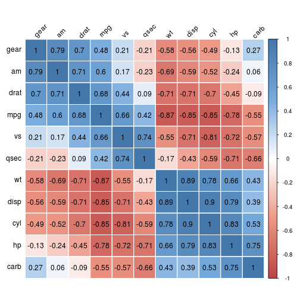
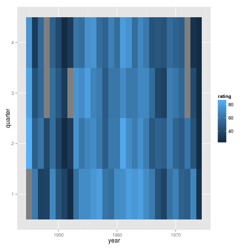
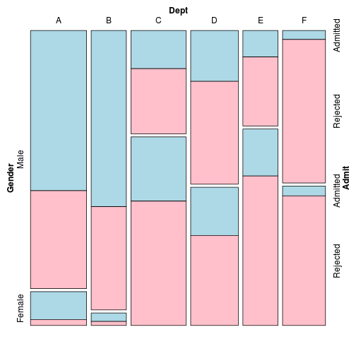
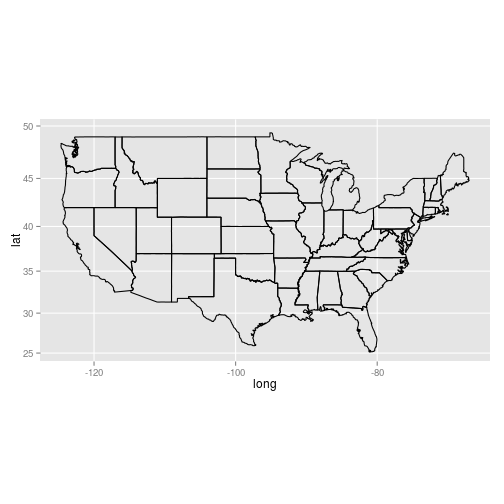
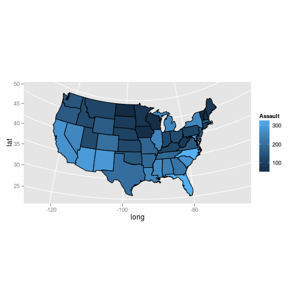

# 13. 다양한 그래프
  
이번 장에서는 특정 범주에 속하지 않는 여러 가지 시각화 자료를 만든다.  
    
> ### A. 상관 계수 행렬(correlation matrix)    
> 13.1 상관 계수 행렬 만들기    
> ### B. 함수의 그래프    
> 13.2 함수를 그래프로 그리기    
> 13.3 함수 곡선 아래의 영역 일부분에 음영 넣기    
> ### C. 네트워크 그래프(network graph)    
> 13.4 네트워크 그래프 그리기    
> 13.5 네트워크 그래프에 텍스트 라벨 넣기    
> ### D. 히트맵(heatmap)    
> 13.6 히트맵 생성하기    
> ### E. 삼차원 산점도(3D scatterplot)    
> 13.7 삼차원 산점도 생성하기    
> 13.8 삼차원 그래프에 예측면 추가하기    
> 13.9 삼차원 그래프 저장하기    
> 13.10 삼차원 그래프에 애니메이션 넣기    
> ### F. 덴드로그램(dendrogram)    
> 13.11 덴드로그램 생성하기    
> ### G. 벡터장(vector field)    
> 13.12 벡터장 그리기    
> ### H. 통계치의 그래프    
> 13.13 Q-Q 그래프 그리기    
> 13.14 경험적 누적 분포 함수 그래프 그리기    
> 13.15 모자이크 그래프 그리기    
> 13.16 파이 차트 만들기    
> ### I. 지도(map)    
> 13.17 지도 그리기    
> 13.18 단계 구분도(Choropleth Map) 만들기    
> 13.19 배경이 깨끗한 지도 만들기    
> 13.20 Shapefile로부터 지도 만들기    


필요한 패키지와 라이브러리 설치      
      

```r
#install.packages("knitr")
#install.packages("markdown")
#install.packages("ggplot2")
#install.packages("gcookbook")
#install.packages("corrplot")
#install.packages("igraph")
#install.packages("rgl")
#install.packages("vcd")
#install.packages("grid")
#install.packages("maps")
#install.packages("mapproj")
#install.packages("maptools")
library(knitr)
library(markdown)
library(ggplot2)
library(gcookbook)
library(corrplot)
library(igraph)
library(rgl)
```

```
## Warning: RGL: unable to open X11 display
## Warning: error in rgl_init
```

```r
library(vcd)
```

```
## Loading required package: grid
```

```r
library(grid)
library(maps)
library(mapproj)
library(maptools)
```

```
## Loading required package: sp
## Checking rgeos availability: FALSE
##  	Note: when rgeos is not available, polygon geometry 	computations in maptools depend on gpclib,
##  	which has a restricted licence. It is disabled by default;
##  	to enable gpclib, type gpclibPermit()
```


# A. 상관 계수 행렬(correlation matrix)

### 13.1 상관 계수 행렬 만들기

상관 계수 행렬(correlation matrix)를 만들려면    
cor를 사용해 숫자로 된 상관 계수 행렬을 생성한 다음    
열(column)을 두 개씩 묶은 각 쌍들에 대해 상관 계수를 생성해준다.     


```r
# mtcars데이터 보기
mtcars
```

```
##                      mpg cyl  disp  hp drat    wt  qsec vs am gear carb
## Mazda RX4           21.0   6 160.0 110 3.90 2.620 16.46  0  1    4    4
## Mazda RX4 Wag       21.0   6 160.0 110 3.90 2.875 17.02  0  1    4    4
## Datsun 710          22.8   4 108.0  93 3.85 2.320 18.61  1  1    4    1
## Hornet 4 Drive      21.4   6 258.0 110 3.08 3.215 19.44  1  0    3    1
## Hornet Sportabout   18.7   8 360.0 175 3.15 3.440 17.02  0  0    3    2
## Valiant             18.1   6 225.0 105 2.76 3.460 20.22  1  0    3    1
## Duster 360          14.3   8 360.0 245 3.21 3.570 15.84  0  0    3    4
## Merc 240D           24.4   4 146.7  62 3.69 3.190 20.00  1  0    4    2
## Merc 230            22.8   4 140.8  95 3.92 3.150 22.90  1  0    4    2
## Merc 280            19.2   6 167.6 123 3.92 3.440 18.30  1  0    4    4
## Merc 280C           17.8   6 167.6 123 3.92 3.440 18.90  1  0    4    4
## Merc 450SE          16.4   8 275.8 180 3.07 4.070 17.40  0  0    3    3
## Merc 450SL          17.3   8 275.8 180 3.07 3.730 17.60  0  0    3    3
## Merc 450SLC         15.2   8 275.8 180 3.07 3.780 18.00  0  0    3    3
## Cadillac Fleetwood  10.4   8 472.0 205 2.93 5.250 17.98  0  0    3    4
## Lincoln Continental 10.4   8 460.0 215 3.00 5.424 17.82  0  0    3    4
## Chrysler Imperial   14.7   8 440.0 230 3.23 5.345 17.42  0  0    3    4
## Fiat 128            32.4   4  78.7  66 4.08 2.200 19.47  1  1    4    1
## Honda Civic         30.4   4  75.7  52 4.93 1.615 18.52  1  1    4    2
## Toyota Corolla      33.9   4  71.1  65 4.22 1.835 19.90  1  1    4    1
## Toyota Corona       21.5   4 120.1  97 3.70 2.465 20.01  1  0    3    1
## Dodge Challenger    15.5   8 318.0 150 2.76 3.520 16.87  0  0    3    2
## AMC Javelin         15.2   8 304.0 150 3.15 3.435 17.30  0  0    3    2
## Camaro Z28          13.3   8 350.0 245 3.73 3.840 15.41  0  0    3    4
## Pontiac Firebird    19.2   8 400.0 175 3.08 3.845 17.05  0  0    3    2
## Fiat X1-9           27.3   4  79.0  66 4.08 1.935 18.90  1  1    4    1
## Porsche 914-2       26.0   4 120.3  91 4.43 2.140 16.70  0  1    5    2
## Lotus Europa        30.4   4  95.1 113 3.77 1.513 16.90  1  1    5    2
## Ford Pantera L      15.8   8 351.0 264 4.22 3.170 14.50  0  1    5    4
## Ferrari Dino        19.7   6 145.0 175 3.62 2.770 15.50  0  1    5    6
## Maserati Bora       15.0   8 301.0 335 3.54 3.570 14.60  0  1    5    8
## Volvo 142E          21.4   4 121.0 109 4.11 2.780 18.60  1  1    4    2
```

```r
# cor를 사용해 열(column)을 두 개씩 묶은 각 쌍들의 상관 계수 행렬을 생성
mcor <- cor(mtcars)
mcor
```

```
##          mpg     cyl    disp      hp     drat      wt    qsec      vs
## mpg   1.0000 -0.8522 -0.8476 -0.7762  0.68117 -0.8677  0.4187  0.6640
## cyl  -0.8522  1.0000  0.9020  0.8324 -0.69994  0.7825 -0.5912 -0.8108
## disp -0.8476  0.9020  1.0000  0.7909 -0.71021  0.8880 -0.4337 -0.7104
## hp   -0.7762  0.8324  0.7909  1.0000 -0.44876  0.6587 -0.7082 -0.7231
## drat  0.6812 -0.6999 -0.7102 -0.4488  1.00000 -0.7124  0.0912  0.4403
## wt   -0.8677  0.7825  0.8880  0.6587 -0.71244  1.0000 -0.1747 -0.5549
## qsec  0.4187 -0.5912 -0.4337 -0.7082  0.09120 -0.1747  1.0000  0.7445
## vs    0.6640 -0.8108 -0.7104 -0.7231  0.44028 -0.5549  0.7445  1.0000
## am    0.5998 -0.5226 -0.5912 -0.2432  0.71271 -0.6925 -0.2299  0.1683
## gear  0.4803 -0.4927 -0.5556 -0.1257  0.69961 -0.5833 -0.2127  0.2060
## carb -0.5509  0.5270  0.3950  0.7498 -0.09079  0.4276 -0.6562 -0.5696
##            am    gear     carb
## mpg   0.59983  0.4803 -0.55093
## cyl  -0.52261 -0.4927  0.52699
## disp -0.59123 -0.5556  0.39498
## hp   -0.24320 -0.1257  0.74981
## drat  0.71271  0.6996 -0.09079
## wt   -0.69250 -0.5833  0.42761
## qsec -0.22986 -0.2127 -0.65625
## vs    0.16835  0.2060 -0.56961
## am    1.00000  0.7941  0.05753
## gear  0.79406  1.0000  0.27407
## carb  0.05753  0.2741  1.00000
```

```r
# mcor를 출력하고 2자리로 반올림
round(mcor, digits=2)
```

```
##        mpg   cyl  disp    hp  drat    wt  qsec    vs    am  gear  carb
## mpg   1.00 -0.85 -0.85 -0.78  0.68 -0.87  0.42  0.66  0.60  0.48 -0.55
## cyl  -0.85  1.00  0.90  0.83 -0.70  0.78 -0.59 -0.81 -0.52 -0.49  0.53
## disp -0.85  0.90  1.00  0.79 -0.71  0.89 -0.43 -0.71 -0.59 -0.56  0.39
## hp   -0.78  0.83  0.79  1.00 -0.45  0.66 -0.71 -0.72 -0.24 -0.13  0.75
## drat  0.68 -0.70 -0.71 -0.45  1.00 -0.71  0.09  0.44  0.71  0.70 -0.09
## wt   -0.87  0.78  0.89  0.66 -0.71  1.00 -0.17 -0.55 -0.69 -0.58  0.43
## qsec  0.42 -0.59 -0.43 -0.71  0.09 -0.17  1.00  0.74 -0.23 -0.21 -0.66
## vs    0.66 -0.81 -0.71 -0.72  0.44 -0.55  0.74  1.00  0.17  0.21 -0.57
## am    0.60 -0.52 -0.59 -0.24  0.71 -0.69 -0.23  0.17  1.00  0.79  0.06
## gear  0.48 -0.49 -0.56 -0.13  0.70 -0.58 -0.21  0.21  0.79  1.00  0.27
## carb -0.55  0.53  0.39  0.75 -0.09  0.43 -0.66 -0.57  0.06  0.27  1.00
```


```r
# 상관 행렬을 그리는데 필요한 패키지를 설치
#install.packages("corrplot")
library(corrplot)

# 상관 행렬 그리기(기본형)
corrplot(mcor)
```

 


```r
# corrplot() 함수의 응용

# 사각형에 라벨을 회전
corrplot(mcor, method="shade", shade.col=NA, tl.col="black", tl.srt=45)
```

 

```r
# 사각형에 상관 계수를 표시하는 라벨을 넣기 위해 옅은 색의 팔레트를 생성
col <- colorRampPalette(c("#BB4444", "#EE9988", "#FFFFFF", "#77AADD", "#4477AA"))

# 상관관계가 큰 항목들이 함께 모이도록 order=AOE(angular order of eigenvectors) 사용
corrplot(mcor, method="shade", shade.col=NA, tl.col="black", tl.srt=45,
         col=col(200), addCoef.col="black", addcolorlabel="no", order="AOE")
```

```
## Warning: "addcolorlabel" is not a graphical parameter
## Warning: "addcolorlabel" is not a graphical parameter
## Warning: "addcolorlabel" is not a graphical parameter
```

 

* corrplot() 함수의 몇 가지 유용한 옵션들    

옵션 | 설명
---------- | ----------
type="lower","upper" | 위쪽 또는 아래쪽 삼각형만 사용
diag=FALSE | 대각선에는 값을 보여주지 않음
addshade="all" | 상관관계의 방향을 보여주는 선을 추가
shade.col=NA | 상관관계 방향선을 숨김
method="shade" | 색을 입힌 사각형을 사용
method="elipse" | 타원을 사용
addCoef.col="color" | 색깔이 있는 상관계수를 삽입
tl.srt="number" | 위쪽 라벨의 회전 각도를 지정
tl.col="color" | 라벨 색깔을 지정
order="AOE","FPC","hclust" | 고유벡터의 각도 순(angular order of eigenvectors), 제 1 주성분(first principle component) 또는 계층적 군집 분석(hierarchical clustering)을 사용해 라벨을 정렬   
    

# B. 함수의 그래프

### 13.2 함수를 그래프로 그리기

어떤 함수를 그래프로 그릴 때 stat_function()을 사용
예제로 정규 분포의 밀도를 반환해 주는  dnorm() 함수


```r
# ggplot()에 가짜로 데이터 프레임을 하나 전달하여  
# x범위를 제대로 인식하도록 하기 위해 
# 데이터 프레임을 범위를 설정하는 데에만 사용
p <- ggplot(data.frame(x=c(-3,3)), aes(x=x))

# 정규 분포 밀도 함수
p + stat_function(fun = dnorm)
```

 

```r
# 자유도가 2인  t분포 함수(추가적인 인자들은 리스트에 넣어 args로 함수에 전달)
p + stat_function(fun=dt, args=list(df=2))
```

 

```r
# 사용자 정의 함수(예제 : 시그모이드 함수sigmoid function)
myfun <- function(xvar) {
    1/(1 + exp(-xvar + 10))
}
ggplot(data.frame(x=c(0, 20)), aes(x=x)) + stat_function(fun=myfun)
```

 

```r
# 기본 설정은  x범위상의 101개 점에서 계산되므로 곡선을 부드럽게 하려면  n값을 크게 함.
ggplot(data.frame(x=c(0, 20)), aes(x=x)) + stat_function(fun=myfun, n=200)  
```

 


### 13.3 함수 곡선 아래의 영역 일부분에 음영 넣기

함수 곡선 아래의 영역 일부에 음영을 넣으려면,      
함수 주위로 새로운 래퍼 함수를 정의하고 범위 밖의 값들을  NA()로 대체.


```r
# 0 < x < 2에 대해 dnorm(x)을 반환하고, 다른 모든 x에 대해 NA를 반환
dnorm_limit <- function(x) {
    y <- dnorm(x)
    y[x < 0  |  x > 2] <- NA
    return(y)
}

# 가짜 데이터를 ggplot()에 넣음(이 함수에 전달되는 것은 개별 값이 아닌 벡터)
p <- ggplot(data.frame(x=c(-3, 3)), aes(x=x))
p + stat_function(fun=dnorm_limit, geom="area", fill="blue", alpha=0.2) +
    stat_function(fun=dnorm)
```

 

R에는 일급 함수(first-class function)이 있어 클로저(closure) 반환 함수를 만들게 해줌.    
즉, 또 다른 함수를 프로그래밍하는 함수를 프로그래밍할 수 있다는 뜻.     
예를 들어 아래의서 limitRange()와 같은 함수를 만들어두면     
어떤 함수든 해당 함수의 한정된 범위 버전을 만들기 위해 사용할 수 있으므로 재사용이 간단해짐.    


```r
# 함수, 최솟값, 최댓값을 전달하는 함수(범위 밖의 값들은 NA 로 반환)
limitRange <- function(fun, min, max) {
    function(x) {
        y <- fun(x)
        y[x < min  |  x > max] <- NA
        return(y)
    }
}
```

```r
# 이 함수를 호출해서 다른 함수를 행성(앞서 사용한  dnorm_limit()와 실질적으로 동일)
dlimit <- limitRange(dnorm, 0, 2)

# 새 함수를 시험해보면 -2부터 4의 값을 입력하면 0부터 2의 입력에 대한 값만 반환
dlimit(-2:4)
```

```
## [1]      NA      NA 0.39894 0.24197 0.05399      NA      NA
```

```r
# limitRange() 함수를 사용해 stat_function() 에 전달할 함수를 생성
p + stat_function(fun = dnorm) +
    stat_function(fun = limitRange(dnorm, 0, 2),
                  geom="area", fill="blue", alpha=0.2)
```

 


# C. 네트워크 그래프(network graph)

### 13.4 네트워크 그래프 그리기
     
네트워크 그래프를 그리려면 igraph 패키지를 사용하여    
항목 쌍들을 담고 있는 벡터를 graph()에 전달한 다음 결과 객체를 그래프로 그림   
* 주의 : 상황에 따라 달라지는 값들을 고정된 값으로 매번 코딩하면 유연성이 떨어짐     
      

```r
# igraph 패키지를 설치
#install.packages("igraph")
library(igraph)

# 방향이 있는(directed) 그래프를 만들 때 연결선(edge)를 지정
gd <- graph(c(1,2, 2,3, 2,4, 1,4, 5,5, 3,6))
plot(gd)
```

 

```r
# 방향이 없는(undirected graph) 그래프
gu <- graph(c(1,2, 2,3, 2,4, 1,4, 5,5, 3,6), directed=FALSE)
plot(gu)
```

 

```r
# 라벨을 제거
plot(gu, vertex.label=NA)
```

 

```r
# 각 그래프 객체의 구조 확인
str(gd)
```

```
## IGRAPH D--- 6 6 -- 
## + edges:
## [1] 1->2 2->3 2->4 1->4 5->5 3->6
```

```r
str(gu)
```

```
## IGRAPH U--- 6 6 -- 
## + edges:
## [1] 1--2 2--3 2--4 1--4 5--5 3--6
```

네트워크 그래프에서 노드(node)의 위치는 데이터에서 지정하는 것이 아니고 랜덤하게 분포.     
똑같은 출력을 반복하려면 그래프를 만들기 전에 랜덤 시드를 설정해야함. 


```r
# 시드 설정 
set.seed(229)
plot(gu)
```

 

```r
set.seed(100)
plot(gu)
```

 

데이터 프레임으로부터 그래프를 생성하는 것도 가능.      
데이터 프레임의 맨 앞 두 열이 사용되고, 각 행은 두 노드 사이의 연결을 의미. 


```r
library(gcookbook)
head(madmen2, 10)
```

```
##                       Name1         Name2
## 1               Abe Drexler   Peggy Olson
## 2                   Allison    Don Draper
## 3               Arthur Case  Betty Draper
## 4      Bellhop in Baltimore    Sal Romano
## 5          Bethany Van Nuys    Don Draper
## 6              Betty Draper    Don Draper
## 7              Betty Draper Henry Francis
## 8              Betty Draper    Random guy
## 9            Bobbie Barrett    Don Draper
## 10 Brooklyn College Student   Peggy Olson
```

```r
# 데이터 프레임으로부터 방향이 있는 그래프 생성(Fruchterman-Reingold 알고리즘 사용)
g <- graph.data.frame(madmen2, directed=TRUE)
par(mar=c(0,0,0,0))   # 불필요한 여백을 제거
plot(g, layout=layout.fruchterman.reingold, vertex.size=8, edge.arrow.size=0.5,
     vertex.label=NA)   
```

 

```r
# 데이터 프레임으로부터 방향이 없는 원형 그래프 생성
g <- graph.data.frame(madmen, directed=FALSE)
par(mar=c(0,0,0,0))  # 불필요한 여백을 제거
plot(g, layout=layout.circle, vertex.size=8, vertex.label=NA)
```

 

* igraph의 대안은  Rgraphviz로, 그래프 시각화 관련 오픈소스 라이브러리인       
  Graphviz의 프론트 엔드 버전이며 설치가 약간 까다롭다(Bioconductor저장소에서 구함)     
     

### 13.5 네트워크 그래프에 텍스트 라벨 넣기

네트워크 그래프에서 텍스트 라벨을 사용하려면      
vertex.label에 이름으로 이루어진 벡터를 전달.       


```r
library(igraph)
library(gcookbook)
# madmen을 복사한 뒤 한 행 걸러 선택
m <- madmen[1:nrow(madmen) %% 2 == 1, ]
g <- graph.data.frame(m, directed=FALSE)

# 각 노드의 이름을 출력
V(g)$name
```

```
##  [1] "Betty Draper"      "Don Draper"        "Harry Crane"      
##  [4] "Joan Holloway"     "Lane Pryce"        "Peggy Olson"      
##  [7] "Pete Campbell"     "Roger Sterling"    "Sal Romano"       
## [10] "Henry Francis"     "Allison"           "Candace"          
## [13] "Faye Miller"       "Megan Calvet"      "Rachel Menken"    
## [16] "Suzanne Farrell"   "Hildy"             "Franklin"         
## [19] "Rebecca Pryce"     "Abe Drexler"       "Duck Phillips"    
## [22] "Playtex bra model" "Ida Blankenship"   "Mirabelle Ames"   
## [25] "Vicky"             "Kitty Romano"
```

```r
plot(g, layout=layout.fruchterman.reingold,
     vertex.size        = 4,          # 노드 크기를 작게
     vertex.label       = V(g)$name,  # 라벨을 설정
     vertex.label.cex   = 0.8,        # 폰트 크기를 약간 작게
     vertex.label.dist  = 0.4,        # 라벨 위치 옮김
     vertex.label.color = "black")
```

 
    
값들을  plot() 에 인자로 전달하는 대신, plot() 객체를 수정해도 동일한 결과. 
이를 위해 V()$xxx <- 를 사용. 
    

```r
# 다음 코드는 앞의 코드와 같은 그래프를 출력
V(g)$size        <- 4
V(g)$label       <- V(g)$name
V(g)$label.cex   <- 0.8
V(g)$label.dist  <- 0.4
V(g)$label.color <- "black"

# 그래프 전체의 속성을 설정
g$layout <- layout.fruchterman.reingold

plot(g)
```

 

마찬가지로 E() 함수를 쓰거나  edge.xxx 인자에 값을 전달하는 방법으로     
연결선의 속성도 설정할 수 있음. 


```r
# 연결선 보기
E(g)
```

```
## Edge sequence:
##                                            
## [1]  Henry Francis     -- Betty Draper     
## [2]  Allison           -- Don Draper       
## [3]  Don Draper        -- Betty Draper     
## [4]  Candace           -- Don Draper       
## [5]  Faye Miller       -- Don Draper       
## [6]  Megan Calvet      -- Don Draper       
## [7]  Rachel Menken     -- Don Draper       
## [8]  Suzanne Farrell   -- Don Draper       
## [9]  Hildy             -- Harry Crane      
## [10] Franklin          -- Joan Holloway    
## [11] Roger Sterling    -- Joan Holloway    
## [12] Rebecca Pryce     -- Lane Pryce       
## [13] Abe Drexler       -- Peggy Olson      
## [14] Duck Phillips     -- Peggy Olson      
## [15] Pete Campbell     -- Peggy Olson      
## [16] Playtex bra model -- Pete Campbell    
## [17] Ida Blankenship   -- Roger Sterling   
## [18] Mirabelle Ames    -- Roger Sterling   
## [19] Vicky             -- Roger Sterling   
## [20] Kitty Romano      -- Sal Romano
```

```r
# 몇몇 라벨을  "M"으로 설정
E(g)[c(2,11,19)]$label <- "M"
plot(g)
```

 

```r
# 모든 연결선을 회색으로 설정한 뒤 몇 개만 빨간색으로 변경
E(g)$color             <- "grey70"
E(g)[c(2,11,19)]$color <- "red"
plot(g)
```

 
   
   
# D. 히트맵(heatmap)

### 13.6 히트맵 생성하기

히트맵을 만들려면 geom_tile() 또는 geom_raster()를 사용하고 fill 에 연속변수를 대입.     


```r
# 시계열 객체인 president 데이터 세트 사용
presidents
```

```
##      Qtr1 Qtr2 Qtr3 Qtr4
## 1945   NA   87   82   75
## 1946   63   50   43   32
## 1947   35   60   54   55
## 1948   36   39   NA   NA
## 1949   69   57   57   51
## 1950   45   37   46   39
## 1951   36   24   32   23
## 1952   25   32   NA   32
## 1953   59   74   75   60
## 1954   71   61   71   57
## 1955   71   68   79   73
## 1956   76   71   67   75
## 1957   79   62   63   57
## 1958   60   49   48   52
## 1959   57   62   61   66
## 1960   71   62   61   57
## 1961   72   83   71   78
## 1962   79   71   62   74
## 1963   76   64   62   57
## 1964   80   73   69   69
## 1965   71   64   69   62
## 1966   63   46   56   44
## 1967   44   52   38   46
## 1968   36   49   35   44
## 1969   59   65   65   56
## 1970   66   53   61   52
## 1971   51   48   54   49
## 1972   49   61   NA   NA
## 1973   68   44   40   27
## 1974   28   25   24   24
```

```r
str(presidents)
```

```
##  Time-Series [1:120] from 1945 to 1975: NA 87 82 75 63 50 43 32 35 60 ...
```

```r
# ggplot()이 쓸 수 있는 형식으로 변환하기 위해 열에 수치형 값이 있는 데이터 프레임으로 바꿈
pres_rating <- data.frame(
    rating  = as.numeric(presidents),
    year    = as.numeric(floor(time(presidents))),
    quarter = as.numeric(cycle(presidents))
)

head(pres_rating, 10)
```

```
##    rating year quarter
## 1      NA 1945       1
## 2      87 1945       2
## 3      82 1945       3
## 4      75 1945       4
## 5      63 1946       1
## 6      50 1946       2
## 7      43 1946       3
## 8      32 1946       4
## 9      35 1947       1
## 10     60 1947       2
```

geom_tile()이나 geom_raster()로 히트맵 생성


```r
# 기본 그래프
p <- ggplot(pres_rating, aes(x=year, y=quarter, fill=rating))

# geom_tile() 사용
p + geom_tile()
```

 

```r
# geom_raster() 사용(보기엔 똑같지만 조금 효율적)
p + geom_raster()
```

 

정보를 더 잘 전달하기 위해 히트맵의 외형을 변경


```r
# y축을 뒤집어 시간이 위에서 아래로 흐르도록 방향을 바꾸고
# x축을 따라 4년마다 눈금 표시를 집어넣어 대통령 임기와 일치시킴. 
# 중간색/양끝색을 지정할 수 있는 scale_fill_gradient2()를 사용해 색상 척도 변경. 
p + geom_tile() +
    scale_x_continuous(breaks = seq(1940, 1976, by = 4)) +
    scale_y_reverse() +
    scale_fill_gradient2(midpoint=50, mid="grey70", limits=c(0,100))
```

 


# E. 삼차원 산점도(3D scatterplot)

### 13.7 삼차원 산점도 생성하기

삼차원 산점도를 만들기 만들기 위해서 plot3D()와 같은 3D 그래픽스를 위한       
OpenGL  그래픽스 라이브러리 인터페이스를 제공하는 rgl패키지를 사용.


```r
# 패키지 설치
#install.packages("rgl")
library(rgl)
```
    
         

```r
### 3D 산점도 생성
### (기본은 사각형 점이므로 type="s"로 구형으로, size=0.75로 바꾸고, lit-FALSE로 조명 끔)
### 마우스로 이미지를 회전하거나, 휠로 줌인/줌아웃을 할 수 있음
plot3d(mtcars$wt, mtcars$disp, mtcars$mpg, type="s", size=0.75, lit=FALSE)
```

```
## Error: rgl.open failed
```

3D 산점도의 데이터를 더 이해하기 쉽게 도와주는 방법들


```r
### 두 벡터의 원소들을 사이사이에 끼워 넣기 위한 함수
interleave <- function(v1, v2)  as.vector(rbind(v1,v2))

### 점을 그래프로 그린다 
plot3d(mtcars$wt, mtcars$disp, mtcars$mpg,
       xlab="Weight", ylab="Displacement", zlab="MPG",
       size=.75, type="s", lit=FALSE)
```

```
## Error: rgl.open failed
```

```r
### 선분을 추가한다 
segments3d(interleave(mtcars$wt,   mtcars$wt),
           interleave(mtcars$disp, mtcars$disp),
           interleave(mtcars$mpg,  min(mtcars$mpg)),
           alpha=0.4, col="blue")
```

```
## Error: rgl.open failed
```

```r
### 축의 눈금 표시와 라벨 없이 그래프를 그린다 
plot3d(mtcars$wt, mtcars$disp, mtcars$mpg,
       xlab = "", ylab = "", zlab = "",
       axes = FALSE,
       size=.75, type="s", lit=FALSE)
```

```
## Error: rgl.open failed
```

```r
segments3d(interleave(mtcars$wt,   mtcars$wt),
           interleave(mtcars$disp, mtcars$disp),
           interleave(mtcars$mpg,  min(mtcars$mpg)),
           alpha = 0.4, col = "blue")
```

```
## Error: rgl.open failed
```

```r
### 박스를 그린다 
rgl.bbox(color="grey50",          # grey50 색 표면과 검은색 텍스트
         emission="grey50",       # 발광 색상은 grey50
         xlen=0, ylen=0, zlen=0)  # 눈금 표시를 넣지 않음
```

```
## Error: rgl_bbox
```

```r
### 앞으로 만들 모든 객체의 기본 색깔을 검은색으로 지정
rgl.material(color="black")

### 특정 면에만 축을 삽입. "x--", "x-+", "x+-", and "x++". 등의 값을 쓸 수 있다 
axes3d(edges=c("x--", "y+-", "z--"),
       ntick=6,                       # 각 면에 6개의 눈금 표시를 넣게 시도한다 
       cex=.75)                       # 폰트 크기를 줄인다 
```

```
## Error: rgl.open failed
```

```r
### 축 라벨을 넣는다. 'line'은 라벨이 축에서 얼마나 멀리 떨어지는지를 지정한다  
mtext3d("Weight",       edge="x--", line=2)
```

```
## Error: rgl.open failed
```

```r
mtext3d("Displacement", edge="y+-", line=3)
```

```
## Error: rgl.open failed
```

```r
mtext3d("MPG",          edge="z--", line=3)
```

```
## Error: rgl.open failed
```


### 13.8 삼차원 그래프에 예측면 추가하기

삼차원 산점도에 예측한 값들로 이루어진 표면을 추가하기 


```r
### 모형이 주어지면 xvar와 yvar를 가지고 zvar를 예측
### x와 y 변수 범위와 16X16 격자를 기본 값으로 한다
predictgrid <- function(model, xvar, yvar, zvar, res = 16, type = NULL) {
  # 예측 변수의 범위를 찾는다. lm과 glm, 그리고 몇 가지 다른 객체에 작동하지만
  # 다른 객체에 대해서는 코드의 변경이 필요할 수 있다
  xrange <- range(model$model[[xvar]])
  yrange <- range(model$model[[yvar]])

  newdata <- expand.grid(x = seq(xrange[1], xrange[2], length.out = res),
                         y = seq(yrange[1], yrange[2], length.out = res))
  names(newdata) <- c(xvar, yvar)
  newdata[[zvar]] <- predict(model, newdata = newdata, type = type)
  newdata
}


### x, y, z 변수들이 길게 든 데이터 프레임을
### x와 y를 행/열 값으로 하는 리스트 하나로 변환, z를 행렬로 변환한다 
df2mat <- function(p, xvar = NULL, yvar = NULL, zvar = NULL) {
  if (is.null(xvar)) xvar <- names(p)[1]
  if (is.null(yvar)) yvar <- names(p)[2]
  if (is.null(zvar)) zvar <- names(p)[3]

  x <- unique(p[[xvar]])
  y <- unique(p[[yvar]])
  z <- matrix(p[[zvar]], nrow = length(y), ncol = length(x))

  m <- list(x, y, z)
  names(m) <- c(xvar, yvar, zvar)
  m
}

### 두 벡터의 원소들을 사이사이에 끼워 넣기 위한 함수
interleave <- function(v1, v2)  as.vector(rbind(v1,v2))
```

이러한 유틸리티 함수들을 정의한 다음, surface3d() 함수를 사용해서     
데이터로부터 선형 모형을 만들고 이것을 데이터와 함께 그물망(mesh) 형태로 그래프에 넣을 수 있다    
     

```r
library(rgl)

### 데이터 세트의 복사본을 만든다 
m <- mtcars

### 선형 모형을 생성한다 
mod <- lm(mpg ~ wt + disp + wt:disp, data = m)

### wt와 disp로부터 mpg 값을 예측한다 
m$pred_mpg <- predict(mod)

### wt와 disp 격자로부터 예측된 mpg를 구한다 
mpgrid_df <- predictgrid(mod, "wt", "disp", "mpg")
mpgrid_list <- df2mat(mpgrid_df)

### 데이터 점들을 가지고 그래프를 그린다 
plot3d(m$wt, m$disp, m$mpg, type="s", size=0.5, lit=FALSE)
```

```
## Error: rgl.open failed
```

```r
### 상응하는 예측 점들을 넣는다(더 작은 크기로)
spheres3d(m$wt, m$disp, m$pred_mpg, alpha=0.4, type="s", size=0.5, lit=FALSE)
```

```
## Error: rgl.open failed
```

```r
### 오차를 보여주는 선분을 추가한다 
segments3d(interleave(m$wt,   m$wt),
           interleave(m$disp, m$disp),
           interleave(m$mpg,  m$pred_mpg),
           alpha=0.4, col="red")
```

```
## Error: rgl.open failed
```

```r
### 예측 값으로 만든 메시를 추가한다 
surface3d(mpgrid_list$wt, mpgrid_list$disp, mpgrid_list$mpg,
          alpha=0.4, front="lines", back="lines")
```

```
## Error: rgl.open failed
```

그래프 외형에 변화를 줄 수 있다. 


```r
plot3d(mtcars$wt, mtcars$disp, mtcars$mpg,
       xlab = "", ylab = "", zlab = "",
       axes = FALSE,
       size=.5, type="s", lit=FALSE)
```

```
## Error: rgl.open failed
```

```r
### 상응하는 예측점들을 넣는다(더 작은 크기로)
spheres3d(m$wt, m$disp, m$pred_mpg, alpha=0.4, type="s", size=0.5, lit=FALSE)
```

```
## Error: rgl.open failed
```

```r
### 오차를 보여주는 선분을 추가한다 
segments3d(interleave(m$wt,   m$wt),
           interleave(m$disp, m$disp),
           interleave(m$mpg,  m$pred_mpg),
           alpha=0.4, col="red")
```

```
## Error: rgl.open failed
```

```r
### 예측 값으로 만든 메시를 추가한다 
surface3d(mpgrid_list$wt, mpgrid_list$disp, mpgrid_list$mpg,
          alpha=0.4, front="lines", back="lines")
```

```
## Error: rgl.open failed
```

```r
### 박스를 그린다 
rgl.bbox(color="grey50",          # grey60 surface and black text
         emission="grey50",       # emission color is grey50
         xlen=0, ylen=0, zlen=0)  # Don't add tick marks
```

```
## Error: rgl_bbox
```

```r
### 앞으로 만들 모든 객체의 기본 색깔을 검은색으로 지정
rgl.material(color="black")

### 특정 면에만 축을 삽입.  "x--", "x-+", "x+-", and "x++". 등의 값을 쓸 수 있다 
axes3d(edges=c("x--", "y+-", "z--"),
       ntick=6,                       # 각 면에 6개의 눈금 표시를 넣게 시도한다 
       cex=.75)                       # 폰트 크기를 줄인다 
```

```
## Error: rgl.open failed
```

```r
### 축 라벨을 넣는다. 'line'은 라벨이 축에서 얼마나 멀리 떨어지는지를 지정한다 
mtext3d("Weight",       edge="x--", line=2)
```

```
## Error: rgl.open failed
```

```r
mtext3d("Displacement", edge="y+-", line=3)
```

```
## Error: rgl.open failed
```

```r
mtext3d("MPG",          edge="z--", line=3)
```

```
## Error: rgl.open failed
```


### 13.9 삼차원 그래프 저장하기

rgl 패키지로 생성한 삼차원 그래프를 저장한다 


```r
### rgl 로 만든 비트맵 그래프 이미지를 저장하기 위해  rgl.snapshot()을 사용한다 
library(rgl)
plot3d(mtcars$wt, mtcars$disp, mtcars$mpg, type="s", size=0.75, lit=FALSE)
```

```
## Error: rgl.open failed
```

```r
rgl.snapshot('3dplot.png', fmt='png')
```

```
## Error: failed
```

```r
### rgl.postscript()를 사용해서 postscript 또는 PDF 파일로 저장해도 된다
rgl.postscript('figs/miscgraph/3dplot.pdf', fmt='pdf')
```

```
## Warning: postscript conversion failed
```

```r
rgl.postscript('figs/miscgraph/3dplot.ps', fmt='ps')
```

```
## Warning: postscript conversion failed
```

출력을 반복 가능하게 만들기 위해 현재 시점을 저장한 뒤 추후 복원할 수도 있다


```r
### 현재 시점을 저장
view <- par3d("userMatrix")
```

```
## Error: rgl.open failed
```

```r
### 저장된 시점을 복원
par3d(userMatrix = view)
```

```
## Error: object 'view' not found
```

```r
### 스크립트에 view를 저장하려면  dput()을 사용한 다음 출력된 결과를 스크립트에 복사해서 붙어넣는
dput(view)
```

```
## Error: object 'view' not found
```

```r
structure(c(0.907931625843048, 0.267511069774628, -0.322642296552658,
0, -0.410978674888611, 0.417272746562958, -0.810543060302734,
0, -0.0821993798017502, 0.868516683578491, 0.488796472549438,
0, 0, 0, 0, 1), .Dim = c(4L, 4L))
```

```
##         [,1]    [,2]    [,3] [,4]
## [1,]  0.9079 -0.4110 -0.0822    0
## [2,]  0.2675  0.4173  0.8685    0
## [3,] -0.3226 -0.8105  0.4888    0
## [4,]  0.0000  0.0000  0.0000    1
```

```r
### userMatrix의 텍스트 표현을 얻었으면, 다음 코드를 스크립트에 추가한다 
view <- structure(c(0.907931625843048, 0.267511069774628, -0.322642296552658,
0, -0.410978674888611, 0.417272746562958, -0.810543060302734,
0, -0.0821993798017502, 0.868516683578491, 0.488796472549438,
0, 0, 0, 0, 1), .Dim = c(4L, 4L))

par3d(userMatrix = view)
```

```
## Error: rgl.open failed
```


### 13.10 삼차원 그래프에 애니메이션 넣기

삼차원 그래프의 시점을 회전시키는 애니메이션을 넣으려면 spin3d()와 함께 play3d()를 사용한다 


```r
library(rgl)
plot3d(mtcars$wt, mtcars$disp, mtcars$mpg, type="s", size=0.75, lit=FALSE)
```

```
## Error: rgl.open failed
```

```r
play3d(spin3d())
```

```
## Error: rgl.open failed
```

기본 설정으로, R에 커맨드를 입력하기 전까지 그래프는 z(수직)를 기준으로 회전한다.     
회전 축과 회전 속도, 지속 시간은 조절할 수 있다 


```r
### 4rpm으로 20초 동안 x축 회전
play3d(spin3d(axis=c(1,0,0), rpm=4), duration=20)
```

```
## Error: rgl.open failed
```

동영상을 저장하려면 movie3d() 함수를 사용한다. 
이 함수는 프레임마다 .png 파일들을 연속으로 생성하며 ImageMagick이라는 이미지 유틸리티의       
convert 프로그램을 사용해서 이 파일들을 하나의 .gif 파일로 합쳐 준다. 


```r
### 4rpm으로 15초 동안 z 축 회전 
movie3d(spin3d(axis=c(0,0,1), rpm=4), duration=15, fps=50)
```

```
## Error: rgl.open failed
```

출력된 파일은 임시 디렉터리에 저장되며, 이름은 R콘솔에 출력된다. 
    
    
# F. 덴드로그램(dendrogram)

### 13.11 덴드로그램 생성하기

항목들이 어떻게 군집(cluster)으로 나뉘어 있는지 보여주기 위해 덴드로그램을 만들려면,     
hclust()를 사용한 다음 이 결과물을 가지고 그래프를 그리는데 데이터 처리에 시간이 걸릴 수 있다 


```r
library(gcookbook) 

# 2009년의 데이터를 가져온다. 
c2 <- subset(countries, Year==2009)

# 결측치가 들어간 행들을 누락시킨다. 
c2 <- c2[complete.cases(c2), ]

# 랜덤으로 25개의 국가를 고른다.(추후 반복 가능하도록 랜덤 시드를 설정한다)
set.seed(201)
c2 <- c2[sample(1:nrow(c2), 25), ]

c2
```

```
##                   Name Code Year     GDP laborrate healthexp infmortality
## 6731          Mongolia  MNG 2009  1690.4      72.9     74.20         27.8
## 1733            Canada  CAN 2009 39599.0      67.8   4379.76          5.2
## 4028         Guatemala  GTM 2009  2685.0      66.9    186.12         25.9
## 611            Austria  AUT 2009 45555.4      60.4   5037.31          3.6
## 10964           Zambia  ZMB 2009  1006.4      69.2     47.06         71.5
## 1478          Bulgaria  BGR 2009  6403.1      54.5    474.85         11.1
## 662         Azerbaijan  AZE 2009  4808.2      63.0    284.73         41.1
## 3824            Greece  GRC 2009 28936.5      53.7   3040.73          3.5
## 1070             Benin  BEN 2009   771.7      72.7     31.93         74.7
## 2957  Egypt, Arab Rep.  EGY 2009  2370.7      48.8    113.30         20.0
## 4844             Italy  ITA 2009 35073.3      49.1   3327.63          3.2
## 7037             Nepal  NPL 2009   438.2      71.5     25.34         43.3
## 6119          Malaysia  MYS 2009  6908.7      62.0    336.44          5.6
## 4793            Israel  ISR 2009 26102.4      57.1   1966.47          3.7
## 5252       Korea, Rep.  KOR 2009 17110.0      60.9   1107.95          4.3
## 5099             Kenya  KEN 2009   744.4      82.2     33.25         56.3
## 152            Algeria  DZA 2009  4022.2      58.5    267.95         32.0
## 2447           Croatia  HRV 2009 14322.6      53.0   1120.37          4.9
## 5609           Lesotho  LSO 2009   800.4      74.0     70.05         67.0
## 4691           Ireland  IRL 2009 49737.9      63.6   4951.84          3.4
## 7343           Nigeria  NGA 2009  1091.1      56.2     69.30         90.4
## 5660           Liberia  LBR 2009   229.3      71.1     29.36         77.6
## 5558           Lebanon  LBN 2009  8321.4      46.1    663.27         19.4
## 5966    Macedonia, FYR  MKD 2009  4510.2      54.0    313.69         10.6
## 10148     Turkmenistan  TKM 2009  3710.5      68.0     77.07         48.0
```

```r
# 행 이름을 설정하고, 군집화에 사용되지 않는 Name, Code, Year 열을 제외시킨다. 
rownames(c2) <- c2$Name
c2 <- c2[,4:7]
c2
```

```
##                      GDP laborrate healthexp infmortality
## Mongolia          1690.4      72.9     74.20         27.8
## Canada           39599.0      67.8   4379.76          5.2
## Guatemala         2685.0      66.9    186.12         25.9
## Austria          45555.4      60.4   5037.31          3.6
## Zambia            1006.4      69.2     47.06         71.5
## Bulgaria          6403.1      54.5    474.85         11.1
## Azerbaijan        4808.2      63.0    284.73         41.1
## Greece           28936.5      53.7   3040.73          3.5
## Benin              771.7      72.7     31.93         74.7
## Egypt, Arab Rep.  2370.7      48.8    113.30         20.0
## Italy            35073.3      49.1   3327.63          3.2
## Nepal              438.2      71.5     25.34         43.3
## Malaysia          6908.7      62.0    336.44          5.6
## Israel           26102.4      57.1   1966.47          3.7
## Korea, Rep.      17110.0      60.9   1107.95          4.3
## Kenya              744.4      82.2     33.25         56.3
## Algeria           4022.2      58.5    267.95         32.0
## Croatia          14322.6      53.0   1120.37          4.9
## Lesotho            800.4      74.0     70.05         67.0
## Ireland          49737.9      63.6   4951.84          3.4
## Nigeria           1091.1      56.2     69.30         90.4
## Liberia            229.3      71.1     29.36         77.6
## Lebanon           8321.4      46.1    663.27         19.4
## Macedonia, FYR    4510.2      54.0    313.69         10.6
## Turkmenistan      3710.5      68.0     77.07         48.0
```

```r
# infmortality의 효과는 GDP에 비해 무시할 만큼 작으므로, 데이터를 비교가능하게 확대/축소한다. 
# scale() 함수는 기본적으로 각 열을 자신의 표준 편차에 비례하게 맞춤으로써 정규화한다.  
c3 <- scale(c2)
c3
```

```
##                      GDP laborrate  healthexp infmortality
## Mongolia         -0.6783   1.15029 -0.6341394     -0.08335
## Canada            1.7505   0.59747  1.9736220     -0.88015
## Guatemala        -0.6146   0.49992 -0.5663495     -0.15033
## Austria           2.1321  -0.20465  2.3718821     -0.93656
## Zambia           -0.7222   0.74923 -0.6505785      1.45737
## Bulgaria         -0.3764  -0.84418 -0.3914778     -0.67213
## Azerbaijan       -0.4786   0.07718 -0.5066289      0.38557
## Greece            1.0673  -0.93090  1.1626100     -0.94009
## Benin            -0.7372   1.12861 -0.6597408      1.57019
## Egypt, Arab Rep. -0.6348  -1.46203 -0.6104582     -0.35835
## Italy             1.4605  -1.42951  1.3363751     -0.95066
## Nepal            -0.7586   0.99853 -0.6637287      0.46313
## Malaysia         -0.3440  -0.03122 -0.4753076     -0.86605
## Israel            0.8857  -0.56235  0.5119590     -0.93303
## Korea, Rep.       0.3096  -0.15045 -0.0080252     -0.91188
## Kenya            -0.7390   2.15836 -0.6589411      0.92147
## Algeria          -0.5289  -0.41060 -0.5167913      0.06473
## Croatia           0.1310  -1.00677 -0.0005011     -0.89073
## Lesotho          -0.7354   1.26952 -0.6366519      1.29872
## Ireland           2.4001   0.14221  2.3201175     -0.94361
## Nigeria          -0.7167  -0.65991 -0.6371077      2.12372
## Liberia          -0.7720   0.95518 -0.6612990      1.67244
## Lebanon          -0.2535  -1.75470 -0.2773526     -0.37950
## Macedonia, FYR   -0.4977  -0.89838 -0.4890859     -0.68976
## Turkmenistan     -0.5489   0.61915 -0.6324003      0.62884
## attr(,"scaled:center")
##          GDP    laborrate    healthexp infmortality 
##     12277.96        62.29      1121.20        30.16 
## attr(,"scaled:scale")
##          GDP    laborrate    healthexp infmortality 
##    15607.853        9.226     1651.057       28.363
```

```r
# hclust() 함수는 여러 가지 군집 분석 방식을 제공한다. 
# 기본은 'complete'이고, 그외 'ward', 'single', 'average', 'mcquitty', 'centroid' 등이 있다. 
hc <- hclust(dist(c3))

# 덴드로그램을 만든다. 
plot(hc)
```

 

```r
# 텍스트를 정렬한다 
plot(hc, hang = -1)
```

 


# G. 벡터장(vector field)

### 13.12 벡터장 그리기

벡터장(vector field)를 만들려면 geom_segment() 를 사용한다. 


```r
library(gcookbook)
head(isabel, 10)
```

```
##      x     y     z vx vy vz  t speed
## 1  -83 41.70 0.035 NA NA NA NA    NA
## 2  -83 41.56 0.035 NA NA NA NA    NA
## 3  -83 41.41 0.035 NA NA NA NA    NA
## 4  -83 41.27 0.035 NA NA NA NA    NA
## 5  -83 41.12 0.035 NA NA NA NA    NA
## 6  -83 40.98 0.035 NA NA NA NA    NA
## 7  -83 40.83 0.035 NA NA NA NA    NA
## 8  -83 40.69 0.035 NA NA NA NA    NA
## 9  -83 40.55 0.035 NA NA NA NA    NA
## 10 -83 40.40 0.035 NA NA NA NA    NA
```

```r
tail(isabel, 10)
```

```
##             x     y     z     vx     vy        vz      t speed
## 156241 -62.13 25.11 18.04 -12.92 -5.635 -0.085394 -67.22 14.10
## 156242 -62.13 24.96 18.04 -12.82 -5.611 -0.098288 -67.15 14.00
## 156243 -62.13 24.82 18.04 -12.69 -5.539 -0.090923 -67.08 13.84
## 156244 -62.13 24.67 18.04 -12.46 -5.471 -0.056029 -67.02 13.61
## 156245 -62.13 24.53 18.04 -12.14 -5.420 -0.022862 -67.00 13.30
## 156246 -62.13 24.39 18.04 -11.76 -5.391 -0.006700 -67.01 12.94
## 156247 -62.13 24.24 18.04 -11.52 -5.386 -0.006834 -67.01 12.72
## 156248 -62.13 24.10 18.04 -11.40 -5.315  0.009657 -67.00 12.58
## 156249 -62.13 23.95 18.04 -11.38 -5.275  0.040922 -67.00 12.54
## 156250 -62.13 23.81 18.04 -12.17 -5.436  0.030216 -66.98 13.33
```

```r
# x : 경도, y : 위도, z : 높이(단위 km)
# vx, vy, vz : 각 방향들의 풍속 성분(component)(단위 m/s)
    
# x와 y 값을 각 선분의 시작점으로 준 다음, vx 와 vy 값의 일부를 더해 각 선분의 끝점을 얻는다. 
islice <- subset(isabel, z == min(z))

ggplot(islice, aes(x=x, y=y)) +
       geom_segment(aes(xend = x + vx/50, yend = y + vy/50),
                    size = 0.25)   # 선분을 0.25mm 두께로 만든다. 
```

```
## Warning: Removed 3745 rows containing missing values (geom_segment).
```

 

데이터가 너무 고해상도라서 읽기 힘들고,    
선분에 화살표 머리가 없어 흐름의 방향을 보여주지 못한다는 문제를 해결한다. 

(1) every_n()이라는 함수를 정의해 매 n개의 값들 중 하나만 유지하고 나머지는 제외시킨다. 


```r
# 전체 z중 z가 최솟값인 데이터만 추린다. 
islice <- subset(isabel, z == min(z))

# 벡터  x 에서 'by' 값만큼의 개수 중 하나씩만을 유지한다. 
every_n <- function(x, by = 2) {
    x <- sort(x)
    x[seq(1, length(x), by = by)]
}

# x와 y에서 매 4 값마다 1개만 유지한다. 
keepx <- every_n(unique(isabel$x), by=4)
keepy <- every_n(unique(isabel$y), by=4)

# x 값이 keepx에 들어 있고, y 값이 keepy에 들어 있는 행들만 유지한다. 
islicesub <- subset(islice, x %in% keepx  &  y %in% keepy)
```

(2) 화살표 머리를 추가하여 그래프를 그린다. 


```r
# arrow() 항수를 위해  grid를 로딩한다. 
#install.packages("grid")
library(grid)

# 데이터 부분 집합을 가지고 0.1cm 길이의 화살표를 넣은 그래프를 만든다. 
ggplot(islicesub, aes(x=x, y=y)) +
    geom_segment(aes(xend = x+vx/50, yend = y+vy/50),
                 arrow = arrow(length = unit(0.1, "cm")), size = 0.25)
```

```
## Warning: Removed 248 rows containing missing values (geom_segment).
```

 

데이터 해석을 왜곡시키는 효과를 완화하도록 다른 속성들에도 속도를 대입한다. 
여기서는 speed를  alpha에 대입해본다. 


```r
# 현재 'speed' 열에 z 성분이 포함되어 있으므로, 수평 속도인  speedxy를 계산한다. 
islicesub$speedxy <- sqrt(islicesub$vx^2 + islicesub$vy^2)

# speed를 alpha에 대입한다. 
ggplot(islicesub, aes(x=x, y=y)) +
    geom_segment(aes(xend = x+vx/50, yend = y+vy/50, alpha = speed),
                 arrow = arrow(length = unit(0.1,"cm")), size = 0.6)
```

```
## Warning: Removed 248 rows containing missing values (geom_segment).
```

 

미국 지도를 추가하고, 관심 있는 지역으로 줌인해 보자. 


```r
# 미국 지도 데이터를 가져온다.
usa <- map_data("usa") 
# 에러: 함수 "map_data"를 찾을 수 없습니다

# speed를 colour에 대입하고, "grey80"부터 "darkred"까지로 색상을 설정한다. 
ggplot(islicesub, aes(x=x, y=y)) +
    geom_segment(aes(xend = x+vx/50, yend = y+vy/50, colour = speed),
                 arrow = arrow(length = unit(0.1,"cm")), size = 0.6) +
    scale_colour_continuous(low="grey80", high="darkred") +
    geom_path(aes(x=long, y=lat, group=group), data=usa) +
    coord_cartesian(xlim = range(islicesub$x), ylim = range(islicesub$y))
```

```
## Warning: Removed 248 rows containing missing values (geom_segment).
```

 

```r
# x와 y에서 5개의 값마다 하나씩만 유지하고, z에서는 2개의 값마다 하나씩만 유지한다. 
keepx <- every_n(unique(isabel$x), by=5)
keepy <- every_n(unique(isabel$y), by=5)
keepz <- every_n(unique(isabel$z), by=2)

isub <- subset(isabel, x %in% keepx  &  y %in% keepy  &  z %in% keepz)

ggplot(isub, aes(x=x, y=y)) +
    geom_segment(aes(xend = x+vx/50, yend = y+vy/50, colour = speed),
                 arrow = arrow(length = unit(0.1,"cm")), size = 0.5) +
    scale_colour_continuous(low="grey80", high="darkred") +
    facet_wrap( ~ z)  
```

```
## Warning: Removed 151 rows containing missing values (geom_segment).
```

 


# H. 통계치의 그래프

### 13.13 Q-Q 그래프 그리기

분위수-분위수(Q-Q) 그래프를 그려서 경험적 분포와 이론적 분포를 비교하기 위해
qqnorm()을 사용해 정규 분포와 비교한다. 


```r
library(gcookbook)

# height의 QQ 그래프
qqnorm(heightweight$heightIn)
qqline(heightweight$heightIn)
```

 

```r
# age의 QQ 그래프
qqnorm(heightweight$ageYear)
qqline(heightweight$ageYear)
```

 

heightln에 들어있는 점들은 그려진 선과 가까운데,       
이는 해당 점들의 분포가 정규분포와 유사하다는 뜻이다.       
ageYear의 점들은 선에서부터 먼데, 특히 왼쪽이 멀리 떨어져 있음을 볼 때        
분포가 비대칭이라는 사실을 알 수 있다.       
데이터의 분포를 보기 위해 Q-Q plot이나 히스토그램 등을 활용한다.     
    
     
     
### 13.14 경험적 누적 분포 함수 그래프 그리기

데이터 세트의 경험적 누적 분포 함수   
(ECDF: empirical cumulative distribution function)을 그린다.    


```r
library(gcookbook)

# hegithIn의 edcf
ggplot(heightweight, aes(x=heightIn)) + stat_ecdf()
```

 

```r
# ageYear의 ecdf
ggplot(heightweight, aes(x=ageYear)) + stat_ecdf()
```

 

ECDF는 주어진 x 값과 같거나 그보다 작은 값인 관측의 비율이 얼마나 되는지를 보여준다.      
'경험적(empirical)'이라는 측면 때문에, 하나 이상의 관측이 존재하는 x 값마다     
선이 한 계단 올라가는 모양이다. 


### 13.15 모자이크 그래프 그리기

분할표(contingencey table)를 시각화하는 모자이크 그래프를 만든다. 


```r
# 데이터 살펴보기 
UCBAdmissions
```

```
## , , Dept = A
## 
##           Gender
## Admit      Male Female
##   Admitted  512     89
##   Rejected  313     19
## 
## , , Dept = B
## 
##           Gender
## Admit      Male Female
##   Admitted  353     17
##   Rejected  207      8
## 
## , , Dept = C
## 
##           Gender
## Admit      Male Female
##   Admitted  120    202
##   Rejected  205    391
## 
## , , Dept = D
## 
##           Gender
## Admit      Male Female
##   Admitted  138    131
##   Rejected  279    244
## 
## , , Dept = E
## 
##           Gender
## Admit      Male Female
##   Admitted   53     94
##   Rejected  138    299
## 
## , , Dept = F
## 
##           Gender
## Admit      Male Female
##   Admitted   22     24
##   Rejected  351    317
```

```r
# 평면적인(flat) 분할표를 출력
ftable(UCBAdmissions)
```

```
##                 Dept   A   B   C   D   E   F
## Admit    Gender                             
## Admitted Male        512 353 120 138  53  22
##          Female       89  17 202 131  94  24
## Rejected Male        313 207 205 279 138 351
##          Female       19   8 391 244 299 317
```

```r
dimnames(UCBAdmissions)
```

```
## $Admit
## [1] "Admitted" "Rejected"
## 
## $Gender
## [1] "Male"   "Female"
## 
## $Dept
## [1] "A" "B" "C" "D" "E" "F"
```

```r
# 패키지 설치
#install.packages("vcd")
library(vcd)

# Admit으로 나눈 뒤 Gender, 그 다음 Dept를 기준으로 나눈다.
# (변수를 입력한 순서대로 데이터가 나뉜다)
mosaic( ~ Admit + Gender + Dept, data=UCBAdmissions)
```

 

데이터를 나누는 순서를 변경하여 흥미로운 정보가 더 보일지 알아본다. 


```r
# 변수를 학과, 성별로 먼저 분할한 다음, 허가/거절 셀을 나눈다. 
mosaic( ~ Dept + Gender + Admit, data=UCBAdmissions,
    highlighting="Admit", highlighting_fill=c("lightblue", "pink"),
    direction=c("v","h","v"))
```

 

다른 분할 방향을 써도 무방하다. 


```r
# 나누는 방향을 다르게 결정 
mosaic( ~ Dept + Gender + Admit, data=UCBAdmissions,
    highlighting="Admit", highlighting_fill=c("lightblue", "pink"),
    direction=c("v", "v", "h"))
```

 

```r
# 이 순서로 나누면 남성과 여성 비교가 힘들다 
mosaic( ~ Dept + Gender + Admit, data=UCBAdmissions,
    highlighting="Admit", highlighting_fill=c("lightblue", "pink"),
    direction=c("v", "h", "h"))
```

 

이 예제는 집단을 결합했을 때 하위 집단들 내에서 변수들의 관계와는 차이가 있을 수 있다는     
심슨의 역설(Simpson's paradox)을 보여준다.     
데이터를 분할하는 순서와 분할 방향을 바꾸면 데이터의 다른 측면을 찾아낼 수 있다. 


### 13.16 파이 차트 만들기

파이 차트를 만들려면 pie() 함수를 사용한다. 


```r
library(MASS)

# 변수 fold의 수준별 사건 개수를 표로 얻어낸다. 
fold <- table(survey$Fold)
fold
```

```
## 
##  L on R Neither  R on L 
##      99      18     120
```

```r
# 파이 차트를 만든다 
pie(fold)

# table객체 대신 이름이 있는 벡터 혹은 값 벡터와 라벨 벡터를 함께 전달해도 된다. 
pie(c(99, 18, 120), labels=c("L on R", "Neither", "R on L"))    
```

 

파이 차트는 빈번하게 남용되며, 파이 차트보다는 막대 그래프(또는 누적 막대 그래프)가     
더 효과적으로 정보를 전달하지는 않을지 고민해보아야 한다.    


# I. 지도(map)

### 13.17 지도 그리기

지도를 만들려면 maps 패키지에서 지도 데이터를 불러온 다음 
geom_polygon()을 사용하거나(채우기 색상이 있음),    
geom_path()를 사용한다(채우기 색상이 없음).
기본 좌표는 데카르트 좌표 평면이지만 coor_map()을 사용해 투영 방식을 지정할 수 있다. 


```r
# maps 패키지 설치
#install.packages("maps")
library(maps)

# 미국 지도 데이터를 가져온다 
states_map <- map_data("state")

ggplot(states_map, aes(x=long, y=lat, group=group)) +
    geom_polygon(fill="white", colour="black")
```

 

```r
# geom_path(채우기 없음)과 메르카토르(mercator) 투영
ggplot(states_map, aes(x=long, y=lat, group=group)) +
    geom_path() + coord_map("mercator")
```

 

map_data() 함수는 다음 열들이 있는 데이터 프레임을 반환한다. 

옵션 | 설명
---------- | ----------
long | 경도
lat | 위도 
group | 각 다각형별 집단 분류 변수
order | 집단 내에서 각각의 점을 연결하는 순서
region | 지역명, 대체로 국가 이름
subregion | 하위 지역명. 지역 내의 하위 지역들이며, 지역에는 여러 하위 지역 집단이 있을 수 있다. 
       


```r
# 세계 지도 데이터를 가져온다.
world_map <- map_data("world")
# 에러: maps package required for this functionality. Please install and try again.
head(world_map, 10)
```

```
##      long   lat group order region subregion
## 1  -133.4 58.42     1     1 Canada      <NA>
## 2  -132.3 57.16     1     2 Canada      <NA>
## 3  -132.0 56.99     1     3 Canada      <NA>
## 4  -131.9 56.74     1     4 Canada      <NA>
## 5  -130.2 56.10     1     5 Canada      <NA>
## 6  -130.0 55.91     1     6 Canada      <NA>
## 7  -130.0 55.92     1     7 Canada      <NA>
## 8  -130.0 55.86     1     8 Canada      <NA>
## 9  -130.0 55.43     1     9 Canada      <NA>
## 10 -130.1 55.05     1    10 Canada      <NA>
```

```r
# world 지도에서 독립적인 지도가 존재하지 않는 지역의 지도를 그리고 싶다면, 
# 다음과 같이 먼저 지역 이름을 찾아본다. 
sortmap <- sort(unique(world_map$region))
head(sortmap, 40)
```

```
##  [1] "Afghanistan"     "Albania"         "Algeria"        
##  [4] "American Samoa"  "Andaman Islands" "Andorra"        
##  [7] "Angola"          "Anguilla"        "Antarctica"     
## [10] "Antigua"         "Aral Sea"        "Argentina"      
## [13] "Aruba"           "Australia"       "Austria"        
## [16] "Azores"          "Bahamas"         "Bahrain"        
## [19] "Bangladesh"      "Barbados"        "Barbuda"        
## [22] "Belgium"         "Belize"          "Benin"          
## [25] "Bhutan"          "Black Sea"       "Bolivia"        
## [28] "Bonaire"         "Botswana"        "Brazil"         
## [31] "Brunei"          "Bulgaria"        "Burkina Faso"   
## [34] "Burundi"         "California"      "Cambodia"       
## [37] "Cameroon"        "Canada"          "Canary Islands" 
## [40] "Cape Verde"
```

```r
# 특정한 지도에서 구체적인 지역 데이터를 가져오는 것도 가능하다. 
east_asia <- map_data("world", region=c("Japan", "China", "North Korea",
                                        "South Korea"))
# 지역을 채우기 색상에 대입 
ggplot(east_asia, aes(x=long, y=lat, group=group, fill=region)) +
    geom_polygon(colour="black") +
    scale_fill_brewer(palette="Set2")
```

 

만약 nz(New Zealand)처럼 해당 지역에 대한 독립적인 지도가 존재한다면      
world 지도에서 뽑아내는 것보다 훨씬 고해상도일 것이다. 


```r
# world 지도에서 뉴질랜드를 가져옴
nz1 <- map_data("world", region="New Zealand")
nz1 <- subset(nz1, long > 0 & lat > -48)        # Trim off islands
ggplot(nz1, aes(x=long, y=lat, group=group)) + geom_path()
```

 

```r
# nz 지도에서 뉴질랜드 데이터를 가져옴 
nz2 <- map_data("nz")
ggplot(nz2, aes(x=long, y=lat, group=group)) + geom_path()   
```

 


### 13.18 단계 구분도(Choropleth Map) 만들기

변수 값에 따라 지역의 색깔이 다른 지도를 만들기 위해     
값 데이터를 지도 데이터와 병합한 뒤 변수를 fill에 대입한다. 


```r
# USArrests 데이터 세트를 올바른 형식으로 변형한다. 
crimes <- data.frame(state = tolower(rownames(USArrests)), USArrests)
head(crimes, 10)
```

```
##                   state Murder Assault UrbanPop Rape
## Alabama         alabama   13.2     236       58 21.2
## Alaska           alaska   10.0     263       48 44.5
## Arizona         arizona    8.1     294       80 31.0
## Arkansas       arkansas    8.8     190       50 19.5
## California   california    9.0     276       91 40.6
## Colorado       colorado    7.9     204       78 38.7
## Connecticut connecticut    3.3     110       77 11.1
## Delaware       delaware    5.9     238       72 15.8
## Florida         florida   15.4     335       80 31.9
## Georgia         georgia   17.4     211       60 25.8
```

```r
library(maps)
states_map <- map_data("state")

# 데이터 세트를 병합한다. 
crime_map <- merge(states_map, crimes, by.x="region", by.y="state")

# 병합한 뒤에 순서가 변경되어 다각형이 틀린 순서로 그려지므로 데이터를 정렬한다. 
head(crime_map)
```

```
##    region   long   lat group order subregion Murder Assault UrbanPop Rape
## 1 alabama -87.46 30.39     1     1      <NA>   13.2     236       58 21.2
## 2 alabama -87.48 30.37     1     2      <NA>   13.2     236       58 21.2
## 3 alabama -87.95 30.25     1    13      <NA>   13.2     236       58 21.2
## 4 alabama -88.01 30.24     1    14      <NA>   13.2     236       58 21.2
## 5 alabama -88.02 30.25     1    15      <NA>   13.2     236       58 21.2
## 6 alabama -87.53 30.37     1     3      <NA>   13.2     236       58 21.2
```

```r
# arrange()함수를 위해 plyr 라이브러리를 불러온다. 
library(plyr)
# group으로 먼저, 그 다음 order로 정렬한다. 
crime_map <- arrange(crime_map, group, order)
head(crime_map)
```

```
##    region   long   lat group order subregion Murder Assault UrbanPop Rape
## 1 alabama -87.46 30.39     1     1      <NA>   13.2     236       58 21.2
## 2 alabama -87.48 30.37     1     2      <NA>   13.2     236       58 21.2
## 3 alabama -87.53 30.37     1     3      <NA>   13.2     236       58 21.2
## 4 alabama -87.53 30.33     1     4      <NA>   13.2     236       58 21.2
## 5 alabama -87.57 30.33     1     5      <NA>   13.2     236       58 21.2
## 6 alabama -87.59 30.33     1     6      <NA>   13.2     236       58 21.2
```

```r
# 데이터 형식을 맞춘 다음, 데이터 값이 있는 열 중 하나를 fill에 대입해 그래프를 그린다. 
ggplot(crime_map, aes(x=long, y=lat, group=group, fill=Assault)) +
    geom_polygon(colour="black") +
    coord_map("polyconic")
```

 

```r
# mapproj 패키지 설치
#install.packages("mapproj")
library(mapproj)

# 중간값으로부터 값들이 얼마나 벗어나는지를 보고싶다면 scale_fill_gradient2()를 사용한다. 
ggplot(crimes, aes(map_id = state, fill=Assault)) +
    geom_map(map = states_map, colour="black") +
    scale_fill_gradient2(low="#559999", mid="grey90", high="#BB650B",
                         midpoint=median(crimes$Assault)) +
    expand_limits(x = states_map$long, y = states_map$lat) +
    coord_map("polyconic")
```

 

앞의 예제는 fill에 연속 변수를 대입했지만 이산 변수도 사용할 수 있다.     
값들을 이산화시키면 데이터를 해석하기 쉬워지는 경우도 있다.      
예를 들어 값들을 사분위수로 범주화하여 사분위수들을 보여줄 수 있다.     


```r
# 사분위수 경계를 알아낸다. 
qa <- quantile(crimes$Assault, c(0, 0.2, 0.4, 0.6, 0.8, 1.0))
qa
```

```
##    0%   20%   40%   60%   80%  100% 
##  45.0  98.8 135.0 188.8 254.2 337.0
```

```r
# 사분위수로 분류한 카테고리를 넣은 열을 추가한다. 
crimes$Assault_q <- cut(crimes$Assault, qa,
                      labels=c("0-20%", "20-40%", "40-60%", "60-80%", "80-100%"),
                      include.lowest=TRUE)
head(crimes, 10)
```

```
##                   state Murder Assault UrbanPop Rape Assault_q
## Alabama         alabama   13.2     236       58 21.2    60-80%
## Alaska           alaska   10.0     263       48 44.5   80-100%
## Arizona         arizona    8.1     294       80 31.0   80-100%
## Arkansas       arkansas    8.8     190       50 19.5    60-80%
## California   california    9.0     276       91 40.6   80-100%
## Colorado       colorado    7.9     204       78 38.7    60-80%
## Connecticut connecticut    3.3     110       77 11.1    20-40%
## Delaware       delaware    5.9     238       72 15.8    60-80%
## Florida         florida   15.4     335       80 31.9   80-100%
## Georgia         georgia   17.4     211       60 25.8    60-80%
```

```r
# 값이 5개 있는 이산 색상 팔레트를 생성한다. 
pal <- colorRampPalette(c("#559999", "grey80", "#BB650B"))(5)
pal
```

```
## [1] "#559999" "#90B2B2" "#CCCCCC" "#C3986B" "#BB650B"
```

```r
ggplot(crimes, aes(map_id = state, fill=Assault_q)) +
    geom_map(map = states_map, colour="black") +
    scale_fill_manual(values=pal) +
    expand_limits(x = states_map$long, y = states_map$lat) +
    coord_map("polyconic") +
    labs(fill="Assault Rate\nPercentile")
```

 

지도 데이터를 값 데이터와 병합하지 않고도 단계 구분도를 만드는 방법은 geom_map()이다. 
이 방법을 사용하려면 지도 데이터 프레임이 lat, long, region이라는 열이 꼭 포함되어야 한다. 
그리고 값 데이터 프레임에는 지도 데이터 프레임의  region 열과 일치하는 열이 있어야 하고, 
해당 열을 map_id 에스테틱에 대입해 줘야 한다. 
geom_map()은 자동으로 x와 y의 한계를 설정하지 못하므로,       
expand_limit()을 사용하거나 ylim()과 xlim()을 사용하여 한계 근처의 x와 y 값들을 포함시킨다. 


```r
# 범죄(crimes) 데이터의 'state' 열을 states_map 데이터의 'region' 열과 일치시킨다. 
ggplot(crimes, aes(map_id = state, fill=Assault)) +
    geom_map(map = states_map) +
    expand_limits(x = states_map$long, y = states_map$lat) +
    coord_map("polyconic")
```

 


### 13.19 배경이 깨끗한 지도 만들기

지도에서 배경 요소들을 제거한다. 


```r
# 많은 배경 요소들을 제거한 테마를 생성한다. 
theme_clean <- function(base_size = 12) {
require(grid) # unit() 함수를 위해 필요
  theme_grey(base_size) %+replace%
  theme(
    axis.title        = element_blank(),
    axis.text         = element_blank(),
    panel.background  = element_blank(),
    panel.grid        = element_blank(),
    axis.ticks.length = unit(0, "cm"),
    axis.ticks.margin = unit(0, "cm"),
    panel.margin      = unit(0, "lines"),
    plot.margin       = unit(c(0, 0, 0, 0), "lines"),
    complete = TRUE
  )
}
    
# 지도에 테마를 추가한다. 
ggplot(crimes, aes(map_id = state, fill=Assault_q)) +
    geom_map(map = states_map, colour="black") +
    scale_fill_manual(values=pal) +
    expand_limits(x = states_map$long, y = states_map$lat) +
    coord_map("polyconic") +
    labs(fill="Assault Rate\nPercentile") +
    theme_clean()
```

 

일부 지도에서는 위도와 경도 같은 맥락 정보를 표기해주는 것이 중요할 때도 있지만, 
때로는 오히려 전달하고자 하는 정보를 방해할 때도 있으므로 적절히 적용해야 한다. 


### 13.20 Shapefile로부터 지도 만들기

Esri shapefile을 가지고 지리적 지도를 만들기 위해   
maptools 패키지의 readShapePoly()를 사용해 shapefile을 로딩한 다음    
fortify()를 써서 데이터 프레임으로 변환하고 그래프로 그린다.     
     
* shapefile들은 [www.gadm.org](http://www.gadm.org)에서 다운로드할 수 있다.    
* 사이트에 들어가보면 다운로드가 안되고, shapefile이 없으면 아래 코드는 실행되지 않음. 


```r
#install.packages("maptools")
library(maptools)

### shapefile을 로딩한 다음 데이터 프레임으로 변환 
taiwan_shp <- readShapePoly("TWN_adm/TWN_adm2.shp")
taiwan_map <- fortify(taiwan_shp)
```

```
## Regions defined for each Polygons
```

```r
ggplot(taiwan_map, aes(x = long, y = lat, group=group)) + geom_path()
```

 

```r
### readShapePoly() 함수는 shapefile을 읽은 다음 SpatialPolygonsDataFrame 객체를 반환한다. 
taiwan_shp <- readShapePoly("TWN_adm/TWN_adm2.shp")

### 객체의 구조를 본다. 
str(taiwan_shp)
```

```
## Formal class 'SpatialPolygonsDataFrame' [package "sp"] with 5 slots
##   ..@ data       :'data.frame':	22 obs. of  11 variables:
##   .. ..$ ID_0     : int [1:22] 223 223 223 223 223 223 223 223 223 223 ...
##   .. ..$ ISO      : Factor w/ 1 level "TWN": 1 1 1 1 1 1 1 1 1 1 ...
##   .. ..$ NAME_0   : Factor w/ 1 level "Taiwan": 1 1 1 1 1 1 1 1 1 1 ...
##   .. ..$ ID_1     : int [1:22] 1 2 3 4 4 4 4 4 4 4 ...
##   .. ..$ NAME_1   : Factor w/ 4 levels "Kaohsiung","Pratas Islands",..: 1 2 3 4 4 4 4 4 4 4 ...
##   .. ..$ ID_2     : int [1:22] 1 2 3 4 5 6 7 8 9 10 ...
##   .. ..$ NAME_2   : Factor w/ 21 levels "Changhwa","Chiayi",..: 7 NA 18 1 2 3 4 5 6 8 ...
##   .. ..$ NL_NAME_2: Factor w/ 0 levels: NA NA NA NA NA NA NA NA NA NA ...
##   .. ..$ VARNAME_2: Factor w/ 16 levels "Gaoxiong","Gaoxiong Shi",..: 2 NA 8 16 4 13 3 14 1 5 ...
##   .. ..$ TYPE_2   : Factor w/ 3 levels "Chuan-shih","District|Hsien",..: 1 NA 1 2 2 2 2 2 2 3 ...
##   .. ..$ ENGTYPE_2: Factor w/ 3 levels "County","Municipality",..: 3 NA 3 1 1 1 1 1 1 2 ...
##   .. ..- attr(*, "data_types")= chr [1:11] "N" "C" "C" "N" ...
##   ..@ polygons   :List of 22
##   .. ..$ :Formal class 'Polygons' [package "sp"] with 5 slots
##   .. .. .. ..@ Polygons :List of 2
##   .. .. .. .. ..$ :Formal class 'Polygon' [package "sp"] with 5 slots
##   .. .. .. .. .. .. ..@ labpt  : num [1:2] 120.3 22.7
##   .. .. .. .. .. .. ..@ area   : num 0.00602
##   .. .. .. .. .. .. ..@ hole   : logi FALSE
##   .. .. .. .. .. .. ..@ ringDir: int 1
##   .. .. .. .. .. .. ..@ coords : num [1:827, 1:2] 120 120 120 120 120 ...
##   .. .. .. .. ..$ :Formal class 'Polygon' [package "sp"] with 5 slots
##   .. .. .. .. .. .. ..@ labpt  : num [1:2] 120.2 22.8
##   .. .. .. .. .. .. ..@ area   : num 1.8e-08
##   .. .. .. .. .. .. ..@ hole   : logi FALSE
##   .. .. .. .. .. .. ..@ ringDir: int 1
##   .. .. .. .. .. .. ..@ coords : num [1:4, 1:2] 120.2 120.2 120.2 120.2 22.8 ...
##   .. .. .. ..@ plotOrder: int [1:2] 1 2
##   .. .. .. ..@ labpt    : num [1:2] 120.3 22.7
##   .. .. .. ..@ ID       : chr "0"
##   .. .. .. ..@ area     : num 0.00602
##   .. ..$ :Formal class 'Polygons' [package "sp"] with 5 slots
##   .. .. .. ..@ Polygons :List of 1
##   .. .. .. .. ..$ :Formal class 'Polygon' [package "sp"] with 5 slots
##   .. .. .. .. .. .. ..@ labpt  : num [1:2] 116.7 20.7
##   .. .. .. .. .. .. ..@ area   : num 0.000123
##   .. .. .. .. .. .. ..@ hole   : logi FALSE
##   .. .. .. .. .. .. ..@ ringDir: int 1
##   .. .. .. .. .. .. ..@ coords : num [1:189, 1:2] 117 117 117 117 117 ...
##   .. .. .. ..@ plotOrder: int 1
##   .. .. .. ..@ labpt    : num [1:2] 116.7 20.7
##   .. .. .. ..@ ID       : chr "1"
##   .. .. .. ..@ area     : num 0.000123
##   .. ..$ :Formal class 'Polygons' [package "sp"] with 5 slots
##   .. .. .. ..@ Polygons :List of 1
##   .. .. .. .. ..$ :Formal class 'Polygon' [package "sp"] with 5 slots
##   .. .. .. .. .. .. ..@ labpt  : num [1:2] 122 25
##   .. .. .. .. .. .. ..@ area   : num 0.0238
##   .. .. .. .. .. .. ..@ hole   : logi FALSE
##   .. .. .. .. .. .. ..@ ringDir: int 1
##   .. .. .. .. .. .. ..@ coords : num [1:14, 1:2] 122 122 122 122 122 ...
##   .. .. .. ..@ plotOrder: int 1
##   .. .. .. ..@ labpt    : num [1:2] 122 25
##   .. .. .. ..@ ID       : chr "2"
##   .. .. .. ..@ area     : num 0.0238
##   .. ..$ :Formal class 'Polygons' [package "sp"] with 5 slots
##   .. .. .. ..@ Polygons :List of 4
##   .. .. .. .. ..$ :Formal class 'Polygon' [package "sp"] with 5 slots
##   .. .. .. .. .. .. ..@ labpt  : num [1:2] 120.4 24.1
##   .. .. .. .. .. .. ..@ area   : num 0.00115
##   .. .. .. .. .. .. ..@ hole   : logi FALSE
##   .. .. .. .. .. .. ..@ ringDir: int 1
##   .. .. .. .. .. .. ..@ coords : num [1:262, 1:2] 120 120 120 120 120 ...
##   .. .. .. .. ..$ :Formal class 'Polygon' [package "sp"] with 5 slots
##   .. .. .. .. .. .. ..@ labpt  : num [1:2] 120.5 23.9
##   .. .. .. .. .. .. ..@ area   : num 0.104
##   .. .. .. .. .. .. ..@ hole   : logi FALSE
##   .. .. .. .. .. .. ..@ ringDir: int 1
##   .. .. .. .. .. .. ..@ coords : num [1:3022, 1:2] 120 121 121 121 121 ...
##   .. .. .. .. ..$ :Formal class 'Polygon' [package "sp"] with 5 slots
##   .. .. .. .. .. .. ..@ labpt  : num [1:2] 120.5 24.2
##   .. .. .. .. .. .. ..@ area   : num 3.85e-08
##   .. .. .. .. .. .. ..@ hole   : logi FALSE
##   .. .. .. .. .. .. ..@ ringDir: int 1
##   .. .. .. .. .. .. ..@ coords : num [1:4, 1:2] 120.5 120.5 120.5 120.5 24.2 ...
##   .. .. .. .. ..$ :Formal class 'Polygon' [package "sp"] with 5 slots
##   .. .. .. .. .. .. ..@ labpt  : num [1:2] 120.5 24.2
##   .. .. .. .. .. .. ..@ area   : num 3.98e-08
##   .. .. .. .. .. .. ..@ hole   : logi FALSE
##   .. .. .. .. .. .. ..@ ringDir: int 1
##   .. .. .. .. .. .. ..@ coords : num [1:4, 1:2] 120.5 120.5 120.5 120.5 24.2 ...
##   .. .. .. ..@ plotOrder: int [1:4] 2 1 4 3
##   .. .. .. ..@ labpt    : num [1:2] 120.5 23.9
##   .. .. .. ..@ ID       : chr "3"
##   .. .. .. ..@ area     : num 0.106
##   .. ..$ :Formal class 'Polygons' [package "sp"] with 5 slots
##   .. .. .. ..@ Polygons :List of 5
##   .. .. .. .. ..$ :Formal class 'Polygon' [package "sp"] with 5 slots
##   .. .. .. .. .. .. ..@ labpt  : num [1:2] 120.2 23.3
##   .. .. .. .. .. .. ..@ area   : num 2.72e-08
##   .. .. .. .. .. .. ..@ hole   : logi FALSE
##   .. .. .. .. .. .. ..@ ringDir: int 1
##   .. .. .. .. .. .. ..@ coords : num [1:4, 1:2] 120.2 120.2 120.2 120.2 23.3 ...
##   .. .. .. .. ..$ :Formal class 'Polygon' [package "sp"] with 5 slots
##   .. .. .. .. .. .. ..@ labpt  : num [1:2] 120.1 23.3
##   .. .. .. .. .. .. ..@ area   : num 7.17e-05
##   .. .. .. .. .. .. ..@ hole   : logi FALSE
##   .. .. .. .. .. .. ..@ ringDir: int 1
##   .. .. .. .. .. .. ..@ coords : num [1:87, 1:2] 120 120 120 120 120 ...
##   .. .. .. .. ..$ :Formal class 'Polygon' [package "sp"] with 5 slots
##   .. .. .. .. .. .. ..@ labpt  : num [1:2] 120.2 23.4
##   .. .. .. .. .. .. ..@ area   : num 2.82e-05
##   .. .. .. .. .. .. ..@ hole   : logi FALSE
##   .. .. .. .. .. .. ..@ ringDir: int 1
##   .. .. .. .. .. .. ..@ coords : num [1:73, 1:2] 120 120 120 120 120 ...
##   .. .. .. .. ..$ :Formal class 'Polygon' [package "sp"] with 5 slots
##   .. .. .. .. .. .. ..@ labpt  : num [1:2] 120.2 23.4
##   .. .. .. .. .. .. ..@ area   : num 1.26e-05
##   .. .. .. .. .. .. ..@ hole   : logi FALSE
##   .. .. .. .. .. .. ..@ ringDir: int 1
##   .. .. .. .. .. .. ..@ coords : num [1:37, 1:2] 120 120 120 120 120 ...
##   .. .. .. .. ..$ :Formal class 'Polygon' [package "sp"] with 5 slots
##   .. .. .. .. .. .. ..@ labpt  : num [1:2] 120.5 23.4
##   .. .. .. .. .. .. ..@ area   : num 0.152
##   .. .. .. .. .. .. ..@ hole   : logi FALSE
##   .. .. .. .. .. .. ..@ ringDir: int 1
##   .. .. .. .. .. .. ..@ coords : num [1:2246, 1:2] 120 121 121 121 121 ...
##   .. .. .. ..@ plotOrder: int [1:5] 5 2 3 4 1
##   .. .. .. ..@ labpt    : num [1:2] 120.5 23.4
##   .. .. .. ..@ ID       : chr "4"
##   .. .. .. ..@ area     : num 0.152
##   .. ..$ :Formal class 'Polygons' [package "sp"] with 5 slots
##   .. .. .. ..@ Polygons :List of 2
##   .. .. .. .. ..$ :Formal class 'Polygon' [package "sp"] with 5 slots
##   .. .. .. .. .. .. ..@ labpt  : num [1:2] 120.9 24.8
##   .. .. .. .. .. .. ..@ area   : num 2.63e-06
##   .. .. .. .. .. .. ..@ hole   : logi FALSE
##   .. .. .. .. .. .. ..@ ringDir: int 1
##   .. .. .. .. .. .. ..@ coords : num [1:19, 1:2] 121 121 121 121 121 ...
##   .. .. .. .. ..$ :Formal class 'Polygon' [package "sp"] with 5 slots
##   .. .. .. .. .. .. ..@ labpt  : num [1:2] 121.1 24.6
##   .. .. .. .. .. .. ..@ area   : num 0.156
##   .. .. .. .. .. .. ..@ hole   : logi FALSE
##   .. .. .. .. .. .. ..@ ringDir: int 1
##   .. .. .. .. .. .. ..@ coords : num [1:1382, 1:2] 121 121 121 121 121 ...
##   .. .. .. ..@ plotOrder: int [1:2] 2 1
##   .. .. .. ..@ labpt    : num [1:2] 121.1 24.6
##   .. .. .. ..@ ID       : chr "5"
##   .. .. .. ..@ area     : num 0.156
##   .. ..$ :Formal class 'Polygons' [package "sp"] with 5 slots
##   .. .. .. ..@ Polygons :List of 3
##   .. .. .. .. ..$ :Formal class 'Polygon' [package "sp"] with 5 slots
##   .. .. .. .. .. .. ..@ labpt  : num [1:2] 121.5 23.5
##   .. .. .. .. .. .. ..@ area   : num 1.11e-05
##   .. .. .. .. .. .. ..@ hole   : logi FALSE
##   .. .. .. .. .. .. ..@ ringDir: int 1
##   .. .. .. .. .. .. ..@ coords : num [1:33, 1:2] 122 122 122 122 122 ...
##   .. .. .. .. ..$ :Formal class 'Polygon' [package "sp"] with 5 slots
##   .. .. .. .. .. .. ..@ labpt  : num [1:2] 122 24
##   .. .. .. .. .. .. ..@ area   : num 1.85e-05
##   .. .. .. .. .. .. ..@ hole   : logi FALSE
##   .. .. .. .. .. .. ..@ ringDir: int 1
##   .. .. .. .. .. .. ..@ coords : num [1:93, 1:2] 122 122 122 122 122 ...
##   .. .. .. .. ..$ :Formal class 'Polygon' [package "sp"] with 5 slots
##   .. .. .. .. .. .. ..@ labpt  : num [1:2] 121.4 23.8
##   .. .. .. .. .. .. ..@ area   : num 0.416
##   .. .. .. .. .. .. ..@ hole   : logi FALSE
##   .. .. .. .. .. .. ..@ ringDir: int 1
##   .. .. .. .. .. .. ..@ coords : num [1:3135, 1:2] 122 122 122 122 122 ...
##   .. .. .. ..@ plotOrder: int [1:3] 3 2 1
##   .. .. .. ..@ labpt    : num [1:2] 121.4 23.8
##   .. .. .. ..@ ID       : chr "6"
##   .. .. .. ..@ area     : num 0.416
##   .. ..$ :Formal class 'Polygons' [package "sp"] with 5 slots
##   .. .. .. ..@ Polygons :List of 2
##   .. .. .. .. ..$ :Formal class 'Polygon' [package "sp"] with 5 slots
##   .. .. .. .. .. .. ..@ labpt  : num [1:2] 122 24.8
##   .. .. .. .. .. .. ..@ area   : num 0.000256
##   .. .. .. .. .. .. ..@ hole   : logi FALSE
##   .. .. .. .. .. .. ..@ ringDir: int 1
##   .. .. .. .. .. .. ..@ coords : num [1:245, 1:2] 122 122 122 122 122 ...
##   .. .. .. .. ..$ :Formal class 'Polygon' [package "sp"] with 5 slots
##   .. .. .. .. .. .. ..@ labpt  : num [1:2] 121.6 24.6
##   .. .. .. .. .. .. ..@ area   : num 0.229
##   .. .. .. .. .. .. ..@ hole   : logi FALSE
##   .. .. .. .. .. .. ..@ ringDir: int 1
##   .. .. .. .. .. .. ..@ coords : num [1:2200, 1:2] 122 122 122 122 122 ...
##   .. .. .. ..@ plotOrder: int [1:2] 2 1
##   .. .. .. ..@ labpt    : num [1:2] 121.6 24.6
##   .. .. .. ..@ ID       : chr "7"
##   .. .. .. ..@ area     : num 0.23
##   .. ..$ :Formal class 'Polygons' [package "sp"] with 5 slots
##   .. .. .. ..@ Polygons :List of 2
##   .. .. .. .. ..$ :Formal class 'Polygon' [package "sp"] with 5 slots
##   .. .. .. .. .. .. ..@ labpt  : num [1:2] 120.3 22.6
##   .. .. .. .. .. .. ..@ area   : num 0.000416
##   .. .. .. .. .. .. ..@ hole   : logi FALSE
##   .. .. .. .. .. .. ..@ ringDir: int 1
##   .. .. .. .. .. .. ..@ coords : num [1:688, 1:2] 120 120 120 120 120 ...
##   .. .. .. .. ..$ :Formal class 'Polygon' [package "sp"] with 5 slots
##   .. .. .. .. .. .. ..@ labpt  : num [1:2] 121 23
##   .. .. .. .. .. .. ..@ area   : num 0.265
##   .. .. .. .. .. .. ..@ hole   : logi FALSE
##   .. .. .. .. .. .. ..@ ringDir: int 1
##   .. .. .. .. .. .. ..@ coords : num [1:2202, 1:2] 121 121 121 121 121 ...
##   .. .. .. ..@ plotOrder: int [1:2] 2 1
##   .. .. .. ..@ labpt    : num [1:2] 121 23
##   .. .. .. ..@ ID       : chr "8"
##   .. .. .. ..@ area     : num 0.266
##   .. ..$ :Formal class 'Polygons' [package "sp"] with 5 slots
##   .. .. .. ..@ Polygons :List of 2
##   .. .. .. .. ..$ :Formal class 'Polygon' [package "sp"] with 5 slots
##   .. .. .. .. .. .. ..@ labpt  : num [1:2] 121.7 25.1
##   .. .. .. .. .. .. ..@ area   : num 0.00704
##   .. .. .. .. .. .. ..@ hole   : logi FALSE
##   .. .. .. .. .. .. ..@ ringDir: int 1
##   .. .. .. .. .. .. ..@ coords : num [1:773, 1:2] 122 122 122 122 122 ...
##   .. .. .. .. ..$ :Formal class 'Polygon' [package "sp"] with 5 slots
##   .. .. .. .. .. .. ..@ labpt  : num [1:2] 121.8 25.2
##   .. .. .. .. .. .. ..@ area   : num 2.08e-05
##   .. .. .. .. .. .. ..@ hole   : logi FALSE
##   .. .. .. .. .. .. ..@ ringDir: int 1
##   .. .. .. .. .. .. ..@ coords : num [1:63, 1:2] 122 122 122 122 122 ...
##   .. .. .. ..@ plotOrder: int [1:2] 1 2
##   .. .. .. ..@ labpt    : num [1:2] 121.7 25.1
##   .. .. .. ..@ ID       : chr "9"
##   .. .. .. ..@ area     : num 0.00706
##   .. ..$ :Formal class 'Polygons' [package "sp"] with 5 slots
##   .. .. .. ..@ Polygons :List of 1
##   .. .. .. .. ..$ :Formal class 'Polygon' [package "sp"] with 5 slots
##   .. .. .. .. .. .. ..@ labpt  : num [1:2] 120.9 24.5
##   .. .. .. .. .. .. ..@ area   : num 0.133
##   .. .. .. .. .. .. ..@ hole   : logi FALSE
##   .. .. .. .. .. .. ..@ ringDir: int 1
##   .. .. .. .. .. .. ..@ coords : num [1:1372, 1:2] 121 121 121 121 121 ...
##   .. .. .. ..@ plotOrder: int 1
##   .. .. .. ..@ labpt    : num [1:2] 120.9 24.5
##   .. .. .. ..@ ID       : chr "10"
##   .. .. .. ..@ area     : num 0.133
##   .. ..$ :Formal class 'Polygons' [package "sp"] with 5 slots
##   .. .. .. ..@ Polygons :List of 1
##   .. .. .. .. ..$ :Formal class 'Polygon' [package "sp"] with 5 slots
##   .. .. .. .. .. .. ..@ labpt  : num [1:2] 120.9 23.8
##   .. .. .. .. .. .. ..@ area   : num 0.306
##   .. .. .. .. .. .. ..@ hole   : logi FALSE
##   .. .. .. .. .. .. ..@ ringDir: int 1
##   .. .. .. .. .. .. ..@ coords : num [1:30, 1:2] 121 121 121 121 121 ...
##   .. .. .. ..@ plotOrder: int 1
##   .. .. .. ..@ labpt    : num [1:2] 120.9 23.8
##   .. .. .. ..@ ID       : chr "11"
##   .. .. .. ..@ area     : num 0.306
##   .. ..$ :Formal class 'Polygons' [package "sp"] with 5 slots
##   .. .. .. ..@ Polygons :List of 61
##   .. .. .. .. ..$ :Formal class 'Polygon' [package "sp"] with 5 slots
##   .. .. .. .. .. .. ..@ labpt  : num [1:2] 119.4 23.2
##   .. .. .. .. .. .. ..@ area   : num 0.000699
##   .. .. .. .. .. .. ..@ hole   : logi FALSE
##   .. .. .. .. .. .. ..@ ringDir: int 1
##   .. .. .. .. .. .. ..@ coords : num [1:509, 1:2] 119 119 119 119 119 ...
##   .. .. .. .. ..$ :Formal class 'Polygon' [package "sp"] with 5 slots
##   .. .. .. .. .. .. ..@ labpt  : num [1:2] 119.6 23.2
##   .. .. .. .. .. .. ..@ area   : num 0.000102
##   .. .. .. .. .. .. ..@ hole   : logi FALSE
##   .. .. .. .. .. .. ..@ ringDir: int 1
##   .. .. .. .. .. .. ..@ coords : num [1:158, 1:2] 120 120 120 120 120 ...
##   .. .. .. .. ..$ :Formal class 'Polygon' [package "sp"] with 5 slots
##   .. .. .. .. .. .. ..@ labpt  : num [1:2] 119.7 23.3
##   .. .. .. .. .. .. ..@ area   : num 0.00018
##   .. .. .. .. .. .. ..@ hole   : logi FALSE
##   .. .. .. .. .. .. ..@ ringDir: int 1
##   .. .. .. .. .. .. ..@ coords : num [1:236, 1:2] 120 120 120 120 120 ...
##   .. .. .. .. ..$ :Formal class 'Polygon' [package "sp"] with 5 slots
##   .. .. .. .. .. .. ..@ labpt  : num [1:2] 119.7 23.3
##   .. .. .. .. .. .. ..@ area   : num 2.14e-05
##   .. .. .. .. .. .. ..@ hole   : logi FALSE
##   .. .. .. .. .. .. ..@ ringDir: int 1
##   .. .. .. .. .. .. ..@ coords : num [1:61, 1:2] 120 120 120 120 120 ...
##   .. .. .. .. ..$ :Formal class 'Polygon' [package "sp"] with 5 slots
##   .. .. .. .. .. .. ..@ labpt  : num [1:2] 119.5 23.3
##   .. .. .. .. .. .. ..@ area   : num 7.56e-05
##   .. .. .. .. .. .. ..@ hole   : logi FALSE
##   .. .. .. .. .. .. ..@ ringDir: int 1
##   .. .. .. .. .. .. ..@ coords : num [1:162, 1:2] 120 120 120 120 120 ...
##   .. .. .. .. ..$ :Formal class 'Polygon' [package "sp"] with 5 slots
##   .. .. .. .. .. .. ..@ labpt  : num [1:2] 119.5 23.3
##   .. .. .. .. .. .. ..@ area   : num 4.93e-05
##   .. .. .. .. .. .. ..@ hole   : logi FALSE
##   .. .. .. .. .. .. ..@ ringDir: int 1
##   .. .. .. .. .. .. ..@ coords : num [1:89, 1:2] 120 120 120 120 120 ...
##   .. .. .. .. ..$ :Formal class 'Polygon' [package "sp"] with 5 slots
##   .. .. .. .. .. .. ..@ labpt  : num [1:2] 119.5 23.3
##   .. .. .. .. .. .. ..@ area   : num 6.93e-06
##   .. .. .. .. .. .. ..@ hole   : logi FALSE
##   .. .. .. .. .. .. ..@ ringDir: int 1
##   .. .. .. .. .. .. ..@ coords : num [1:25, 1:2] 120 120 120 120 120 ...
##   .. .. .. .. ..$ :Formal class 'Polygon' [package "sp"] with 5 slots
##   .. .. .. .. .. .. ..@ labpt  : num [1:2] 119.5 23.3
##   .. .. .. .. .. .. ..@ area   : num 1.2e-05
##   .. .. .. .. .. .. ..@ hole   : logi FALSE
##   .. .. .. .. .. .. ..@ ringDir: int 1
##   .. .. .. .. .. .. ..@ coords : num [1:60, 1:2] 120 120 120 120 120 ...
##   .. .. .. .. ..$ :Formal class 'Polygon' [package "sp"] with 5 slots
##   .. .. .. .. .. .. ..@ labpt  : num [1:2] 119.3 23.3
##   .. .. .. .. .. .. ..@ area   : num 2.03e-05
##   .. .. .. .. .. .. ..@ hole   : logi FALSE
##   .. .. .. .. .. .. ..@ ringDir: int 1
##   .. .. .. .. .. .. ..@ coords : num [1:70, 1:2] 119 119 119 119 119 ...
##   .. .. .. .. ..$ :Formal class 'Polygon' [package "sp"] with 5 slots
##   .. .. .. .. .. .. ..@ labpt  : num [1:2] 119.3 23.3
##   .. .. .. .. .. .. ..@ area   : num 2.03e-05
##   .. .. .. .. .. .. ..@ hole   : logi FALSE
##   .. .. .. .. .. .. ..@ ringDir: int 1
##   .. .. .. .. .. .. ..@ coords : num [1:85, 1:2] 119 119 119 119 119 ...
##   .. .. .. .. ..$ :Formal class 'Polygon' [package "sp"] with 5 slots
##   .. .. .. .. .. .. ..@ labpt  : num [1:2] 119.5 23.3
##   .. .. .. .. .. .. ..@ area   : num 5.72e-06
##   .. .. .. .. .. .. ..@ hole   : logi FALSE
##   .. .. .. .. .. .. ..@ ringDir: int 1
##   .. .. .. .. .. .. ..@ coords : num [1:32, 1:2] 120 120 120 120 120 ...
##   .. .. .. .. ..$ :Formal class 'Polygon' [package "sp"] with 5 slots
##   .. .. .. .. .. .. ..@ labpt  : num [1:2] 119.5 23.4
##   .. .. .. .. .. .. ..@ area   : num 1e-05
##   .. .. .. .. .. .. ..@ hole   : logi FALSE
##   .. .. .. .. .. .. ..@ ringDir: int 1
##   .. .. .. .. .. .. ..@ coords : num [1:34, 1:2] 120 120 120 120 120 ...
##   .. .. .. .. ..$ :Formal class 'Polygon' [package "sp"] with 5 slots
##   .. .. .. .. .. .. ..@ labpt  : num [1:2] 119.5 23.4
##   .. .. .. .. .. .. ..@ area   : num 8.47e-06
##   .. .. .. .. .. .. ..@ hole   : logi FALSE
##   .. .. .. .. .. .. ..@ ringDir: int 1
##   .. .. .. .. .. .. ..@ coords : num [1:41, 1:2] 120 120 120 120 120 ...
##   .. .. .. .. ..$ :Formal class 'Polygon' [package "sp"] with 5 slots
##   .. .. .. .. .. .. ..@ labpt  : num [1:2] 119.5 23.4
##   .. .. .. .. .. .. ..@ area   : num 0.000205
##   .. .. .. .. .. .. ..@ hole   : logi FALSE
##   .. .. .. .. .. .. ..@ ringDir: int 1
##   .. .. .. .. .. .. ..@ coords : num [1:333, 1:2] 120 120 120 120 120 ...
##   .. .. .. .. ..$ :Formal class 'Polygon' [package "sp"] with 5 slots
##   .. .. .. .. .. .. ..@ labpt  : num [1:2] 119.5 23.4
##   .. .. .. .. .. .. ..@ area   : num 7.87e-06
##   .. .. .. .. .. .. ..@ hole   : logi FALSE
##   .. .. .. .. .. .. ..@ ringDir: int 1
##   .. .. .. .. .. .. ..@ coords : num [1:45, 1:2] 120 120 120 120 120 ...
##   .. .. .. .. ..$ :Formal class 'Polygon' [package "sp"] with 5 slots
##   .. .. .. .. .. .. ..@ labpt  : num [1:2] 119.5 23.4
##   .. .. .. .. .. .. ..@ area   : num 1.34e-05
##   .. .. .. .. .. .. ..@ hole   : logi FALSE
##   .. .. .. .. .. .. ..@ ringDir: int 1
##   .. .. .. .. .. .. ..@ coords : num [1:41, 1:2] 120 120 120 120 120 ...
##   .. .. .. .. ..$ :Formal class 'Polygon' [package "sp"] with 5 slots
##   .. .. .. .. .. .. ..@ labpt  : num [1:2] 119.5 23.4
##   .. .. .. .. .. .. ..@ area   : num 0.000761
##   .. .. .. .. .. .. ..@ hole   : logi FALSE
##   .. .. .. .. .. .. ..@ ringDir: int 1
##   .. .. .. .. .. .. ..@ coords : num [1:655, 1:2] 119 119 119 119 119 ...
##   .. .. .. .. ..$ :Formal class 'Polygon' [package "sp"] with 5 slots
##   .. .. .. .. .. .. ..@ labpt  : num [1:2] 119.3 23.4
##   .. .. .. .. .. .. ..@ area   : num 0.00017
##   .. .. .. .. .. .. ..@ hole   : logi FALSE
##   .. .. .. .. .. .. ..@ ringDir: int 1
##   .. .. .. .. .. .. ..@ coords : num [1:199, 1:2] 119 119 119 119 119 ...
##   .. .. .. .. ..$ :Formal class 'Polygon' [package "sp"] with 5 slots
##   .. .. .. .. .. .. ..@ labpt  : num [1:2] 119.5 23.5
##   .. .. .. .. .. .. ..@ area   : num 0.000234
##   .. .. .. .. .. .. ..@ hole   : logi FALSE
##   .. .. .. .. .. .. ..@ ringDir: int 1
##   .. .. .. .. .. .. ..@ coords : num [1:314, 1:2] 120 120 120 120 120 ...
##   .. .. .. .. ..$ :Formal class 'Polygon' [package "sp"] with 5 slots
##   .. .. .. .. .. .. ..@ labpt  : num [1:2] 119.5 23.5
##   .. .. .. .. .. .. ..@ area   : num 4.53e-05
##   .. .. .. .. .. .. ..@ hole   : logi FALSE
##   .. .. .. .. .. .. ..@ ringDir: int 1
##   .. .. .. .. .. .. ..@ coords : num [1:106, 1:2] 120 120 120 120 120 ...
##   .. .. .. .. ..$ :Formal class 'Polygon' [package "sp"] with 5 slots
##   .. .. .. .. .. .. ..@ labpt  : num [1:2] 119.7 23.5
##   .. .. .. .. .. .. ..@ area   : num 5.55e-06
##   .. .. .. .. .. .. ..@ hole   : logi FALSE
##   .. .. .. .. .. .. ..@ ringDir: int 1
##   .. .. .. .. .. .. ..@ coords : num [1:28, 1:2] 120 120 120 120 120 ...
##   .. .. .. .. ..$ :Formal class 'Polygon' [package "sp"] with 5 slots
##   .. .. .. .. .. .. ..@ labpt  : num [1:2] 119.6 23.5
##   .. .. .. .. .. .. ..@ area   : num 3.5e-06
##   .. .. .. .. .. .. ..@ hole   : logi FALSE
##   .. .. .. .. .. .. ..@ ringDir: int 1
##   .. .. .. .. .. .. ..@ coords : num [1:22, 1:2] 120 120 120 120 120 ...
##   .. .. .. .. ..$ :Formal class 'Polygon' [package "sp"] with 5 slots
##   .. .. .. .. .. .. ..@ labpt  : num [1:2] 119.5 23.5
##   .. .. .. .. .. .. ..@ area   : num 1.19e-05
##   .. .. .. .. .. .. ..@ hole   : logi FALSE
##   .. .. .. .. .. .. ..@ ringDir: int 1
##   .. .. .. .. .. .. ..@ coords : num [1:50, 1:2] 120 120 120 120 120 ...
##   .. .. .. .. ..$ :Formal class 'Polygon' [package "sp"] with 5 slots
##   .. .. .. .. .. .. ..@ labpt  : num [1:2] 119.5 23.6
##   .. .. .. .. .. .. ..@ area   : num 9.04e-06
##   .. .. .. .. .. .. ..@ hole   : logi FALSE
##   .. .. .. .. .. .. ..@ ringDir: int 1
##   .. .. .. .. .. .. ..@ coords : num [1:35, 1:2] 120 120 120 120 120 ...
##   .. .. .. .. ..$ :Formal class 'Polygon' [package "sp"] with 5 slots
##   .. .. .. .. .. .. ..@ labpt  : num [1:2] 119.7 23.6
##   .. .. .. .. .. .. ..@ area   : num 4.92e-06
##   .. .. .. .. .. .. ..@ hole   : logi FALSE
##   .. .. .. .. .. .. ..@ ringDir: int 1
##   .. .. .. .. .. .. ..@ coords : num [1:30, 1:2] 120 120 120 120 120 ...
##   .. .. .. .. ..$ :Formal class 'Polygon' [package "sp"] with 5 slots
##   .. .. .. .. .. .. ..@ labpt  : num [1:2] 119.7 23.6
##   .. .. .. .. .. .. ..@ area   : num 3.12e-06
##   .. .. .. .. .. .. ..@ hole   : logi FALSE
##   .. .. .. .. .. .. ..@ ringDir: int 1
##   .. .. .. .. .. .. ..@ coords : num [1:37, 1:2] 120 120 120 120 120 ...
##   .. .. .. .. ..$ :Formal class 'Polygon' [package "sp"] with 5 slots
##   .. .. .. .. .. .. ..@ labpt  : num [1:2] 119.6 23.6
##   .. .. .. .. .. .. ..@ area   : num 5.11e-06
##   .. .. .. .. .. .. ..@ hole   : logi FALSE
##   .. .. .. .. .. .. ..@ ringDir: int 1
##   .. .. .. .. .. .. ..@ coords : num [1:31, 1:2] 120 120 120 120 120 ...
##   .. .. .. .. ..$ :Formal class 'Polygon' [package "sp"] with 5 slots
##   .. .. .. .. .. .. ..@ labpt  : num [1:2] 119.7 23.6
##   .. .. .. .. .. .. ..@ area   : num 1.15e-05
##   .. .. .. .. .. .. ..@ hole   : logi FALSE
##   .. .. .. .. .. .. ..@ ringDir: int 1
##   .. .. .. .. .. .. ..@ coords : num [1:54, 1:2] 120 120 120 120 120 ...
##   .. .. .. .. ..$ :Formal class 'Polygon' [package "sp"] with 5 slots
##   .. .. .. .. .. .. ..@ labpt  : num [1:2] 119.6 23.6
##   .. .. .. .. .. .. ..@ area   : num 3.92e-06
##   .. .. .. .. .. .. ..@ hole   : logi FALSE
##   .. .. .. .. .. .. ..@ ringDir: int 1
##   .. .. .. .. .. .. ..@ coords : num [1:23, 1:2] 120 120 120 120 120 ...
##   .. .. .. .. ..$ :Formal class 'Polygon' [package "sp"] with 5 slots
##   .. .. .. .. .. .. ..@ labpt  : num [1:2] 119.6 23.6
##   .. .. .. .. .. .. ..@ area   : num 0.00654
##   .. .. .. .. .. .. ..@ hole   : logi FALSE
##   .. .. .. .. .. .. ..@ ringDir: int 1
##   .. .. .. .. .. .. ..@ coords : num [1:3794, 1:2] 120 120 120 120 120 ...
##   .. .. .. .. ..$ :Formal class 'Polygon' [package "sp"] with 5 slots
##   .. .. .. .. .. .. ..@ labpt  : num [1:2] 119.7 23.6
##   .. .. .. .. .. .. ..@ area   : num 1.19e-05
##   .. .. .. .. .. .. ..@ hole   : logi FALSE
##   .. .. .. .. .. .. ..@ ringDir: int 1
##   .. .. .. .. .. .. ..@ coords : num [1:47, 1:2] 120 120 120 120 120 ...
##   .. .. .. .. ..$ :Formal class 'Polygon' [package "sp"] with 5 slots
##   .. .. .. .. .. .. ..@ labpt  : num [1:2] 119.6 23.6
##   .. .. .. .. .. .. ..@ area   : num 2.57e-05
##   .. .. .. .. .. .. ..@ hole   : logi FALSE
##   .. .. .. .. .. .. ..@ ringDir: int 1
##   .. .. .. .. .. .. ..@ coords : num [1:80, 1:2] 120 120 120 120 120 ...
##   .. .. .. .. ..$ :Formal class 'Polygon' [package "sp"] with 5 slots
##   .. .. .. .. .. .. ..@ labpt  : num [1:2] 119.6 23.6
##   .. .. .. .. .. .. ..@ area   : num 0.000179
##   .. .. .. .. .. .. ..@ hole   : logi FALSE
##   .. .. .. .. .. .. ..@ ringDir: int 1
##   .. .. .. .. .. .. ..@ coords : num [1:197, 1:2] 120 120 120 120 120 ...
##   .. .. .. .. ..$ :Formal class 'Polygon' [package "sp"] with 5 slots
##   .. .. .. .. .. .. ..@ labpt  : num [1:2] 119.6 23.6
##   .. .. .. .. .. .. ..@ area   : num 9.27e-06
##   .. .. .. .. .. .. ..@ hole   : logi FALSE
##   .. .. .. .. .. .. ..@ ringDir: int 1
##   .. .. .. .. .. .. ..@ coords : num [1:63, 1:2] 120 120 120 120 120 ...
##   .. .. .. .. ..$ :Formal class 'Polygon' [package "sp"] with 5 slots
##   .. .. .. .. .. .. ..@ labpt  : num [1:2] 119.7 23.6
##   .. .. .. .. .. .. ..@ area   : num 9.21e-06
##   .. .. .. .. .. .. ..@ hole   : logi FALSE
##   .. .. .. .. .. .. ..@ ringDir: int 1
##   .. .. .. .. .. .. ..@ coords : num [1:45, 1:2] 120 120 120 120 120 ...
##   .. .. .. .. ..$ :Formal class 'Polygon' [package "sp"] with 5 slots
##   .. .. .. .. .. .. ..@ labpt  : num [1:2] 119.5 23.6
##   .. .. .. .. .. .. ..@ area   : num 4.98e-06
##   .. .. .. .. .. .. ..@ hole   : logi FALSE
##   .. .. .. .. .. .. ..@ ringDir: int 1
##   .. .. .. .. .. .. ..@ coords : num [1:36, 1:2] 120 120 120 120 120 ...
##   .. .. .. .. ..$ :Formal class 'Polygon' [package "sp"] with 5 slots
##   .. .. .. .. .. .. ..@ labpt  : num [1:2] 119.6 23.6
##   .. .. .. .. .. .. ..@ area   : num 4.42e-05
##   .. .. .. .. .. .. ..@ hole   : logi FALSE
##   .. .. .. .. .. .. ..@ ringDir: int 1
##   .. .. .. .. .. .. ..@ coords : num [1:124, 1:2] 120 120 120 120 120 ...
##   .. .. .. .. ..$ :Formal class 'Polygon' [package "sp"] with 5 slots
##   .. .. .. .. .. .. ..@ labpt  : num [1:2] 119.6 23.7
##   .. .. .. .. .. .. ..@ area   : num 1.46e-05
##   .. .. .. .. .. .. ..@ hole   : logi FALSE
##   .. .. .. .. .. .. ..@ ringDir: int 1
##   .. .. .. .. .. .. ..@ coords : num [1:90, 1:2] 120 120 120 120 120 ...
##   .. .. .. .. ..$ :Formal class 'Polygon' [package "sp"] with 5 slots
##   .. .. .. .. .. .. ..@ labpt  : num [1:2] 119.7 23.7
##   .. .. .. .. .. .. ..@ area   : num 4.78e-05
##   .. .. .. .. .. .. ..@ hole   : logi FALSE
##   .. .. .. .. .. .. ..@ ringDir: int 1
##   .. .. .. .. .. .. ..@ coords : num [1:119, 1:2] 120 120 120 120 120 ...
##   .. .. .. .. ..$ :Formal class 'Polygon' [package "sp"] with 5 slots
##   .. .. .. .. .. .. ..@ labpt  : num [1:2] 119.7 23.7
##   .. .. .. .. .. .. ..@ area   : num 7.99e-06
##   .. .. .. .. .. .. ..@ hole   : logi FALSE
##   .. .. .. .. .. .. ..@ ringDir: int 1
##   .. .. .. .. .. .. ..@ coords : num [1:39, 1:2] 120 120 120 120 120 ...
##   .. .. .. .. ..$ :Formal class 'Polygon' [package "sp"] with 5 slots
##   .. .. .. .. .. .. ..@ labpt  : num [1:2] 119.6 23.7
##   .. .. .. .. .. .. ..@ area   : num 4.1e-06
##   .. .. .. .. .. .. ..@ hole   : logi FALSE
##   .. .. .. .. .. .. ..@ ringDir: int 1
##   .. .. .. .. .. .. ..@ coords : num [1:21, 1:2] 120 120 120 120 120 ...
##   .. .. .. .. ..$ :Formal class 'Polygon' [package "sp"] with 5 slots
##   .. .. .. .. .. .. ..@ labpt  : num [1:2] 119.7 23.7
##   .. .. .. .. .. .. ..@ area   : num 7.19e-06
##   .. .. .. .. .. .. ..@ hole   : logi FALSE
##   .. .. .. .. .. .. ..@ ringDir: int 1
##   .. .. .. .. .. .. ..@ coords : num [1:46, 1:2] 120 120 120 120 120 ...
##   .. .. .. .. ..$ :Formal class 'Polygon' [package "sp"] with 5 slots
##   .. .. .. .. .. .. ..@ labpt  : num [1:2] 119.5 23.6
##   .. .. .. .. .. .. ..@ area   : num 0.0035
##   .. .. .. .. .. .. ..@ hole   : logi FALSE
##   .. .. .. .. .. .. ..@ ringDir: int 1
##   .. .. .. .. .. .. ..@ coords : num [1:3107, 1:2] 120 120 120 120 120 ...
##   .. .. .. .. ..$ :Formal class 'Polygon' [package "sp"] with 5 slots
##   .. .. .. .. .. .. ..@ labpt  : num [1:2] 119.7 23.7
##   .. .. .. .. .. .. ..@ area   : num 2.03e-05
##   .. .. .. .. .. .. ..@ hole   : logi FALSE
##   .. .. .. .. .. .. ..@ ringDir: int 1
##   .. .. .. .. .. .. ..@ coords : num [1:84, 1:2] 120 120 120 120 120 ...
##   .. .. .. .. ..$ :Formal class 'Polygon' [package "sp"] with 5 slots
##   .. .. .. .. .. .. ..@ labpt  : num [1:2] 119.7 23.7
##   .. .. .. .. .. .. ..@ area   : num 1.79e-05
##   .. .. .. .. .. .. ..@ hole   : logi FALSE
##   .. .. .. .. .. .. ..@ ringDir: int 1
##   .. .. .. .. .. .. ..@ coords : num [1:63, 1:2] 120 120 120 120 120 ...
##   .. .. .. .. ..$ :Formal class 'Polygon' [package "sp"] with 5 slots
##   .. .. .. .. .. .. ..@ labpt  : num [1:2] 119.7 23.7
##   .. .. .. .. .. .. ..@ area   : num 3.32e-06
##   .. .. .. .. .. .. ..@ hole   : logi FALSE
##   .. .. .. .. .. .. ..@ ringDir: int 1
##   .. .. .. .. .. .. ..@ coords : num [1:20, 1:2] 120 120 120 120 120 ...
##   .. .. .. .. ..$ :Formal class 'Polygon' [package "sp"] with 5 slots
##   .. .. .. .. .. .. ..@ labpt  : num [1:2] 119.7 23.7
##   .. .. .. .. .. .. ..@ area   : num 9.97e-06
##   .. .. .. .. .. .. ..@ hole   : logi FALSE
##   .. .. .. .. .. .. ..@ ringDir: int 1
##   .. .. .. .. .. .. ..@ coords : num [1:49, 1:2] 120 120 120 120 120 ...
##   .. .. .. .. ..$ :Formal class 'Polygon' [package "sp"] with 5 slots
##   .. .. .. .. .. .. ..@ labpt  : num [1:2] 119.6 23.7
##   .. .. .. .. .. .. ..@ area   : num 4.93e-06
##   .. .. .. .. .. .. ..@ hole   : logi FALSE
##   .. .. .. .. .. .. ..@ ringDir: int 1
##   .. .. .. .. .. .. ..@ coords : num [1:26, 1:2] 120 120 120 120 120 ...
##   .. .. .. .. ..$ :Formal class 'Polygon' [package "sp"] with 5 slots
##   .. .. .. .. .. .. ..@ labpt  : num [1:2] 119.6 23.7
##   .. .. .. .. .. .. ..@ area   : num 6.28e-06
##   .. .. .. .. .. .. ..@ hole   : logi FALSE
##   .. .. .. .. .. .. ..@ ringDir: int 1
##   .. .. .. .. .. .. ..@ coords : num [1:34, 1:2] 120 120 120 120 120 ...
##   .. .. .. .. ..$ :Formal class 'Polygon' [package "sp"] with 5 slots
##   .. .. .. .. .. .. ..@ labpt  : num [1:2] 119.6 23.7
##   .. .. .. .. .. .. ..@ area   : num 1.85e-05
##   .. .. .. .. .. .. ..@ hole   : logi FALSE
##   .. .. .. .. .. .. ..@ ringDir: int 1
##   .. .. .. .. .. .. ..@ coords : num [1:79, 1:2] 120 120 120 120 120 ...
##   .. .. .. .. ..$ :Formal class 'Polygon' [package "sp"] with 5 slots
##   .. .. .. .. .. .. ..@ labpt  : num [1:2] 119.6 23.7
##   .. .. .. .. .. .. ..@ area   : num 5.04e-06
##   .. .. .. .. .. .. ..@ hole   : logi FALSE
##   .. .. .. .. .. .. ..@ ringDir: int 1
##   .. .. .. .. .. .. ..@ coords : num [1:42, 1:2] 120 120 120 120 120 ...
##   .. .. .. .. ..$ :Formal class 'Polygon' [package "sp"] with 5 slots
##   .. .. .. .. .. .. ..@ labpt  : num [1:2] 119.6 23.7
##   .. .. .. .. .. .. ..@ area   : num 5.19e-06
##   .. .. .. .. .. .. ..@ hole   : logi FALSE
##   .. .. .. .. .. .. ..@ ringDir: int 1
##   .. .. .. .. .. .. ..@ coords : num [1:36, 1:2] 120 120 120 120 120 ...
##   .. .. .. .. ..$ :Formal class 'Polygon' [package "sp"] with 5 slots
##   .. .. .. .. .. .. ..@ labpt  : num [1:2] 119.6 23.7
##   .. .. .. .. .. .. ..@ area   : num 1.62e-05
##   .. .. .. .. .. .. ..@ hole   : logi FALSE
##   .. .. .. .. .. .. ..@ ringDir: int 1
##   .. .. .. .. .. .. ..@ coords : num [1:67, 1:2] 120 120 120 120 120 ...
##   .. .. .. .. ..$ :Formal class 'Polygon' [package "sp"] with 5 slots
##   .. .. .. .. .. .. ..@ labpt  : num [1:2] 119.6 23.7
##   .. .. .. .. .. .. ..@ area   : num 4.92e-06
##   .. .. .. .. .. .. ..@ hole   : logi FALSE
##   .. .. .. .. .. .. ..@ ringDir: int 1
##   .. .. .. .. .. .. ..@ coords : num [1:41, 1:2] 120 120 120 120 120 ...
##   .. .. .. .. ..$ :Formal class 'Polygon' [package "sp"] with 5 slots
##   .. .. .. .. .. .. ..@ labpt  : num [1:2] 119.6 23.7
##   .. .. .. .. .. .. ..@ area   : num 5e-05
##   .. .. .. .. .. .. ..@ hole   : logi FALSE
##   .. .. .. .. .. .. ..@ ringDir: int 1
##   .. .. .. .. .. .. ..@ coords : num [1:165, 1:2] 120 120 120 120 120 ...
##   .. .. .. .. ..$ :Formal class 'Polygon' [package "sp"] with 5 slots
##   .. .. .. .. .. .. ..@ labpt  : num [1:2] 119.6 23.7
##   .. .. .. .. .. .. ..@ area   : num 3.9e-06
##   .. .. .. .. .. .. ..@ hole   : logi FALSE
##   .. .. .. .. .. .. ..@ ringDir: int 1
##   .. .. .. .. .. .. ..@ coords : num [1:28, 1:2] 120 120 120 120 120 ...
##   .. .. .. .. ..$ :Formal class 'Polygon' [package "sp"] with 5 slots
##   .. .. .. .. .. .. ..@ labpt  : num [1:2] 119.6 23.8
##   .. .. .. .. .. .. ..@ area   : num 6.14e-06
##   .. .. .. .. .. .. ..@ hole   : logi FALSE
##   .. .. .. .. .. .. ..@ ringDir: int 1
##   .. .. .. .. .. .. ..@ coords : num [1:45, 1:2] 120 120 120 120 120 ...
##   .. .. .. .. ..$ :Formal class 'Polygon' [package "sp"] with 5 slots
##   .. .. .. .. .. .. ..@ labpt  : num [1:2] 119.6 23.8
##   .. .. .. .. .. .. ..@ area   : num 4.56e-06
##   .. .. .. .. .. .. ..@ hole   : logi FALSE
##   .. .. .. .. .. .. ..@ ringDir: int 1
##   .. .. .. .. .. .. ..@ coords : num [1:28, 1:2] 120 120 120 120 120 ...
##   .. .. .. .. ..$ :Formal class 'Polygon' [package "sp"] with 5 slots
##   .. .. .. .. .. .. ..@ labpt  : num [1:2] 119.6 23.7
##   .. .. .. .. .. .. ..@ area   : num 0.000358
##   .. .. .. .. .. .. ..@ hole   : logi FALSE
##   .. .. .. .. .. .. ..@ ringDir: int 1
##   .. .. .. .. .. .. ..@ coords : num [1:414, 1:2] 120 120 120 120 120 ...
##   .. .. .. .. ..$ :Formal class 'Polygon' [package "sp"] with 5 slots
##   .. .. .. .. .. .. ..@ labpt  : num [1:2] 119.6 23.8
##   .. .. .. .. .. .. ..@ area   : num 2.22e-05
##   .. .. .. .. .. .. ..@ hole   : logi FALSE
##   .. .. .. .. .. .. ..@ ringDir: int 1
##   .. .. .. .. .. .. ..@ coords : num [1:87, 1:2] 120 120 120 120 120 ...
##   .. .. .. .. ..$ :Formal class 'Polygon' [package "sp"] with 5 slots
##   .. .. .. .. .. .. ..@ labpt  : num [1:2] 119.6 23.8
##   .. .. .. .. .. .. ..@ area   : num 7.83e-06
##   .. .. .. .. .. .. ..@ hole   : logi FALSE
##   .. .. .. .. .. .. ..@ ringDir: int 1
##   .. .. .. .. .. .. ..@ coords : num [1:36, 1:2] 120 120 120 120 120 ...
##   .. .. .. ..@ plotOrder: int [1:61] 30 43 17 1 59 19 14 3 33 18 ...
##   .. .. .. ..@ labpt    : num [1:2] 119.6 23.6
##   .. .. .. ..@ ID       : chr "12"
##   .. .. .. ..@ area     : num 0.0137
##   .. ..$ :Formal class 'Polygons' [package "sp"] with 5 slots
##   .. .. .. ..@ Polygons :List of 2
##   .. .. .. .. ..$ :Formal class 'Polygon' [package "sp"] with 5 slots
##   .. .. .. .. .. .. ..@ labpt  : num [1:2] 120.4 22.3
##   .. .. .. .. .. .. ..@ area   : num 0.000637
##   .. .. .. .. .. .. ..@ hole   : logi FALSE
##   .. .. .. .. .. .. ..@ ringDir: int 1
##   .. .. .. .. .. .. ..@ coords : num [1:350, 1:2] 120 120 120 120 120 ...
##   .. .. .. .. ..$ :Formal class 'Polygon' [package "sp"] with 5 slots
##   .. .. .. .. .. .. ..@ labpt  : num [1:2] 120.7 22.5
##   .. .. .. .. .. .. ..@ area   : num 0.259
##   .. .. .. .. .. .. ..@ hole   : logi FALSE
##   .. .. .. .. .. .. ..@ ringDir: int 1
##   .. .. .. .. .. .. ..@ coords : num [1:4621, 1:2] 121 121 121 121 121 ...
##   .. .. .. ..@ plotOrder: int [1:2] 2 1
##   .. .. .. ..@ labpt    : num [1:2] 120.7 22.5
##   .. .. .. ..@ ID       : chr "13"
##   .. .. .. ..@ area     : num 0.26
##   .. ..$ :Formal class 'Polygons' [package "sp"] with 5 slots
##   .. .. .. ..@ Polygons :List of 1
##   .. .. .. .. ..$ :Formal class 'Polygon' [package "sp"] with 5 slots
##   .. .. .. .. .. .. ..@ labpt  : num [1:2] 120.7 24.2
##   .. .. .. .. .. .. ..@ area   : num 0.0149
##   .. .. .. .. .. .. ..@ hole   : logi FALSE
##   .. .. .. .. .. .. ..@ ringDir: int 1
##   .. .. .. .. .. .. ..@ coords : num [1:12, 1:2] 121 121 121 121 121 ...
##   .. .. .. ..@ plotOrder: int 1
##   .. .. .. ..@ labpt    : num [1:2] 120.7 24.2
##   .. .. .. ..@ ID       : chr "14"
##   .. .. .. ..@ area     : num 0.0149
##   .. ..$ :Formal class 'Polygons' [package "sp"] with 5 slots
##   .. .. .. ..@ Polygons :List of 2
##   .. .. .. .. ..$ :Formal class 'Polygon' [package "sp"] with 5 slots
##   .. .. .. .. .. .. ..@ labpt  : num [1:2] 120.9 24.2
##   .. .. .. .. .. .. ..@ area   : num 0.235
##   .. .. .. .. .. .. ..@ hole   : logi FALSE
##   .. .. .. .. .. .. ..@ ringDir: int 1
##   .. .. .. .. .. .. ..@ coords : num [1:2138, 1:2] 121 121 121 121 121 ...
##   .. .. .. .. ..$ :Formal class 'Polygon' [package "sp"] with 5 slots
##   .. .. .. .. .. .. ..@ labpt  : num [1:2] 120.7 24.2
##   .. .. .. .. .. .. ..@ area   : num 0.0149
##   .. .. .. .. .. .. ..@ hole   : logi TRUE
##   .. .. .. .. .. .. ..@ ringDir: int -1
##   .. .. .. .. .. .. ..@ coords : num [1:12, 1:2] 121 121 121 121 121 ...
##   .. .. .. ..@ plotOrder: int [1:2] 1 2
##   .. .. .. ..@ labpt    : num [1:2] 120.9 24.2
##   .. .. .. ..@ ID       : chr "15"
##   .. .. .. ..@ area     : num 0.235
##   .. ..$ :Formal class 'Polygons' [package "sp"] with 5 slots
##   .. .. .. ..@ Polygons :List of 1
##   .. .. .. .. ..$ :Formal class 'Polygon' [package "sp"] with 5 slots
##   .. .. .. .. .. .. ..@ labpt  : num [1:2] 120 23
##   .. .. .. .. .. .. ..@ area   : num 0.013
##   .. .. .. .. .. .. ..@ hole   : logi FALSE
##   .. .. .. .. .. .. ..@ ringDir: int 1
##   .. .. .. .. .. .. ..@ coords : num [1:1333, 1:2] 120 120 120 120 120 ...
##   .. .. .. ..@ plotOrder: int 1
##   .. .. .. ..@ labpt    : num [1:2] 120 23
##   .. .. .. ..@ ID       : chr "16"
##   .. .. .. ..@ area     : num 0.013
##   .. ..$ :Formal class 'Polygons' [package "sp"] with 5 slots
##   .. .. .. ..@ Polygons :List of 2
##   .. .. .. .. ..$ :Formal class 'Polygon' [package "sp"] with 5 slots
##   .. .. .. .. .. .. ..@ labpt  : num [1:2] 120.2 23.3
##   .. .. .. .. .. .. ..@ area   : num 1.86e-08
##   .. .. .. .. .. .. ..@ hole   : logi FALSE
##   .. .. .. .. .. .. ..@ ringDir: int 1
##   .. .. .. .. .. .. ..@ coords : num [1:4, 1:2] 120.2 120.2 120.2 120.2 23.3 ...
##   .. .. .. .. ..$ :Formal class 'Polygon' [package "sp"] with 5 slots
##   .. .. .. .. .. .. ..@ labpt  : num [1:2] 120.3 23.2
##   .. .. .. .. .. .. ..@ area   : num 0.136
##   .. .. .. .. .. .. ..@ hole   : logi FALSE
##   .. .. .. .. .. .. ..@ ringDir: int 1
##   .. .. .. .. .. .. ..@ coords : num [1:1703, 1:2] 120 120 120 120 120 ...
##   .. .. .. ..@ plotOrder: int [1:2] 2 1
##   .. .. .. ..@ labpt    : num [1:2] 120.3 23.2
##   .. .. .. ..@ ID       : chr "17"
##   .. .. .. ..@ area     : num 0.136
##   .. ..$ :Formal class 'Polygons' [package "sp"] with 5 slots
##   .. .. .. ..@ Polygons :List of 4
##   .. .. .. .. ..$ :Formal class 'Polygon' [package "sp"] with 5 slots
##   .. .. .. .. .. .. ..@ labpt  : num [1:2] 122 25
##   .. .. .. .. .. .. ..@ area   : num 0.228
##   .. .. .. .. .. .. ..@ hole   : logi FALSE
##   .. .. .. .. .. .. ..@ ringDir: int 1
##   .. .. .. .. .. .. ..@ coords : num [1:4309, 1:2] 122 122 122 122 122 ...
##   .. .. .. .. ..$ :Formal class 'Polygon' [package "sp"] with 5 slots
##   .. .. .. .. .. .. ..@ labpt  : num [1:2] 122 25
##   .. .. .. .. .. .. ..@ area   : num 0.0238
##   .. .. .. .. .. .. ..@ hole   : logi TRUE
##   .. .. .. .. .. .. ..@ ringDir: int -1
##   .. .. .. .. .. .. ..@ coords : num [1:14, 1:2] 122 121 121 121 121 ...
##   .. .. .. .. ..$ :Formal class 'Polygon' [package "sp"] with 5 slots
##   .. .. .. .. .. .. ..@ labpt  : num [1:2] 122.1 25.5
##   .. .. .. .. .. .. ..@ area   : num 2.63e-05
##   .. .. .. .. .. .. ..@ hole   : logi FALSE
##   .. .. .. .. .. .. ..@ ringDir: int 1
##   .. .. .. .. .. .. ..@ coords : num [1:49, 1:2] 122 122 122 122 122 ...
##   .. .. .. .. ..$ :Formal class 'Polygon' [package "sp"] with 5 slots
##   .. .. .. .. .. .. ..@ labpt  : num [1:2] 122.1 25.6
##   .. .. .. .. .. .. ..@ area   : num 0.000121
##   .. .. .. .. .. .. ..@ hole   : logi FALSE
##   .. .. .. .. .. .. ..@ ringDir: int 1
##   .. .. .. .. .. .. ..@ coords : num [1:101, 1:2] 122 122 122 122 122 ...
##   .. .. .. ..@ plotOrder: int [1:4] 1 2 4 3
##   .. .. .. ..@ labpt    : num [1:2] 122 25
##   .. .. .. ..@ ID       : chr "18"
##   .. .. .. ..@ area     : num 0.228
##   .. ..$ :Formal class 'Polygons' [package "sp"] with 5 slots
##   .. .. .. ..@ Polygons :List of 7
##   .. .. .. .. ..$ :Formal class 'Polygon' [package "sp"] with 5 slots
##   .. .. .. .. .. .. ..@ labpt  : num [1:2] 121.6 21.9
##   .. .. .. .. .. .. ..@ area   : num 0.000103
##   .. .. .. .. .. .. ..@ hole   : logi FALSE
##   .. .. .. .. .. .. ..@ ringDir: int 1
##   .. .. .. .. .. .. ..@ coords : num [1:107, 1:2] 122 122 122 122 122 ...
##   .. .. .. .. ..$ :Formal class 'Polygon' [package "sp"] with 5 slots
##   .. .. .. .. .. .. ..@ labpt  : num [1:2] 121.6 22.1
##   .. .. .. .. .. .. ..@ area   : num 1.23e-05
##   .. .. .. .. .. .. ..@ hole   : logi FALSE
##   .. .. .. .. .. .. ..@ ringDir: int 1
##   .. .. .. .. .. .. ..@ coords : num [1:45, 1:2] 122 122 122 122 122 ...
##   .. .. .. .. ..$ :Formal class 'Polygon' [package "sp"] with 5 slots
##   .. .. .. .. .. .. ..@ labpt  : num [1:2] 122 22
##   .. .. .. .. .. .. ..@ area   : num 0.00419
##   .. .. .. .. .. .. ..@ hole   : logi FALSE
##   .. .. .. .. .. .. ..@ ringDir: int 1
##   .. .. .. .. .. .. ..@ coords : num [1:1013, 1:2] 122 122 122 122 122 ...
##   .. .. .. .. ..$ :Formal class 'Polygon' [package "sp"] with 5 slots
##   .. .. .. .. .. .. ..@ labpt  : num [1:2] 121.5 22.7
##   .. .. .. .. .. .. ..@ area   : num 0.00148
##   .. .. .. .. .. .. ..@ hole   : logi FALSE
##   .. .. .. .. .. .. ..@ ringDir: int 1
##   .. .. .. .. .. .. ..@ coords : num [1:537, 1:2] 121 121 121 121 121 ...
##   .. .. .. .. ..$ :Formal class 'Polygon' [package "sp"] with 5 slots
##   .. .. .. .. .. .. ..@ labpt  : num [1:2] 121.5 22.7
##   .. .. .. .. .. .. ..@ area   : num 8.94e-06
##   .. .. .. .. .. .. ..@ hole   : logi FALSE
##   .. .. .. .. .. .. ..@ ringDir: int 1
##   .. .. .. .. .. .. ..@ coords : num [1:31, 1:2] 122 122 122 122 122 ...
##   .. .. .. .. ..$ :Formal class 'Polygon' [package "sp"] with 5 slots
##   .. .. .. .. .. .. ..@ labpt  : num [1:2] 121.4 23.1
##   .. .. .. .. .. .. ..@ area   : num 3.68e-05
##   .. .. .. .. .. .. ..@ hole   : logi FALSE
##   .. .. .. .. .. .. ..@ ringDir: int 1
##   .. .. .. .. .. .. ..@ coords : num [1:81, 1:2] 121 121 121 121 121 ...
##   .. .. .. .. ..$ :Formal class 'Polygon' [package "sp"] with 5 slots
##   .. .. .. .. .. .. ..@ labpt  : num [1:2] 121 22.9
##   .. .. .. .. .. .. ..@ area   : num 0.343
##   .. .. .. .. .. .. ..@ hole   : logi FALSE
##   .. .. .. .. .. .. ..@ ringDir: int 1
##   .. .. .. .. .. .. ..@ coords : num [1:4188, 1:2] 121 121 121 121 121 ...
##   .. .. .. ..@ plotOrder: int [1:7] 7 3 4 1 6 2 5
##   .. .. .. ..@ labpt    : num [1:2] 121 22.9
##   .. .. .. ..@ ID       : chr "19"
##   .. .. .. ..@ area     : num 0.349
##   .. ..$ :Formal class 'Polygons' [package "sp"] with 5 slots
##   .. .. .. ..@ Polygons :List of 1
##   .. .. .. .. ..$ :Formal class 'Polygon' [package "sp"] with 5 slots
##   .. .. .. .. .. .. ..@ labpt  : num [1:2] 121.2 24.9
##   .. .. .. .. .. .. ..@ area   : num 0.096
##   .. .. .. .. .. .. ..@ hole   : logi FALSE
##   .. .. .. .. .. .. ..@ ringDir: int 1
##   .. .. .. .. .. .. ..@ coords : num [1:1108, 1:2] 121 121 121 121 121 ...
##   .. .. .. ..@ plotOrder: int 1
##   .. .. .. ..@ labpt    : num [1:2] 121.2 24.9
##   .. .. .. ..@ ID       : chr "20"
##   .. .. .. ..@ area     : num 0.096
##   .. ..$ :Formal class 'Polygons' [package "sp"] with 5 slots
##   .. .. .. ..@ Polygons :List of 3
##   .. .. .. .. ..$ :Formal class 'Polygon' [package "sp"] with 5 slots
##   .. .. .. .. .. .. ..@ labpt  : num [1:2] 120.1 23.6
##   .. .. .. .. .. .. ..@ area   : num 3.24e-06
##   .. .. .. .. .. .. ..@ hole   : logi FALSE
##   .. .. .. .. .. .. ..@ ringDir: int 1
##   .. .. .. .. .. .. ..@ coords : num [1:23, 1:2] 120 120 120 120 120 ...
##   .. .. .. .. ..$ :Formal class 'Polygon' [package "sp"] with 5 slots
##   .. .. .. .. .. .. ..@ labpt  : num [1:2] 120.2 23.7
##   .. .. .. .. .. .. ..@ area   : num 1.54e-05
##   .. .. .. .. .. .. ..@ hole   : logi FALSE
##   .. .. .. .. .. .. ..@ ringDir: int 1
##   .. .. .. .. .. .. ..@ coords : num [1:53, 1:2] 120 120 120 120 120 ...
##   .. .. .. .. ..$ :Formal class 'Polygon' [package "sp"] with 5 slots
##   .. .. .. .. .. .. ..@ labpt  : num [1:2] 120.4 23.7
##   .. .. .. .. .. .. ..@ area   : num 0.101
##   .. .. .. .. .. .. ..@ hole   : logi FALSE
##   .. .. .. .. .. .. ..@ ringDir: int 1
##   .. .. .. .. .. .. ..@ coords : num [1:1162, 1:2] 120 120 120 120 121 ...
##   .. .. .. ..@ plotOrder: int [1:3] 3 2 1
##   .. .. .. ..@ labpt    : num [1:2] 120.4 23.7
##   .. .. .. ..@ ID       : chr "21"
##   .. .. .. ..@ area     : num 0.101
##   ..@ plotOrder  : int [1:22] 7 20 12 9 14 16 8 19 6 5 ...
##   ..@ bbox       : num [1:2, 1:2] 116.7 20.7 122.1 25.6
##   .. ..- attr(*, "dimnames")=List of 2
##   .. .. ..$ : chr [1:2] "x" "y"
##   .. .. ..$ : chr [1:2] "min" "max"
##   ..@ proj4string:Formal class 'CRS' [package "sp"] with 1 slots
##   .. .. ..@ projargs: chr NA
```

```r
### 일반적인 데이터 프레임으로 변환하면 다음과 같다. 
taiwan_map <- fortify(taiwan_shp)
```

```
## Regions defined for each Polygons
```

```r
head(taiwan_map)
```

```
##    long   lat order  hole piece group id
## 1 120.2 22.75     1 FALSE     1   0.1  0
## 2 120.3 22.74     2 FALSE     1   0.1  0
## 3 120.3 22.71     3 FALSE     1   0.1  0
## 4 120.3 22.65     4 FALSE     1   0.1  0
## 5 120.3 22.61     5 FALSE     1   0.1  0
## 6 120.3 22.60     6 FALSE     1   0.1  0
```

```r
### SpatialPolygonsDataFrame 객체를 직접 ggplot()에 전달하는 것도 가능하며, 
### 이 경우 자동으로 fortify가 적용된다. 
ggplot(taiwan_shp, aes(x=long, y=lat, group=group)) + geom_path()
```

```
## Regions defined for each Polygons
```

 


--------------- the END -----------------      
