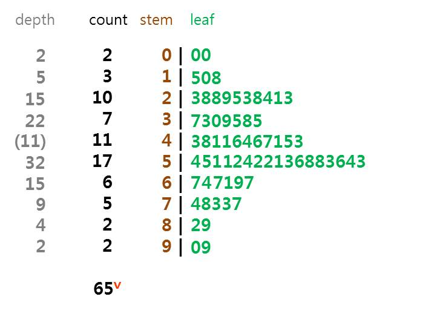
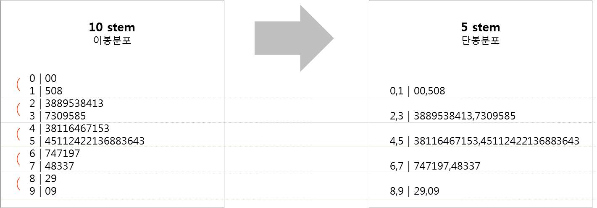
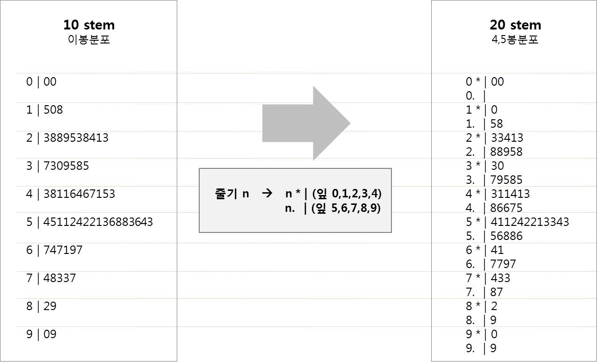

  
####1. 줄기와 잎 그림(stem-and-leaf plot)  

- 일변량 자료에 대한 탐색적 기술(exploratory descriptive) 기법의 일종
소규모 자료의 분포적 특성을 살펴보기 위한 목적
- 줄기 그림(stem plot)  

####2. 줄기그림 그리는 법  

##### (1) 자료의 각 수치값을 십단위(줄기)와 일단위(잎)으로 분리
##### (2) 빈 종이의 왼쪽에 열을 맞추어 줄기 값(십단위)의 최소값~최대값을 쓰고 숫자 옆에 수직선을 그음
##### (3) 수직선 오른쪽에 잎의 값(일단위)을 하나씩 순서대로 써 넣음 (크기 순 X)
##### (4) 이 과정을 모든 자료값에 대하여 반복함. 새로운 줄기값이 나오면 추가
##### (5) 줄기 그림이 완성되면 줄기 열 왼쪽에 각 줄기의 도수(count = 잎의 수) 기록
   - 도수의 합계가 총 자료수(65)와 일치하면 체크표시(v)
   - 깊이(depth) 표시를 추가하기도 함
   - 깊이 : 줄기 그림의 앞과 뒤 양쪽에서 시작하여 자료의 중간점(32.5)을 넘지 않는 누적도수. 자료의 중간점을 포함하는 줄기에는 깊이대신 도수를 괄호 안에 기입.  
  

####3. R에서 줄기잎 그림 그리기  
```
수리통계학 수강생 65명의 점수 XX 분포
```

```{r}
exam1 <- read.table("exam1.txt", header=T)
str(exam1)
attach(exam1)
stem(score)
```
- 이봉분포(bimodal distribution) : 2개의 군집(cluster)으로 구성  
- 수작업과의 차이 :
1) count와 depth 가 없음
2) 각 줄기 내에서 잎들이 크기 순으로 정렬됨  

####4.줄기 수 줄이고 늘이기 

#####(1) 줄기 수 줄이기(수작업)
- 줄기와 잎을 각각 2개씩 묶고 중간에 쉼표(,)를 넣어 데이터 구분
- 줄기 수를 줄임으로써 단봉분포로 변화 : 지나치게 단순화하여 데이터의 주요 특성을 잃음    

  
    
#####(2) 줄기 수 늘이기(수작업)  
- 한 줄기를 두 개로 나누고, 각 잎은 최대수치의 절반값을 기준으로 2구간화하여 배정
- 일반적으로 줄기 수를 늘일수록 봉우리 수가 증가함  

  
   
#####(3) R에서 줄기 수 줄이고 늘이기 
- stem() 함수 내 scale 속성으로 조정  
```{r}
stem(score, scale=0.5)
```
- 수작업과의 차이 :
1) 합친 줄기를 표시하는 데 앞 숫자만 사용 
2) 두 개 줄기의 잎들을 각각 크기 순으로 정렬한 후  붙이고 중간의 쉼표 구분자 제거
```{r}
stem(score, scale=2)
```
- 수작업과의 차이 :
1) *, . 의 구분표시 없이 하나의 숫자를 두번 표기
2) 각 잎들이 크기 순으로 정렬

**어떤 스케일로 그리는 것이 가장 좋은가?**
```
- 수강생들에게 본인의 성적과 함께 전체 학생의 시험결과를 통계적으로 보여주는 경우는 scale = 0.5(단봉분포), 교수가 학생의 등급을(A,B,C,D,E) 나누기 위해서는 scale = 2 가 효율적임 
- 즉, 데이터 분포의 특성과 사용 목적에 따라 여러 스케일을 시험해 보고(Trial & Error) 결정
```
    
####5.줄기잎 그림  vs.  히스토그램
 
#####(1) 공통점 : 각 구간의 관측빈도(frequency)에 비례하는 길이의 기둥을 가짐  
#####(2) 차이점
- 줄기그림은 구간 내의 개별 데이터가 각각 숫자로 표현되는 데 반해 히스토그램은 단일 길이의 상자가 쌓인 형태로 통계량의 손실이 있음
- 따라서 줄기그림에서는 비교적 정확한 중간값(or 평균) 계산 가능 But 히스토그램은 불가능
- 줄기그림은 줄기 수의 증감이 용이하나, 히스토그램은 구간 폭을 조정하려면 raw data가 필요하므로 계획적인 trial & error 반복이 필요한 탐색적 자료분석에는 비효율적
- 반대로 구간폭의 경우 히스토그램은 임의 조정이 가능하나 줄기그림은 제한적(1/2/5 x 10^d (d 는 정수)) 

**- 100~200개 이내의 데이터를 수작업으로 처리하는 경우 줄기그림 win**  

**- 데이터수가 늘어나게 되면 히스토그램 win **

```{r}
hist(score, nclass=10, right=F)
hist(score, nclass=20, right=F)
```

####6.Examples 01 : acid rain
 
```
미국 어느 도시 강우의 산성도(pH) 측정자료(1973.12~1974.05)
```
**어떤 스케일로 그리는 것이 좋을지 마구 그려보자!**
```{r}
acid.rain <- scan("acid rain.txt")
str(acid.rain)
stem(acid.rain, scale=0.5)
stem(acid.rain)
stem(acid.rain, scale=2)
```
###7.Examples 02 : chosun kings
 
```
조선 왕 27명의 수명 
```
**영조가 짱**
```{r}
kings <- read.table("chosun kings.txt", header=T)
str(kings)
attach(kings)
stem(Life)
stem(Life, scale=0.5)
stem(Life, scale=2)
```
    
####7.요약  
```
(1) 줄기잎 그림은 자료분포의 특성을 시각화하는 도구로, 유사한 특성을 가지는 히스토그램에 비해 정보 보전 면에서 우수하며 구간의 수 증감은 용이한 반면 구간 폭 조정은 제한적임
(2) 분석 목적에 최적화된 줄기그림을 그리기 위해서는 여러 조건의 그림을 그려보고 비교할 필요가 있어 계획된 시행착오가 요구됨
(3) 줄기잎 그림에서는 다음과 같은 데이터의 속성이 나타남
      - 군집(cluster)의 수
      - 집중도가 높은 구간
      - 대칭성 여부
      - 자료의 범위 및 산포
      - 특이점(outliers)의 존재여부

```