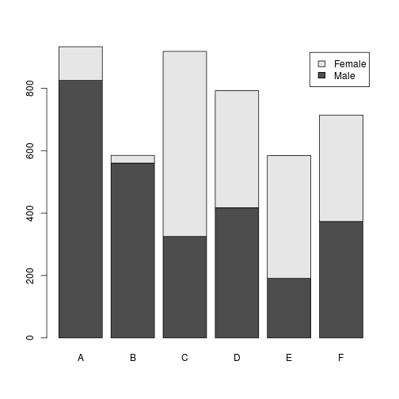
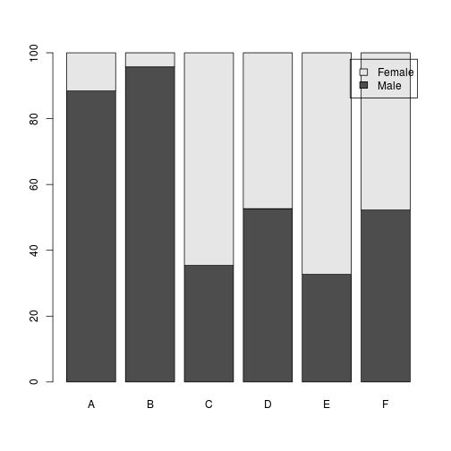
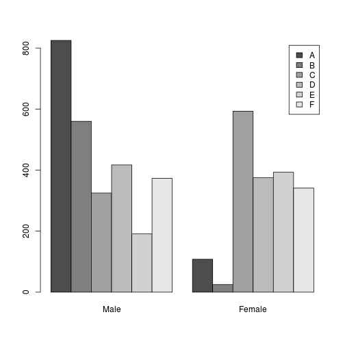
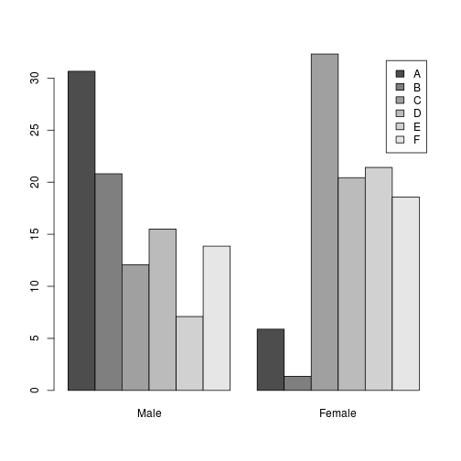
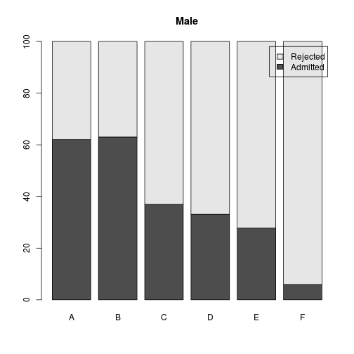
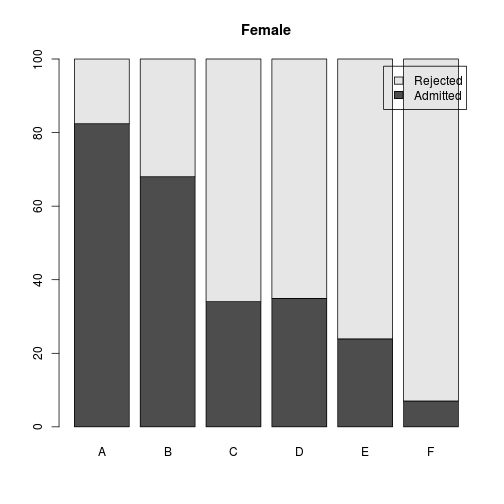
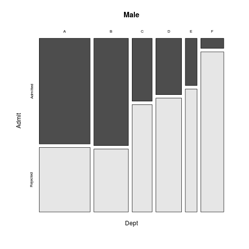
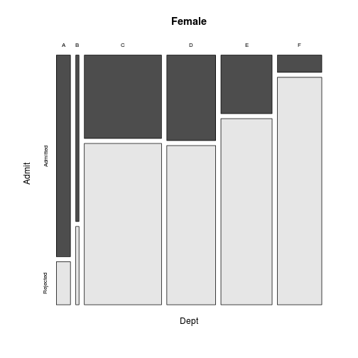

## 발표일자 : 2014.11.21 
## 발표자 : 최창순


### 1. 2원자료 탐색 (부제: 다시 대학교를 다녀야할까?)

```r
## Load file
#setwd("C:/EDA_Heo/")
temp <- read.table("WorldTemperature_Mean.txt", header = T)
head(temp)
```

```
##           Jan  Feb March April  May June July  Aug  Sep  Oct  Nov  Dec
## BAHRAIN  16.0 16.5  20.0  24.0 28.5 31.0 32.5 33.0 31.0 27.5 23.0 18.0
## CALCUTTA 20.0 22.5  27.5  30.0 31.0 29.5 29.0 29.0 29.0 28.0 23.5 19.5
## COLOMBO  26.0 26.0  27.0  27.5 28.0 27.5 27.0 27.0 27.5 26.5 31.0 26.0
## CHENNAI  25.0 25.5  27.5  30.5 33.5 32.5 31.0 30.5 29.5 28.0 26.0 25.0
## DUBAI    18.0 19.0  22.5  25.0 28.0 30.5 33.5 33.5 31.0 27.5 23.5 20.0
## FRAKFURT -0.5  1.0   6.5  12.0 15.0 18.5 20.0 19.5 16.0 11.0  5.5  1.0
```

```r
str(temp)
```

```
## 'data.frame':	21 obs. of  12 variables:
##  $ Jan  : num  16 20 26 25 18 -0.5 1 4 5 24 ...
##  $ Feb  : num  16.5 22.5 26 25.5 19 1 0 4.5 6.5 24.5 ...
##  $ March: num  20 27.5 27 27.5 22.5 6.5 6 6.5 9.5 26.5 ...
##  $ April: num  24 30 27.5 30.5 25 12 10 9 12.5 27.5 ...
##  $ May  : num  28.5 31 28 33.5 28 15 13.5 12.5 16.5 28 ...
##  $ June : num  31 29.5 27.5 32.5 30.5 18.5 16 15.5 21 28 ...
##  $ July : num  32.5 29 27 31 33.5 20 20 17.5 25 26 ...
##  $ Aug  : num  33 29 27 30.5 33.5 19.5 19.5 17 24.5 26 ...
##  $ Sep  : num  31 29 27.5 29.5 31 16 15 15 20.5 26.5 ...
##  $ Oct  : num  27.5 28 26.5 28 27.5 11 9.5 11 14 26.5 ...
##  $ Nov  : num  23 23.5 31 26 23.5 5.5 5.5 7.5 9 25 ...
##  $ Dec  : num  18 19.5 26 25 20 1 2 5 5 24.5 ...
```

```r
## Median polish
twoway_temp <- medpolish(temp)
```

```
## 1: 703.8
## 2: 686.4
## Final: 685.8
```

```r
twoway_temp
```

```
## 
## Median Polish Results (Dataset: "temp")
## 
## Overall: 16.12
## 
## Row Effects:
##       BAHRAIN      CALCUTTA       COLOMBO       CHENNAI         DUBAI 
##        9.5000       11.2500       10.8750       14.0625       10.2500 
##      FRAKFURT        GENEVA        LONDON        MADRID        MANILA 
##       -5.1875       -6.0625       -5.7500       -2.5000       10.8750 
##        MOSCOW   MEXICO_CITY     NEW_DELHI      NEW_YORK         PARIS 
##      -11.8750        5.1875        8.0625       -2.8125       -4.9375 
##          ROME SAN_FRANCISCO     SINGAPORE        SYDNEY         TOKYO 
##        0.0000       -1.5000       11.1250        2.3750       -0.3125 
##       TORONTO 
##       -8.5000 
## 
## Column Effects:
##    Jan    Feb  March  April    May   June   July    Aug    Sep    Oct 
## -8.375 -7.125 -3.875 -0.250  2.312  5.375  7.125  7.125  4.812  0.375 
##    Nov    Dec 
## -3.625 -7.625 
## 
## Residuals:
##                 Jan    Feb March April   May   June   July    Aug   Sep
## BAHRAIN       -1.25 -2.000 -1.75 -1.38  0.56   0.00  -0.25   0.25  0.56
## CALCUTTA       1.00  2.250  4.00  2.88  1.31  -3.25  -5.50  -5.50 -3.19
## COLOMBO        7.38  6.125  3.88  0.75 -1.31  -4.88  -7.12  -7.12 -4.31
## CHENNAI        3.19  2.438  1.19  0.56  1.00  -3.06  -6.31  -6.81 -5.50
## DUBAI          0.00 -0.250  0.00 -1.12 -0.69  -1.25   0.00   0.00 -0.19
## FRAKFURT      -3.06 -2.812 -0.56  1.31  1.75   2.19   1.94   1.44  0.25
## GENEVA        -0.69 -2.938 -0.19  0.19  1.12   0.56   2.81   2.31  0.12
## LONDON         2.00  1.250  0.00 -1.12 -0.19  -0.25   0.00  -0.50 -0.19
## MADRID        -0.25  0.000 -0.25 -0.88  0.56   2.00   4.25   3.75  2.06
## MANILA         5.38  4.625  3.38  0.75 -1.31  -4.38  -8.12  -8.12 -5.31
## MOSCOW        -5.38 -5.625 -4.38  0.00  5.94   7.38   7.12   5.12  1.94
## MEXICO_CITY    1.06  4.812  3.56  1.44 -1.12  -4.19  -5.94  -6.44 -4.12
## NEW_DELHI     -2.31 -0.062  1.19  4.06  6.50   3.94  -0.31  -1.31  0.00
## NEW_YORK      -3.94 -5.688 -4.44 -2.56  1.38   3.31   4.56   3.56  1.88
## PARIS          1.19 -0.062 -0.31 -0.44  0.00   0.44   0.69   0.19  0.00
## ROME          -0.25  0.000 -0.75 -1.38 -0.44   1.00   2.25   2.25  1.06
## SAN_FRANCISCO  3.25  2.500  1.25 -1.38 -2.44  -4.00  -4.75  -4.75 -1.94
## SINGAPORE      7.62  6.375  4.12  0.50 -2.56  -5.12  -6.88  -6.88 -5.06
## SYDNEY        14.88 13.625  7.38  1.25 -4.81 -12.88 -13.62 -12.62 -7.81
## TOKYO         -2.94 -3.688 -3.94 -2.06  0.38   0.31   2.56   4.06  2.88
## TORONTO       -3.75 -5.000 -3.75 -2.88 -4.94   5.50   6.75   6.25  4.56
##                  Oct   Nov    Dec
## BAHRAIN        1.500  1.00  0.000
## CALCUTTA       0.250 -0.25 -0.250
## COLOMBO       -0.875  7.62  6.625
## CHENNAI       -2.562 -0.56  2.438
## DUBAI          0.750  0.75  1.250
## FRAKFURT      -0.312 -1.81 -2.312
## GENEVA        -0.938 -0.94 -0.438
## LONDON         0.250  0.75  2.250
## MADRID         0.000 -1.00 -1.000
## MANILA        -0.875  1.62  5.125
## MOSCOW        -0.125 -3.12 -4.625
## MEXICO_CITY   -1.188  1.81  1.812
## NEW_DELHI      1.438 -1.06 -1.562
## NEW_YORK       1.312 -1.19 -3.688
## PARIS         -0.062 -0.56 -0.062
## ROME           0.500  0.00  0.000
## SAN_FRANCISCO  1.500  2.00  3.000
## SINGAPORE     -0.625  3.38  6.875
## SYDNEY        -1.375  6.12 14.125
## TOKYO          0.812 -0.19 -1.188
## TORONTO        2.000  4.00 -2.000
```

```r
attach(twoway_temp)
comparison <- matrix(row, ncol = 1) %*% matrix(col, nrow = 1)/overall
```


```r
plot(residuals ~ comparison, xlim = c(-15, 15), ylim = c(-15, 15))
```

 

```r
boxplot(residuals, ylab = "residuals")
```

 


```r
round(residuals[order(row), ],1)
```

```
##                Jan  Feb March April  May  June  July   Aug  Sep  Oct  Nov
## MOSCOW        -5.4 -5.6  -4.4   0.0  5.9   7.4   7.1   5.1  1.9 -0.1 -3.1
## TORONTO       -3.8 -5.0  -3.8  -2.9 -4.9   5.5   6.8   6.2  4.6  2.0  4.0
## GENEVA        -0.7 -2.9  -0.2   0.2  1.1   0.6   2.8   2.3  0.1 -0.9 -0.9
## LONDON         2.0  1.2   0.0  -1.1 -0.2  -0.2   0.0  -0.5 -0.2  0.2  0.8
## FRAKFURT      -3.1 -2.8  -0.6   1.3  1.8   2.2   1.9   1.4  0.2 -0.3 -1.8
## PARIS          1.2 -0.1  -0.3  -0.4  0.0   0.4   0.7   0.2  0.0 -0.1 -0.6
## NEW_YORK      -3.9 -5.7  -4.4  -2.6  1.4   3.3   4.6   3.6  1.9  1.3 -1.2
## MADRID        -0.2  0.0  -0.2  -0.9  0.6   2.0   4.2   3.8  2.1  0.0 -1.0
## SAN_FRANCISCO  3.2  2.5   1.2  -1.4 -2.4  -4.0  -4.8  -4.8 -1.9  1.5  2.0
## TOKYO         -2.9 -3.7  -3.9  -2.1  0.4   0.3   2.6   4.1  2.9  0.8 -0.2
## ROME          -0.2  0.0  -0.8  -1.4 -0.4   1.0   2.2   2.2  1.1  0.5  0.0
## SYDNEY        14.9 13.6   7.4   1.2 -4.8 -12.9 -13.6 -12.6 -7.8 -1.4  6.1
## MEXICO_CITY    1.1  4.8   3.6   1.4 -1.1  -4.2  -5.9  -6.4 -4.1 -1.2  1.8
## NEW_DELHI     -2.3 -0.1   1.2   4.1  6.5   3.9  -0.3  -1.3  0.0  1.4 -1.1
## BAHRAIN       -1.2 -2.0  -1.8  -1.4  0.6   0.0  -0.2   0.2  0.6  1.5  1.0
## DUBAI          0.0 -0.2   0.0  -1.1 -0.7  -1.2   0.0   0.0 -0.2  0.8  0.8
## COLOMBO        7.4  6.1   3.9   0.8 -1.3  -4.9  -7.1  -7.1 -4.3 -0.9  7.6
## MANILA         5.4  4.6   3.4   0.8 -1.3  -4.4  -8.1  -8.1 -5.3 -0.9  1.6
## SINGAPORE      7.6  6.4   4.1   0.5 -2.6  -5.1  -6.9  -6.9 -5.1 -0.6  3.4
## CALCUTTA       1.0  2.2   4.0   2.9  1.3  -3.2  -5.5  -5.5 -3.2  0.2 -0.2
## CHENNAI        3.2  2.4   1.2   0.6  1.0  -3.1  -6.3  -6.8 -5.5 -2.6 -0.6
##                Dec
## MOSCOW        -4.6
## TORONTO       -2.0
## GENEVA        -0.4
## LONDON         2.2
## FRAKFURT      -2.3
## PARIS         -0.1
## NEW_YORK      -3.7
## MADRID        -1.0
## SAN_FRANCISCO  3.0
## TOKYO         -1.2
## ROME           0.0
## SYDNEY        14.1
## MEXICO_CITY    1.8
## NEW_DELHI     -1.6
## BAHRAIN        0.0
## DUBAI          1.2
## COLOMBO        6.6
## MANILA         5.1
## SINGAPORE      6.9
## CALCUTTA      -0.2
## CHENNAI        2.4
```

###2. 3차원 자료를 이용한 2원분석(부제: 느낌만 가지고 가자)

```r
data(UCBAdmissions)
UCBAdmissions
```

```
## , , Dept = A
## 
##           Gender
## Admit      Male Female
##   Admitted  512     89
##   Rejected  313     19
## 
## , , Dept = B
## 
##           Gender
## Admit      Male Female
##   Admitted  353     17
##   Rejected  207      8
## 
## , , Dept = C
## 
##           Gender
## Admit      Male Female
##   Admitted  120    202
##   Rejected  205    391
## 
## , , Dept = D
## 
##           Gender
## Admit      Male Female
##   Admitted  138    131
##   Rejected  279    244
## 
## , , Dept = E
## 
##           Gender
## Admit      Male Female
##   Admitted   53     94
##   Rejected  138    299
## 
## , , Dept = F
## 
##           Gender
## Admit      Male Female
##   Admitted   22     24
##   Rejected  351    317
```

```r
str(UCBAdmissions)
```

```
##  table [1:2, 1:2, 1:6] 512 313 89 19 353 207 17 8 120 205 ...
##  - attr(*, "dimnames")=List of 3
##   ..$ Admit : chr [1:2] "Admitted" "Rejected"
##   ..$ Gender: chr [1:2] "Male" "Female"
##   ..$ Dept  : chr [1:6] "A" "B" "C" "D" ...
```

```r
Tab1 <- UCBAdmissions[1,,]
Tab2 <- UCBAdmissions[2,,]
Tab1 ### 입학 허가 된 사람들
```

```
##         Dept
## Gender     A   B   C   D  E  F
##   Male   512 353 120 138 53 22
##   Female  89  17 202 131 94 24
```

```r
Tab2 ### 입학 거절 된 사람들
```

```
##         Dept
## Gender     A   B   C   D   E   F
##   Male   313 207 205 279 138 351
##   Female  19   8 391 244 299 317
```

```r
Tab <- Tab1 + Tab2
Tab
```

```
##         Dept
## Gender     A   B   C   D   E   F
##   Male   825 560 325 417 191 373
##   Female 108  25 593 375 393 341
```

```r
addmargins(Tab) ### 각 행과 열의 합을 구해줌
```

```
##         Dept
## Gender     A   B   C   D   E   F  Sum
##   Male   825 560 325 417 191 373 2691
##   Female 108  25 593 375 393 341 1835
##   Sum    933 585 918 792 584 714 4526
```


```r
barplot(Tab, legend = rownames(Tab))
```

 


```r
Tab_col <- apply(Tab, 2, sum)
Tab_C <- Tab %*% diag(1/Tab_col) * 100
colnames(Tab_C) <- c("A", "B", "C", "D", "E", "F")
rownames(Tab_C) <- c("Male", "Female")

Tab_row <- apply(Tab, 1, sum)
Tab_R <- diag(1/Tab_row) %*% Tab * 100
colnames(Tab_R) <- c("A", "B", "C", "D", "E", "F")
rownames(Tab_R) <- c("Male", "Female")
```


```r
barplot(Tab_C, legend = rownames(Tab_C))
```

 

```r
barplot(t(Tab), beside= T, legend=colnames(Tab))
```

 

```r
barplot(t(Tab_R), beside = T, legend = colnames(Tab_R))
```

 


```r
Tab_M <- UCBAdmissions[,1,]
Tab_F <- UCBAdmissions[,2,]
addmargins(Tab_M)
```

```
##           Dept
## Admit        A   B   C   D   E   F  Sum
##   Admitted 512 353 120 138  53  22 1198
##   Rejected 313 207 205 279 138 351 1493
##   Sum      825 560 325 417 191 373 2691
```

```r
addmargins(Tab_F)
```

```
##           Dept
## Admit        A  B   C   D   E   F  Sum
##   Admitted  89 17 202 131  94  24  557
##   Rejected  19  8 391 244 299 317 1278
##   Sum      108 25 593 375 393 341 1835
```

```r
Tab_M_col <- apply(Tab_M, 2, sum)
Tab_M_C <- Tab_M %*% diag(1/Tab_M_col) * 100
colnames(Tab_M_C) <- c("A", "B", "C", "D", "E", "F")
Tab_F_col <- apply(Tab_F, 2, sum)
Tab_F_C <- Tab_F %*% diag(1/Tab_F_col) * 100
colnames(Tab_F_C) <- c("A", "B", "C", "D", "E", "F")
```


```r
barplot(Tab_M_C, legend = rownames(Tab_M_C), main = "Male")
```

 

```r
barplot(Tab_F_C, legend = rownames(Tab_F_C), main = "Female")
```

 


```r
mosaicplot(~Dept + Gender, data = UCBAdmissions, color = T)
```

 

```r
Tab_M <- as.table(Tab_M)
Tab_F <- as.table(Tab_F)

mosaicplot(~Dept + Admit, data = Tab_M, color = T, main = "Male")
```

 

```r
mosaicplot(~Dept + Admit, data = Tab_F, color = T, main = "Female")
```

 


Note that the `echo = FALSE` parameter was added to the code chunk to prevent printing of the R code that generated the plot.
