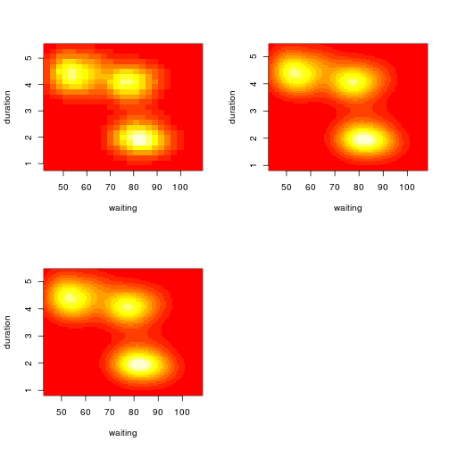
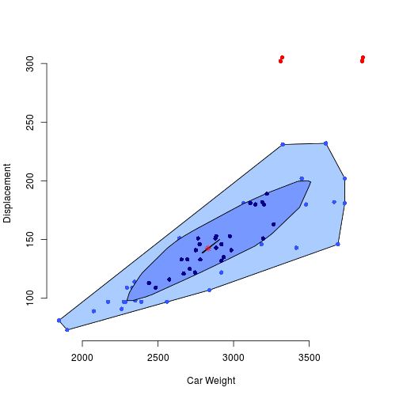
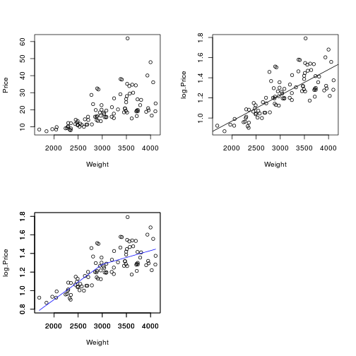
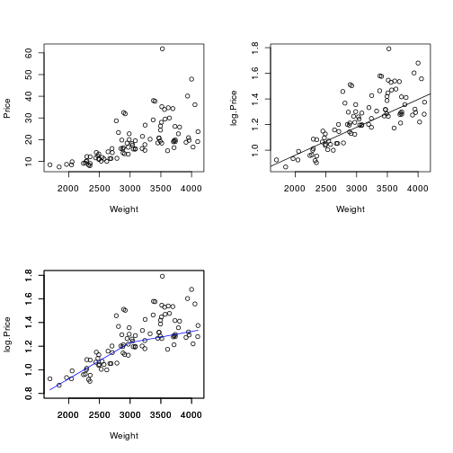

## 10.1 산점도와 흐트림 (scatter plot & jittering)

- 산점도 ; 이변량 자료 탐색에서 기본이자 필수.
- 상관계수 ; 단지 참고 사항.


```r
par(mfrow=c(2,2))

# (a)
x<- 5 + rnorm(50,0,1.5)
y <- 0.9*(x-5) + sqrt(0.19)*rnorm(50,0,1.5) + 5
cor(x,y)   # http://www.statmethods.net/stats/correlations.html
```

```
## [1] 0.9239
```

```r
plot(y~x, xlim = c(0,10), ylim = c(0,10))

# (b)
x <- c(rnorm(30,3,1), rnorm(20,8,1))
y <- c(rnorm(30,3,1), rnorm(20,8,1))
cor(x,y)
```

```
## [1] 0.829
```

```r
plot(y~x, xlim = c(0,10), ylim = (c(0,10)))

# (c)
x <- sort(5 + rnorm(50,0,1.75))
y <-  x
x[50] <-  8; y[50] <- 2
cor(x,y)
```

```
## [1] 0.8908
```

```r
plot(y~x, xlim = c(0,10), ylim = (c(0,10)))

# (d)
x1 <- sort(5 + rnorm(25,0,1.5))
y1 <- x1 - 0.75
x2 <- sort(5 + rnorm(25,0,1.5))
y2 <- x2 + 0.75
x <- c(x1,x2) ;  y <- c(y1, y2)
cor(x,y)
```

```
## [1] 0.8818
```

```r
plot(y~x, xlim = c(0,10), ylim = (c(0,10)))
```

 

- 위 그림들은 상관계수는 비슷하나, 자료특성은 엄청 다르다.


## 흐트림(jittering)

- 변수의 속성이 근본적으로연속적이지만, 정수 또는 단순한 유효숫자로 기록되는 경우 많다.
- 이 경우 두 변수간 산점도가 격자 형상으로 나타나 이상해 보일수 있다.
- jitter(변수, amount = k)
  - 지정된 변수에 구간 (-k, k) 에서의 균일 난수를 붙인다.


```r
par(mfrow=c(2,2))

x <- rnorm(50) + 5
y <- rnorm(50)*0.6 + (x-5)*0.8 + 5
plot(y~x, xlim = c(1,9), ylim = (c(1,9)))


x1 <- round(x)
y1 <- round(y)
plot(y1~x1, xlim = c(1,9), ylim = (c(1,9)))


x2 <- x1 + runif(50, -0.5, 0.5)
y2 <- y1 + runif(50, -0.5, 0.5)
plot(y2~x2, xlim = c(1,9), ylim = (c(1,9)))

x3 <- jitter(x1, amount = 0.5)
y3 <- jitter(y1, amount = 0.5)
plot(y3~x3, xlim = c(1,9), ylim = (c(1,9)))
```

 


```r
library(lattice)
data(quakes)
str(quakes); attach(quakes)
```

```
## 'data.frame':	1000 obs. of  5 variables:
##  $ lat     : num  -20.4 -20.6 -26 -18 -20.4 ...
##  $ long    : num  182 181 184 182 182 ...
##  $ depth   : int  562 650 42 626 649 195 82 194 211 622 ...
##  $ mag     : num  4.8 4.2 5.4 4.1 4 4 4.8 4.4 4.7 4.3 ...
##  $ stations: int  41 15 43 19 11 12 43 15 35 19 ...
```

```r
par(mfrow =c(1,2))
plot(mag ~ depth)
plot(jitter(mag, factor=2) ~ depth)
```

 

```r
depth.grp <- trunc(depth/100)
boxplot(quakes$mag ~ depth.grp, ylab="magnitude", xlab="depth intervals")
```

 


## 부호 그래프 (symbols graph)

- 제 3의 변수 z를 표현할 수 있다.


```r
attach(trees)
par(mfrow = c(1,2))
plot(Girth, Height, main="Trees' Girth vs Height")

symbols(Girth, Height, circles = Volume, inches=0.2, main = "Trees' Volume")
```

 

```r
Rel.Height <- (Height-min(Height))/(max(Height)-min(Height)) 
# x11();
symbols(Girth, Volume, thermometers= cbind(0.5, 1, Rel.Height), inches = 0.2, main = "Trees' Volume")
```

 


## 10.2 밀도추정과 보자기그림 (density estimation & bag plot)

- 총 면적이 1 이 되도록 척도화된 히스토그램 
  => 일변량 확률변수의 밀도
  

```r
library(MASS)
data(geyser)
attach(geyser)
hist(duration, freq=F)
```

 

- 커널밀도추정(kernel density estimation) 으로 매끄럽게 표현하자!


```r
plot(density(duration))
```

 

```r
hist(duration, freq=F, xlim=c(0,6))

lines(density(duration), lty=2)  # lty = line type, 2 = dasshed
```

 

## 이변량 커널 밀도 함수 추정

### 1) 등고선 그림 (contour plot)

- kde2d(x,y,n)
    + x,y - 변수명
    + n - 각 축의 그리드 점의 수
    

```r
par(mfrow = c(2,2))
density1 <- kde2d(waiting, duration, n=25)
# x11()
image(density1, xlab = "waiting", ylab="duration")


density2 <- kde2d(waiting, duration, n=100)
# x11()
image(density2, xlab = "waiting", ylab="duration")


density3 <- kde2d(waiting, duration, n=400)
# x11()
image(density2, xlab = "waiting", ylab="duration")
```

 


### 2) 보자기 플롯 (bag plot)
- 이변량 밀도함수와 비슷한 기능.
- 이변량 자료에 적용되는 확장된 box plot. 
    + 중간점.
    + 보자기 경계(bag hull) ; 자료의 50%를 담는다.
    + 울타리 (fence) ; 보자기의 3배 확장
    + 외곽 경계 (loop hull) ; 울타리 내부에 있는 자료점을 포함하는 가장 작은 다각형.
    + 외부점 (outlier) ; 울타리밖 자료점


```r
# install.packages("aplpack")
library(aplpack)
```

```
## Loading required package: tcltk
```

```
## Warning: couldn't connect to display ":0"
```

```r
library(rpart)
data(car.test.frame)
str(car.test.frame)
```

```
## 'data.frame':	60 obs. of  8 variables:
##  $ Price      : int  8895 7402 6319 6635 6599 8672 7399 7254 9599 5866 ...
##  $ Country    : Factor w/ 8 levels "France","Germany",..: 8 8 5 4 3 6 4 5 3 3 ...
##  $ Reliability: int  4 2 4 5 5 4 5 1 5 NA ...
##  $ Mileage    : int  33 33 37 32 32 26 33 28 25 34 ...
##  $ Type       : Factor w/ 6 levels "Compact","Large",..: 4 4 4 4 4 4 4 4 4 4 ...
##  $ Weight     : int  2560 2345 1845 2260 2440 2285 2275 2350 2295 1900 ...
##  $ Disp.      : int  97 114 81 91 113 97 97 98 109 73 ...
##  $ HP         : int  113 90 63 92 103 82 90 74 90 73 ...
```

```r
attach(car.test.frame)

bagplot(x=Weight, y=Disp., show.whiskers=F, cex=1, xlab="Car Weight", ylab="Displacement")  # 차무게, 배기량 
```

 


## 10.3 조각별 선형회귀 (piecewise linear regression)

- 구간별로 선형이되 연속인 회귀함수.
- 2개의 변수가 단순한 선형적 관계에 있지 않은 경우 사용.
- 하지만, 경계점을 분석자가 일일이 설정해야함.

### 1) 최소제곱법


```r
# 최소제곱법
par(mfrow=c(2,2))
library(MASS)
data(Cars93)
attach(Cars93)
```

```
## The following objects are masked from car.test.frame:
## 
##     Price, Type, Weight
```

```r
# x11()
plot(Price ~ Weight)


log.Price <- log(Price, 10)
lm1 <- lm(log.Price ~ Weight)
# x11()
plot(log.Price ~ Weight)
abline(lm1$coef)

Weight3000 <- ((Weight-3000) + abs(Weight - 3000))/2
lm2 <- lm(log(Price, 10) ~ Weight + Weight3000)
plot(log.Price ~ Weight, ylim = c(0.8, 1.8))

par(new=T)
plot(lm2$fit[order(Weight)]~sort(Weight), ylim=c(0.8, 1.8), type="l", col="blue", xlab="", ylab="")
```

 


### 2) 최소중간제곱법 (LMS)


```r
# 최소제곱법
par(mfrow=c(2,2))
library(MASS)
data(Cars93)
attach(Cars93)
```

```
## The following objects are masked from Cars93 (position 3):
## 
##     AirBags, Cylinders, DriveTrain, EngineSize,
##     Fuel.tank.capacity, Horsepower, Length, Luggage.room,
##     MPG.city, MPG.highway, Make, Man.trans.avail, Manufacturer,
##     Max.Price, Min.Price, Model, Origin, Passengers, Price, RPM,
##     Rear.seat.room, Rev.per.mile, Turn.circle, Type, Weight,
##     Wheelbase, Width
## The following objects are masked from car.test.frame:
## 
##     Price, Type, Weight
```

```r
# x11()
plot(Price ~ Weight)


log.Price <- log(Price, 10)
lm1 <- lqs(log.Price ~ Weight, method="lms")
# x11()
plot(log.Price ~ Weight)
abline(lm1$coef)

Weight3000 <- ((Weight-3000) + abs(Weight - 3000))/2
lm2 <- lqs(log(Price, 10) ~ Weight + Weight3000, method="lms")
plot(log.Price ~ Weight, ylim = c(0.8, 1.8))

par(new=T)
plot(lm2$fit[order(Weight)]~sort(Weight), ylim=c(0.8, 1.8), type="l", col="blue", xlab="", ylab="")
```

 

## 10.4 산점도 평활기 LOWESS

- 분석자가 특정한 회귀모형을 설정하지 않더라도 컴퓨터가 적절한 회귀함수를 찾아준다.

- 윈도우 

- 가중치 ; 윈도우 중앙에 가장큰 가중치, 가장 바깥은 가장 작은 가중치 부여.

- lowess(y ~ x, f)
    + f : 자료크기 대비 평활기 너비(smoother span)의 비율
    + 디폴트 f 값 = 2/3
    + f 크면, 직선에 가깝다.(과소적합, under-fitting)
    + f 작으면, 휜 정도가 큰 곡선. (과다적합, over-fitting)


```r
library(MASS)
data(Cars93)
attach(Cars93)
```

```
## The following objects are masked from Cars93 (position 3):
## 
##     AirBags, Cylinders, DriveTrain, EngineSize,
##     Fuel.tank.capacity, Horsepower, Length, Luggage.room,
##     MPG.city, MPG.highway, Make, Man.trans.avail, Manufacturer,
##     Max.Price, Min.Price, Model, Origin, Passengers, Price, RPM,
##     Rear.seat.room, Rev.per.mile, Turn.circle, Type, Weight,
##     Wheelbase, Width
## The following objects are masked from Cars93 (position 4):
## 
##     AirBags, Cylinders, DriveTrain, EngineSize,
##     Fuel.tank.capacity, Horsepower, Length, Luggage.room,
##     MPG.city, MPG.highway, Make, Man.trans.avail, Manufacturer,
##     Max.Price, Min.Price, Model, Origin, Passengers, Price, RPM,
##     Rear.seat.room, Rev.per.mile, Turn.circle, Type, Weight,
##     Wheelbase, Width
## The following objects are masked from car.test.frame:
## 
##     Price, Type, Weight
```

```r
plot(Price ~ Weight)
```

 

```r
log.Price <- log(Price, 10)
s1 <- lowess(log.Price ~ Weight)
par(mfrow = c(1,2))
plot(log.Price ~ Weight, ylim = c(0.8, 1.8))
lines(s1)

s2 <- lowess(log.Price ~ Weight, f=1/3)  # f 를 작게함.
plot(log.Price ~ Weight, ylim = c(0.8, 1.8))
lines(s2)
```

 
