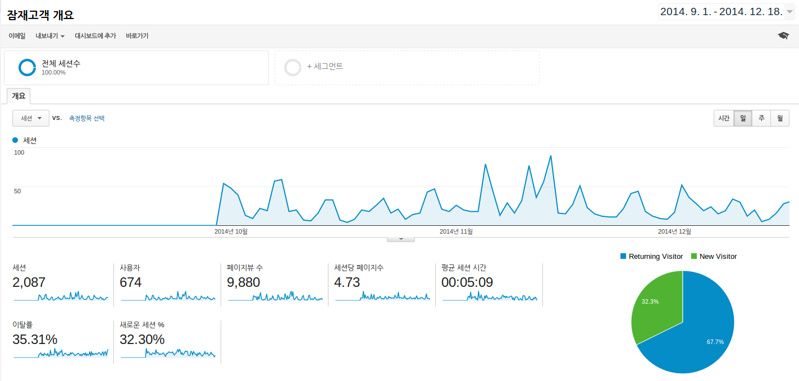
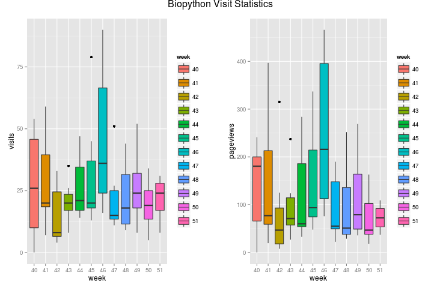

# 바이오스핀의 GA 로그에 대한 시계열 시각화 실습
김무성  
2014년 12월 19일  

참조 - http://datum.io/r에서-google-analytics-데이터-사용하기/

# 데이터 소개



# RGA 설치


```r
#install.packages("devtools")
#library(devtools)
#install_github("rga", "skardhamar") 
#library(rga)
#rga.open(instance = "ga")
```

# 권한획득

 * 웹페이지가 뜨고(gmail에 로그인되어 있을 것), 권한획득을 허용하면
 * 엑세스 문자열을 하나 얻는다
 * 그러면 그 문자열을 복사해서, 콘솔창에 (RGA가 입력을 기다리고 있음) 입력한다.
 
 

# 데이터 가져오기


```r
#ga$getProfiles()

#id <- '콘솔창에 나온 아이디'
#start.date <- "2014-09-29"
#end.date <- "2014-12-19"

#gatest<-ga$getData(id,batch = TRUE, walk = TRUE, start.date, end.date, dimensions = "ga:date, ga:week", metrics = "ga:visits,ga:pageviews")

# 계속 쓸 수 있도록 저장해놓자.
#write.csv(gatest, './gatest.csv')

# 그리고 다시 로딩
gatest <- read.csv('./gatest.csv')
                   
# 데이터 확인                   
attributes(gatest) 
```

```
## $names
## [1] "X"         "date"      "week"      "visits"    "pageviews"
## 
## $class
## [1] "data.frame"
## 
## $row.names
##  [1]  1  2  3  4  5  6  7  8  9 10 11 12 13 14 15 16 17 18 19 20 21 22 23
## [24] 24 25 26 27 28 29 30 31 32 33 34 35 36 37 38 39 40 41 42 43 44 45 46
## [47] 47 48 49 50 51 52 53 54 55 56 57 58 59 60 61 62 63 64 65 66 67 68 69
## [70] 70 71 72 73 74 75 76 77 78 79 80 81 82
```

```r
head(gatest)
```

```
##   X       date week visits pageviews
## 1 1 2014-09-29   40      0         0
## 2 2 2014-09-30   40     54       241
## 3 3 2014-10-01   40     48       202
## 4 4 2014-10-02   40     39       167
## 5 5 2014-10-03   40     13       194
## 6 6 2014-10-04   40      9        32
```

# 통계치 살펴보기

```r
# 기초 통계량
summary(gatest[,c(-1, -2)]) 
```

```
##       week          visits       pageviews    
##  Min.   :40.0   Min.   : 0.0   Min.   :  0.0  
##  1st Qu.:43.0   1st Qu.:15.0   1st Qu.: 48.0  
##  Median :45.5   Median :20.0   Median : 78.0  
##  Mean   :45.5   Mean   :25.7   Mean   :121.1  
##  3rd Qu.:48.0   3rd Qu.:33.0   3rd Qu.:189.0  
##  Max.   :51.0   Max.   :90.0   Max.   :466.0
```

```r
# 히스토그램(분포)
apply(gatest[,c(-1, -2)], 2, hist) 
```

   

```
## $week
## $breaks
##  [1] 40 41 42 43 44 45 46 47 48 49 50 51
## 
## $counts
##  [1] 13  7  7  7  7  7  7  7  7  7  6
## 
## $density
##  [1] 0.15853659 0.08536585 0.08536585 0.08536585 0.08536585 0.08536585
##  [7] 0.08536585 0.08536585 0.08536585 0.08536585 0.07317073
## 
## $mids
##  [1] 40.5 41.5 42.5 43.5 44.5 45.5 46.5 47.5 48.5 49.5 50.5
## 
## $xname
## [1] "newX[, i]"
## 
## $equidist
## [1] TRUE
## 
## attr(,"class")
## [1] "histogram"
## 
## $visits
## $breaks
##  [1]  0 10 20 30 40 50 60 70 80 90
## 
## $counts
## [1] 12 32 14  9  6  6  0  2  1
## 
## $density
## [1] 0.014634146 0.039024390 0.017073171 0.010975610 0.007317073 0.007317073
## [7] 0.000000000 0.002439024 0.001219512
## 
## $mids
## [1]  5 15 25 35 45 55 65 75 85
## 
## $xname
## [1] "newX[, i]"
## 
## $equidist
## [1] TRUE
## 
## attr(,"class")
## [1] "histogram"
## 
## $pageviews
## $breaks
##  [1]   0  50 100 150 200 250 300 350 400 450 500
## 
## $counts
##  [1] 22 26  8  8  9  3  2  2  1  1
## 
## $density
##  [1] 0.0053658537 0.0063414634 0.0019512195 0.0019512195 0.0021951220
##  [6] 0.0007317073 0.0004878049 0.0004878049 0.0002439024 0.0002439024
## 
## $mids
##  [1]  25  75 125 175 225 275 325 375 425 475
## 
## $xname
## [1] "newX[, i]"
## 
## $equidist
## [1] TRUE
## 
## attr(,"class")
## [1] "histogram"
```

# 주별 분포 boxplot 보기

```r
#install.packages("ggplot2")
#install.packages("grid")
#install.packages("gridExtra")
library(ggplot2) 
library(grid) 
library(gridExtra)

p1 <- ggplot(gatest, aes(x=week, y=visits, fill=week)) + geom_boxplot() 
p2 <- ggplot(gatest, aes(x=week, y=pageviews, fill=week)) + geom_boxplot() 
#grid.arrange(p1, p2, ncol = 2, main = "Biopython Visit Statistics")
```


