## 3.1 Introduction

- 3.2 그래프 시각화의 요소들을 간단히 정의
- 3.3 그래프를 배치하는 여러가지 방법
- 3.4 배치를 좀 더 꾸미는 방법들
- 3.5 대형 네트워크 그래프 시각화
- 3.6 좀 더 세련된 시각화를 위한 선택


## 3.2 Elements of Graph Visualization
- G = (V, E)로 되어있는 측정값을 시각화 한다면?
- v는 점, 원, 사각형 등으로 e는 부드러운 곡선으로 표현

- 그래프 G를 표현하는데는 셀 수 없이 많은 방법이 존재
- 보통 그래프가 크기 때문에, 자동적인 방법을 사용

- 이론적으로는 정점을 랜덤하게 그리고 그 사이를 이어주면 되지만 ...
- 효율적인 계산을 위한 다양한 알고리즘이 존재
- igraph에선, plot 명령이 이러한 다양한 알고리즘을 호출


## 3.3 Graph Layouts
- 그래프 배치 : 공간에 정점과 간선들을 놓는것
- 두 종류의 데이터를 사용

### 데이터 설명

#### (1) lattice

```r
library(sand)
```

```
## Loading required package: igraph
## Loading required package: igraphdata
## 
## Statistical Analysis of Network Data with R
## Type in C2 (+ENTER) to start with Chapter 2.
```

```r
g.l <- graph.lattice(c(5, 5, 5))
summary(g.l)
```

```
## IGRAPH U--- 125 300 -- Lattice graph
## attr: name (g/c), dimvector (g/n), nei (g/n), mutual (g/l),
##   circular (g/l)
```

```r
# 데이터 확인
# D와 U의 차이는 Directed와 Undirected?
# W는 Weighted?
```


#### (2) aidsblog
- AIDS관련 블로그의 인용패턴

```r
data(aidsblog)
summary(aidsblog)
```

```
## IGRAPH D--- 146 187 --
```

```r
# 데이터 확인
```

- 두 그래프가 정점의 수가 각각 125, 146으로 비슷
- lattice의 경우 정의에 의해 매우 균일, blog는 그렇지 않음

### layout 종류

#### (1) circular layout
- vertex들이 원 둘레에 배치됨
- edge는 원을 가로질러 그려짐


```r
igraph.options(vertex.size=3, vertex.label=NA,
edge.arrow.size=0.5)
par(mfrow=c(1, 2))
plot(g.l, layout=layout.circle)
title("5x5x5 Lattice")
plot(aidsblog, layout=layout.circle)
title("Blog Network")
```

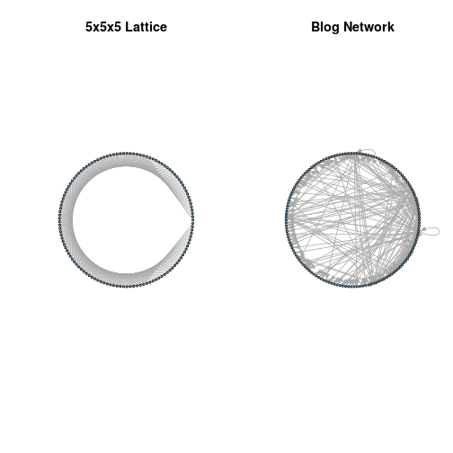 

#### (2) spring-embedder 방법

- 정점 = 공, 간선 = 스프링
- Fruchterman and Reingold 의 방법이 있음


```r
plot(g.l, layout=layout.fruchterman.reingold)
title("5x5x5 Lattice")
```

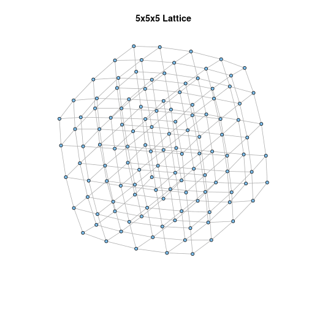 

```r
plot(aidsblog, layout=layout.fruchterman.reingold)
title("Blog Network")
```

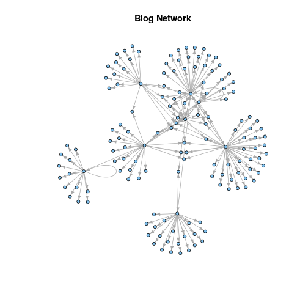 

- 이러한 종류의 layout의 경우 vetex들의 순서가 중요

#### (3) energy-placement 방법
- 에너지 = 정점 위치의 함수
- 낮은 에너지 = 이완된 상태
- Kamada and Kawai의 방법


```r
plot(g.l, layout=layout.kamada.kawai)
title("5x5x5 Lattice")
```

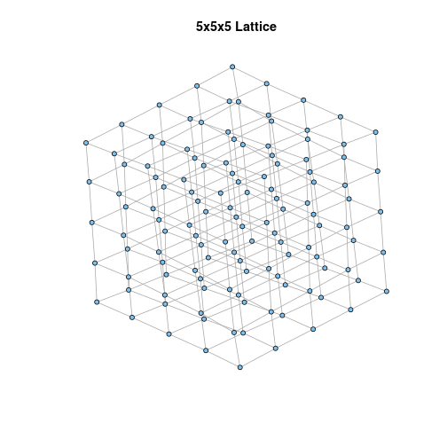 

```r
plot(aidsblog, layout=layout.kamada.kawai)
title("Blog Network")
```

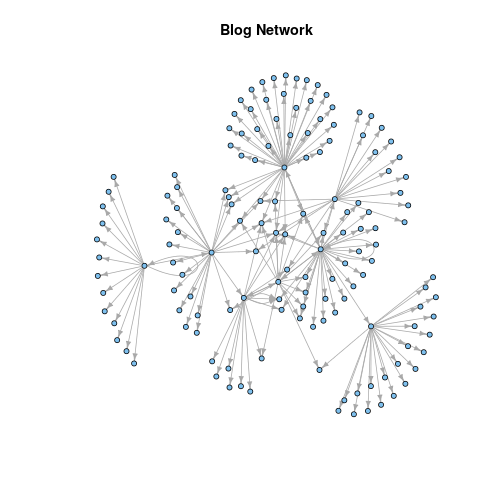 


### 특별한 구조를 갖는 그래프

#### (1) Tree


```r
g.tree <- graph.formula(1-+2,1-+3,1-+4,2-+5,2-+6,2-+7,
                        3-+8,3-+9,4-+10)
par(mfrow=c(1, 3))
igraph.options(vertex.size=30, edge.arrow.size=0.5,
               vertex.label=NULL)
plot(g.tree, layout=layout.circle)
plot(g.tree, layout=layout.reingold.tilford(g.tree,
                                            circular=T))
plot(g.tree, layout=layout.reingold.tilford)
```

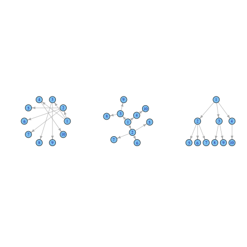 

#### (2) 이분 그래프


```r
plot(g.bip, layout=-layout.bipartite(g.bip)[,2:1],
     vertex.size=30, vertex.shape=ifelse(V(g.bip)$type,"rectangle", "circle"),
vertex.color=ifelse(V(g.bip)$type, "red", "cyan"))
```

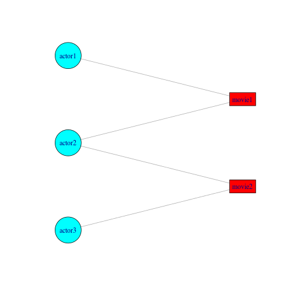 


## 3.4 Decorating Graph Layouts

### 데이터 설명 (karate club network)

- 정점 = 가라데 도장 회원
- 연결 = 사회적인 상호작용
- 관장과 관리자 사이의 분쟁으로 도장이 둘로 나뉨


```r
library(igraphdata)
data(karate)
# Reproducible layout
set.seed(42)
l <- layout.kamada.kawai(karate)
# Plot undecorated first.
igraph.options(vertex.size=10)
par(mfrow=c(1,1))
plot(karate, layout=l, vertex.label=V(karate))
```

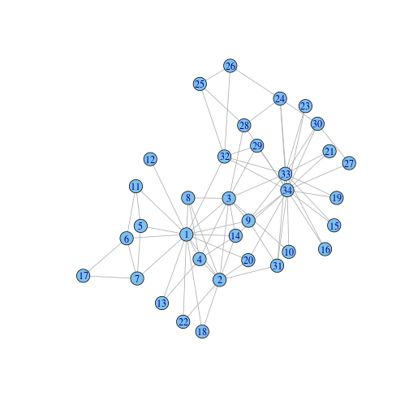 

```r
# Now decorate, starting with labels.
V(karate)$label <- sub("Actor ", "", V(karate)$name)
# 두 리더의 모양을 다른 사람들과 다르게 사각형으로 바꿈
V(karate)$shape <- "circle"
V(karate)[c("Mr Hi", "John A")]$shape <- "rectangle"
# 파벌에 따라 색을 다르게 함
V(karate)[Faction == 1]$color <- "red"
V(karate)[Faction == 2]$color <- "dodgerblue"
# 정점의 넓이를 strength에 비례하도록
# (i.e., total weight of incident edges).
V(karate)$size <- 4*sqrt(graph.strength(karate))
V(karate)$size2 <- V(karate)$size * .5
# 간선의 넒이를 weight에 따라 다르게
E(karate)$width <- E(karate)$weight
# 파벌간의 간선을 다른색으로
F1 <- V(karate)[Faction==1]
F2 <- V(karate)[Faction==2]
E(karate)[ F1 %--% F1 ]$color <- "pink"
E(karate)[ F2 %--% F2 ]$color <- "lightblue"
E(karate)[ F1 %--% F2 ]$color <- "yellow"
# 레이블 위치 보정
V(karate)$label.dist <-
ifelse(V(karate)$size >= 10, 0, 0.75)
# Plot decorated graph, using same layout.
plot(karate, layout=l)
```

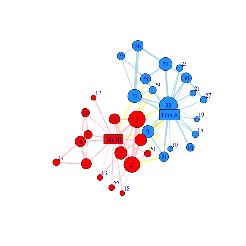 


```r
library(sand)
data(lazega)
# Office location indicated by color.
colbar <- c("red", "dodgerblue", "goldenrod")
v.colors <- colbar[V(lazega)$Office]
# Type of practice indicated by vertex shape.
v.shapes <- c("circle", "square")[V(lazega)$Practice]
# Vertex size proportional to years with firm.
v.size <- 3.5*sqrt(V(lazega)$Years)
# Label vertices according to seniority.
v.label <- V(lazega)$Seniority
# Reproducible layout.
set.seed(42)
l <- layout.fruchterman.reingold(lazega)
plot(lazega, layout=l, vertex.color=v.colors,
vertex.shape=v.shapes, vertex.size=v.size,
vertex.label=v.label)
```

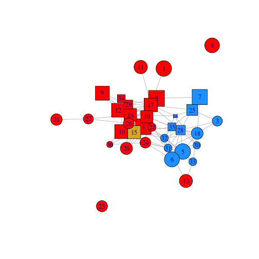 

## 3.5 Visualizing Large Networks

### 데이터 설명

- (이 예제는 렌더링 컴퓨터가 못버티는 관계로 그냥 코드만 제시합니다)
- (서준석님이 작성한 원 Rmd 파일을 참조하셔서 각자 실행해보세요)
- 프랑스 정치 블로그 스냅샷
- 1431개의 간선으로 연결된 192개의 블로그를 포함

```
library(sand)
summary(fblog)
```

```
party.names <- sort(unique(V(fblog)$PolParty))
party.names
```

```
set.seed(42)
l = layout.kamada.kawai(fblog)
party.nums.f <- as.factor(V(fblog)$PolParty)
party.nums <- as.numeric(party.nums.f)
plot(fblog, layout=l, vertex.label=NA,
vertex.color=party.nums, vertex.size=3)
```

### DrL방법

- 색을 통해 정당별로 구분하긴 했지만 정신없음
- 다행히 큰 그래프를 위한 알고리즘들이 존재 (정점들을 한데모아 배치)
- spring-embedder 방법의 향상된 버전 VxOrd
- VxOrd 기반의 또 다른 알고리즘 DrL방법을 제공

```
set.seed(42)
l <- layout.drl(fblog)
plot(fblog, layout=l, vertex.size=5, vertex.label=NA,
vertex.color=party.nums)
```

### 정점의 그룹들을 하나의 메타 그룹으로 대체

- 정당별 그룹의 크기 => 정점의 크기
- 그룹간의 간선의 수 => 간선의 두께

```
fblog.c <- contract.vertices(fblog, party.nums)
E(fblog.c)$weight <- 1
fblog.c <- simplify(fblog.c)

party.size <- as.vector(table(V(fblog)$PolParty))
plot(fblog.c, vertex.size=5*sqrt(party.size),
vertex.label=party.names,
vertex.color=V(fblog.c),
edge.width=sqrt(E(fblog.c)$weight),
vertex.label.dist=1.5, edge.arrow.size=0)
```

### egocentric 네트워크 시각화

- 특정 정점을 중심으로 한 부분 그래프만 보여줌


```r
data(karate)
k.nbhds <- graph.neighborhood(karate, order=1)
sapply(k.nbhds, vcount)
```

```
##  [1] 17 10 11  7  4  5  5  5  6  3  4  2  3  6  3  3  3  3  3  4  3  3  3
## [24]  6  4  4  3  5  4  5  5  7 13 18
```


```r
k.1 <- k.nbhds[[1]]
k.34 <- k.nbhds[[34]]
par(mfrow=c(1,2))
plot(k.1, vertex.label=NA,
vertex.color=c("red", rep("lightblue", 16)))
plot(k.34, vertex.label=NA,
vertex.color=c(rep("lightblue", 17), "red"))
```

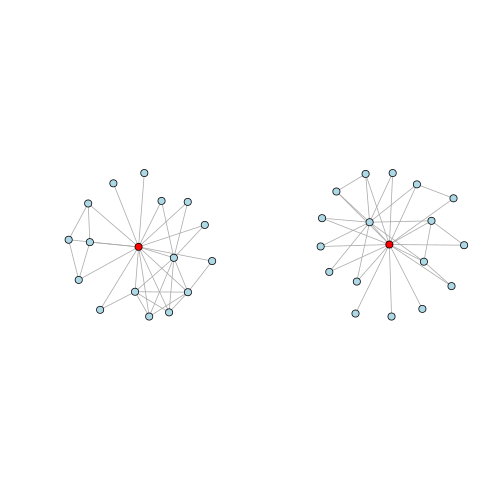 
