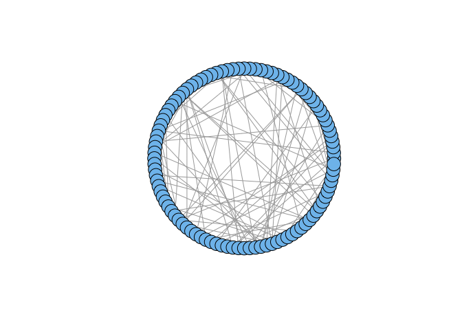
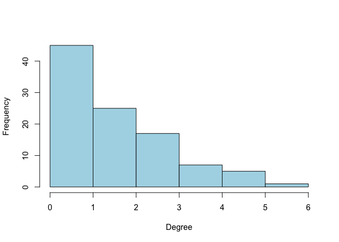
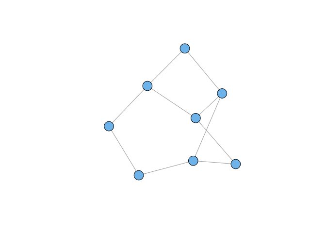
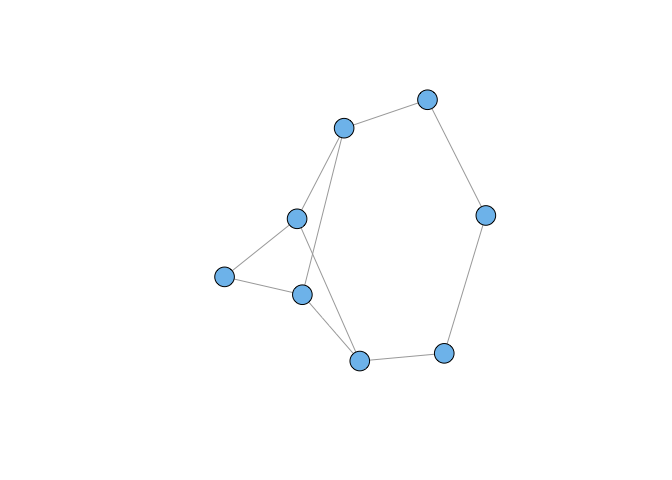
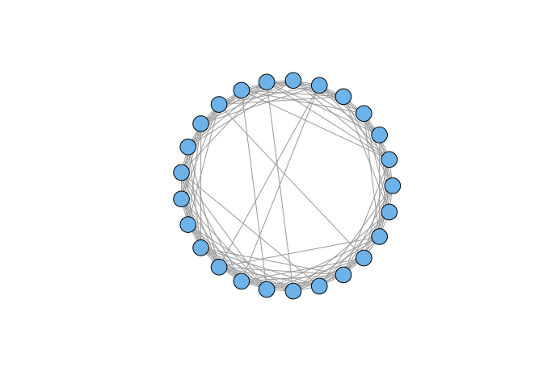
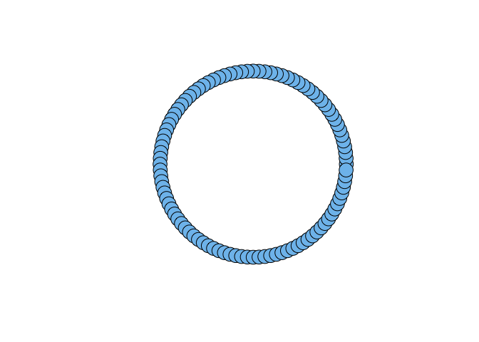
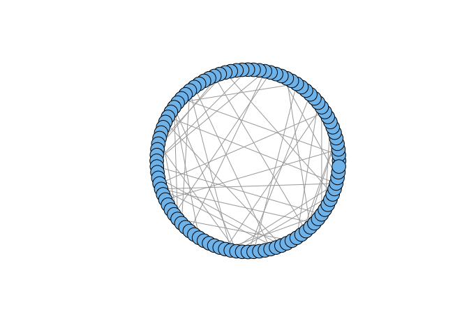
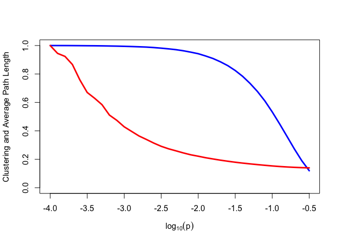

# ch5.Mathematical Models for Network Graphs
Park, Jung Eun  
Thursday, March 19, 2015  

5.2 Classical Random Graph Models

- 에르되스&레니의 무작위네트워크
- erdos.renyi.game(N,p)


```r
library(sand)
```

```
## Loading required package: igraph
## Loading required package: igraphdata
## 
## Statistical Analysis of Network Data with R
## Type in C2 (+ENTER) to start with Chapter 2.
```

```r
set.seed(42)
g.er <- erdos.renyi.game(100,0.02)
plot(g.er, layout = layout.circle, vertex.label=NA)
```

 

```r
#?erdos.renyi.game

str(g.er)
```

```
## IGRAPH U--- 100 95 -- Erdos renyi (gnp) graph
## + attr: name (g/c), type (g/c), loops (g/l), p (g/n)
## + edges:
##  [1]  4--  6  1--  9 14-- 15  6-- 19 14-- 19  7-- 24 27-- 28 18-- 29
##  [9] 26-- 31 15-- 32 25-- 32 29-- 37 24-- 38 35-- 39 34-- 43 30-- 45
## [17]  2-- 46 18-- 46  7-- 48 19-- 49 25-- 49 36-- 50 41-- 50 51-- 52
## [25] 43-- 60 46-- 60 59-- 60 38-- 62  1-- 63 15-- 63 46-- 63 15-- 64
## [33] 26-- 64 37-- 65  4-- 67 28-- 67 56-- 67 38-- 69 66-- 69  5-- 70
## [41] 59-- 70 11-- 71 65-- 73  1-- 74  4-- 74 37-- 74 30-- 75 37-- 76
## [49] 70-- 76  7-- 77 39-- 77 30-- 78 14-- 79 16-- 79 43-- 79 47-- 79
## [57] 20-- 80 51-- 80 12-- 81 19-- 81 27-- 81 64-- 81 60-- 82 56-- 83
## [65] 79-- 83 53-- 84 74-- 85 63-- 86 23-- 87 50-- 89 55-- 89 69-- 89
## [73] 38-- 90 31-- 91 38-- 91 74-- 91 20-- 92 81-- 92 31-- 93 91-- 93
## [81] 71-- 95 54-- 96 61-- 96 12-- 97 16-- 97 27-- 97 90-- 97 26-- 98
## [89]  9-- 99 12-- 99 40-- 99 68-- 99 86-- 99 91-- 99 83--100
```

```r
is.connected(g.er)
```

```
## [1] FALSE
```

```r
table(sapply(decompose.graph(g.er), vcount))
```

```
## 
##  1  2  3  4 71 
## 15  2  2  1  1
```

```r
mean(degree(g.er))
```

```
## [1] 1.9
```

```r
hist(degree(g.er), col="lightblue",
     xlab="Degree", ylab="Frequency", main="")
```

 

```r
average.path.length(g.er)
```

```
## [1] 5.276511
```

```r
diameter(g.er)
```

```
## [1] 14
```

```r
transitivity(g.er)
```

```
## [1] 0.01639344
```

5.3 Generalized Random Graph Models


```r
degs <- c(2,2,2,2,3,3,3,3)
g1 <- degree.sequence.game(degs, method="vl")
g2 <- degree.sequence.game(degs, method="vl")
plot(g1, vertex.label=NA)
```

 

```r
plot(g2, vertex.label=NA)
```

 

```r
graph.isomorphic(g1, g2)
```

```
## [1] FALSE
```

```r
c(ecount(g1), ecount(g2), mean(degree(g1)), mean(degree(g2)))
```

```
## [1] 10.0 10.0  2.5  2.5
```


```r
data(yeast)
degs <- degree(yeast)
fake.yeast <- degree.sequence.game(degs, method=c("vl"))
all(degree(yeast) == degree(fake.yeast))
```

```
## [1] TRUE
```

```r
ecount(yeast)
```

```
## [1] 11855
```

```r
ecount(fake.yeast)
```

```
## [1] 11855
```

```r
vcount(yeast)
```

```
## [1] 2617
```

```r
vcount(fake.yeast)
```

```
## [1] 2617
```

```r
mean(degree(yeast))
```

```
## [1] 9.059992
```

```r
mean(degree(fake.yeast))
```

```
## [1] 9.059992
```

```r
diameter(yeast)
```

```
## [1] 15
```

```r
diameter(fake.yeast)
```

```
## [1] 7
```

```r
transitivity(yeast)
```

```
## [1] 0.4686178
```

```r
transitivity(fake.yeast)
```

```
## [1] 0.03968903
```

5.4 Network Graph Models Based on Mechanisms

5.4.1 Small-World Models


```r
g.ws <- watts.strogatz.game(1, 25, 5, 0.05)
plot(g.ws, layout=layout.circle, vertex.label=NA)
```

 

```r
vcount(g.ws)
```

```
## [1] 25
```

```r
g.lat100 <- watts.strogatz.game(1, 100, 5, 0)
plot(g.lat100, layout=layout.circle, vertex.label=NA)
```

 

```r
transitivity(g.lat100)
```

```
## [1] 0.6666667
```

```r
diameter(g.lat100)
```

```
## [1] 10
```

```r
average.path.length(g.lat100)
```

```
## [1] 5.454545
```

```r
g.ws100 <- watts.strogatz.game(1, 100, 5, 0.05)
plot(g.ws100, layout=layout.circle, vertex.label=NA)
```

 

```r
diameter(g.ws100)
```

```
## [1] 4
```

```r
average.path.length(g.ws100)
```

```
## [1] 2.669091
```

```r
transitivity(g.ws100)
```

```
## [1] 0.4864154
```

```r
ecount(g.lat100)
```

```
## [1] 500
```

```r
ecount(g.ws100)
```

```
## [1] 500
```


```r
steps <- seq(-4, -0.5, 0.1)
len <- length(steps)
cl <- numeric(len)
apl <- numeric(len)
ntrials <- 100
for (i in (1:len)) {
   cltemp <- numeric(ntrials)
   apltemp <- numeric(ntrials)
   for (j in (1:ntrials)) {
     g <- watts.strogatz.game(1, 1000, 10, 10^steps[i])
     cltemp[j] <- transitivity(g)
     apltemp[j] <- average.path.length(g)
   }
   cl[i] <- mean(cltemp)
   apl[i] <- mean(apltemp)
 }

plot(steps, cl/max(cl), ylim=c(0, 1), lwd=3, type="l", 
   col="blue", xlab=expression(log[10](p)),
   ylab="Clustering and Average Path Length")
lines(steps, apl/max(apl), lwd=3, col="red")
```

 


