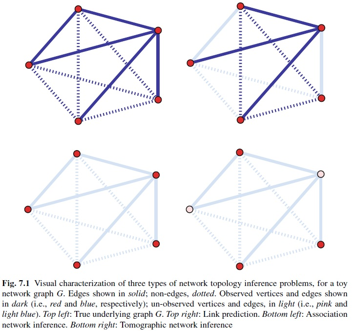
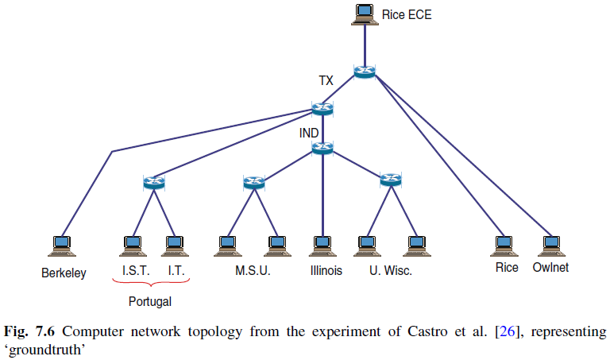

### 7.1 Introduction

- 두 vertex 간의 edge의 존재의 중요성
- 그러나 현실에서는 vertex나 edge를 예측할 수 밖에 없는 경우가 있음
- 그런 경우 데이터 정보나 사전 정보를 기반하여 통계적 추론이나 모델링 방법을 통해 이용 가능한 데이터로부터 네트워크 그래프 대표자를 구축하는 것을 고려할 수 있다
- 이것이 network topology inference임

##### - network topology inference의 세가지 클래스
1) 모든 vertex와 네트워크 그래프의 edges/non-edges의 일부 상태의 지식을 가정한다.
2) 네트워크 그래프 어느 곳에서나 edge의 정보 없이 시작하지만,</br>
모든 vertex에서 상대적의 측정치를 가정하고 이 측정치를 사용하여 edge 상태를 추정하여 찾는다
3) 네트워크 그래프의 알려지지 않은 topology를 추론하는데 유용한 정보를</br> vertex가 간접적으로 제공함으로써, 특정 부분 집합에서 측정치에 관련된다.


 
 
### 7.2 Link Prediction
Y: network graph G=(V,E)의 랜덤한 Nv × Nv binary adjacency matrix

네트워크 그래프에서 관찰되는 edges/non-edges의 부분 집합에서 제공되는 정보와,</br>
이용 가능한 vertex 속성을 사용하여 vertex 쌍 사이에 '가능한 edge' 여부를 예측한다.

edge presence/absence의 정보를 랜덤하게 missing 처리 </br>
=> 예를 들어  edge 변수 Y<sub>ij</sub> 는 각 값이 아니라 관찰된 다른 edge 변수에 의존하여 관찰된다.</br>

$$\mathbb{P}(Y^{miss}|Y^{obs}=y^{obs}, X=x) \quad(7.1)$$

각 k fold 마다 랜덤으로 missing으로 제외한다.</br>
i와 j의 vertex 쌍 간에 가능한 edge의 상태를 위한 예측은 Yij의 posterior expectation 에 의존한다.

*Scoring methods
edge 상태가 알려지지 않은 i,j vertex 쌍에 대해서 s(i, j) 점수가 계산된다.</br> 예상된 edge의 집합은 s∗를 이 점수에 적용됨으로써 수정된 s∗에 대해 리턴되든지,</br> 상위 n∗ 값의 쌍을 유지한 채 정렬함으로써 수정된 n∗값에 대해 리턴한다.</br>
많은 점수 타입에 대해 문헌에 제시되어 있고 대부분은 Y<sup>obs</sup> = y<sup>obs</sup>와 연관된 G<sup>obs</sup> = (V<sup>obs</sup>,E<sup>obs</sup>) 네트워크의 어떤 구조적 특성을 접근하기 위해 디자인된다.

‘small-world’원칙에 의해 영감 받은 simple score는 i와 j사이에 가장 짧은 경로에 negative하다.

$$S(i,j)=-dist_{G^{obs}}(i,j) \quad(7.2)$$

(7.2) 에서 음의 부호는 큰 점수가 vertex 쌍이 edge를 공유할 수 있도록 한다.

i,j의 관찰된 이웃의 비교에 기반한 Gobs 점수는 다음과 같다.
$$ s(i,j)=| N_{i}^{obs} \cup N_{j}^{obs} |  \quad(7.3) $$


이와 같이 간단한 스코어링 방법의 가능성을 설명하기 위해서,French political blogs인 fblog를 이용하자. </br>
이 네트워크에서 각 쌍의 많은 근접한 공통의 이웃의 수는 자신의 경우를 제외시키며 다음 예제와 같은 방법으로 계산될 것이다.

##### Network of French political blogs

: Subnetwork of French political blogs, extracted from a snapshot of over 1,100 such blogs on a single day in October of 2006 and classified by the “Observatoire Presidentielle” project as to political affiliation. </br>
: An undirected igraph graph with 192 vertices and 1431 edges. The graph has two vertex attributes, ‘name’ is the URL of the blog, and ‘PolParty’ is the assigned political affiliation, a political party.

```{r}
# CHUNK 1
#install.packages("sand")
library(sand)
nv <- vcount(fblog)
#vcount(fblog) #192
#ecount(fblog) #1431
ncn <- numeric()
A <- get.adjacency(fblog)

for(i in (1:(nv-1))){
  ni <- neighborhood(fblog, 1, i) #order 0 is always v itself, order 1 is v plus its immediate neighbors, order 2 is order 1 plus the immediate neighbors of the vertices in order 1
  nj <- neighborhood(fblog, 1, (i+1):nv)
  nbhd.ij <- mapply(intersect, ni, nj, SIMPLIFY=FALSE)
  #simplify: logical or character string; should the result be simplified to a vector, matrix or higher dimensional array if possible? For sapply it must be named and not abbreviated. The default value, TRUE, returns a vector or matrix if appropriate, whereas if simplify = "array" the result may be an array of “rank” (=length(dim(.))) one higher than the result of FUN(X[[i]]).
  temp <- unlist(lapply(nbhd.ij, length)) - 2*A[i, (i+1):nv]
  ncn <- c(ncn, temp)
 }
```

Fig.7.2에서 vertex 쌍에 대해 서로 incident하지 않은 (즉, ‘no edge’)것과 ‘edge’인 s(i, j) 점수를 비교한다.
```{r}
# CHUNK 2
#install.packages("vioplot")
library(vioplot) #violin plot = box plot + kernel density plot
Avec <- A[lower.tri(A)] #lower.tri:matrix of logicals the same size of a given matrix with entries TRUE in the lower or upper triangle
vioplot(ncn[Avec==0], ncn[Avec==1], 
   names=c("No Edge", "Edge"))
title(ylab="Number of Common Neighbors")
```

Fig. 7.2 Comparison of the number of common neighbors score statistic [i.e., (7.3)] in the network of French political blogs, grouped according to whether or not an edge is actually present between a vertex pair, for all vertex pairs

그림에서 보이는 것처럼 이 비교는 edge가 있을 때 큰 값을 결정하는 경향이 있다.


‘leave-one-out’ cross-validation처럼 ROC curve에 따른 area under the curve (AUC)를 계산해보자.
```{r}
#install.packages("ROCR")
library(ROCR)
pred <- prediction(ncn, Avec)
perf <- performance(pred, "auc")
slot(perf, "y.values")
```

Edges와 non-edges를 구분하는 power를 더 구해보자. Jaccard coefficient는 표준화 버전을 포함한 유사한 점수 통계치이다.

$$ s(i, j) = \frac{|N_{i}^{obs} \cap N_{j}^{obs}|}{|N_{i}^{obs}\cup N_{j}^{obs}|}  \quad(7.4)$$

Liben-Nowell & Kleinberg의 아이디어에 Adamic & Adar 의 더 일반화된 아이디어를 확장한 다음과 같은 수식이 있다.
$$ s(i, j) = \sum_{k \in N_{i}^{obs} \cap N_{j}^{obs}}\frac{1}{log|N_{k}^{obs}|} \quad(7.5) $$

(7.5)에서 마지막 점수는 연결성이 높지 않은 공통의 i,j 이웃에 더 가중치를 주는 효과를 가지고 있다. 


### 7.3 Association Network Inference
주어진 데이터 세트를 대변하는 네트워크 그래프에서 edge를 정의하는데 사용되는 법칙에서 두 사건의 vertex의 어떤 속성 간에 충분한 ‘association(연관)’ 수준이 있을 수 있다.</br>
그러한 연관 네트워크는 과학 기사인용 패턴의 네트워크, 영화에서 공동으로 출연하는 배우의 네트워크, 유전자 사이에 조절 영향을 주는 네트워크, 뇌의 기능적 지역 간의 네트워크 등 많은 도메인에서 발견된다.</br>
그러한 네트워크에서 edge를 정의하는 규칙은 종종 명백한 역할을 하는 통계 없이 명세화 된다.
이러한 규칙에 기반한 접근법이 어떤 맥락에서는 적절하지만, 샘플링의 이슈나 척도 오류가 잠재적 관심사인 다른 경우에서는 연관 네트워크 그래프를 구축하는 과정에 통계적 원리와 방법을 포함할 필요성이 있다.</br>
공식적으로, v ∈ V인 vertex처럼 표현되는 요소의 집합을 가지고 있다고 가정하자. 또한, vertex v 각각에 속성이 m번 관찰된 vertex x에 대응하고 속성 벡터의 {x<sub>1</sub>,...,x<sub>Nv</sub>} 집합을 가진다고 가정하자.

sim(i, j)을  i, j ∈ V인 vertex 쌍 사이에 사용자 정의의 수량화된 내재 유사성이리고 하고,  sim(i, j) 값이 ‘non-trivial’ 수준의 i와 j 사이의 연관을 구성하는 것에 대응하는 개념에 의해 수반된다고 가정하자.
sim 자체는 직접적으로 관찰되지 않는 곳에서 경우에 관심이 있지만, 
속성 {X<sub>i</sub>}은 sim에 가능한 추론을 위한 충분히 유용한 정보를 포함한다.
실질적으로 sim을 위한 선택의 과정이 무한하다. 여기서 우리는 연관-상관관계, 부분적 상관관계와 그들에 기반한 연관 네트워크를 추론하는 2개의 공통의 유명한 선형 방법에 대해 살펴보자.
다음은 2개의 object를 포함하는 Ecoli.expr 데이터의 유전자 조절 네트워크의의 예이다.

```{r}
# CHUNK 4
rm(list=ls())
data(Ecoli.data)
ls()
# CHUNK 5
heatmap(scale(Ecoli.expr), Rowv=NA)
```

Fig. 7.3 Heatmap visualization of gene expression patterns over 40 experiments (rows) for 153 genes (columns)

40번의 다른 실험 컨디션 아래에서 153개의 transcription factor 에 대한 (log) gene expression 데이터이며, 각 실험은 3번의 replicate의 평균 값을 사용한다. </br> transcrition factor라고 불리는 유전자는 gene regulatory relationship의 네트워크에 특히 중요한 역할을 하는 것으로 알려져 있다. </br> 이 실험은 40개의 다른 유전자에 대해 각각 'turned off' 되었을 때 유전적 perturbation 실험이다. gene expression 측정치는 각 주어진 실험적 perturbation에서 153개 유전자의 activity 수준을 각기 나타낸다.

유전자(컬럼)는 해당되는 발현 수준의 hierarchical clustering 에 따라 정렬되었다. </br> gene regulation 과정의 특성 때문에, gene regulation 쌍의 발현 수준은 같이 변화될 것으로 기대된다. </br>  어떤 유전자가 특정 집합의 실험에 유사한 행동을 가지고 있는 곳에서 그러한 연관관계의 증거를 그림을 통해 시각화해 볼 수 있다. 이러한 데이터에서 연관 네트워크를 구축하는 값을 제시한다. </br> 이 사실은 이 데이터로부터 연관 네트워크를 구축하는 값을 제시한다. 유전자 조절 관계에 잠재적인 네트워크를 위한 proxy로서 구축의 값을 제시하는 것은 시스템 생물학에서 흔한 일이다. </br>
이 데이터 세트에서 두번째 object는 실험 데이터를 수집하는 것과 더불어 RegulonDB 데이터베이스에서 추출한 E.coli 진짜 regulatory 관계의 (완벽하지 않은만) 지식을 요약하는 근접 메트릭스이다. 


```{r}
# CHUNK 6
library(igraph)
g.regDB <- graph.adjacency(regDB.adj, "undirected")
summary(g.regDB)
```
209개의 알려진 regulatory pair가 있다. 이를 시각화 해보자.
```{r}
# CHUNK 7
plot(g.regDB, vertex.size=3, vertex.label=NA)
```

Fig. 7.4 Network of known regulatory relationships among 153 genes in E. coli

Fig. 7.4와 같이 single connected component에서 이러한 pair가 많이 포함된다.

g.regDB 그래프에서 정보는 실제 세트를 총합하는 형태를 대변한다. 부분이나 모든 gene–gene regulatory 관계는 주어진 상태의 집합 아래 생물 유기체에서 활성화 될 수 있다. 이 그래프는 아래서 소개할 연관 네트워크 추론의 방법을 평가하는데 참고점으로 유용하하다.


#### 7.3.1 Correlation Networks
X를 V에서 vertex에 상응하는 관심 (연속) 랜덤 변수라고 하자. 
$$\rho_{ij} = corr_{X_{i},X_{j}}= \frac{\sigma_{ij}}{\sqrt{\sigma_{ii}\sigma_{jj}}} \quad(7.6) $$
vertex 속성의 랜덤 벡터 (X<sub>1</sub> , ... , X<sub>Nv</sub>)<sup>T</sup> 
의 공변 매트릭스 Σ = {σ<sub>ij</sub>}의 entry 용어로 표현되는 X<sub>i</sub> 와 X<sub>j</sub> 사이의 Pearson product-moment correlation가 (7.6)일때, vertex 쌍 사이의 유사성의 표준 척도는 sim(i, j) = ρ<sub>ij</sub> 이다.
이러한 유사성의 선택이 주어졌을 때, i와 j 사이에 연관성이 있다면 ρ<sub>ij</sub> 가 0이 아니다.
그래프 G의 해당 association은 다음 (7.7)의 edge 집합을 갖는 그래프 (V,E) 이다.
$$E=\left \{ {i,j} \in V^{(2)} : \rho_{ij}\neq 0 \right \} \quad(7.7)$$
이 그래프는 종종 covariance (correlation) 그래프로 불린다.
X<sub>i</sub>의 관측치의 집합이 주어졌을 때, 이 연관 네트워크 그래프를 추정하는 임무는 non-zero correlation의 집합을 추론하는 것과 동일하다.
이러한 임무의 한가지 방법은 다음 가정을 테스트함으로써 접근된다. 
H0 :ρ<sub>ij</sub> =0 versus H1 :ρ<sub>ij</sub> ̸=0. \quad(7.8)

그러나 다음 3가지 중요한 이슈가 있다.</br>
1. 테스트 통계치의 선택</br>
2. 통계적 유의성을 평가하기 위한 적절한 null 분포의 결정</br>
3. 동시에 수행되는 많은 수의 테스트 (즉, 가능한 모든 edge인 Nv(Nv −1)/2), 다중  검증 문제가 있음)

각각의 vertex i ∈ V 에 대해서, X<sub>i</sub>의 n개의 독립적인 관찰치 
x<sub>i1</sub>,...,x<sub>in</sub> 을 가지고 있다고 가정하자. </br>테스트 통계치로서, σˆ<sub>ij</sub>가 (7.6)의 σ<sub>ij</sub> 의 경험적 연관성에 상응할 때,
$$ \hat\rho_{ij}=\frac{\hat\sigma_{ij}}{\sqrt{\hat\sigma_{ii}\hat\sigma_{jj}}} \quad(7.9)$$
이 많이 선택된다.
expression 데이터의 모든 유전자의 이 값을 계산하는 것은 다음과 같다.
```{r}
# CHUNK 8
mycorr <- cor(Ecoli.expr)
```

그러나, 이 값을 Fisher’s transformation
$$z_{ij}=tanh^{-1}(\hat\rho_{ij})=\frac{1}{2}log\left [ \frac{(1+\hat\rho_{ij})}{(1-\hat\rho_{ij})} \right ] \quad(7.10)$$
은 변환을 안정화 하는 변수로서 유용하게 사용된다.
(X<sub>i</sub>,X<sub>j</sub>) 쌍이 양측 정규 분포라면, 
$$ \hat\rho_{ij} \quad under \quad H_{0}:\rho_{ij}=0 $$
(X<sub>i</sub>,X<sub>j</sub>) 쌍이 bivariate 정규 분포를 따르면, H0 : ρ<sub>ij</sub> = 0 밀도 하에 ρˆij의 밀도는 편균 0과 분산 1/(n−3)인 가우시안 랜덤 변수에 의해 잘 근사화 된다.
따라서 다음 (7.10)에서 mycorr correlation을 transform 해보자.

```{r}
# CHUNK 9
z <- 0.5 * log((1 + mycorr) / (1 - mycorr))
```

그리고 적당한 정규 분포에 따라 p-value를 계산한다.
```{r}
# CHUNK 10
z.vec <- z[upper.tri(z)]
n <- dim(Ecoli.expr)[1]
corr.pvals <- 2 * pnorm(abs(z.vec), 0, 4 + sqrt(1 / (n-3)), lower.tail=FALSE)
```

```{r}
# CHUNK 11
length(corr.pvals)
```
multiple testing을 adjust 할 p-value를 계산은 p.adjust 함수를 사용하며 그 방법으로 Benjamini-Hochberg adjustment를 사용한다. false discovery rate (FDR) 은 R이 m번 테스트에서 기각될 경우, Rfalse 가 잘못된 기각일 경우에  다음과 같이 정의된다.
$$FDR=\mathbb{E}\left ( \frac{R_{false}}{R} | R>0 \right )\mathbb{P}(R>0)  \quad(7.11)$$

Benjamini and Hochberg은 p(j)가 m  테스트 중 j번째 작은 p-value 일때 p-values p(j) ≤ ( j/m)γ 와 연관된 모든 테스트에 대한 null hypothesis을 기각하면서, user-specified level γ 에서 FDR을 제어하는 방법을 제공한다.
```{r}
# CHUNK 12
corr.pvals.adj <- p.adjust(corr.pvals, "BH")
#corr.pvals.adj <- p.adjust(corr.pvals, method="BH")
```

```{r}
# CHUNK 13
#length(corr.pvals.adj < 0.05)
length(corr.pvals.adj[corr.pvals.adj < 0.05]) #책에는 5227개!
```

QQ plot을 간단히 그리는 qqnorm 함수는 fisher transformed correlations z의 정규성을 가정하기 때문에 이 데이터에는 부적절하다. 결과적으로, 위의 5227개의 유의한 vertex 쌍에 edge 상태를 할당하는 것은 의심스럽다.</br>
다행스럽게, 결정적으로 z의 11000개가 넘는중복되지 않은 요소를 가지는 ‘data rich’ 상태에서  null distribution를 학습하는 데이터 의존적인 방법을 사용하게 된다. R package fdrtool 패키지는 그러한 몇가지 방법을 사용한다.
```{r}
# CHUNK 14
#install.packages("fdrtool")
library(fdrtool)
```
이 패키지의 방법은 다음 식의 통계치 S에 대한 mixture model에 기반한다는 특성을 공유한다.
$$f(s) = η0 f0(s)+(1−η0)f1(s)  \quad(7.12)$$
이때 데이터에서 기대되는 true null hypotheses의 fraction으로 효과적으로 제공함으로써  η0 f0(s)는 null hypothesis H0 아래, f1(s)은 아래 alternative hypothesis H1 아래의 S의 밀도 함수의 확률을 나타낸다.  f0 와 f1 모두 데이터로부터 혼합 parameter η<sub>0</sub> 처럼 추정된다. multiple testing은  FDR을 통해 제어된다.
여기서, 통계치 S를 경험적 상관관계 (7.9)로 간주하고 fdrtool 내에 주요 함수에서 default 옵션으로 사용한다.
```{r}
# CHUNK 15
mycorr.vec <- mycorr[upper.tri(mycorr)]
fdr <- fdrtool(mycorr.vec, statistic="correlation")
```

Fig. 7.5 Analysis of the empirical correlation coefficients for the gene expression data. Top: Estimated components f0 and f1 of the mixture in (7.12). Middle: Estimated density f . Bottom: False discovery rate

Fig. 7.5. 에서 (절대적) 경험적 상관 계수의 히스토그램은 정규 분포와 닮았지만 단독의 널리 퍼진 모드의 모양을 가짐으로써 데이터로부터 쉽게 측정이 가능하다.

그러나 ηˆ <sub>0</sub> = 1 의 추정치와 함께, 그 방법은 모든 상관 계수가 단독 밀도 함수 f0 로부터 나오기 위해 판단되어아 햔다. 따라서, 어떤 threshold가 상관관계에 응용되더라도  FDR은 100%로 추정된다.
따라서, 이 경우 데이터의 행동을 정확하게 캡쳐하는 경험적으로 추론된 null distribution을 사용함으로써, 추론하려고 찾는 상관 네트워크가 사실상 비어있는 그래프라는 결론을 낼 수 있다. 더 적절한 해석은 단순히 (a) 유사도 선택, (b) 샘플 크기, (c) effect size 분포를 단순히 같이 조합하는 것은 edge와 non-edge 사이에 명백한 차이를 고려하는 것을 불가능 하게 만들었다.


####7.3.2 Partial Correlation Networks
Pearson과 같은 correlation에 기반한 association 네트워크를 구축할 때 자주 인용되는 용어 ‘correlation does not imply causation’ 을 유념해야 한다. i, j ∈ V 인 2개의 vertex는 X<sub>i</sub>과 X<sub>j</sub> 와 상당히 correlated한 ‘influence’를 주는 요소일 수 있다. 
대안적으로, 그들의 correlation은 주로 높을 수 있다. 예를 들어 k ∈ V 처럼 세번째 vertex에 의해 서로 강하게 영향을 받을 수 있고, 따라서 X<sub>i</sub>와 X<sub>j</sub>가 서로 강하게 Xk와 상관 관계에 있다.

이러한 이슈로 확장하는 것은 문제가 될 수 있고, 추론하기를 찾는 네트워크 그래프 G의 의도된 사용에 작지 않은 부분에 의존하지 않을 것이다.
추론된 edge가 vertex간에 (비간접보다) 직접적인 영향을 반영할 수록, 부분적인 상관관계는 더 관련성 있게 된다.

다른 말로, vertex k1,...,km ∈V \{i, j}의 Xk1,...,Xkm 속성에 상당하도록 정의된, i, j ∈ V 인 vertex의 X<sub>i</sub>와 X<sub>j</sub> 의 속성의 부분적 상관성은 둘 다에게 흔한 Xk1,...,Xkm 의 효과에 조정된 후에 남겨진다. 

공식적으로 S<sub>m</sub> = {k1,...,km}을 설정해서, XS<sub>m</sub> =(Xk1,...,Xkm)T을 조정함으로써 X<sub>i</sub>와 X<sub>j</sub>의 부분적 상관 관계를 정의한다.
$$\rho_{ij|S_{m}}=\frac{\sigma_{ij|S_{m}}}{\sqrt{\sigma_{ij|S_{m}}\sigma_{ij|S_{m}}}} \quad(7.13) $$
여기서 σ<sub>ii</sub>|S<sub>m</sub> , σ<sub>jj</sub>|S<sub>m</sub> , σ<sub>ij</sub>|S<sub>m</sub> = σ <sub>ji</sub>|S<sub>m</sub>  은  각각 2 × 2 부분 공변 행렬을 가진 대각과 off-대각 a원소이다. 
$$\sum{_{11|2}}=\sum{_{11}}-\sum{_{12}}\sum{_{22}^{-1}}\sum{_{21}} \quad(7.14)$$ 이다.

Σ<sub>11</sub>, Σ<sub>22</sub>, Σ<sub>12</sub> = Σ<sub>T</sub> 는 W<sub>1</sub> =(X<sub>i</sub>,X<sub>j</sub>)<sup>T</sup> 와 W<sub>2</sub> =X<sub>S<sub>m</sub></sub>에 대하여 다음과 같은 부분화된 공변 행렬을 통해 정의 된다.
$$Cov\binom{W_{1}}{W_{2}}=\begin{bmatrix}
\sum{_{11}} & \sum{_{12}}\\ 
\sum{_{21}} & \sum{_{22}}
\end{bmatrix} \quad(7.15)$$
 X<sub>i</sub>와 X<sub>j</sub>가 XS<sub>m</sub> 에 조건적으로 독립적이면 (X<sub>i</sub>,X<sub>j</sub>,Xk1,...,Xkm)T가 다중공변수 가우스 분포를 따를때, ρ<sub>ij</sub>|S<sub>m</sub> = 0이다.  더 일반적인 분포를 위해, 제로 부분 공변수는 꼭 독립적임을 의미하지는 않는다. (물론 반대도 여전히 사실이다).
m = 0일때, (7.13)에서 부분적 상관관계는 (7.6)의 피어슨 상관관계를 줄여주는 것을 주의하라. 또한, 3개의 (m-1)번째 계수에 각 m번째 부분적 상관 계수와 관련된 순환 식이 있다. For example, in the case of m = 1일 때, 두 vertex i와 j에 대해 속성 변수 X<sub>i</sub>와 X<sub>j</sub>의 부분 상관관계는 Xk에 의해 다음과 같이 보정된다.
$$\rho_{ij|k}=\frac{\rho_{ij}-\rho_{ik}\rho_{jk}}{\sqrt{(1-\rho_{ik}^{2})(1-\rho_{jk}^{2})}} \quad(7.16)$$
더 일반적인 경우는 Anderson 의 수식이다. [5, Chap. 2.5.3].
부분 상관관계는 vertex 속성 X1,...,XNv에 관련된  연관 네트워크 그래프 G를 위해 다양한 방법에서 사용된다. 예를 들어, 주어진 m의 선택을 위해, m개의 다른 vertex가 조건이 된 것과 상관 없이 X<sub>i</sub>, X<sub>j</sub> 사이의 연관관계가 있을 때만 보이는 edge에 영향을 줄 수 있다.
즉, V (m)이 모든 정렬되지 않은 m개의 (별개의) 부분 집합일때,
$$E={{i, j}}∈V(2) : ρ<sub>ij</sub>|S<sub>m</sub> ̸=0$$
,for all
$$S<sub>m</sub> ∈V\{i, j}}\quad(7.17)$$
또한 다른 선택들도 명백하게 가능하다.
(7.17)에서 edge의 정의 아래, G에서 가능한 edge {i, j}의 존재나 부재를 결정하는 문제는 다음 테스트 중 하나로 대변될 수 있다.

H0 :ρ<sub>ij</sub>|S =0 for some Sm ∈V(m) \{i, j}
versus
H1 : ρ<sub>ij</sub>|S ̸= 0 for all Sm ∈V(m) \{i, j }
\quad(7.18)

이 맥락에서 네트워크 그래프의 연관을 추론하기 위해서, i ∈ V 인 모든  vertex에서 측정치가 주어졌을 때, 위에서처럼 다시 테스트 통계를 정하고 적절한 null distribution을 생성하고, multiple testing을 조절하여야 한다.

(7.9)에서 empirical correlation coefficient ρˆij과 유사하게, ρˆij|Sm 는 ρ<sub>ij</sub>|Sm의  natural estimate 이다. 그리고 유사하게, Fisher’s transformation
zij|Sm = 1/2 log[(1++ρˆij|Sm)/(1−ρˆij|Sm)] \quad(7.19)
는 부분적 상관관계의 자리에 종종 사용된다. 속성 (X<sub>i</sub>,X<sub>j</sub>,Xk1,...,Xkm)T의 joint distribution이 다중변수의 정규 분포를 가진다는  가정 하에,  이 통계치는 평균 0과 분산 1/(n−m−3)인 정규 분포에 근사한다.

(7.18)에서 테스팅 문제를 접근하여, 다음 수식의 더 작은 부분문제의 집합을 고려하는데 편리하다.
H0′ : ρ<sub>ij</sub>|Sm = 0 versus H1′ : ρ<sub>ij</sub>|Sm ̸= 0  \quad(7.20)
이때 ρˆij|Sm은 natural 테스트 통계치이다.
(7.18)은 aggregation을 통헤 부분 문제 (7.20)의 테스트로부터 생성될 수 있다. 예를 들어, Wille et al. [148] 은 다음을 정의함으로써, 모든 Sm에 대하여 p-values pij|Sm 에서 정보를 합하는 것을 제시한다. 
pij|Sm가 (7.20)의 테스트를 위한 p-values 인 곳에서, (7.18)의 테스트를 위한 p-value가 되기 위해서,
pij,max = max{pij|Sm : Sm ∈ V\{i, j}} \quad(7.21)

Ecoli.expr의 유전자 발현 데이터에서 m = 1로 두자. 이것은 다른 단독 유전자의 기여도를 조정한 후에도 유전자 쌍의 발현 사이에 edge가 상관관계가 있는 곳에 연관 네트워크가 있을 것을 추정하는 네트워크 그래프 G를 정의함을 의미한다. 다음 코드는 (7.16)에서 상응하는 경험적 부분 상관 계수를 계산하고 평균 0, 분산 1/(n-4)으로 피셔 변형된 계수에 근사하기 위해 recursion을 이용할 것이다. 최종적으로, p-value는 (7.21)에 따라 할당된다.

```{r}
# CHUNK 16
pcorr.pvals <- matrix(0, dim(mycorr)[1], dim(mycorr)[2])
for(i in seq(1, 153)){
   for(j in seq(1, 153)){
     rowi <- mycorr[i, -c(i, j)]
     rowj <- mycorr[j, -c(i, j)]
     tmp <- (mycorr[i, j] - 
       rowi*rowj)/sqrt((1-rowi^2) * (1-rowj^2))
     tmp.zvals <- (0.5) * log((1+tmp) / (1-tmp))
     tmp.s.zvals <- sqrt(n-4) * tmp.zvals
     tmp.pvals <- 2 * pnorm(abs(tmp.s.zvals), 
       0, 1, lower.tail=FALSE)
     pcorr.pvals[i, j] <- max(tmp.pvals)
   }
 }
```

Multiple testing에 대해 adjust한다.
```{r}
# CHUNK 17
pcorr.pvals.vec <- pcorr.pvals[lower.tri(pcorr.pvals)]
pcorr.pvals.adj <- p.adjust(pcorr.pvals.vec, "BH")
```

nominal threshold를 0.05로 적용한다.
```{r}
# CHUNK 18
pcorr.edges <- (pcorr.pvals.adj < 0.05)
length(pcorr.pvals.adj[pcorr.edges])
```

edge는 이 분석에서 발견되었다. 해당하는 네트워크 그래프를 생성해보자.
```{r}
# CHUNK 19
pcorr.A <- matrix(0, 153, 153)
pcorr.A[lower.tri(pcorr.A)] <- as.numeric(pcorr.edges)
g.pcorr <- graph.adjacency(pcorr.A, "undirected")
```

Fig. 7.4에서 agregate 네트워크를 비교해보자.
```{r}
# CHUNK 20
str(graph.intersection(g.regDB, g.pcorr, byname=FALSE))
```
25 edge 중에서 4개를 생물학 문헌에서 찾을 수 있었다.

fdrtool를 사용해 pcorr.pvals.vec에서 p-value에 mixture model을 직접 적용함으로써 같은 데이터에서 동일한 분석을 수행할 수 있으며 이를 통해 robust한 결과를 확인 할 수 있다.
```{r}
# CHUNK 21
fdr <- fdrtool(pcorr.pvals.vec, statistic="pvalue", plot=FALSE)
pcorr.edges.2 <- (fdr$qval < 0.05)
length(fdr$qval[pcorr.edges.2])
```


####7.3.3 Gaussian Graphical Model Networks
부분 연관 계수의 특별하고 사실상 유명한 경우의 용도는 m = Nv − 2이고 속성이 다변량 Gaussian joint분포를 가진다고 가정할 때 이다. 여기 모든 다른 vertex에서 속성 정보를 정의했을 때 두 vertex의 속성 사이에 부분 상관 관계가 정의된다. 이러한 계수를 ρ<sub>ij</sub>|V\{i,j}로 두고, i, j ∈V인 vertex가 부분 상관관계를 가지고 있다는 Gaussian 가정 하에서 vertices i, j ∈V는 X<sub>i</sub> 와 X<sub>j</sub> 가 주어진 모든 다른 속성으로부터 조건적으로 독립일 때만 부분 상관 계수 ρ<sub>ij</sub>|V\{i,j} = 0 이다. 다음 edge 집합을 가진그래프 G = (V,E) 
$$ E=\left \{ \left \{ i,j \right \} \in V^{(2)}:\rho _{ij|V\setminus \left \{ i,j \right \}}\neq 0 \right \} \quad(7.22)$$
는 conditional independence graph라고 불린다.
다변량 가우시안 분포를 합함으로써 전반적 모델은 가우시안 그래픽 모델이라고 불린다. 이 모델에서 유용한 결과는 부분 상관계수가 다음과 같은 형태로 표현된다는 것이다.

$$\rho _{ij|V\setminus \left \{ i,j \right \}}=\frac{-a\omega_{ij} }{\sqrt\omega_{aii}\omega_{jj}} \quad(7.23)$$
이때 vector vertex 속성의 (X1,...,XNv)<sup>T</sup> 벡터의 공변수 행렬 Σ 의 inverse인 Σ-1에 대하여 ωij 가 Ω=Σ−1의 (i,j)번째 entry 이다. Lauritzen[97,Chap.5.1] 나 Whittaker [147, Chap. 5.8]가 그 예이다. Ω 는 concentration나 precision 행렬로 알려져 있고, 0이 아닌 비대각선 요소는 (7.23)의 numerator로  G에서 edge와 1:1 대응하여 연결되어 있다. 결과적으로, G 는 또한 concentration 그래프로 refer된다.

이 맥락에서 데이터로부터 G를 추론하는 문제는 원래는 Dempster [45]에 의해 ‘covariance selection problem’ 로 명명되었다. 전통적으로 recursive, likelihood 기반의 절차는 다음 가설을 효과적으로 테스트 하도록 사용되는 과정이다.
H0 : ρ<sub>ij</sub>|V\{i,j} = 0 versus H1 : ρ<sub>ij</sub>|V\{i,j} ̸= 0  \quad(7.24)
(7.23)에서 정의된 경험적 부분 상관관계 \hat{\rho_{ij}}|V\{i,j}를 이용하되, \Omega 를 \hat{\Omega} = \hat{\Sigma} −1 로 대체하여 사용하자. (이때 Σˆ 는 바이어스가 안된 공변수의 측정치). 그러나, 대규모의 네트워크 그래프에서 선형 상관관계와 선형 회귀 사이에 잘 알려진 연결의 변이가 폭발하면 G를 추정하기 위해 penalized regression method를 사용하는 것은 불분명해진다.

랜덤 벡터 (X1 , . . . , XNv)<sup>T</sup> 가 위에처럼 공변수 Σ를 가지고, 또한 평균 0인 다변량 가우시안 분포를 따른다고 가정하자. 고정된 vertex i의 속성 Xi에 대하여 나머지 vertex에서 주어진 속성 값이 주어졌을 때 X<sup>(−i)</sup> = (X1,...,Xi−1,Xi+1,...,XNv )<sup>T</sup> 의 조건 기대치는 β<sup>(−i)</sup> 가 (Nv − 1) 길이의 파라이터 벡터일 때 다음 형태를 가진다.
$$ E[Xi|X^{(−i)} = x^{(−i)} ] = (\beta^{(−i)})^{T}x^{(−i)}  \quad(7.25)$$
Johnson and Wichern [84, Chap. 4] 예를 보자.

더구나, 중요하게, β<sup>(−i)</sup>의 엔트리는 β<sup>(−i)</sup> = −ω<sub>ij</sub>/ω<sub>ii</sub>처럼 precision 행렬  Ω의 entry로 표현될 수 있다 (Lauritzen [97, Appendix C] 참조). 그러므로, edge {i, j} 는 (7.22) 에 정의된 edge set E if and only if β (−i) (and, therefore, also β (− j)) is not equal to zero.
ji
These observations suggest that inference of G be pursued via inference of the
non-zero elements of β (−i) in (7.25), using regression-based methods of estimation and variable selection. In fact, it can be shown that the vector β (−i) is the solution to the optimization problem
$$ arg min E􏰋􏰅Xi −􏰍β ̃(−i)􏰎T X(−i)􏰆2􏰌 . \quad(7.26) β ̃ : β ̃ i = 0$$
It is natural, therefore, to replace this problem by a corresponding least-squares optimization. However, because there will be Nv − 1 variables in the regression for each Xi, and in addition it may be the case that n ≪ Nv, a penalized regression strategy is prudent.
Meinshausen and Bu ̈hlmann [110], for example, have suggested using estimates of the form
(−i) n 􏰅 􏰍 (−i)􏰎T (−i)􏰆2
βˆ =argmin∑xik−β xk +λ∑􏰔βj 􏰔. \quad(7.27)
􏰔􏰔 (−i)􏰔􏰔
이 전략은 Lasso method of Tibshirani의 Lasso 방법에 기반한다 [138], which not
β :βi=0 k=1 j̸=i
Xi와 X<sub>j</sub> 의 연관이 너무 약해서 페널티 매개변수 λ의 선택함으로써 β<sup>−i</sup> 계수를 측정할 분 아니라 \hat{β<sup>(−i)<\sup>} = 0 으로 만든다. 다시 말해, Lasso metmultan방법은 벌칙의 특별한 형태 때문에 특성화된 동시 추정과 변수 선택을 수행한다. 위 아이디어를 수행할 때 몇가지 아이디어가 있다. 이것은 (i) 데이터가 다변량 정규 추정을 한다는 가정을 측정, (ii) choice of the penalty parameter λ 을 포함한다.
R package huge는 ‘high-dimensional, undirected graph estimation’의 이슈를 address하기 위한 해결책이다. normal에 가깝게 transform 하는 정규화 과정도 필요함.

```{r}
# CHUNK 22
#install.packages("huge")
library(huge)
set.seed(42)
huge.out <- huge(Ecoli.expr)
```

penalty parameter는 ‘rotational information criterion’ (즉, AIC or BIC와 같은 전통적인 기준)와 부분 샘플링에 기반한 'stability selection'의 2가지 방법에 의해 선택된다. 앞의 과정은 under-selection, 뒤의 기준은 over-selection 하는 경향이 있다.
앞의 기준으로 다음 코드를 살펴보자.

Reference)huge.select {huge}  R Documentation
Model selection for high-dimensional undirected graph estimation
: Implements the regularization parameter selection for high dimensional undirected graph estimation. The optional approaches are rotation information criterion (ric), stability approach to regularization selection (stars) and extended Bayesian information criterion (ebic).

```{r}
# CHUNK 23
huge.opt <- huge.select(huge.out, criterion="ric")
summary(huge.opt$refit)
```
뒤에 것을 적용하여, 더 dense한 네트워크에 도달 할 수 있다.

```{r}
# CHUNK 24
huge.opt <- huge.select(huge.out, criterion="stars")
g.huge <- graph.adjacency(huge.opt$refit, "undirected")
summary(g.huge)
```
새로운 네트워크는 부분 상관관계를 이용하여 전에 얻은 네트워크를 완전히 포함한다.

```{r}
# CHUNK 25
str(graph.intersection(g.pcorr, g.huge))
```
또한, 생물학 문헌에서 establish 된 것중 22개 edge를 포함한다.

```{r}
# CHUNK 26
str(graph.intersection(g.regDB, g.huge, byname=FALSE))
```


###7.4 Tomographic Network Topology Inference
Tomographic network topology inference 은 tomographic imaging과 유사성에서 명명되었고 ‘exterior’ vertex의 부분 집합에서 획득된 데이터로부터 vertex와 edge 모두의 네트워크의 ‘interior’ component를 추론하는 것이다.
 여기서 ‘exterior’ 와 ‘interior’ 은 상대적인 용어이고 단순히 vertex가 어디에 있는지 아닌지 구분하기 위해 사용되고 척도를 획득하는 것이 불편하거나 불가능 하다. 예를 들어 컴퓨터 네트워크에서 데스크탑과 랩탑은 일반적으로 ‘exterior’ vertex의 예인 반면, 접근하지 않는 Internet router는 효과적으로 ‘interior’ vertex이다.
'exterior' vertex에서 척도를 통해서만 얻을 수 있는 정보를 가지고, tomographic network topology inference 문제는 일반적으로 꽤 어려우리라 예상된다. 이는 내부 vertex와 edge의 수나 연결된 방식 같은 제한 없이 가능한 경우의 수가 많고 적당한 방법이 없기 때문임. => 트리 같은 형태의 간소화가 필요.

####7.4.1 Constraining the  Problem: Tree Topologies
(undirected) tree T = (VT , ET ) 는 사이클 없이 연결된 그래프이다. rooted tree는 vertex r ∈ VT 가 선발된 트리이다. 1차원의 R ⊂ V^T 인 vertex의 부분 집합은 leaf(잎)이라 불린다; 우리는 V \ {{r} ∪ R}에서 vertex를 내부 vertex로refer할 것이다. The edges in Et 에서 edge는 branch(가지)로 불린다.
예를 들어, Fig. 7.6에서 2001년에 Rich 대학의 전자컴퓨터공학부의 데스크탑 컴퓨터의 인터넷 비율이 다른 10개의 대학과 유사한 기계의 logical topology가 보인다. 구체적으로, destination 기계의 2개는 Rice의 다른 서브 네트워크에, 2개는 포르투칼의 다른 위치에, 6개는 4개의 미국 대학에 위치하였다. 여기서 Rice의 원래의 기계는 트리의 루트를, 다른 10개는 잎을 형성한다. 이 기계는 사용자에게는 ‘exterior’ 이다. The other 다른 vertex나 branch는 표준 컴퓨터 사용자로 알려지지 않다는 점에서 모두 ‘internal’ 이다. 따라서, 이 내부 인터넷 구조를 배우는 것이 (적당한 척도로부터) 자연스러운 관심사이다.


Fig. 7.6 Computer network topology from the experiment of Castro et al. [26], representing ‘groundtruth’

이진 트리로 제한해보자. 이진 트리는 각 internal vertex가 2 children에서 가지는 루트로부터 잎으로 움직이는 트리이다. Fig. 7.6과 같이 더 일반적 구조를 가지는 트리는 이진 트리로 항상 나타낼 수 있다.
네트워크 추론 문제를 다음과 같이 정의한다. Suppose that for a set of N<sub>l</sub> 무작위 그래프 G = (V, E )의 부분집합인 vertices의 집합을 가정해 보자. we have n independent and identically distributed observations of some random variables n개의 독립적이고 동일하게 분배된 관찰 {X<sub>1</sub>,...,X<sub>N<sub>l</sub></sub> }인 무작위 변수의 . Under the assumption that these vertices can be meaningfully identified with the leaves R of a tree T , we aim to find that tree Tˆ in the set TNl of all binary trees with Nl labeled leaves that best explains the data, in some well-defined sense. If we have knowledge of a root r, then the roots of the treesinTNl willallbeidentifiedwithr.Insomecontextswemayalsobeinterested in inferring a set of weights for the branches in Tˆ .

- network inference의 2가지 타입</br>
1. 생물학, 특히 phylogenies의 추론</br>
Phylogenetic inference은 생물학 종 사이에 진화 관계를 설명하기 위해 데이터의 트리의 생성(즉, phylogenesies)</br>
예) book by Felsenstein [55]; two surveys by Holmes [75, 76]. </br>
2. 컴퓨터 네트워크 분석, 논리적 토포로지(물리적 토폴로지와 반대)의 규명</br>
컴퓨터 네트워크 토폴로지 규명에서, 트래픽이 주어진 원래의 인터넷 주소에서 목적지 주소로 흐르는 패스의 집합에 의해 형성된 트리를 추론하는 것이 목적이다.Castro et al. [27, Sect. 4] .</br></br>
Fig. 7.6에서 보여지는 트리는 그러한 컴퓨터 네트워크 토포로지의 예이다. 그러한 토폴로지를 학습하기 위하여 인터넷을 프로빙하기 위한 다양한 기술이 발달되어 왔다. 이러한 프로브들은 전형적으로 작은 패킷의 정보에서 소스 컴퓨터(e.g., the root machine at Rice University in Fig. 7.6) 로부터 다양한 목적지 (e.g., the leaf machines in Fig. 7.6)로 보내지고, and information reflective of the underlying topology의 반영된 정보가 측정되었다.</br>
예를 들어, Coates et al. [33] 는 작은 2개의 패킷과 큰 1개의 패킷의 시퀀스를 보내는 ‘sandwich probing’라고 불리는 방법을 제시했다. 큰 패킷은 첫번째 작은 패킷 후에 두번째의 작은 패킷으로 보내진다. 2개의 작은 패킷은 리프 vertex의 {i, j} 쌍 중 하나인 i로 보내지고, 큰 패킷은 j로 보내진다. 큰 패킷이 첫번째에 비애 두번째 작은 패킷으로 목적지에 도착이 delay될 때, 두 개의 작은 패킷에서의 delay의 차이가 origin에서 i와 j로 path를 얼마나 많이 공유하는지 반영하는 방법으로 변화된다.</br>
sandwichprobe의 데이터 세트는 다음을 구성하는 다음 실험의 결과를 포함한다. (i) 작은 패킷과 큰 패킷이 각각 보내졌을 때 목적지에 따라 인덱싱 되는 작은 패킷 쌍 사이에 측정된 delay (in microseconds), (ii) destination (called ‘host’ machine)의 identifier.

```{r}
# CHUNK 27
data(sandwichprobe)
delaydata[1:5, ]
```
Figure 7.7 는 작은 패킷 대 큰 패킷의 receipt 때문에 각 쌍에서 변수를 제거하기 위해 동기화된 평균 delay 차이의 평균의 image representation 를 보여준다. (어두운 붉은 색은 작은 값, 밝은 색은 큰 값)


```{r}
# CHUNK 28
meanmat <- with(delaydata, by(DelayDiff, 
   list(SmallPktDest, BigPktDest), mean))
image(log(meanmat + t(meanmat)), xaxt="n", yaxt="n",
   col=heat.colors(16))
mtext(side=1, text=host.locs, 
   at=seq(0.0,1.0,0.11), las=3)
mtext(side=2, text=host.locs,
   at=seq(0.0,1.0,0.11), las=1)
```
Fig. 7.6에서 논리적 topology에서 목적지 간에 계층화된 관계는 평균 delay 차이의 상대적 강도에서 명백하게 evident 하다. 이 관계는 delay 차이에서 topology 를 유추하기 위하여 쓰인다.


####7.4.2 Tomographic Inference of Tree Topologies: An Illustration
트리 토폴로지의 tomographic inference를 위한 2가지 방법의 클래스. (i) hierarchical clustering과 관련된 아이디어. (ii) likelihood
에 기반한 방법
모델 기반의 후자의 방법은 상당부분 context-dependent 하다. 반면, 전자의 클래스의 간단한 버전은 설명하기 비교적 straightforward 하고 기존의 R base 패키지를 사용하여 구현 가능하다.
N<sub>l</sub> objects 집합이 주어졌을 때, hierarchical clustering이 (dis)similarity의 notion에 기반하여 이러한 object를 partition의 hierarchically nested set으로 그루핑하는 것과 관련된 Chap. 4.4.1 에서 토의를 떠올려보자. 특히, 일반적으로 중첩된 파티션은 트리를 이용하여 대변된다는 것을 상기해보자. Chap. 4.4.1에서 본 hierarchical clustering의 사용은 그래프 클러스터링의 목적을 위해 사용된다. 그러나 트리 토폴로지의 tomographic inference 를 사용하는 것이 자연스럽다. N<sub>l</sub> leaves를 클러스터가 되는 로 다루고 추론된 트리 Tˆ 처럼 결과의 클러스트링에 해당하는 트리  ‘objects’ to be clustered and the tree corresponding to the resulting clustering as our inferred tree Tˆ. 

Hierarchical clustering의 표준적인 응용에서 궁극적인 목적이 종종 데이터를 대변하는 중첩된 파티션중 하나만을 선택하는 것인 반면, 여기서 파티션의 전체 집합에 해당하는 트리에 집중하는 것을 강조하는 것이 중요할 수 있다.

Hierarchical clustering methods require 방법이 관찰된 데이터로부터 생성된 (dis)similarity의 개념이 필요하지만, 가끔 직접 측정된다. tomographic inference 문제의 맥락에서, (dis)similarities의 N<sub>l</sub> × N<sub>l</sub> 행렬을 위한 leaf에서 random variables {X<sub>1</sub>,...,X<sub>Nl</sub> }의 n개의 관찰을 사용하는 것이 논리적이다.
예를 들어, delaydata 행렬에서 정보는 각 목적지의 쌍에서 delay된 (squared) Euclidean distance를 계산하기 위해 사용될 수 있다.

```{r}
# CHUNK 29
SSDelayDiff <- with(delaydata, by(DelayDiff^2,
   list(SmallPktDest, BigPktDest), sum))
```

```{r}
# CHUNK 30
x <- as.dist(1 / sqrt(SSDelayDiff))
myclust <- hclust(x, method="average") #hclust for hierarchical clustering
```

여기서 similarity matrix 처럼 delay 사이에 역의 거리를 사용한다. unweighted pair group method with arithmetic mean (UPGMA)를 사용한것에 상응하는 hierarchical clustering method의 평균을 표준적으로 선택한다. 이것은 응용에 특화된 application-specific agglomerative likelihood tree (ALT) method 방법과 유사하다 (Coates et al. [33]).
Fig. 7.8에서 보이는 hierarchical clustering 의 결과는 dendrogram의 형태이다.
```{r}
# CHUNK 31
plot(myclust, labels=host.locs, axes=FALSE, 
   ylab=NULL, ann=FALSE)
```
Fig. 7.6의 검증에 추론된 topology와 비교하여,  후자가 많은 측면에서 전자에 의해서 챕쳐된다. 예를 들어, Rice 대학의 2개의 목적지가 자연스럽게 강하게 나타난 다른 목적지보다 Rice 대학에서 두 목적지에서 root machine 에 훨씬 가깝다. 유사하게, 포르투갈에서 2개, 위스콘신 대학에서 2개, 그리고 중서부에서 3개의 다른 machine이 같이 그룹핑 된다. 그러나 버클리 대학에서 machine은 실제 토폴로지에서 잘 분리되었지만 위스콘신과 가깝게 유추된다.


##### References

[Biological network inference](http://en.wikipedia.org/wiki/Biological_network_inference)

[Human disease network](http://en.wikipedia.org/wiki/Human_disease_network)

[Latex math information](http://web.ift.uib.no/Teori/KURS/WRK/TeX/symALL.html)
[Latex math editor](http://www.codecogs.com/latex/eqneditor.php)

[Graphical Gaussian Models for Genome Data](http://strimmerlab.org/notes/ggm.html)
