# Chapter 2 Displaying Time Series: Introduction
- Time Series의 시각화는 시간에 따른 하나 이상의 양적 변수의 변화를 보려는 것
- 시간이 흐르면서 변수와 급변사이에 관계를 보여주는 것
- Chapter 3 : Standard time series
- Chapter 4 : time as conditioning variable (ex, subset of the data) / time as grouping variable
- chapter 5 : time as complementary variable
- Chapter 6 : examples to illustrate a set of useful technique.

## 2.1 Packages

### 2.1.1 zoo
- method for indexed totally ordered observation
- zoo packages provides 4 methods for dealing with missing observations :
- 1. na.omit : remove incomplete observations.
- 2. na.contiguous : extract the longest consecutive stretch of non-missing values.
- 3. na.approx : replace missing values by linear interpolation.
- 4. na.locf : replace missing observation by the most recent non-NA prior to it.

### 2.1.2 xts
- extend zoo
- The index of an xts object must be time or date class: Date, POSIct, chron etc.
- subset operator & extract a range of times with a from/to notation
- xts packages provides several time-based tools :
- 1. endpoint : identify the endpoint with respect to time
- 2. to.period : changes the periodicity to a coarser time index
- 3. period.... & apply.... : evaluate a function over a set of non-overlapping time periods.


# Chapter 3 Time on Horizontal Axis

## 3.1 Time Graph of Different Meterological Variables


```r
load("aranjuez.RData")
library(zoo)
```

```
## 
## Attaching package: 'zoo'
## 
## The following objects are masked from 'package:base':
## 
##     as.Date, as.Date.numeric
```

```r
library(lattice) # need

# The layout argument arranges pannels in rows
xyplot(aranjuez, layout=c(1, ncol(aranjuez)))
```

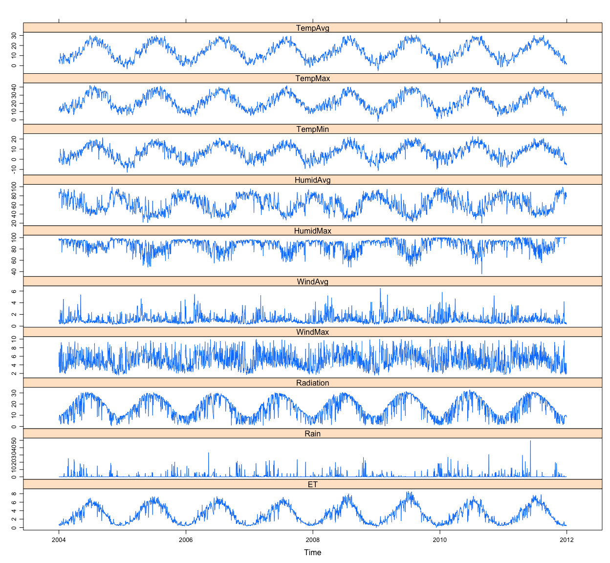 

```r
library(ggplot2)
autoplot(aranjuez)+facet_free()
```

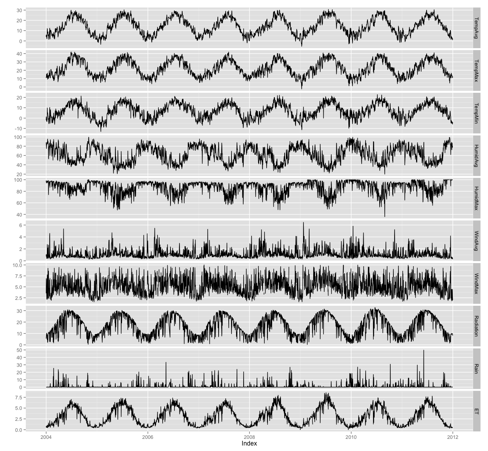 

### 3.11 Annotations to Enhance the Time Graph

<a href="http://blog.naver.com/jhheo0903/220185503471">POSIXct</a>

```r
library(grid)
library(latticeExtra)
```

```
## Loading required package: RColorBrewer
## 
## Attaching package: 'latticeExtra'
## 
## The following object is masked from 'package:ggplot2':
## 
##     layer
```

```r
# Auxiliary function to extract the year value of a POSIXct time index
Year <- function(x)format(x, "%Y")

xyplot(aranjuez, layout=c(1, ncol(aranjuez)), strip=FALSE,
       scales = list(y = list(cex=0.6, rot=0)),
       panel=function(x, y, ...)  {
         # Alternation of years
         panel.xblocks (x, Year,
                        col = c("lightgray", "white"),
                        border = "darkgray")
         # Values under the average highlighted with red regions
         panel.xblocks(x, y<mean(y, na.rm=TRUE),
                       col = "indianred1",
                       height = unit(0.1, 'npc'))
         # Time series
         panel.lines(x, y, col = 'royalblue4', lwd = 0.5, ...)
         # Label of each time series
         panel.text(x[1], min(y, na.rm=TRUE),
                    names(aranjuez)[panel.number()],
                    cex = 0.6, adj=c(0, 0), srt=90, ...)
         # Triangles to point the maxima and minima
         idxMax <- which.max(y)
         panel.points(x[idxMax], y[idxMax],
                      col = 'black', fill='lightblue', pch=24)
         idxMin <- which.min(y)
         panel.points(x[idxMin], y[idxMin],
                      col = 'black', fill = 'lightblue', pch=25)
       })
```

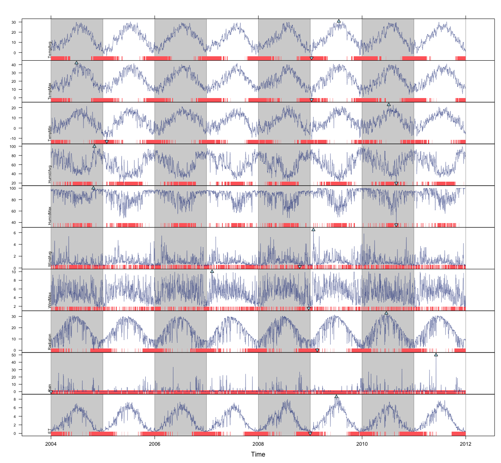 

```r
# In ggplot2, there is no equivalent 'panel.xblocks' function
# So, transform the zoo object into a data.frame in long format.
timeIdx <- index(aranjuez)
head(timeIdx)
```

```
## [1] "2004-01-01" "2004-01-02" "2004-01-03" "2004-01-04" "2004-01-05"
## [6] "2004-01-06"
```

```r
# fortify returns a data.frame with three columns : Undex, Series, Values
long <- fortify(aranjuez, melt=TRUE)

head(long)
```

```
##        Index  Series Value
## 1 2004-01-01 TempAvg  4.04
## 2 2004-01-02 TempAvg  5.78
## 3 2004-01-03 TempAvg  5.85
## 4 2004-01-04 TempAvg  4.41
## 5 2004-01-05 TempAvg  3.08
## 6 2004-01-06 TempAvg  2.30
```

```r
head(aranjuez)
```

```
##            TempAvg TempMax TempMin HumidAvg HumidMax WindAvg WindMax
## 2004-01-01    4.04   10.71   -1.97     88.3     95.9    0.75    3.53
## 2004-01-02    5.78   11.52    1.25     83.3     98.5    1.08    6.88
## 2004-01-03    5.85   13.32    0.38     75.0     94.4    0.98    6.58
## 2004-01-04    4.41   15.59   -2.58     82.0     97.0    0.63    3.70
## 2004-01-05    3.08   14.58   -2.97     83.2     97.0    0.39    2.24
## 2004-01-06    2.30   11.83   -3.38     84.5     96.5    0.44    2.14
##            Radiation Rain   ET
## 2004-01-01      5.49    0 0.54
## 2004-01-02      6.54    0 0.77
## 2004-01-03      8.81    0 0.84
## 2004-01-04      9.79    0 0.69
## 2004-01-05     10.30    0 0.52
## 2004-01-06      9.94    0 0.49
```

```r
# Values below mean are negative after being centered
scaled <- fortify(scale(aranjuez, scale=FALSE), melt=TRUE)
head(scaled)
```

```
##        Index  Series     Value
## 1 2004-01-01 TempAvg -10.36489
## 2 2004-01-02 TempAvg  -8.62489
## 3 2004-01-03 TempAvg  -8.55489
## 4 2004-01-04 TempAvg  -9.99489
## 5 2004-01-05 TempAvg -11.32489
## 6 2004-01-06 TempAvg -12.10489
```

```r
# The 'scaled' column is the result of the centering.
# The new 'Value' column store the original values.
scaled <- transform(scaled, scaled=Value, Value=long$Value)
head(scaled)
```

```
##        Index  Series Value    scaled
## 1 2004-01-01 TempAvg  4.04 -10.36489
## 2 2004-01-02 TempAvg  5.78  -8.62489
## 3 2004-01-03 TempAvg  5.85  -8.55489
## 4 2004-01-04 TempAvg  4.41  -9.99489
## 5 2004-01-05 TempAvg  3.08 -11.32489
## 6 2004-01-06 TempAvg  2.30 -12.10489
```

```r
str(scaled)
```

```
## 'data.frame':	28980 obs. of  4 variables:
##  $ Index : Date, format: "2004-01-01" "2004-01-02" ...
##  $ Series: Factor w/ 10 levels "TempAvg","TempMax",..: 1 1 1 1 1 1 1 1 1 1 ...
##  $ Value : num  4.04 5.78 5.85 4.41 3.08 ...
##  $ scaled: num  -10.36 -8.62 -8.55 -9.99 -11.32 ...
```

```r
underIdx <- which(scaled$scaled <= 0)
# 'under' is the subset of values below the average
under <- scaled[underIdx, ]
head(under)
```

```
##        Index  Series Value    scaled
## 1 2004-01-01 TempAvg  4.04 -10.36489
## 2 2004-01-02 TempAvg  5.78  -8.62489
## 3 2004-01-03 TempAvg  5.85  -8.55489
## 4 2004-01-04 TempAvg  4.41  -9.99489
## 5 2004-01-05 TempAvg  3.08 -11.32489
## 6 2004-01-06 TempAvg  2.30 -12.10489
```

```r
str(under)
```

```
## 'data.frame':	15846 obs. of  4 variables:
##  $ Index : Date, format: "2004-01-01" "2004-01-02" ...
##  $ Series: Factor w/ 10 levels "TempAvg","TempMax",..: 1 1 1 1 1 1 1 1 1 1 ...
##  $ Value : num  4.04 5.78 5.85 4.41 3.08 ...
##  $ scaled: num  -10.36 -8.62 -8.55 -9.99 -11.32 ...
```

```r
# Years bands are defined with the function endpoints from xts

library(xts)
ep <- endpoints(timeIdx, on = 'years')
ep
```

```
## [1]    0  366  727 1077 1440 1806 2171 2533 2898
```

```r
N <- length(ep[-1])
N
```

```
## [1] 8
```

```r
# 'tsp' is start and 'tep' is the end of each band
tep <- timeIdx[ep]
tsp <- timeIdx[ep[-(N+1)]+1]
tep
```

```
## [1] "2004-12-31" "2005-12-31" "2006-12-31" "2007-12-31" "2008-12-31"
## [6] "2009-12-31" "2010-12-31" "2011-12-31"
```

```r
tsp
```

```
## [1] "2004-01-01" "2005-01-01" "2006-01-01" "2007-01-01" "2008-01-01"
## [6] "2009-01-01" "2010-01-01" "2011-01-01"
```

```r
# 'cols' is a vector with the color of each band
cols <- rep_len(c('gray', 'white'), N)


minIdx <- timeIdx[apply(aranjuez, 2, which.min)]
minVals <- apply(aranjuez, 2, min, na.rm = TRUE)
mins <- data.frame(Index=minIdx,
                   Value = minVals,
                   Series = names(aranjuez))

maxIdx <- timeIdx [apply(aranjuez, 2, which.max)]
maxVals <- apply(aranjuez, 2, max, na.rm=TRUE)
maxs <- data.frame(Index = maxIdx,
                   Value = maxVals,
                   Series = names(aranjuez))


ggplot(data=long, aes(Index, Value)) +
  # Time series of each variable
  geom_line (colour = "royalblue4", lwd = 0.5)  +
  # Year bands
  annotate(geom = 'rect', ymin = -Inf, ymax = Inf,
           xmin = tsp, xmax = tep,
           fill = cols, alpha = 0.4) +
  # Values below average
  geom_rug (data=under,
            sides = 'b', col = 'indianred1') +
  # Minima
  geom_point (data = mins, pch = 25) +
  # Maxima
  geom_point (data = maxs, pch = 24) +
  # Axis labels and theme definition
  labs (x = 'Time', y=NULL) +
  theme_bw() +
  # Each series is displayed in a different panel with an independent y scale
  facet_free()
```

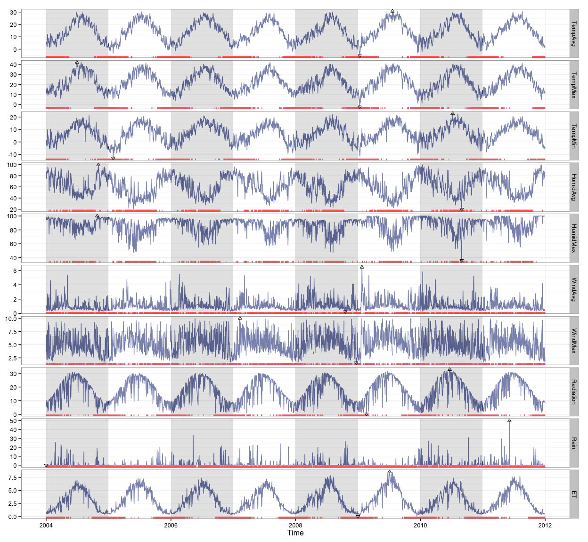 

 - 방사능, 기온, evotranspiration은 외견상 비슷해 보임. 여름엔 높고, 겨울엔 낮다. 여름 값들이 평균보다 높다.
 - 평균 습도는 기온과 방사능에 반대형태, 최대값은 겨울
 - 평균과 최대풍속, 그리고 강우량은 형태가 불규칙하다.
 - 강우량은 매년 다르다. 
 - 태양 방사능의 변동은 기온의 변동값보다 크게 나타난다. 여름동안 평균이하의 방사능을 가진 날이 거의 없는 반면에, 평균값 이하의 온도를 가진 날이 거의 없다.


## 3.2 Time Series of Variables with the Same Scale

- 다른 지역에서 모은 방사능 정보


```r
load("navarra.RData")
head(navarra)
```

```
##             Arzr   Adó  Lmbr  Ancn  Artj  Aibr  SMdU  MrdA  Lern  Brgt
## 2011-01-01 7.200 7.400 5.702 8.290 7.350 6.470 7.210 6.307 7.050 6.307
## 2011-01-02 7.610 4.711 4.382 6.258 5.744 4.514 7.200 7.470 7.410 7.470
## 2011-01-03 6.957 5.697 8.470 7.810 6.223 7.930 7.640 6.021 5.873 6.021
## 2011-01-04 4.257 3.835 5.000 3.720 3.861 4.699 3.789 0.125 3.638 0.125
## 2011-01-05 3.123 1.446 2.711 1.261 1.982 1.632 2.506 2.079 1.320 2.079
## 2011-01-06 5.747 5.441 5.202 5.392 5.017 3.852 4.883 4.836 4.617 4.836
##             Olit  Flcs  Mrdf  Trbn  Srtg  BR.P  Funs  BR.B  Cdrt  Crll
## 2011-01-01 7.200 6.443 7.690 6.906 6.627 6.505 7.131 6.371 6.559 7.110
## 2011-01-02 7.610 7.750 5.643 6.497 7.510 8.780 6.490 8.140 6.363 7.490
## 2011-01-03 6.957 5.799 8.480 6.361 6.941 6.691 6.334 5.768 6.044 8.820
## 2011-01-04 4.257 3.697 4.211 4.333 4.473 4.438 4.078 4.119 4.215 4.608
## 2011-01-05 3.123 2.680 2.781 3.336 1.474 3.147 2.348 3.278 3.327 3.106
## 2011-01-06 5.747 4.969 4.688 4.897 3.953 4.337 4.255 5.427 4.788 3.304
##             Tudl  Fitr  Cscn  Ablt  LsAr  Sesm
## 2011-01-01 6.222 5.802 6.760 6.663 6.702 6.070
## 2011-01-02 8.600 4.340 6.025 6.520 5.110 4.813
## 2011-01-03 7.410 8.510 9.090 8.940 7.330 6.021
## 2011-01-04 4.844 4.886 5.545 6.178 3.452 1.245
## 2011-01-05 2.634 2.802 2.594 2.448 1.032 0.892
## 2011-01-06 2.674 4.823 3.467 3.071 4.421 3.243
```

```r
avRad <- zoo(rowMeans(navarra, na.rm=1), index(navarra))
head(avRad)
```

```
## 2011-01-01 2011-01-02 2011-01-03 2011-01-04 2011-01-05 2011-01-06 
##   6.771038   6.555769   7.082231   3.908769   2.351577   4.534115
```

```r
head(navarra - avRad)
```

```
##                  Arzr         Adó       Lmbr       Ancn        Artj
## 2011-01-01  0.4289615  0.62896154 -1.0690385  1.5189615  0.57896154
## 2011-01-02  1.0542308 -1.84476923 -2.1737692 -0.2977692 -0.81176923
## 2011-01-03 -0.1252308 -1.38523077  1.3877692  0.7277692 -0.85923077
## 2011-01-04  0.3482308 -0.07376923  1.0912308 -0.1887692 -0.04776923
## 2011-01-05  0.7714231 -0.90557692  0.3594231 -1.0905769 -0.36957692
## 2011-01-06  1.2128846  0.90688462  0.6678846  0.8578846  0.48288462
##                  Aibr       SMdU       MrdA        Lern       Brgt
## 2011-01-01 -0.3010385  0.4389615 -0.4640385  0.27896154 -0.4640385
## 2011-01-02 -2.0417692  0.6442308  0.9142308  0.85423077  0.9142308
## 2011-01-03  0.8477692  0.5577692 -1.0612308 -1.20923077 -1.0612308
## 2011-01-04  0.7902308 -0.1197692 -3.7837692 -0.27076923 -3.7837692
## 2011-01-05 -0.7195769  0.1544231 -0.2725769 -1.03157692 -0.2725769
## 2011-01-06 -0.6821154  0.3488846  0.3018846  0.08288462  0.3018846
##                  Olit       Flcs       Mrdf        Trbn       Srtg
## 2011-01-01  0.4289615 -0.3280385  0.9189615  0.13496154 -0.1440385
## 2011-01-02  1.0542308  1.1942308 -0.9127692 -0.05876923  0.9542308
## 2011-01-03 -0.1252308 -1.2832308  1.3977692 -0.72123077 -0.1412308
## 2011-01-04  0.3482308 -0.2117692  0.3022308  0.42423077  0.5642308
## 2011-01-05  0.7714231  0.3284231  0.4294231  0.98442308 -0.8775769
## 2011-01-06  1.2128846  0.4348846  0.1538846  0.36288462 -0.5811154
##                  BR.P         Funs       BR.B       Cdrt       Crll
## 2011-01-01 -0.2660385  0.359961538 -0.4000385 -0.2120385  0.3389615
## 2011-01-02  2.2242308 -0.065769231  1.5842308 -0.1927692  0.9342308
## 2011-01-03 -0.3912308 -0.748230769 -1.3142308 -1.0382308  1.7377692
## 2011-01-04  0.5292308  0.169230769  0.2102308  0.3062308  0.6992308
## 2011-01-05  0.7954231 -0.003576923  0.9264231  0.9754231  0.7544231
## 2011-01-06 -0.1971154 -0.279115385  0.8928846  0.2538846 -1.2301154
##                  Tudl       Fitr        Cscn        Ablt        LsAr
## 2011-01-01 -0.5490385 -0.9690385 -0.01103846 -0.10803846 -0.06903846
## 2011-01-02  2.0442308 -2.2157692 -0.53076923 -0.03576923 -1.44576923
## 2011-01-03  0.3277692  1.4277692  2.00776923  1.85776923  0.24776923
## 2011-01-04  0.9352308  0.9772308  1.63623077  2.26923077 -0.45676923
## 2011-01-05  0.2824231  0.4504231  0.24242308  0.09642308 -1.31957692
## 2011-01-06 -1.8601154  0.2888846 -1.06711538 -1.46311538 -0.11311538
##                  Sesm
## 2011-01-01 -0.7010385
## 2011-01-02 -1.7427692
## 2011-01-03 -1.0612308
## 2011-01-04 -2.6637692
## 2011-01-05 -1.4595769
## 2011-01-06 -1.2911154
```

```r
# the same panel (superpose = TRUE) without legend(auto.key=TRUE)
# Transparency soften overplotting problems and reveals density cluster (overlapping lines and darker)
pNavarra <- xyplot(navarra - avRad,
                   superpose = TRUE, auto.key=FALSE,
                   lwd = 0.5, alpha=0.3, col='midnightblue')
pNavarra
```

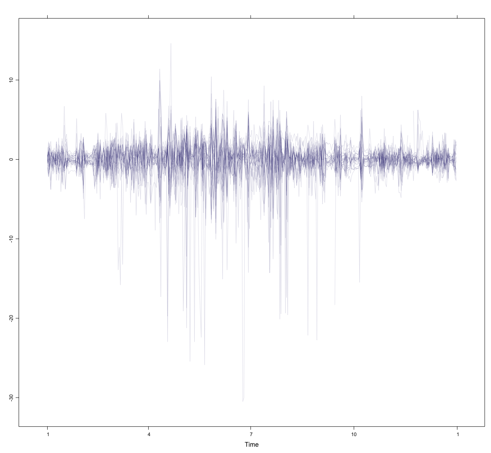 

### 3.2.1 Aspect Ratio and Rate of Change

- Cleveland analyzed the importance of aspect ratio for judging rate of change.
- 선의 방향을 비교함으로써 두개의 변수의 변화비율에 대한 정보를 얻을 수 있다.
- 방향의 절대값을 45도에 중심을 맞추기 위해 aspect ratio를 선택함.


```r
xyplot(navarra - avRad,
       aspect = 'xy', cut = list(n=3, overlap = 0.1),
       strip = FALSE,
       superpose = TRUE, auto.key = FALSE,
       lwd=0.5, alpha=0.3, col = 'midnightblue')
```

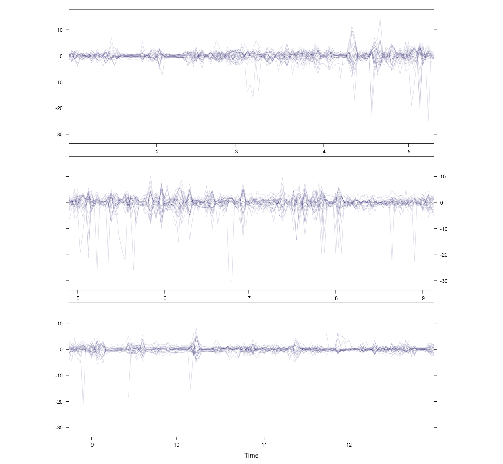 

### 3.2.2 The Horizon Graph
- 시간에 따른 많은 양의 변화 탐색에 유용. 특이한 패턴을 찾기 쉽다.
- Positive와 Negative값을 값은 줄에 놓는다. Negative값을 뒤집는다. (Positive는 blue, Negative는 red)
- 규모의 차이는 색으로 구분한다. (더 큰 차이는 더 어두운 색으로)
- color묶음은 겹쳐 그려진다. (밝은 색 위에 어두운 색으로)


```r
horizonplot(navarra - avRad,
            layout = c(1, ncol(navarra)),
            origin = 0 , colorkey = TRUE)
```

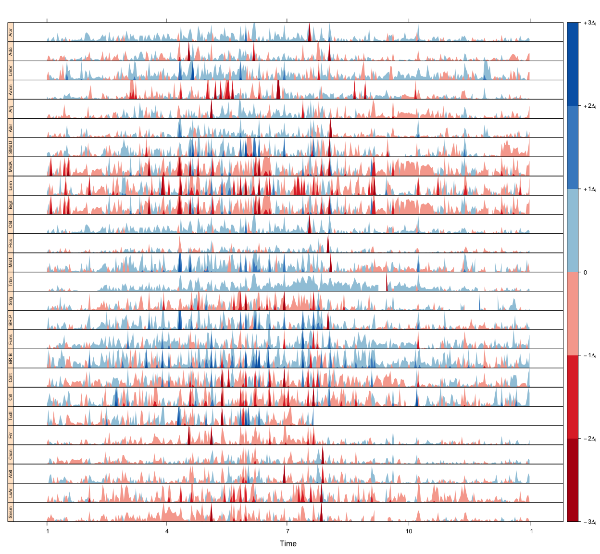 

### 그래프로 알수 있는 것
- 어떤 역이 평균보다 높거나 낮게 측정되는가?
- 어떤 역이 평균 time series에 좀 더 가까운가?
- 어떤 역이 변덕스러운가? 아니면 꾸준한가?
- 각자의 역에서, 특이하게 측정된 날이 있는가?
- 1년 중에 급격한 변동을 보이는 때가 있는가?

### 3.2.3 Time Graph of the Differences between a Time Series and a Reference

- 일변량 time series와 참조값의 차이를 보고자 할 때도 유용


```r
Ta <- aranjuez$TempAvg
head(Ta)
```

```
## 2004-01-01 2004-01-02 2004-01-03 2004-01-04 2004-01-05 2004-01-06 
##       4.04       5.78       5.85       4.41       3.08       2.30
```

```r
# Reference is the long-term daily average calculated with ave
timeIndex <- index(aranjuez)
longTa <- ave(Ta, format(timeIndex, '%j'))
head(longTa)
```

```
## 2004-01-01 2004-01-02 2004-01-03 2004-01-04 2004-01-05 2004-01-06 
##    5.28500    5.84875    4.57875    4.67000    4.43375    5.35875
```

```r
diffTa <- (Ta - longTa)

xyplot(cbind(Ta, longTa, diffTa),
       col = c('darkgray', 'red', 'midnightblue'),
       superpose = TRUE, auto.key = list(space='right'),
       screens = c(rep('Average_Temperature', 2), 'Differences'))
```

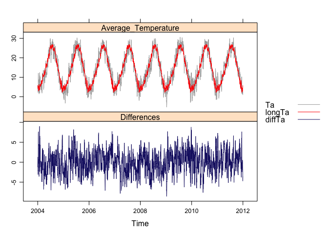 
- The horizon graph is better suited for displaying the differences


```r
years <- unique(format(timeIndex, '%Y'))

horizonplot(diffTa, cut=list(n=8, overlap=0),
            colorkey=TRUE, layout=c(1,8),
            scales = list(draw=FALSE, y=list(relation='same')),
            origin=0, strip.left=FALSE) +
  layer(grid.text(years[panel.number()], x =0, y=0.1,
                  gp = gpar(cex=0.8),
                  just="left"))
```

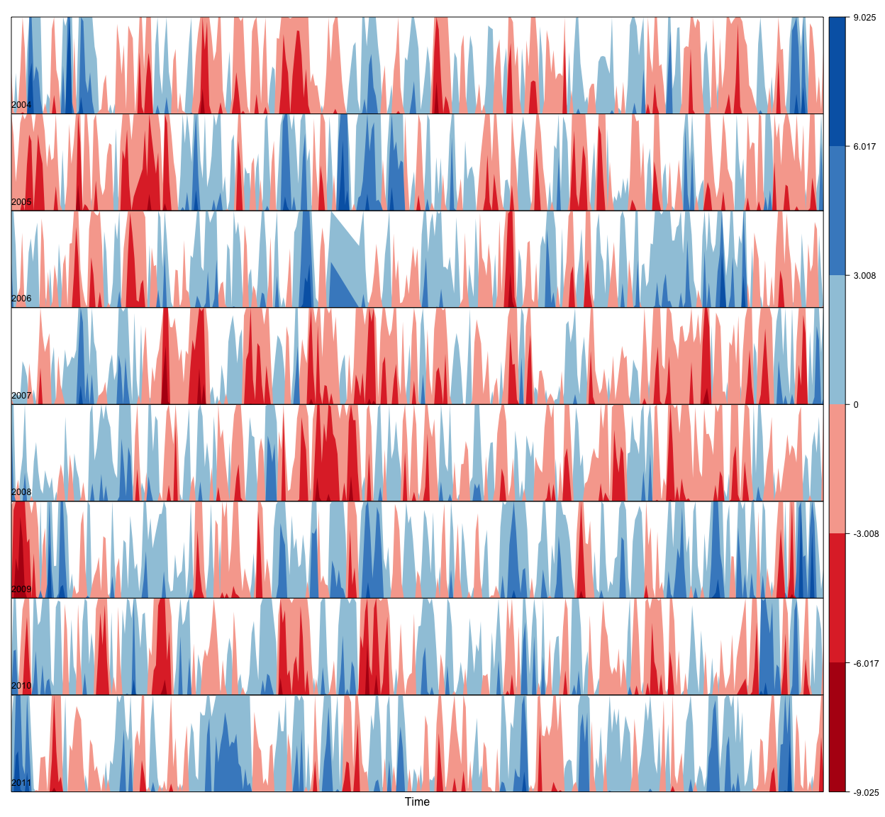 

- 2005, 2009년은 평균이하에서 시작하고 2004년은 평균이상에서 시작
- 2007년은 평균이하가 많고, 2011년은 반대로 보인다(?)


```r
year <- function(x)as.numeric(format(x, '%Y'))
day <- function(x)as.numeric(format(x, '%d'))
month <- function(x)as.numeric(format(x, '%m'))


myTheme <- modifyList(custom.theme(region=brewer.pal(9, 'RdBu')),
                      list(
                        strip.background=list(col='gray'),
                        panel.background=list(col='gray')))

maxZ <- max(abs(diffTa))

levelplot(diffTa ~ day(timeIndex) * year(timeIndex) | factor(month(timeIndex)),
          at = pretty(c(-maxZ, maxZ), n=8),
          colorkey = list(height=0.3),
          layout = c(1,12), strip = FALSE, strip.left=TRUE,
          xlab = 'Day', ylab='Month',
          par.settings = myTheme)
```

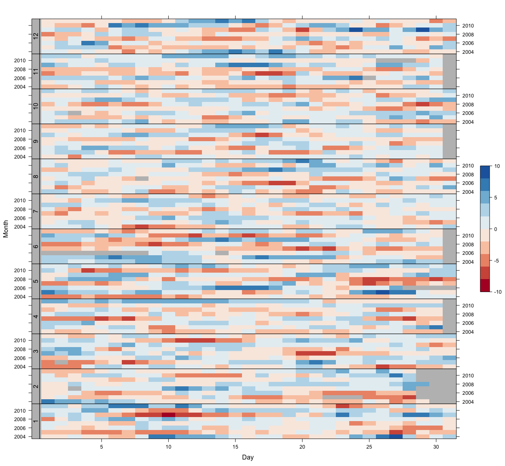 

- 이전 그래프는 매년의 변화를 볼 수 있다면, 이 그래프는 특정달의 매년 변화를 볼 수 있다. 내용은 같다.
- each cell = a certain day

### 3.2.4 Interaction with gridSVG

- gridSVG package convert grid-based R graphics to an SVG format
- provides several functions to add dynamic and interactive capabilities to R graphics
- In this section, we will use grid.script. a function to add JavaScript code to a plot.


```r
library(gridSVG)
```

```
## 
## Attaching package: 'gridSVG'
## 
## The following object is masked from 'package:grDevices':
## 
##     dev.off
```

```r
# grid.ls function returns a listing of names of grobs in the graphical output :  only the lines will be connected with the JavaScript code.
pNavarra
grobs <- grid.ls(print=FALSE)
# only interested in some of them
nms <- grobs$name[grobs$type == "grobListing"]
idxNames <- grep('lines', nms)
IDs <- nms[idxNames]

for(id in unique(IDs)) {
  # extract information from the data according to the ID value
  i <- strsplit(id, '\\.')
  i <- sapply(i, function(x)as.numeric(x[5]))
  # Information to be attached to each line : annual mean of daily
  # radiation and abbreviated name of the station
  dat <- round(mean(navarra[,i], na.rm=TRUE), 2)
  info <- paste(names(navarra)[i], paste(dat, collapse=','),
                sep = ':_')
  # attach SVG attributes
  grid.garnish(id,
               onmouseover = "highlight(evt)",
               onmouseout="hide(evt)",
               title=info)
  # add a script file named highlight.js
  grid.script(filename="highlight.js")
  
  
  # highlight.js
  # highligh = function(evt)  {',
  #    evt.target.setAttribute('opacity', '1');
  #    evt.target.setAttribute('stroke', 'red');
  #    evt.target.setAttribute('stroke-width', '1');
  #}
  
  # hide = function(evt)  {',
  #    evt.target.setAttribute('opacity', '0.3');
  #    evt.target.setAttribute('stroke', 'green');
  #    evt.target.setAttribute('stroke-width', '0.3');
  #}
  
  
  
  # Finnally, gridToSVG exports the whole scene to SVG
    # grid.export('figs/navarraRadiation.svg')
}
```

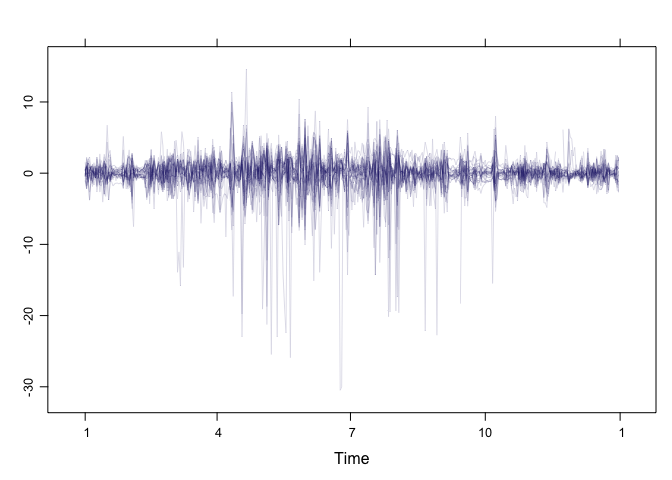 

## 3.3 Stacked Graphs

# as example, the information on unemployment in the US provides data of unemployed persons by industry and class of workers.


```r
load("unemployUSA.RData")
xyplot(unemployUSA, superpose=TRUE, par.settings = custom.theme, auto.key=list(space='right'))
```

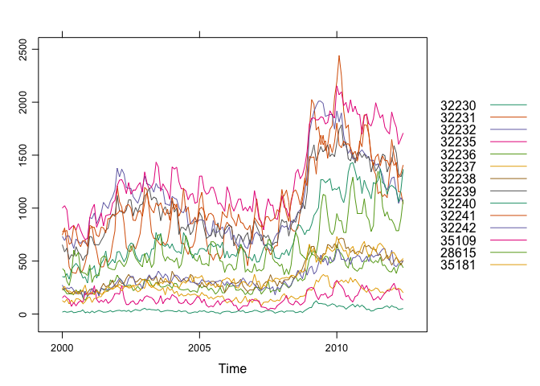 

- This graph is not useful.


```r
library(scales)
# A traditional stacked graph is easily obtained with geom_area
autoplot(unemployUSA, facets=NULL, geom='area') +
  geom_area(aes(fill=Series)) + scale_x_yearmon()
```

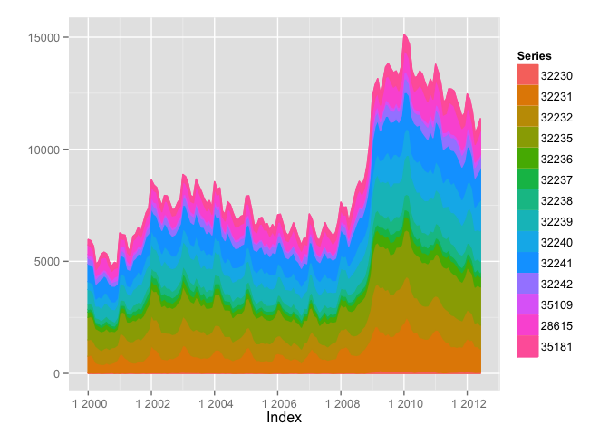 

- 전통적인 stacked graph는 높이는 알기 쉬우나 각각의 layer를 구분하기 어려움
- streamgraph provides an innovative layout method in which layers are aymmetrical around the x-axis at their center.


```r
library(colorspace)
# We will use a qualitative pallette from colorspace
nCols <- ncol(unemployUSA)
pal <- rainbow_hcl(nCols, c=70, l=75, start=30, end=300)
myTheme <- custom.theme(fill=pal, lwd=0.2)

sep2008 <- as.numeric(as.yearmon('2008-09'))


panel.flow <- function(x,y, groups, origin, ...) {
  # create data.frame with coordinates and with the group factor.
  dat <- data.frame(x=x, y=y, groups=groups)
  nVars <- nlevels(groups)
  groupLevels <- levels(groups)
  
  # From long to wide
  yWide <- unstack(dat, y ~ groups)
  # Where are the maxima of each variable located? We will use them to position labels
  idxMaxes <- apply(yWide, 2, which.max)
  #Origin calculated following Havr.eHetzler.ea2002
  # The origin of this sum is defined with the corresponding origin : with themeRiver, the polygons are arranged in a symmetric way.
  if(origin == 'themeRiver') origin = -1/2*rowSums(yWide)
  else origin = 0
  yWide <- cbind(origin=origin, yWide)
  # Cumulative sums to define the polygon
  yCumSum <- t(apply(yWide, 1, cumsum))
  #Each column of this matrix of cumulative sums defines the y coordinate of each variable(where origin is now the first variable)
  Y <- as.data.frame(sapply(seq_len(nVars),
                            function(iCol)c(yCumSum[, iCol+1],
                                            rev(yCumSum[, iCol]))))
  # to get closed polygon, the coordinates of the inferior limit are in reverse order.
  names(Y) <- levels (groups)
  #Back to long format, since xyplot works that way
  y <- stack(Y)$values
  
  #Similar but easier for x
  xWide <- unstack(dat, x ~ groups)
  x <- rep(c(xWide[,1], rev(xWide[,1])), nVars)
  #Groups repeated twice (upper and lower limits of the polygon)
  groups <- rep(groups, each=2)
  
  # Graphical parameters
  # The information retrieved with trellis.par.get is transferred to the corresponding argument of panel.polygon.
  superpose.polygon <- trellis.par.get("superpose.polygon")
  col = superpose.polygon$col
  border = superpose.polygon$border
  lwd = superpose.polygon$lwd
  
  #Draw polygons
  # With a for loop, the coordinates of the corresponding group are extracted from the x and y vectors, and a polygon is displayed with panel.polygon.
  for (i in seq_len(nVars))  {
    xi <- x [groups == groupLevels[i]]
    yi <- y [groups == groupLevels[i]]
    panel.polygon(xi, yi, border=border,
                  lwd=lwd, col=col[i])
  }
  
  #Print labels
  for (i in seq_len(nVars))  {
    xi <- x[groups == groupLevels[i]]
    yi <- y[groups == groupLevels[i]]
    N <- length(xi)/2
    #Height available for the label
    h <- unit(yi[idxMaxes[i]], 'native') -
      unit(yi[idxMaxes[i] + 2*(N-idxMaxes[i]) +1], 'native')
    # ... converted to "char" units
    hChar <- convertHeight(h, 'char', TRUE)
    #If there is enough space and we are not at the first or last variable, then the label is printed inside the polygon.
    if ((hChar >= 1) && !(i %in% c(1, nVars)))   {
      grid.text(groupLevels[i],
                xi[idxMaxes[i]],
                (yi[idxMaxes[i]] +
                   yi[idxMaxes[i] + 2*(N - idxMaxes[i]) +1])/2,
                gp = gpar(col='white', alpha=0.7, cex=0.7),
                default.units = 'native')
    } else  {
      # Elsewhere, the label is printed outside
      
      grid.text(groupLevels[i],
                xi[N],
                (yi[N] + yi[N+1])/2,
                gp=gpar(col=col[i], cex=0.7),
                just='left', default.units = 'native')
    }
  }
}


# the problem is that  lattice makes a preliminary estimate of window size using a default prepanel function that is unaware of the internal calculations of our new panel.flow function
prepanel.flow <- function(x,y,groups, origin,...)   {
  dat <- data.frame(x=x, y=y, groups=groups)
  nVars <- nlevels(groups)
  groupLevels <- levels(groups)
  yWide <- unstack(dat, y ~ groups)
  if ( origin == 'themeRiver') origin = -1/2*rowSums(yWide)
  else origin = 0
  yWide <- cbind(origin = origin, yWide)
  yCumSum <- t(apply(yWide, 1, cumsum))
  
  list(xlim=range(x),
       ylim = c(min(yCumSum[,1]), max(yCumSum[,nVars+1])),
                dx = diff(x),
                dy=diff(c(yCumSum[,01])))
}


xyplot(unemployUSA, superpose=TRUE, auto.key=FALSE,
       panel=panel.flow, prepanel=prepanel.flow,
       origin = 'themeRiver', scales = list(y=list(draw=FALSE)),
       par.settings = myTheme) +
  layer(panel.abline( v = sep2008, col = 'gray', lwd = 0.7))
```

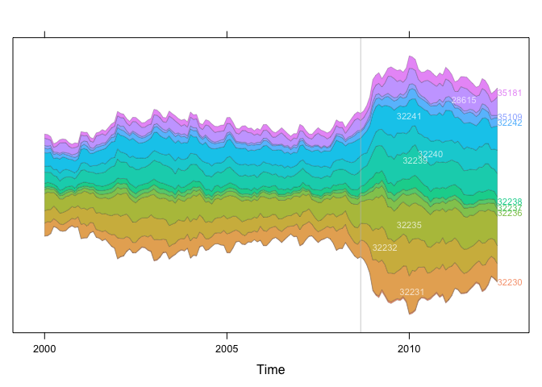 
- vertical line indicates one of main milestones of financial crisis, whose effent on the overall unemployment results is clearly evident.


### 그래프로 알 수 있는 것
- 이 기간동안 가장 낮거나 높은 고용인을 가진 산업은 무엇인가?
- 가장 낮거나 높은 고용인을 가진 산업이 금융위기때문에 증가하는 것은 무엇입니까?
- 전체 고용인 수의 수많은 최대와 최소값이 있습니다. 모든 classes에 최대와 최소가 있나요? 모든 classes가 global evolution과 같은 변동을 보이나요?

### 3.3.1 Panel and Prepanel Functions to Implement the ThemeRiver with xyplot


```r
xyplot(unemployUSA, superpose=TRUE, auto.key=FALSE,
       panel=panel.flow, origin='themeRiver',
       par.settings = myTheme, cex=0.4, offset=0,
       scales = list(y=list(draw=FALSE)))
```

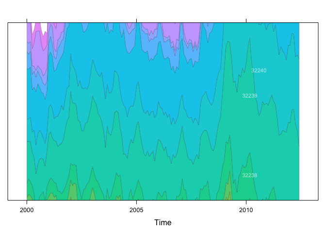 
- The graphical window is not large enough, and part of polygons fall out of it. Why?
