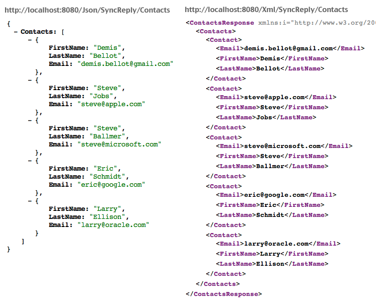

  
  
#네이버 지도를 통한 json 파싱 및 ggamp을 이용한 공간데이터 시각화 실습 (feat. Fiddler)  
　    
　    
　    
　    

## 실습에 앞서..　    
　    
　    
　  
　  
　  

###1. Fiddler란?  
  
   

클라이언트(컴퓨터)에서 서버로 요청한 내역과 결과의 모든 데이터를 확인 가능한 웹 디버깅 툴   

####다운로드
- http://www.telerik.com/fiddler
  
####단축키  
- Ctrl + a : 항목 전체 선택  
- F12 : 캡쳐 끄기
  
   
###2. JSON 이란?
　  　  
JavaScript Object Notation의 약어로 기계가 분석하고 생성하기에 용이한 데이터 표현방식. 언어로부터 독립적이기 때문에 C, C++, JS, PyThon등 다양한 언어에서 사용가능.  
　  　  

####기본 문법:  
- 데이터는 이름/ 값 쌍으로 표현.
- 중괄호는 개체를 유지하고 각각의 이름이 계속되고 있는 ':'(콜론), 이름 /값 쌍은 쉼표','로 구분.  
- 대괄호는 배열과 값은 쉼표로 구분.  
  
 

####참고
- http://www.json.org/json-ko.html
　  　  
　  　  
####왜 JSON?
   
  
-> Xml보다 단순하다.  
　  　  
　  　  
  
####JSON in R
- Package ‘rjson’
- fromJSON(file=URLencode("http://~~url~~"))
　   
　  　  
　  　  
　  　  
　  　  
　   
　  　  　   
　   


## 이제 실습!!!  
　   
　   
　   

###step 1. 파싱받을 json 데이터(데이터가 있는 url)를 찾자! (feat. Fiddler)  
```{r}
# "건대입구역 치킨집" 검색어에 대한 json 데이터 url
test_url <- "http://map.naver.com/search2/local.nhn?sm=hty&searchCoord=128.2291753%3B37.1499569&isFirstSearch=true&query=%EA%B1%B4%EB%8C%80%EC%9E%85%EA%B5%AC%EC%97%AD+%EC%B9%98%ED%82%A8&menu=location&mpx=16150116%3A37.1499569%2C128.2291753%3AZ11%3A0.0340156%2C0.0156052%20HTTP/1.1"
```
　   
　   

###step 2. rjson 패키지를 이용해 데이터를 파싱하자!
```{r}
library(rjson)
test_json <- fromJSON(file=test_url)
#json <- fromJSON(file=URLencode(url)) 
```
　   
　   

###step 3. 파싱받은 데이터를 가공하자!
```{r}

x_temp <- c()
y_temp <- c()
name_temp <- c()

for(j in 1:10){
  x_temp <- c(x_temp, test_json$result$site$list[j][[1]]$x)
  y_temp <- c(y_temp, test_json$result$site$list[j][[1]]$y)
  name_temp <- c(name_temp, test_json$result$site$list[j][[1]]$name)
}

data_parse <- data.frame(Index=1:length(x_temp),NAME=name_temp ,LON=as.numeric(x_temp), LAT=as.numeric(y_temp))

```
　   
　   

###step 4. 가공한 공간데이터를 시각화하자! 
```{r}
library(ggmap)
#A package for spatial visualization with Google Maps and OpenStreetMap
library(ggplot2)

mapData <- get_map(c(mean(data_parse$LON),mean(data_parse$LAT)), zoom=15, maptype="roadmap")
baseMap <- ggmap(mapData)
resMap <- baseMap+geom_point(data=data_parse, aes(x=LON, y=LAT),size=5)+geom_text(data=data_parse, aes(x=LON,y=LAT+0.001, label=NAME), size=5)
resMap
```


