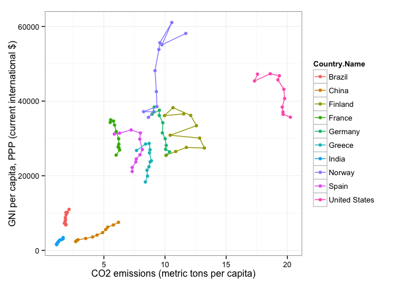
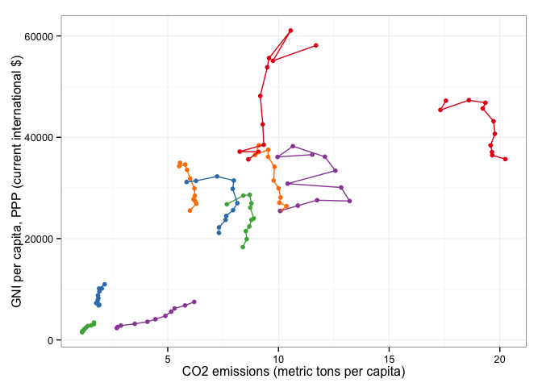
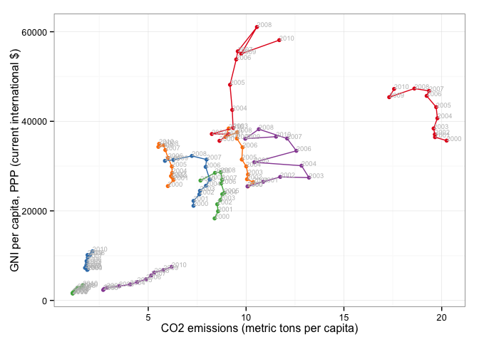
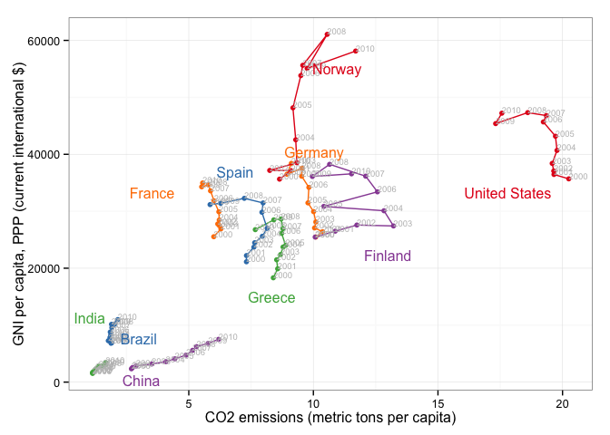
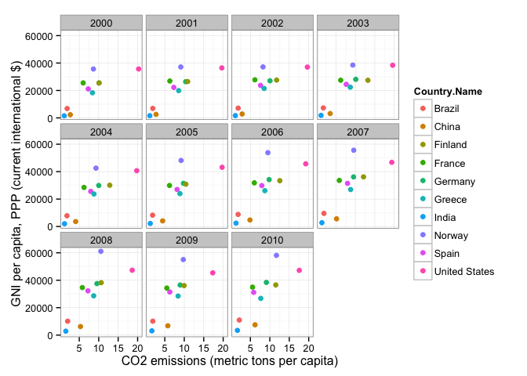
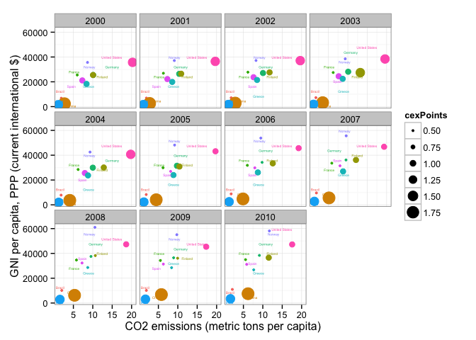
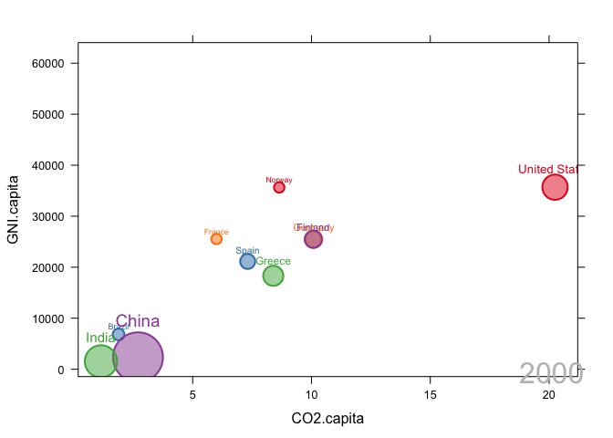

# Ch05
## 1. Trendanalyzer
### - vertical and horizontal axes
### - bubble size
### - color
### - time variable

-----

### 1.1. Polylines


```r
library(lattice)
library(ggplot2)
library(latticeExtra)
```

```
## Loading required package: RColorBrewer
## 
## Attaching package: 'latticeExtra'
## 
## The following object is masked from 'package:ggplot2':
## 
##     layer
```

```r
library(zoo)
```

```
## 
## Attaching package: 'zoo'
## 
## The following objects are masked from 'package:base':
## 
##     as.Date, as.Date.numeric
```

```r
setwd("~/Enjoy_IT//visual/part3/ch5/docs/")
load("CO2.Rdata")

str(CO2data)
```

```
## 'data.frame':	110 obs. of  7 variables:
##  $ iso2c       : chr  "BR" "BR" "BR" "BR" ...
##  $ Country.Name: Factor w/ 10 levels "Brazil","China",..: 1 1 1 1 1 1 1 1 1 1 ...
##  $ Year        : num  2000 2001 2002 2003 2004 ...
##  $ CO2.capita  : num  1.88 1.91 1.85 1.77 1.84 ...
##  $ CO2.PPP     : num  0.268 0.266 0.251 0.235 0.228 ...
##  $ GNI.PPP     : num  1.19e+12 1.22e+12 1.28e+12 1.32e+12 1.44e+12 ...
##  $ GNI.capita  : num  6820 6920 7120 7270 7830 ...
```

```r
head(CO2data)
```

```
##   iso2c Country.Name Year CO2.capita   CO2.PPP      GNI.PPP GNI.capita
## 1    BR       Brazil 2000   1.879511 0.2679876 1.190061e+12       6820
## 2    BR       Brazil 2001   1.906747 0.2660979 1.223768e+12       6920
## 3    BR       Brazil 2002   1.852165 0.2511656 1.276406e+12       7120
## 4    BR       Brazil 2003   1.769553 0.2354036 1.321938e+12       7270
## 5    BR       Brazil 2004   1.835908 0.2275031 1.440201e+12       7830
## 6    BR       Brazil 2005   1.865824 0.2194487 1.537251e+12       8260
```

```r
summary(CO2data)
```

```
##     iso2c            Country.Name      Year        CO2.capita    
##  Length:110         Brazil :11    Min.   :2000   Min.   : 1.136  
##  Class :character   China  :11    1st Qu.:2002   1st Qu.: 4.554  
##  Mode  :character   Finland:11    Median :2005   Median : 8.063  
##                     France :11    Mean   :2005   Mean   : 7.940  
##                     Germany:11    3rd Qu.:2008   3rd Qu.: 9.996  
##                     Greece :11    Max.   :2010   Max.   :20.249  
##                     (Other):44                                   
##     CO2.PPP          GNI.PPP            GNI.capita   
##  Min.   :0.1621   Min.   :1.319e+11   Min.   : 1530  
##  1st Qu.:0.2358   1st Qu.:2.912e+11   1st Qu.: 8395  
##  Median :0.3219   Median :1.712e+12   Median :27245  
##  Mean   :0.3999   Mean   :2.904e+12   Mean   :25070  
##  3rd Qu.:0.4747   3rd Qu.:2.986e+12   3rd Qu.:36005  
##  Max.   :1.1396   Max.   :1.461e+13   Max.   :61060  
## 
```

```r
## ggplot2 version
ggplot(data=CO2data, aes(x=CO2.capita, y=GNI.capita,
                         color=Country.Name)) +
  xlab("CO2 emissions (metric tons per capita)") +
  ylab("GNI per capita, PPP (current international $)") +
  geom_point() + geom_path() + theme_bw()
```

 

-----

### 1.2. Choosing Colors 

### - http://colorbrewer2.org/

-----


```r
library(RColorBrewer)

nCountries <- nlevels(CO2data$Country.Name)
nCountries
```

```
## [1] 10
```

```r
pal <- brewer.pal(n=5, 'Set1')
pal
```

```
## [1] "#E41A1C" "#377EB8" "#4DAF4A" "#984EA3" "#FF7F00"
```

```r
pal <- rep(pal, length = nCountries)
pal
```

```
##  [1] "#E41A1C" "#377EB8" "#4DAF4A" "#984EA3" "#FF7F00" "#E41A1C" "#377EB8"
##  [8] "#4DAF4A" "#984EA3" "#FF7F00"
```

```r
## Rank of average values of CO2 per capita
CO2mean <- aggregate(CO2.capita ~ Country.Name, data=CO2data, FUN=mean)
CO2mean
```

```
##     Country.Name CO2.capita
## 1         Brazil   1.903521
## 2          China   4.335290
## 3        Finland  11.451397
## 4         France   5.986535
## 5        Germany   9.758406
## 6         Greece   8.556903
## 7          India   1.330193
## 8         Norway   9.533826
## 9          Spain   7.386923
## 10 United States  19.153664
```

```r
## FUN :  a function to compute the summary statistics which can be applied to all data subsets.

palOrdered <- pal[rank(CO2mean$CO2.capita)]
palOrdered
```

```
##  [1] "#377EB8" "#4DAF4A" "#984EA3" "#984EA3" "#4DAF4A" "#E41A1C" "#E41A1C"
##  [8] "#377EB8" "#FF7F00" "#FF7F00"
```

```r
CO2capita <- CO2data[, c('Country.Name', 'Year', 'CO2.capita')]
CO2capita
```

```
##      Country.Name Year CO2.capita
## 1          Brazil 2000   1.879511
## 2          Brazil 2001   1.906747
## 3          Brazil 2002   1.852165
## 4          Brazil 2003   1.769553
## 5          Brazil 2004   1.835908
## 6          Brazil 2005   1.865824
## 7          Brazil 2006   1.847979
## 8          Brazil 2007   1.911676
## 9          Brazil 2008   2.021610
## 10         Brazil 2009   1.897491
## 11         Brazil 2010   2.150268
## 13          China 2000   2.696862
## 14          China 2001   2.742121
## 15          China 2002   2.885225
## 16          China 2003   3.512245
## 17          China 2004   4.080139
## 18          China 2005   4.441151
## 19          China 2006   4.892727
## 20          China 2007   5.153564
## 21          China 2008   5.311152
## 22          China 2009   5.778143
## 23          China 2010   6.194858
## 25        Germany 2000  10.095640
## 26        Germany 2001  10.366287
## 27        Germany 2002  10.047114
## 28        Germany 2003  10.097713
## 29        Germany 2004  10.008893
## 30        Germany 2005   9.781848
## 31        Germany 2006   9.819063
## 32        Germany 2007   9.530208
## 33        Germany 2008   9.540352
## 34        Germany 2009   8.940512
## 35        Germany 2010   9.114842
## 37          Spain 2000   7.312740
## 38          Spain 2001   7.314011
## 39          Spain 2002   7.612887
## 40          Spain 2003   7.644348
## 41          Spain 2004   7.950693
## 42          Spain 2005   8.144637
## 43          Spain 2006   7.934392
## 44          Spain 2007   7.982286
## 45          Spain 2008   7.228195
## 46          Spain 2009   6.278502
## 47          Spain 2010   5.853466
## 49        Finland 2000  10.073216
## 50        Finland 2001  10.875875
## 51        Finland 2002  11.744332
## 52        Finland 2003  13.214670
## 53        Finland 2004  12.832675
## 54        Finland 2005  10.416438
## 55        Finland 2006  12.569942
## 56        Finland 2007  12.097789
## 57        Finland 2008  10.650962
## 58        Finland 2009   9.958629
## 59        Finland 2010  11.530840
## 61         France 2000   6.001530
## 62         France 2001   6.288363
## 63         France 2002   6.162137
## 64         France 2003   6.227113
## 65         France 2004   6.221525
## 66         France 2005   6.206003
## 67         France 2006   6.013737
## 68         France 2007   5.872005
## 69         France 2008   5.787745
## 70         France 2009   5.516347
## 71         France 2010   5.555374
## 73         Greece 2000   8.391709
## 74         Greece 2001   8.566748
## 75         Greece 2002   8.525095
## 76         Greece 2003   8.684893
## 77         Greece 2004   8.782540
## 78         Greece 2005   8.886493
## 79         Greece 2006   8.726363
## 80         Greece 2007   8.777660
## 81         Greece 2008   8.704198
## 82         Greece 2009   8.411236
## 83         Greece 2010   7.668999
## 85          India 2000   1.138546
## 86          India 2001   1.136236
## 87          India 2002   1.139393
## 88          India 2003   1.171996
## 89          India 2004   1.214202
## 90          India 2005   1.251950
## 91          India 2006   1.315822
## 92          India 2007   1.390226
## 93          India 2008   1.541966
## 94          India 2009   1.665574
## 95          India 2010   1.666209
## 97         Norway 2000   8.641315
## 98         Norway 2001   9.103826
## 99         Norway 2002   8.247633
## 100        Norway 2003   9.337692
## 101        Norway 2004   9.291459
## 102        Norway 2005   9.179217
## 103        Norway 2006   9.495836
## 104        Norway 2007   9.574850
## 105        Norway 2008  10.554461
## 106        Norway 2009   9.749351
## 107        Norway 2010  11.696445
## 109 United States 2000  20.249189
## 110 United States 2001  19.656193
## 111 United States 2002  19.646922
## 112 United States 2003  19.584657
## 113 United States 2004  19.776845
## 114 United States 2005  19.715961
## 115 United States 2006  19.229229
## 116 United States 2007  19.349577
## 117 United States 2008  18.602273
## 118 United States 2009  17.315297
## 119 United States 2010  17.564164
```

```r
CO2capita <- reshape(CO2capita, idvar='Country.Name', timevar='Year', direction='wide')
# timevar : the variable in long format that differentiates multiple records from the same group or individual. If more than one record matches, the first will be taken (with a warning).

# idvar	: Names of one or more variables in long format that identify multiple records from the same group/individual. These variables may also be present in wide format.

# direction : character string, either "wide" to reshape to wide format, or "long" to reshape to long format

CO2capita
```

```
##      Country.Name CO2.capita.2000 CO2.capita.2001 CO2.capita.2002
## 1          Brazil        1.879511        1.906747        1.852165
## 13          China        2.696862        2.742121        2.885225
## 25        Germany       10.095640       10.366287       10.047114
## 37          Spain        7.312740        7.314011        7.612887
## 49        Finland       10.073216       10.875875       11.744332
## 61         France        6.001530        6.288363        6.162137
## 73         Greece        8.391709        8.566748        8.525095
## 85          India        1.138546        1.136236        1.139393
## 97         Norway        8.641315        9.103826        8.247633
## 109 United States       20.249189       19.656193       19.646922
##     CO2.capita.2003 CO2.capita.2004 CO2.capita.2005 CO2.capita.2006
## 1          1.769553        1.835908        1.865824        1.847979
## 13         3.512245        4.080139        4.441151        4.892727
## 25        10.097713       10.008893        9.781848        9.819063
## 37         7.644348        7.950693        8.144637        7.934392
## 49        13.214670       12.832675       10.416438       12.569942
## 61         6.227113        6.221525        6.206003        6.013737
## 73         8.684893        8.782540        8.886493        8.726363
## 85         1.171996        1.214202        1.251950        1.315822
## 97         9.337692        9.291459        9.179217        9.495836
## 109       19.584657       19.776845       19.715961       19.229229
##     CO2.capita.2007 CO2.capita.2008 CO2.capita.2009 CO2.capita.2010
## 1          1.911676        2.021610        1.897491        2.150268
## 13         5.153564        5.311152        5.778143        6.194858
## 25         9.530208        9.540352        8.940512        9.114842
## 37         7.982286        7.228195        6.278502        5.853466
## 49        12.097789       10.650962        9.958629       11.530840
## 61         5.872005        5.787745        5.516347        5.555374
## 73         8.777660        8.704198        8.411236        7.668999
## 85         1.390226        1.541966        1.665574        1.666209
## 97         9.574850       10.554461        9.749351       11.696445
## 109       19.349577       18.602273       17.315297       17.564164
```

```r
hCO2 <- hclust(dist(CO2capita[, -1])) ## 2010년 자료만 쓰겠다

oldpar <- par(mar=c(0, 2, 0, 0) + .1)

plot(hCO2, labels=CO2capita$Country.Name,
     xlab='', ylab='', sub='', main='')
```

 

```r
par(oldpar)

idx <- match(levels(CO2data$Country.Name), 
             CO2capita$Country.Name[hCO2$order])

levels(CO2data$Country.Name)
```

```
##  [1] "Brazil"        "China"         "Finland"       "France"       
##  [5] "Germany"       "Greece"        "India"         "Norway"       
##  [9] "Spain"         "United States"
```

```r
CO2capita$Country.Name[hCO2$order]
```

```
##  [1] United States Spain         Greece        Finland       Germany      
##  [6] Norway        Brazil        India         China         France       
## 10 Levels: Brazil China Finland France Germany Greece India ... United States
```

```r
idx
```

```
##  [1]  7  9  4 10  5  3  8  6  2  1
```

```r
palOrdered <- pal[idx]
palOrdered
```

```
##  [1] "#377EB8" "#984EA3" "#984EA3" "#FF7F00" "#FF7F00" "#4DAF4A" "#4DAF4A"
##  [8] "#E41A1C" "#377EB8" "#E41A1C"
```

```r
gCO2.capita <- ggplot(data=CO2data, aes(x=CO2.capita, y=GNI.capita,
                                        color=Country.Name)) +
  geom_point() + geom_path() +
  scale_color_manual(values=palOrdered, guide=FALSE) +
  xlab('CO2 emissions (metric tons per capita)') +
  ylab('GNI per capita, PPP (current international $)') +
  theme_bw()

gCO2.capita
```

 

----

### 1.3. Lavels to Show Time Information

----


```r
gCO2.capita <- gCO2.capita + geom_text(aes(label=Year), colour='gray',
                                       size=2.5, hjust=0, vjust=0)

gCO2.capita
```

 

----

### 1.4. Country Names : Positioning Labels
### - http://directlabels.r-forge.r-project.org/docs/index.html

----


```r
library(directlabels)
```

```
## Loading required package: grid
## Loading required package: quadprog
```

```r
direct.label(gCO2.capita, method='extreme.grid')
```

```
## Loading required package: proto
```

 

----

### 1.5. A Panel for Each Year

----


```r
ggplot(data=CO2data, aes(x=CO2.capita, y=GNI.capita, colour=Country.Name)) +
  facet_wrap(~ Year) + geom_point(pch=19) + 
  xlab('CO2 emissions (metric tons per capita)') +
  ylab('GNI per capita, PPP (current international $)') +
  theme_bw()
```

 

```r
##################################################################
## Using variable size to encode an additional variable
##################################################################

library(classInt)
z <- CO2data$CO2.PPP
z
```

```
##   [1] 0.2679876 0.2660979 0.2511656 0.2354036 0.2275031 0.2194487 0.2047132
##   [8] 0.1958996 0.1945147 0.1832114 0.1922169 1.1396383 1.0538653 1.0068562
##  [15] 1.0980742 1.1336330 1.0793710 1.0278702 0.9261588 0.8564107 0.8499998
##  [22] 0.8185008 0.3919613 0.3880515 0.3660996 0.3560581 0.3372433 0.3143820
##  [29] 0.2930779 0.2681675 0.2570192 0.2509213 0.2420838 0.3431334 0.3238195
##  [36] 0.3163044 0.3086825 0.3063108 0.2973359 0.2615783 0.2478016 0.2179912
##  [43] 0.1961938 0.1853846 0.3924088 0.4097881 0.4265803 0.4783327 0.4297261
##  [50] 0.3392099 0.3797932 0.3346747 0.2796962 0.2802036 0.3200369 0.2384590
##  [57] 0.2369655 0.2233734 0.2289081 0.2214884 0.2107121 0.1922919 0.1779033
##  [64] 0.1700243 0.1638545 0.1620788 0.4599291 0.4337313 0.3983394 0.3858940
##  [71] 0.3680758 0.3649723 0.3264246 0.3163918 0.2940240 0.2880478 0.2784763
##  [78] 0.7370193 0.6966695 0.6723335 0.6374133 0.6047342 0.5604418 0.5297262
##  [85] 0.5022079 0.5316059 0.5316358 0.4809268 0.2391645 0.2454370 0.2225552
##  [92] 0.2439412 0.2187756 0.1927343 0.1765732 0.1715702 0.1720590 0.1779628
##  [99] 0.2035881 0.5771972 0.5473382 0.5336018 0.5123556 0.4908343 0.4637261
## [106] 0.4309299 0.4174746 0.3978282 0.3821935 0.3767880
```

```r
intervals <- classIntervals(z, n=4, style='fisher')
intervals
```

```
## style: fisher
##   one of 209,934 possible partitions of this variable into 4 classes
## [0.1620788,0.3018233) [0.3018233,0.4710294) [0.4710294,0.7777601) 
##                    49                    33                    17 
##  [0.7777601,1.139638] 
##                    11
```

```r
nInt <- length(intervals$brks) - 1
intervals$brks
```

```
## [1] 0.1620788 0.3018233 0.4710294 0.7777601 1.1396383
```

```r
length(intervals$brks)
```

```
## [1] 5
```

```r
nInt
```

```
## [1] 4
```

```r
cex.key <- seq(0.5, 1.8, length=nInt)
cex.key
```

```
## [1] 0.5000000 0.9333333 1.3666667 1.8000000
```

```r
idx <- findCols(intervals)
idx
```

```
##   [1] 1 1 1 1 1 1 1 1 1 1 1 4 4 4 4 4 4 4 4 4 4 4 2 2 2 2 2 2 1 1 1 1 1 2 2
##  [36] 2 2 2 1 1 1 1 1 1 2 2 2 3 2 2 2 2 1 1 2 1 1 1 1 1 1 1 1 1 1 1 2 2 2 2
##  [71] 2 2 2 2 1 1 1 3 3 3 3 3 3 3 3 3 3 3 1 1 1 1 1 1 1 1 1 1 1 3 3 3 3 3 2
## [106] 2 2 2 2 2
```

```r
head(CO2data)
```

```
##   iso2c Country.Name Year CO2.capita   CO2.PPP      GNI.PPP GNI.capita
## 1    BR       Brazil 2000   1.879511 0.2679876 1.190061e+12       6820
## 2    BR       Brazil 2001   1.906747 0.2660979 1.223768e+12       6920
## 3    BR       Brazil 2002   1.852165 0.2511656 1.276406e+12       7120
## 4    BR       Brazil 2003   1.769553 0.2354036 1.321938e+12       7270
## 5    BR       Brazil 2004   1.835908 0.2275031 1.440201e+12       7830
## 6    BR       Brazil 2005   1.865824 0.2194487 1.537251e+12       8260
```

```r
CO2data$cexPoints <- cex.key[idx]
head(CO2data)
```

```
##   iso2c Country.Name Year CO2.capita   CO2.PPP      GNI.PPP GNI.capita
## 1    BR       Brazil 2000   1.879511 0.2679876 1.190061e+12       6820
## 2    BR       Brazil 2001   1.906747 0.2660979 1.223768e+12       6920
## 3    BR       Brazil 2002   1.852165 0.2511656 1.276406e+12       7120
## 4    BR       Brazil 2003   1.769553 0.2354036 1.321938e+12       7270
## 5    BR       Brazil 2004   1.835908 0.2275031 1.440201e+12       7830
## 6    BR       Brazil 2005   1.865824 0.2194487 1.537251e+12       8260
##   cexPoints
## 1       0.5
## 2       0.5
## 3       0.5
## 4       0.5
## 5       0.5
## 6       0.5
```

```r
CO2capita <- ggplot(data=CO2data, aes(x=CO2.capita, y=GNI.capita, colour=Country.Name)) +
  facet_wrap(~ Year) + geom_point(aes(size=cexPoints), pch=19) +
  xlab('CO2 emissions (metric tons per capita)') +
  ylab('GNI per capita, PPP (current international $)') +
  theme_bw()

CO2capita
```

 

```r
direct.label(CO2capita, list(cex = 0.3, smart.grid))
```

 

```r
### direct.label(p, list("top.points", rot=45, fontsize=25, fontface="bold", fontfamily="serif", alpha=0.5))
```

----

### 1.6. Travelling bubbles

----

```r
library(gridSVG)
```

```
## 
## Attaching package: 'gridSVG'
## 
## The following object is masked from 'package:grDevices':
## 
##     dev.off
```

```r
xyplot(GNI.capita ~ CO2.capita, data=CO2data,
       subset=Year==2000, groups=Country.Name,
       ## The limits of the graphic are defined
       ## with the entire dataset
       xlim=extendrange(CO2data$CO2.capita),
       ylim=extendrange(CO2data$GNI.capita),
       panel=function(x, y, ..., subscripts, groups) {
         color <- palOrdered[groups[subscripts]]
         radius <- CO2data$CO2.PPP[subscripts]
         ## Size of labels
         cex <- 1.1*sqrt(radius)
         ## Bubbles
         grid.circle(x, y, default.units="native",
                     r=radius*unit(.25, "inch"),
                     name=trellis.grobname("points", type="panel"),
                     gp=gpar(col=color,
                             ## Fill color ligther than border
                             fill=adjustcolor(color, alpha=.5),
                             lwd=2))
         ## Country labels
         grid.text(label=groups[subscripts],
                   x=unit(x, 'native'),
                   ## Labels above each bubble
                   y=unit(y, 'native') + 1.5 * radius *unit(.25, 'inch'),
                   name=trellis.grobname('labels', type='panel'),
                   gp=gpar(col=color, cex=cex))
       })

## Duration in seconds of the animation
duration <- 20

nCountries <- nlevels(CO2data$Country.Name)
years <- unique(CO2data$Year)
nYears <- length(years)

## Intermediate positions of the bubbles
x_points <- animUnit(unit(CO2data$CO2.capita, 'native'),
                     id=rep(seq_len(nCountries), each=nYears))
y_points <- animUnit(unit(CO2data$GNI.capita, 'native'),
                     id=rep(seq_len(nCountries), each=nYears))
## Intermediate positions of the labels
y_labels <- animUnit(unit(CO2data$GNI.capita, 'native') +
                       1.5 * CO2data$CO2.PPP * unit(.25, 'inch'),
                     id=rep(seq_len(nCountries), each=nYears))
## Intermediate sizes of the bubbles
size <- animUnit(CO2data$CO2.PPP * unit(.25, 'inch'),
                 id=rep(seq_len(nCountries), each=nYears))

grid.animate(trellis.grobname("points", type="panel", row=1, col=1),
             duration=duration,
             x=x_points,
             y=y_points,
             r=size,
             rep=TRUE)

countries <- unique(CO2data$Country.Name)
URL <- paste('http://en.wikipedia.org/wiki/', countries, sep='')
grid.hyperlink(trellis.grobname('points', type='panel', row=1, col=1),
               URL, group=FALSE)

visibility <- matrix("hidden", nrow=nYears, ncol=nYears)
diag(visibility) <- "visible"
yearText <- animateGrob(garnishGrob(textGrob(years, .9, .15,
                                             name="year",
                                             gp=gpar(cex=2, col="grey")),
                                    visibility="hidden"),
                        duration=20,
                        visibility=visibility,
                        rep=TRUE)
grid.draw(yearText)

grid.export("bubbles.svg")
```

   

---

### 1.7. Lattice는 이제 그만! 대세는 googleVis!!

---


```r
library(googleVis)
```

```
## 
## Welcome to googleVis version 0.5.6
## 
## Please read the Google API Terms of Use
## before you start using the package:
## https://developers.google.com/terms/
## 
## Note, the plot method of googleVis will by default use
## the standard browser to display its output.
## 
## See the googleVis package vignettes for more details,
## or visit http://github.com/mages/googleVis.
## 
## To suppress this message use:
## suppressPackageStartupMessages(library(googleVis))
```

```r
options(gvis.plot.tag='chart')
pgvis <- gvisMotionChart(CO2data, idvar = "Country.Name", timevar = "Year")
plot(pgvis)
```

<!-- MotionChart generated in R 3.1.2 by googleVis 0.5.6 package -->
<!-- Fri Jan  9 19:18:48 2015 -->


<!-- jsHeader -->
<script type="text/javascript">
 
// jsData 
function gvisDataMotionChartID95a62a5773c () {
var data = new google.visualization.DataTable();
var datajson =
[
 [
 "Brazil",
2000,
"BR",
1.879510648,
0.2679876162,
1190061131000,
6820,
0.5 
],
[
 "Brazil",
2001,
"BR",
1.906747447,
0.266097939,
1223767803000,
6920,
0.5 
],
[
 "Brazil",
2002,
"BR",
1.852165065,
0.2511655754,
1276406460000,
7120,
0.5 
],
[
 "Brazil",
2003,
"BR",
1.769553491,
0.235403569,
1321938247000,
7270,
0.5 
],
[
 "Brazil",
2004,
"BR",
1.835908496,
0.2275031491,
1440201449000,
7830,
0.5 
],
[
 "Brazil",
2005,
"BR",
1.865823683,
0.2194486577,
1537250570000,
8260,
0.5 
],
[
 "Brazil",
2006,
"BR",
1.847979036,
0.2047132387,
1656328577000,
8800,
0.5 
],
[
 "Brazil",
2007,
"BR",
1.911676126,
0.1958995658,
1815892250000,
9560,
0.5 
],
[
 "Brazil",
2008,
"BR",
2.021610272,
0.1945147062,
1945861848000,
10150,
0.5 
],
[
 "Brazil",
2009,
"BR",
1.89749147,
0.1832113645,
1964315404000,
10150,
0.5 
],
[
 "Brazil",
2010,
"BR",
2.150268044,
0.1922169236,
2144348369000,
10980,
0.5 
],
[
 "China",
2000,
"CN",
2.696862433,
1.139638336,
2951384780000,
2340,
1.8 
],
[
 "China",
2001,
"CN",
2.742120813,
1.053865281,
3261412517000,
2560,
1.8 
],
[
 "China",
2002,
"CN",
2.885225041,
1.006856174,
3631368543000,
2840,
1.8 
],
[
 "China",
2003,
"CN",
3.512245428,
1.098074223,
4101327143000,
3180,
1.8 
],
[
 "China",
2004,
"CN",
4.080138906,
1.133632958,
4656288583000,
3590,
1.8 
],
[
 "China",
2005,
"CN",
4.441150695,
1.079371025,
5325984095000,
4090,
1.8 
],
[
 "China",
2006,
"CN",
4.892727098,
1.027870236,
6228116323000,
4750,
1.8 
],
[
 "China",
2007,
"CN",
5.153564017,
0.9261587668,
7349675595000,
5580,
1.8 
],
[
 "China",
2008,
"CN",
5.311151855,
0.8564107062,
8247191419000,
6230,
1.8 
],
[
 "China",
2009,
"CN",
5.778143184,
0.849999809,
9062897562000,
6810,
1.8 
],
[
 "China",
2010,
"CN",
6.194857575,
0.8185008422,
10047640490000,
7510,
1.8 
],
[
 "Germany",
2000,
"DE",
10.09563988,
0.3919613066,
2095129786000,
25480,
0.9333333333 
],
[
 "Germany",
2001,
"DE",
10.3662867,
0.3880514873,
2175002813000,
26410,
0.9333333333 
],
[
 "Germany",
2002,
"DE",
10.04711428,
0.3660996352,
2233346957000,
27070,
0.9333333333 
],
[
 "Germany",
2003,
"DE",
10.09771302,
0.3560580854,
2320864956000,
28120,
0.9333333333 
],
[
 "Germany",
2004,
"DE",
10.00889289,
0.3372432555,
2469943098000,
29930,
0.9333333333 
],
[
 "Germany",
2005,
"DE",
9.78184775,
0.3143819805,
2595055739000,
31470,
0.9333333333 
],
[
 "Germany",
2006,
"DE",
9.819062562,
0.2930778879,
2816092856000,
34190,
0.5 
],
[
 "Germany",
2007,
"DE",
9.530207568,
0.2681675271,
2973961775000,
36150,
0.5 
],
[
 "Germany",
2008,
"DE",
9.540351755,
0.2570191789,
3083383059000,
37550,
0.5 
],
[
 "Germany",
2009,
"DE",
8.940512042,
0.2509212553,
2989485111000,
36500,
0.5 
],
[
 "Germany",
2010,
"DE",
9.114841508,
0.2420838219,
3141273459000,
38410,
0.5 
],
[
 "Spain",
2000,
"ES",
7.312740021,
0.3431334045,
850844989100,
21130,
0.9333333333 
],
[
 "Spain",
2001,
"ES",
7.314011125,
0.3238195156,
904895813000,
22220,
0.9333333333 
],
[
 "Spain",
2002,
"ES",
7.612886565,
0.3163043507,
979331086800,
23700,
0.9333333333 
],
[
 "Spain",
2003,
"ES",
7.644348101,
0.3086825116,
1028154064000,
24480,
0.9333333333 
],
[
 "Spain",
2004,
"ES",
7.95069319,
0.3063107786,
1093369879000,
25610,
0.9333333333 
],
[
 "Spain",
2005,
"ES",
8.144637203,
0.2973358754,
1171882104000,
27000,
0.5 
],
[
 "Spain",
2006,
"ES",
7.93439235,
0.261578346,
1315741102000,
29820,
0.5 
],
[
 "Spain",
2007,
"ES",
7.982285769,
0.2478016071,
1411908543000,
31460,
0.5 
],
[
 "Spain",
2008,
"ES",
7.228195009,
0.2179911849,
1470133290000,
32270,
0.5 
],
[
 "Spain",
2009,
"ES",
6.278502038,
0.1961938212,
1441607265000,
31400,
0.5 
],
[
 "Spain",
2010,
"ES",
5.853465667,
0.1853845537,
1436197865000,
31170,
0.5 
],
[
 "Finland",
2000,
"FI",
10.07321632,
0.3924088178,
131859175800,
25470,
0.9333333333 
],
[
 "Finland",
2001,
"FI",
10.87587548,
0.4097880932,
137500204700,
26500,
0.9333333333 
],
[
 "Finland",
2002,
"FI",
11.74433248,
0.4265802839,
143417724400,
27580,
0.9333333333 
],
[
 "Finland",
2003,
"FI",
13.21467044,
0.4783327293,
142925925700,
27420,
1.366666667 
],
[
 "Finland",
2004,
"FI",
12.83267498,
0.4297260561,
157305204000,
30090,
0.9333333333 
],
[
 "Finland",
2005,
"FI",
10.41643805,
0.339209861,
161838723300,
30850,
0.9333333333 
],
[
 "Finland",
2006,
"FI",
12.56994213,
0.3797931509,
175949585100,
33410,
0.9333333333 
],
[
 "Finland",
2007,
"FI",
12.0977885,
0.3346746628,
191258015600,
36160,
0.9333333333 
],
[
 "Finland",
2008,
"FI",
10.65096203,
0.2796961803,
203203095200,
38240,
0.5 
],
[
 "Finland",
2009,
"FI",
9.958628519,
0.2802035619,
192774219000,
36110,
0.5 
],
[
 "Finland",
2010,
"FI",
11.53084023,
0.3200368661,
196114985900,
36570,
0.9333333333 
],
[
 "France",
2000,
"FR",
6.001530445,
0.2384589866,
1554788576000,
25530,
0.5 
],
[
 "France",
2001,
"FR",
6.288363017,
0.2369654621,
1650295299000,
26900,
0.5 
],
[
 "France",
2002,
"FR",
6.162136804,
0.2233733583,
1716400492000,
27770,
0.5 
],
[
 "France",
2003,
"FR",
6.227112679,
0.2289080721,
1710058535000,
27470,
0.5 
],
[
 "France",
2004,
"FR",
6.221524691,
0.2214883726,
1784338138000,
28460,
0.5 
],
[
 "France",
2005,
"FR",
6.206003013,
0.2107121062,
1889806063000,
29910,
0.5 
],
[
 "France",
2006,
"FR",
6.013737108,
0.1922918853,
2025158972000,
31830,
0.5 
],
[
 "France",
2007,
"FR",
5.872005393,
0.1779033416,
2149701153000,
33580,
0.5 
],
[
 "France",
2008,
"FR",
5.787745414,
0.1700242635,
2229835834000,
34640,
0.5 
],
[
 "France",
2009,
"FR",
5.516347214,
0.1638545224,
2218512565000,
34290,
0.5 
],
[
 "France",
2010,
"FR",
5.555374121,
0.1620787978,
2274293830000,
34970,
0.5 
],
[
 "Greece",
2000,
"GR",
8.391708638,
0.4599291367,
199981727000,
18320,
0.9333333333 
],
[
 "Greece",
2001,
"GR",
8.566748436,
0.4337312515,
217914476100,
19900,
0.9333333333 
],
[
 "Greece",
2002,
"GR",
8.52509501,
0.3983393759,
236064173000,
21480,
0.9333333333 
],
[
 "Greece",
2003,
"GR",
8.684892676,
0.3858940156,
246933814900,
22400,
0.9333333333 
],
[
 "Greece",
2004,
"GR",
8.782539955,
0.3680757865,
262392952900,
23720,
0.9333333333 
],
[
 "Greece",
2005,
"GR",
8.886492618,
0.3649723103,
266429561900,
23990,
0.9333333333 
],
[
 "Greece",
2006,
"GR",
8.726363103,
0.3264245653,
291196380400,
26120,
0.9333333333 
],
[
 "Greece",
2007,
"GR",
8.777659636,
0.3163917574,
301635886500,
26950,
0.9333333333 
],
[
 "Greece",
2008,
"GR",
8.704197989,
0.2940240029,
321783979500,
28640,
0.5 
],
[
 "Greece",
2009,
"GR",
8.411236258,
0.2880478266,
321439887200,
28490,
0.5 
],
[
 "Greece",
2010,
"GR",
7.668998511,
0.2784763349,
302659853800,
26770,
0.5 
],
[
 "India",
2000,
"IN",
1.138546236,
0.7370193393,
1593206429000,
1530,
1.366666667 
],
[
 "India",
2001,
"IN",
1.136236043,
0.6966695458,
1713230448000,
1620,
1.366666667 
],
[
 "India",
2002,
"IN",
1.139393204,
0.6723335133,
1812642588000,
1680,
1.366666667 
],
[
 "India",
2003,
"IN",
1.171995833,
0.6374132534,
1996443389000,
1830,
1.366666667 
],
[
 "India",
2004,
"IN",
1.214202126,
0.6047341831,
2214556803000,
1990,
1.366666667 
],
[
 "India",
2005,
"IN",
1.251950214,
0.5604418423,
2500080017000,
2220,
1.366666667 
],
[
 "India",
2006,
"IN",
1.315821535,
0.5297261782,
2817915154000,
2460,
1.366666667 
],
[
 "India",
2007,
"IN",
1.390226108,
0.5022078633,
3195443274000,
2760,
1.366666667 
],
[
 "India",
2008,
"IN",
1.54196566,
0.5316059441,
3387277928000,
2880,
1.366666667 
],
[
 "India",
2009,
"IN",
1.665573859,
0.5316357934,
3706737696000,
3110,
1.366666667 
],
[
 "India",
2010,
"IN",
1.666209247,
0.4809267542,
4133147829000,
3430,
1.366666667 
],
[
 "Norway",
2000,
"NO",
8.641315111,
0.2391645191,
160075449800,
35640,
0.5 
],
[
 "Norway",
2001,
"NO",
9.103825621,
0.2454369777,
167574717800,
37130,
0.5 
],
[
 "Norway",
2002,
"NO",
8.247632796,
0.2225552294,
168694748700,
37170,
0.5 
],
[
 "Norway",
2003,
"NO",
9.337691559,
0.2439411993,
175822605300,
38520,
0.5 
],
[
 "Norway",
2004,
"NO",
9.291459327,
0.2187756337,
195393030400,
42550,
0.5 
],
[
 "Norway",
2005,
"NO",
9.179216926,
0.1927342837,
222637423700,
48160,
0.5 
],
[
 "Norway",
2006,
"NO",
9.495835691,
0.1765731882,
250823941300,
53820,
0.5 
],
[
 "Norway",
2007,
"NO",
9.57484966,
0.1715701638,
261976137900,
55630,
0.5 
],
[
 "Norway",
2008,
"NO",
10.55446109,
0.1720590176,
291142390400,
61060,
0.5 
],
[
 "Norway",
2009,
"NO",
9.749351278,
0.1779627594,
266027937500,
55090,
0.5 
],
[
 "Norway",
2010,
"NO",
11.69644457,
0.2035880924,
284202176300,
58130,
0.5 
],
[
 "United States",
2000,
"US",
20.24918916,
0.5771972395,
1.00705e+13,
35690,
1.366666667 
],
[
 "United States",
2001,
"US",
19.65619321,
0.5473382424,
1.03891e+13,
36460,
1.366666667 
],
[
 "United States",
2002,
"US",
19.6469218,
0.53360179,
1.06614e+13,
37070,
1.366666667 
],
[
 "United States",
2003,
"US",
19.58465737,
0.5123555561,
1.11413e+13,
38400,
1.366666667 
],
[
 "United States",
2004,
"US",
19.7768452,
0.4908343125,
1.19113e+13,
40680,
1.366666667 
],
[
 "United States",
2005,
"US",
19.7159606,
0.4637260829,
1.27565e+13,
43170,
0.9333333333 
],
[
 "United States",
2006,
"US",
19.22922866,
0.430929855,
1.36292e+13,
45680,
0.9333333333 
],
[
 "United States",
2007,
"US",
19.34957722,
0.4174745735,
1.40971e+13,
46800,
0.9333333333 
],
[
 "United States",
2008,
"US",
18.60227269,
0.3978282249,
1.43909e+13,
47320,
0.9333333333 
],
[
 "United States",
2009,
"US",
17.31529716,
0.3821935189,
1.39235e+13,
45390,
0.9333333333 
],
[
 "United States",
2010,
"US",
17.56416397,
0.3767879756,
1.46053e+13,
47220,
0.9333333333 
] 
];
data.addColumn('string','Country.Name');
data.addColumn('number','Year');
data.addColumn('string','iso2c');
data.addColumn('number','CO2.capita');
data.addColumn('number','CO2.PPP');
data.addColumn('number','GNI.PPP');
data.addColumn('number','GNI.capita');
data.addColumn('number','cexPoints');
data.addRows(datajson);
return(data);
}
 
// jsDrawChart
function drawChartMotionChartID95a62a5773c() {
var data = gvisDataMotionChartID95a62a5773c();
var options = {};
options["width"] =    600;
options["height"] =    500;
options["state"] = "";

    var chart = new google.visualization.MotionChart(
    document.getElementById('MotionChartID95a62a5773c')
    );
    chart.draw(data,options);
    

}
  
 
// jsDisplayChart
(function() {
var pkgs = window.__gvisPackages = window.__gvisPackages || [];
var callbacks = window.__gvisCallbacks = window.__gvisCallbacks || [];
var chartid = "motionchart";
  
// Manually see if chartid is in pkgs (not all browsers support Array.indexOf)
var i, newPackage = true;
for (i = 0; newPackage && i < pkgs.length; i++) {
if (pkgs[i] === chartid)
newPackage = false;
}
if (newPackage)
  pkgs.push(chartid);
  
// Add the drawChart function to the global list of callbacks
callbacks.push(drawChartMotionChartID95a62a5773c);
})();
function displayChartMotionChartID95a62a5773c() {
  var pkgs = window.__gvisPackages = window.__gvisPackages || [];
  var callbacks = window.__gvisCallbacks = window.__gvisCallbacks || [];
  window.clearTimeout(window.__gvisLoad);
  // The timeout is set to 100 because otherwise the container div we are
  // targeting might not be part of the document yet
  window.__gvisLoad = setTimeout(function() {
  var pkgCount = pkgs.length;
  google.load("visualization", "1", { packages:pkgs, callback: function() {
  if (pkgCount != pkgs.length) {
  // Race condition where another setTimeout call snuck in after us; if
  // that call added a package, we must not shift its callback
  return;
}
while (callbacks.length > 0)
callbacks.shift()();
} });
}, 100);
}
 
// jsFooter
</script>
 
<!-- jsChart -->  
<script type="text/javascript" src="https://www.google.com/jsapi?callback=displayChartMotionChartID95a62a5773c"></script>
 
<!-- divChart -->
  
<div id="MotionChartID95a62a5773c" 
  style="width: 600; height: 500;">
</div>


