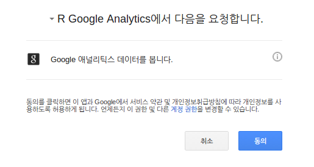
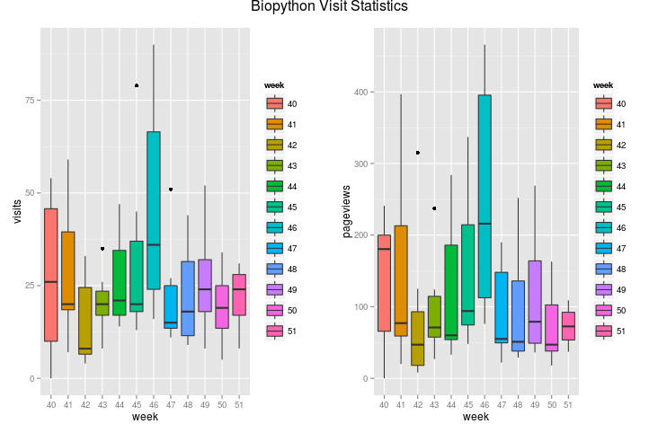

참조 - http://datum.io/r에서-google-analytics-데이터-사용하기/

# 데이터 소개


# RGA 설치

```{r}
#install.packages("devtools")
#library(devtools)
#install_github("rga", "skardhamar") 
#library(rga)
#rga.open(instance = "ga")
```

# 권한획득

 * 웹페이지가 뜨고(gmail에 로그인되어 있을 것), 권한획득을 허용하면
 * 엑세스 문자열을 하나 얻는다
 * 그러면 그 문자열을 복사해서, 콘솔창에 (RGA가 입력을 기다리고 있음) 입력한다.
 
 

# 데이터 가져오기

```{r}
#ga$getProfiles()

#id <- '콘솔창에 나온 아이디'
#start.date <- "2014-09-29"
#end.date <- "2014-12-19"

#gatest<-ga$getData(id,batch = TRUE, walk = TRUE, start.date, end.date, dimensions = "ga:date, ga:week", metrics = "ga:visits,ga:pageviews")

# 계속 쓸 수 있도록 저장해놓자.
#write.csv(gatest, './gatest.csv')

# 그리고 다시 로딩
gatest <- read.csv('./gatest.csv')
                   
# 데이터 확인                   
attributes(gatest) 
head(gatest)
```

# 통계치 살펴보기
```{r}
# 기초 통계량
summary(gatest[,c(-1, -2)]) 
# 히스토그램(분포)
apply(gatest[,c(-1, -2)], 2, hist) 
```

# 주별 분포 boxplot 보기
```{r}
#install.packages("ggplot2")
#install.packages("grid")
#install.packages("gridExtra")
library(ggplot2) 
library(grid) 
library(gridExtra)

p1 <- ggplot(gatest, aes(x=week, y=visits, fill=week)) + geom_boxplot() 
p2 <- ggplot(gatest, aes(x=week, y=pageviews, fill=week)) + geom_boxplot() 
#grid.arrange(p1, p2, ncol = 2, main = "Biopython Visit Statistics")
```

